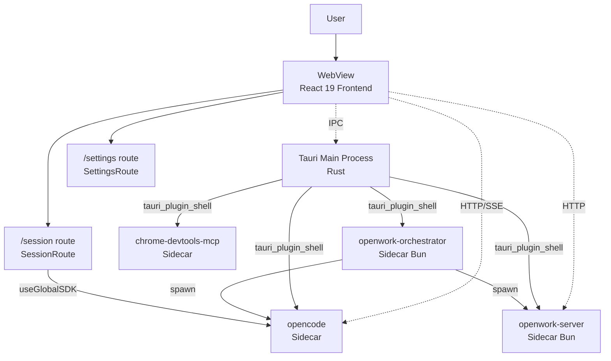
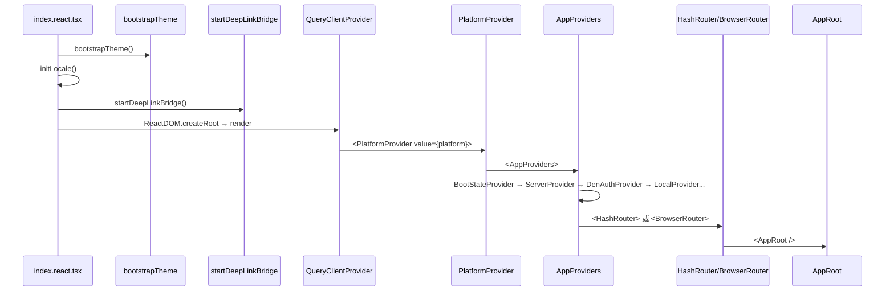
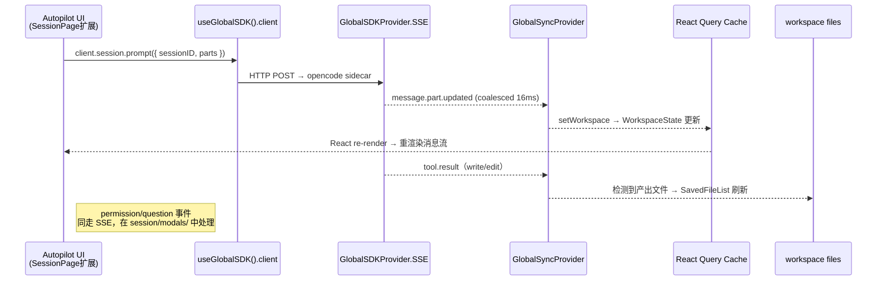

# 00 · 总体设计

> 本文档以代码为唯一信息源，对仓库 `harnesswork/` 中以 **OpenWork 平台 + 嵌入式星静（Xingjing）** 为核心的整体形态做一次系统性勾勒。所有结论均可在代码中直接定位；不引用任何已有 md。
>
> **重要**：v0.12.0 已完成 SolidJS → React 19 全量迁移，本文档已同步更新为 React 19 实际代码状态。迁移完整符号映射见 [./audit-react-migration.md](./audit-react-migration.md)。
>
> 本批文档不覆盖：团队版、焦点模式、`xingjing-server`（Go 后端）。

## 1. 产品定位与本批范围

OpenWork 是一款基于 Tauri 2.x 的桌面 / Web 双形态 AI 工作台。在 [`apps/desktop/src-tauri/tauri.conf.json`](file:///Users/umasuo_m3pro/Desktop/startup/xingjing/harnesswork/apps/desktop/src-tauri/tauri.conf.json#L1-L5) 中真实定义：

| 字段 | 值 |
|---|---|
| `productName` | `OpenWork` |
| `version` | `0.12.0` |
| `identifier` | `com.differentai.openwork` |
| `app.windows[0]` | `1180 × 820`，可调整大小 |
| 深度链接 | `openwork://`（`plugins.deep-link.desktop.schemes`） |

**星静（Xingjing）** 是构建在 OpenWork 之上的「AI 产品工程平台」前端模块。v0.12.0 迁移后，原 `apps/app/src/app/xingjing/` 目录**已完全移除**，独立 `/xingjing` 路由不再存在。星静将重新设计为**集成进 OpenWork 原生 React 页面**（`/session`、`/settings` 等现有路由），不再以独立路由挂载。本批文档覆盖星静独立版的 7 个前端功能模块，以及 OpenWork 平台 9 大核心子系统。

## 2. 系统拓扑

OpenWork 不是一个普通的 Tauri 单进程应用，而是 **Tauri 主进程 + 多个独立 Sidecar 子进程** 的多进程拓扑。所有 Sidecar 在 [`tauri.conf.json#L43-L50`](file:///Users/umasuo_m3pro/Desktop/startup/xingjing/harnesswork/apps/desktop/src-tauri/tauri.conf.json#L43-L50) 真实声明：



文本拓扑：

```
┌──────────────────────────────────────────────────────────┐
│  Tauri Webview  ←→  Tauri Main (Rust)                    │
│  React 19 + React Router 7 + Zustand + React Query       │
│         │                  │                              │
│         │  HTTP/SSE        │  tauri_plugin_shell.spawn    │
│         ↓                  ↓                              │
│   ┌─────┴─────────────────────────────────────────────┐  │
│   │ Sidecars（一应用多进程，tauri.conf.json#bundle）:  │  │
│   │   opencode            ← OpenCode SDK 的服务端     │  │
│   │   openwork-server     ← 工作区 / Token / 文档 API │  │
│   │   openwork-orchestr.. ← 多服务编排（Sandbox 用）  │  │
│   │   chrome-devtools-mcp ← 调试 MCP                  │  │
│   └───────────────────────────────────────────────────┘  │
└──────────────────────────────────────────────────────────┘
```

> **v0.12.0 变更**：`opencode-router`（Slack/Telegram 网关）已从 `tauri.conf.json` 的 `externalBin` 列表中移除；当前 sidecar 共 4 个（`opencode`、`openwork-server`、`openwork-orchestrator`、`chrome-devtools-mcp`）+ 1 个 `versions.json`。

更详细的进程职责、端口与拉起代码见 [./05g-openwork-process-runtime.md](./05g-openwork-process-runtime.md)。

## 3. 启动序列

按 [`apps/app/src/index.react.tsx`](file:///Users/umasuo_m3pro/Desktop/startup/xingjing/harnesswork/apps/app/src/index.react.tsx) 的实际执行顺序：



- 桌面端使用 `HashRouter`，Web 使用 `BrowserRouter`（[`index.react.tsx#L35`](file:///Users/umasuo_m3pro/Desktop/startup/xingjing/harnesswork/apps/app/src/index.react.tsx#L35)）。
- Provider 链嵌套见 [`providers.tsx#L62-L77`](file:///Users/umasuo_m3pro/Desktop/startup/xingjing/harnesswork/apps/app/src/react-app/shell/providers.tsx#L62-L77)。详细每层职责见 [./05h-openwork-state-architecture.md](./05h-openwork-state-architecture.md)。

## 4. 模块矩阵（星静独立版 7 个文档化模块）

> **v0.12.0 重要变更**：原 `apps/app/src/app/xingjing/` 目录**已完全移除**，所有旧入口路径不再存在。星静将重新设计为**集成进 OpenWork 原生 React 页面**，不再以独立路由或独立目录存在。详见 [./audit-react-migration.md](./audit-react-migration.md)。

| 模块 | 文档 | 新集成方式（待实现） |
|---|---|---|
| 产品壳层 | [./10-product-shell.md](./10-product-shell.md) | 复用 `DenSigninGate` + workspace 切换，无独立壳层 |
| Autopilot | [./30-autopilot.md](./30-autopilot.md) | 集成进 [`shell/session-route.tsx`](file:///Users/umasuo_m3pro/Desktop/startup/xingjing/harnesswork/apps/app/src/react-app/shell/session-route.tsx)，复用 `SessionPage` |
| Agent Workshop | [./40-agent-workshop.md](./40-agent-workshop.md) | 扩展 `/settings/extensions`（[`domains/settings/`](file:///Users/umasuo_m3pro/Desktop/startup/xingjing/harnesswork/apps/app/src/react-app/domains/settings)） |
| 产品模式 | [./50-product-mode.md](./50-product-mode.md) | workspace preset + session sidebar 面板扩展 |
| 知识库 | [./60-knowledge-base.md](./60-knowledge-base.md) | workspace 文件（`.opencode/docs/`）+ OpenCode 内存机制 |
| 评估 | [./70-review.md](./70-review.md) | `/settings/xingjing/review` tab（扩展 `SettingsRoute`） |
| 设置 | [./80-settings.md](./80-settings.md) | `/settings/xingjing` tab（扩展 `SettingsRoute`） |

## 5. 核心设计原则（仅折射代码事实）

| 原则 | 代码证据 |
|---|---|
| **多进程 Sidecar 架构** | [`tauri.conf.json#L37-L43`](file:///Users/umasuo_m3pro/Desktop/startup/xingjing/harnesswork/apps/desktop/src-tauri/tauri.conf.json#L37-L43) 声明 4 个 sidecar；[`lib.rs`](file:///Users/umasuo_m3pro/Desktop/startup/xingjing/harnesswork/apps/desktop/src-tauri/src/lib.rs) 在 `RunEvent::ExitRequested | RunEvent::Exit` 上调用 `stop_managed_services` |
| **SDK-First** | 前端依赖 `@opencode-ai/sdk` ^1.4.9（[`package.json#L45`](file:///Users/umasuo_m3pro/Desktop/startup/xingjing/harnesswork/apps/app/package.json#L45)），从不自实现 OpenCode 协议；统一通过 [`createOpencodeClient`](file:///Users/umasuo_m3pro/Desktop/startup/xingjing/harnesswork/apps/app/src/react-app/kernel/global-sdk-provider.tsx) 创建客户端 |
| **SSE 单向事件流 + coalescing** | [`global-sdk-provider.tsx#L113-L202`](file:///Users/umasuo_m3pro/Desktop/startup/xingjing/harnesswork/apps/app/src/react-app/kernel/global-sdk-provider.tsx#L113-L202) 用一个 `coalesced: Map<string, number>` 与 16ms 的 setTimeout 把同 key 事件折叠 |
| **Provider 链式注入** | [`providers.tsx#L62-L77`](file:///Users/umasuo_m3pro/Desktop/startup/xingjing/harnesswork/apps/app/src/react-app/shell/providers.tsx#L62-L77) 多层 Provider 链取代全局单例 |
| **Workspace 第一公民** | 工作区 ID 进入大量 SDK 调用：见 `mcp.status({ directory })`、`lsp.status({ directory })`、`vcs.get({ directory })`（[`global-sync-provider.tsx`](file:///Users/umasuo_m3pro/Desktop/startup/xingjing/harnesswork/apps/app/src/react-app/kernel/global-sync-provider.tsx)） |
| **文件即配置** | Skill / Agent / Command 通过 server-v2 managed-resource-service 文件路径正则识别（[`apps/server-v2/src/services/`](file:///Users/umasuo_m3pro/Desktop/startup/xingjing/harnesswork/apps/server-v2/src/services)） |
| **React 19 + Zustand + React Query** | Zustand 管全局单例状态（[`kernel/store.ts`](file:///Users/umasuo_m3pro/Desktop/startup/xingjing/harnesswork/apps/app/src/react-app/kernel/store.ts)）；React Query 管服务端状态（[`infra/query-client.ts`](file:///Users/umasuo_m3pro/Desktop/startup/xingjing/harnesswork/apps/app/src/react-app/infra)）；SolidJS 已完全移除 |

## 6. 技术栈

### 前端（[`apps/app/package.json`](file:///Users/umasuo_m3pro/Desktop/startup/xingjing/harnesswork/apps/app/package.json)）

| 类别 | 依赖 |
|---|---|
| 框架 | `react` ^19.1.1、`react-dom` ^19.1.1、`react-router-dom` ^7.14.1 |
| 全局状态 | `zustand` ^5.0.12 |
| 服务端状态 | `@tanstack/react-query` ^5.90.3 |
| 虚拟列表 | `@tanstack/react-virtual` ^3.13.23 |
| OpenCode | `@opencode-ai/sdk` ^1.4.9、`ai` ^6.0.146（Vercel AI SDK） |
| Tauri | `@tauri-apps/api` ^2.0.0、`plugin-deep-link`、`plugin-dialog`、`plugin-http`、`plugin-opener`、`plugin-process`、`plugin-updater` |
| UI | `@openwork/ui`（workspace）、`tailwindcss` ^4.x、`lucide-react` ^0.577.0、`@radix-ui/colors` |
| 编辑器 | `@codemirror/*`、`@lexical/react`、`marked`、`dompurify` |
| 工具 | `js-yaml`、`jsonc-parser`、`fuzzysort` |

### 桌面（Tauri Rust）

依赖与命令注册见 [`lib.rs#L1-L60`](file:///Users/umasuo_m3pro/Desktop/startup/xingjing/harnesswork/apps/desktop/src-tauri/src/lib.rs#L1-L60)。Tauri 2 + `tauri_plugin_shell` 用于 sidecar 拉起。

### Sidecar 进程

| Sidecar | 仓库 | 入口 | 默认监听 |
|---|---|---|---|
| `openwork-server` | [`apps/server/`](file:///Users/umasuo_m3pro/Desktop/startup/xingjing/harnesswork/apps/server) | [`src/cli.ts`](file:///Users/umasuo_m3pro/Desktop/startup/xingjing/harnesswork/apps/server/src/cli.ts) | `127.0.0.1:8787`（[`config.ts#L47-L48`](file:///Users/umasuo_m3pro/Desktop/startup/xingjing/harnesswork/apps/server/src/config.ts#L47-L48)） |
| `opencode-router` | [`apps/opencode-router/`](file:///Users/umasuo_m3pro/Desktop/startup/xingjing/harnesswork/apps/opencode-router) | [`src/cli.ts`](file:///Users/umasuo_m3pro/Desktop/startup/xingjing/harnesswork/apps/opencode-router/src/cli.ts) | health `:3005`（`OPENCODE_ROUTER_HEALTH_PORT`） |
| `openwork-orchestrator` | [`apps/orchestrator/`](file:///Users/umasuo_m3pro/Desktop/startup/xingjing/harnesswork/apps/orchestrator) | [`src/cli.ts`](file:///Users/umasuo_m3pro/Desktop/startup/xingjing/harnesswork/apps/orchestrator/src/cli.ts) | `--openwork-port`（默认 8787） |
| `opencode` | 外部（OpenCode 上游） | sidecar binary | 端口由 engine 动态分配 |
| `chrome-devtools-mcp` | sidecar binary | — | — |

## 7. 与 OpenWork 的实际集成点（星静侧汇总）

> **v0.12.0 重要变更**：旧的独立路由 `/xingjing`、`XingjingOpenworkContext`、`xingjing-bridge.ts`、`opencode-client.ts`（`setSharedClient`）等**均已随 SolidJS 代码一并移除**，不再存在。星静将通过 React hooks 直接使用 OpenWork 原生能力，无需 Bridge 单例。详细的新接缝设计见 [./06-openwork-bridge-contract.md](./06-openwork-bridge-contract.md)。

| 集成面 | 新方案（React 19） | OpenWork 侧入口 |
|---|---|---|
| SDK 客户端 | `useGlobalSDK().client` | [`kernel/global-sdk-provider.tsx`](file:///Users/umasuo_m3pro/Desktop/startup/xingjing/harnesswork/apps/app/src/react-app/kernel/global-sdk-provider.tsx) |
| 全局状态 | `useOpenworkStore()` | [`kernel/store.ts`](file:///Users/umasuo_m3pro/Desktop/startup/xingjing/harnesswork/apps/app/src/react-app/kernel/store.ts) |
| 会话/消息状态 | `useGlobalSync().getWorkspace(dir)` | [`kernel/global-sync-provider.tsx`](file:///Users/umasuo_m3pro/Desktop/startup/xingjing/harnesswork/apps/app/src/react-app/kernel/global-sync-provider.tsx) |
| Autopilot UI | 扩展 `SessionRoute` 页面 | [`shell/session-route.tsx`](file:///Users/umasuo_m3pro/Desktop/startup/xingjing/harnesswork/apps/app/src/react-app/shell/session-route.tsx) |
| Agent/Skill CRUD | server-v2 managed REST API | [`apps/server-v2/src/routes/managed.ts`](file:///Users/umasuo_m3pro/Desktop/startup/xingjing/harnesswork/apps/server-v2/src/routes/managed.ts) |
| 文件契约 | `.opencode/skills/`、`.opencode/agents/`、`.opencode/commands/` | server-v2 managed-resource-service 文件路径正则 |
| 设置扩展 | `XingjingSettingsPanel` tab | [`shell/settings-route.tsx`](file:///Users/umasuo_m3pro/Desktop/startup/xingjing/harnesswork/apps/app/src/react-app/shell/settings-route.tsx) |

## 8. 数据流（端到端典型链路）

下图展示「用户在 Autopilot 输入 prompt → Agent 执行工具 → 产出物落盘」的完整端到端流转：



## 9. 文档导航

### OpenWork 平台核心设计与实现

- [./05-openwork-platform-overview.md](./05-openwork-platform-overview.md) — 平台概览 + 核心设计哲学
- [./05a-openwork-session-message.md](./05a-openwork-session-message.md) — 会话与消息系统
- [./05b-openwork-skill-agent-mcp.md](./05b-openwork-skill-agent-mcp.md) — Skill/Agent/MCP/Command 子系统
- [./05c-openwork-workspace-fileops.md](./05c-openwork-workspace-fileops.md) — Workspace 与 file-ops
- [./05d-openwork-model-provider.md](./05d-openwork-model-provider.md) — 模型与 Provider
- [./05e-openwork-permission-question.md](./05e-openwork-permission-question.md) — 权限与问询事件
- [./05f-openwork-settings-persistence.md](./05f-openwork-settings-persistence.md) — 设置与持久化
- [./05g-openwork-process-runtime.md](./05g-openwork-process-runtime.md) — 多进程 Sidecar 运行时
- [./05h-openwork-state-architecture.md](./05h-openwork-state-architecture.md) — 前端状态架构
- [./06-openwork-bridge-contract.md](./06-openwork-bridge-contract.md) — 对星静的对接契约

### 星静独立版前端模块

- [./10-product-shell.md](./10-product-shell.md) — 产品壳层
- [./30-autopilot.md](./30-autopilot.md) — Autopilot
- [./40-agent-workshop.md](./40-agent-workshop.md) — Agent / Skill 工作台
- [./50-product-mode.md](./50-product-mode.md) — 产品模式
- [./60-knowledge-base.md](./60-knowledge-base.md) — 产品知识库
- [./70-review.md](./70-review.md) — 运营评估
- [./80-settings.md](./80-settings.md) — 设置
