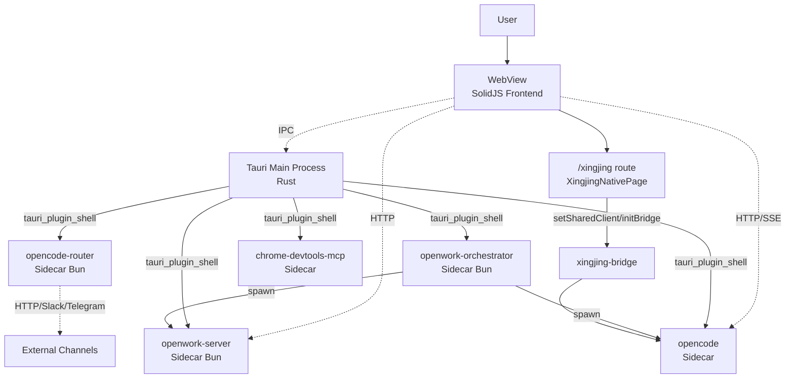
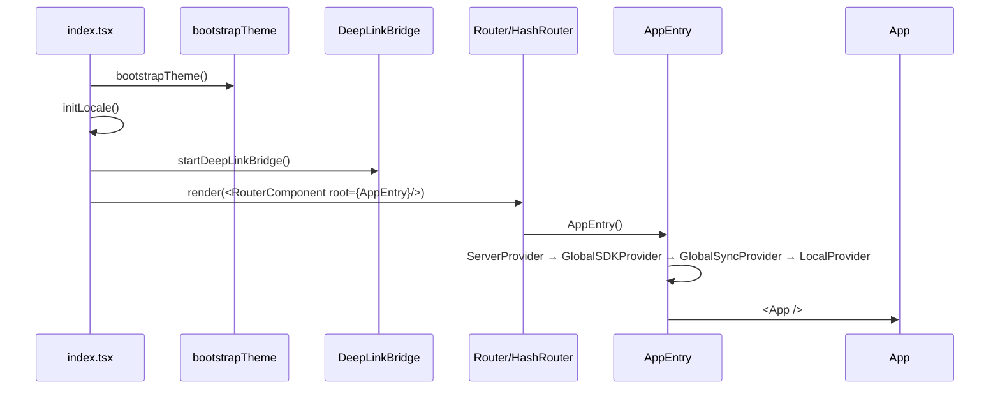
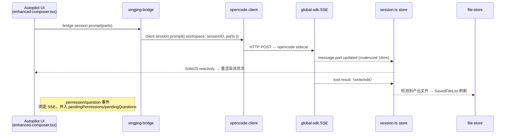

# 00 · 总体设计

> 本文档以代码为唯一信息源，对仓库 `harnesswork/` 中以 **OpenWork 平台 + 嵌入式星静（Xingjing）独立版前端** 为核心的整体形态做一次系统性勾勒。所有结论均可在代码中直接定位；不引用任何已有 md。
>
> 本批文档不覆盖：团队版（`pages/team/`）、焦点模式（`pages/solo/focus/`）、`xingjing-server`（Go 后端）。

## 1. 产品定位与本批范围

OpenWork 是一款基于 Tauri 2.x 的桌面 / Web 双形态 AI 工作台。在 [`apps/desktop/src-tauri/tauri.conf.json`](file:///Users/umasuo_m3pro/Desktop/startup/xingjing/harnesswork/apps/desktop/src-tauri/tauri.conf.json#L3-L5) 中真实定义：

| 字段 | 值 |
|---|---|
| `productName` | `OpenWork` |
| `version` | `0.11.201` |
| `identifier` | `com.differentai.openwork` |
| `app.windows[0]` | `1180 × 820`，可调整大小 |
| 深度链接 | `openwork://`（[`tauri.conf.json#L56-L62`](file:///Users/umasuo_m3pro/Desktop/startup/xingjing/harnesswork/apps/desktop/src-tauri/tauri.conf.json#L56-L62)） |

**星静（Xingjing）** 是构建在 OpenWork 之上的「AI 产品工程平台」前端模块，源代码完整托管于 [`apps/app/src/app/xingjing/`](file:///Users/umasuo_m3pro/Desktop/startup/xingjing/harnesswork/apps/app/src/app/xingjing)，通过路由 `/xingjing` 直接挂载，无 iframe（见 [`index.tsx#L172-L174`](file:///Users/umasuo_m3pro/Desktop/startup/xingjing/harnesswork/apps/app/src/index.tsx#L172-L174)）。本批 **17 份**文档只覆盖星静**独立版（Solo Edition）**的 7 个前端模块，以及它所依赖的 OpenWork 平台 9 大核心子系统。

## 2. 系统拓扑

OpenWork 不是一个普通的 Tauri 单进程应用，而是 **Tauri 主进程 + 多个独立 Sidecar 子进程** 的多进程拓扑。所有 Sidecar 在 [`tauri.conf.json#L43-L50`](file:///Users/umasuo_m3pro/Desktop/startup/xingjing/harnesswork/apps/desktop/src-tauri/tauri.conf.json#L43-L50) 真实声明：



文本拓扑：

```
┌──────────────────────────────────────────────────────────┐
│  Tauri Webview  ←→  Tauri Main (Rust)                    │
│         │                  │                              │
│         │  HTTP/SSE        │  tauri_plugin_shell.spawn    │
│         ↓                  ↓                              │
│   ┌─────┴─────────────────────────────────────────────┐  │
│   │ Sidecars (一应用多进程):                          │  │
│   │   opencode            ← OpenCode SDK 的服务端     │  │
│   │   openwork-server     ← 工作区 / Token / 文档 API │  │
│   │   opencode-router     ← Slack / Telegram 网关     │  │
│   │   openwork-orchestr.. ← 多服务编排（Sandbox 用）  │  │
│   │   chrome-devtools-mcp ← 调试 MCP                  │  │
│   └───────────────────────────────────────────────────┘  │
└──────────────────────────────────────────────────────────┘
```

更详细的进程职责、端口与拉起代码见 [./05g-openwork-process-runtime.md](./05g-openwork-process-runtime.md)。

## 3. 启动序列

按 [`apps/app/src/index.tsx`](file:///Users/umasuo_m3pro/Desktop/startup/xingjing/harnesswork/apps/app/src/index.tsx) 的实际执行顺序：



- 桌面端使用 `HashRouter`，Web 使用 `Router`（[`index.tsx#L86`](file:///Users/umasuo_m3pro/Desktop/startup/xingjing/harnesswork/apps/app/src/index.tsx#L86)）。
- 4 层 Provider 嵌套见 [`entry.tsx#L41-L51`](file:///Users/umasuo_m3pro/Desktop/startup/xingjing/harnesswork/apps/app/src/app/entry.tsx#L41-L51)。详细每层职责见 [./05h-openwork-state-architecture.md](./05h-openwork-state-architecture.md)。

## 4. 模块矩阵（星静独立版 7 个文档化模块）

> 完整 Solo 入口集合在 [`pages/solo/`](file:///Users/umasuo_m3pro/Desktop/startup/xingjing/harnesswork/apps/app/src/app/xingjing/pages/solo) 下；其中 `focus/`、`build/`、`release/` 等不在本批覆盖。

| 模块 | 文档 | 入口 | 关键代码资产 |
|---|---|---|---|
| 产品壳层 | [./10-product-shell.md](./10-product-shell.md) | [`pages/auth/`](file:///Users/umasuo_m3pro/Desktop/startup/xingjing/harnesswork/apps/app/src/app/xingjing/pages/auth)、[`layouts/main-layout.tsx`](file:///Users/umasuo_m3pro/Desktop/startup/xingjing/harnesswork/apps/app/src/app/xingjing/components/layouts/main-layout.tsx) | `auth-service.ts`、`product-dir-structure.ts` |
| Autopilot | [./30-autopilot.md](./30-autopilot.md) | [`pages/solo/autopilot/`](file:///Users/umasuo_m3pro/Desktop/startup/xingjing/harnesswork/apps/app/src/app/xingjing/pages/solo/autopilot) | `enhanced-composer.tsx`、`autopilot-executor.ts` |
| Agent Workshop | [./40-agent-workshop.md](./40-agent-workshop.md) | [`pages/solo/agent-workshop/`](file:///Users/umasuo_m3pro/Desktop/startup/xingjing/harnesswork/apps/app/src/app/xingjing/pages/solo/agent-workshop) | `agent-registry.ts`、`skill-registry.ts` |
| 产品模式 | [./50-product-mode.md](./50-product-mode.md) | [`pages/solo/product/`](file:///Users/umasuo_m3pro/Desktop/startup/xingjing/harnesswork/apps/app/src/app/xingjing/pages/solo/product) | `file-store.ts`、`insight-executor.ts`、`requirement-dev-bridge.ts` |
| 知识库 | [./60-knowledge-base.md](./60-knowledge-base.md) | [`pages/solo/knowledge/`](file:///Users/umasuo_m3pro/Desktop/startup/xingjing/harnesswork/apps/app/src/app/xingjing/pages/solo/knowledge) | `knowledge-index.ts`、`knowledge-scanner.ts`、`knowledge-behavior.ts` |
| 评估 | [./70-review.md](./70-review.md) | [`pages/solo/review/`](file:///Users/umasuo_m3pro/Desktop/startup/xingjing/harnesswork/apps/app/src/app/xingjing/pages/solo/review) | `components/common/echarts.tsx` |
| 设置 | [./80-settings.md](./80-settings.md) | [`pages/settings/`](file:///Users/umasuo_m3pro/Desktop/startup/xingjing/harnesswork/apps/app/src/app/xingjing/pages/settings) | `types/settings.ts`、`utils/defaults.ts` |

## 5. 核心设计原则（仅折射代码事实）

| 原则 | 代码证据 |
|---|---|
| **多进程 Sidecar 架构** | [`tauri.conf.json#L43-L50`](file:///Users/umasuo_m3pro/Desktop/startup/xingjing/harnesswork/apps/desktop/src-tauri/tauri.conf.json#L43-L50) 声明 5 个 sidecar；[`lib.rs#L124-L137`](file:///Users/umasuo_m3pro/Desktop/startup/xingjing/harnesswork/apps/desktop/src-tauri/src/lib.rs#L124-L137) 在 `RunEvent::Exit` 上统一关闭 |
| **SDK-First** | 前端依赖 `@opencode-ai/sdk`（[`package.json#L47`](file:///Users/umasuo_m3pro/Desktop/startup/xingjing/harnesswork/apps/app/package.json#L47)），从不自实现 OpenCode 协议；统一通过 [`createOpencodeClient`](file:///Users/umasuo_m3pro/Desktop/startup/xingjing/harnesswork/apps/app/src/app/context/global-sdk.tsx#L29) 创建客户端 |
| **SSE 单向事件流 + coalescing** | [`global-sdk.tsx#L82-L114`](file:///Users/umasuo_m3pro/Desktop/startup/xingjing/harnesswork/apps/app/src/app/context/global-sdk.tsx#L82-L114) 用一个 `coalesced: Map<string, number>` 与 16ms 的 setTimeout 把同 key 事件折叠 |
| **Provider 链式注入** | [`entry.tsx#L41-L51`](file:///Users/umasuo_m3pro/Desktop/startup/xingjing/harnesswork/apps/app/src/app/entry.tsx#L41-L51) 4 层 Provider 取代全局单例 |
| **Workspace 第一公民** | 工作区 ID 进入大量 SDK 调用：见 `mcp.status({ directory })`、`lsp.status({ directory })`、`vcs.get({ directory })`（[`global-sync.tsx#L159-L175`](file:///Users/umasuo_m3pro/Desktop/startup/xingjing/harnesswork/apps/app/src/app/context/global-sync.tsx#L159-L175)） |
| **文件即配置** | Skill / Agent / Command 全部通过文件路径正则识别：[`session.ts#L233-L241`](file:///Users/umasuo_m3pro/Desktop/startup/xingjing/harnesswork/apps/app/src/app/context/session.ts#L233-L241) 中 `skillPathPattern`、`commandPathPattern`、`agentPathPattern` |
| **桌面端早退避免 IPC 雪崩** | [`global-sync.tsx#L272-L283`](file:///Users/umasuo_m3pro/Desktop/startup/xingjing/harnesswork/apps/app/src/app/context/global-sync.tsx#L272-L283) 注释直陈：7 个并发 fetch 会压垮 macOS WKWebView 的 ipc:// 通道 |

## 6. 技术栈

### 前端（[`apps/app/package.json`](file:///Users/umasuo_m3pro/Desktop/startup/xingjing/harnesswork/apps/app/package.json)）

| 类别 | 依赖 |
|---|---|
| 框架 | `solid-js` ^1.9.0、`@solidjs/router` ^0.15.4 |
| OpenCode | `@opencode-ai/sdk` ^1.1.31 |
| Tauri | `@tauri-apps/api` ^2.0.0、`plugin-deep-link`、`plugin-dialog`、`plugin-fs`、`plugin-http`、`plugin-opener`、`plugin-process`、`plugin-shell`、`plugin-updater` |
| UI | `@openwork/ui`（workspace）、`tailwindcss` ^4.1.18、`lucide-solid`、`@radix-ui/colors` |
| 编辑器 | `@codemirror/*`、`marked`、`dompurify` |
| 图表 | `echarts` ^5.6.0 |
| 工具 | `js-yaml`、`jsonc-parser`、`fuzzysort`、`@tanstack/solid-virtual` |
| 事件 / 存储 | `@solid-primitives/event-bus`、`@solid-primitives/storage` |

### 桌面（Tauri Rust）

依赖与命令注册见 [`lib.rs#L1-L60`](file:///Users/umasuo_m3pro/Desktop/startup/xingjing/harnesswork/apps/desktop/src-tauri/src/lib.rs#L1-L60)。Tauri 2 + `tauri_plugin_shell` 用于 sidecar 拉起。

### Sidecar 进程

| Sidecar | 仓库 | 入口 | 默认监听 |
|---|---|---|---|
| `openwork-server` | [`apps/server/`](file:///Users/umasuo_m3pro/Desktop/startup/xingjing/harnesswork/apps/server) | [`src/cli.ts`](file:///Users/umasuo_m3pro/Desktop/startup/xingjing/harnesswork/apps/server/src/cli.ts) | `127.0.0.1:8787`（[`config.ts#L47-L48`](file:///Users/umasuo_m3pro/Desktop/startup/xingjing/harnesswork/apps/server/src/config.ts#L47-L48)） |
| `opencode-router` | [`apps/opencode-router/`](file:///Users/umasuo_m3pro/Desktop/startup/xingjing/harnesswork/apps/opencode-router) | [`src/cli.ts`](file:///Users/umasuo_m3pro/Desktop/startup/xingjing/harnesswork/apps/opencode-router/src/cli.ts) | health `:3005`（`OPENCODE_ROUTER_HEALTH_PORT`） |
| `openwork-orchestrator` | [`apps/orchestrator/`](file:///Users/umasuo_m3pro/Desktop/startup/xingjing/harnesswork/apps/orchestrator) | [`src/cli.ts`](file:///Users/umasuo_m3pro/Desktop/startup/xingjing/harnesswork/apps/orchestrator/src/cli.ts) | `--openwork-port`（默认 8787） |
| `opencode` | 外部（OpenCode 上游） | sidecar binary | 端口由 engine 动态分配 |
| `chrome-devtools-mcp` | sidecar binary | — | — |

## 7. 与 OpenWork 的实际集成点（星静侧汇总）

> 此处仅汇总「集成点清单」，详细的接缝契约见 [./06-openwork-bridge-contract.md](./06-openwork-bridge-contract.md)。

| 集成面 | 星静侧符号 | OpenWork 侧符号 |
|---|---|---|
| 路由挂载 | [`pages/xingjing-native.tsx`](file:///Users/umasuo_m3pro/Desktop/startup/xingjing/harnesswork/apps/app/src/app/pages/xingjing-native.tsx) | [`index.tsx#L181`](file:///Users/umasuo_m3pro/Desktop/startup/xingjing/harnesswork/apps/app/src/index.tsx#L181) `<Route path="/xingjing">` |
| 上下文注入 | `XingjingOpenworkContext`（[`stores/app-store.tsx`](file:///Users/umasuo_m3pro/Desktop/startup/xingjing/harnesswork/apps/app/src/app/xingjing/stores/app-store.tsx)） | [`app.tsx`](file:///Users/umasuo_m3pro/Desktop/startup/xingjing/harnesswork/apps/app/src/app/app.tsx) 中渲染 XingjingNativePage 时透传 24 个 props |
| OpenCode 客户端 | [`opencode-client.ts`](file:///Users/umasuo_m3pro/Desktop/startup/xingjing/harnesswork/apps/app/src/app/xingjing/services/opencode-client.ts) `setSharedClient` | `useGlobalSDK().client()` |
| Bridge 单例 | [`xingjing-bridge.ts`](file:///Users/umasuo_m3pro/Desktop/startup/xingjing/harnesswork/apps/app/src/app/xingjing/services/xingjing-bridge.ts) `initBridge` | OpenWork file-ops + workspace + session API |
| 事件流 | 经由 `XingjingOpenworkContext.events` | `useGlobalSDK().event` 的 `emitter` |
| 文件契约 | `.xingjing/dir-graph.yaml`、`.opencode/skills/`、`.opencode/agents/`、`.opencode/commands/` | OpenWork 扫描器识别（见 [`session.ts#L233-L241`](file:///Users/umasuo_m3pro/Desktop/startup/xingjing/harnesswork/apps/app/src/app/context/session.ts#L233-L241)） |

## 8. 数据流（端到端典型链路）

下图展示「用户在 Autopilot 输入 prompt → Agent 执行工具 → 产出物落盘」的完整端到端流转：



## 9. 文档导航

### OpenWork 平台核心设计与实现

- [./05-openwork-platform-overview.md](./05-openwork-platform-overview.md) — 平台概览 + 核心设计哲学
- [./05a-openwork-session-message.md](./05a-openwork-session-message.md) — 会话与消息系统
- [./05b-openwork-skill-agent-mcp.md](./05b-openwork-skill-agent-mcp.md) — Skill/Agent/MCP/Command 子系统
- [./05c-openwork-workspace-fileops.md](./05c-openwork-workspace-fileops.md) — Workspace 与 file-ops
- [./05d-openwork-model-provider.md](./05d-openwork-model-provider.md) — 模型与 Provider
- [./05e-openwork-permission-question.md](./05e-openwork-permission-question.md) — 权限与问询事件
- [./05f-openwork-settings-persistence.md](./05f-openwork-settings-persistence.md) — 设置与持久化
- [./05g-openwork-process-runtime.md](./05g-openwork-process-runtime.md) — 多进程 Sidecar 运行时
- [./05h-openwork-state-architecture.md](./05h-openwork-state-architecture.md) — 前端状态架构
- [./06-openwork-bridge-contract.md](./06-openwork-bridge-contract.md) — 对星静的对接契约

### 星静独立版前端模块

- [./10-product-shell.md](./10-product-shell.md) — 产品壳层
- [./30-autopilot.md](./30-autopilot.md) — Autopilot
- [./40-agent-workshop.md](./40-agent-workshop.md) — Agent / Skill 工作台
- [./50-product-mode.md](./50-product-mode.md) — 产品模式
- [./60-knowledge-base.md](./60-knowledge-base.md) — 产品知识库
- [./70-review.md](./70-review.md) — 运营评估
- [./80-settings.md](./80-settings.md) — 设置
