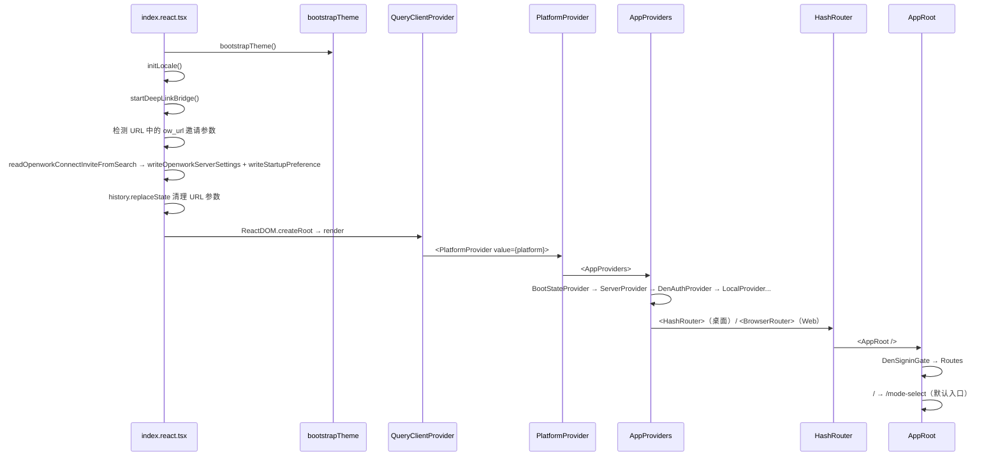
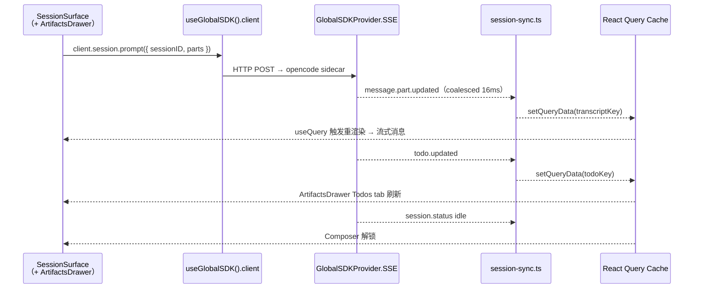

# 00 · 总体设计

> 本文档以代码为唯一信息源，对仓库 `harnesswork/` 中以 **OpenWork 平台 + 嵌入式星静（Xingjing）** 为核心的整体形态做一次系统性勾勒。所有结论均可在代码中直接定位。
>
> **当前状态**：v0.12.0 已完成双重迁移——SolidJS → React 19，以及 Tauri → Electron。本文档反映 master 分支的实际代码状态。
>
> - React 19 迁移符号映射见 [./audit-react-migration.md](./audit-react-migration.md)
> - 星静集成重设计见 [./10-product-shell.md](./10-product-shell.md)

---

## 1. 产品定位与本批范围

OpenWork 是一款桌面优先的 AI 工作台，当前版本为 `0.12.0`（`apps/desktop/package.json`）。

| 字段 | 值 |
|---|---|
| 包名 | `@openwork/desktop` |
| 产品名 | `OpenWork` |
| 标识符 | `com.differentai.openwork` |
| 版本 | `0.12.0` |
| 桌面壳层 | Electron 35（`apps/desktop/electron/main.mjs`） |
| 前端 | React 19 + React Router 7 + Zustand + React Query |
| 入口窗口 | `1180 × 820`，可调整大小 |
| Web 形态 | 同一前端代码库，`BrowserRouter`（桌面用 `HashRouter`） |

**星静（Xingjing）** 是构建在 OpenWork 之上的「AI 产品工程平台」领域模块，以 `apps/app/src/react-app/domains/xingjing/` 为代码基，通过直接调用 OpenWork React hooks 集成，不再持有独立路由或独立壳层。

---

## 2. 系统拓扑（Electron 架构）

OpenWork 是 **Electron 主进程 + 多个独立 Node.js 子进程** 的多进程拓扑。

```
┌────────────────────────────────────────────────────────────────┐
│  Electron Renderer（BrowserWindow）                             │
│  React 19 + React Router 7 + Zustand + React Query             │
│         │                        │                             │
│   contextBridge IPC              │  HTTP / SSE                 │
│   window.__OPENWORK_ELECTRON__   │                             │
│         │                        ↓                             │
│  ┌──────▼──────────────────────────────────────────────────┐   │
│  │ Electron Main Process（main.mjs）                        │   │
│  │   ipcMain.handle("openwork:desktop", handleDesktopInvoke)│   │
│  │   createRuntimeManager()（runtime.mjs）                  │   │
│  │     ├─ opencode sidecar       ← AI 会话引擎               │   │
│  │     ├─ openwork-server        ← 工作区 / 文件 / Token API │   │
│  │     ├─ openwork-orchestrator  ← 多服务编排（Sandbox 用）  │   │
│  │     └─ chrome-devtools-mcp   ← 调试 MCP                  │   │
│  └──────────────────────────────────────────────────────────┘   │
└────────────────────────────────────────────────────────────────┘
```

**IPC 层**：Renderer 通过 `preload.mjs` 的 `contextBridge.exposeInMainWorld` 注入 `window.__OPENWORK_ELECTRON__`，前端代码经 `apps/app/src/app/lib/desktop.ts` 的 Proxy 透明路由到正确实现：

```ts
// apps/app/src/app/lib/desktop.ts（简化）
function isElectronRuntime() {
  return typeof window !== "undefined" && window.__OPENWORK_ELECTRON__ != null;
}
// Proxy：优先 Electron IPC，回退 Tauri invoke（src-tauri 仍在但非主路径）
async function invokeElectronHelper<T>(command: string, ...args: unknown[]) {
  return window.__OPENWORK_ELECTRON__!.invokeDesktop!(command, ...args) as T;
}
```

**子进程管理**：从 Rust `Manager` struct 迁移到 JS `createRuntimeManager()`（`runtime.mjs`），通过 `node:child_process.spawn` 拉起各 sidecar。详见 [./05g-openwork-process-runtime.md](./05g-openwork-process-runtime.md)。

---

## 3. 启动序列

按 [`apps/app/src/index.react.tsx`](file:///Users/umasuo_m3pro/Desktop/startup/xingjing/harnesswork/apps/app/src/index.react.tsx) 的实际执行顺序：



- 桌面端使用 `HashRouter`，Web 使用 `BrowserRouter`（`index.react.tsx#L35`）。
- 路由默认入口 `/` 和 `*` 均指向 `/mode-select`（`app-root.tsx`）——用户选择 OpenWork 原生模式或星静模式后进入 `/session`。
- **邀请链接处理**：浏览器端通过含 `ow_url` / `ow_token` / `ow_startup` / `ow_auto_connect` 四参数的 URL 访问时，`index.react.tsx` 在渲染前将参数写入 localStorage，使后续 Provider 链直接读取到正确的 OpenWork 服务地址与 token。参数处理完毕后立即清理 URL，避免刷新重复写入。

---

## 4. 模块矩阵

### 4.1 OpenWork 平台核心子系统

| 子系统 | 文档 |
|---|---|
| 平台概览 | [./05-openwork-platform-overview.md](./05-openwork-platform-overview.md) |
| Session / Message | [./05a-openwork-session-message.md](./05a-openwork-session-message.md) |
| Skill / Agent / MCP / Command | [./05b-openwork-skill-agent-mcp.md](./05b-openwork-skill-agent-mcp.md) |
| Workspace 与 file-ops | [./05c-openwork-workspace-fileops.md](./05c-openwork-workspace-fileops.md) |
| 模型与 Provider | [./05d-openwork-model-provider.md](./05d-openwork-model-provider.md) |
| 权限与问询事件 | [./05e-openwork-permission-question.md](./05e-openwork-permission-question.md) |
| 设置与持久化 | [./05f-openwork-settings-persistence.md](./05f-openwork-settings-persistence.md) |
| 多进程 Electron 运行时 | [./05g-openwork-process-runtime.md](./05g-openwork-process-runtime.md) |
| 前端状态架构 | [./05h-openwork-state-architecture.md](./05h-openwork-state-architecture.md) |
| 星静对接契约 | [./06-openwork-bridge-contract.md](./06-openwork-bridge-contract.md) |

### 4.2 星静集成模块（原生集成模式）

> **设计原则**：星静不持有独立壳层，不新增顶级路由，不复制 OpenWork 已有 UI 组件。所有功能通过 workspace 配置、React hooks 组合、以及向现有页面注入扩展点实现。

| 模块 | 文档 | 集成方式 |
|---|---|---|
| 壳层 / 布局 | [./10-product-shell.md](./10-product-shell.md) | 无独立壳层；OpenWork `SessionPage` + 可选 `ArtifactsDrawer` 右侧扩展 |
| Autopilot | [./30-autopilot.md](./30-autopilot.md) | 直接复用 `SessionSurface` + `ReactSessionComposer` |
| Agent Workshop | [./40-agent-workshop.md](./40-agent-workshop.md) | `/settings/extensions` 视图扩展 |
| 产品模式 | [./50-product-mode.md](./50-product-mode.md) | workspace preset + `.opencode/commands/` 场景命令 |
| 知识库 | [./60-knowledge-base.md](./60-knowledge-base.md) | `.opencode/docs/` + OpenCode 内存机制 |
| 评估 | [./70-review.md](./70-review.md) | Skill 模板 + React Query session 聚合 |
| 设置 | [./80-settings.md](./80-settings.md) | 注入 `/settings/general`、`/settings/skills`、`/settings/extensions` |

---

## 5. 核心设计原则

| 原则 | 代码证据 |
|---|---|
| **Electron 壳层，JS 运行时** | `apps/desktop/electron/main.mjs`：`createRuntimeManager()` 用 `node:child_process.spawn` 管理所有 sidecar；`preload.mjs`：`contextBridge.exposeInMainWorld("__OPENWORK_ELECTRON__", ...)` |
| **SDK-First** | 前端依赖 `@opencode-ai/sdk` ^1.4.9（`package.json#L45`），通过 `createOpencodeClient` 统一出口 |
| **SSE 单向事件流 + Coalescing** | `global-sdk-provider.tsx#L113-L202`：`coalesced: Map<string, number>` + 16ms 帧节流 |
| **Provider 链式注入** | `providers.tsx#L62-L77`：`BootStateProvider → ServerProvider → DenAuthProvider → LocalProvider` |
| **Workspace 第一公民** | workspace ID 进入所有 SDK 调用；星静的「产品」 = OpenWork 的「workspace」 |
| **文件即配置** | Skill / Agent / Command 通过 `server-v2` managed-resource-service 文件路径正则识别 |
| **不重复造轮子** | 星静 hooks 组合 OpenWork 内置 hooks，不自建 SSE、不自建状态管理、不复制 UI 组件 |

---

## 6. 技术栈

### 前端（`apps/app/package.json`）

| 类别 | 依赖 |
|---|---|
| 框架 | `react` ^19.1.1、`react-dom` ^19.1.1、`react-router-dom` ^7.14.1 |
| 全局状态 | `zustand` ^5.0.12 |
| 服务端状态 | `@tanstack/react-query` ^5.90.3 |
| 虚拟列表 | `@tanstack/react-virtual` ^3.13.23 |
| OpenCode SDK | `@opencode-ai/sdk` ^1.4.9、`ai` ^6.0.146（Vercel AI SDK） |
| UI | `@openwork/ui`、`tailwindcss` ^4.x、`lucide-react` ^0.577.0、`@radix-ui/colors` |
| 编辑器 | `@codemirror/*`、`@lexical/react`、`marked`、`dompurify` |

### 桌面壳层（Electron）

| 文件 | 作用 |
|---|---|
| `apps/desktop/electron/main.mjs` | Electron 主进程；`BrowserWindow` 创建；`ipcMain.handle` 注册；`createRuntimeManager()` 调用 |
| `apps/desktop/electron/preload.mjs` | `contextBridge.exposeInMainWorld("__OPENWORK_ELECTRON__", ...)`；暴露 `invokeDesktop`、`shell`、`migration`、`updater`、`meta` |
| `apps/desktop/electron/runtime.mjs` | `createRuntimeManager()`；Node.js `child_process.spawn` 管理所有 sidecar；端口动态分配 |
| `apps/desktop/electron-builder.yml` | 打包配置（`appId: com.differentai.openwork`） |

> `apps/desktop/src-tauri/` 目录仍存在但非主路径；`desktop.ts` 通过 `isElectronRuntime()` / `isTauriRuntime()` 双检测，优先 Electron 路径。

### Sidecar 进程（均由 `runtime.mjs` 管理）

| Sidecar | 仓库 | 默认监听 |
|---|---|---|
| `opencode` | 外部（OpenCode 上游） | 端口动态分配（`createEngineState` → `port`） |
| `openwork-server` | `apps/server/` | `127.0.0.1:48000–51000`（`OPENWORK_SERVER_PORT_RANGE`） |
| `openwork-orchestrator` | `apps/orchestrator/` | `--openwork-port`（默认范围内动态分配） |
| `chrome-devtools-mcp` | sidecar binary | CDP 端口（`OPENWORK_ELECTRON_REMOTE_DEBUG_PORT`） |

---

## 7. 数据流（端到端典型链路）



---

## 8. 文档导航

### OpenWork 平台核心设计与实现

- [./05-openwork-platform-overview.md](./05-openwork-platform-overview.md) — 平台概览 + 核心设计哲学
- [./05a-openwork-session-message.md](./05a-openwork-session-message.md) — 会话与消息系统
- [./05b-openwork-skill-agent-mcp.md](./05b-openwork-skill-agent-mcp.md) — Skill/Agent/MCP/Command 子系统
- [./05c-openwork-workspace-fileops.md](./05c-openwork-workspace-fileops.md) — Workspace 与 file-ops
- [./05d-openwork-model-provider.md](./05d-openwork-model-provider.md) — 模型与 Provider
- [./05e-openwork-permission-question.md](./05e-openwork-permission-question.md) — 权限与问询事件
- [./05f-openwork-settings-persistence.md](./05f-openwork-settings-persistence.md) — 设置与持久化
- [./05g-openwork-process-runtime.md](./05g-openwork-process-runtime.md) — 多进程 Electron 运行时
- [./05h-openwork-state-architecture.md](./05h-openwork-state-architecture.md) — 前端状态架构
- [./06-openwork-bridge-contract.md](./06-openwork-bridge-contract.md) — 星静对接契约

### 星静集成模块

- [./10-product-shell.md](./10-product-shell.md) — 壳层与布局（原生集成重设计）
- [./30-autopilot.md](./30-autopilot.md) — Autopilot
- [./40-agent-workshop.md](./40-agent-workshop.md) — Agent / Skill 工作台
- [./50-product-mode.md](./50-product-mode.md) — 产品模式
- [./60-knowledge-base.md](./60-knowledge-base.md) — 产品知识库
- [./70-review.md](./70-review.md) — 运营评估
- [./80-settings.md](./80-settings.md) — 设置
