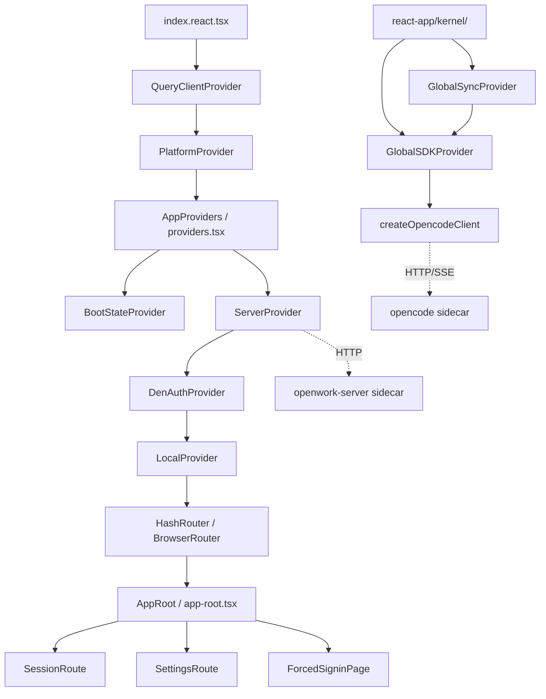

# 05 · OpenWork 平台概览

> 本文给出 OpenWork 平台的全景认知与**核心设计哲学**。范围限定在 [`apps/app/src/`](file:///Users/umasuo_m3pro/Desktop/startup/xingjing/harnesswork/apps/app/src)（除 `app/xingjing/`）、[`apps/desktop/src-tauri/`](file:///Users/umasuo_m3pro/Desktop/startup/xingjing/harnesswork/apps/desktop/src-tauri)、[`apps/server/`](file:///Users/umasuo_m3pro/Desktop/startup/xingjing/harnesswork/apps/server)、[`apps/orchestrator/`](file:///Users/umasuo_m3pro/Desktop/startup/xingjing/harnesswork/apps/orchestrator)、[`apps/opencode-router/`](file:///Users/umasuo_m3pro/Desktop/startup/xingjing/harnesswork/apps/opencode-router) 与 [`packages/`](file:///Users/umasuo_m3pro/Desktop/startup/xingjing/harnesswork/packages) 下与运行时相关的实现。

## 1. 平台定位与产品边界

由 [`apps/app/package.json`](file:///Users/umasuo_m3pro/Desktop/startup/xingjing/harnesswork/apps/app/package.json) 与 [`apps/desktop/src-tauri/tauri.conf.json`](file:///Users/umasuo_m3pro/Desktop/startup/xingjing/harnesswork/apps/desktop/src-tauri/tauri.conf.json)：

- 包名：`@openwork/app`
- 产品名：`OpenWork`
- 标识符：`com.differentai.openwork`
- 版本：`0.12.0`（v0.12.0 启动 Tauri → Electron 迁移，见 `commands::migration::migrate_to_electron`）
- 形态：Tauri 2 桌面应用 + Web 部署双形态（[`index.react.tsx#L35`](file:///Users/umasuo_m3pro/Desktop/startup/xingjing/harnesswork/apps/app/src/index.react.tsx#L35) 以 `isDesktopRuntime()` 选择 `HashRouter` 或 `BrowserRouter`）
- 入口窗口：`1180 × 820`，可调整大小（[`tauri.conf.json#L13-L19`](file:///Users/umasuo_m3pro/Desktop/startup/xingjing/harnesswork/apps/desktop/src-tauri/tauri.conf.json#L13-L19)）

## 2. 核心设计哲学（仅折射代码事实）

### 2.1 多进程 Sidecar 架构

OpenWork 与一般 Tauri 应用的最大区别：**主进程不内嵌业务逻辑，而是通过 Sidecar 子进程承载**。在 [`tauri.conf.json#L37-L43`](file:///Users/umasuo_m3pro/Desktop/startup/xingjing/harnesswork/apps/desktop/src-tauri/tauri.conf.json#L37-L43) 中声明 4 个二进制 + 1 个版本清单：

```json
"externalBin": [
  "sidecars/opencode",
  "sidecars/openwork-server",
  "sidecars/openwork-orchestrator",
  "sidecars/chrome-devtools-mcp",
  "sidecars/versions.json"
]
```

主进程仅承担「拉起 / 监控 / 关闭 / 转发」职责（[`lib.rs#L207`](file:///Users/umasuo_m3pro/Desktop/startup/xingjing/harnesswork/apps/desktop/src-tauri/src/lib.rs#L207) 在 `RunEvent::ExitRequested | RunEvent::Exit` 上调用 `stop_managed_services`）。详细子进程编排见 [./05g-openwork-process-runtime.md](./05g-openwork-process-runtime.md)。

### 2.2 SDK-First

前端**从不直接拼装 OpenCode 的 HTTP 协议**，全部通过 `@opencode-ai/sdk@^1.4.9` 统一出口（[`package.json#L45`](file:///Users/umasuo_m3pro/Desktop/startup/xingjing/harnesswork/apps/app/package.json#L45)）：

```ts
// react-app/kernel/global-sdk-provider.tsx#L93-L100
const [client, setClient] = useState<OpencodeClient>(() =>
  createOpencodeClient({
    baseUrl: server.url,
    headers,
    fetch: platform.fetch,
    throwOnError: true,
  }),
);
```

`Config`、`Session`、`Message`、`Part`、`Project`、`ProviderListResponse` 等顶层模型类型直接 import 自 `@opencode-ai/sdk/v2/client`（见 [`global-sync-provider.tsx#L13-L25`](file:///Users/umasuo_m3pro/Desktop/startup/xingjing/harnesswork/apps/app/src/react-app/kernel/global-sync-provider.tsx#L13-L25)）。

### 2.3 SSE 单向事件流 + Coalescing

OpenCode 服务端把 `session.status`、`message.part.updated`、`lsp.updated`、`mcp.tools.changed`、`todo.updated` 等以 SSE 推送给前端，前端在 [`global-sdk-provider.tsx#L113-L202`](file:///Users/umasuo_m3pro/Desktop/startup/xingjing/harnesswork/apps/app/src/react-app/kernel/global-sdk-provider.tsx#L113-L202) 实现两层折叠：

- **同 key 折叠**：`coalesced: Map<string, number>`（[`global-sdk-provider.tsx#L129`](file:///Users/umasuo_m3pro/Desktop/startup/xingjing/harnesswork/apps/app/src/react-app/kernel/global-sdk-provider.tsx#L129)）记录每个事件键最近一次在 `queue` 中的下标，新事件到来时把旧位置标 `undefined`；
- **16ms 帧节流**：`schedule()` 通过 `Math.max(0, 16 - elapsed)` 把 flush 对齐到下一个动画帧（[`global-sdk-provider.tsx#L161-L164`](file:///Users/umasuo_m3pro/Desktop/startup/xingjing/harnesswork/apps/app/src/react-app/kernel/global-sdk-provider.tsx#L161-L164)）；
- **8ms 事件循环 yield**：`if (Date.now() - yielded < 8) continue;`（[`global-sdk-provider.tsx#L188`](file:///Users/umasuo_m3pro/Desktop/startup/xingjing/harnesswork/apps/app/src/react-app/kernel/global-sdk-provider.tsx#L188)）防止 SSE 流长时间独占主线程。

### 2.4 Provider 链式注入

[`react-app/shell/providers.tsx#L62-L77`](file:///Users/umasuo_m3pro/Desktop/startup/xingjing/harnesswork/apps/app/src/react-app/shell/providers.tsx#L62-L77)：

```tsx
<BootStateProvider>
  <ServerProvider defaultUrl={defaultUrl}>
    <DesktopRuntimeBoot />
    <DenAuthProvider>
      <DesktopConfigProvider>
        <RestrictionNoticeProvider>
          <LocalProvider>
            <ReloadCoordinatorProvider>{children}</ReloadCoordinatorProvider>
          </LocalProvider>
        </RestrictionNoticeProvider>
      </DesktopConfigProvider>
    </DenAuthProvider>
    <MigrationPrompt />
  </ServerProvider>
</BootStateProvider>
```

注意：`GlobalSDKProvider` 与 `GlobalSyncProvider` 不在顶层 `AppProviders` 中，而是按需在各功能子树中挂载。每层只暴露 `useXxx()` 钩子，无可写全局变量。详见 [./05h-openwork-state-architecture.md](./05h-openwork-state-architecture.md)。

### 2.5 Workspace 第一公民

几乎每一次跨进程调用都显式带 `directory` / `workspace`：

```ts
// global-sync-provider.tsx#L202-L213
const refreshMcp = useCallback(
  async (directory?: string) => {
    const result = unwrap(
      await globalSDK.client.mcp.status({ directory }),
    ) as McpStatusMap;
    setState((previous) => ({
      ...previous,
      mcp: { ...previous.mcp, [keyFor(directory ?? "")]: result },
    }));
  },
  [globalSDK.client],
);
```

### 2.6 文件即配置

Skill / Command / Agent 由文件路径正则识别，不需要任何中央注册表。模式定义在 server-v2 managed-resource-service 中（[`apps/server-v2/src/services/`](file:///Users/umasuo_m3pro/Desktop/startup/xingjing/harnesswork/apps/server-v2/src/services)）：

```ts
const skillPathPattern = /[\\/]\.opencode[\\/](skill|skills)[\\/]/i;
const commandPathPattern = /[\\/]\.opencode[\\/](command|commands)[\\/]/i;
const agentPathPattern = /[\\/]\.opencode[\\/](agent|agents)[\\/]/i;
const opencodeConfigPattern = /(?:^|[\\/])opencode\.jsonc?\b/i;
const openworkConfigPattern = /[\\/]\.opencode[\\/]openwork\.json\b/i;
```

详见 [./05b-openwork-skill-agent-mcp.md](./05b-openwork-skill-agent-mcp.md)。

### 2.7 健康检查轮询

[`server-provider.tsx#L173`](file:///Users/umasuo_m3pro/Desktop/startup/xingjing/harnesswork/apps/app/src/react-app/kernel/server-provider.tsx#L173) 每 10 秒对活跃服务器执行一次健康检查（`window.setInterval(run, 10_000)`），并通过 `healthy` 状态字段驱动 SSE 订阅的开启与关闭。桌面端若活跃 URL 不包含 `/opencode`，则跳过健康检查（旧版端口缓存保护）。

## 3. 顶层目录骨架

### 3.1 [`apps/app/src/react-app/`](file:///Users/umasuo_m3pro/Desktop/startup/xingjing/harnesswork/apps/app/src/react-app)

React 19 应用主体，替代原有 SolidJS 代码树。

| 子目录 | 职责 | 代表文件 |
|---|---|---|
| `shell/` | 应用启动骨架：Provider 组装、路由根、启动 deep-link、调试日志 | [`providers.tsx`](file:///Users/umasuo_m3pro/Desktop/startup/xingjing/harnesswork/apps/app/src/react-app/shell/providers.tsx)、[`app-root.tsx`](file:///Users/umasuo_m3pro/Desktop/startup/xingjing/harnesswork/apps/app/src/react-app/shell/app-root.tsx) |
| `kernel/` | 全局上下文：`server-provider`、`global-sdk-provider`、`global-sync-provider`、`local-provider`、`platform` | [`global-sdk-provider.tsx`](file:///Users/umasuo_m3pro/Desktop/startup/xingjing/harnesswork/apps/app/src/react-app/kernel/global-sdk-provider.tsx) |
| `infra/` | 基础设施：React Query 客户端工厂 | [`query-client.ts`](file:///Users/umasuo_m3pro/Desktop/startup/xingjing/harnesswork/apps/app/src/react-app/infra/query-client.ts) |
| `domains/` | 业务域：`session`、`settings`、`workspace`、`cloud`、`connections`、`bundles`、`shell-feedback` | [`domains/`](file:///Users/umasuo_m3pro/Desktop/startup/xingjing/harnesswork/apps/app/src/react-app/domains) |
| `design-system/` | 设计系统组件 | [`design-system/`](file:///Users/umasuo_m3pro/Desktop/startup/xingjing/harnesswork/apps/app/src/react-app/design-system) |

### 3.2 [`apps/app/src/app/`](file:///Users/umasuo_m3pro/Desktop/startup/xingjing/harnesswork/apps/app/src/app)（兼容层 / 共享代码）

原 SolidJS 应用层，现保留为跨框架共享的工具与上下文代码。

| 子目录/文件 | 职责 |
|---|---|
| `context/` | 遗留上下文与 store（`session.ts`、`workspace.ts`、`extensions.ts` 等），部分被 React 层复用 |
| `lib/` | OpenCode/Tauri 适配层、deep-link 桥、deployment、perf-log、dev-log 等 |
| `theme.ts` | 主题引导（`bootstrapTheme()`） |
| `utils.ts` | 工具函数（含 `isDesktopRuntime()`） |
| `index.css` | 全局样式 |

### 3.3 [`apps/desktop/src-tauri/`](file:///Users/umasuo_m3pro/Desktop/startup/xingjing/harnesswork/apps/desktop/src-tauri)

Rust 端模块定义（[`lib.rs#L1-L14`](file:///Users/umasuo_m3pro/Desktop/startup/xingjing/harnesswork/apps/desktop/src-tauri/src/lib.rs#L1-L14)）：

| 模块 | 职责 |
|---|---|
| `bun_env` | Bun 运行时环境注入 |
| `commands` | Tauri 命令注册（`engine`、`orchestrator`、`openwork_server`、`workspace`、`skills`、`updater`、`window`、`config`、`misc`、`command_files`、`migration`、`desktop_bootstrap`） |
| `config` | 配置文件读写 |
| `desktop_bootstrap` | Den 登录引导配置（`requireSignin` 等） |
| `engine` | OpenCode engine 进程管理（[`EngineManager`](file:///Users/umasuo_m3pro/Desktop/startup/xingjing/harnesswork/apps/desktop/src-tauri/src/engine/manager.rs)） |
| `fs` | 文件系统底座 |
| `openwork_server` | openwork-server sidecar 管理 + Token 持久化（[`OpenworkServerManager`](file:///Users/umasuo_m3pro/Desktop/startup/xingjing/harnesswork/apps/desktop/src-tauri/src/openwork_server/manager.rs)） |
| `orchestrator` | openwork-orchestrator sidecar 管理 + Sandbox（[`OrchestratorManager`](file:///Users/umasuo_m3pro/Desktop/startup/xingjing/harnesswork/apps/desktop/src-tauri/src/orchestrator/manager.rs)） |
| `paths` | 路径工具（home_dir、prepended_path_env、sidecar_path_candidates） |
| `platform` | 平台特性 |
| `types` | 类型导出 |
| `updater` | 应用自更新 |
| `utils` | 工具（`now_ms`、`truncate_output`） |
| `workspace` | 工作区状态、Token、Authorized roots |

> **v0.12.0 注**：`lib.rs` 新增 `commands::migration::migrate_to_electron` 与 `write_migration_snapshot`，标志着 Tauri → Electron 迁移路径正式落地。

### 3.4 [`packages/`](file:///Users/umasuo_m3pro/Desktop/startup/xingjing/harnesswork/packages)

| 包 | 职责 |
|---|---|
| `packages/ui/` | 通用 UI 组件库（`@openwork/ui`，被 `apps/app` 工作区引用） |
| `packages/app/` | App 级共享代码（轻量） |
| `packages/docs/` | 文档站点 |

## 4. 整体分层

```
┌──────────────────────────────────────────────────────────────────┐
│  WebView Frontend (React 19)                                     │
│  ├─ index.react.tsx   ← QueryClient + Platform + Router 根       │
│  ├─ react-app/shell/providers.tsx  ← Boot/Server/Den/Local 层    │
│  ├─ react-app/shell/app-root.tsx   ← React Router Routes        │
│  ├─ react-app/kernel/  ← GlobalSDK / GlobalSync / Local         │
│  └─ react-app/domains/ ← 业务域（session/settings/workspace…）  │
└──────────────────────────────────────────────────────────────────┘
              │ @opencode-ai/sdk     │ @tauri-apps/api invoke
              ▼                      ▼
┌──────────────────────┐    ┌─────────────────────────────────┐
│ opencode (sidecar)   │    │ Tauri Main (Rust)               │
│ HTTP + SSE           │    │ ├─ commands::*                  │
│ 端口动态分配         │    │ ├─ EngineManager                │
└──────────────────────┘    │ ├─ OrchestratorManager          │
                            │ ├─ OpenworkServerManager        │
                            │ └─ commands::migration          │
                            │ tauri_plugin_shell.spawn        │
                            └─────────────┬───────────────────┘
                                          │
                  ┌───────────────────────┴────────────────────┐
                  ▼                                            ▼
         ┌────────────────────┐                       ┌─────────────────────┐
         │ openwork-server    │                       │ chrome-devtools-mcp │
         │ Bun, :8787         │                       │ sidecar binary      │
         │ /docs /workspace.. │                       └─────────────────────┘
         └────────────────────┘
                  │
                  ▼
         ┌────────────────────────┐
         │ openwork-orchestrator  │
         │ Bun, :--openwork-port  │
         │ 编排 opencode + server │
         └────────────────────────┘
```

## 5. 启动与生命周期

### 5.1 前端启动序列

[`apps/app/src/index.react.tsx`](file:///Users/umasuo_m3pro/Desktop/startup/xingjing/harnesswork/apps/app/src/index.react.tsx)：

1. `bootstrapTheme()`、`initLocale()`、`startDeepLinkBridge()`（[`index.react.tsx#L21-L23`](file:///Users/umasuo_m3pro/Desktop/startup/xingjing/harnesswork/apps/app/src/index.react.tsx#L21-L23)）
2. 校验 `#root`，写入 `data-openwork-deployment`（[`index.react.tsx#L25-L31`](file:///Users/umasuo_m3pro/Desktop/startup/xingjing/harnesswork/apps/app/src/index.react.tsx#L25-L31)）
3. 构建 `platform`（`createDefaultPlatform()`）与 `queryClient`（`getReactQueryClient()`）
4. 选择路由器：`isDesktopRuntime() ? HashRouter : BrowserRouter`（[`index.react.tsx#L35`](file:///Users/umasuo_m3pro/Desktop/startup/xingjing/harnesswork/apps/app/src/index.react.tsx#L35)）
5. `ReactDOM.createRoot(root).render(...)` 挂载整棵树

### 5.2 Provider 注入序列

完整 Provider 链（外层 → 内层）：

```
QueryClientProvider          ← React Query 全局缓存
  PlatformProvider           ← 平台抽象（fetch/openLink/restart/notify）
    AppProviders             ← providers.tsx 组合层
      BootStateProvider
      ServerProvider         ← URL 列表 + 健康检查（10s 轮询）
        DenAuthProvider      ← Den 登录态
          DesktopConfigProvider
            RestrictionNoticeProvider
              LocalProvider  ← UI 偏好与持久化（localStorage）
                ReloadCoordinatorProvider
                  Router (HashRouter | BrowserRouter)
                    AppRoot  ← React Router Routes
```

`defaultUrl` 解析规则（[`providers.tsx#L19-L39`](file:///Users/umasuo_m3pro/Desktop/startup/xingjing/harnesswork/apps/app/src/react-app/shell/providers.tsx#L19-L39)）：
- 桌面端 → `http://127.0.0.1:4096`
- `VITE_OPENWORK_URL` → `${url}/opencode`
- Web 生产同源 → `${origin}/opencode`
- 开发兜底 → `VITE_OPENCODE_URL` 或 `http://127.0.0.1:4096`

### 5.3 Sidecar 拉起

由 Rust 主进程通过 `tauri_plugin_shell.sidecar(...)` 拉起。例：

```rust
// commands/orchestrator.rs
let (command, command_label) = match app.shell().sidecar("openwork-orchestrator") {
    Ok(command) => (command, "sidecar:openwork-orchestrator".to_string()),
    Err(_) => (app.shell().command("openwork"), "path:openwork".to_string()),
};
```

应用退出时 [`lib.rs#L207`](file:///Users/umasuo_m3pro/Desktop/startup/xingjing/harnesswork/apps/desktop/src-tauri/src/lib.rs#L207) 在 `RunEvent::ExitRequested | RunEvent::Exit` 触发 `stop_managed_services` 统一清理各 manager。详细编排见 [./05g-openwork-process-runtime.md](./05g-openwork-process-runtime.md)。

### 5.4 路由初始化与跳转

```tsx
// react-app/shell/app-root.tsx#L95-L132
<Routes>
  <Route path="/signin" element={<ForcedSigninPage developerMode={false} />} />
  <Route path="/session" element={<SessionRoute />} />
  <Route path="/session/:sessionId" element={<SessionRoute />} />
  <Route path="/settings/*" element={<SettingsRoute />} />
  <Route path="/" element={<Navigate to="/session" replace />} />
  <Route path="*" element={<Navigate to="/session" replace />} />
</Routes>
```

默认落地 `/session`，`/signin` 由 `DenSigninGate` 在 `requireSignin: true` 时强制跳转。

## 6. 技术栈与依赖矩阵

### 6.1 前端

引自 [`apps/app/package.json`](file:///Users/umasuo_m3pro/Desktop/startup/xingjing/harnesswork/apps/app/package.json)：

| 类别 | 主要依赖 |
|---|---|
| 框架 | `react@^19.1.1`、`react-dom@^19.1.1`、`react-router-dom@^7.14.1` |
| 状态 | `zustand@^5.0.12`、`@tanstack/react-query@^5.90.3` |
| OpenCode SDK | `@opencode-ai/sdk@^1.4.9` |
| Tauri | `@tauri-apps/api@^2.0.0` + `plugin-deep-link/dialog/http/opener/process/updater` |
| UI 组件 | `@openwork/ui`（workspace）、`lucide-react@^0.577.0`、`@radix-ui/colors@^3.0.0`、`@tanstack/react-virtual@^3.13.23` |
| 编辑器 | `@codemirror/{commands,lang-markdown,language,state,view}`、`@lexical/react@^0.35.0`、`marked@^17.0.1` |
| AI/Streaming | `ai@^6.0.146`、`@ai-sdk/react@^3.0.148`、`streamdown@^2.5.0` |
| 样式 | `tailwindcss@^4.1.18`（devDep，Vite 插件） |
| 工具 | `jsonc-parser@^3.2.1`、`fuzzysort@^3.1.0`、`react-markdown@^10.1.0`、`remark-gfm@^4.0.1` |

### 6.2 桌面 Rust 端

依赖见 [`apps/desktop/src-tauri/Cargo.toml`](file:///Users/umasuo_m3pro/Desktop/startup/xingjing/harnesswork/apps/desktop/src-tauri/Cargo.toml)：tauri 2、tauri-plugin-shell/dialog/fs/http/opener/process/updater/deep-link、json5、notify、walkdir、zip、ureq、gethostname、local-ip-address、uuid 等。

### 6.3 Sidecar 进程

| Sidecar | 实现语言 | 入口 | 默认端口 |
|---|---|---|---|
| `openwork-server` | Bun + TypeScript | [`src/cli.ts`](file:///Users/umasuo_m3pro/Desktop/startup/xingjing/harnesswork/apps/server/src/cli.ts) | 8787（[`config.ts#L47-L48`](file:///Users/umasuo_m3pro/Desktop/startup/xingjing/harnesswork/apps/server/src/config.ts#L47-L48)） |
| `openwork-orchestrator` | Bun + TypeScript | [`src/cli.ts`](file:///Users/umasuo_m3pro/Desktop/startup/xingjing/harnesswork/apps/orchestrator/src/cli.ts) | `--openwork-port`（默认 8787） |
| `opencode` | OpenCode 上游二进制 | sidecar binary | engine 动态分配 |
| `chrome-devtools-mcp` | sidecar binary | — | — |

## 7. 内部模块依赖图



## 8. 关键设计决策（折射代码注释 / 类型 / 命名）

| 决策 | 代码证据 |
|---|---|
| **桌面端不走 ServerProvider 多服务器机制中的旧端口缓存** | [`server-provider.tsx#L146-L153`](file:///Users/umasuo_m3pro/Desktop/startup/xingjing/harnesswork/apps/app/src/react-app/kernel/server-provider.tsx#L146-L153) 注释：旧缓存端口跨重启失效，跳过健康检查 |
| **不硬编码 4096 端口** | [`providers.tsx#L20`](file:///Users/umasuo_m3pro/Desktop/startup/xingjing/harnesswork/apps/app/src/react-app/shell/providers.tsx#L20) 仅在 `isDesktopRuntime()` 时使用 `127.0.0.1:4096` |
| **健康检查 10s 一次** | [`server-provider.tsx#L173`](file:///Users/umasuo_m3pro/Desktop/startup/xingjing/harnesswork/apps/app/src/react-app/kernel/server-provider.tsx#L173) `window.setInterval(run, 10_000)` |
| **SSE 流每 8ms yield 一次事件循环** | [`global-sdk-provider.tsx#L188`](file:///Users/umasuo_m3pro/Desktop/startup/xingjing/harnesswork/apps/app/src/react-app/kernel/global-sdk-provider.tsx#L188) |
| **SSE coalescing 16ms 帧对齐** | [`global-sdk-provider.tsx#L164`](file:///Users/umasuo_m3pro/Desktop/startup/xingjing/harnesswork/apps/app/src/react-app/kernel/global-sdk-provider.tsx#L164) `Math.max(0, 16 - elapsed)` |
| **Token 写入 LocalStorage `openwork.server.token`** | [`server-provider.tsx#L65-L70`](file:///Users/umasuo_m3pro/Desktop/startup/xingjing/harnesswork/apps/app/src/react-app/kernel/server-provider.tsx#L65-L70) `readOpenworkToken()` |
| **CSP 显式 null（允许内联脚本）** | [`tauri.conf.json#L21-L23`](file:///Users/umasuo_m3pro/Desktop/startup/xingjing/harnesswork/apps/desktop/src-tauri/tauri.conf.json#L21-L23) `"csp": null` |
| **v0.12.0 Tauri→Electron 迁移路径** | [`lib.rs#L26`](file:///Users/umasuo_m3pro/Desktop/startup/xingjing/harnesswork/apps/desktop/src-tauri/src/lib.rs#L26) `commands::migration::migrate_to_electron` |
| **DenSigninGate 强制登录门禁** | [`app-root.tsx#L32-L85`](file:///Users/umasuo_m3pro/Desktop/startup/xingjing/harnesswork/apps/app/src/react-app/shell/app-root.tsx#L32-L85) 读取 `desktop-bootstrap.json` 的 `requireSignin` |

## 9. 文档导航

→ [./05a-openwork-session-message.md](./05a-openwork-session-message.md) 会话与消息系统
→ [./05b-openwork-skill-agent-mcp.md](./05b-openwork-skill-agent-mcp.md) Skill/Agent/MCP/Command 子系统
→ [./05c-openwork-workspace-fileops.md](./05c-openwork-workspace-fileops.md) Workspace 与 file-ops
→ [./05d-openwork-model-provider.md](./05d-openwork-model-provider.md) 模型与 Provider
→ [./05e-openwork-permission-question.md](./05e-openwork-permission-question.md) 权限与问询事件
→ [./05f-openwork-settings-persistence.md](./05f-openwork-settings-persistence.md) 设置与持久化
→ [./05g-openwork-process-runtime.md](./05g-openwork-process-runtime.md) 多进程 Sidecar 运行时
→ [./05h-openwork-state-architecture.md](./05h-openwork-state-architecture.md) 前端状态架构
→ [./06-openwork-bridge-contract.md](./06-openwork-bridge-contract.md) 对星静的对接契约
