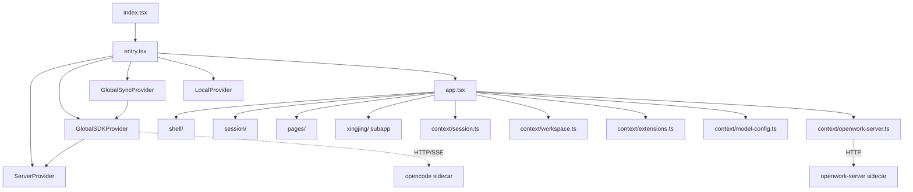

# 05 · OpenWork 平台概览

> 本文给出 OpenWork 平台的全景认知与**核心设计哲学**。范围限定在 [`apps/app/src/`](file:///Users/umasuo_m3pro/Desktop/startup/xingjing/harnesswork/apps/app/src)（除 `app/xingjing/`）、[`apps/desktop/src-tauri/`](file:///Users/umasuo_m3pro/Desktop/startup/xingjing/harnesswork/apps/desktop/src-tauri)、[`apps/server/`](file:///Users/umasuo_m3pro/Desktop/startup/xingjing/harnesswork/apps/server)、[`apps/orchestrator/`](file:///Users/umasuo_m3pro/Desktop/startup/xingjing/harnesswork/apps/orchestrator)、[`apps/opencode-router/`](file:///Users/umasuo_m3pro/Desktop/startup/xingjing/harnesswork/apps/opencode-router) 与 [`packages/`](file:///Users/umasuo_m3pro/Desktop/startup/xingjing/harnesswork/packages) 下与运行时相关的实现。

## 1. 平台定位与产品边界

由 [`apps/app/package.json#L1-L5`](file:///Users/umasuo_m3pro/Desktop/startup/xingjing/harnesswork/apps/app/package.json#L1-L5) 与 [`apps/desktop/src-tauri/tauri.conf.json#L3-L5`](file:///Users/umasuo_m3pro/Desktop/startup/xingjing/harnesswork/apps/desktop/src-tauri/tauri.conf.json#L3-L5)：

- 包名：`@openwork/app`
- 产品名：`OpenWork`
- 标识符：`com.differentai.openwork`
- 版本：`0.11.201`
- 形态：Tauri 2 桌面应用 + Web 部署双形态（[`index.tsx#L86`](file:///Users/umasuo_m3pro/Desktop/startup/xingjing/harnesswork/apps/app/src/index.tsx#L86) `HashRouter` 与 `Router` 二选一）
- 入口窗口：`1180 × 820`，可调整大小（[`tauri.conf.json#L13-L19`](file:///Users/umasuo_m3pro/Desktop/startup/xingjing/harnesswork/apps/desktop/src-tauri/tauri.conf.json#L13-L19)）

## 2. 核心设计哲学（仅折射代码事实）

### 2.1 多进程 Sidecar 架构

OpenWork 与一般 Tauri 应用的最大区别：**主进程不内嵌业务逻辑，而是通过 Sidecar 子进程承载**。在 [`tauri.conf.json#L43-L50`](file:///Users/umasuo_m3pro/Desktop/startup/xingjing/harnesswork/apps/desktop/src-tauri/tauri.conf.json#L43-L50) 中声明 5 个二进制 + 1 个版本清单：

```json
"externalBin": [
  "sidecars/opencode",
  "sidecars/openwork-server",
  "sidecars/opencode-router",
  "sidecars/openwork-orchestrator",
  "sidecars/chrome-devtools-mcp",
  "sidecars/versions.json"
]
```

主进程仅承担「拉起 / 监控 / 关闭 / 转发」职责（[`lib.rs#L124-L137`](file:///Users/umasuo_m3pro/Desktop/startup/xingjing/harnesswork/apps/desktop/src-tauri/src/lib.rs#L124-L137) 在 `RunEvent::Exit` 上调用 `stop_managed_services`）。详细子进程编排见 [./05g-openwork-process-runtime.md](./05g-openwork-process-runtime.md)。

### 2.2 SDK-First

前端**从不直接拼装 OpenCode 的 HTTP 协议**，全部通过 `@opencode-ai/sdk` 统一出口（[`package.json#L47`](file:///Users/umasuo_m3pro/Desktop/startup/xingjing/harnesswork/apps/app/package.json#L47)）：

```ts
// global-sdk.tsx#L28-L34
const [client, setClient] = createSignal(
  createOpencodeClient({
    baseUrl: server.url,
    fetch: platform.fetch,
    throwOnError: true,
  }),
);
```

`Config`、`Session`、`Message`、`Part`、`Project`、`ProviderListResponse` 等顶层模型类型直接 import 自 `@opencode-ai/sdk/v2/client`（见 [`global-sync.tsx#L7-L20`](file:///Users/umasuo_m3pro/Desktop/startup/xingjing/harnesswork/apps/app/src/app/context/global-sync.tsx#L7-L20)）。

### 2.3 SSE 单向事件流 + Coalescing

OpenCode 服务端把 `session.status`、`message.part.updated`、`lsp.updated`、`mcp.tools.changed`、`todo.updated` 等以 SSE 推送给前端，前端在 [`global-sdk.tsx#L75-L155`](file:///Users/umasuo_m3pro/Desktop/startup/xingjing/harnesswork/apps/app/src/app/context/global-sdk.tsx#L75-L155) 实现两层折叠：

- **同 key 折叠**：`coalesced: Map<string, number>`（[`global-sdk.tsx#L78`](file:///Users/umasuo_m3pro/Desktop/startup/xingjing/harnesswork/apps/app/src/app/context/global-sdk.tsx#L78)）记录每个事件键最近一次在 `queue` 中的下标，新事件到来时把旧位置标 `undefined`（[`global-sdk.tsx#L132-L138`](file:///Users/umasuo_m3pro/Desktop/startup/xingjing/harnesswork/apps/app/src/app/context/global-sdk.tsx#L132-L138)）；
- **16ms 帧节流**：`schedule()` 通过 `Math.max(0, 16 - elapsed)` 把 flush 对齐到下一个动画帧（[`global-sdk.tsx#L111-L115`](file:///Users/umasuo_m3pro/Desktop/startup/xingjing/harnesswork/apps/app/src/app/context/global-sdk.tsx#L111-L115)）。

下游的 `batch(() => emitter.emit(...))`（[`global-sdk.tsx#L103-L108`](file:///Users/umasuo_m3pro/Desktop/startup/xingjing/harnesswork/apps/app/src/app/context/global-sdk.tsx#L103-L108)）把多个事件合并到 SolidJS 的一次响应性循环中。

### 2.4 Provider 链式注入

[`entry.tsx#L41-L51`](file:///Users/umasuo_m3pro/Desktop/startup/xingjing/harnesswork/apps/app/src/app/entry.tsx#L41-L51)：

```tsx
<ServerProvider defaultUrl={defaultUrl}>
  <GlobalSDKProvider>
    <GlobalSyncProvider>
      <LocalProvider>
        <App />
      </LocalProvider>
    </GlobalSyncProvider>
  </GlobalSDKProvider>
</ServerProvider>
```

四层 Provider 替代全局单例，每层只暴露 `useXxx()` 钩子，无可写全局变量。详见 [./05h-openwork-state-architecture.md](./05h-openwork-state-architecture.md)。

### 2.5 Workspace 第一公民

几乎每一次跨进程调用都显式带 `directory` / `workspace`：

```ts
// global-sync.tsx#L159-L175
const refreshMcp = async (directory?: string) => {
  const result = unwrap(await globalSDK.client().mcp.status({ directory }));
  setGlobalStore("mcp", keyFor(directory ?? ""), result);
};
const refreshLsp = async (directory?: string) => { ... };
const refreshVcs = async (directory: string) => { ... };
```

### 2.6 文件即配置

Skill / Command / Agent 由文件路径正则识别，不需要任何中央注册表（[`session.ts#L233-L241`](file:///Users/umasuo_m3pro/Desktop/startup/xingjing/harnesswork/apps/app/src/app/context/session.ts#L233-L241)）：

```ts
const skillPathPattern = /[\\/]\.opencode[\\/](skill|skills)[\\/]/i;
const commandPathPattern = /[\\/]\.opencode[\\/](command|commands)[\\/]/i;
const agentPathPattern = /[\\/]\.opencode[\\/](agent|agents)[\\/]/i;
const opencodeConfigPattern = /(?:^|[\\/])opencode\.jsonc?\b/i;
const openworkConfigPattern = /[\\/]\.opencode[\\/]openwork\.json\b/i;
```

详见 [./05b-openwork-skill-agent-mcp.md](./05b-openwork-skill-agent-mcp.md)。

### 2.7 桌面端早退避免 IPC 雪崩

[`global-sync.tsx#L272-L283`](file:///Users/umasuo_m3pro/Desktop/startup/xingjing/harnesswork/apps/app/src/app/context/global-sync.tsx#L272-L283) 的注释直陈这条强制设计约束：

> 7 个并发 fetch 足以压垮 macOS WKWebView 的 ipc:// 通道 —— 日志里 "IPC custom protocol failed, Tauri will now use the postMessage interface instead" 刚好 ×7。

因此 `GlobalSyncProvider.refresh()` 在 `isTauriRuntime()` 时早退，桌面端走 engine 直连。

## 3. 顶层目录骨架

### 3.1 [`apps/app/src/app/`](file:///Users/umasuo_m3pro/Desktop/startup/xingjing/harnesswork/apps/app/src/app)

| 子目录/文件 | 职责 | 代表文件 |
|---|---|---|
| `entry.tsx` | 4 层 Provider 入口 | [`entry.tsx`](file:///Users/umasuo_m3pro/Desktop/startup/xingjing/harnesswork/apps/app/src/app/entry.tsx) |
| `app.tsx` | 主 App 组件，路由出口；内部装载顶部栏、侧边栏、各功能 Page | [`app.tsx`](file:///Users/umasuo_m3pro/Desktop/startup/xingjing/harnesswork/apps/app/src/app/app.tsx)（94KB） |
| `context/` | 全局上下文与 store：`server`、`global-sdk`、`global-sync`、`local`、`session`、`workspace`、`extensions`、`model-config`、`openwork-server`、`automations`、`updater`、`platform` | 详见 [§3.2](#32-context) |
| `pages/` | 顶层页面：`mode-select`、`xingjing-native` 等 | [`pages/`](file:///Users/umasuo_m3pro/Desktop/startup/xingjing/harnesswork/apps/app/src/app/pages) |
| `shell/` | 应用壳层（顶栏 / 侧边栏 / 命令面板） | [`shell/`](file:///Users/umasuo_m3pro/Desktop/startup/xingjing/harnesswork/apps/app/src/app/shell) |
| `session/` | 会话级 UI 组件 | [`session/`](file:///Users/umasuo_m3pro/Desktop/startup/xingjing/harnesswork/apps/app/src/app/session) |
| `components/` | 通用 UI 组件 | [`components/`](file:///Users/umasuo_m3pro/Desktop/startup/xingjing/harnesswork/apps/app/src/app/components) |
| `lib/` | OpenCode/Tauri 适配层、deep-link 桥、deployment、perf-log、dev-log 等 | [`lib/`](file:///Users/umasuo_m3pro/Desktop/startup/xingjing/harnesswork/apps/app/src/app/lib) |
| `workspace/` | Workspace 切换、解析、远端连接相关组件 | [`workspace/`](file:///Users/umasuo_m3pro/Desktop/startup/xingjing/harnesswork/apps/app/src/app/workspace) |
| `extensions/` | 扩展注册（Skill/Agent/MCP/Command 的 UI 入口） | [`extensions/`](file:///Users/umasuo_m3pro/Desktop/startup/xingjing/harnesswork/apps/app/src/app/extensions) |
| `automations/` | 调度任务 UI | [`automations/`](file:///Users/umasuo_m3pro/Desktop/startup/xingjing/harnesswork/apps/app/src/app/automations) |
| `bundles/` | 业务 bundle | [`bundles/`](file:///Users/umasuo_m3pro/Desktop/startup/xingjing/harnesswork/apps/app/src/app/bundles) |
| `connections/` | 远端连接管理 | [`connections/`](file:///Users/umasuo_m3pro/Desktop/startup/xingjing/harnesswork/apps/app/src/app/connections) |
| `app-settings/` | App 级设置 | [`app-settings/`](file:///Users/umasuo_m3pro/Desktop/startup/xingjing/harnesswork/apps/app/src/app/app-settings) |
| `state/` | 顶层状态切片 | [`state/`](file:///Users/umasuo_m3pro/Desktop/startup/xingjing/harnesswork/apps/app/src/app/state) |
| `system-state.ts` | 系统级状态 | [`system-state.ts`](file:///Users/umasuo_m3pro/Desktop/startup/xingjing/harnesswork/apps/app/src/app/system-state.ts) |
| `mcp.ts` | 顶层 MCP 入口 | [`mcp.ts`](file:///Users/umasuo_m3pro/Desktop/startup/xingjing/harnesswork/apps/app/src/app/mcp.ts) |
| `theme.ts` | 主题引导 | [`theme.ts`](file:///Users/umasuo_m3pro/Desktop/startup/xingjing/harnesswork/apps/app/src/app/theme.ts) |
| `types.ts` | 顶层类型 | [`types.ts`](file:///Users/umasuo_m3pro/Desktop/startup/xingjing/harnesswork/apps/app/src/app/types.ts) |
| `xingjing/` | 嵌入式星静子应用 | 见 [./10-product-shell.md](./10-product-shell.md) |

### 3.2 [`context/`](file:///Users/umasuo_m3pro/Desktop/startup/xingjing/harnesswork/apps/app/src/app/context)

| 文件 | 大小 | 职责 |
|---|---|---|
| `server.tsx` | 6.3 KB | 服务器 URL 列表、健康检查、`useServer()` |
| `global-sdk.tsx` | 4.9 KB | OpenCode SDK 客户端 + SSE 订阅 + coalescing |
| `global-sync.tsx` | 9.3 KB | 全局同步：config / provider / mcp / lsp / project |
| `local.tsx` | 2.1 KB | 本地 UI 偏好与持久化 |
| `session.ts` | 73.6 KB | 会话 / 消息 / 部件 / 待审 / 待问 store |
| `workspace.ts` | 146.4 KB | 工作区状态机 |
| `extensions.ts` | 52.6 KB | Skill/Agent/MCP/Command 注册与扫描 |
| `model-config.ts` | 42.9 KB | 模型与 Provider 配置 |
| `openwork-server.ts` | 10.6 KB | openwork-server REST 客户端 |
| `automations.ts` | 9.4 KB | 调度任务 |
| `sidebar-sessions.ts` | 8.2 KB | 侧边栏会话列表 |
| `platform.tsx` | 1.4 KB | 平台抽象（fetch / openLink / restart / notify / storage） |
| `updater.ts` | 1.4 KB | 自更新 |
| `sync.tsx` | 0.9 KB | 同步辅助 |
| `workspace-context.ts` | 0.7 KB | 工作区上下文 |

### 3.3 [`apps/desktop/src-tauri/`](file:///Users/umasuo_m3pro/Desktop/startup/xingjing/harnesswork/apps/desktop/src-tauri)

Rust 端模块定义（[`lib.rs#L1-L14`](file:///Users/umasuo_m3pro/Desktop/startup/xingjing/harnesswork/apps/desktop/src-tauri/src/lib.rs#L1-L14)）：

| 模块 | 职责 |
|---|---|
| `bun_env` | Bun 运行时环境注入 |
| `commands` | Tauri 命令注册（`engine`、`orchestrator`、`openwork_server`、`opencode_router`、`workspace`、`skills`、`scheduler`、`updater`、`window`、`config`、`misc`、`command_files`） |
| `config` | 配置文件读写 |
| `engine` | OpenCode engine 进程管理（[`EngineManager`](file:///Users/umasuo_m3pro/Desktop/startup/xingjing/harnesswork/apps/desktop/src-tauri/src/engine/manager.rs)） |
| `fs` | 文件系统底座 |
| `opencode_router` | opencode-router sidecar 管理（[`OpenCodeRouterManager`](file:///Users/umasuo_m3pro/Desktop/startup/xingjing/harnesswork/apps/desktop/src-tauri/src/opencode_router/manager.rs)） |
| `openwork_server` | openwork-server sidecar 管理 + Token 持久化（[`OpenworkServerManager`](file:///Users/umasuo_m3pro/Desktop/startup/xingjing/harnesswork/apps/desktop/src-tauri/src/openwork_server/manager.rs)） |
| `orchestrator` | openwork-orchestrator sidecar 管理 + Sandbox（[`OrchestratorManager`](file:///Users/umasuo_m3pro/Desktop/startup/xingjing/harnesswork/apps/desktop/src-tauri/src/orchestrator/manager.rs)） |
| `paths` | 路径工具（home_dir、prepended_path_env、sidecar_path_candidates） |
| `platform` | 平台特性 |
| `types` | 类型导出 |
| `updater` | 应用自更新 |
| `utils` | 工具（`now_ms`、`truncate_output`） |
| `workspace` | 工作区状态、Token、Authorized roots |

### 3.4 [`packages/`](file:///Users/umasuo_m3pro/Desktop/startup/xingjing/harnesswork/packages)

| 包 | 职责 |
|---|---|
| `packages/ui/` | 通用 UI 组件库（`@openwork/ui`，被 `apps/app` 工作区引用，见 `package.json#L48`） |
| `packages/app/` | App 级共享代码（轻量） |
| `packages/docs/` | 文档站点 |

## 4. 整体分层

```
┌──────────────────────────────────────────────────────────────┐
│  WebView Frontend (SolidJS)                                  │
│  ├─ index.tsx       ← 路由根 + PlatformProvider              │
│  ├─ app/entry.tsx   ← Server/SDK/Sync/Local 4 层 Provider    │
│  ├─ app/app.tsx     ← Shell + 业务子模块                     │
│  └─ app/xingjing/   ← 星静嵌入                               │
└──────────────────────────────────────────────────────────────┘
              │ @opencode-ai/sdk     │ @tauri-apps/api invoke
              ▼                      ▼
┌──────────────────────┐    ┌─────────────────────────────────┐
│ opencode (sidecar)   │    │ Tauri Main (Rust)               │
│ HTTP + SSE           │    │ ├─ commands::*                  │
│ 端口动态分配         │    │ ├─ EngineManager                │
└──────────────────────┘    │ ├─ OrchestratorManager          │
                            │ ├─ OpenworkServerManager        │
                            │ └─ OpenCodeRouterManager        │
                            │ tauri_plugin_shell.spawn        │
                            └─────────────┬───────────────────┘
                                          │
                  ┌───────────────────────┴────────────────────┐
                  ▼                                            ▼
         ┌────────────────────┐                       ┌─────────────────────┐
         │ openwork-server    │                       │ opencode-router     │
         │ Bun, :8787         │                       │ Bun, health :3005   │
         │ /docs /workspace.. │                       │ Slack/Telegram 网关 │
         └────────────────────┘                       └─────────────────────┘
                  │
                  ▼
         ┌────────────────────────┐
         │ openwork-orchestrator  │
         │ Bun, :--openwork-port  │
         │ 编排 opencode + server │
         │ + opencode-router      │
         └────────────────────────┘
```

## 5. 启动与生命周期

### 5.1 前端启动序列

[`apps/app/src/index.tsx`](file:///Users/umasuo_m3pro/Desktop/startup/xingjing/harnesswork/apps/app/src/index.tsx)：

1. `bootstrapTheme()`、`initLocale()`（[`index.tsx#L21-L22`](file:///Users/umasuo_m3pro/Desktop/startup/xingjing/harnesswork/apps/app/src/index.tsx#L21-L22)）
2. 校验 `#root`（[`index.tsx#L24-L28`](file:///Users/umasuo_m3pro/Desktop/startup/xingjing/harnesswork/apps/app/src/index.tsx#L24-L28)）
3. 标注 `data-openwork-deployment`
4. `startDeepLinkBridge()`（桌面端：动态导入 `@tauri-apps/plugin-deep-link` 与 `@tauri-apps/api/event`）
5. dev 环境加载 `solid-devtools-dev`
6. 选择 `RouterComponent`：`isTauriRuntime() ? HashRouter : Router`（[`index.tsx#L86`](file:///Users/umasuo_m3pro/Desktop/startup/xingjing/harnesswork/apps/app/src/index.tsx#L86)）
7. 构建 `Platform` 对象（`openLink` / `restart` / `notify` / `storage` / `fetch`）
8. 浏览器端：处理 `ow_url` 邀请参数（[`index.tsx#L160-L168`](file:///Users/umasuo_m3pro/Desktop/startup/xingjing/harnesswork/apps/app/src/index.tsx#L160-L168)）
9. `render(<PlatformProvider><Router root={AppEntry}>...)`

### 5.2 Provider 注入序列

[`entry.tsx`](file:///Users/umasuo_m3pro/Desktop/startup/xingjing/harnesswork/apps/app/src/app/entry.tsx) 决定 `defaultUrl`：

- 桌面端 → 空串（engine 端口由 `app.tsx` 的 `engine_info` 动态发现）
- `VITE_OPENWORK_URL` → `${url}/opencode`
- Web 部署同源 → `${origin}/opencode`
- 开发兜底 → `VITE_OPENCODE_URL` 或 `http://127.0.0.1:4096`

注入顺序：`ServerProvider → GlobalSDKProvider → GlobalSyncProvider → LocalProvider → App`。

### 5.3 Sidecar 拉起

由 Rust 主进程通过 `tauri_plugin_shell.sidecar(...)` 拉起。例：

```rust
// commands/orchestrator.rs#L883-L885
let (command, command_label) = match app.shell().sidecar("openwork-orchestrator") {
    Ok(command) => (command, "sidecar:openwork-orchestrator".to_string()),
    Err(_) => (app.shell().command("openwork"), "path:openwork".to_string()),
};
```

应用退出时 [`lib.rs#L232-L236`](file:///Users/umasuo_m3pro/Desktop/startup/xingjing/harnesswork/apps/desktop/src-tauri/src/lib.rs#L232-L236) 在 `RunEvent::ExitRequested` / `RunEvent::Exit` 触发 `stop_managed_services` 统一清理 4 个 manager。详细编排见 [./05g-openwork-process-runtime.md](./05g-openwork-process-runtime.md)。

### 5.4 路由初始化与跳转

```tsx
// index.tsx#L176-L184
<RouterComponent root={AppEntry}>
  <Route path="/mode-select" component={ModeSelectPage} />
  <Route path="/xingjing" component={XingjingNativePage} />
  <Route path="*all" component={() => null} />
</RouterComponent>
```

## 6. 技术栈与依赖矩阵

### 6.1 前端

引自 [`apps/app/package.json#L40-L74`](file:///Users/umasuo_m3pro/Desktop/startup/xingjing/harnesswork/apps/app/package.json#L40-L74)：

| 类别 | 主要依赖 |
|---|---|
| 框架 | `solid-js@^1.9.0`、`@solidjs/router@^0.15.4`（带 patch：[`patches/@solidjs__router@0.15.4.patch`](file:///Users/umasuo_m3pro/Desktop/startup/xingjing/harnesswork/patches/@solidjs__router@0.15.4.patch)） |
| OpenCode | `@opencode-ai/sdk@^1.1.31` |
| Tauri Plugins | `@tauri-apps/api@^2.0.0` + `plugin-deep-link/dialog/fs/http/opener/process/shell/updater` |
| UI | `@openwork/ui`（workspace）、`tailwindcss@^4.1.18`、`lucide-solid@^0.562.0`、`@radix-ui/colors`、`@tanstack/solid-virtual` |
| 编辑器 | `@codemirror/{commands,lang-html,lang-markdown,language,state,view}`、`marked`、`dompurify` |
| 图表 | `echarts@^5.6.0` |
| 工具 | `js-yaml`、`jsonc-parser`、`fuzzysort` |
| 事件/存储 | `@solid-primitives/event-bus`、`@solid-primitives/storage` |

### 6.2 桌面 Rust 端

依赖见 [`apps/desktop/src-tauri/Cargo.toml`](file:///Users/umasuo_m3pro/Desktop/startup/xingjing/harnesswork/apps/desktop/src-tauri/Cargo.toml)：tauri 2、tauri-plugin-shell/dialog/fs/http/opener/process/updater/deep-link、json5、notify、walkdir、zip、ureq、gethostname、local-ip-address、uuid 等。

### 6.3 Sidecar 进程

| Sidecar | 实现语言 | 入口 | 默认端口 |
|---|---|---|---|
| `openwork-server` | Bun + TypeScript | [`src/cli.ts`](file:///Users/umasuo_m3pro/Desktop/startup/xingjing/harnesswork/apps/server/src/cli.ts) | 8787（[`config.ts#L47-L48`](file:///Users/umasuo_m3pro/Desktop/startup/xingjing/harnesswork/apps/server/src/config.ts#L47-L48)） |
| `opencode-router` | Bun + TypeScript（grammy / @slack/web-api） | [`src/cli.ts`](file:///Users/umasuo_m3pro/Desktop/startup/xingjing/harnesswork/apps/opencode-router/src/cli.ts) | health 3005（[`config.ts#L263-L266`](file:///Users/umasuo_m3pro/Desktop/startup/xingjing/harnesswork/apps/opencode-router/src/config.ts#L263-L266)） |
| `openwork-orchestrator` | Bun + TypeScript | [`src/cli.ts`](file:///Users/umasuo_m3pro/Desktop/startup/xingjing/harnesswork/apps/orchestrator/src/cli.ts) | `--openwork-port`（默认 8787，[`cli.ts#L131`](file:///Users/umasuo_m3pro/Desktop/startup/xingjing/harnesswork/apps/orchestrator/src/cli.ts#L131)） |
| `opencode` | OpenCode 上游二进制 | sidecar binary | engine 动态分配 |
| `chrome-devtools-mcp` | sidecar binary | — | — |

## 7. 内部模块依赖图



## 8. 关键设计决策（折射代码注释 / 类型 / 命名）

| 决策 | 代码证据 |
|---|---|
| **桌面端不走 ServerProvider 多服务器机制** | [`server.tsx#L63-L73`](file:///Users/umasuo_m3pro/Desktop/startup/xingjing/harnesswork/apps/app/src/app/context/server.tsx#L63-L73) 注释 |
| **不硬编码 4096 端口** | [`entry.tsx#L11-L15`](file:///Users/umasuo_m3pro/Desktop/startup/xingjing/harnesswork/apps/app/src/app/entry.tsx#L11-L15) 注释 |
| **桌面端 GlobalSync 早退避免并发 fetch 雪崩** | [`global-sync.tsx#L272-L283`](file:///Users/umasuo_m3pro/Desktop/startup/xingjing/harnesswork/apps/app/src/app/context/global-sync.tsx#L272-L283) 注释 |
| **健康检查 10s 一次** | [`server.tsx#L163`](file:///Users/umasuo_m3pro/Desktop/startup/xingjing/harnesswork/apps/app/src/app/context/server.tsx#L163) `setInterval(run, 10_000)` |
| **SSE 流每 8ms yield 一次事件循环** | [`global-sdk.tsx#L143-L145`](file:///Users/umasuo_m3pro/Desktop/startup/xingjing/harnesswork/apps/app/src/app/context/global-sdk.tsx#L143-L145) |
| **Token 写入 LocalStorage `openwork.server.token`** | [`global-sdk.tsx#L42-L44`](file:///Users/umasuo_m3pro/Desktop/startup/xingjing/harnesswork/apps/app/src/app/context/global-sdk.tsx#L42-L44) |
| **CSP 显式 null（允许内联脚本）** | [`tauri.conf.json#L21-L23`](file:///Users/umasuo_m3pro/Desktop/startup/xingjing/harnesswork/apps/desktop/src-tauri/tauri.conf.json#L21-L23) |

## 9. 文档导航

→ [./05a-openwork-session-message.md](./05a-openwork-session-message.md) 会话与消息系统
→ [./05b-openwork-skill-agent-mcp.md](./05b-openwork-skill-agent-mcp.md) Skill/Agent/MCP/Command 子系统
→ [./05c-openwork-workspace-fileops.md](./05c-openwork-workspace-fileops.md) Workspace 与 file-ops
→ [./05d-openwork-model-provider.md](./05d-openwork-model-provider.md) 模型与 Provider
→ [./05e-openwork-permission-question.md](./05e-openwork-permission-question.md) 权限与问询事件
→ [./05f-openwork-settings-persistence.md](./05f-openwork-settings-persistence.md) 设置与持久化
→ [./05g-openwork-process-runtime.md](./05g-openwork-process-runtime.md) 多进程 Sidecar 运行时
→ [./05h-openwork-state-architecture.md](./05h-openwork-state-architecture.md) 前端状态架构
→ [./06-openwork-bridge-contract.md](./06-openwork-bridge-contract.md) 对星静的对接契约
