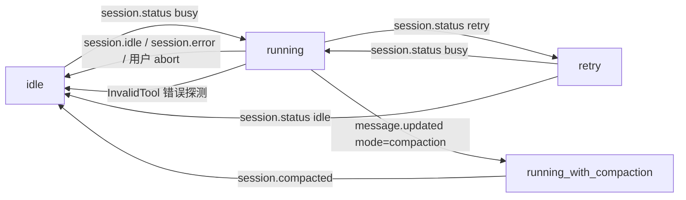
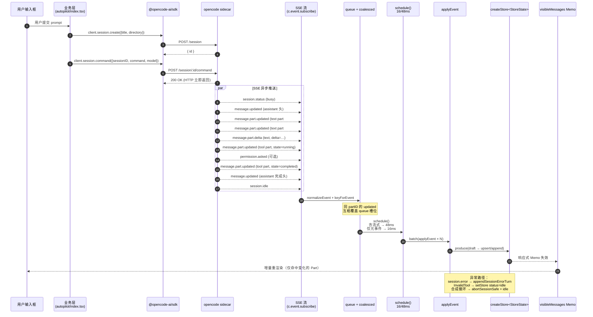

# 05a · OpenWork 会话与消息系统

> 范围：[apps/app/src/app/context/session.ts](file:///Users/umasuo_m3pro/Desktop/startup/xingjing/harnesswork/apps/app/src/app/context/session.ts)、[apps/app/src/app/types.ts](file:///Users/umasuo_m3pro/Desktop/startup/xingjing/harnesswork/apps/app/src/app/types.ts)、[apps/app/src/app/lib/opencode-session.ts](file:///Users/umasuo_m3pro/Desktop/startup/xingjing/harnesswork/apps/app/src/app/lib/opencode-session.ts)、[apps/app/src/app/utils/index.ts](file:///Users/umasuo_m3pro/Desktop/startup/xingjing/harnesswork/apps/app/src/app/utils/index.ts)
>
> 配套：[05-openwork-platform-overview.md](./05-openwork-platform-overview.md)、[05h-openwork-state-architecture.md](./05h-openwork-state-architecture.md)、[06-openwork-bridge-contract.md](./06-openwork-bridge-contract.md)
>
> 一句话：会话与消息系统是 OpenWork 全部 Agent 协作的事件总线 —— 一切都通过 `Session → Message → Part` 三级模型，由 SDK 驱动写、由 SSE 驱动读、由 Solid Store 驱动渲染。

---

## 1. 模型定义（Session / Message / Part）

OpenWork 不自定义会话模型，**完全复用 OpenCode SDK v2 的类型**。前端代码 [`session.ts#L6`](file:///Users/umasuo_m3pro/Desktop/startup/xingjing/harnesswork/apps/app/src/app/context/session.ts#L6-L6) 的导入是唯一事实源：

```ts
import type { Message, Part, Session } from "@opencode-ai/sdk/v2/client";
```

### 1.1 `Session`（会话元数据）

代码中可观察到的关键字段（按 [`session.ts`](file:///Users/umasuo_m3pro/Desktop/startup/xingjing/harnesswork/apps/app/src/app/context/session.ts) 内对它的解构 / 访问点反推）：

| 字段 | 用途 | 出处 |
|---|---|---|
| `id` | 主键，所有 sessionID 索引的根 | 全文 |
| `title` | 会话标题，由 `c.session.update({ sessionID, title })` 写回 | [L1035](file:///Users/umasuo_m3pro/Desktop/startup/xingjing/harnesswork/apps/app/src/app/context/session.ts#L1028-L1038) |
| `directory` | 工作目录绑定（**workspace 第一公民的物化**） | [L375](file:///Users/umasuo_m3pro/Desktop/startup/xingjing/harnesswork/apps/app/src/app/context/session.ts#L372-L379) [L999](file:///Users/umasuo_m3pro/Desktop/startup/xingjing/harnesswork/apps/app/src/app/context/session.ts#L995-L1011) |
| `parentID` | 父会话（子 Agent 派发链） | [L1001](file:///Users/umasuo_m3pro/Desktop/startup/xingjing/harnesswork/apps/app/src/app/context/session.ts#L996-L1002) |
| `time.created` / `time.updated` | 排序键 | [L68-L78](file:///Users/umasuo_m3pro/Desktop/startup/xingjing/harnesswork/apps/app/src/app/context/session.ts#L68-L78) |
| `revert.messageID` | 软回滚锚点，UI 只渲染 `id < revert.messageID` 的消息 | [L926-L932](file:///Users/umasuo_m3pro/Desktop/startup/xingjing/harnesswork/apps/app/src/app/context/session.ts#L926-L932) |

排序约定：[`sessionActivity`](file:///Users/umasuo_m3pro/Desktop/startup/xingjing/harnesswork/apps/app/src/app/context/session.ts#L68-L78) 取 `time.updated ?? time.created ?? 0`，活跃度降序、id 字典序作为 tiebreaker。

### 1.2 `MessageInfo`（消息头）

[`types.ts#L68`](file:///Users/umasuo_m3pro/Desktop/startup/xingjing/harnesswork/apps/app/src/app/types.ts#L68-L73)：

```ts
export type MessageInfo = Message | PlaceholderMessageInfo;

export type MessageWithParts = {
  info: MessageInfo;
  parts: Part[];
};
```

- `Message` 来自 SDK，包含 `id` / `sessionID` / `role`（"user" | "assistant"）/ `time` / `parentID` / `modelID` / `providerID` / `mode` / `agent` / `path.cwd` / `path.root` / `cost` / `tokens` 等。
- `PlaceholderMessageInfo` 是前端为"先到的 Part 找不到对应 Message"时所造的占位（[L92-L105](file:///Users/umasuo_m3pro/Desktop/startup/xingjing/harnesswork/apps/app/src/app/context/session.ts#L92-L105)）—— 这是 SSE 异步性的产物，详见第 5 节。

### 1.3 `Part`（消息片段，渲染单元）

Part 是 UI 真正渲染的最小单元，常见类型：

| `part.type` | 语义 | 关键字段 | 处理位置 |
|---|---|---|---|
| `text` | 普通文本 / 流式文本 | `text` | [L138-L155](file:///Users/umasuo_m3pro/Desktop/startup/xingjing/harnesswork/apps/app/src/app/context/session.ts#L138-L155) |
| `tool` | 工具调用 | `tool`、`state.input/patch/diff`、`state.error` | [L350-L366](file:///Users/umasuo_m3pro/Desktop/startup/xingjing/harnesswork/apps/app/src/app/context/session.ts#L350-L366) |
| `compaction` | 自动压缩元事件 | `auto: boolean` | [L1690-L1695](file:///Users/umasuo_m3pro/Desktop/startup/xingjing/harnesswork/apps/app/src/app/context/session.ts#L1690-L1695) |
| `text` + `synthetic: true` | 引擎注入的合成控制语 | `text`、`ignored?` | [L443-L461](file:///Users/umasuo_m3pro/Desktop/startup/xingjing/harnesswork/apps/app/src/app/context/session.ts#L443-L461) |

> **关键设计**：增量更新优先在 Part 层面发生（`text` 字段拼接），而不是替换整个 Part。这是流式渲染零闪烁的根本原因。

---

## 2. Store 结构（前端唯一真源）

[`session.ts#L51-L63`](file:///Users/umasuo_m3pro/Desktop/startup/xingjing/harnesswork/apps/app/src/app/context/session.ts#L51-L63) 定义了顶层 `StoreState`：

```ts
type StoreState = {
  sessions: Session[];                                    // 当前 workspace 的会话列表（按活跃度排序）
  sessionInfoById: Record<string, Session>;               // 全局缓存（跨 workspace 也保留）
  sessionStatus: Record<string, string>;                  // sessionID → 'idle' | 'running' | 'retry'
  sessionErrorTurns: Record<string, SessionErrorTurn[]>;  // 合成的错误 "回合"
  messages: Record<string, MessageInfo[]>;                // sessionID → 消息头列表
  parts: Record<string, Part[]>;                          // messageID → Part 列表
  todos: Record<string, TodoItem[]>;                      // sessionID → 待办（来自 c.session.todo）
  pendingPermissions: PendingPermission[];                // 未回复的权限请求（详见 05e）
  pendingQuestions: PendingQuestion[];                    // 未回复的提问（详见 05e）
  events: OpencodeEvent[];                                // 调试事件环（最多 150 条）
  sessionCompaction: Record<string, SessionCompactionState>;
};
```

初始化用 SolidJS [`createStore`](file:///Users/umasuo_m3pro/Desktop/startup/xingjing/harnesswork/apps/app/src/app/context/session.ts#L204-L216)，所有读访问都是细粒度响应式。

### 2.1 索引设计

```
sessions[] ─── id ──> sessionInfoById{}
                         │
                         └─ sessionID ──> messages{}[] ─── id ──> parts{}[]
                                          sessionStatus{}
                                          sessionErrorTurns{}[]
                                          todos{}[]
                                          sessionCompaction{}
```

关键观察：
- `sessions` 与 `sessionInfoById` 的双重表征是为了**列表能精排序、详情能跨 workspace 立刻命中**（[L744-L747](file:///Users/umasuo_m3pro/Desktop/startup/xingjing/harnesswork/apps/app/src/app/context/session.ts#L744-L747)）。
- `messages` 只存"头"，`parts` 按 `messageID` 单独索引 —— **流式更新只命中 parts，不会重写 messages**，避免大规模虚拟列表抖动。

### 2.2 辅助类型

| 类型 | 定义位置 | 用途 |
|---|---|---|
| `SessionErrorTurn` | [types.ts#L75-L80](file:///Users/umasuo_m3pro/Desktop/startup/xingjing/harnesswork/apps/app/src/app/types.ts#L75-L80) | 引擎错误合成为消息回合，按 `afterMessageID` 锚定 |
| `SessionCompactionState` | [types.ts#L145-L151](file:///Users/umasuo_m3pro/Desktop/startup/xingjing/harnesswork/apps/app/src/app/types.ts#L145-L151) | 压缩进行中的元状态：`running / startedAt / mode ('auto'\|'manual')` |
| `PendingPermission` | [types.ts#L356-L358](file:///Users/umasuo_m3pro/Desktop/startup/xingjing/harnesswork/apps/app/src/app/types.ts#L356-L358) | `ApiPermissionRequest & { receivedAt }` |
| `PendingQuestion` | [types.ts#L360-L362](file:///Users/umasuo_m3pro/Desktop/startup/xingjing/harnesswork/apps/app/src/app/types.ts#L360-L362) | `QuestionRequest & { receivedAt }` |
| `TodoItem` | [types.ts#L364-L369](file:///Users/umasuo_m3pro/Desktop/startup/xingjing/harnesswork/apps/app/src/app/types.ts#L364-L369) | `{ id, content, status, priority }` |

---

## 3. 会话生命周期（代码入口）

下表把"动作 → SDK 调用 → Store 副作用"全部绑定到代码行：

| 动作 | SDK 调用 | 入口函数 | 关键 Store 写入 |
|---|---|---|---|
| 列表 | `c.session.list({ directory, roots: true })` | [`loadSessions`](file:///Users/umasuo_m3pro/Desktop/startup/xingjing/harnesswork/apps/app/src/app/context/session.ts#L966-L1026) | `sessions` `sessionInfoById` |
| 创建 | `client.session.create({ title, directory })` | （由调用方在业务层调用，参考 [autopilot/index.tsx#L966](file:///Users/umasuo_m3pro/Desktop/startup/xingjing/harnesswork/apps/app/src/app/xingjing/pages/solo/autopilot/index.tsx#L964-L982)） | 由 SSE `session.created` 回流（见 5.3） |
| 选中 | `session.get` + `session.messages(limit)` + `session.todo` + `permission.list` | [`selectSession`](file:///Users/umasuo_m3pro/Desktop/startup/xingjing/harnesswork/apps/app/src/app/context/session.ts#L1121-L1247) | `messages` `parts` `todos` `pendingPermissions` |
| 懒加载详情 | `session.get` + `session.messages(140)` | [`ensureSessionLoaded`](file:///Users/umasuo_m3pro/Desktop/startup/xingjing/harnesswork/apps/app/src/app/context/session.ts#L1075-L1119) | 同上；带 `ensureInFlightBySession` 去重 |
| 加载更早消息 | `session.messages(limit + 120)` | [`loadEarlierMessages`](file:///Users/umasuo_m3pro/Desktop/startup/xingjing/harnesswork/apps/app/src/app/context/session.ts#L1249-L1270) | `messages` `parts` `messageLimitBySession` |
| 重命名 | `c.session.update({ sessionID, title })` | [`renameSession`](file:///Users/umasuo_m3pro/Desktop/startup/xingjing/harnesswork/apps/app/src/app/context/session.ts#L1028-L1038) | `sessions` |
| 中止 | `c.session.abort({ sessionID })` | [`abortSessionSafe`](file:///Users/umasuo_m3pro/Desktop/startup/xingjing/harnesswork/apps/app/src/app/lib/opencode-session.ts#L28-L34) | 由 `session.idle` SSE 回流 |
| 回滚 | `c.session.revert({ sessionID, messageID })` | [`revertSession`](file:///Users/umasuo_m3pro/Desktop/startup/xingjing/harnesswork/apps/app/src/app/lib/opencode-session.ts#L39-L45) | UI 通过 `selectedSession.revert.messageID` 隐藏后续消息 |
| 撤销回滚 | `c.session.unrevert({ sessionID })` | [`unrevertSession`](file:///Users/umasuo_m3pro/Desktop/startup/xingjing/harnesswork/apps/app/src/app/lib/opencode-session.ts#L50-L55) | 同上 |
| 压缩 | `c.session.summarize` 或 `c.session.command({ command: "compact" })` | [`compactSession`](file:///Users/umasuo_m3pro/Desktop/startup/xingjing/harnesswork/apps/app/src/app/lib/opencode-session.ts#L61-L94) | 由 `message.updated`（mode=compaction） + `session.compacted` SSE 驱动 |
| Shell 执行 | `c.session.shell({ sessionID, command })` | [`shellInSession`](file:///Users/umasuo_m3pro/Desktop/startup/xingjing/harnesswork/apps/app/src/app/lib/opencode-session.ts#L104-L112) | 由消息事件回流 |
| 命令 / Slash | `client.session.command({ sessionID, command, arguments, model })` | 业务层调用 | 同上 |

### 3.1 工作目录传播：`toSessionTransportDirectory`

[`loadSessions`](file:///Users/umasuo_m3pro/Desktop/startup/xingjing/harnesswork/apps/app/src/app/context/session.ts#L966-L1026) 的核心约束：

> **OpenCode 的 `session.list()` 支持服务端按 directory 过滤；`create/delete` 必须用同一个 transport 路径格式，否则后端的 strict equality 会失配。**

所以这里有两层防御：
1. 请求侧：`queryDirectory = toSessionTransportDirectory(scopeRoot)` 把传入路径标准化（[L975](file:///Users/umasuo_m3pro/Desktop/startup/xingjing/harnesswork/apps/app/src/app/context/session.ts#L975-L975)）。
2. 响应侧：客户端再做一次 `normalizeDirectoryPath` 比较（[L1008-L1011](file:///Users/umasuo_m3pro/Desktop/startup/xingjing/harnesswork/apps/app/src/app/context/session.ts#L1006-L1011)），兼容老服务端 / 代理串流的情况。

### 3.2 `selectSession` 的"陈旧检测"

[`selectSession`](file:///Users/umasuo_m3pro/Desktop/startup/xingjing/harnesswork/apps/app/src/app/context/session.ts#L1121-L1247) 引入了两层防止竞态的机制：

```ts
const runId    = ++selectRunCounter;
const version  = ++selectVersion;
const isStale  = () => version !== selectVersion || options.selectedSessionId() !== sessionID;
const abortIfStale = (reason: string) => { if (!isStale()) return false; mark(`aborting: ${reason}`); return true; };
```

每过一个网络等待点就 `abortIfStale(...)`，避免用户快速切换会话时 A 的响应覆盖 B 的状态。同时用 `selectInFlightBySession`（[L1132](file:///Users/umasuo_m3pro/Desktop/startup/xingjing/harnesswork/apps/app/src/app/context/session.ts#L1132-L1138)）做相同 `sessionID` 的请求合并。

### 3.3 选中前的健康自检

`selectSession` 在所有读取前先 `c.global.health()`（3s 超时，[L1162-L1171](file:///Users/umasuo_m3pro/Desktop/startup/xingjing/harnesswork/apps/app/src/app/context/session.ts#L1162-L1171)）。健康失败则抛 `t("app.connection_lost")` —— 这是 SSE 断线时 UI 不卡死的关键防线。

### 3.4 消息加载分页

```
INITIAL_SESSION_MESSAGE_LIMIT = 140         // session.ts L89
SESSION_MESSAGE_LOAD_CHUNK    = 120         // session.ts L90
```

页码状态分别由三个 signal 维护：`messageLimitBySession` / `messageCompleteBySession` / `messageLoadBusyBySession`（[L221-L223](file:///Users/umasuo_m3pro/Desktop/startup/xingjing/harnesswork/apps/app/src/app/context/session.ts#L221-L223)）。`completed` 的判定条件是 `msgs.length < limit`（[L1185](file:///Users/umasuo_m3pro/Desktop/startup/xingjing/harnesswork/apps/app/src/app/context/session.ts#L1185-L1185)）。

---

## 4. 状态机：`session.status` 与 `normalizeSessionStatus`

OpenCode 上行的 status 是结构化对象，前端把它折叠为 3 个字符串状态。

[`utils/index.ts#L500-L507`](file:///Users/umasuo_m3pro/Desktop/startup/xingjing/harnesswork/apps/app/src/app/utils/index.ts#L500-L507)：

```ts
export function normalizeSessionStatus(status: unknown) {
  if (!status || typeof status !== "object") return "idle";
  const record = status as Record<string, unknown>;
  if (record.type === "busy")  return "running";
  if (record.type === "retry") return "retry";
  if (record.type === "idle")  return "idle";
  return "idle";
}
```

### 4.1 状态转换图



### 4.2 写入位置

| 触发 | 处理 |
|---|---|
| `session.status` 事件 | [L1558-L1573](file:///Users/umasuo_m3pro/Desktop/startup/xingjing/harnesswork/apps/app/src/app/context/session.ts#L1558-L1573) → `normalizeSessionStatus` → `setStore("sessionStatus", sessionID, ...)` |
| `session.idle` 事件 | [L1575-L1594](file:///Users/umasuo_m3pro/Desktop/startup/xingjing/harnesswork/apps/app/src/app/context/session.ts#L1575-L1594) → 强制 `idle`、停止压缩、回拉最新 `session.get` |
| `session.error` 事件 | [L1600-L1634](file:///Users/umasuo_m3pro/Desktop/startup/xingjing/harnesswork/apps/app/src/app/context/session.ts#L1600-L1634) → 强制 `idle`、`MessageAbortedError` 静默（用户主动取消不报错） |
| 检测到 InvalidTool 错误 | [`maybeHandleInvalidToolError`](file:///Users/umasuo_m3pro/Desktop/startup/xingjing/harnesswork/apps/app/src/app/context/session.ts#L422-L441) → 防止 UI 卡 "Responding"，强制 `idle` |

> **关键设计**：所有"非预期但需要复位"的路径（错误、循环、无效工具调用），最终都走 `setStore("sessionStatus", id, "idle")` 一处兜底。

---

## 5. SSE 事件总线（核心机制）

session.ts 末段 [L1825-L2026](file:///Users/umasuo_m3pro/Desktop/startup/xingjing/harnesswork/apps/app/src/app/context/session.ts#L1825-L2026) 是整套架构最关键的 100 行。它做四件事：**订阅、coalesce、批处理、断流重连**。

### 5.1 订阅入口

```ts
const sub = await c.event.subscribe(undefined, { signal: controller.signal });
for await (const raw of sub.stream) {
  const event = normalizeEvent(raw);
  ...
}
```

`normalizeEvent`（[utils/index.ts#L228-L253](file:///Users/umasuo_m3pro/Desktop/startup/xingjing/harnesswork/apps/app/src/app/utils/index.ts#L228-L253)）容忍两种 wire 形态：`{type, properties}` 或包了一层 `{payload: {type, properties}}`。

### 5.2 Coalescing（合并去重）

[L1842-L1861](file:///Users/umasuo_m3pro/Desktop/startup/xingjing/harnesswork/apps/app/src/app/context/session.ts#L1842-L1861) 的 `keyForEvent` 给"幂等更新类"事件生成稳定 key，相同 key 的新事件**直接覆盖前一个 queue 槽位**：

| 事件 | Key 模板 |
|---|---|
| `session.status` / `session.idle` | `{type}:{sessionID}` |
| `message.part.updated` | `message.part.updated:{messageID}:{partID}` |
| `todo.updated` | `todo.updated:{sessionID}` |
| 其他 | 不合并 |

合并机制（[L1948-L1958](file:///Users/umasuo_m3pro/Desktop/startup/xingjing/harnesswork/apps/app/src/app/context/session.ts#L1948-L1958)）：

```ts
const key = keyForEvent(event);
if (key) {
  const existing = coalesced.get(key);
  if (existing !== undefined) {
    if (queue[existing] !== undefined) coalescedReplaced += 1;
    queue[existing] = undefined;     // 老事件作废，但保留位置以维持顺序
  }
  coalesced.set(key, queue.length);
}
queue.push(event);
```

> **设计要点**：用"标记 undefined + 不抽取数组"的方式，**既去重又保序** —— 比 dedupe-then-reorder 便宜得多。

### 5.3 双速节流：`schedule`

[L1915-L1920](file:///Users/umasuo_m3pro/Desktop/startup/xingjing/harnesswork/apps/app/src/app/context/session.ts#L1915-L1920)：

```ts
const schedule = () => {
  if (timer) return;
  const elapsed = Date.now() - last;
  const interval = queueHasPartUpdates ? 48 : 16;   // ← 关键
  timer = setTimeout(flush, Math.max(0, interval - elapsed));
};
```

| 队列内容 | 节流间隔 | 含义 |
|---|---|---|
| 仅元事件（status / message.updated 等） | **16 ms** | 一帧（≈60fps）即时刷出 |
| 含流式 part（`message.part.updated/delta`） | **48 ms** | 三帧合一，对长 token 流避免 UI 抖动 |

### 5.4 8ms yield 让出主线程

[L1972-L1974](file:///Users/umasuo_m3pro/Desktop/startup/xingjing/harnesswork/apps/app/src/app/context/session.ts#L1972-L1974)：

```ts
if (Date.now() - yielded < 8) continue;
yielded = Date.now();
await new Promise<void>((resolve) => setTimeout(resolve, 0));
```

每 8ms 主动 `setTimeout(0)` —— 这是在 Tauri WKWebView 单线程下保证 UI 输入响应不被 SSE 突发淹没的核心防御。

### 5.5 批处理 flush

[`flush`](file:///Users/umasuo_m3pro/Desktop/startup/xingjing/harnesswork/apps/app/src/app/context/session.ts#L1863-L1913) 用 SolidJS `batch()` 包裹整批 `applyEvent`，全部 store 写入合并到一次响应式调度。性能阈值（≥10ms / ≥40ms 等待 / 队列峰值≥25 等）才会写 perf 日志，避免日志风暴。

### 5.6 断流重连：指数退避

[`scheduleReconnect`](file:///Users/umasuo_m3pro/Desktop/startup/xingjing/harnesswork/apps/app/src/app/context/session.ts#L1998-L2015)：

```
delay = min(1s × 2^(attempt-1), 30s)   // 1, 2, 4, 8, 16, 30, 30, ...
```

成功连接后立即 `reconnectAttempt = 0`（[L1929](file:///Users/umasuo_m3pro/Desktop/startup/xingjing/harnesswork/apps/app/src/app/context/session.ts#L1928-L1930)）。`onCleanup` 时 `controller.abort()` + `clearTimeout(reconnectTimer)` + 最后 `flush()`（[L2020-L2025](file:///Users/umasuo_m3pro/Desktop/startup/xingjing/harnesswork/apps/app/src/app/context/session.ts#L2020-L2025)），保证不漏消息也不留 timer。

### 5.7 完整事件矩阵

`applyEvent` ([L1486-L1823](file:///Users/umasuo_m3pro/Desktop/startup/xingjing/harnesswork/apps/app/src/app/context/session.ts#L1486-L1823)) 处理的事件清单：

| 事件类型 | 副作用 |
|---|---|
| `server.connected` | `setSseConnected(true)` |
| `session.created` / `session.updated` | `upsertSession`、`rememberSession` |
| `session.deleted` | 同步清除 `sessions`、`sessionInfoById`、`sessionCompaction`、`sessionErrorTurns`、合成循环计数 |
| `session.status` | `normalizeSessionStatus` → `sessionStatus`，转 idle 时停止压缩 |
| `session.idle` | 强制 idle + 异步 `c.session.get` 同步最新会话信息 |
| `session.error` | 合成 `SessionErrorTurn` 注入消息流；`MessageAbortedError` 静默 |
| `session.compacted` | `finishSessionCompaction` |
| `message.updated` | `upsertMessageInfo`，若是 `mode=compaction & summary=true` 则 `startSessionCompaction` |
| `message.removed` | 删除 `messages[sessionID]` 中对应 id，并清空 `parts[messageID]` |
| `message.part.updated` | `produce` 中：缺消息头则插占位、文本类型用 endsWith 防重拼接 delta、否则 upsert part |
| `message.part.delta` | `appendPartDelta(messageID, partID, field, delta)` 单字段累加 |
| `message.part.removed` | 移除单个 Part |
| `todo.updated` | 替换 `todos[sessionID]` |
| `permission.asked` / `permission.replied` | 拉取 `c.permission.list()` 全量同步 |
| `question.asked` / `question.replied` / `question.rejected` | 拉取 `c.question.list()` 全量同步 |
| `opencode.hotreload.applied` | 触发外层 `onHotReloadApplied` 钩子 |

---

## 6. 流式消息累积的精细设计

### 6.1 占位消息

当 `message.part.updated` 比 `message.updated` 先到（SSE 异步顺序不保证），[L1700-L1702](file:///Users/umasuo_m3pro/Desktop/startup/xingjing/harnesswork/apps/app/src/app/context/session.ts#L1697-L1719) 会**用 `createPlaceholderMessage(part)` 临时占位**，待 `message.updated` 到达再被覆盖：

```ts
const list = draft.messages[part.sessionID] ?? [];
if (!list.find((message) => message.id === part.messageID)) {
  draft.messages[part.sessionID] = upsertMessageInfo(list, createPlaceholderMessage(part));
}
```

[`createPlaceholderMessage`](file:///Users/umasuo_m3pro/Desktop/startup/xingjing/harnesswork/apps/app/src/app/context/session.ts#L92-L105) 的占位字段全为零值（`modelID: ""`、`tokens: {input:0,...}`），UI 渲染时不会显示元信息，只显示 Part 流。

### 6.2 文本 Part 的两条增量路径

| 事件 | 处理函数 | 行为 |
|---|---|---|
| `message.part.updated`（带 `delta`） | [L1707-L1715](file:///Users/umasuo_m3pro/Desktop/startup/xingjing/harnesswork/apps/app/src/app/context/session.ts#L1707-L1715) | 若已有 part，用 `endsWith(delta)` 判断防重，再做字符串拼接 |
| `message.part.delta`（独立事件） | [L138-L155 `appendPartDelta`](file:///Users/umasuo_m3pro/Desktop/startup/xingjing/harnesswork/apps/app/src/app/context/session.ts#L138-L155) | 直接 `existing[field] + delta`，对未知字段类型 short-circuit |

> **防重逻辑** `!existing.text.endsWith(delta)` 解决了一个真实问题：服务端在 retry 时可能重发同一个 delta，前端去重避免 "abcabc" 这类双拼。

### 6.3 消息可见性：`visibleMessages`

[`visibleMessages`](file:///Users/umasuo_m3pro/Desktop/startup/xingjing/harnesswork/apps/app/src/app/context/session.ts#L918-L938) 是 UI 的最终读端：

```ts
const visibleMessages = createMemo(() => {
  const sessionID = options.selectedSessionId();
  const errorTurns = sessionID ? store.sessionErrorTurns[sessionID] ?? [] : [];
  const blueprintSeeds = blueprintSeedMessagesForSelectedSession();
  const list = messages().filter(/* 过滤合成前缀 */);
  const revert = selectedSession()?.revert?.messageID ?? null;
  const visible = !revert ? list : list.filter((m) => messageIdFromInfo(m) < revert);
  return insertSyntheticSessionErrors(
    insertSyntheticBlueprintSeedMessages(visible, sessionID, blueprintSeeds),
    sessionID,
    errorTurns,
  );
});
```

整条流水线：

```
原始 messages → 滤除合成前缀 → revert 截断 → 注入 blueprint 种子（仅空会话） → 注入错误回合 → UI 渲染
```

合成前缀常量见 [L38-L49](file:///Users/umasuo_m3pro/Desktop/startup/xingjing/harnesswork/apps/app/src/app/context/session.ts#L38-L49)：
- `SYNTHETIC_SESSION_ERROR_MESSAGE_PREFIX`
- `SYNTHETIC_BLUEPRINT_SEED_MESSAGE_PREFIX`（`"blueprint-seed:"`）

---

## 7. 错误恢复与防循环

### 7.1 结构化错误格式化：`formatSessionError`

[L672-L710](file:///Users/umasuo_m3pro/Desktop/startup/xingjing/harnesswork/apps/app/src/app/context/session.ts#L672-L710) 把 OpenCode 抛回的错误对象（含 `name` / `data` / `cause`）映射为分行人类可读文本：

| 错误识别 | 映射标题 |
|---|---|
| `ProviderAuthError` | `Provider auth error (providerID)` |
| `APIError` + 401/403 | `app.error_auth_failed` |
| `APIError` + 413 | `Context too large` + 提示 compact |
| `APIError` + 429 | `app.error_rate_limit` |
| `MessageOutputLengthError` | `Output length limit exceeded` |
| 其他 | `name.replace(/([a-z])([A-Z])/g, "$1 $2")` |

HTTP 状态码同时从字符串里 inferred（[`inferHttpStatus`](file:///Users/umasuo_m3pro/Desktop/startup/xingjing/harnesswork/apps/app/src/app/context/session.ts#L616-L624)），以兼容引擎日志只 leak 数字的情况。

错误最终通过 [`appendSessionErrorTurn`](file:///Users/umasuo_m3pro/Desktop/startup/xingjing/harnesswork/apps/app/src/app/context/session.ts#L524-L546) **作为消息回合插入会话流**，而不是只弹 toast —— 这样错误不会在切换会话后丢失。

### 7.2 合成循环检测：抢救"AI 自言自语"

[L80-L88](file:///Users/umasuo_m3pro/Desktop/startup/xingjing/harnesswork/apps/app/src/app/context/session.ts#L80-L88) 定义了两类已知病理模式的正则：

```ts
const SYNTHETIC_CONTINUE_CONTROL_PATTERN =
  /^\s*continue if you have next steps,\s*or stop and ask for clarification if you are unsure how to proceed\.?\s*$/i;
const SYNTHETIC_TASK_SUMMARY_CONTROL_PATTERN =
  /^\s*summarize the task tool output above and continue with your task\.?\s*$/i;
```

每次 `message.part.updated` 都会调用 [`recordSyntheticContinueDiagnostic`](file:///Users/umasuo_m3pro/Desktop/startup/xingjing/harnesswork/apps/app/src/app/context/session.ts#L463-L497) / [`recordSyntheticTaskSummaryDiagnostic`](file:///Users/umasuo_m3pro/Desktop/startup/xingjing/harnesswork/apps/app/src/app/context/session.ts#L499-L516) 维护一个滑动窗口：

| 常量 | 值 | 含义 |
|---|---|---|
| `COMPACTION_DIAGNOSTIC_WINDOW_MS` | 60 000 | 滑动窗口大小 |
| `COMPACTION_LOOP_WARN_THRESHOLD` | 3 | 60 秒内 3 次触发警告 |
| `SYNTHETIC_TASK_SUMMARY_LOOP_ABORT_THRESHOLD` | 5 | 60 秒内 5 次直接 abort |
| `SYNTHETIC_CONTROL_LOOP_ABORT_MIN_INTERVAL_MS` | 30 000 | 同一会话最少 30 秒间隔才能再次自动 abort |

[`maybeAbortSyntheticControlLoop`](file:///Users/umasuo_m3pro/Desktop/startup/xingjing/harnesswork/apps/app/src/app/context/session.ts#L548-L606) 触达阈值时：
1. `abortSessionSafe(client, sessionID)` 中止；
2. 合成一条解释性 `SessionErrorTurn` 注入消息流；
3. `setSessionStatus(sessionID, "idle")`；
4. 写 perf 日志便于后续诊断。

### 7.3 InvalidTool 卡死防御

[`isInvalidToolError`](file:///Users/umasuo_m3pro/Desktop/startup/xingjing/harnesswork/apps/app/src/app/context/session.ts#L399-L410) 用 5 个关键词匹配工具错误状态文本（`invalid tool` / `model tried to call` / `unavailable tool` / `unknown tool` / `tool not found`）。命中时：

```ts
setStore("sessionStatus", part.sessionID, "idle");          // 立刻解锁 UI
options.setError(`Invalid tool call: ${tool}.\n\n${hint}`); // 指引下一步
```

`hint` 对包含 browser/chrome/devtools 关键词的工具会直接告诉用户去打开 MCP tab 连接 Chrome（[L412-L420](file:///Users/umasuo_m3pro/Desktop/startup/xingjing/harnesswork/apps/app/src/app/context/session.ts#L412-L420)）—— 这是 `chrome-devtools-mcp` sidecar 未就绪的常见路径。

### 7.4 自动 reload 触发器（与 05b 关联）

[`detectReloadFromPart`](file:///Users/umasuo_m3pro/Desktop/startup/xingjing/harnesswork/apps/app/src/app/context/session.ts#L350-L366) 监听**变更类工具**（`mutatingTools = {"write", "edit", "apply_patch"}`）的 input/patch/diff 文本，匹配到 6 个路径正则之一（[L233-L241](file:///Users/umasuo_m3pro/Desktop/startup/xingjing/harnesswork/apps/app/src/app/context/session.ts#L233-L241)）就外抛 `markReloadRequired(reason, trigger)`：

| 路径正则 | reason | trigger.type |
|---|---|---|
| `[\\/]\.opencode[\\/](skill\|skills)[\\/]` | `skills` | `skill` |
| `[\\/]\.opencode[\\/](command\|commands)[\\/]` | `commands` | `command` |
| `[\\/]\.opencode[\\/](agent\|agents)[\\/]` | `agents` | `agent` |
| `(?:^\|[\\/])opencode\.jsonc?\b` | `config` | `config` |
| `(?:^\|[\\/])\.opencode[\\/]` | `config` | `config` |
| `[\\/]\.opencode[\\/]openwork\.json\b` | **跳过**（OpenWork 自有配置不触发 reload） | — |

> **设计哲学呼应**：05 中"文件即配置"的运行时实现就是这一段 —— Skill/Agent/Command/Config 的写入由 SSE 工具事件被动观测，不需要任何额外通知协议。

---

## 8. 暴露面：`createSessionStore` 返回的 API

[L2028-L2081](file:///Users/umasuo_m3pro/Desktop/startup/xingjing/harnesswork/apps/app/src/app/context/session.ts#L2028-L2081) 是模块的全部公共契约，按消费场景分类：

### 8.1 读端（响应式 Memo / Signal）

| API | 类型 | 含义 |
|---|---|---|
| `sessions` | `() => Session[]` | 当前 workspace 排序后的列表 |
| `sessionById(id)` | `(id) => Session \| null` | 跨 workspace 缓存命中 |
| `selectedSession` | `Memo<Session \| null>` | 当前选中会话的元数据 |
| `selectedSessionStatus` | `Memo<string>` | `'idle' \| 'running' \| 'retry'` |
| `messages` | `Memo<MessageWithParts[]>` | 当前选中会话的消息（**不过滤** revert / 合成） |
| `visibleMessages` | `Memo<MessageWithParts[]>` | 当前选中会话**最终 UI 渲染**的消息 |
| `messagesBySessionId(id)` | 函数 | 任意会话的消息 |
| `sessionStatusById` | `() => Record<string, string>` | 全部会话状态映射 |
| `pendingPermissions` / `activePermission` | `Signal / Memo` | 权限请求队列（详见 05e） |
| `pendingQuestions` / `activeQuestion` | `Signal / Memo` | 提问队列（详见 05e） |
| `todos` | `Memo<TodoItem[]>` | 当前会话的待办 |
| `sessionCompactionById(id)` / `selectedSessionCompactionState` | 函数 / Memo | 压缩进度元状态 |
| `selectedSessionErrorTurns` / `sessionErrorTurnsById` | Memo / 函数 | 错误回合 |
| `selectedSessionHasEarlierMessages` / `selectedSessionLoadingEarlierMessages` | Memo | 分页 UI 控制 |
| `sessionLoadingById(id)` | 函数 | 单会话加载状态 |
| `events` | `() => OpencodeEvent[]` | 调试事件环（开发者模式） |

### 8.2 写端（Action）

| API | 用途 |
|---|---|
| `loadSessions(scopeRoot?)` | 全量拉取列表 |
| `selectSession(id)` | 选中并加载完整上下文（带健康自检 + 陈旧检测） |
| `ensureSessionLoaded(id)` | 后台懒加载，不切换选中（预热用） |
| `loadEarlierMessages(id, chunk?)` | 向前翻页 |
| `renameSession(id, title)` | 服务端改名 |
| `respondPermission(requestID, reply)` | 回复权限请求 |
| `respondQuestion(requestID, answers)` / `rejectQuestion(requestID)` | 回复 / 拒答提问 |
| `appendSessionErrorTurn(sessionID, message)` | 注入合成错误回合（业务层手动） |
| `restorePromptFromUserMessage(message)` | 把消息文本回填到输入框 |
| `upsertLocalSession(next)` | 本地直接写一条会话（用于乐观 UI） |
| `setBlueprintSeedMessagesBySessionId(updater)` | 设定空会话的种子提示（蓝图模式） |
| `setSessions / setMessages / setTodos / setPendingPermissions / setPendingQuestions / setSessionStatusById` | 受控外部覆盖（迁移与测试用） |

### 8.3 消费链

```
GlobalSDKProvider (05h)
    │ provides Client + sessionStore
    ▼
业务页面（apps/app/src/app/pages/session.tsx 等）
业务页面（apps/app/src/app/xingjing/...）  ← 通过 XingjingOpenworkContext 桥接（详见 06）
```

---

## 9. 端到端时序图：一次 Prompt 的完整旅程



---

## 10. 关键设计决策（以代码为证）

| 决策 | 证据 |
|---|---|
| **会话模型 = SDK 类型 + 极薄包装** | [L6](file:///Users/umasuo_m3pro/Desktop/startup/xingjing/harnesswork/apps/app/src/app/context/session.ts#L6-L6) 全文不存在自定义 Session 接口 |
| **三级索引：sessions / messages / parts 分离** | [L51-L63](file:///Users/umasuo_m3pro/Desktop/startup/xingjing/harnesswork/apps/app/src/app/context/session.ts#L51-L63)；流式更新只命中 parts |
| **Workspace 第一公民通过 `directory` 透传** | [L975](file:///Users/umasuo_m3pro/Desktop/startup/xingjing/harnesswork/apps/app/src/app/context/session.ts#L975-L975) `toSessionTransportDirectory` |
| **SSE coalescing：key 标记 + 槽位 undefined 保序** | [L1948-L1958](file:///Users/umasuo_m3pro/Desktop/startup/xingjing/harnesswork/apps/app/src/app/context/session.ts#L1948-L1958) |
| **双速节流：流式 48ms / 元事件 16ms** | [L1918](file:///Users/umasuo_m3pro/Desktop/startup/xingjing/harnesswork/apps/app/src/app/context/session.ts#L1915-L1920) |
| **8ms yield 防止 WKWebView UI 饿死** | [L1972-L1974](file:///Users/umasuo_m3pro/Desktop/startup/xingjing/harnesswork/apps/app/src/app/context/session.ts#L1972-L1974) |
| **状态机三态：idle / running / retry** | [normalizeSessionStatus](file:///Users/umasuo_m3pro/Desktop/startup/xingjing/harnesswork/apps/app/src/app/utils/index.ts#L500-L507) |
| **错误是消息回合，不是 toast** | [appendSessionErrorTurn](file:///Users/umasuo_m3pro/Desktop/startup/xingjing/harnesswork/apps/app/src/app/context/session.ts#L524-L546) |
| **MessageAbortedError 静默** | [L1611-L1618](file:///Users/umasuo_m3pro/Desktop/startup/xingjing/harnesswork/apps/app/src/app/context/session.ts#L1611-L1618) 用户主动中止不弹错误 |
| **AI 自循环检测 + 自动 abort** | 60s 窗口 + 阈值 3/5 + 30s 抑制（[L80-L88](file:///Users/umasuo_m3pro/Desktop/startup/xingjing/harnesswork/apps/app/src/app/context/session.ts#L80-L88) [L548-L606](file:///Users/umasuo_m3pro/Desktop/startup/xingjing/harnesswork/apps/app/src/app/context/session.ts#L548-L606)） |
| **InvalidTool 自动复位 + 上下文 hint** | [L422-L441](file:///Users/umasuo_m3pro/Desktop/startup/xingjing/harnesswork/apps/app/src/app/context/session.ts#L422-L441) |
| **SSE 重连指数退避（1s→30s）** | [L2002-L2014](file:///Users/umasuo_m3pro/Desktop/startup/xingjing/harnesswork/apps/app/src/app/context/session.ts#L2002-L2014) |
| **请求级陈旧检测防快速切换竞态** | `selectVersion` + `abortIfStale`（[L1140-L1157](file:///Users/umasuo_m3pro/Desktop/startup/xingjing/harnesswork/apps/app/src/app/context/session.ts#L1140-L1157)） |
| **Skill/Agent/Command/Config 写入自动触发 reload** | [detectReloadFromPart](file:///Users/umasuo_m3pro/Desktop/startup/xingjing/harnesswork/apps/app/src/app/context/session.ts#L350-L366) + [6 条路径正则](file:///Users/umasuo_m3pro/Desktop/startup/xingjing/harnesswork/apps/app/src/app/context/session.ts#L233-L241) |

---

## 11. 与其他文档的衔接

| 文档 | 关联点 |
|---|---|
| [05](./05-openwork-platform-overview.md) | "SDK-First / SSE 单向流 / 文件即配置" 三条核心设计哲学的运行时落点 |
| [05b](./05b-openwork-skill-agent-mcp.md) | `detectReloadFromPart` 中的 6 条路径正则与 Skill/Agent/Command 注册表的对应关系 |
| [05c](./05c-openwork-workspace-fileops.md) | `directory` 字段与 workspace 解析、`toSessionTransportDirectory` 的协议侧契约 |
| [05d](./05d-openwork-model-provider.md) | `modelFromUserMessage` / `lastUserModelFromMessages` 与 Provider 推理调用链 |
| [05e](./05e-openwork-permission-question.md) | `pendingPermissions` / `pendingQuestions` 的产生 / 传递 / 回复链路 |
| [05g](./05g-openwork-process-runtime.md) | SSE 由 opencode sidecar 推出，详见多进程运行时 |
| [05h](./05h-openwork-state-architecture.md) | `createSessionStore` 在 `GlobalSDKProvider` 中的实例化与四层 Provider 的协作 |
| [06](./06-openwork-bridge-contract.md) | `XingjingOpenworkContext` 暴露给星静的会话 / 消息 API 子集 |
