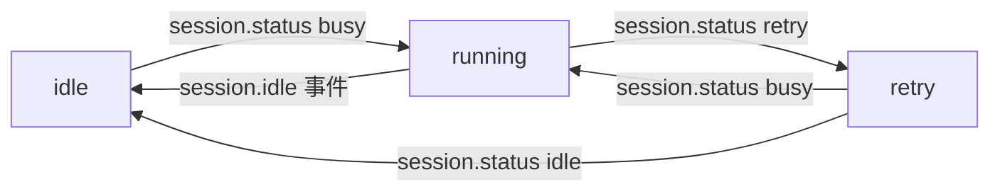
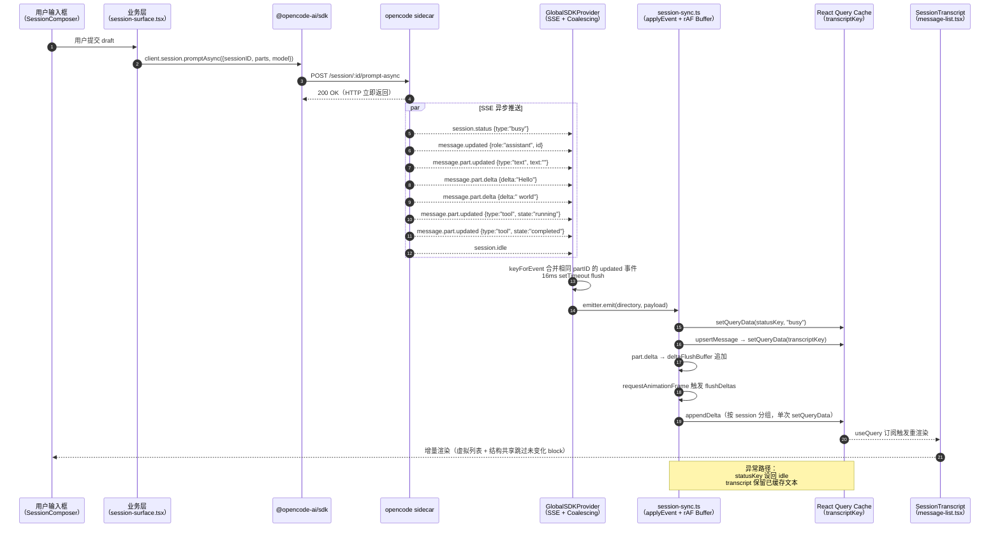

# 05a · OpenWork 会话与消息系统

> 范围：[apps/app/src/react-app/kernel/store.ts](file:///Users/umasuo_m3pro/Desktop/startup/xingjing/harnesswork/apps/app/src/react-app/kernel/store.ts)、[apps/app/src/react-app/kernel/global-sdk-provider.tsx](file:///Users/umasuo_m3pro/Desktop/startup/xingjing/harnesswork/apps/app/src/react-app/kernel/global-sdk-provider.tsx)、[apps/app/src/react-app/kernel/global-sync-provider.tsx](file:///Users/umasuo_m3pro/Desktop/startup/xingjing/harnesswork/apps/app/src/react-app/kernel/global-sync-provider.tsx)、[apps/app/src/react-app/domains/session/sync/session-sync.ts](file:///Users/umasuo_m3pro/Desktop/startup/xingjing/harnesswork/apps/app/src/react-app/domains/session/sync/session-sync.ts)、[apps/app/src/app/types.ts](file:///Users/umasuo_m3pro/Desktop/startup/xingjing/harnesswork/apps/app/src/app/types.ts)
>
> 配套：[05-openwork-platform-overview.md](./05-openwork-platform-overview.md)、[05h-openwork-state-architecture.md](./05h-openwork-state-architecture.md)、[06-openwork-bridge-contract.md](./06-openwork-bridge-contract.md)
>
> 一句话：会话与消息系统是 OpenWork 全部 Agent 协作的事件总线 —— 一切都通过 `Session → UIMessage → Part` 三级模型，由 SDK 驱动写、由 SSE 驱动读、由 React Query 缓存驱动渲染，Zustand 仅管理工作区与服务器连接等全局单例状态。

---

## 1. 模型定义（Session / UIMessage / Part）

OpenWork 不自定义会话模型，**SDK 类型是唯一真源**。核心导入：

```ts
// apps/app/src/app/lib/opencode.ts L1
import { createOpencodeClient, type Message, type Part, type Session, type Todo }
  from "@opencode-ai/sdk/v2/client";

// apps/app/src/react-app/domains/session/sync/session-sync.ts L1-3
import type { UIMessage } from "ai";
import type { Part, SessionStatus, Todo } from "@opencode-ai/sdk/v2/client";
```

渲染层使用 Vercel `ai` 包的 `UIMessage` 作为消息的前端表示；服务器响应的 `Message`/`Part` 在进入 React Query 缓存前会经过 `toUIPart` 适配器转换为 `UIMessage["parts"]` 元素（详见第 4 节）。

### 1.1 `Session`（会话元数据）

`Session` 类型来自 `@opencode-ai/sdk/v2/client`，关键字段：

| 字段 | 用途 | 出处 |
|---|---|---|
| `id` | 主键，所有 sessionID 索引的根 | 全文 |
| `title` | 会话标题 | SDK Session 类型 |
| `directory` | 工作目录绑定（workspace 第一公民的物化） | SDK Session 类型 |
| `parentID` | 父会话（子 Agent 派发链） | SDK Session 类型 |
| `time.created` / `time.updated` | 排序键 | SDK Session 类型 |
| `revert.messageID` | 软回滚锚点 | SDK Session 类型 |

前端在 Zustand store 中保存 `selectedSessionId` 字符串（[store.ts#L34](file:///Users/umasuo_m3pro/Desktop/startup/xingjing/harnesswork/apps/app/src/react-app/kernel/store.ts#L34-L34)），完整 `Session[]` 对象则存储于 `GlobalSyncProvider` 管理的 `WorkspaceState.session` 数组中（[global-sync-provider.tsx#L39-L45](file:///Users/umasuo_m3pro/Desktop/startup/xingjing/harnesswork/apps/app/src/react-app/kernel/global-sync-provider.tsx#L39-L45)）。

### 1.2 `UIMessage`（渲染用消息）

[`session-sync.ts`](file:///Users/umasuo_m3pro/Desktop/startup/xingjing/harnesswork/apps/app/src/react-app/domains/session/sync/session-sync.ts) 使用 Vercel AI SDK 的 `UIMessage` 作为 React Query 缓存中存储消息的格式：

```ts
// UIMessage 核心字段（来自 "ai" 包）
type UIMessage = {
  id: string;
  role: "user" | "assistant" | "system";
  parts: UIMessage["parts"]; // 多态 Part 数组
};
```

- `role` 在 SSE 事件 `message.updated` 到达前，通过 `inferStubRole` 从对话轮次模式推断（[session-sync.ts#L156-L162](file:///Users/umasuo_m3pro/Desktop/startup/xingjing/harnesswork/apps/app/src/react-app/domains/session/sync/session-sync.ts#L156-L162)）
- `PlaceholderMessageInfo` 依然存在于 [`types.ts#L35-L68`](file:///Users/umasuo_m3pro/Desktop/startup/xingjing/harnesswork/apps/app/src/app/types.ts#L35-L68)，用于处理先于 `message.updated` 到达的 Part 事件

### 1.3 `Part`（消息片段，渲染单元）

Part 是 UI 真正渲染的最小单元，`toUIPart`（[session-sync.ts#L57-L119](file:///Users/umasuo_m3pro/Desktop/startup/xingjing/harnesswork/apps/app/src/react-app/domains/session/sync/session-sync.ts#L57-L119)）将 SDK `Part` 映射为 `UIMessage["parts"][number]`：

| `part.type`（SDK） | 映射后的 UI Part 类型 | 关键字段 |
|---|---|---|
| `text` | `{ type: "text", text, state, providerMetadata }` | `text`（流式拼接）、`state: "streaming"\|"done"` |
| `reasoning` | `{ type: "reasoning", text, state, providerMetadata }` | `text`、`state` |
| `file` | `{ type: "file", url, filename, mediaType }` | `url`、`mime` |
| `tool` | `{ type: "dynamic-tool", toolName, toolCallId, state, input, output }` | `state: "input-available"\|"output-available"\|"output-error"` |
| `step-start` | `{ type: "step-start" }` | — |

> **关键设计**：增量更新优先在 `text` Part 层面的字符串拼接发生（`appendDelta`），而不是替换整个 Part 对象。这是流式渲染零闪烁的根本原因。

---

## 2. 状态分层架构

React 迁移后，原来单一 SolidJS `createStore` 的职责被拆分为三层：

```
┌─────────────────────────────────────────────────────────────────────┐
│  Zustand（kernel/store.ts）                                          │
│  工作区列表、当前 workspaceId、selectedSessionId、服务器连接状态       │
├─────────────────────────────────────────────────────────────────────┤
│  GlobalSyncProvider（kernel/global-sync-provider.tsx）               │
│  WorkspaceState：session[]、session_status、message、part、todo      │
│  GlobalState：config、provider、mcp、lsp、project、vcs              │
├─────────────────────────────────────────────────────────────────────┤
│  React Query 缓存（domains/session/sync/session-sync.ts）            │
│  transcriptKey → UIMessage[]  每个活跃会话一份                       │
│  statusKey     → SessionStatus                                       │
│  todoKey       → Todo[]                                              │
└─────────────────────────────────────────────────────────────────────┘
```

### 2.1 Zustand Store（kernel/store.ts）

[`store.ts`](file:///Users/umasuo_m3pro/Desktop/startup/xingjing/harnesswork/apps/app/src/react-app/kernel/store.ts) 定义顶层全局单例：

```ts
export type OpenworkStore = {
  bootstrapping: boolean;
  server: ServerState;           // url / token / status / version / capabilities / diagnostics
  workspaces: OpenworkWorkspaceInfo[];
  activeWorkspaceId: string | null;
  selectedSessionId: string | null;
  errorBanner: string | null;
  // ... setters
};

export const useOpenworkStore = create<OpenworkStore>((set) => ({ ... }));
```

`ServerState.status` 的值域为 `"idle" | "connecting" | "connected" | "error"`，是 SSE 连接健康状态的前端镜像。

### 2.2 WorkspaceState（GlobalSyncProvider）

[`global-sync-provider.tsx#L38-L45`](file:///Users/umasuo_m3pro/Desktop/startup/xingjing/harnesswork/apps/app/src/react-app/kernel/global-sync-provider.tsx#L38-L45) 定义按 `directory` 键分区的工作区状态：

```ts
export type WorkspaceState = {
  status: "idle" | "loading" | "partial" | "ready";
  session: Session[];
  session_status: Record<string, string>;  // sessionID → 'idle' | 'running' | 'retry'
  message: Record<string, Message[]>;      // sessionID → 消息头列表
  part: Record<string, Part[]>;            // messageID → Part 列表
  todo: Record<string, TodoItem[]>;        // sessionID → 待办
};
```

`getWorkspace(directory)` 按需懒创建，首次访问时同时触发 MCP/LSP/VCS 刷新（[L352-L367](file:///Users/umasuo_m3pro/Desktop/startup/xingjing/harnesswork/apps/app/src/react-app/kernel/global-sync-provider.tsx#L352-L367)）。

### 2.3 React Query 缓存键（session-sync.ts）

[`session-sync.ts#L42-L47`](file:///Users/umasuo_m3pro/Desktop/startup/xingjing/harnesswork/apps/app/src/react-app/domains/session/sync/session-sync.ts#L42-L47) 定义了三条核心 Query Key：

```ts
export const transcriptKey = (workspaceId: string, sessionId: string) =>
  ["react-session-transcript", workspaceId, sessionId] as const;

export const statusKey = (workspaceId: string, sessionId: string) =>
  ["react-session-status", workspaceId, sessionId] as const;

export const todoKey = (workspaceId: string, sessionId: string) =>
  ["react-session-todos", workspaceId, sessionId] as const;
```

这三个 key 直接被 `queryClient.setQueryData` 驱动，SSE 事件到达时**不做 `invalidateQueries`**（避免重新 fetch），而是**直接写入缓存**（乐观更新）。

### 2.4 索引设计

```
Zustand
  activeWorkspaceId ──> directory string
  selectedSessionId ──> sessionId string

GlobalSyncProvider（按 directory 分区）
  WorkspaceState.session[] ──> Session 元数据列表

React Query（按 workspaceId + sessionId 键）
  transcriptKey  → UIMessage[]   ← SSE 实时写入
  statusKey      → SessionStatus ← SSE 实时写入
  todoKey        → Todo[]        ← SSE 实时写入
```

---

## 3. SSE 事件总线（核心机制）

SSE 订阅分两层：`GlobalSDKProvider` 负责**底层连接与 coalescing**，`session-sync.ts` 负责**应用层事件路由**。

### 3.1 GlobalSDKProvider：连接与合并层

[`global-sdk-provider.tsx#L113-L202`](file:///Users/umasuo_m3pro/Desktop/startup/xingjing/harnesswork/apps/app/src/react-app/kernel/global-sdk-provider.tsx#L113-L202) 的核心逻辑：

```ts
// 订阅入口
const subscription = await eventClient.event.subscribe(undefined, { signal: abort.signal });
for await (const event of subscription.stream as AsyncIterable<unknown>) {
  const record = event as Event & { directory?: string; payload?: Event };
  const payload = record.payload ?? record;   // 兼容两种 wire 格式
  if (!payload?.type) continue;
  const directory = typeof record.directory === "string" ? record.directory : "global";
  // ... coalesce + queue
  queue.push({ directory, payload });
  schedule();
  // 8ms yield 让出主线程
  if (Date.now() - yielded < 8) continue;
  yielded = Date.now();
  await new Promise<void>((resolve) => setTimeout(resolve, 0));
}
```

**Coalescing（合并去重）**（[L132-L145](file:///Users/umasuo_m3pro/Desktop/startup/xingjing/harnesswork/apps/app/src/react-app/kernel/global-sdk-provider.tsx#L132-L145)）：

| 事件类型 | Key 模板 |
|---|---|
| `session.status` | `session.status:{directory}:{sessionID}` |
| `lsp.updated` | `lsp.updated:{directory}` |
| `todo.updated` | `todo.updated:{directory}:{sessionID}` |
| `mcp.tools.changed` | `mcp.tools.changed:{directory}:{server}` |
| `message.part.updated` | `message.part.updated:{directory}:{messageID}:{partID}` |
| 其他 | 不合并（追加） |

相同 key 的新事件**直接标记前一个 queue 槽位为 `undefined`**，既去重又保序。

**节流调度**（[L161-L165](file:///Users/umasuo_m3pro/Desktop/startup/xingjing/harnesswork/apps/app/src/react-app/kernel/global-sdk-provider.tsx#L161-L165)）：

```ts
const schedule = () => {
  if (timer) return;
  const elapsed = Date.now() - last;
  timer = setTimeout(flush, Math.max(0, 16 - elapsed));
};
```

`GlobalSDKProvider` 统一使用 **16ms** 节流（不区分元事件 / 流式 Part），flush 后通过 `emitter.emit(directory, payload)` 分发给各下游监听者。

### 3.2 session-sync.ts：Delta 缓冲与 React Query 写入

`session-sync.ts` 订阅 `GlobalSDKProvider` 的 `emitter`，处理各类事件并写入 React Query 缓存。对于高频的 `message.part.delta` 事件，额外引入了**帧级缓冲**（[L341-L354](file:///Users/umasuo_m3pro/Desktop/startup/xingjing/harnesswork/apps/app/src/react-app/domains/session/sync/session-sync.ts#L341-L354)）：

```ts
function scheduleDeltaFlush(entry: SyncEntry, workspaceId: string) {
  if (entry.deltaFlushScheduled) return;
  entry.deltaFlushScheduled = true;
  const run = () => {
    entry.deltaFlushScheduled = false;
    if (entry.deltaFlushBuffer.length === 0) return;
    flushDeltas(entry, workspaceId);
  };
  if (typeof window !== "undefined" && typeof window.requestAnimationFrame === "function") {
    window.requestAnimationFrame(run);  // 使用 rAF，而非 setTimeout
  } else {
    queueMicrotask(run);
  }
}
```

`requestAnimationFrame` 替代了旧版的固定毫秒 `setTimeout`，确保 delta 的批量合并与浏览器渲染帧天然对齐：每帧最多一次 `setQueryData`，无论该帧内产生了多少 token delta。

**flushDeltas 的分组优化**（[L356-L411](file:///Users/umasuo_m3pro/Desktop/startup/xingjing/harnesswork/apps/app/src/react-app/domains/session/sync/session-sync.ts#L356-L411)）：
- 按 `sessionId` 分组，每个 session 只调用一次 `setQueryData`
- `appendDelta` 使用 O(N) 的快速路径直接按索引操作，而不是对全部消息 / Part 调用 `.map()`

### 3.3 完整事件处理矩阵

`applyEvent`（[session-sync.ts#L250-L339](file:///Users/umasuo_m3pro/Desktop/startup/xingjing/harnesswork/apps/app/src/react-app/domains/session/sync/session-sync.ts#L250-L339)）处理的事件清单：

| 事件类型 | 副作用 |
|---|---|
| `session.status` | `queryClient.setQueryData(statusKey, props.status)` |
| `session.idle` | `queryClient.setQueryData(statusKey, idleStatus)` |
| `todo.updated` | `queryClient.setQueryData(todoKey, props.todos)` |
| `message.updated` | `upsertMessage` → `setQueryData(transcriptKey, ...)` |
| `message.part.updated` | `toUIPart` → `upsertPart` → `setQueryData(transcriptKey, ...)` |
| `message.part.delta` | 追加到 `deltaFlushBuffer`，由 rAF 批量 flush |

> **注意**：React 版本处理的事件集较 SolidJS 版本更聚焦，`session.created` / `session.deleted` / `permission.*` / `question.*` / `session.error` 等事件由 `GlobalSyncProvider` 层或其他专用 hook 处理，不在 `session-sync.ts` 范围内。

---

## 4. 流式消息累积的精细设计

### 4.1 占位消息（Stub Message）

当 `message.part.updated` 或 `message.part.delta` 在 `message.updated` 之前到达时，`session-sync.ts` 会通过 `inferStubRole` 推断角色后插入一个 Stub（[session-sync.ts#L156-L162](file:///Users/umasuo_m3pro/Desktop/startup/xingjing/harnesswork/apps/app/src/react-app/domains/session/sync/session-sync.ts#L156-L162)）：

```ts
function inferStubRole(messages: UIMessage[]): UIMessage["role"] {
  const lastMessage = messages[messages.length - 1];
  if (!lastMessage) return "user";
  if (lastMessage.role === "user") return "assistant";
  if (lastMessage.role === "assistant") return "user";
  return "assistant";
}
```

轮次交替模式（user → assistant → user …）是推断依据，避免旧版硬编码 `"assistant"` 导致 user 消息气泡样式闪烁的问题。

### 4.2 Delta 事件的两条增量路径

| 事件 | 处理位置 | 行为 |
|---|---|---|
| `message.part.updated` | `applyEvent` 直接调用 `upsertPart` | 若有 `pending delta`，先合并再写入缓存 |
| `message.part.delta` | 追加到 `deltaFlushBuffer`，rAF 触发 `appendDelta` | 字符串追加，保留 `state: "streaming"` |

**pendingDeltas 机制**（[L290-L306](file:///Users/umasuo_m3pro/Desktop/startup/xingjing/harnesswork/apps/app/src/react-app/domains/session/sync/session-sync.ts#L290-L306)）：如果 delta 事件早于对应的 `message.part.updated` 到达（找不到匹配的 Part），先缓存到 `entry.pendingDeltas`；当 `message.part.updated` 到达时，自动将 pending text 合并进新 Part，避免 delta 丢失。

### 4.3 消息状态初始化：seedSessionState

[`seedSessionState`](file:///Users/umasuo_m3pro/Desktop/startup/xingjing/harnesswork/apps/app/src/react-app/domains/session/sync/session-sync.ts#L471-L512) 在打开会话时从服务端快照直接填充 React Query 缓存：

```ts
export function seedSessionState(workspaceId: string, snapshot: OpenworkSessionSnapshot) {
  const queryClient = getReactQueryClient();
  const key = transcriptKey(workspaceId, snapshot.session.id);
  const incoming = snapshotToUIMessages(snapshot);
  // 若会话正在流式输出，合并以防止服务端快照覆盖已缓存的 delta
  if (existing && existing.length > 0 && (snapshot.status.type === "busy" || ...)) {
    queryClient.setQueryData(key, merged);
  } else {
    queryClient.setQueryData(key, incoming);
  }
  queryClient.setQueryData(statusKey(...), snapshot.status);
  queryClient.setQueryData(todoKey(...), snapshot.todos);
}
```

服务端快照与本地 delta 缓存的合并策略：**以较长文本为准**（缓存文本比快照文本长时保留缓存），防止在流式输出中途重新加载时截断已显示的内容。

---

## 5. Draft 持久化（draft-store.ts）

[`draft-store.ts`](file:///Users/umasuo_m3pro/Desktop/startup/xingjing/harnesswork/apps/app/src/react-app/domains/session/sync/draft-store.ts) 用 `useSyncExternalStore` 实现草稿跨会话持久化：

```ts
const STORAGE_KEY = "openwork.session-drafts.v1";
const MAX_DRAFT_COUNT = 100;

export type SessionDraftSnapshot = {
  text: string;
  mode: PromptMode;  // "prompt" | "shell"
};

export function useSessionDraftState(workspaceId: string, sessionId: string | null | undefined) {
  const snapshot = useSessionDraftSnapshot(workspaceId, sessionId);
  const save = useCallback(...);
  const clear = useCallback(...);
  return useMemo(() => ({ scopeKey, snapshot, save, clear }), [...]);
}
```

- 范围键格式：`{workspaceId}:{sessionId}`（[L18-L26](file:///Users/umasuo_m3pro/Desktop/startup/xingjing/harnesswork/apps/app/src/react-app/domains/session/sync/draft-store.ts#L18-L26)）
- 超过 100 条时按 LRU 淘汰最旧草稿
- 用 `useSyncExternalStore` 而不是 `useState`，使多个组件订阅同一份草稿存储，无需将状态提升

---

## 6. 会话状态机（run-state.ts + statusKey）

### 6.1 SessionStatus 三态

`statusKey` 缓存的 `SessionStatus` 来自 `@opencode-ai/sdk/v2/client`，前端通过 `session_status` 字段将其规格化为字符串：

| `SessionStatus.type` | 前端字符串 | 含义 |
|---|---|---|
| `"busy"` | `"running"` | 引擎正在运行 |
| `"retry"` | `"retry"` | 引擎等待重试 |
| `"idle"` | `"idle"` | 空闲 |

### 6.2 状态转换图



### 6.3 shouldResetRunState（run-state.ts）

[`run-state.ts#L8-L21`](file:///Users/umasuo_m3pro/Desktop/startup/xingjing/harnesswork/apps/app/src/react-app/domains/session/sync/run-state.ts#L8-L21) 提供幂等的"是否应重置执行状态"判断：

```ts
export function shouldResetRunState(input: {
  hasError: boolean;
  sessionStatus: string;
  runHasBegun: boolean;
  runStartedAt: number | null;
  latestErrorTurnTime: number | null;
}) {
  if (input.runStartedAt === null) return false;
  if (input.sessionStatus !== "idle") return false;
  if (input.hasError) return true;
  if (input.runHasBegun) return true;
  if (input.latestErrorTurnTime === null) return false;
  return input.latestErrorTurnTime >= input.runStartedAt;
}
```

逻辑：会话进入 idle 后，若出现错误、已开始执行、或有错误回合时间戳晚于本次 run 启动时间，则重置执行状态。

---

## 7. 辅助类型（types.ts）

| 类型 | 定义位置 | 用途 |
|---|---|---|
| `SessionErrorTurn` | [types.ts#L75-L80](file:///Users/umasuo_m3pro/Desktop/startup/xingjing/harnesswork/apps/app/src/app/types.ts#L75-L80) | 引擎错误合成为消息回合，按 `afterMessageID` 锚定 |
| `MessageInfo` | [types.ts#L68](file:///Users/umasuo_m3pro/Desktop/startup/xingjing/harnesswork/apps/app/src/app/types.ts#L68) | `Message \| PlaceholderMessageInfo` |
| `MessageWithParts` | [types.ts#L70-L73](file:///Users/umasuo_m3pro/Desktop/startup/xingjing/harnesswork/apps/app/src/app/types.ts#L70-L73) | `{ info: MessageInfo; parts: Part[] }` |
| `WorkspaceSessionGroup` | [types.ts#L28-L33](file:///Users/umasuo_m3pro/Desktop/startup/xingjing/harnesswork/apps/app/src/app/types.ts#L28-L33) | `{ workspace, sessions, status, error? }` 侧边栏分组 |
| `SidebarSessionItem` | [types.ts#L16-L27](file:///Users/umasuo_m3pro/Desktop/startup/xingjing/harnesswork/apps/app/src/app/types.ts#L16-L27) | 侧边栏展示用精简会话信息 |
| `PromptMode` | [types.ts#L90](file:///Users/umasuo_m3pro/Desktop/startup/xingjing/harnesswork/apps/app/src/app/types.ts#L90) | `"prompt" \| "shell"` |
| `MessageGroup` | [types.ts#L86-L89](file:///Users/umasuo_m3pro/Desktop/startup/xingjing/harnesswork/apps/app/src/app/types.ts#L86-L89) | 消息渲染分组：`text` 或 `steps` |

---

## 8. 会话操作（SDK 调用层）

下表把"动作 → SDK 调用 → 缓存副作用"绑定到代码层：

| 动作 | SDK 调用 | 主要副作用 |
|---|---|---|
| 列表 | `client.session.list({ directory, roots: true })` | `WorkspaceState.session` 更新 |
| 创建 | `client.session.create({ title, directory })` | SSE `session.created` 回流触发 WorkspaceState |
| 发送 Prompt | `client.session.promptAsync(...)` | SSE 实时 Part delta → React Query 缓存 |
| 中止 | `abortSessionSafe(client, sessionID)` | SSE `session.idle` → `statusKey` 置 idle |
| 回滚 | `client.session.revert(...)` | `Session.revert.messageID` → UI 过滤后续消息 |
| 加载消息 | `seedSessionState(workspaceId, snapshot)` | 直接写入 React Query transcriptKey |
| 跟踪会话同步 | `trackWorkspaceSessionSync(input, sessionId)` | 注册到 `trackedSessionRefs`，离开时清除缓存 |

### 8.1 SyncEntry 生命周期管理

[`ensureWorkspaceSessionSync`](file:///Users/umasuo_m3pro/Desktop/startup/xingjing/harnesswork/apps/app/src/react-app/domains/session/sync/session-sync.ts#L433-L454) 按 `{workspaceId}:{baseUrl}:{token}` 键管理 SSE 订阅引用计数：

```ts
export function ensureWorkspaceSessionSync(input: SyncOptions) {
  const key = syncKey(input);
  const existing = syncs.get(key);
  if (existing) {
    existing.refs += 1;
    return () => releaseWorkspaceSessionSync(input);
  }
  // 新建 entry，启动 SSE 订阅
  syncs.set(key, { refs: 1, dispose: () => {}, ... });
  created.dispose = startSync(input);
  return () => releaseWorkspaceSessionSync(input);
}
```

释放时**立即**销毁（不设延迟），防止快速切换工作区时多个 SSE 流并行积累（[L456-L468](file:///Users/umasuo_m3pro/Desktop/startup/xingjing/harnesswork/apps/app/src/react-app/domains/session/sync/session-sync.ts#L456-L468)）。

`trackWorkspaceSessionSync` 在会话粒度上跟踪引用计数：解除跟踪时自动清除对应会话的 transcript / status / todo 三条 Query Key，防止缓存无限增长（[L514-L541](file:///Users/umasuo_m3pro/Desktop/startup/xingjing/harnesswork/apps/app/src/react-app/domains/session/sync/session-sync.ts#L514-L541)）。

---

## 9. 消息渲染：message-list.tsx 与 SessionTranscript

[`message-list.tsx`](file:///Users/umasuo_m3pro/Desktop/startup/xingjing/harnesswork/apps/app/src/react-app/domains/session/surface/message-list.tsx) 消费 React Query 中的 `UIMessage[]`，使用 `@tanstack/react-virtual` 进行虚拟列表渲染。核心类型：

```ts
// message-list.tsx 内部视图模型
type TranscriptMessage = {
  id: string;
  role: UIMessage["role"];
  source: UIMessage;     // 原始 UIMessage 引用（用于结构共享优化）
  parts: TranscriptPart[];  // TranscriptPart = Part（SDK 类型）
};
```

渲染块（`MessageBlockItem`）有两种形态：
- `MessageBlock`：单条消息，含 `groups: MessageGroup[]`（text / steps 分组）
- `StepClusterBlock`：多条连续 agent 步骤合并为一个时间轴集群

**结构共享优化**：每次 token streaming 时 `props.messages` 是新数组，但只有当前流式消息的 `source` 引用变化。通过对比 block 的 `source` 引用是否指针等价，复用未变化的 block 对象，使 `React.memo` 下游组件能跳过重渲染（参考 T3Tools MessagesTimeline 模式）。

---

## 10. 端到端时序图：一次 Prompt 的完整旅程



---

## 11. 关键设计决策（以代码为证）

| 决策 | 证据 |
|---|---|
| **会话模型 = SDK 类型 + UIMessage 适配器** | `session-sync.ts` `toUIPart`；`types.ts` `MessageWithParts` |
| **Zustand 仅管 UI 路由级全局状态** | `store.ts` 只有 `selectedSessionId`/`activeWorkspaceId`/`server`；消息数据不在 Zustand |
| **React Query 缓存是消息的唯一真源** | `transcriptKey`/`statusKey`/`todoKey`；SSE 直接 `setQueryData` 而非 `invalidateQueries` |
| **rAF 替代固定 ms setTimeout 批量 delta** | `scheduleDeltaFlush` 用 `requestAnimationFrame`；与浏览器帧自然对齐 |
| **WorkspaceState 按 directory 分区** | `getWorkspace(directory)` 懒创建；多工作区不互相污染 |
| **SSE 引用计数管理，立即释放** | `ensureWorkspaceSessionSync` refs 计数；`releaseWorkspaceSessionSync` 无延迟销毁 |
| **delta 帧缓冲按 session 分组** | `flushDeltas` 的 `bySession` Map；同会话多条 delta 合并为单次 `setQueryData` |
| **pendingDeltas 防止 delta 先于 part.updated 丢失** | `entry.pendingDeltas`；`message.part.updated` 到达时合并 |
| **inferStubRole 防止 user 消息短暂显示为 assistant 样式** | `inferStubRole` 按轮次交替推断角色 |
| **seedSessionState 合并策略防止快照截断流式进度** | 以 cached.text.length > incoming.text.length 为准 |
| **结构共享跳过未变化 block 的 React.memo** | `blockIdentityKey` + source 引用对比；`message-list.tsx` |
| **Draft 用 useSyncExternalStore 跨组件共享** | `draft-store.ts`；`localStorage` 持久化 + LRU 100 条 |

---

## 12. 与其他文档的衔接

| 文档 | 关联点 |
|---|---|
| [05](./05-openwork-platform-overview.md) | "SDK-First / SSE 单向流" 核心设计哲学的运行时落点 |
| [05b](./05b-openwork-skill-agent-mcp.md) | `session.command` 调用 Skill/Agent 的 SDK 参数格式 |
| [05c](./05c-openwork-workspace-fileops.md) | `directory` 字段与 workspace 解析的协议侧契约 |
| [05d](./05d-openwork-model-provider.md) | `model` 参数与 Provider 推理调用链 |
| [05g](./05g-openwork-process-runtime.md) | SSE 由 opencode sidecar 推出，详见多进程运行时 |
| [05h](./05h-openwork-state-architecture.md) | Zustand + GlobalSyncProvider + React Query 在 Provider 树中的挂载位置 |
| [06](./06-openwork-bridge-contract.md) | `XingjingOpenworkContext` 暴露给星静的会话 / 消息 API 子集 |
