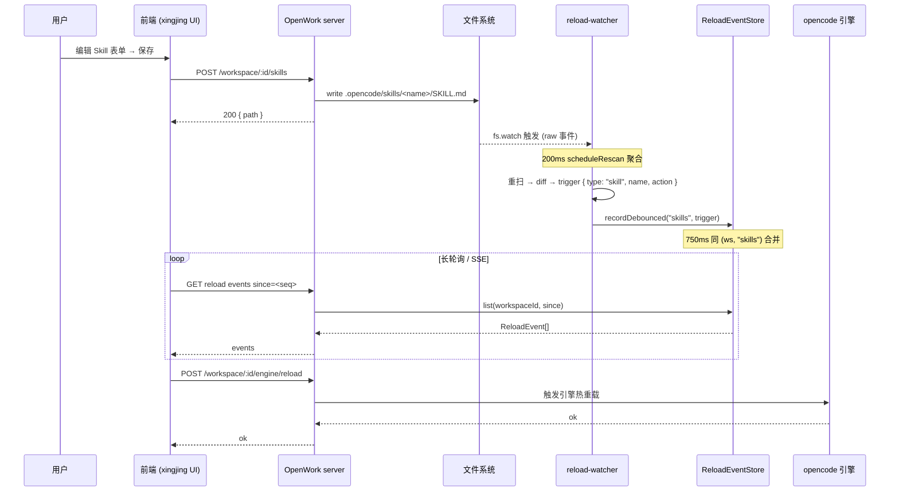

# 05b · OpenWork 平台 — Skill / Agent / MCP / Command 子系统

> 上游：[05-openwork-platform-overview.md](./05-openwork-platform-overview.md)
> 同级：[05a-openwork-session-message.md](./05a-openwork-session-message.md) · [05c-openwork-workspace-fileops.md](./05c-openwork-workspace-fileops.md)

OpenWork 平台对外暴露四类「可扩展能力」：**Skill（技能）/ Command（斜杠命令）/ MCP（外部工具服务器）/ Plugin（运行时插件）**。Agent（智能体）作为第五类能力，其定义文件由平台监听变更、但具体注册与调度交由 opencode 引擎处理。

本文档以 `apps/server/src/` 下 8 份核心代码为唯一信息源，回答以下问题：

1. 四类扩展如何在 workspace / global 两层文件系统中定义？
2. 扫描器、注册表、frontmatter 解析器是否复用？
3. 文件变更如何触发 opencode 引擎的热重载？
4. Hub（远端 Skill 市场）的拉取与安装链路是什么？
5. server 端对外暴露了哪些 REST 路由？

---

## 1. 子系统总览

### 1.1 「文件即配置」总原则

OpenWork 平台层不维护任何内存中的扩展注册表。**四类扩展 + Agent 全部以 `.opencode/<kind>/` 下的文件作为单一事实源（single source of truth）**：

| 子系统 | workspace 路径 | global 路径 | 配置形态 |
|---|---|---|---|
| Skill | `.opencode/skills/<name>/SKILL.md` 或 `.opencode/skills/<domain>/<name>/SKILL.md`；`.claude/skills/...`（兼容 Claude Code） | `~/.config/opencode/skills/`、`~/.claude/skills/`、`~/.agents/skills/`、`~/.agent/skills/` | Markdown + YAML frontmatter |
| Command | `.opencode/commands/<name>.md`（单文件） | `~/.config/opencode/commands/<name>.md` | Markdown + YAML frontmatter |
| MCP | `opencode.jsonc` 顶层 `mcp` 字段；`tools.deny` 数组禁用 | 全局 `opencode.jsonc` | JSONC 字段 |
| Plugin | `opencode.jsonc` 顶层 `plugin` 数组 + `.opencode/plugins/*.{js,ts}` | `~/.config/opencode/plugins/*.{js,ts}` | JSONC + 物理文件 |
| Agent | `.opencode/agents/`、`.opencode/agent/`（两个目录均监听） | — | 由 opencode 引擎自管 |

> 服务端的 `listSkills / listCommands / listMcp / listPlugins` 函数都是**纯文件系统扫描 + 当场解析**，不持有任何缓存（Hub catalog 除外，见第 7 节）。这一设计意味着：所有变更只需写文件，下一次 list 调用即可见。

### 1.2 子系统职责矩阵

```
┌──────────────────────────────────────────────────────────────────┐
│  OpenWork 平台 server 端 (apps/server/src/)                      │
├──────────────────────────────────────────────────────────────────┤
│                                                                  │
│  ┌────────┐  ┌──────────┐  ┌──────┐  ┌─────────┐  ┌──────────┐ │
│  │ skills │  │ commands │  │ mcp  │  │ plugins │  │ skill-hub│ │
│  │  .ts   │  │   .ts    │  │ .ts  │  │  .ts    │  │   .ts    │ │
│  └───┬────┘  └────┬─────┘  └──┬───┘  └────┬────┘  └────┬─────┘ │
│      │            │           │            │            │       │
│      ├────────────┴─────┬─────┴────────────┘            │       │
│      ▼                  ▼                               │       │
│  ┌──────────────┐  ┌──────────────┐                     │       │
│  │ frontmatter  │  │  jsonc       │                     │       │
│  │ (yaml 库)    │  │ (jsonc-parser│                     │       │
│  └──────────────┘  └──────────────┘                     │       │
│      │                  │                               │       │
│      └──────────┬───────┘                               │       │
│                 ▼                                       │       │
│         ┌────────────────┐                              │       │
│         │ workspace-     │  统一路径常量                │       │
│         │ files.ts       │  (.opencode 默认目录)        │       │
│         └────────────────┘                              │       │
│                                                         │       │
│  ┌──────────────────────────────────────────────────┐  │       │
│  │ reload-watcher.ts  + events.ts                   │◀─┘       │
│  │ (fs.watch 5 子树 + workspace root 顶层文件)      │          │
│  │ debounce 750ms → ReloadEventStore (200 ring)     │          │
│  └──────────────────────────────────────────────────┘          │
│                                                                  │
└──────────────────────────────────────────────────────────────────┘
```

> **关键事实**：图中 `frontmatter.ts` 与 `workspace-files.ts` 被 skills / commands 共享；`jsonc.ts` 被 mcp / plugins 共享；`reload-watcher` 同时观测全部 5 类目录（含 agent）。

---

## 2. 共享基础：frontmatter 解析器

[apps/server/src/frontmatter.ts](file:///Users/umasuo_m3pro/Desktop/startup/xingjing/harnesswork/apps/server/src/frontmatter.ts) 仅 18 行，是 Skill 与 Command 子系统的解析底座：

```ts
import { parse, stringify } from "yaml";   // 服务端用 yaml 库（不是 js-yaml）

export function parseFrontmatter(content: string) {
  const match = content.match(/^---\r?\n([\s\S]*?)\r?\n---\r?\n?/);
  if (!match) return { data: {}, body: content };
  const data = (parse(match[1] ?? "") as Record<string, unknown>) ?? {};
  return { data, body: content.slice(match[0].length) };
}

export function buildFrontmatter(data: Record<string, unknown>): string {
  return `---\n${stringify(data).trimEnd()}\n---\n`;
}
```

[parseFrontmatter](file:///Users/umasuo_m3pro/Desktop/startup/xingjing/harnesswork/apps/server/src/frontmatter.ts#L3-L8) 关键设计：

| 决策 | 实现 | 影响 |
|---|---|---|
| 正则只匹配文件**开头**的 `---` 块 | `/^---\r?\n([\s\S]*?)\r?\n---\r?\n?/` | 文件中段出现的 `---` 不会误伤；CRLF 兼容 |
| 缺失或解析失败时返回 `{ data: {}, body: 原文 }` | `if (!match) return ...` | 上层调用永远拿到一致结构，不需要 try/catch |
| body 是去掉 frontmatter 后的剩余原文 | `content.slice(match[0].length)` | Skill 用 body 提取 "When to use" section；Command 直接当 template |

[buildFrontmatter](file:///Users/umasuo_m3pro/Desktop/startup/xingjing/harnesswork/apps/server/src/frontmatter.ts#L11-L17) 是其逆运算，被 [upsertSkill](file:///Users/umasuo_m3pro/Desktop/startup/xingjing/harnesswork/apps/server/src/skills.ts#L148) 与 [upsertCommand](file:///Users/umasuo_m3pro/Desktop/startup/xingjing/harnesswork/apps/server/src/commands.ts#L68) 共用。

---

## 3. 共享基础：workspace-files.ts 路径常量

[apps/server/src/workspace-files.ts](file:///Users/umasuo_m3pro/Desktop/startup/xingjing/harnesswork/apps/server/src/workspace-files.ts) 把全部「OpenWork 在工作区中的默认路径」收口为函数：

```ts
export function opencodeConfigPath(workspaceRoot: string): string {
  // 优先 .jsonc，再 .json
  const jsonc = join(workspaceRoot, "opencode.jsonc");
  return existsSync(jsonc) ? jsonc : join(workspaceRoot, "opencode.json");
}

export function openworkConfigPath(workspaceRoot: string): string {
  return join(workspaceRoot, ".opencode", "openwork.json");
}

export function projectSkillsDir(workspaceRoot: string): string   { return join(workspaceRoot, ".opencode", "skills");   }
export function projectCommandsDir(workspaceRoot: string): string { return join(workspaceRoot, ".opencode", "commands"); }
export function projectPluginsDir(workspaceRoot: string): string  { return join(workspaceRoot, ".opencode", "plugins");  }
```

> **设计要点**：所有写入操作（upsertSkill / upsertCommand / addPlugin / addMcp）必定写到 workspace 路径，**绝不写 global**。global 文件系统仅做读取兜底。

---

## 4. Skill 子系统

> 源码：[apps/server/src/skills.ts](file:///Users/umasuo_m3pro/Desktop/startup/xingjing/harnesswork/apps/server/src/skills.ts) · 类型：[SkillItem](file:///Users/umasuo_m3pro/Desktop/startup/xingjing/harnesswork/apps/server/src/types.ts#L174-L180)

### 4.1 数据模型

```ts
export interface SkillItem {
  name: string;          // 目录名（不含路径）
  path: string;          // SKILL.md 绝对路径
  description: string;   // frontmatter.description
  scope: "project" | "global";
  trigger?: string;      // 优先级：frontmatter.trigger → frontmatter.when → body 的 "When to use" section
}
```

### 4.2 扫描算法：双层目录布局

[listSkillsInDir](file:///Users/umasuo_m3pro/Desktop/startup/xingjing/harnesswork/apps/server/src/skills.ts#L84-L117) 同时支持两种布局：

```
布局 A：扁平
  .opencode/skills/
    └─ brainstorming/
       └─ SKILL.md

布局 B：domain 分组
  .opencode/skills/
    └─ engineering/
       └─ test-driven-development/
          └─ SKILL.md
```

扫描逻辑（伪代码）：

```
for entry in readdir(dir):
  if entry is dir:
    if exists(entry/SKILL.md):       # 布局 A：name = entry
      collect(name=entry, path=entry/SKILL.md)
    else:                             # 布局 B：递归一层
      for sub in readdir(entry):
        if exists(entry/sub/SKILL.md):
          collect(name=sub, path=entry/sub/SKILL.md, domain=entry)
```

### 4.3 Workspace 路径解析（git root 上溯）

[listSkills](file:///Users/umasuo_m3pro/Desktop/startup/xingjing/harnesswork/apps/server/src/skills.ts#L119-L146) 不只看当前 workspace root，还会**沿 git 根目录向上**找 `.opencode/skills` 与 `.claude/skills`：

```
 cwd: /Users/me/Desktop/repo/apps/web
 git root: /Users/me/Desktop/repo
 ↓
 candidates (按顺序):
   1. /Users/me/Desktop/repo/apps/web/.opencode/skills
   2. /Users/me/Desktop/repo/apps/web/.claude/skills
   3. /Users/me/Desktop/repo/.opencode/skills        ← git root
   4. /Users/me/Desktop/repo/.claude/skills          ← Claude Code 兼容
```

`includeGlobal=true` 时再追加 4 个 global 候选：

```
~/.config/opencode/skills      ← OpenWork/opencode 主源
~/.claude/skills               ← Claude Code 兼容
~/.agents/skills               ← agents 生态
~/.agent/skills                ← 单数兼容
```

### 4.4 Trigger 字段的三级 fallback

```
1. frontmatter.trigger        ← 显式
2. frontmatter.when           ← 别名
3. body 中 "## When to use" 之后的段落（第一段）   ← 内容兜底
```

这一设计意味着 Skill 作者**不必显式声明 trigger**，只要在正文写一个清晰的「何时使用」章节即可被引擎识别。

### 4.5 写入：[upsertSkill](file:///Users/umasuo_m3pro/Desktop/startup/xingjing/harnesswork/apps/server/src/skills.ts#L148-L187)

```
输入: workspaceRoot, { name, description, body, trigger? }
↓
validateSkillName(name)       # 仅允许 [a-z0-9-]，非空
validateDescription(...)      # 长度 ≤ 1024
↓
target = projectSkillsDir(root)/<name>/SKILL.md
mkdir -p <name>/
write target = buildFrontmatter({name, description, trigger?}) + "\n" + body
return { path: target, name }
```

写入策略：**总是写到 workspace 的 `.opencode/skills/<name>/SKILL.md`**，即便同名 Skill 已存在于 `.claude/skills/` 或 global 也只覆盖 workspace 副本，避免破坏其他来源。

### 4.6 删除：[deleteSkill](file:///Users/umasuo_m3pro/Desktop/startup/xingjing/harnesswork/apps/server/src/skills.ts#L189-L200)

```
target = projectSkillsDir(root)/<name>
rm -rf <target>     # 整个目录树（含子文件如 references/, scripts/）
```

> **范围限制**：仅删除 `.opencode/skills/<name>/`。global Skill 与 `.claude/skills` 下的同名 Skill 不会被触碰。

---

## 5. Command 子系统

> 源码：[apps/server/src/commands.ts](file:///Users/umasuo_m3pro/Desktop/startup/xingjing/harnesswork/apps/server/src/commands.ts) · 类型：[CommandItem](file:///Users/umasuo_m3pro/Desktop/startup/xingjing/harnesswork/apps/server/src/types.ts#L194-L202)

### 5.1 数据模型

```ts
export interface CommandItem {
  name: string;                       // 文件名去掉 .md
  description?: string;               // frontmatter.description
  template: string;                   // body（去 frontmatter 后的全文，即斜杠命令展开内容）
  agent?: string;                     // frontmatter.agent（指定执行该命令的 Agent）
  model?: string | null;              // frontmatter.model（覆盖默认 model；null 表示沿用引擎默认）
  subtask?: boolean;                  // frontmatter.subtask（是否作为子任务执行）
  scope: "workspace" | "global";
}
```

### 5.2 扫描算法：单文件布局

[listCommandsInDir](file:///Users/umasuo_m3pro/Desktop/startup/xingjing/harnesswork/apps/server/src/commands.ts#L31-L58) 与 Skill 不同：**Command 是单文件 `<name>.md`，无目录嵌套**。

```
.opencode/commands/
  ├─ plan.md
  ├─ refactor.md
  └─ test.md
```

每个 `.md` 文件被解析为一个 [CommandItem](file:///Users/umasuo_m3pro/Desktop/startup/xingjing/harnesswork/apps/server/src/types.ts#L194)。

### 5.3 兼容性：[repairLegacyCommandFile](file:///Users/umasuo_m3pro/Desktop/startup/xingjing/harnesswork/apps/server/src/commands.ts#L17-L29)

历史版本的 Command 文件可能包含 `model: null` 这种**空值字段**，被某些 YAML 解析器渲染为字符串 `"null"`。修复函数会在 list 时**主动重写文件**，把 `model: null` 字段移除：

```
读 SKILL frontmatter:
  if frontmatter.model === null:
    delete frontmatter.model
    rewrite file
```

> 这也是**为何 list 接口可能产生写盘**的唯一例外。其他 list 路径均为纯读。

### 5.4 写入：[upsertCommand](file:///Users/umasuo_m3pro/Desktop/startup/xingjing/harnesswork/apps/server/src/commands.ts#L68-L90)

```
输入: workspaceRoot, { name, description?, template, agent?, model?, subtask? }
↓
target = projectCommandsDir(root)/<name>.md
write target =
  buildFrontmatter({ name, description?, agent?, model?, subtask? })
  + template
return target
```

### 5.5 Scope 选择

[listCommands](file:///Users/umasuo_m3pro/Desktop/startup/xingjing/harnesswork/apps/server/src/commands.ts#L60-L66) 接受 `scope` 参数（`"workspace" | "global"`），**不像 Skill 那样合并**：调用方必须明确选择来源。

| scope | 路径 |
|---|---|
| `workspace` | `<workspaceRoot>/.opencode/commands/` |
| `global` | `~/.config/opencode/commands/` |

---

## 6. MCP 子系统

> 源码：[apps/server/src/mcp.ts](file:///Users/umasuo_m3pro/Desktop/startup/xingjing/harnesswork/apps/server/src/mcp.ts) · 类型：[McpItem](file:///Users/umasuo_m3pro/Desktop/startup/xingjing/harnesswork/apps/server/src/types.ts#L167-L172)

### 6.1 数据模型

```ts
export interface McpItem {
  name: string;
  config: Record<string, unknown>;     // 透传 mcp.<name> 下的全部字段
  source: "config.project" | "config.global" | "config.remote";
  disabledByTools?: boolean;           // 被 tools.deny 命中
}
```

### 6.2 配置驱动：与 opencode 引擎完全对齐

MCP 子系统**不扫描任何文件目录**。它直接读取 [opencodeConfigPath](file:///Users/umasuo_m3pro/Desktop/startup/xingjing/harnesswork/apps/server/src/workspace-files.ts) 解析出的 JSONC：

```jsonc
// opencode.jsonc
{
  "mcp": {
    "filesystem": { "type": "local", "command": ["..."] },
    "github":     { "type": "remote", "url": "..." }
  },
  "tools": {
    "deny": ["mcp.filesystem.*"]
  }
}
```

### 6.3 合并规则：project 覆盖 global

[listMcp](file:///Users/umasuo_m3pro/Desktop/startup/xingjing/harnesswork/apps/server/src/mcp.ts#L40-L72) 同时读取 global `~/.config/opencode/opencode.jsonc` 与 project `<root>/opencode.jsonc`：

```
1. 先列 global mcp.* → source = "config.global"
2. 再列 project mcp.* → source = "config.project"
3. 同名时 project 覆盖 global（直接 set 进 Map）
4. 对每个条目：computeIfMcpDisabledByTools()
```

### 6.4 工具禁用：minimatch 模式匹配

[isMcpDisabledByTools](file:///Users/umasuo_m3pro/Desktop/startup/xingjing/harnesswork/apps/server/src/mcp.ts#L33-L38) 用 minimatch 检查 `tools.deny` 数组是否命中以下任一候选模式：

```
mcp.<name>          # 精确
mcp.<name>.*        # 任意子工具
mcp:<name>          # 冒号分隔变体
mcp:<name>:*
mcp.*               # 全部 MCP
mcp:*
```

### 6.5 写入：通过 [updateJsoncTopLevel](file:///Users/umasuo_m3pro/Desktop/startup/xingjing/harnesswork/apps/server/src/jsonc.ts) 改写 opencode.jsonc

[addMcp](file:///Users/umasuo_m3pro/Desktop/startup/xingjing/harnesswork/apps/server/src/mcp.ts#L74-L87) / [removeMcp](file:///Users/umasuo_m3pro/Desktop/startup/xingjing/harnesswork/apps/server/src/mcp.ts#L89-L96) 不直接 `JSON.stringify` 整个文件，而是用 jsonc-parser 的 modify API **保留注释与格式**地改写顶层 `mcp` 字段。这是为了让用户手写的 `// 注释` 不被覆盖。

---

## 7. Skill Hub（远端市场）

> 源码：[apps/server/src/skill-hub.ts](file:///Users/umasuo_m3pro/Desktop/startup/xingjing/harnesswork/apps/server/src/skill-hub.ts) · 类型：[HubSkillItem](file:///Users/umasuo_m3pro/Desktop/startup/xingjing/harnesswork/apps/server/src/types.ts#L182-L192)

### 7.1 默认仓库与缓存

```ts
const DEFAULT_HUB_REPO = { owner: "different-ai", repo: "openwork-hub", ref: "main" };
const CATALOG_TTL_MS   = 5 * 60 * 1000;     // 5 分钟
```

Hub 是**整个 server 端唯一带内存缓存**的子系统。缓存键为 `${owner}/${repo}@${ref}`，TTL 5 分钟，过期后下次 `listHubSkills` 触发重拉。

### 7.2 列举：[listHubSkills](file:///Users/umasuo_m3pro/Desktop/startup/xingjing/harnesswork/apps/server/src/skill-hub.ts#L103-L164)

```
1. 命中 catalog 缓存 → 直接返回
2. GitHub API: GET /repos/<owner>/<repo>/contents/skills?ref=<ref>
3. 过滤出目录 entries
4. 并发度 6 拉每个 <skill>/SKILL.md 的原始内容
5. parseFrontmatter 提取 description / trigger
6. 组装 HubSkillItem[]，写入缓存
```

> **并发度 6 是硬编码的限流策略**——避免对 GitHub raw 接口造成突发压力。

### 7.3 安装：[installHubSkill](file:///Users/umasuo_m3pro/Desktop/startup/xingjing/harnesswork/apps/server/src/skill-hub.ts#L182-L263)

不是简单地 `cp SKILL.md`，因为 Skill 目录可能含 `references/`、`scripts/` 等多文件：

```
1. GitHub git tree API: GET /repos/.../git/trees/<ref>?recursive=1
2. 过滤出 path 以 "skills/<name>/" 开头的全部 blob
3. 对每个 blob:
   a. relPath = path.slice("skills/<name>/".length)
   b. resolveSafeChild(.opencode/skills/<name>, relPath)   # 防路径穿越
   c. fetch raw content
   d. mkdir -p <dirname>
   e. write file
   f. if mode === "100755": chmod 0o755                   # 保留可执行位
4. overwrite=false 时若目标已存在则跳过整个安装
```

#### `resolveSafeChild` —— 路径穿越防御

```
parent = .opencode/skills/<name>
child  = path.join(parent, relPath)
if !child.startsWith(parent + sep): throw Error("Path traversal")
```

避免远端仓库通过 `../../../etc/passwd` 这种 path 写到 workspace 之外。

---

## 8. Plugin 子系统

> 源码：[apps/server/src/plugins.ts](file:///Users/umasuo_m3pro/Desktop/startup/xingjing/harnesswork/apps/server/src/plugins.ts) · 类型：[PluginItem](file:///Users/umasuo_m3pro/Desktop/startup/xingjing/harnesswork/apps/server/src/types.ts#L160-L165)

Plugin 是 OpenWork 引擎运行时加载的 JS/TS 模块，分两种来源：

### 8.1 Source 类型

```ts
export interface PluginItem {
  spec: string;                                          // 模块标识符
  source: "config" | "dir.project" | "dir.global";
  scope: "project" | "global";
  path?: string;                                         // 物理文件路径（dir.* 来源）
}
```

| source | 含义 |
|---|---|
| `config` | `opencode.jsonc` 的 `plugin: ["..."]` 字符串数组（npm 包名 / file:/ git: 等） |
| `dir.project` | `.opencode/plugins/*.{js,ts}` 自动加载 |
| `dir.global` | `~/.config/opencode/plugins/*.{js,ts}` 自动加载 |

### 8.2 加载顺序

[listPlugins](file:///Users/umasuo_m3pro/Desktop/startup/xingjing/harnesswork/apps/server/src/plugins.ts#L52-L73) 返回的 `loadOrder`：

```
["config.global", "config.project", "dir.global", "dir.project"]
```

这意味着 **dir.project 最后加载、优先级最高**。

### 8.3 [normalizePluginSpec](file:///Users/umasuo_m3pro/Desktop/startup/xingjing/harnesswork/apps/server/src/plugins.ts#L10-L24) 去版本号

用于在 add/remove 时判定「是否为同一个插件」：

```
file:/path/to/plugin     → 原样
http://...               → 原样
git:...                  → 原样
/abs/path                → 原样
@scope/pkg@1.2.3         → @scope/pkg
my-plugin@1.0.0          → my-plugin
```

后续 `addPlugin` 用归一化结果做去重：

```
existing = pluginSpecs.find(item => normalize(item) === normalize(spec))
if existing: return false       # 已存在
push(spec, 原样)                # 但写入时保留用户给的版本号
```

---

## 9. Agent 子系统：交给 opencode 引擎

> 关键事实：**OpenWork 平台 server 端没有 `agents.ts` 文件、没有 `listAgents` 函数、没有 Agent 路由**。

唯一的平台层接触点在 [reload-watcher.ts](file:///Users/umasuo_m3pro/Desktop/startup/xingjing/harnesswork/apps/server/src/reload-watcher.ts#L176-L205)：监听 `.opencode/agents/` 与 `.opencode/agent/`（兼容单复数）两个目录的文件变更，触发 reason=`agents` 的 reload 事件，由 opencode 引擎自行重载 Agent 注册表。

```
平台层职责:
  ├─ 监听 .opencode/agents/ 子树变更
  ├─ 监听 .opencode/agent/  子树变更（单数兼容）
  └─ 派发 ReloadEvent { reason: "agents", trigger: { type: "agent" } }

opencode 引擎职责（不在本仓库范围）:
  ├─ Agent 定义文件解析
  ├─ Agent 注册表
  ├─ Session 与 Agent 的绑定
  └─ 子 Agent 派发链路
```

> **设计含义**：星静（xingjing）若要扩展 Agent，只需把 Agent 定义文件写入 `.opencode/agents/`，平台会自动通知引擎重载——无需任何 server 端代码改动。

---

## 10. 文件变更监听：reload-watcher

> 源码：[apps/server/src/reload-watcher.ts](file:///Users/umasuo_m3pro/Desktop/startup/xingjing/harnesswork/apps/server/src/reload-watcher.ts)（393 行）

### 10.1 监听拓扑

每个 workspace 启动一组 watcher，由 [startWorkspaceReloadWatcher](file:///Users/umasuo_m3pro/Desktop/startup/xingjing/harnesswork/apps/server/src/reload-watcher.ts#L64-L205) 装配：

```
workspace_root/
  ├─ opencode.json          ┐
  ├─ opencode.jsonc         │   workspace root 顶层文件监听
  ├─ AGENTS.md              ┘   reason 按文件名映射
  │
  └─ .opencode/
     ├─ skills/      ──→ createDirectoryTreeWatcher (reason: "skills",   trigger: "skill")
     ├─ commands/    ──→ createDirectoryTreeWatcher (reason: "commands", trigger: "command")
     ├─ plugins/     ──→ createDirectoryTreeWatcher (reason: "plugins",  trigger: "plugin")
     ├─ agents/      ──→ createDirectoryTreeWatcher (reason: "agents",   trigger: "agent")
     └─ agent/       ──→ createDirectoryTreeWatcher (reason: "agents",   trigger: "agent")
```

> 5 棵子树共用同一个 [createDirectoryTreeWatcher](file:///Users/umasuo_m3pro/Desktop/startup/xingjing/harnesswork/apps/server/src/reload-watcher.ts#L207-L391) 工厂。

### 10.2 单棵 watcher 的内部时序

```
fs.watch(rootDir, { persistent: false })
       │
       │ (任意文件 add/change/remove)
       ▼
   scheduleRescan(200ms)         # 200ms 内多个原始事件聚合为一次扫盘
       │
       ▼
   重扫整棵子树                  # 不依赖 fs.watch 的事件细节，避免遗漏
       │
       ▼
   diff 上次快照 → name + action
       │
       ▼
   record(reason, { type, name, action, path })
       │
       ▼
   recordDebounced(750ms)         # events.ts 中按 (workspaceId, reason) 去重合并
```

#### 跳过名单

```
.git, node_modules, .DS_Store, Thumbs.db
```

> **性能取舍**：`persistent: false` 让 watcher 不阻止进程退出；200ms 重扫窗口处理 fs.watch 在 macOS 上「同一个保存动作产生 2-3 个 raw 事件」的已知问题；750ms debounce 避免引擎被高频 reload 淹没。

### 10.3 触发 trigger 的 name 提取

| 子系统 | 路径示例 | name |
|---|---|---|
| skills | `.opencode/skills/foo/SKILL.md` | `foo`（首层目录名） |
| commands | `.opencode/commands/plan.md` | `plan`（去掉 `.md`） |
| plugins | `.opencode/plugins/my-plugin.js` | `my-plugin.js` |
| agents | `.opencode/agents/reviewer.md` | `reviewer`（去掉 `.md`） |

仅 [reason ∈ {skills, commands, agents}](file:///Users/umasuo_m3pro/Desktop/startup/xingjing/harnesswork/apps/server/src/reload-watcher.ts#L250) 时才填充 trigger 元数据，其他场景仅传递 reason。

---

## 11. Reload 事件总线：events.ts

> 源码：[apps/server/src/events.ts](file:///Users/umasuo_m3pro/Desktop/startup/xingjing/harnesswork/apps/server/src/events.ts)（55 行）

### 11.1 数据结构

```ts
export interface ReloadEvent {
  id: string;
  seq: number;                  // 全局递增序号
  workspaceId: string;
  reason: ReloadReason;         // "plugins" | "skills" | "mcp" | "config" | "agents" | "commands"
  trigger?: ReloadTrigger;
  timestamp: number;
}
```

### 11.2 环形缓冲

```ts
const MAX_EVENTS = 200;
const events: ReloadEvent[] = [];   // 满 200 条后 shift 头部
```

> **设计含义**：客户端必须**长轮询/SSE 持续追**事件，离线超过 200 条增量将丢失最早的部分。

### 11.3 [recordDebounced](file:///Users/umasuo_m3pro/Desktop/startup/xingjing/harnesswork/apps/server/src/events.ts) 去重

合并键：`${workspaceId}:${reason}`（**注意：trigger 不参与合并键**）。

```
750ms 内同 (workspaceId, reason) 多次触发 → 仅保留最后一次
触发时机：trailing edge（debounce 结束才推入 ring）
```

### 11.4 [list(workspaceId, since)](file:///Users/umasuo_m3pro/Desktop/startup/xingjing/harnesswork/apps/server/src/events.ts) 增量查询

```
return events.filter(e => e.workspaceId === workspaceId && e.seq > since)
```

客户端通过持续递增的 `since = lastSeq` 做长轮询。

---

## 12. 路由暴露面（server.ts）

> 源码：[apps/server/src/server.ts](file:///Users/umasuo_m3pro/Desktop/startup/xingjing/harnesswork/apps/server/src/server.ts)（共 5000+ 行，下表列出本节相关 13 条路由）

### 12.1 Skill 相关

| Method | Path | 函数 | 行号 |
|---|---|---|---|
| GET | `/hub/skills` | listHubSkills | [3289](file:///Users/umasuo_m3pro/Desktop/startup/xingjing/harnesswork/apps/server/src/server.ts#L3289) |
| GET | `/workspace/:id/skills` | listSkills | [3301](file:///Users/umasuo_m3pro/Desktop/startup/xingjing/harnesswork/apps/server/src/server.ts#L3301) |
| POST | `/workspace/:id/skills/hub/:name` | installHubSkill | [3308](file:///Users/umasuo_m3pro/Desktop/startup/xingjing/harnesswork/apps/server/src/server.ts#L3308) |
| GET | `/workspace/:id/skills/:name` | 读单个 SKILL.md | [3354](file:///Users/umasuo_m3pro/Desktop/startup/xingjing/harnesswork/apps/server/src/server.ts#L3354) |
| POST | `/workspace/:id/skills` | upsertSkill | [3370](file:///Users/umasuo_m3pro/Desktop/startup/xingjing/harnesswork/apps/server/src/server.ts#L3370) |
| DELETE | `/workspace/:id/skills/:name` | deleteSkill | [3403](file:///Users/umasuo_m3pro/Desktop/startup/xingjing/harnesswork/apps/server/src/server.ts#L3403) |

### 12.2 Command 相关

| Method | Path | 函数 | 行号 |
|---|---|---|---|
| GET | `/workspace/:id/commands` | listCommands | [3562](file:///Users/umasuo_m3pro/Desktop/startup/xingjing/harnesswork/apps/server/src/server.ts#L3562) |
| POST | `/workspace/:id/commands` | upsertCommand | [3572](file:///Users/umasuo_m3pro/Desktop/startup/xingjing/harnesswork/apps/server/src/server.ts#L3572) |
| DELETE | `/workspace/:id/commands/:name` | deleteCommand | [3613](file:///Users/umasuo_m3pro/Desktop/startup/xingjing/harnesswork/apps/server/src/server.ts#L3613) |

### 12.3 MCP 相关

| Method | Path | 函数 | 行号 |
|---|---|---|---|
| GET | `/workspace/:id/mcp` | listMcp | [3436](file:///Users/umasuo_m3pro/Desktop/startup/xingjing/harnesswork/apps/server/src/server.ts#L3436) |
| POST | `/workspace/:id/mcp` | addMcp | [3442](file:///Users/umasuo_m3pro/Desktop/startup/xingjing/harnesswork/apps/server/src/server.ts#L3442) |
| DELETE | `/workspace/:id/mcp/:name` | removeMcp | [3477](file:///Users/umasuo_m3pro/Desktop/startup/xingjing/harnesswork/apps/server/src/server.ts#L3477) |

### 12.4 Plugin 相关

| Method | Path | 函数 | 行号 |
|---|---|---|---|
| GET | `/workspace/:id/plugins` | listPlugins | [3215](file:///Users/umasuo_m3pro/Desktop/startup/xingjing/harnesswork/apps/server/src/server.ts#L3215) |
| POST | `/workspace/:id/plugins` | addPlugin | [3222](file:///Users/umasuo_m3pro/Desktop/startup/xingjing/harnesswork/apps/server/src/server.ts#L3222) |
| DELETE | `/workspace/:id/plugins/:name` | removePlugin | [3256](file:///Users/umasuo_m3pro/Desktop/startup/xingjing/harnesswork/apps/server/src/server.ts#L3256) |

### 12.5 引擎重载

| Method | Path | 用途 |
|---|---|---|
| POST | `/workspace/:id/engine/reload` | 由前端在收到 reload 事件后**主动通知引擎重新加载注册表**（[行 2612](file:///Users/umasuo_m3pro/Desktop/startup/xingjing/harnesswork/apps/server/src/server.ts#L2612)） |

---

## 13. 端到端时序：写一个 Skill 文件 → 引擎热重载



---

## 14. 关键设计决策汇总

| # | 决策 | 代码证据 | 影响 |
|---|---|---|---|
| 1 | 文件即配置，无内存注册表 | [skills.ts](file:///Users/umasuo_m3pro/Desktop/startup/xingjing/harnesswork/apps/server/src/skills.ts) / [commands.ts](file:///Users/umasuo_m3pro/Desktop/startup/xingjing/harnesswork/apps/server/src/commands.ts) 全部 list 函数都是当场扫盘 | 写文件即生效；调试只需看 `.opencode/` 目录 |
| 2 | global 只读、workspace 可写 | [upsertSkill](file:///Users/umasuo_m3pro/Desktop/startup/xingjing/harnesswork/apps/server/src/skills.ts#L148) / [upsertCommand](file:///Users/umasuo_m3pro/Desktop/startup/xingjing/harnesswork/apps/server/src/commands.ts#L68) 永远写 `projectXxxDir` | 不污染用户全局配置 |
| 3 | Skill 双布局 + 多源（`.opencode` / `.claude` / `.agents` / `.agent`） | [listSkills](file:///Users/umasuo_m3pro/Desktop/startup/xingjing/harnesswork/apps/server/src/skills.ts#L119) | 兼容 Claude Code、agents 生态 |
| 4 | Skill trigger 三级 fallback | [skills.ts](file:///Users/umasuo_m3pro/Desktop/startup/xingjing/harnesswork/apps/server/src/skills.ts#L84-L117) | 作者无需显式标 trigger |
| 5 | Command 单文件、无目录 | [listCommandsInDir](file:///Users/umasuo_m3pro/Desktop/startup/xingjing/harnesswork/apps/server/src/commands.ts#L31) | 与 Skill 区分；扫描更快 |
| 6 | Command 兼容旧版 `model: null` 自动修复 | [repairLegacyCommandFile](file:///Users/umasuo_m3pro/Desktop/startup/xingjing/harnesswork/apps/server/src/commands.ts#L17) | list 路径**唯一会写盘**的特例 |
| 7 | MCP 完全配置驱动，不扫目录 | [mcp.ts](file:///Users/umasuo_m3pro/Desktop/startup/xingjing/harnesswork/apps/server/src/mcp.ts) | 与 opencode 引擎对齐；无独立注册 |
| 8 | MCP 同名 project 覆盖 global | [listMcp](file:///Users/umasuo_m3pro/Desktop/startup/xingjing/harnesswork/apps/server/src/mcp.ts#L40) | 项目可定制全局默认 |
| 9 | tools.deny 6 候选 minimatch 匹配 | [isMcpDisabledByTools](file:///Users/umasuo_m3pro/Desktop/startup/xingjing/harnesswork/apps/server/src/mcp.ts#L33) | 兼容 `.` 与 `:` 两种 namespace 写法 |
| 10 | jsonc-parser 改写保留注释 | [addMcp](file:///Users/umasuo_m3pro/Desktop/startup/xingjing/harnesswork/apps/server/src/mcp.ts#L74) | 用户手写注释不丢失 |
| 11 | Hub 唯一缓存：5min TTL | [skill-hub.ts](file:///Users/umasuo_m3pro/Desktop/startup/xingjing/harnesswork/apps/server/src/skill-hub.ts) `CATALOG_TTL_MS` | 减少 GitHub API 压力 |
| 12 | Hub 拉取并发度 6 | [listHubSkills](file:///Users/umasuo_m3pro/Desktop/startup/xingjing/harnesswork/apps/server/src/skill-hub.ts#L103) | 限流策略 |
| 13 | resolveSafeChild 防路径穿越 | [installHubSkill](file:///Users/umasuo_m3pro/Desktop/startup/xingjing/harnesswork/apps/server/src/skill-hub.ts#L182) | 远端仓库不能写到 workspace 之外 |
| 14 | 100755 mode 自动 chmod | [installHubSkill](file:///Users/umasuo_m3pro/Desktop/startup/xingjing/harnesswork/apps/server/src/skill-hub.ts#L182) | 保留可执行脚本权限 |
| 15 | Plugin 4 来源固定加载序 | [listPlugins.loadOrder](file:///Users/umasuo_m3pro/Desktop/startup/xingjing/harnesswork/apps/server/src/plugins.ts#L70) | dir.project 优先级最高 |
| 16 | Agent 由引擎自管，平台只监听 | [reload-watcher.ts L176-L205](file:///Users/umasuo_m3pro/Desktop/startup/xingjing/harnesswork/apps/server/src/reload-watcher.ts#L176-L205) | 平台层零业务代码 |
| 17 | reload watcher 5 子树 + 顶层文件 | [startWorkspaceReloadWatcher](file:///Users/umasuo_m3pro/Desktop/startup/xingjing/harnesswork/apps/server/src/reload-watcher.ts#L64) | 涵盖全部扩展定义来源 |
| 18 | 200ms 重扫 + 750ms debounce 双层 | [createDirectoryTreeWatcher](file:///Users/umasuo_m3pro/Desktop/startup/xingjing/harnesswork/apps/server/src/reload-watcher.ts#L207) + [recordDebounced](file:///Users/umasuo_m3pro/Desktop/startup/xingjing/harnesswork/apps/server/src/events.ts) | 处理 macOS fs.watch 抖动 + 防引擎被淹 |
| 19 | ReloadEvent 200 条环形缓冲 | [events.ts](file:///Users/umasuo_m3pro/Desktop/startup/xingjing/harnesswork/apps/server/src/events.ts) `MAX_EVENTS` | 长离线会丢早期增量；客户端需高频拉 |
| 20 | frontmatter 解析失败兜底为空对象 | [parseFrontmatter](file:///Users/umasuo_m3pro/Desktop/startup/xingjing/harnesswork/apps/server/src/frontmatter.ts#L3) | 上层调用零 try/catch |

---

## 15. 与其他文档的衔接

| 关联文档 | 衔接点 |
|---|---|
| [05-openwork-platform-overview.md](./05-openwork-platform-overview.md) | 本子系统所在的 server 模块在平台总图中的位置 |
| [05a-openwork-session-message.md](./05a-openwork-session-message.md) | Session 中的 Skill/Command/MCP 调用是 part 的一种类型；reload 事件触发前端 store 失效 |
| [05c-openwork-workspace-fileops.md](./05c-openwork-workspace-fileops.md) | `.opencode/` 目录的物理文件是本子系统的写入目标；workspace 初始化创建该目录 |
| [05d-openwork-model-provider.md](./05d-openwork-model-provider.md) | Command frontmatter 的 `model` 字段引用 provider/model id |
| [05e-openwork-permission-question.md](./05e-openwork-permission-question.md) | tools.deny 与 permission 的关系；MCP 工具调用走权限网关 |
| [05f-openwork-settings-persistence.md](./05f-openwork-settings-persistence.md) | opencode.jsonc 的统一改写策略（jsonc-parser） |
| [05g-openwork-process-runtime.md](./05g-openwork-process-runtime.md) | reload-watcher 的进程内 fs.watch 句柄如何随 server 关闭 |
| [05h-openwork-state-architecture.md](./05h-openwork-state-architecture.md) | server 端「无内存注册表」原则与四层 Provider 架构的对应 |
| [40-agent-workshop.md](./40-agent-workshop.md) | 星静 Agent Workshop 编辑面如何调用 `/skills` 与 `/commands` 路由 |
