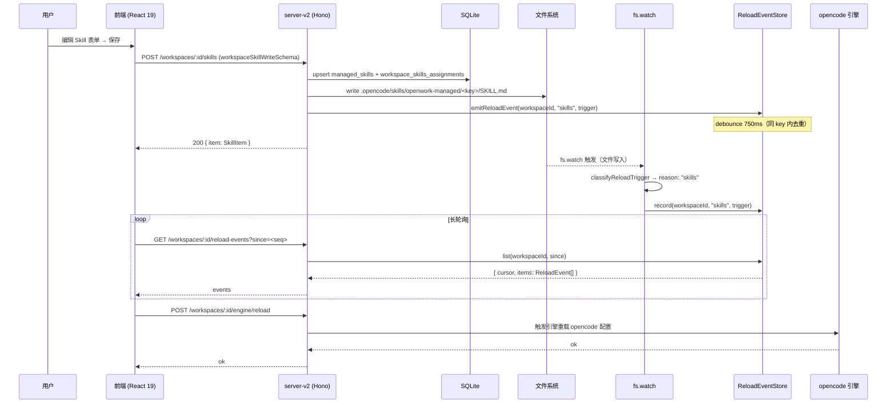

# 05b · OpenWork 平台 — Skill / Agent / MCP / Command 子系统

> 上游：[05-openwork-platform-overview.md](./05-openwork-platform-overview.md)
> 同级：[05a-openwork-session-message.md](./05a-openwork-session-message.md) · [05c-openwork-workspace-fileops.md](./05c-openwork-workspace-fileops.md)

OpenWork 平台对外暴露四类「可扩展能力」：**Skill（技能）/ Command（斜杠命令）/ MCP（外部工具服务器）/ Plugin（运行时插件）**。Agent（智能体）作为第五类能力，其定义文件由平台监听变更、但具体注册与调度交由 opencode 引擎处理。

本文档以 `apps/server-v2/src/` 下的核心代码为唯一信息源，回答以下问题：

1. 四类扩展如何在 managed 数据库 + workspace 文件系统中定义？
2. server-v2 的 ManagedResourceService 如何统一管理扩展类型？
3. 文件变更如何触发 opencode 引擎的热重载？
4. Hub（远端 Skill 市场）的拉取与安装链路是什么？
5. server-v2 暴露了哪些 REST 路由（Hono 框架）？
6. 前端 React 如何获取斜杠命令列表并渲染 MCP 视图？

---

## 1. 子系统总览

### 1.1 架构：数据库 + 文件双层模型

与旧版 server（纯文件扫描）不同，**server-v2 采用「SQLite 数据库 + 文件系统物化」双层模型**：

- **数据库层（单一事实源）**：Skill / MCP / Plugin / ProviderConfig 的元数据存储在 SQLite，通过 `ManagedConfigRecord` 表和 workspace 关联表管理。
- **文件物化层（opencode 引擎可见）**：`ManagedResourceService` 将数据库记录写入到 `.opencode/skills/openwork-managed/<key>/SKILL.md` 等物理路径，供 opencode 引擎扫描。

Command 是例外：仍以文件为单一事实源，直接读写 `.opencode/commands/<name>.md`。

### 1.2 ManagedKind 四类型

```ts
// apps/server-v2/src/services/managed-resource-service.ts
type ManagedKind = "mcps" | "plugins" | "providerConfigs" | "skills";
```

每种类型对应独立的数据库仓库（assignmentRepo + itemRepo）和 reloadReason：

| kind | reloadReason | triggerType |
|---|---|---|
| `skills` | `"skills"` | `"skill"` |
| `mcps` | `"mcp"` | `"mcp"` |
| `plugins` | `"plugins"` | `"plugin"` |
| `providerConfigs` | `"config"` | `"config"` |

### 1.3 子系统职责矩阵

```
┌──────────────────────────────────────────────────────────────────────────────┐
│  OpenWork 平台 server-v2 端 (apps/server-v2/src/)                            │
├──────────────────────────────────────────────────────────────────────────────┤
│                                                                              │
│  ┌────────────────────────────────────────────────────────────┐              │
│  │          ManagedResourceService (managed-resource-service.ts)│             │
│  │                                                            │              │
│  │  skills │ mcps │ plugins │ providerConfigs │ commands      │              │
│  └────────────────────────┬───────────────────────────────────┘              │
│                           │                                                  │
│          ┌────────────────┼─────────────────┐                               │
│          ▼                ▼                 ▼                               │
│  ┌──────────────┐  ┌────────────┐  ┌──────────────────────┐                 │
│  │ SQLite DB    │  │ 文件系统   │  │ ConfigMaterialization│                 │
│  │ (managed_*  │  │ .opencode/ │  │ Service              │                 │
│  │  表)        │  │ skills/    │  │ (物化 + 合并)        │                 │
│  └──────────────┘  └────────────┘  └──────────────────────┘                 │
│                                                                              │
│  ┌────────────────────────────────────────────────────┐                     │
│  │ WorkspaceFileService                               │                     │
│  │ ReloadEventStore (debounce 750ms, 最多 500 条)     │                     │
│  │ fs.watch 文件监听 → classifyReloadTrigger          │                     │
│  └────────────────────────────────────────────────────┘                     │
│                                                                              │
└──────────────────────────────────────────────────────────────────────────────┘
```

---

## 2. Zod Schema 定义

> 源码：`apps/server-v2/src/schemas/managed.ts`

### 2.1 通用 Managed Item Schema

```ts
export const managedItemSchema = z.object({
  auth: jsonObjectSchema.nullable(),
  cloudItemId: z.string().nullable(),
  config: jsonObjectSchema,
  createdAt: isoTimestampSchema,
  displayName: z.string(),
  id: identifierSchema,
  key: z.string().nullable(),
  metadata: jsonObjectSchema.nullable(),
  source: z.enum(["cloud_synced", "discovered", "imported", "openwork_managed"]),
  updatedAt: isoTimestampSchema,
  workspaceIds: z.array(identifierSchema),
});
```

`source` 字段描述扩展来源：`"openwork_managed"` 为平台默认创建，`"imported"` 为从 Hub 或 bundle 安装，`"cloud_synced"` 为云同步。

### 2.2 Workspace Skill Item Schema

```ts
export const workspaceSkillItemSchema = z.object({
  description: z.string(),
  name: z.string(),
  path: z.string(),
  scope: z.enum(["global", "project"]),
  trigger: z.string().optional(),
});
```

写入时使用：

```ts
export const workspaceSkillWriteSchema = z.object({
  content: z.string(),
  description: z.string().optional(),
  name: z.string(),
  trigger: z.string().optional(),
});
```

### 2.3 Workspace MCP Item Schema

```ts
export const workspaceMcpItemSchema = z.object({
  config: jsonObjectSchema,
  disabledByTools: z.boolean().optional(),
  name: z.string(),
  source: z.enum(["config.global", "config.project", "config.remote"]),
});

export const workspaceMcpWriteSchema = z.object({
  config: jsonObjectSchema,
  name: z.string(),
});
```

### 2.4 Workspace Plugin Item Schema

```ts
export const workspacePluginItemSchema = z.object({
  path: z.string().optional(),
  scope: z.enum(["global", "project"]),
  source: z.enum(["config", "dir.project", "dir.global"]),
  spec: z.string(),
});
```

### 2.5 Hub Skill Schema

```ts
export const hubSkillItemSchema = z.object({
  description: z.string(),
  name: z.string(),
  source: z.object({ owner: z.string(), path: z.string(), ref: z.string(), repo: z.string() }),
  trigger: z.string().optional(),
});
```

---

## 3. ManagedResourceService 核心逻辑

> 源码：`apps/server-v2/src/services/managed-resource-service.ts`

### 3.1 frontmatter 内联解析器

server-v2 不依赖外部 yaml 库，内置轻量级 frontmatter 解析器（简单 key: value 格式）：

```ts
function parseFrontmatter(content: string) {
  const match = content.match(/^---\r?\n([\s\S]*?)\r?\n---\r?\n?/);
  if (!match) return { body: content, data: {} };
  // 逐行解析 key: value，支持 boolean / number / string
  ...
}
```

与旧版不同，此版本**不依赖 `yaml` 库**，而是手动逐行解析。

### 3.2 Skill 文件路径规则

```ts
function workspaceSkillPath(workspace: WorkspaceRecord, key: string) {
  const baseDir = workspace.configDir?.trim() || workspace.dataDir?.trim() || "";
  return path.join(baseDir, ".opencode", "skills", "openwork-managed", key, "SKILL.md");
}
```

**关键区别**：server-v2 管理的 Skill 统一写入 `.opencode/skills/openwork-managed/<key>/SKILL.md`，而非旧版的 `.opencode/skills/<name>/SKILL.md`。这样可区分平台托管 Skill 与用户手写 Skill。

### 3.3 Trigger 提取：三级 fallback

```ts
const trigger =
  normalizeString(parsed.data.trigger)           // 1. frontmatter.trigger
  || normalizeString(parsed.data.when)            // 2. frontmatter.when
  || normalizeString(payload.trigger)             // 3. 调用方传入
  || extractTriggerFromBody(parsed.body);         // 4. 正文 "When to use" 章节
```

`extractTriggerFromBody` 扫描 body，找到 `## When to use` 标题后的第一个非空列表项或段落文本。

### 3.4 Skill 名称校验规则

```ts
const SKILL_NAME_REGEX = /^[a-z0-9]+(-[a-z0-9]+)*$/;
// 1-64 字符，kebab-case
```

Command 名称规则更宽松：

```ts
const COMMAND_NAME_REGEX = /^[A-Za-z0-9_-]+$/;
```

### 3.5 Workspace 可变性检查

server-v2 引入 workspace `kind` 概念：

```ts
function ensureWorkspaceMutable(workspace: WorkspaceRecord) {
  if (workspace.kind === "remote") {
    throw new RouteError(501, "not_implemented", "Remote workspace mutation unsupported.");
  }
  if (!workspace.dataDir?.trim()) {
    throw new RouteError(400, "invalid_request", "Workspace has no local data directory.");
  }
  return workspace;
}
```

远程 workspace（`kind === "remote"`）的 Skill / MCP / Plugin 不支持直接写操作。

### 3.6 assignments 多 workspace 关联

每个 managed item 可关联多个 workspace（多对多关系）：

```
ManagedConfigRecord (skills 表)
  ↕ N:M
WorkspaceSkillAssignment 表
  ↕ N:M
WorkspaceRecord 表
```

`updateAssignments` 方法可一次性更新一个 item 所关联的全部 workspace 列表，并在每个变更的 workspace 上触发 reload 事件和审计日志。

---

## 4. 「文件即配置」与「数据库托管」的混用

### 4.1 实际 `.opencode/skills/` 目录内容

本仓库根目录的 `.opencode/skills/` 包含以下子目录：

```
.opencode/skills/
├─ browser-setup-devtools/
├─ cargo-lock-manager/
├─ get-started/
├─ opencode-bridge/
├─ opencode-mirror/
├─ opencode-primitives/
├─ openwork-core/
├─ openwork-debug/
├─ openwork-docker-chrome-mcp/
├─ openwork-orchestrator-npm-publish/
├─ release/
├─ solidjs-patterns/
└─ tauri-solidjs/
```

这些是**用户手写 Skill**，直接存放在 `.opencode/skills/<name>/`（扁平布局）。

**server-v2 托管 Skill** 写入 `.opencode/skills/openwork-managed/<key>/SKILL.md`。

### 4.2 `.opencode/commands/` 文件内容

```
.opencode/commands/
├─ browser-setup.md
├─ hello-stranger.md
└─ release.md
```

Command 仍为单文件布局（`<name>.md`），不经过数据库，由 `listWorkspaceCommands` 扫描目录直接读取。

### 4.3 两类 Skill 的共存原则

| 来源 | 存储路径 | 管理方式 |
|---|---|---|
| 用户手写 | `.opencode/skills/<name>/SKILL.md` | 文件即配置，无数据库记录 |
| server-v2 托管 | `.opencode/skills/openwork-managed/<key>/SKILL.md` | 数据库 + 文件物化 |
| Hub 安装 | `.opencode/skills/openwork-managed/<key>/SKILL.md` | 数据库（`source: "imported"`）+ 文件物化 |

opencode 引擎在扫描时会发现全部三类，因为都在 `.opencode/skills/` 子树内。

---

## 5. Skill 子系统

> 源码：`apps/server-v2/src/services/managed-resource-service.ts`

### 5.1 写入流程：upsertWorkspaceSkill

```
输入: workspaceId, { name, content, description?, trigger? }
↓
validateSkillName(name)     # 仅允许 kebab-case，1-64 字符
ensureWorkspaceMutable()    # remote workspace 不支持写
↓
parseFrontmatter(content)
  → 提取 description / trigger
  → 若无 frontmatter，自动生成
↓
upsertManaged("skills", { key: name, config: { content }, metadata: { description, trigger, workspaceId } })
  → SQLite upsert managed_skills 表
  → replaceAssignments(workspaceId, [itemId])
↓
materializeAssignments("skills", [workspaceId], action, name)
  → config.ensureWorkspaceConfig(workspaceId)   # 写物理文件
  → files.emitReloadEvent(workspaceId, "skills", trigger)
  → recordWorkspaceAudit(...)
↓
return SkillItem { name, path, description, trigger, scope: "project" }
```

### 5.2 删除流程：deleteWorkspaceSkill

```
查找同 workspaceId + key 的 managed item
↓
若 workspaceIds.length === 1：deleteManaged（清理数据库 + 物化文件）
若 workspaceIds.length > 1：updateAssignments（只解除当前 workspace 关联）
↓
返回 { path: .opencode/skills/openwork-managed/<key> }
```

> **范围限制**：仅操作 openwork-managed 子目录内的 Skill。用户手写 Skill 不受影响。

---

## 6. Command 子系统

> 源码：`apps/server-v2/src/services/managed-resource-service.ts`（内联函数）

Command 是唯一**不经过 SQLite**、以文件为单一事实源的扩展类型。

### 6.1 数据结构

```ts
// 返回类型（非正式接口，从代码推断）
type WorkspaceCommand = {
  description?: string;
  name: string;
  template: string;  // SKILL.md body，去掉 frontmatter 后的全文
};
```

### 6.2 扫描算法：listWorkspaceCommands

```
directory = workspace.dataDir/.opencode/commands/
↓
for entry in readdir(directory):
  if !entry.isFile() || !entry.name.endsWith(".md"): skip
  ↓
  parseFrontmatter(content)
  → name: frontmatter.name 优先，否则 filename 去掉 .md
  → COMMAND_NAME_REGEX 校验失败则跳过
  ↓
  push({ name, description?, template: body.trim() })
↓
sort by name
```

### 6.3 写入：upsertWorkspaceCommand

```
directory = workspace.dataDir/.opencode/commands/
target = directory/<name>.md
write = buildFrontmatter({ description?, name }) + "\n" + template.trim() + "\n"
```

### 6.4 前端获取斜杠命令：listCommands

前端通过 `apps/app/src/app/lib/opencode-session.ts` 中的 `listCommands` 函数获取可用斜杠命令：

```ts
// opencode-session.ts
export async function listCommands(
  client: Client,
  directory?: string,
): Promise<CommandListItem[]> {
  const result = await client.command.list({ directory });
  const list = result?.data ?? [];
  return list.map((cmd) => ({
    id: `cmd:${cmd.name}`,
    name: String(cmd.name ?? ""),
    description: cmd.description ? String(cmd.description) : undefined,
    source: cmd.source as CommandListItem["source"],
  }));
}
```

该函数被 `session-route.tsx` 中的 Composer 组件调用，当用户键入 `/` 时触发，展示可用命令列表。

---

## 7. MCP 子系统

> 源码：`apps/server-v2/src/services/managed-resource-service.ts`

### 7.1 数据来源：数据库托管

server-v2 中 MCP 不再读取 `opencode.jsonc`，而是存储在 SQLite 的 `managed_mcps` 表中，通过 `listWorkspaceMcp` 返回当前 workspace 的有效 MCP 列表。

```ts
listWorkspaceMcp(workspaceId: string) {
  return kindConfig.mcps.assignmentRepo
    .listForWorkspace(workspaceId)
    .map((assignment) => repositories.mcps.getById(assignment.itemId))
    .filter(Boolean)
    .map((item) => ({
      config: item!.config,
      name: item!.key ?? item!.displayName,
      source: "config.project" as const,
    }));
}
```

### 7.2 MCP 配置校验

```ts
function validateMcpConfig(config: Record<string, unknown>) {
  const type = config.type;
  if (type !== "local" && type !== "remote") throw ...;
  if (type === "local") {
    // 必须有 command: string[] 且非空
  }
  if (type === "remote") {
    // 必须有 url: string
  }
}
```

`type: "local"` 对应本地进程（command 数组），`type: "remote"` 对应远端 URL。

### 7.3 添加 / 删除

```
addWorkspaceMcp(workspaceId, { name, config })
  → validateMcpName + validateMcpConfig
  → upsertManaged("mcps", { config, displayName: name, workspaceIds: [workspaceId] })
  → materializeAssignments("mcps", ...)
  → 返回 { items: listWorkspaceMcp(workspaceId) }

removeWorkspaceMcp(workspaceId, name)
  → 找到 managed item by key + workspaceId
  → 若单 workspace 关联：deleteManaged
  → 若多 workspace 关联：updateAssignments
  → 返回 { items: listWorkspaceMcp(workspaceId) }
```

### 7.4 MCP 前端视图

前端 MCP 视图由两层组件组成：

- `apps/app/src/react-app/domains/connections/mcp-view.tsx`：连接层（Connections 域），持有状态逻辑
- `apps/app/src/react-app/domains/settings/pages/mcp-view.tsx`：呈现层（Settings 域），纯展示

`ConnectionsMcpView` 将状态通过 props 传入 `PresentationalMcpView`，状态包括：`mcpServers`、`mcpStatuses`、`selectedMcp`、`connectMcp`、`removeMcp` 等。

---

## 8. Skill Hub（远端市场）

> 源码：`apps/server-v2/src/services/managed-resource-service.ts`

### 8.1 默认仓库

```ts
const DEFAULT_HUB_REPO = {
  owner: "different-ai",
  repo: "openwork-hub",
  ref: "main",
} as const;
```

### 8.2 列举：listHubSkills

与旧版不同，server-v2 的 Hub **不使用并发度限制**，而是顺序 fetch 每个 Skill 的 `SKILL.md`：

```
1. GET https://api.github.com/repos/<owner>/<repo>/contents/skills?ref=<ref>
2. 过滤 type === "dir" 的条目
3. 对每个条目：
   a. GET raw.githubusercontent.com/…/skills/<name>/SKILL.md
   b. parseFrontmatter → 提取 description + trigger
   c. push HubSkillItem
4. 按 name 升序排序
5. 返回 { items }
```

> **注意**：server-v2 **没有** 5 分钟 catalog 缓存。每次 `GET /hub/skills` 都会重新拉取 GitHub API。

### 8.3 安装：installHubSkill

server-v2 只拉取单个 `SKILL.md` 文件（不复制多文件目录树）：

```
1. fetch rawUrl = raw.githubusercontent.com/.../skills/<name>/SKILL.md
2. 若 existing 且 overwrite !== true：返回 { action: "updated", skipped: 1, written: 0 }
3. parseFrontmatter → 提取 description / trigger
4. upsertWorkspaceSkill(workspaceId, { content, name, source: "imported", metadata: { install: { kind: "hub", ... } } })
5. 返回 { action: "added"|"updated", written: 1, skipped: 0 }
```

> **关键区别**：旧版通过 GitHub git tree API 拉取整个目录树；server-v2 仅拉取 `SKILL.md` 单文件。

---

## 9. Plugin 子系统

> 源码：`apps/server-v2/src/services/managed-resource-service.ts`

### 9.1 数据结构

Plugin 以 `spec` 字符串（npm 包名 / file: 路径）为标识，存储在 `managed_plugins` 表：

```ts
// workspacePluginItemSchema
{
  spec: string;          // 模块标识符（如 "my-plugin@1.0.0"）
  source: "config" | "dir.project" | "dir.global";
  scope: "project" | "global";
  path?: string;
}
```

### 9.2 加载顺序

`listWorkspacePlugins` 返回固定 `loadOrder`：

```ts
loadOrder: ["config.global", "config.project", "dir.global", "dir.project"]
```

`dir.project`（`.opencode/plugins/*.{js,ts}`）最后加载，优先级最高。

### 9.3 添加 / 删除

```
addWorkspacePlugin(workspaceId, spec)
  → key = normalizeManagedKey(spec.replace(/^file:/, ""), "plugin")
  → upsertManaged("plugins", { config: { spec }, displayName: spec, workspaceIds: [workspaceId] })
  → materializeAssignments(...)
  → 返回 listWorkspacePlugins(workspaceId)

removeWorkspacePlugin(workspaceId, spec)
  → 同 MCP 的删除逻辑
```

---

## 10. Agent 子系统：仍由 opencode 引擎自管

> **关键事实**：server-v2 的 ManagedResourceService **没有** `listAgents` 函数，没有 Agent managed item 类型，没有 Agent 路由。

Agent 定义文件（`.opencode/agents/`）由 opencode 引擎自行扫描注册。平台层唯一的接触点是 `WorkspaceFileService` 的文件监听：当 `.opencode/agents/` 下有变更时，`classifyReloadTrigger` 将路径分类为 `reason: "agents"`，触发 reload 事件。

```
平台层职责:
  ├─ 通过 fs.watch 监听包含 .opencode/agents/ 的目录树
  └─ 派发 ReloadEvent { reason: "agents", trigger: { type: "agent" } }

opencode 引擎职责（不在本仓库范围）:
  ├─ Agent 定义文件解析
  ├─ Agent 注册表
  └─ Session 与 Agent 的绑定
```

---

## 11. 文件变更监听：WorkspaceFileService

> 源码：`apps/server-v2/src/services/workspace-file-service.ts`

### 11.1 监听拓扑

`startWorkspaceWatchers` 对每个 local workspace 启动一组 `fs.watch`：

```ts
const roots = input.config.listWatchRoots(workspaceId);
for (const root of roots) {
  fs.watch(root, { persistent: false }, (_eventType, filename) => {
    schedule(filename ? path.join(root, filename) : root);
  });
}
```

`listWatchRoots` 由 `ConfigMaterializationService` 提供，通常包含 workspace 的 dataDir 和 `.opencode/` 子目录。

### 11.2 触发分类：classifyReloadTrigger

```ts
function classifyReloadTrigger(changedPath: string) {
  if (changedPath.includes("/.opencode/skills/"))
    return { reason: "skills", trigger: { type: "skill", name, path } };
  if (changedPath.includes("/.opencode/commands/"))
    return { reason: "commands", trigger: { type: "command", name, path } };
  return { reason: "config", trigger: { type: "config", name, path } };
}
```

> 注意：该分类仅覆盖 `skills` / `commands` / `config` 三类；`mcp` / `plugins` / `agents` 的 reload 由 ManagedResourceService 的 `materializeAssignments` 直接触发，不经过 classifyReloadTrigger。

### 11.3 ReloadEventStore：防抖 + 环形缓冲

```ts
class ReloadEventStore {
  private events: ReloadEvent[] = [];         // 最多 500 条（旧版 200 条）
  private seq = 0;

  record(workspaceId, reason, trigger?, debounceMs = 750) {
    const key = `${workspaceId}:${reason}:${trigger?.type}:${trigger?.path}`;
    // 750ms 内同 key 重复触发：跳过
    ...
  }

  list(workspaceId, since = 0) {
    return {
      cursor: this.seq,
      items: events.filter(e => e.workspaceId === id && e.seq > since),
    };
  }
}
```

与旧版相比：
- 环形缓冲从 200 条增加到 **500 条**
- debounce key 包含 `trigger.path`（旧版只有 `workspaceId:reason`），粒度更细
- 返回 `cursor` 字段（即当前 seq），便于客户端精确追踪

### 11.4 30 秒周期性 reconcile

```ts
const periodicRepair = setInterval(() => {
  reconcileAll();   // 重新物化所有 workspace 配置
}, 30_000);
```

旧版没有此机制；server-v2 每 30 秒自动修复可能的物化漂移。

---

## 12. 路由暴露面（Hono）

> 源码：`apps/server-v2/src/routes/managed.ts` + `route-paths.ts`

server-v2 使用 **Hono** 框架替代旧版的 plain HTTP server，路由通过 `registerManagedRoutes(app)` 注册。

### 12.1 系统级 Managed CRUD 路由（通用 for 4 kinds）

| Method | Path 模板 | 用途 |
|---|---|---|
| GET | `/system/managed/{kind}` | listManaged |
| POST | `/system/managed/{kind}` | createManaged |
| PUT | `/system/managed/{kind}/{itemId}` | updateManaged |
| PUT | `/system/managed/{kind}/{itemId}/assignments` | updateAssignments |
| DELETE | `/system/managed/{kind}/{itemId}` | deleteManaged |

`kind` 取值：`skills` / `mcps` / `plugins` / `providerConfigs`。

### 12.2 Workspace Skill 路由

| Method | Path | 函数 |
|---|---|---|
| GET | `/workspaces/:workspaceId/skills` | listWorkspaceSkills |
| POST | `/workspaces/:workspaceId/skills` | upsertWorkspaceSkill |
| GET | `/workspaces/:workspaceId/skills/:name` | getWorkspaceSkill |
| DELETE | `/workspaces/:workspaceId/skills/:name` | deleteWorkspaceSkill |
| POST | `/workspaces/:workspaceId/skills/hub/:name` | installHubSkill |
| GET | `/hub/skills` | listHubSkills |

### 12.3 Workspace MCP 路由

| Method | Path | 函数 |
|---|---|---|
| GET | `/workspaces/:workspaceId/mcp` | listWorkspaceMcp |
| POST | `/workspaces/:workspaceId/mcp` | addWorkspaceMcp |
| DELETE | `/workspaces/:workspaceId/mcp/:name`（兼容） | removeWorkspaceMcp |

### 12.4 Workspace Plugin 路由

| Method | Path | 函数 |
|---|---|---|
| GET | `/workspaces/:workspaceId/plugins` | listWorkspacePlugins |
| POST | `/workspaces/:workspaceId/plugins` | addWorkspacePlugin |
| DELETE | `/workspaces/:workspaceId/plugins/:name`（兼容） | removeWorkspacePlugin |

### 12.5 Workspace 导出 / 导入

| Method | Path | 用途 |
|---|---|---|
| GET | `/workspaces/:workspaceId/export` | exportWorkspace（含 skills / commands / opencode config） |
| POST | `/workspaces/:workspaceId/import` | importWorkspace（portable bundle 导入） |

### 12.6 兼容路由

旧版 server 使用 `/workspace/:workspaceId/...`（单数），server-v2 同时保留了这些兼容路由（通过 `addCompatibilityRoute` 注册），与新的 `/workspaces/:workspaceId/...`（复数）路由功能一致。

### 12.7 引擎重载路由

| Method | Path | 用途 |
|---|---|---|
| POST | `/workspaces/:workspaceId/engine/reload` | 由前端主动通知 opencode 引擎重载注册表 |

---

## 13. 端到端时序：写一个 Skill → 引擎热重载



---

## 14. 前端 Settings 页面结构

> 路径：`apps/app/src/react-app/domains/settings/pages/`

设置面板包含以下页面：

| 文件 | 功能 |
|---|---|
| `skills-view.tsx` | Skill 管理（列表 / 新建 / 删除 / Hub 安装） |
| `mcp-view.tsx` | MCP 管理（列表 / 添加 / 删除 / 授权） |
| `plugins-view.tsx` | Plugin 管理 |
| `extensions-view.tsx` | 扩展总览 |
| `general-view.tsx` | 通用设置 |
| `advanced-view.tsx` | 高级设置 |
| `appearance-view.tsx` | 外观设置 |
| `config-view.tsx` | 配置文件查看 |
| `debug-view.tsx` | 调试信息 |
| `den-view.tsx` | Den（多 workspace）管理 |
| `recovery-view.tsx` | 恢复操作 |
| `updates-view.tsx` | 版本更新 |

---

## 15. 关键设计决策汇总

| # | 决策 | 代码证据 | 影响 |
|---|---|---|---|
| 1 | 数据库托管 + 文件物化双层模型 | `managed-resource-service.ts` `materializeAssignments` | Skill 元数据存 SQLite；文件供引擎扫描 |
| 2 | openwork-managed 子目录隔离 | `workspaceSkillPath` 返回 `.opencode/skills/openwork-managed/<key>/SKILL.md` | 平台托管与用户手写 Skill 物理隔离 |
| 3 | remote workspace 禁止写入 | `ensureWorkspaceMutable` 检查 `workspace.kind` | 远程 workspace 通过兼容代理路由处理 |
| 4 | Skill 与多 workspace N:M 关联 | `updateAssignments` + `assignmentRepo.replaceAssignments` | 一个 Skill 可分配给多个 workspace |
| 5 | Skill trigger 四级 fallback | `upsertWorkspaceSkill` + `extractTriggerFromBody` | 作者无需显式标 trigger |
| 6 | Command 不经数据库 | `listWorkspaceCommands` 直接扫目录 | 轻量；最终一致性由文件系统保证 |
| 7 | MCP 数据库托管（不再读 opencode.jsonc） | `listWorkspaceMcp` 只查 SQLite | 与旧版最大差异；MCP 现在是 managed item |
| 8 | Hub 单文件拉取（无 git tree API） | `installHubSkill` 只 fetch `SKILL.md` | 简化；不再保留可执行脚本 / references 目录 |
| 9 | Hub 无 catalog 缓存 | `listHubSkills` 每次重新 fetch GitHub | 实时性高；高频调用会触发 GitHub API 限流 |
| 10 | ReloadEventStore 500 条环形缓冲 | `workspace-file-service.ts` `events.length > 500` | 比旧版容量增加 150%（原 200 条） |
| 11 | debounce key 包含 trigger.path | `record(key = workspaceId:reason:type:path)` | 同目录多文件变更不会互相覆盖 |
| 12 | 30s 周期性 reconcile | `setInterval(reconcileAll, 30_000)` | 自动修复物化漂移 |
| 13 | Hono 框架 + hono-openapi | `managed.ts` `describeRoute` | 路由同时生成 OpenAPI 文档 |
| 14 | 兼容路由（单数 /workspace/:id） | `addCompatibilityRoute` | 旧版前端无需修改路径 |
| 15 | 前端 listCommands 通过 opencode SDK | `opencode-session.ts` `client.command.list` | 命令列表直接来自引擎，而非 server-v2 REST |
| 16 | MCP 视图分连接层与呈现层 | `connections/mcp-view.tsx` → `settings/pages/mcp-view.tsx` | 状态与 UI 解耦，便于复用 |

---

## 16. 与其他文档的衔接

| 关联文档 | 衔接点 |
|---|---|
| [05-openwork-platform-overview.md](./05-openwork-platform-overview.md) | 本子系统所在的 server-v2 模块在平台总图中的位置 |
| [05a-openwork-session-message.md](./05a-openwork-session-message.md) | Session 中的 Skill / Command / MCP 调用是 part 的一种类型；reload 事件触发前端 store 失效 |
| [05c-openwork-workspace-fileops.md](./05c-openwork-workspace-fileops.md) | `.opencode/` 目录是 Skill 物化目标；WorkspaceFileService 的文件写操作路径 |
| [05d-openwork-model-provider.md](./05d-openwork-model-provider.md) | providerConfigs 也是 ManagedKind 之一，走同一套 CRUD 路由 |
| [05e-openwork-permission-question.md](./05e-openwork-permission-question.md) | MCP 工具调用走权限网关；`disabledByTools` 字段在 workspaceMcpItemSchema 中预留 |
| [05f-openwork-settings-persistence.md](./05f-openwork-settings-persistence.md) | opencode.jsonc 的合并策略由 ConfigMaterializationService 负责 |
| [05g-openwork-process-runtime.md](./05g-openwork-process-runtime.md) | WorkspaceFileService 的 fs.watch 句柄随 server 关闭时如何清理（watcherClosers.clear） |
| [05h-openwork-state-architecture.md](./05h-openwork-state-architecture.md) | 数据库托管原则与四层 Provider 架构的对应关系 |
| [40-agent-workshop.md](./40-agent-workshop.md) | 星静 Agent Workshop 编辑面如何调用 `/skills` 与 `/commands` 路由 |
