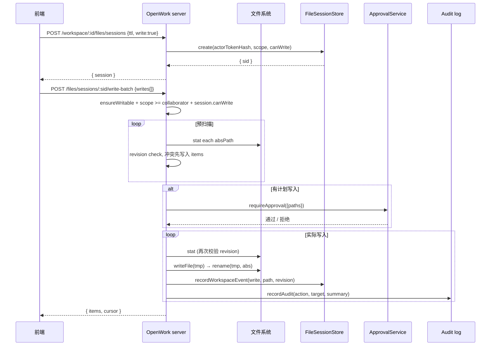

# 05c · OpenWork 平台 — Workspace 模型与文件操作

> 上游：[05-openwork-platform-overview.md](./05-openwork-platform-overview.md)
> 同级：[05a-openwork-session-message.md](./05a-openwork-session-message.md) · [05b-openwork-skill-agent-mcp.md](./05b-openwork-skill-agent-mcp.md)

OpenWork 平台对外提供「workspace」概念作为一切文件操作、会话、扩展的根容器。本文档以 `apps/server/src/` 下 6 份文件为信息源，回答以下问题：

1. workspace 在 server 端的标识、初始化与分类机制
2. 文件读写的 4 套并行接口（单文件 / 文件会话 / 可移植文件 / 导入导出）的取舍
3. 路径安全防御层：`normalizeWorkspaceRelativePath` + `resolveSafeChildPath` 的双重校验
4. 文件版本化（revision）与并发写冲突
5. 敏感数据检测与导出净化
6. file session 的事件总线设计

---

## 1. Workspace 模型

### 1.1 三类 workspace

[buildWorkspaceInfos](file:///Users/umasuo_m3pro/Desktop/startup/xingjing/harnesswork/apps/server/src/workspaces.ts#L32-L72) 把 `WorkspaceConfig` 折叠为对外暴露的 `WorkspaceInfo`，按 `workspaceType` 分流：

| workspaceType | id 生成方式 | path 解析 | 用途 |
|---|---|---|---|
| `local` | `workspaceIdForPath(resolvedPath)` | `resolve(cwd, rawPath)` | 本机目录 |
| `remote` (remoteType=`null`) | `workspaceIdForRemote(baseUrl, directory)` | 空字符串 | 第三方 OpenCode 服务 |
| `remote` (remoteType=`openwork`) | `workspaceIdForOpenwork(hostUrl, workspaceId)` | 空字符串 | OpenWork 自家协作 host |

### 1.2 ID 生成：哈希前 12 位

[workspaceIdForKey](file:///Users/umasuo_m3pro/Desktop/startup/xingjing/harnesswork/apps/server/src/workspaces.ts#L5-L8) 使用 SHA-256 截断：

```ts
function workspaceIdForKey(key: string): string {
  const hash = createHash("sha256").update(key).digest("hex");
  return `ws_${hash.slice(0, 12)}`;     // 形如 "ws_a3f7c9e2b1d4"
}
```

**键的拼接规则**（决定同一物理位置是否被识别为同一 workspace）：

```
local:    <absolute_path>
remote:   "remote::<baseUrl>"  或  "remote::<baseUrl>::<directory>"
openwork: "openwork::<hostUrl>"  或  "openwork::<hostUrl>::<workspaceId>"
```

> **设计含义**：
> - 同一个绝对路径在任何机器上**会得到相同的 ws_id**；移动目录则 id 变化。
> - 远程 workspace 不依赖路径，因此跨机器一致——这是协作场景的前提。

---

## 2. Workspace 初始化：[ensureWorkspaceFiles](file:///Users/umasuo_m3pro/Desktop/startup/xingjing/harnesswork/apps/server/src/workspace-init.ts#L325-L336)

任何新建 workspace 都会触发**幂等的初始化**，按顺序确保 5 类文件存在：

```
ensureWorkspaceFiles(root, presetInput)
  │
  ├─ ensureDir(root)
  ├─ ensureStarterSkills(root, preset)         # 1
  ├─ ensureOpenworkAgent(root)                  # 2
  ├─ ensureStarterCommands(root, preset)        # 3
  ├─ ensureOpencodeConfig(root, preset)         # 4
  └─ ensureWorkspaceOpenworkConfig(root, preset)# 5
```

### 2.1 Preset 归一化

[normalizePreset](file:///Users/umasuo_m3pro/Desktop/startup/xingjing/harnesswork/apps/server/src/workspace-init.ts#L199-L203) 默认值为 `"starter"`。`preset` 影响 4 件事：

| preset | starter skills | starter commands | plugins | mcp |
|---|---|---|---|---|
| `starter` | `workspace-guide` + `get-started` | 3 个 learn-* + `get-started` | `opencode-scheduler` | `control-chrome` (chrome-devtools-mcp) |
| `automation` | `workspace-guide` | 3 个 learn-* | `opencode-scheduler` | — |
| 其他 | `workspace-guide` | 3 个 learn-* | — | — |

### 2.2 写入的内置内容

[WORKSPACE_GUIDE](file:///Users/umasuo_m3pro/Desktop/startup/xingjing/harnesswork/apps/server/src/workspace-init.ts#L11-L58) 是约 50 行的 onboarding Markdown，frontmatter:

```yaml
name: workspace-guide
description: Workspace guide to introduce OpenWork and onboard new users.
```

[OPENWORK_AGENT](file:///Users/umasuo_m3pro/Desktop/startup/xingjing/harnesswork/apps/server/src/workspace-init.ts#L80-L122) 写到 `.opencode/agents/openwork.md`，frontmatter 含 `mode: primary` 与 `temperature: 0.2`，正文包含 OpenWork 的「记忆双轨」「重建优先」「验证优先」「增量采纳循环」四条原则。

> 关键：**仅在 agent 文件不存在时写入**（`if (await exists(agentPath)) return`），不覆盖用户自定义。

### 2.3 [ensureOpencodeConfig](file:///Users/umasuo_m3pro/Desktop/startup/xingjing/harnesswork/apps/server/src/workspace-init.ts#L265-L304) 的 jsonc 合并

```
1. 读现有 opencode.jsonc（不存在则用 {$schema: "https://opencode.ai/config.json"} 初始化）
2. 若 default_agent 缺失或为空 → 设为 "openwork"
3. preset ∈ {starter, automation}: 把 "opencode-scheduler" 合并入 plugin 数组（去重）
4. preset === "starter": 若 mcp.control-chrome 不存在则注入 chrome-devtools-mcp 配置
5. writeJsoncFile(path, next)   # 保留现有注释
```

### 2.4 [ensureWorkspaceOpenworkConfig](file:///Users/umasuo_m3pro/Desktop/startup/xingjing/harnesswork/apps/server/src/workspace-init.ts#L306-L323) — 平台元配置

写到 `.opencode/openwork.json`：

```jsonc
{
  "version": 1,
  "workspace": {
    "name": "<目录名>",
    "createdAt": <timestamp>,
    "preset": "<preset>"
  },
  "authorizedRoots": ["<workspace_root>"],
  "blueprint": { ... },                  // emptyState / sessions 蓝图（前端渲染用）
  "reload": null
}
```

> **关键**：仅在文件不存在时创建（`if (await exists(path)) return`），不覆盖。

[buildDefaultWorkspaceBlueprint](file:///Users/umasuo_m3pro/Desktop/startup/xingjing/harnesswork/apps/server/src/workspace-init.ts#L139-L197) 内嵌了 3 个 starter（CSV / Connect ChatGPT / Browser Automation）与 2 个示例 session（welcome-to-openwork 在首次加载时自动打开）。

---

## 3. 文件操作的四套接口

OpenWork server 端**并未提供单一的「文件 API」**，而是按使用场景拆出 4 套独立接口。每套都有不同的安全模型、批量能力与并发语义。

### 3.1 接口对比矩阵

| # | 接口 | 路径白名单 | 批量 | 版本化 | 审批 | 用途 |
|---|---|---|---|---|---|---|
| 1 | `GET/POST /workspace/:id/files/content` | 扩展名白名单 (`.md/.mdx/.markdown/.yaml/.yml/.json`) | 单文件 | ✗ | 写时审批 | 编辑文档 / 配置 |
| 2 | `/files/sessions/:sid/*` | 任意子路径 | ≤ 64 项/批 | ✓ revision | 写时审批 | 通用文件协作（cockpit、AI 工具调用） |
| 3 | Portable files（导入导出内嵌） | 仅 `.opencode/agents/, .opencode/plugins/, .opencode/tools/` | 数组 | ✗ | 写时审批 | workspace 之间迁移可移植资产 |
| 4 | `GET/POST /workspace/:id/{export,import}` | 全量 + 净化 | 全量 | ✗ | 写时审批 | 完整备份与还原 |

下面分别展开。

---

## 4. 接口 1：`/workspace/:id/files/content` 单文件读写

### 4.1 [扩展名白名单](file:///Users/umasuo_m3pro/Desktop/startup/xingjing/harnesswork/apps/server/src/server.ts#L3107-L3111)

```ts
const SUPPORTED_TEXT_EXTENSIONS = new Set([
  ".md", ".mdx", ".markdown",
  ".yaml", ".yml", ".json",
]);
```

> 二进制文件、源码文件不允许通过此接口读写，必须走 file session 接口或 portable files。

### 4.2 [GET /workspace/:id/files/content?path=...](file:///Users/umasuo_m3pro/Desktop/startup/xingjing/harnesswork/apps/server/src/server.ts#L3113-L3138)

```
1. normalizeWorkspaceRelativePath(path, { allowSubdirs: true })
2. 校验扩展名 ∈ SUPPORTED_TEXT_EXTENSIONS
3. resolveSafeChildPath(workspace.path, relativePath)
4. exists + isFile 校验
5. size > 5_000_000 → 413
6. readFile utf8
7. return { path, content, bytes, updatedAt }
```

### 4.3 [POST /workspace/:id/files/content](file:///Users/umasuo_m3pro/Desktop/startup/xingjing/harnesswork/apps/server/src/server.ts#L3140-)

写入路径与 GET 对称，多了：

```
ensureWritable(config)             # readOnly 模式拒绝
requireClientScope("collaborator") # token scope 网关
content 必须是 string
size > 5_000_000 → 413
```

---

## 5. 接口 2：File Sessions —— 通用文件协作

### 5.1 [FileSessionStore](file:///Users/umasuo_m3pro/Desktop/startup/xingjing/harnesswork/apps/server/src/file-sessions.ts#L33-L152) 内存数据结构

```
sessions: Map<sessionId, FileSessionRecord>          # 默认 maxSessions = 256
workspaceEvents: Map<workspaceId, { seq, events[] }> # 每 workspace 默认 500 条
```

记录字段：

```ts
{
  id, workspaceId, workspaceRoot,
  actorTokenHash, actorScope,
  canWrite,             // 创建时按 readOnly + scope 计算
  createdAt, expiresAt, // TTL 由客户端请求传入（带上下界限制）
}
```

### 5.2 Session 生命周期

```
POST /workspace/:id/files/sessions    body: { ttlSeconds, write }
  ↓
fileSessions.create({
  workspaceId, workspaceRoot,
  actorTokenHash: ctx.actor.tokenHash,
  actorScope:    ctx.actor.scope,
  canWrite:      requestWrite && !readOnly && scope >= "collaborator",
  ttlMs:         clamp(ttlSeconds * 1000, MIN_TTL, MAX_TTL),
})
  ↓
{ session: { id, workspaceId, createdAt, expiresAt, ttlMs, canWrite } }
```

后续每次操作都会调用 [resolveFileSession](file:///Users/umasuo_m3pro/Desktop/startup/xingjing/harnesswork/apps/server/src/server.ts#L1211-L1227)：

```
1. fileSessions.get(sid)              → 404 if 过期/不存在
2. ctx.actor.tokenHash 必须等于 session.actorTokenHash → 403
3. workspace 必须存在 → 404
```

> **关键**：file session 与 token 强绑定，**别的 token 不能复用**。

[POST /files/sessions/:sid/renew](file:///Users/umasuo_m3pro/Desktop/startup/xingjing/harnesswork/apps/server/src/server.ts#L2775-L2784) 续期；[DELETE /files/sessions/:sid](file:///Users/umasuo_m3pro/Desktop/startup/xingjing/harnesswork/apps/server/src/server.ts#L2786-L2790) 主动关闭。

### 5.3 五个能力路由

| Path | 用途 |
|---|---|
| [GET /files/sessions/:sid/catalog/snapshot](file:///Users/umasuo_m3pro/Desktop/startup/xingjing/harnesswork/apps/server/src/server.ts#L2792-L2822) | 全量目录树快照（带 prefix / after / limit / includeDirs 过滤） |
| [GET /files/sessions/:sid/catalog/events?since=N](file:///Users/umasuo_m3pro/Desktop/startup/xingjing/harnesswork/apps/server/src/server.ts#L2824-L2829) | 自 seq=N 后的增量事件 |
| [POST /files/sessions/:sid/read-batch](file:///Users/umasuo_m3pro/Desktop/startup/xingjing/harnesswork/apps/server/src/server.ts#L2831-L2879) | 批量读 ≤64 文件，base64 返回 |
| [POST /files/sessions/:sid/write-batch](file:///Users/umasuo_m3pro/Desktop/startup/xingjing/harnesswork/apps/server/src/server.ts#L2881-L3011) | 批量写，含 If-Match revision 冲突检测 |
| [POST /files/sessions/:sid/ops](file:///Users/umasuo_m3pro/Desktop/startup/xingjing/harnesswork/apps/server/src/server.ts#L3013-L3105) | mkdir / delete / rename 三类操作 |

### 5.4 Catalog 快照算法

[listWorkspaceCatalogEntries](file:///Users/umasuo_m3pro/Desktop/startup/xingjing/harnesswork/apps/server/src/server.ts#L981-L1024)：

```
walk workspace_root:
  for each dir:
    push { path, kind: "dir", size: 0, mtimeMs, revision: "<mtimeMs>:0" }
    recurse
  for each file:
    push { path, kind: "file", size, mtimeMs, revision: "<mtimeMs>:<size>" }
sort by path (按字母序)
```

快照生成后做客户端过滤：

```
1. !includeDirs → 排除 dir
2. !matchesCatalogFilter(entry.path, prefix) → 排除
3. after && entry.path <= after → 排除（游标续传）
4. slice(0, limit)
5. truncated && nextAfter = items 末尾 path（用于下一页）
```

### 5.5 Revision 与冲突检测

[fileRevision](file:///Users/umasuo_m3pro/Desktop/startup/xingjing/harnesswork/apps/server/src/server.ts#L928-L930)：

```ts
function fileRevision(info: { mtimeMs: number; size: number }): string {
  return `${Math.floor(info.mtimeMs)}:${info.size}`;
}
```

> **设计取舍**：不用 hash 而用 `mtimeMs:size`，理由是写入路径自己控制 mtime 更新；hash 计算成本随文件大小线性增长，对 5MB 上限不划算。

write-batch 的冲突路径：

```
client 提交: { path, contentBase64, ifMatchRevision, force? }
            ↓
server pre-check: beforeRevision = current ? fileRevision(current) : null
            ↓
if !force && ifMatch !== beforeRevision:
  push { ok:false, code:"conflict", expectedRevision, currentRevision }
  跳过此文件，继续下一项
```

> **两阶段校验**：第一遍预扫描（决定是否写）；第二遍真正写入前**再次** stat 校验（防止 approval 等待期间被改），见 [行 2962-2974](file:///Users/umasuo_m3pro/Desktop/startup/xingjing/harnesswork/apps/server/src/server.ts#L2962-L2974)。

### 5.6 原子写入：tmp + rename

[行 2977-2979](file:///Users/umasuo_m3pro/Desktop/startup/xingjing/harnesswork/apps/server/src/server.ts#L2977-L2979)：

```ts
const tmp = `${entry.absPath}.tmp-${shortId()}`;
await writeFile(tmp, entry.bytes);
await rename(tmp, entry.absPath);
```

避免半截写入造成损坏文件；shortId 后缀避免并发写互相覆盖。

### 5.7 三类操作：[ops 路由](file:///Users/umasuo_m3pro/Desktop/startup/xingjing/harnesswork/apps/server/src/server.ts#L3055-L3101)

```
mkdir:  ensureDir(absPath)            → record event
delete: rm(absPath, { recursive })    → record event
rename: ensureDir(dirname(toAbs)) → rename(fromAbs, toAbs) → record event
```

---

## 6. 接口 3：Portable Files —— 可移植资产

> 源码：[apps/server/src/portable-files.ts](file:///Users/umasuo_m3pro/Desktop/startup/xingjing/harnesswork/apps/server/src/portable-files.ts)（146 行）

### 6.1 三层白名单

[ALLOWED_PORTABLE_PREFIXES](file:///Users/umasuo_m3pro/Desktop/startup/xingjing/harnesswork/apps/server/src/portable-files.ts#L16):

```
.opencode/agents/
.opencode/plugins/
.opencode/tools/
```

只有这三类目录下的文件可以被作为「可移植资产」流通——即可以跟随 export bundle 去往另一台机器。Skill 不在此列（Skill 通过 Hub 的 git 仓库流通）。

### 6.2 四级路径校验

[isAllowedPortableFilePath](file:///Users/umasuo_m3pro/Desktop/startup/xingjing/harnesswork/apps/server/src/portable-files.ts#L59-L65)：

```
1. normalizePortablePath: 统一分隔符、去 ./、去前导 /、禁 \0、禁空段、禁 .. / .
2. isAllowedPortablePrefix: 必须命中 3 个白名单前缀之一
3. !isEnvFilePath: 任何路径段不能匹配 /^\.env(?:\..+)?$/i
4. !hasReservedPortableSegment: 不能含 .DS_Store / Thumbs.db / node_modules
```

> **`.env` 是绝对禁区**——避免 token 通过 portable bundle 泄漏。

### 6.3 写入：`writePortableFiles(replace?)`

[writePortableFiles](file:///Users/umasuo_m3pro/Desktop/startup/xingjing/harnesswork/apps/server/src/portable-files.ts#L128-L145)：

```
files = planPortableFiles(root, value)   # 全部校验通过才继续

if options.replace:
  existing = listPortableFiles(root)     # 列出全部 portable 文件
  for f in existing: rm(f.path)           # 先删后写

for f in files:
  ensureDir(dirname(f.absolutePath))
  writeFile(f.absolutePath, f.content)
```

`replace` 语义对应「完全覆盖」，否则是「叠加覆盖」。

---

## 7. 接口 4：Workspace 导入导出

### 7.1 [GET /workspace/:id/export](file:///Users/umasuo_m3pro/Desktop/startup/xingjing/harnesswork/apps/server/src/server.ts#L3675-L3680)

```
exportPayload = await exportWorkspace(workspace, { sensitiveMode })
return jsonResponse(exportPayload)
```

`sensitiveMode` 来自 query string `?sensitive=auto|include|exclude`：

| 模式 | 行为 |
|---|---|
| `auto` | 默认：自动检测并排除敏感字段 + portable 文件 |
| `include` | 不净化（用户明确知道自己在做什么） |
| `exclude` | 强制净化（即使没检测到也按敏感字段处理） |

### 7.2 [POST /workspace/:id/import](file:///Users/umasuo_m3pro/Desktop/startup/xingjing/harnesswork/apps/server/src/server.ts#L3682-L3710)

```
ensureWritable(config)
requireClientScope("collaborator")
↓
portableFiles = planPortableFiles(workspace.path, body.files)   # 全部校验
↓
requireApproval({
  action: "config.import",
  paths: [
    opencodeConfigPath,
    openworkConfigPath,
    ...portableFiles.absolutePaths
  ]
})
↓
importWorkspace(workspace, body)            # 写 opencode + openwork + portable
recordAudit(...)
emitReloadEvent(reason: "config", ...)      # 主动派发 reload
```

> **关键**：导入是 OpenWork 唯一会**主动派发** reload 事件的写路径（其他写路径靠 reload-watcher 检测文件变更）。

---

## 8. 路径安全：双重校验

### 8.1 [normalizeWorkspaceRelativePath](file:///Users/umasuo_m3pro/Desktop/startup/xingjing/harnesswork/apps/server/src/server.ts#L802-L833)

第一道：**字符串层归一化与拒绝**

```
raw → 拒绝 \0
backslash → forward slash
去前导 / 与 ./
去前缀 "workspace/"        # 兼容 AI 工具常用的 "workspace/<path>" 写法
parts = split("/").filter(Boolean)
parts 必须非空
!options.allowSubdirs → parts.length 必须 == 1
任何 part === "." 或 ".." → 拒绝
return parts.join("/")
```

### 8.2 [resolveSafeChildPath](file:///Users/umasuo_m3pro/Desktop/startup/xingjing/harnesswork/apps/server/src/server.ts#L835-L845)

第二道：**绝对路径层防穿越**

```
rootResolved = resolve(root)           # 规范化 root
candidate    = resolve(rootResolved, child)
if candidate === rootResolved:         # 必须是 child，不能就是 root 本身
  throw "Path must point to a file"
if !candidate.startsWith(rootResolved + sep):
  throw "Path traversal is not allowed"
return candidate
```

> **为何要双重校验？**第一道在 string 层防显式 `..`；第二道在 fs 层防 symlink、绝对路径注入、以及第一道遗漏的边缘场景。

---

## 9. 文件事件总线：FileSessionStore

### 9.1 数据结构

```ts
type FileSessionEvent = {
  id: string;
  seq: number;                                       // 每 workspace 独立递增
  workspaceId: string;
  type: "write" | "delete" | "rename" | "mkdir";
  path: string;
  toPath?: string;                                   // 仅 rename
  revision?: string;                                 // 仅 write
  timestamp: number;
};
```

### 9.2 [recordWorkspaceEvent](file:///Users/umasuo_m3pro/Desktop/startup/xingjing/harnesswork/apps/server/src/file-sessions.ts#L92-L117)

```
state = workspaceEvents.get(wsId) ?? { seq: 0, events: [] }
event = { seq: state.seq + 1, ... }
state.seq = event.seq
state.events.push(event)
if state.events.length > 500: shift(diff)            # 环形保持上限
```

> **每 workspace 默认上限 500 条**（构造参数可改）。与 [reload events](./05b-openwork-skill-agent-mcp.md#11-reload-事件总线eventsts) 的 200 全局缓冲不同——这里是 per-workspace。

### 9.3 增量查询：[listWorkspaceEvents](file:///Users/umasuo_m3pro/Desktop/startup/xingjing/harnesswork/apps/server/src/file-sessions.ts#L119-L127)

```
return {
  items:  state.events.filter(e => e.seq > since),
  cursor: state.seq                                   # 客户端下一次传 since=cursor
}
```

### 9.4 写路径如何记录事件

`write-batch / ops` 在每次成功写入/删除/rename/mkdir 后调用 [recordWorkspaceFileEvent](file:///Users/umasuo_m3pro/Desktop/startup/xingjing/harnesswork/apps/server/src/server.ts#L1229-L1231)，该回调内部转发给 `fileSessions.recordWorkspaceEvent`。

> **关键**：events 与 `/files/sessions` 路由解耦——任何 workspace 内写入都会被记录，**不要求**有活跃的 file session。

---

## 10. 敏感数据检测与净化

> 源码：[apps/server/src/workspace-export-safety.ts](file:///Users/umasuo_m3pro/Desktop/startup/xingjing/harnesswork/apps/server/src/workspace-export-safety.ts)（324 行）

### 10.1 检测三层

[collectSignals](file:///Users/umasuo_m3pro/Desktop/startup/xingjing/harnesswork/apps/server/src/workspace-export-safety.ts#L153-L187) 递归遍历任意 JSON 值，从三个维度收集 signal：

#### 第 1 层：键名匹配（[COMMON_SECRET_KEY_PATTERNS](file:///Users/umasuo_m3pro/Desktop/startup/xingjing/harnesswork/apps/server/src/workspace-export-safety.ts#L31-L40)）

```
apiKey:      "apikey" 或 ("api","key") 词对
key:         单 token "key"（且 value 必须像 secret）
token:       "token"/"authtoken"/"accesstoken"/"refreshtoken"
Bearer:      "bearer" / "authorization"
secret:      "secret" / ("client","secret")
password:    "password"/"passwd"
credentials: "credential"(s)
privateKey:  ("private","key") 词对（"public","key" 反向豁免）
```

#### 第 2 层：值模式匹配（[KNOWN_SECRET_VALUE_PATTERNS](file:///Users/umasuo_m3pro/Desktop/startup/xingjing/harnesswork/apps/server/src/workspace-export-safety.ts#L42-L46)）

```
Bearer:  /\bBearer\s+[A-Za-z0-9._~+\/-]+=*/
token:   /\b(?:ghp|gho|github_pat|xox[baprs]|sk|rk|AKIA|ASIA|AIza)[-_A-Za-z0-9]{8,}\b/
JWT:     /\beyJ[A-Za-z0-9_-]+\.[A-Za-z0-9._-]+\.[A-Za-z0-9._-]+\b/
```

> 三家 token 前缀分别对应 GitHub、Slack、Stripe/Anthropic（sk）、Razorpay（rk）、AWS（AKIA/ASIA）、Google API（AIza）。

#### 第 3 层：字符串内文本匹配（[RAW_SECRET_TEXT_PATTERNS](file:///Users/umasuo_m3pro/Desktop/startup/xingjing/harnesswork/apps/server/src/workspace-export-safety.ts#L48-L56) + [GENERIC_KEY_ASSIGNMENT_PATTERNS](file:///Users/umasuo_m3pro/Desktop/startup/xingjing/harnesswork/apps/server/src/workspace-export-safety.ts#L58-L61)）

匹配 `apikey`/`token`/`Bearer`/`secret`/`password`/`credentials`/`privatekey` 等关键词在自由文本中的出现，以及 `key: "<≥12 字符>"` 这种赋值语法。

#### 单 token "key" 的二级判定 [looksLikeGenericSecretValue](file:///Users/umasuo_m3pro/Desktop/startup/xingjing/harnesswork/apps/server/src/workspace-export-safety.ts#L100-L109)

```
trimmed.length ≥ 16
no whitespace
≥3 character classes ∈ {lowercase, uppercase, digit, special}
matches ^[A-Za-z0-9._~+/-=]+$
或者：32+ hex 字符
```

> 防止把 `{ key: "primary" }` 这种正常字段误判为 secret。

### 10.2 [stripSensitiveWorkspaceExportData](file:///Users/umasuo_m3pro/Desktop/startup/xingjing/harnesswork/apps/server/src/workspace-export-safety.ts#L277-L316) 净化算法

```
opencode.* 各 section:
  sanitized = sanitizeValue(section)
  if sanitized === undefined: delete section            # 整段被判定为 secret
  if sanitized 空对象/空数组:    delete section
  else: section = sanitized

portable_files:
  保留所有：
    - 路径不在 portable 白名单内（不是 portable 候选）
    - 路径在白名单内但 collectSignals 为空
```

### 10.3 [collectWorkspaceExportWarnings](file:///Users/umasuo_m3pro/Desktop/startup/xingjing/harnesswork/apps/server/src/workspace-export-safety.ts#L239-L275) — 净化前预警

不直接净化，而是返回 `WorkspaceExportWarning[]` 让前端弹窗：

```
对每个 opencode.<section>: 若 collectSignals 非空 → push warning
对每个 portable file:    若内容含 secret → push warning
返回 Map.values()       # 同 id 去重
```

`CONFIG_SECTION_METADATA` 为 `mcp/plugin/provider` 三类预设了人类可读 label。其他 section 用 [formatSectionLabel](file:///Users/umasuo_m3pro/Desktop/startup/xingjing/harnesswork/apps/server/src/workspace-export-safety.ts#L318-L323) 做驼峰转空格。

---

## 11. 路由暴露面汇总

| Method | Path | Section | 行号 |
|---|---|---|---|
| GET | `/workspace/readdir?path=...` | 通用目录读 | [1282](file:///Users/umasuo_m3pro/Desktop/startup/xingjing/harnesswork/apps/server/src/server.ts#L1282) |
| GET | `/workspace/file?path=...` | 通用文件读 | [1310](file:///Users/umasuo_m3pro/Desktop/startup/xingjing/harnesswork/apps/server/src/server.ts#L1310) |
| GET | `/workspace/:id/files/content` | 接口 1 读 | [3113](file:///Users/umasuo_m3pro/Desktop/startup/xingjing/harnesswork/apps/server/src/server.ts#L3113) |
| POST | `/workspace/:id/files/content` | 接口 1 写 | [3140](file:///Users/umasuo_m3pro/Desktop/startup/xingjing/harnesswork/apps/server/src/server.ts#L3140) |
| POST | `/workspace/:id/files/sessions` | 接口 2 创建 session | [2753](file:///Users/umasuo_m3pro/Desktop/startup/xingjing/harnesswork/apps/server/src/server.ts#L2753) |
| POST | `/files/sessions/:sid/renew` | 接口 2 续期 | [2775](file:///Users/umasuo_m3pro/Desktop/startup/xingjing/harnesswork/apps/server/src/server.ts#L2775) |
| DELETE | `/files/sessions/:sid` | 接口 2 关闭 | [2786](file:///Users/umasuo_m3pro/Desktop/startup/xingjing/harnesswork/apps/server/src/server.ts#L2786) |
| GET | `/files/sessions/:sid/catalog/snapshot` | 接口 2 catalog | [2792](file:///Users/umasuo_m3pro/Desktop/startup/xingjing/harnesswork/apps/server/src/server.ts#L2792) |
| GET | `/files/sessions/:sid/catalog/events` | 接口 2 增量 | [2824](file:///Users/umasuo_m3pro/Desktop/startup/xingjing/harnesswork/apps/server/src/server.ts#L2824) |
| POST | `/files/sessions/:sid/read-batch` | 接口 2 批读 | [2831](file:///Users/umasuo_m3pro/Desktop/startup/xingjing/harnesswork/apps/server/src/server.ts#L2831) |
| POST | `/files/sessions/:sid/write-batch` | 接口 2 批写 | [2881](file:///Users/umasuo_m3pro/Desktop/startup/xingjing/harnesswork/apps/server/src/server.ts#L2881) |
| POST | `/files/sessions/:sid/ops` | 接口 2 mkdir/delete/rename | [3013](file:///Users/umasuo_m3pro/Desktop/startup/xingjing/harnesswork/apps/server/src/server.ts#L3013) |
| GET | `/workspace/:id/export` | 接口 4 导出 | [3675](file:///Users/umasuo_m3pro/Desktop/startup/xingjing/harnesswork/apps/server/src/server.ts#L3675) |
| POST | `/workspace/:id/import` | 接口 4 导入 | [3682](file:///Users/umasuo_m3pro/Desktop/startup/xingjing/harnesswork/apps/server/src/server.ts#L3682) |
| GET | `/docs` | 工作区文档列表 | [1238](file:///Users/umasuo_m3pro/Desktop/startup/xingjing/harnesswork/apps/server/src/server.ts#L1238) |
| GET | `/docs/*` | 工作区单文档读 | [1253](file:///Users/umasuo_m3pro/Desktop/startup/xingjing/harnesswork/apps/server/src/server.ts#L1253) |

---

## 12. 端到端时序：file session 写一批文件



---

## 13. 关键设计决策汇总

| # | 决策 | 代码证据 | 影响 |
|---|---|---|---|
| 1 | workspace id = SHA-256 截断前 12 位 | [workspaceIdForKey](file:///Users/umasuo_m3pro/Desktop/startup/xingjing/harnesswork/apps/server/src/workspaces.ts#L5) | 跨机器一致；移动目录 id 变 |
| 2 | 三类 workspace 各有 key 拼接策略 | [workspaceIdForRemote / Openwork](file:///Users/umasuo_m3pro/Desktop/startup/xingjing/harnesswork/apps/server/src/workspaces.ts#L14-L30) | 远程 workspace 可被多客户端识别为同一个 |
| 3 | ensureWorkspaceFiles 全幂等 | [ensureXxx](file:///Users/umasuo_m3pro/Desktop/startup/xingjing/harnesswork/apps/server/src/workspace-init.ts) 全部 `if exists return` | 多次调用安全，不覆盖用户文件 |
| 4 | starter preset 注入 chrome-devtools-mcp | [ensureOpencodeConfig](file:///Users/umasuo_m3pro/Desktop/startup/xingjing/harnesswork/apps/server/src/workspace-init.ts#L294-L300) | onboarding 即装即玩 |
| 5 | OpenWork 元配置独立文件 `.opencode/openwork.json` | [openworkConfigPath](file:///Users/umasuo_m3pro/Desktop/startup/xingjing/harnesswork/apps/server/src/workspace-files.ts) | 与 opencode 引擎配置解耦 |
| 6 | 4 套独立文件接口 | server.ts 第 3 章 | 按使用场景拆分安全模型 |
| 7 | 单文件接口扩展名白名单 | [SUPPORTED_TEXT_EXTENSIONS](file:///Users/umasuo_m3pro/Desktop/startup/xingjing/harnesswork/apps/server/src/server.ts#L3107) | 防意外暴露二进制 / 源码 |
| 8 | file session 与 token 强绑定 | [resolveFileSession](file:///Users/umasuo_m3pro/Desktop/startup/xingjing/harnesswork/apps/server/src/server.ts#L1217-L1219) | 别的 token 不能复用 |
| 9 | 默认 session 上限 256 / event 上限 500 | [FileSessionStore 构造](file:///Users/umasuo_m3pro/Desktop/startup/xingjing/harnesswork/apps/server/src/file-sessions.ts#L42-L44) | 防内存爆 |
| 10 | revision = `mtimeMs:size` | [fileRevision](file:///Users/umasuo_m3pro/Desktop/startup/xingjing/harnesswork/apps/server/src/server.ts#L928) | 廉价并发检测；不计算 hash |
| 11 | write-batch 二阶段校验 | [行 2962-2974](file:///Users/umasuo_m3pro/Desktop/startup/xingjing/harnesswork/apps/server/src/server.ts#L2962-L2974) | 防 approval 等待期被改 |
| 12 | tmp + rename 原子写 | [行 2977-2979](file:///Users/umasuo_m3pro/Desktop/startup/xingjing/harnesswork/apps/server/src/server.ts#L2977) | 防半截写入 |
| 13 | 单批 ≤ 64 / 单文件 ≤ 5MB | [常量](file:///Users/umasuo_m3pro/Desktop/startup/xingjing/harnesswork/apps/server/src/server.ts#L51-L52) | 防请求过大 |
| 14 | portable 仅 3 类前缀 | [ALLOWED_PORTABLE_PREFIXES](file:///Users/umasuo_m3pro/Desktop/startup/xingjing/harnesswork/apps/server/src/portable-files.ts#L16) | 限定可移植资产范围 |
| 15 | portable 禁止 .env / 保留段 | [isAllowedPortableFilePath](file:///Users/umasuo_m3pro/Desktop/startup/xingjing/harnesswork/apps/server/src/portable-files.ts#L59) | 防 token 通过 bundle 泄漏 |
| 16 | 路径双重校验 | [normalizeWorkspaceRelativePath](file:///Users/umasuo_m3pro/Desktop/startup/xingjing/harnesswork/apps/server/src/server.ts#L802) + [resolveSafeChildPath](file:///Users/umasuo_m3pro/Desktop/startup/xingjing/harnesswork/apps/server/src/server.ts#L835) | string + fs 两层防穿越 |
| 17 | 兼容 `workspace/<path>` 前缀 | [normalize 第 817 行](file:///Users/umasuo_m3pro/Desktop/startup/xingjing/harnesswork/apps/server/src/server.ts#L817) | AI 工具产生的常见路径形态 |
| 18 | event seq 每 workspace 独立 | [FileSessionStore.workspaceEvents](file:///Users/umasuo_m3pro/Desktop/startup/xingjing/harnesswork/apps/server/src/file-sessions.ts#L36) | 与全局 reload events 解耦 |
| 19 | 敏感检测三层（键名/值模式/文本） | [workspace-export-safety.ts](file:///Users/umasuo_m3pro/Desktop/startup/xingjing/harnesswork/apps/server/src/workspace-export-safety.ts) | 多维度兜底 |
| 20 | 6 家 token 前缀硬编码 | [KNOWN_SECRET_VALUE_PATTERNS](file:///Users/umasuo_m3pro/Desktop/startup/xingjing/harnesswork/apps/server/src/workspace-export-safety.ts#L42-L46) | GitHub/Slack/Stripe/AWS/Google 等 |
| 21 | sensitive=auto/include/exclude 三档 | export 路由 query param | 用户可以选择是否净化 |
| 22 | import 主动派发 reload(config) | [行 3708](file:///Users/umasuo_m3pro/Desktop/startup/xingjing/harnesswork/apps/server/src/server.ts#L3708) | 唯一不依赖 watcher 的 reload 触发 |

---

## 14. 与其他文档的衔接

| 关联文档 | 衔接点 |
|---|---|
| [05-openwork-platform-overview.md](./05-openwork-platform-overview.md) | workspace 是平台五大边界对象之一 |
| [05a-openwork-session-message.md](./05a-openwork-session-message.md) | session 内 AI 工具调用通过 file session 接口写文件 |
| [05b-openwork-skill-agent-mcp.md](./05b-openwork-skill-agent-mcp.md) | `.opencode/skills/`、`.opencode/agents/`、`.opencode/commands/` 是本文 portable + 初始化的目标 |
| [05e-openwork-permission-question.md](./05e-openwork-permission-question.md) | 写路径必走 `requireApproval`；token scope 网关 |
| [05f-openwork-settings-persistence.md](./05f-openwork-settings-persistence.md) | jsonc 改写策略；opencode.jsonc / openwork.json 双配置文件 |
| [05g-openwork-process-runtime.md](./05g-openwork-process-runtime.md) | server 进程承载 FileSessionStore；进程退出 = 全部 session 失效 |
| [05h-openwork-state-architecture.md](./05h-openwork-state-architecture.md) | 「文件系统是单一事实源」与四层 Provider 架构的对应 |
| [10-product-shell.md](./10-product-shell.md) | 星静 shell 如何通过 file session 接口加载文档 |
| [60-knowledge-base.md](./60-knowledge-base.md) | 知识库基于 `/workspace/:id/files/content` 单文件读写 |
