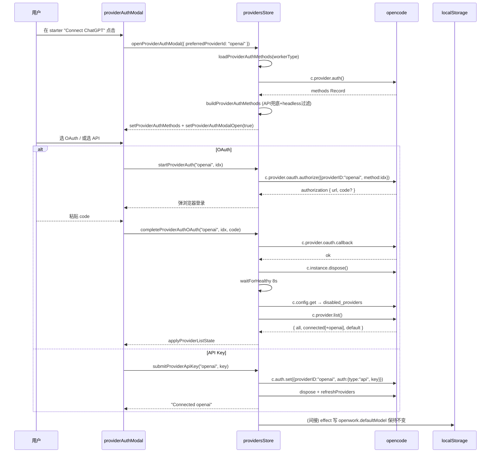

# 05d — OpenWork 模型与 Provider 子系统

> 本篇与 [05-openwork-platform-overview.md](./05-openwork-platform-overview.md)、[05a-openwork-session-message.md](./05a-openwork-session-message.md)、[05b-openwork-skill-agent-mcp.md](./05b-openwork-skill-agent-mcp.md)、[05c-openwork-workspace-fileops.md](./05c-openwork-workspace-fileops.md) 构成 OpenWork 平台 9 份文档的第五篇。  
> 信息源仅为 `apps/server/`、`apps/app/`、`apps/opencode-router/`。xingjing 子目录与团队版代码路径不在本篇范围。

---

## 1. 子系统总览

Model / Provider 子系统回答四个问题：

1. **"有哪些 Provider 能用"** —— 列表从哪里来、如何过滤、如何排序。
2. **"怎么登录一个 Provider"** —— OAuth 流程与 API Key 流程如何收敛到同一个 Modal。
3. **"这次对话用哪个模型"** —— 默认模型、Session 级覆盖、消息级回溯的优先级。
4. **"模型行为档位怎么存"** —— variant（reasoning effort / codex 映射）的 workspace 持久化。

```
                           ┌────────────────────────────────────────────┐
                           │ opencode server (本进程外，由 opencode 自管) │
                           │   GET  /provider/list                        │
                           │   GET  /config/providers  (fallback)         │
                           │   POST /provider/oauth/authorize             │
                           │   POST /provider/oauth/callback              │
                           │   POST /auth/set  ·  DELETE /auth/:id        │
                           │   GET  /config  ·  POST /config  (disabled_providers) │
                           └───────────────────▲────────────────────────┘
                                               │ opencode SDK (透传)
                                               │
            OpenWork 平台这一层 ➜               │
   ┌────────────────────┐      ┌────────────────┴────────────────┐
   │ apps/server        │      │ apps/app  (前端)                │
   │  HTTP 反向代理      │      │                                 │
   │  /opencode/*        │      │  providers/store.ts            │
   │  (不拦截 provider)  │      │   ├─ refreshProviders          │
   │                    │      │   ├─ startProviderAuth         │
   │  opencode-db.ts    │      │   ├─ submitProviderApiKey      │
   │   种子消息里的      │      │   ├─ completeProviderAuthOAuth │
   │   providerID/modelID│      │   └─ disconnectProvider        │
   │                    │      │                                 │
   │  workspace-init.ts │      │  model-config.ts                │
   │   Connect OpenAI    │      │   ├─ defaultModel (localStorage)│
   │   starter 建议      │      │   ├─ sessionChoiceOverrideById  │
   └────────────────────┘      │   ├─ workspaceVariantMap        │
                               │   ├─ modelOptions  (排序管线)   │
                               │   └─ resolveCodexReasoningEffort│
                               └────────────────────────────────┘

   ┌──────────────────────────────────────────────────────────────┐
   │ apps/opencode-router  (独立 Node 进程，跨渠道路由)           │
   │   config.ModelRef  ← env OPENCODE_ROUTER_MODEL               │
   │   MODEL_PRESETS = { opus, codex }                            │
   │   userModelOverrides  channel:identity:peer → ModelRef       │
   │   sessionModels       directory::sessionID → ModelRef        │
   └──────────────────────────────────────────────────────────────┘
```

**关键事实**：OpenWork 平台 **自己不维护** Provider 目录或 Model 目录。所有真正的 provider / model 列表都来自 opencode 进程。平台层只做四件事：

1. 前端对 opencode SDK 的调用编排与错误翻译。
2. 多来源 fallback（provider.list → config.providers）。
3. 本地持久化（默认模型、session override、variant、disabled）。
4. workspace 首次初始化的 starter 引导（仅"建议接入"，不写入凭证）。

---

## 2. 核心概念：ModelRef

在三个子模块里重复出现的结构：

| 出现位置 | 定义 |
|---|---|
| 前端 app | [`types.ts` ModelRef](file:///Users/umasuo_m3pro/Desktop/startup/xingjing/harnesswork/apps/app/src/app/types.ts) |
| opencode-router 配置 | [`config.ts` L60-L63](file:///Users/umasuo_m3pro/Desktop/startup/xingjing/harnesswork/apps/opencode-router/src/config.ts#L60-L63) |
| opencode-router 运行时 | [`bridge.ts` L114-L117](file:///Users/umasuo_m3pro/Desktop/startup/xingjing/harnesswork/apps/opencode-router/src/bridge.ts#L114-L117) |

```ts
type ModelRef = {
  providerID: string;
  modelID: string;
};
```

序列化格式：`providerID/modelID`（正斜杠分隔；modelID 内部可以再出现斜杠，拆分时只取首个 `/` 作为边界）。参见 [`config.ts` L107-L115](file:///Users/umasuo_m3pro/Desktop/startup/xingjing/harnesswork/apps/opencode-router/src/config.ts#L107-L115)：

```ts
const parts = value.trim().split("/");
if (parts.length < 2) return undefined;
const providerID = parts[0];
const modelID = parts.slice(1).join("/");
```

---

## 3. 三处硬编码的"出厂默认模型"

OpenWork 代码里一共有 **三处** 互不相同的硬编码默认 Model，**有意不对齐**，各自承担不同职责：

| 位置 | 默认 Model | 用途 |
|---|---|---|
| 前端 [`constants.ts` L10-L13](file:///Users/umasuo_m3pro/Desktop/startup/xingjing/harnesswork/apps/app/src/app/constants.ts#L10-L13) | `opencode/big-pickle` | 前端首次启动、localStorage 读不到时的兜底。始终是 opencode 托管模型，保证**零配置也能跑** |
| 服务端 [`opencode-db.ts` L13-L15](file:///Users/umasuo_m3pro/Desktop/startup/xingjing/harnesswork/apps/server/src/opencode-db.ts#L13-L15) | `openai/gpt-5.4` + `agent=openwork` | 平台直接写 opencode sqlite 种子消息时写入 messageData。仅用于 blueprint 预置对话的"历史记录"，**不影响用户真实会话** |
| opencode-router [`config.ts` L268](file:///Users/umasuo_m3pro/Desktop/startup/xingjing/harnesswork/apps/opencode-router/src/config.ts#L268) | env `OPENCODE_ROUTER_MODEL` | 跨渠道路由进程的缺省模型；未设置则 undefined，由 session 自己携带 |

**设计意图**：
- 前端默认用 `opencode/big-pickle`（opencode 官方托管、无需凭证）保证**新用户首屏立刻可用**。
- 种子消息走 `openai/gpt-5.4` 是因为种子消息需要装得像"历史会话"，而 opencode 托管模型在种子里反而会让用户困惑（误以为自己连过）。
- opencode-router 是独立进程，**不可预设** workspace 模型，因此通过环境变量显式声明。

---

## 4. Provider 列表获取链路

### 4.1 前端状态
providers store 的构造函数需要 6 个 accessor（[`store.ts` L24-L37](file:///Users/umasuo_m3pro/Desktop/startup/xingjing/harnesswork/apps/app/src/app/context/providers/store.ts#L24-L37)）：

| Signal | 类型 | 来源 |
|---|---|---|
| `providers` | `ProviderListItem[]` | opencode `/provider/list`.all |
| `providerDefaults` | `Record<providerID, modelID>` | opencode `/provider/list`.default |
| `providerConnectedIds` | `string[]` | opencode `/provider/list`.connected |
| `disabledProviders` | `string[]` | opencode `/config`.disabled_providers |
| `selectedWorkspaceDisplay` | `WorkspaceDisplay` | workspace store |
| `providerAuthMethods` | `Record<providerID, ProviderAuthMethod[]>` | opencode `/provider/auth` + 推断补丁 |

### 4.2 主通道 + fallback
核心函数 [`refreshProviders` L255-L307](file:///Users/umasuo_m3pro/Desktop/startup/xingjing/harnesswork/apps/app/src/app/context/providers/store.ts#L255-L307)：

```
┌─ 可选 dispose ─────────────────────┐
│ 若 opts.dispose == true：            │
│   c.instance.dispose()  忽略失败     │
│   waitForHealthy 8s 超时 / 250ms 轮询│
└───────────────────────────────────┘
         │
         ▼
  c.config.get() → config.disabled_providers
         │ （失败忽略，沿用旧 state）
         ▼
  c.provider.list()   ←── 主通道
         │ 成功：filterProviderList 去掉 disabled → applyProviderListState
         │ 失败 ↓
         ▼
  c.config.providers()    ←── 兜底：从 opencode.jsonc 解析
  mapConfigProvidersToList(fallback.providers)
  保留旧 connectedIds ∩ fallback.ids
  filterProviderList + apply
         │ 仍失败 → return null  (UI 维持旧数据)
```

### 4.3 主/兜底的数据形状差异
两条路径形状不同，兜底路径必须手动补齐 connected。见 [`utils/providers.ts` mapConfigProvidersToList L86-L98](file:///Users/umasuo_m3pro/Desktop/startup/xingjing/harnesswork/apps/app/src/app/utils/providers.ts#L86-L98)：

```ts
export const mapConfigProvidersToList = (providers: ConfigProvider[]) =>
  providers.map((provider) => ({
    id: provider.id,
    name: provider.name ?? provider.id,
    env: provider.env ?? [],
    models: /* Object.fromEntries(... mapModel ...) */,
  }));
```

`mapModel` ([`utils/providers.ts` L42-L84](file:///Users/umasuo_m3pro/Desktop/startup/xingjing/harnesswork/apps/app/src/app/utils/providers.ts#L42-L84)) 负责 capabilities → modalities 扁平化：遍历 input/output 两个对象，把值为 true 的键收集成 `("text"|"audio"|"image"|"video"|"pdf")[]`；若全为 false 则 modalities 置 undefined（而非 {input:[], output:[]}，避免前端"有 modalities 却空"的假象）。

### 4.4 过滤：disabled_providers
[`filterProviderList` L100-L113](file:///Users/umasuo_m3pro/Desktop/startup/xingjing/harnesswork/apps/app/src/app/utils/providers.ts#L100-L113) 基于 Set 一次性过滤 all / connected / default 三个字段：

```ts
return {
  all: value.all.filter((provider) => !disabled.has(provider.id)),
  connected: value.connected.filter((id) => !disabled.has(id)),
  default: Object.fromEntries(
    Object.entries(value.default).filter(([id]) => !disabled.has(id)),
  ),
};
```

**零拷贝短路**：当 disabled 集合为空时直接 `return value`（引用相等，Solid 依赖追踪不会误触发下游 effect）。

---

## 5. Provider 认证三条流程

### 5.1 流程分派
通过 [`buildProviderAuthMethods` L150-L186](file:///Users/umasuo_m3pro/Desktop/startup/xingjing/harnesswork/apps/app/src/app/context/providers/store.ts#L150-L186) 把 opencode `/provider/auth` 返回的方法集合**做两处增强**：

1. **推断 API 兜底**：对于所有 `env.length > 0` 且尚无 api 方法的 provider，自动追加 `{ type: "api", label: t("providers.api_key_label") }`。
2. **OpenAI headless 过滤**：根据 workspace 的 workerType（local / remote）：
   - `local` → 丢弃 label 含 `headless`/`device` 的 oauth 方法
   - `remote` → 只保留 headless/device 方法（远端 worker 无浏览器）
   
   判定条件仅对 `normalizedId === "openai"` 或 `normalizedName === "openai"` 生效（[`store.ts` L172-L184](file:///Users/umasuo_m3pro/Desktop/startup/xingjing/harnesswork/apps/app/src/app/context/providers/store.ts#L172-L184)）。

### 5.2 OAuth 流程
[`startProviderAuth` L201-L253](file:///Users/umasuo_m3pro/Desktop/startup/xingjing/harnesswork/apps/app/src/app/context/providers/store.ts#L201-L253) → [`completeProviderAuthOAuth` L309-L380](file:///Users/umasuo_m3pro/Desktop/startup/xingjing/harnesswork/apps/app/src/app/context/providers/store.ts#L309-L380)

```
用户点 "Connect"
  │
  ▼
startProviderAuth(providerId, methodIndex?)
  ├─ 若缓存 providerAuthMethods 为空 → loadProviderAuthMethods()
  ├─ methodIndex 未指定时自动选第一个 type=oauth
  ├─ 无 oauth 方法 → 抛 "use_api_key_suffix"
  └─ c.provider.oauth.authorize({ providerID, method })
      返回 { methodIndex, authorization: { url, code? } }
        │
        ▼
UI 打开浏览器登录，用户回来贴 code (或 opencode 已自动完成)
        │
        ▼
completeProviderAuthOAuth(providerId, methodIndex, code?)
  ├─ c.provider.oauth.callback({ providerID, method, code? })
  ├─ assertNoClientError (检查 result.error 字段)
  ├─ refreshProviders({ dispose: true })
  └─ 若 connected 未包含该 id:
       waitForProviderConnection(15s / 2s poll)  多次 refreshProviders
       仍未连上 → return { connected: false, pending: true }
```

**Pending OAuth 错误特殊处理**（[`isPendingOauthError` L341-L344](file:///Users/umasuo_m3pro/Desktop/startup/xingjing/harnesswork/apps/app/src/app/context/providers/store.ts#L341-L344)）：若 callback 抛 `request timed out` 或 `ProviderAuthOauthMissing`，**不算失败**——改为主动 dispose+refresh 探活，识别"凭证已落库但接口未收敛"的竞态。

### 5.3 API Key 流程
[`submitProviderApiKey` L382-L406](file:///Users/umasuo_m3pro/Desktop/startup/xingjing/harnesswork/apps/app/src/app/context/providers/store.ts#L382-L406) 一行代码：

```ts
await c.auth.set({
  providerID,
  auth: { type: "api", key: trimmed },
});
await refreshProviders({ dispose: true });
```

`dispose: true` 的目的是**强制 opencode 重建 provider client**，让新 API Key 在当前进程内立即生效，而不是等下一次进程重启。

### 5.4 断开流程（两层降级）
[`disconnectProvider` L408-L510](file:///Users/umasuo_m3pro/Desktop/startup/xingjing/harnesswork/apps/app/src/app/context/providers/store.ts#L408-L510) 是 5 条分支的降级链：

```
removeProviderAuth：3 种 opencode 客户端能力按优先级降级
  1) auth.remove({ providerID })         — 新版 SDK
  2) rawClient.delete(/auth/:id)         — 旧 SDK 直接打 REST
  3) auth.set({ providerID, auth: null}) — 最旧的"写空"范式
  全失败 → throw "providers.removal_unsupported"

随后 refreshProviders({ dispose: true })

若该 provider 仍在 connected（发生在 opencode 仍从 env / config 读取密钥的场景）：
  disableProvider()
    ├─ c.config.get()
    ├─ disabled_providers.push(id)
    ├─ setDisabledProviders (乐观更新)
    ├─ c.config.update({ config: { ..., disabled_providers } })
    │   成功 → markOpencodeConfigReloadRequired()
    │   失败 → 回滚 setDisabledProviders(old)
    └─ 二次 filterProviderList + applyProviderListState
```

注意：**只有 `source === "config" || "custom"` 的 provider 才会触发 disableProvider 分支**（[L423-L424](file:///Users/umasuo_m3pro/Desktop/startup/xingjing/harnesswork/apps/app/src/app/context/providers/store.ts#L423-L424)）。opencode 官方 provider（source=builtin）不走禁用通道，只移除凭证即可。

### 5.5 错误翻译
[`describeProviderError` L76-L148](file:///Users/umasuo_m3pro/Desktop/startup/xingjing/harnesswork/apps/app/src/app/context/providers/store.ts#L76-L148) 是 **6 层键名探测 + 3 档状态码分诊**：

- 探测顺序：`root → root.data → root.cause → root.cause.data`
- 抓取字段：`providerID/providerId/provider`、`code/errorCode`、`responseBody/body/response`、`statusCode/status`
- Heading 分诊：401/403 → `providers.auth_failed`；429 → `providers.rate_limit_exceeded`；否则按 provider 名称拼成 `providers.provider_error`
- "Unknown error" 字样（`/^unknown\s+error$/i`）被视为无效 raw，不拼到最终消息里

---

## 6. Model 列表与排序

### 6.1 Provider 排序
三层排序 [`utils/providers.ts` L6-L26](file:///Users/umasuo_m3pro/Desktop/startup/xingjing/harnesswork/apps/app/src/app/utils/providers.ts#L6-L26)：

```ts
const PINNED_PROVIDER_ORDER = ["opencode", "openai", "anthropic"] as const;
```

`providerPriorityRank` 返回 index；不在钉选列表里的一律落到末尾（rank = 3，并列）。`compareProviders` 先按 rank，再按名称字母序。

### 6.2 Model 选项构造（ModelOption[]）
[`modelOptions` L587-L672](file:///Users/umasuo_m3pro/Desktop/startup/xingjing/harnesswork/apps/app/src/app/context/model-config.ts#L587-L672) 的四步管线：

**Step 1 —— 冷启动兜底**：当 `providers()` 为空（首帧尚未拉到列表），直接构造一个含 DEFAULT_MODEL 的单条列表，**不留白屏**。

**Step 2 —— 遍历 sortedProviders × provider.models**：
- 过滤 `status === "deprecated"`
- 同一 provider 内：免费（cost.input=0 && cost.output=0）优先，之后按名称
- 对每个 model 生成 ModelOption：
  - `isDefault = provider.id === currentDefault.providerID && model.id === currentDefault.modelID`
  - `behavior = getModelBehaviorSummary(providerID, model, activeVariant)`
  - `activeVariant`：当 pickerTarget === "session" 且 ref 恰好是 `selectedSessionModel()` 时用 `modelVariant()`，否则用 `getWorkspaceVariantFor(ref)`
  - `footerBits`：`[default?, reasoning?].slice(0, 2)` 用 `·` 连接
  - `isRecommended = isHeroModel(id)`，其中 `isHeroModel = (id) => id.toLowerCase().includes("gpt-5")` ([L585](file:///Users/umasuo_m3pro/Desktop/startup/xingjing/harnesswork/apps/app/src/app/context/model-config.ts#L585))

**Step 3 —— 全局终排序**（[L663-L669](file:///Users/umasuo_m3pro/Desktop/startup/xingjing/harnesswork/apps/app/src/app/context/model-config.ts#L663-L669)）：

```
isConnected 降序  →  isFree 降序  →  providerPriorityRank 升序  →  title 字母序
```

**Step 4 —— 查询过滤**（[`filteredModelOptions` L674-L695](file:///Users/umasuo_m3pro/Desktop/startup/xingjing/harnesswork/apps/app/src/app/context/model-config.ts#L674-L695)）：
把 title / description / footer / behavior 三件套 / `providerID/modelID` / 连接状态 / 收费状态拼成 haystack，对 `modelPickerQuery` 做 lowercase 子串匹配。

---

## 7. 模型选择三级优先级

[`selectedSessionModel` L508-L523](file:///Users/umasuo_m3pro/Desktop/startup/xingjing/harnesswork/apps/app/src/app/context/model-config.ts#L508-L523)：

```
if 未选 session：
   pendingSessionChoice?.model        ← 组合键 picker 选择但 session 还没建
   ?? defaultModel()
else:
   sessionChoiceOverrideById[id].model   ← 用户显式切换
   ?? sessionModelById[id]               ← opencode 回推的 session 当前 model
   ?? lastUserModelFromMessages(msgs)    ← 从消息历史倒推
   ?? defaultModel()
```

**四级回退**保证无论何时都给得出 ModelRef。`lastUserModelFromMessages` 的作用：当用户打开历史会话，尚未收到任何新 session.info 事件时，从已有 user message 的 model 字段反推出上次使用的模型。

---

## 8. 模型行为档位（variant）

### 8.1 三档作用域
[`model-config.ts` 常量与键前缀 L236-L240](file:///Users/umasuo_m3pro/Desktop/startup/xingjing/harnesswork/apps/app/src/app/context/model-config.ts#L236-L240)：

| 作用域 | 数据结构 | 持久化 key |
|---|---|---|
| workspace | `Record<"providerID/modelID", variant>` | `openwork.modelVariant.${workspaceId}` |
| session 覆盖 | `sessionChoiceOverrideById[sid].variant` | `openwork.sessionModels.${workspaceId}` |
| pending（切 session 前的组合键） | `pendingSessionChoice.variant` | 仅内存 |

### 8.2 读取优先级
[`getVariantFor` L492-L506](file:///Users/umasuo_m3pro/Desktop/startup/xingjing/harnesswork/apps/app/src/app/context/model-config.ts#L492-L506)：

```
if sessionId 且 choice.hasOwn("variant"):
   return choice.variant ?? null        ← 显式 null 也算"用户选择了'无'"
else if pendingSessionChoice.hasOwn("variant"):
   return pending.variant ?? null
return workspaceVariantMap[modelRef] ?? null
```

`hasOwn` 判断是刻意保留"三态"：未设置、显式 null、具体值。这对 picker 里"重置为跟 workspace"的语义至关重要。

### 8.3 Codex 映射
[`resolveCodexReasoningEffort` L529-L537](file:///Users/umasuo_m3pro/Desktop/startup/xingjing/harnesswork/apps/app/src/app/context/model-config.ts#L529-L537) 是唯一一处**模型名驱动的特殊逻辑**：

```ts
if (!modelID.includes("codex")) return undefined;
if (variant === "minimal") return "low";
if (variant === "xhigh" || variant === "max") return "high";
if (!["low", "medium", "high"].includes(variant)) return undefined;
return variant;
```

把 UI 的 5 档（minimal / low / medium / high / xhigh ≈ max）折叠成 codex API 接受的 3 档（low / medium / high）。

### 8.4 Variant 清洗
[`sanitizeModelVariantForRef` L544-L548](file:///Users/umasuo_m3pro/Desktop/startup/xingjing/harnesswork/apps/app/src/app/context/model-config.ts#L544-L548) 调用 `sanitizeModelBehaviorValue(providerID, modelInfo, value)` —— 如果 model 不支持 reasoning 能力，会强制把 variant 清成 null，防止"给 3.5 turbo 设 high"这类不匹配状态被持久化。

---

## 9. 持久化键矩阵

| 作用域 | LocalStorage Key | 载体 | 写入触发 |
|---|---|---|---|
| 全局 | `openwork.defaultModel` | `"providerID/modelID"` | [L908-L915](file:///Users/umasuo_m3pro/Desktop/startup/xingjing/harnesswork/apps/app/src/app/context/model-config.ts#L908-L915) effect on `defaultModel()` |
| 全局 | `openwork.modelVariant` | 旧版格式，仅读 | 迁移期 fallback，见 [L886-L887](file:///Users/umasuo_m3pro/Desktop/startup/xingjing/harnesswork/apps/app/src/app/context/model-config.ts#L886-L887) |
| per workspace | `openwork.sessionModels.${workspaceId}` | `{[sid]:{model?:"provider/model",variant?:string\|null}}` | [L859-L874](file:///Users/umasuo_m3pro/Desktop/startup/xingjing/harnesswork/apps/app/src/app/context/model-config.ts#L859-L874) |
| per workspace | `openwork.modelVariant.${workspaceId}` | `{[modelRef]:variant}` | [L890-L906](file:///Users/umasuo_m3pro/Desktop/startup/xingjing/harnesswork/apps/app/src/app/context/model-config.ts#L890-L906) |
| opencode.jsonc 根字段 | `model: "provider/model"` | opencode 配置文件 | [`formatConfigWithDefaultModel` L134-L153](file:///Users/umasuo_m3pro/Desktop/startup/xingjing/harnesswork/apps/app/src/app/context/model-config.ts#L134-L153) |
| opencode.jsonc 根字段 | `disabled_providers: string[]` | opencode 配置文件 | `disconnectProvider.disableProvider` |
| opencode.jsonc 根字段 | `compaction.auto: boolean` | opencode 配置文件 | [`formatConfigWithAutoCompactContext` L174-L199](file:///Users/umasuo_m3pro/Desktop/startup/xingjing/harnesswork/apps/app/src/app/context/model-config.ts#L174-L199) |

**关键细节**：`formatConfigWithDefaultModel` / `formatConfigWithAutoCompactContext` 每次都会**自动补上 `$schema: "https://opencode.ai/config.json"`**（L147-L149 与 L187-L189）。这保证用户手动编辑 opencode.jsonc 时仍能享受 JSON Schema 智能提示。

---

## 10. 持久化事件（Solid Effects）

model-config 里的 8 个 createEffect 构成一个自恢复状态机：

```
effect[L848-L857]  workspace 切换 → 清 sessionChoiceOverrideById，重新解析 localStorage
effect[L859-L875]  overrides 变更 → 序列化 & 写 localStorage（或删）
effect[L877-L888]  workspace 切换 → 加载 workspaceVariantMap（含 legacy fallback）
effect[L890-L906]  workspace variant 变更 → 写 localStorage
effect[L908-L915]  defaultModel 变更 → 写全局 key
```

其中 `parseSessionChoiceOverrides` ([L242-L274](file:///Users/umasuo_m3pro/Desktop/startup/xingjing/harnesswork/apps/app/src/app/context/model-config.ts#L242-L274)) 兼容三种旧格式：

1. 值为字符串 → 当作 `providerID/modelID`
2. 值为对象且含 `model: "provider/model"` 字符串 → 解析
3. 值为对象且含 `providerID/modelID` 字段 → 直接使用

迁移路径的代价是：即使用户曾在旧版本里用过 session override，升级到新版后仍能读出来。

---

## 11. 重置路径（resetAppDefaults）

[`resetAppDefaults` L806-L846](file:///Users/umasuo_m3pro/Desktop/startup/xingjing/harnesswork/apps/app/src/app/context/model-config.ts#L806-L846) 是一次"回厂"操作：

1. 扫描 localStorage 所有键，匹配前缀 `openwork.sessionModels.`、`openwork.modelVariant.`，或等于 `openwork.modelVariant`（全局 legacy） → 全删。
2. `defaultModel` → `DEFAULT_MODEL` (`opencode/big-pickle`)
3. `defaultModelExplicit` → false
4. `autoCompactContext` → false + dirty=false + ready=false
5. 清空 sessionChoice / sessionModel / workspaceVariant / pendingDefaultModelByWorkspace
6. 关闭 modelPicker

**注意**：reset 不触发写 opencode.jsonc。模型字段仍保留在 jsonc 里，直到用户下次显式在 picker 里 applyDefaultModelChoice。

---

## 12. opencode-router 子系统

`apps/opencode-router/` 是一个**独立 Node 进程**，负责把 Telegram / Slack 等消息渠道的事件路由给 opencode。它与本地 app 进程完全解耦，但与 OpenWork 平台共享 ModelRef 概念。

### 12.1 配置加载
[`config.ts loadConfig` L228-L296](file:///Users/umasuo_m3pro/Desktop/startup/xingjing/harnesswork/apps/opencode-router/src/config.ts#L228-L296)：

```
dataDir    ← env OPENCODE_ROUTER_DATA_DIR   ?? ~/.openwork/opencode-router
dbPath     ← env OPENCODE_ROUTER_DB_PATH    ?? dataDir/opencode-router.db
logFile    ← env OPENCODE_ROUTER_LOG_FILE   ?? dataDir/logs/opencode-router.log
configPath ← env OPENCODE_ROUTER_CONFIG_PATH?? dataDir/opencode-router.json
healthPort ← env OPENCODE_ROUTER_HEALTH_PORT ?? env PORT ?? 3005
model      ← parseModel(env OPENCODE_ROUTER_MODEL)
opencodeUrl← env OPENCODE_URL               ?? config.opencodeUrl ?? http://127.0.0.1:4096
```

单一进程内不支持多 ModelRef。若 env 未设置，`config.model` 为 undefined，由 session 级 fallback 承接。

### 12.2 三级 Model 覆盖
[`bridge.ts` L178-L197](file:///Users/umasuo_m3pro/Desktop/startup/xingjing/harnesswork/apps/opencode-router/src/bridge.ts#L178-L197) + [L440](file:///Users/umasuo_m3pro/Desktop/startup/xingjing/harnesswork/apps/opencode-router/src/bridge.ts#L440)：

| 层级 | 存储 | Key | 生命周期 |
|---|---|---|---|
| session 粒度 | `sessionModels: Map<key, ModelRef>` | `${directory}::${sessionID}` | 与 session 同生命周期 |
| 用户粒度 | `userModelOverrides: Map<key, ModelRef>` | `${channel}:${identityId}:${peerId}` | 进程内内存 |
| 进程级默认 | `config.model` | — | env 启动时一次性 |

选择时机在 `getUserModel(channel, identityId, peerId, defaultModel)`：**先查 userModelOverrides，回落 defaultModel（即 config.model）**。session 级别的 `sessionModels` 仅用于渲染 "Thinking (xxx/yyy)" 状态，不参与路由决策。

### 12.3 预设 alias
[`MODEL_PRESETS` L173-L176](file:///Users/umasuo_m3pro/Desktop/startup/xingjing/harnesswork/apps/opencode-router/src/bridge.ts#L173-L176)：

```ts
const MODEL_PRESETS: Record<string, ModelRef> = {
  opus:  { providerID: "anthropic", modelID: "claude-opus-4-5-20251101" },
  codex: { providerID: "openai",    modelID: "gpt-5.2-codex" },
};
```

用户在 IM 渠道可以通过短命令（如 `/opus`、`/codex`）一键切换到这两个预设。**预设本身不可配置**，属于产品硬编码；要扩展需改代码。

### 12.4 model 从消息流抽取
[`extractModelRef` L482-L490](file:///Users/umasuo_m3pro/Desktop/startup/xingjing/harnesswork/apps/opencode-router/src/bridge.ts#L482-L490)：

```ts
if (record.role !== "user") return null;
const model = record.model as { providerID?: unknown; modelID?: unknown };
if (typeof model.providerID !== "string" || typeof model.modelID !== "string") return null;
return { providerID: model.providerID, modelID: model.modelID };
```

仅从 `role === "user"` 的消息抽取，用于在回到同一 session 时感知"当前跑的是哪个模型"，反映到 `sessionModels` 里。

---

## 13. Workspace Starter：Connect OpenAI

[`workspace-init.ts buildDefaultWorkspaceBlueprint` L139-L197](file:///Users/umasuo_m3pro/Desktop/startup/xingjing/harnesswork/apps/server/src/workspace-init.ts#L139-L197) 写入 `.opencode/openwork.json` 的 blueprint.emptyState.starters 里，有一条 `kind: "action"` 的启动器：

```ts
{
  id: "starter-connect-openai",
  kind: "action",
  title: "Connect ChatGPT",
  description: "Add your OpenAi provider so ChatGPT models are ready in new sessions.",
  action: "connect-openai",
}
```

前端的 empty state 点击后会走 `openProviderAuthModal({ preferredProviderId: "openai" })`。这是 OpenWork 平台**唯一**显式引导用户接入 Provider 的入口；其余 provider 必须用户主动在 Settings 里打开 Modal。

---

## 14. 服务端代理语义

`apps/server/src/server.ts` 的反向代理对 `/opencode/*` 与 `/opencode-router/*` **完全透传**。关键细节：

- `proxyService` 被标注成 `"opencode" | "opencode-router"` ([`server.ts` L256](file:///Users/umasuo_m3pro/Desktop/startup/xingjing/harnesswork/apps/server/src/server.ts#L256)) 用于计费 / 日志分流。
- `/opencode-router` 与 `/opencode-router/` 都被归一化成 `/opencode-router`（[L148-L149](file:///Users/umasuo_m3pro/Desktop/startup/xingjing/harnesswork/apps/server/src/server.ts#L148-L149)），避免尾斜杠被下游当成"不同资源"。
- Provider / Model 所有的 CRUD 路径（`/provider/list`、`/provider/oauth/authorize`、`/auth/set` 等）**不在 server.ts 白名单里单独出现**——它们通过 `/opencode/*` 的通用代理直达 opencode。
- OpenWork 层唯一的 router 特化路由：`/workspace/:id/opencode-router/health`、`/workspace/:id/opencode-router/telegram-token`、`/workspace/:id/opencode-router/telegram`（[L1782-L1886](file:///Users/umasuo_m3pro/Desktop/startup/xingjing/harnesswork/apps/server/src/server.ts#L1782-L1886)）。这三条负责渠道凭证的创建与查询，不涉及模型选择。

---

## 15. 端到端时序图：首次接入 OpenAI



---

## 16. 关键设计决策 · 22 条

| # | 决策 | 代码位置 |
|---|---|---|
| D01 | ModelRef 在三个进程间共用结构，但**不共享代码**（避免依赖） | 各自 types |
| D02 | 三个默认模型硬编码 **故意不对齐**：app=opencode/big-pickle、seed=openai/gpt-5.4、router=env | [constants.ts L10-L13](file:///Users/umasuo_m3pro/Desktop/startup/xingjing/harnesswork/apps/app/src/app/constants.ts#L10-L13) / [opencode-db.ts L13-L15](file:///Users/umasuo_m3pro/Desktop/startup/xingjing/harnesswork/apps/server/src/opencode-db.ts#L13-L15) / [config.ts L268](file:///Users/umasuo_m3pro/Desktop/startup/xingjing/harnesswork/apps/opencode-router/src/config.ts#L268) |
| D03 | OpenWork 平台**不维护** provider/model 目录，全部透传 opencode | [server.ts 反向代理](file:///Users/umasuo_m3pro/Desktop/startup/xingjing/harnesswork/apps/server/src/server.ts#L148-L167) |
| D04 | Provider 列表主通道 `/provider/list`，兜底 `/config/providers` | [store.ts L282-L306](file:///Users/umasuo_m3pro/Desktop/startup/xingjing/harnesswork/apps/app/src/app/context/providers/store.ts#L282-L306) |
| D05 | API 认证方法**自动补齐**（env.length>0 且无 api → 补一条） | [store.ts L164-L171](file:///Users/umasuo_m3pro/Desktop/startup/xingjing/harnesswork/apps/app/src/app/context/providers/store.ts#L164-L171) |
| D06 | OpenAI OAuth headless 按 workerType 二选一 | [store.ts L172-L184](file:///Users/umasuo_m3pro/Desktop/startup/xingjing/harnesswork/apps/app/src/app/context/providers/store.ts#L172-L184) |
| D07 | OAuth 超时 / missing 错误**不视为失败**，改走重试探活 | [store.ts L341-L376](file:///Users/umasuo_m3pro/Desktop/startup/xingjing/harnesswork/apps/app/src/app/context/providers/store.ts#L341-L376) |
| D08 | dispose+waitForHealthy 强刷 opencode 进程客户端 | [store.ts L259-L271](file:///Users/umasuo_m3pro/Desktop/startup/xingjing/harnesswork/apps/app/src/app/context/providers/store.ts#L259-L271) |
| D09 | disconnect 采用 auth.remove → rawClient.delete → auth.set null **三级降级** | [store.ts L426-L451](file:///Users/umasuo_m3pro/Desktop/startup/xingjing/harnesswork/apps/app/src/app/context/providers/store.ts#L426-L451) |
| D10 | 只有 source=config/custom 的 provider 才允许加入 disabled_providers | [store.ts L420-L424](file:///Users/umasuo_m3pro/Desktop/startup/xingjing/harnesswork/apps/app/src/app/context/providers/store.ts#L420-L424) |
| D11 | Provider 钉选顺序硬编码 `opencode/openai/anthropic` | [utils/providers.ts L6](file:///Users/umasuo_m3pro/Desktop/startup/xingjing/harnesswork/apps/app/src/app/utils/providers.ts#L6) |
| D12 | Model 终排序 4 层：connected → free → priority → title | [model-config.ts L663-L669](file:///Users/umasuo_m3pro/Desktop/startup/xingjing/harnesswork/apps/app/src/app/context/model-config.ts#L663-L669) |
| D13 | gpt-5 系全部标为 Recommended（含子串即可） | [model-config.ts L585](file:///Users/umasuo_m3pro/Desktop/startup/xingjing/harnesswork/apps/app/src/app/context/model-config.ts#L585) |
| D14 | 模型选择 4 级 fallback（override → known → 消息回溯 → default） | [model-config.ts L508-L523](file:///Users/umasuo_m3pro/Desktop/startup/xingjing/harnesswork/apps/app/src/app/context/model-config.ts#L508-L523) |
| D15 | Variant 支持 "显式 null" 三态，基于 hasOwn 判定 | [model-config.ts L492-L506](file:///Users/umasuo_m3pro/Desktop/startup/xingjing/harnesswork/apps/app/src/app/context/model-config.ts#L492-L506) |
| D16 | Codex reasoning 5 档折叠 3 档硬编码 | [model-config.ts L529-L537](file:///Users/umasuo_m3pro/Desktop/startup/xingjing/harnesswork/apps/app/src/app/context/model-config.ts#L529-L537) |
| D17 | 写 opencode.jsonc 会自动补 `$schema` 字段 | [model-config.ts L147-L149](file:///Users/umasuo_m3pro/Desktop/startup/xingjing/harnesswork/apps/app/src/app/context/model-config.ts#L147-L149) |
| D18 | Session overrides 持久化兼容**三种旧格式** | [model-config.ts L242-L274](file:///Users/umasuo_m3pro/Desktop/startup/xingjing/harnesswork/apps/app/src/app/context/model-config.ts#L242-L274) |
| D19 | resetAppDefaults 按前缀扫描 localStorage，不碰 opencode.jsonc | [model-config.ts L806-L829](file:///Users/umasuo_m3pro/Desktop/startup/xingjing/harnesswork/apps/app/src/app/context/model-config.ts#L806-L829) |
| D20 | opencode-router 把 model 覆盖按 `channel:identity:peer` 三元组 key 管 | [bridge.ts L181-L197](file:///Users/umasuo_m3pro/Desktop/startup/xingjing/harnesswork/apps/opencode-router/src/bridge.ts#L181-L197) |
| D21 | MODEL_PRESETS（opus/codex）是产品硬编码 alias，不可配置 | [bridge.ts L173-L176](file:///Users/umasuo_m3pro/Desktop/startup/xingjing/harnesswork/apps/opencode-router/src/bridge.ts#L173-L176) |
| D22 | workspace 首启仅提供 "Connect ChatGPT" starter，其余 provider 不引导 | [workspace-init.ts L153-L158](file:///Users/umasuo_m3pro/Desktop/startup/xingjing/harnesswork/apps/server/src/workspace-init.ts#L153-L158) |

---

## 17. 与其他文档衔接

| 衔接点 | 指向 |
|---|---|
| 默认 Agent = openwork，种子消息写入 agent 字段 | [05b-openwork-skill-agent-mcp.md](./05b-openwork-skill-agent-mcp.md) 第 9 节 Agent 子系统 |
| `.opencode/openwork.json` 的 blueprint 结构 | [05c-openwork-workspace-fileops.md](./05c-openwork-workspace-fileops.md) 第 2 节 ensureWorkspaceFiles |
| opencode.jsonc 写入与 reload 事件联动（disabled_providers / model / compaction.auto） | [05b-openwork-skill-agent-mcp.md](./05b-openwork-skill-agent-mcp.md) 第 10 节 reload-watcher |
| Session 发送消息时如何携带 ModelRef（`body.model`） | [05a-openwork-session-message.md](./05a-openwork-session-message.md) |
| 反向代理 proxyService 二分 | [05-openwork-platform-overview.md](./05-openwork-platform-overview.md) |

