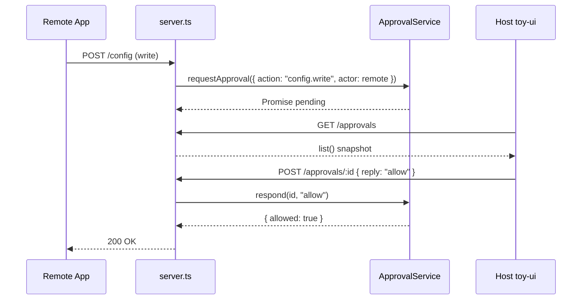
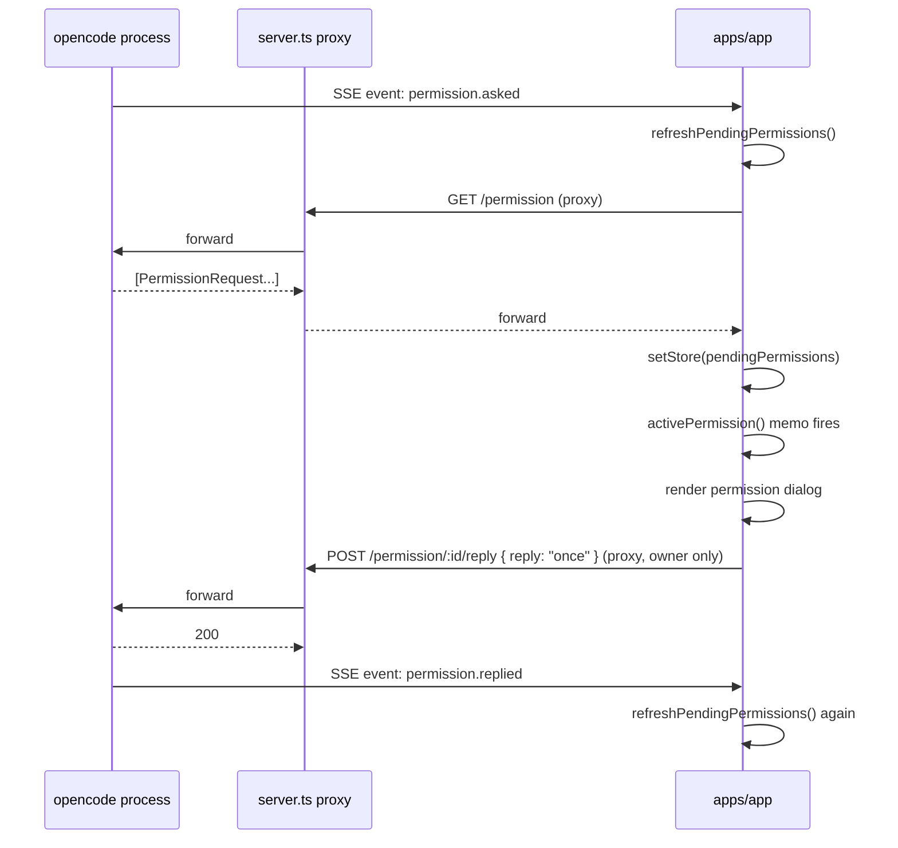
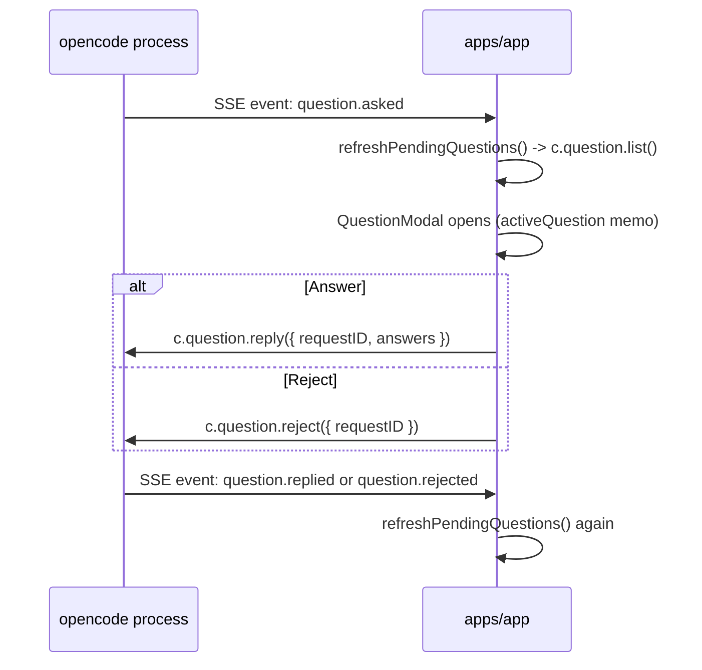

# 05e · OpenWork 权限与问询事件系统

> 本文聚焦 OpenWork 平台（`harnesswork/apps/app`、`apps/server`、`apps/opencode-router`）在"阻断式用户交互"这一横切关注点下的两套独立体系：
>
> 1. **平台层 ApprovalService**：保护 OpenWork **自身 REST 写接口**（config 写入、inbox 上传、file 写入、router 绑定等），粒度到"一次 HTTP 请求"。
> 2. **opencode SDK Permission / Question**：保护 **AI 工具调用**与 **Agent 主动追问**，粒度到"一次模型回合内的一次工具调用"。
>
> 这两套体系**互不感知、各自独立**：平台 `ApprovalService` 不拦截 opencode 内部 permission 流；前端对 opencode permission/question 纯 SDK 透传，不经过 OpenWork 写审批。本文将两者同篇描述，以便读者对比它们的事件结构、持久化、超时、UI、订阅入口。
>
> 本篇**不含** xingjing 相关实现，也不含团随版、焦点模式、xingjing-server。

> **⚠️ v0.12.0 代码路径迁移注意**：本文档引用的 `apps/app/src/app/context/session.ts`、`apps/app/src/app/context/workspace.ts` 等**已完全移除**。v0.12.0 迁移后对应能力路径：
> - opencode permission/question 事件处理：`apps/app/src/react-app/domains/session/sync/actions-store.ts`
> - permission/question UI 模弁：`apps/app/src/react-app/domains/session/modals/question-modal.tsx`
> - 平台 ApprovalService：`apps/server-v2/src/services/`
> 
> 设计逻辑不变，代码锚点行号需应新路径重新定位。迁移完整符号映射见 [./audit-react-migration.md](./audit-react-migration.md)。

---

## 1. 两套体系边界速览

```
┌────────────────────────────────────────────────────────────────────────────┐
│                       用户视角: 弹窗"需要你确认"                            │
└────────────────────────────────────────────────────────────────────────────┘
                     │                                         │
           ┌─────────┴─────────┐                    ┌──────────┴─────────┐
           │  平台 REST 写审批  │                    │ opencode 工具审批  │
           │                   │                    │    与主动提问       │
           └─────────┬─────────┘                    └──────────┬─────────┘
                     │                                         │
     触发源: OpenWork server.ts 中            触发源: opencode 进程内部
              requireApproval(...)            (tool call 前置、Agent 产出 question)
                     │                                         │
     存储:  ApprovalService.pending Map                  opencode 进程内部队列
                     │                                         │
     通道:  GET /approvals + POST /approvals/:id         SDK: c.permission / c.question
            (host scope only)                            Event: permission.asked / question.asked
                     │                                         │
     UI:   apps/server/src/toy-ui.ts 管理页            apps/app session.tsx 内嵌弹窗
            (浏览器直连 toy UI)                        + QuestionModal
                     │                                         │
     超时: 30s 默认、可配置，timeout→自动 deny     由 opencode 进程自身决定
     语义: "是否允许这一次 REST 写"                  "是否允许这一次工具调用 / 回答追问"
```

- 关键取舍：OpenWork 平台**不再封装一层 permission 审批**，直接透传 opencode SDK；`ApprovalService` 只负责平台自己新增的 REST 写能力。
- 代理层额外强制：非 owner 禁止自助回复 opencode 的 `/permission/:id/reply`，见 [assertOpencodeProxyAllowed](file:///Users/umasuo_m3pro/Desktop/startup/xingjing/harnesswork/apps/server/src/server.ts#L196-L212)。

---

## 2. 平台 REST 写审批：ApprovalService

### 2.1 数据契约

`ApprovalRequest` / `ApprovalConfig` / `Actor` 定义在 [types.ts](file:///Users/umasuo_m3pro/Desktop/startup/xingjing/harnesswork/apps/server/src/types.ts#L1-L230)：

```ts
export type ApprovalMode = "manual" | "auto";

export interface ApprovalConfig {
  mode: ApprovalMode;
  timeoutMs: number;
}

export interface Actor {
  type: "remote" | "host";
  clientId?: string;
  tokenHash?: string;   // 只存哈希，禁止回显原始 token
  scope?: string;       // "owner" | "inbox" | "control" | "router"
}

export interface ApprovalRequest {
  id: string;           // 8 字符 shortId
  workspaceId: string;
  action: string;       // e.g. "config.write" | "workspace.files.session.ops"
  summary: string;      // 人类可读摘要，UI 直接展示
  paths: string[];      // 受影响路径，字符串列表
  createdAt: number;
  actor: Actor;
}

export interface ApprovalResult {
  id: string;
  allowed: boolean;
  reason?: "denied" | "timeout";
}
```

四个字段组合构成最小可决策单元：**谁（actor）**、**要做什么（action+summary）**、**影响哪里（workspaceId+paths）**、**什么时候（createdAt）**。

### 2.2 核心实现

[ApprovalService](file:///Users/umasuo_m3pro/Desktop/startup/xingjing/harnesswork/apps/server/src/approvals.ts)（全文 67 行）结构：

```ts
export class ApprovalService {
  private pending = new Map<string, PendingApproval>();

  async requestApproval(input): Promise<ApprovalResult> {
    if (this.config.mode === "auto") {
      return { id: "auto", allowed: true };        // 直通
    }
    const id = shortId();
    const request = { ...input, id, createdAt: Date.now() };
    return new Promise((resolve) => {
      const timeout = setTimeout(() => {
        this.pending.delete(id);
        resolve({ id, allowed: false, reason: "timeout" });
      }, this.config.timeoutMs);
      this.pending.set(id, { request, resolve, timeout });
    });
  }

  respond(id, reply: "allow" | "deny"): ApprovalResult | null {
    const pending = this.pending.get(id);
    if (!pending) return null;           // 已超时或已处理
    if (pending.timeout) clearTimeout(pending.timeout);
    this.pending.delete(id);
    const result = { id, allowed: reply === "allow",
                     reason: reply === "allow" ? undefined : "denied" };
    pending.resolve(result);
    return result;
  }

  list(): ApprovalRequest[] { /* snapshot */ }
}
```

设计要点：

1. **全部驻留内存**：进程重启即丢失所有 pending，等价于"拒绝全部未决"。简洁但要求调用方能容忍超时 deny。
2. **Promise 悬挂**：调用者 `await requestApproval(...)`，直到 `respond()` 被调用或超时 `setTimeout` 回调 fire。
3. **auto 模式短路**：无需写入 `pending`，也不产生事件。用于开发环境或明确信任的 agent host。
4. **timeout 判定**：`setTimeout` 在事件循环中直接 resolve，避免内存泄漏；超时后 `id` 从 `pending` 中移除，后续 `respond` 返回 `null`。
5. **没有持久化**：UI 层（toy-ui）通过 `list()` 轮询快照，而不是订阅事件。

### 2.3 配置加载优先级

`buildConfig()` 在 [config.ts](file:///Users/umasuo_m3pro/Desktop/startup/xingjing/harnesswork/apps/server/src/config.ts#L260-L286) 中拼装：

```
approvalMode      = cli.approvalMode
                 ?? process.env.OPENWORK_APPROVAL_MODE
                 ?? fileConfig.approval?.mode
                 ?? "manual"

approvalTimeoutMs = cli.approvalTimeoutMs
                 ?? Number(process.env.OPENWORK_APPROVAL_TIMEOUT_MS)
                 ?? fileConfig.approval?.timeoutMs
                 ?? 30000
```

- 默认 "manual"，默认 30s；两者都可在 CLI / env / file 三层覆盖，越靠前越高优先。
- `OPENWORK_APPROVAL_MODE=auto` 是开发最常用的一键关审批。

### 2.4 15 处 requireApproval 调用场景

[requireApproval](file:///Users/umasuo_m3pro/Desktop/startup/xingjing/harnesswork/apps/server/src/server.ts#L4837-L4849) 是薄包装：

```ts
async function requireApproval(ctx, input): Promise<void> {
  const actor = ctx.actor ?? { type: "remote" };
  const result = await ctx.approvals.requestApproval({ ...input, actor });
  if (!result.allowed) {
    throw new ApiError(403, "write_denied", "Write request denied", {
      requestId: result.id, reason: result.reason,
    });
  }
}
```

全部 15 个调用点按 action 归类如下（引用位置均在 [server.ts](file:///Users/umasuo_m3pro/Desktop/startup/xingjing/harnesswork/apps/server/src/server.ts)）：

| 分组 | action 常量 | 典型请求 |
| --- | --- | --- |
| 配置写 | `config.write` | `POST /config` |
| 配置写 | `config.global.write` | `POST /config/global` |
| 配置写 | `config.patch` | `PATCH /config` |
| Router | `opencodeRouter.telegram.bind` / `.unbind` / `.test` | Telegram 绑定/解绑/探测 |
| Router | `opencodeRouter.slack.bind` / `.unbind` / `.test` | Slack 同上 |
| Inbox | `workspace.inbox.upload` | 附件上传 |
| 文件 | `workspace.files.session.write` | 会话工作区单文件写 |
| 文件 | `workspace.files.session.ops` | 会话工作区批量 ops |
| 文件 | `workspace.file.write` | 全局工作区文件写 |

语义统一：**凡是"对磁盘 / 配置 / 外部凭证"产生副作用的 HTTP 写**，都必须过一遍 `requireApproval`。读、列表、预览一律不过审批。

### 2.5 路由与代理层保护

`startServer()` 注册两条核心路由（[server.ts L3759-L3771](file:///Users/umasuo_m3pro/Desktop/startup/xingjing/harnesswork/apps/server/src/server.ts#L3759-L3771)）：

```
GET  /approvals             scope: host         返回 list()
POST /approvals/:id         scope: host         body: { reply: "allow" | "deny" }
```

- host scope：只有持有 host token 的 owner 进程（例如同机 toy-ui）能查看和回复。
- 命令行工具 / 机器管控通常把 host token 注入环境变量；远端 remote token 访问这两条路由直接 401。
- 此外 [assertOpencodeProxyAllowed](file:///Users/umasuo_m3pro/Desktop/startup/xingjing/harnesswork/apps/server/src/server.ts#L196-L212) 对 opencode 代理路径做了硬限：
  - 非 owner token + 写方法 + 命中 `/permission/:id/reply` → 403 "Only owner tokens can reply to permission requests"。
  - 这是为了避免一个拥有会话只读权限的 remote actor 通过代理路径绕过审批直接同意 opencode 内部权限。

### 2.6 toy-ui 审批面板

默认绑定在 host 的轻量 HTML 页面 [toy-ui.ts](file:///Users/umasuo_m3pro/Desktop/startup/xingjing/harnesswork/apps/server/src/toy-ui.ts#L858-L915) 直接读 `list()` 渲染：

```
┌─ Pending approvals ───────────────────────────────────┐
│ id=abcd1234  action=workspace.file.write              │
│ actor=remote  clientId=desktop-3                      │
│ paths= /session/xxx/logs/build.log                    │
│ summary="Save build log to session workspace"         │
│ [ Allow ] [ Deny ]                                    │
└───────────────────────────────────────────────────────┘
```

点击按钮走 `POST /approvals/:id`。toy-ui 采用轮询而非 SSE，实现最简。

### 2.7 典型时序

```
remote app           server                approvals              toy-ui (host)
    │                   │                      │                      │
    │ POST /file/write  │                      │                      │
    ├──────────────────▶│                      │                      │
    │                   │ requireApproval(…)   │                      │
    │                   ├─────────────────────▶│                      │
    │                   │                      │                      │
    │                   │                      │   GET /approvals     │
    │                   │                      │◀─────────────────────┤
    │                   │                      │ list() snapshot ─────▶
    │                   │                      │                      │
    │                   │                      │ POST /approvals/:id  │
    │                   │                      │◀─────────────────────┤
    │                   │ resolve(ApprovalResult)                      │
    │                   │◀─────────────────────┤                      │
    │◀──────────────────┤ 200 OK / 403 denied │                      │
```

**关键不变量**：remote 请求者发起写，host owner 最终裁决；两者通过 Promise 在 approvals 中会合。超时等价于裁决拒绝。

---

## 3. opencode Permission：AI 工具调用审批

### 3.1 为什么平台不再包一层

opencode 进程内部已经实现了完整的 per-tool-call 审批：
- 工具触发前向前端广播 `permission.asked` 事件；
- 前端调用 `c.permission.reply()` 回写；
- opencode 进程根据回复决定是否执行工具。

OpenWork 做的仅有两件事：

1. **代理转发**：把 `/permission/*` 透传给 opencode HTTP 端口；
2. **代理拦截**：强制 owner-only（见 2.5）。

其余（字段定义、事件流、去重、doom_loop 检测）都发生在 opencode 进程中；OpenWork 只透传不理解。

### 3.2 前端类型与 store

类型包装（[types.ts L356-L362](file:///Users/umasuo_m3pro/Desktop/startup/xingjing/harnesswork/apps/app/src/app/types.ts#L356-L362)）：

```ts
import type {
  PermissionRequest as ApiPermissionRequest,
  QuestionRequest,
} from "@opencode-ai/sdk/v2/client";

export type PendingPermission = ApiPermissionRequest & { receivedAt: number };
export type PendingQuestion   = QuestionRequest       & { receivedAt: number };
```

`receivedAt` 仅为前端副作用（按 session scope 排序、超时提示），服务端不关心。

Session store（[session.ts L59-L60, L212-L213](file:///Users/umasuo_m3pro/Desktop/startup/xingjing/harnesswork/apps/app/src/app/context/session.ts#L55-L220)）：

```ts
{
  pendingPermissions: PendingPermission[],
  pendingQuestions:   PendingQuestion[],
}
```

两个数组按 session 维度共享，读取时用 `sessionID` 过滤当前会话；没有嵌套结构是为了兼容 opencode SDK 返回的扁平列表。

### 3.3 关键字段（从使用点反推）

`PermissionRequest` 在前端被读到的字段（[session.tsx L270-L308](file:///Users/umasuo_m3pro/Desktop/startup/xingjing/harnesswork/apps/app/src/app/pages/session.tsx#L270-L308)）：

| 字段 | 类型 | 说明 |
| --- | --- | --- |
| `id` | `string` | 全局唯一 request id |
| `sessionID` | `string` | 绑定的会话 id |
| `permission` | `string` | 权限类型标识；OpenWork 前端特别识别 `"doom_loop"` 分支 |
| `patterns` | `string[]` | 触发范围（如文件 glob、工具名 glob） |
| `metadata` | `{ tool?: string, … } \| null` | 附加元数据，doom_loop 分支从中取 `tool` 名 |

`QuestionRequest` 字段（[session.tsx L3866-L3876](file:///Users/umasuo_m3pro/Desktop/startup/xingjing/harnesswork/apps/app/src/app/pages/session.tsx#L3862-L3880)）：

| 字段 | 类型 | 说明 |
| --- | --- | --- |
| `id` | `string` | 唯一问询 id |
| `sessionID` | `string` | 绑定会话 |
| `questions` | `string[]` | 待回答的问题文本数组（Agent 可能一次追问多条） |

### 3.4 数据流：SDK → store

[session.ts L1040-L1058](file:///Users/umasuo_m3pro/Desktop/startup/xingjing/harnesswork/apps/app/src/app/context/session.ts#L1040-L1060) 提供两个 refresh 函数：

```ts
async function refreshPendingPermissions() {
  const c = options.client(); if (!c) return;
  const list = unwrap(await c.permission.list());
  const now = Date.now();
  const prev = new Map(store.pendingPermissions.map((p) => [p.id, p.receivedAt]));
  setStore("pendingPermissions",
    list.map((p) => ({ ...p, receivedAt: prev.get(p.id) ?? now })));
}

async function refreshPendingQuestions() { /* 同上，但调 c.question.list() */ }
```

- `receivedAt` 在"刷新但请求仍未关闭"时保留原值，刷新出新请求时写入当前时间。
- 两个函数只改 store，不触发 UI 副作用；UI 通过 `activePermission` / `activeQuestion` memo 被动渲染。

### 3.5 订阅入口：SSE 事件

SDK 事件流由 session.ts 的 event pump 统一处理，其中与 permission/question 相关分支（[session.ts L1804-L1822](file:///Users/umasuo_m3pro/Desktop/startup/xingjing/harnesswork/apps/app/src/app/context/session.ts#L1804-L1822)）：

```ts
if (event.type === "permission.asked" || event.type === "permission.replied") {
  try { await refreshPendingPermissions(); } catch { /* ignore */ }
}

if (
  event.type === "question.asked" ||
  event.type === "question.replied" ||
  event.type === "question.rejected"
) {
  try { await refreshPendingQuestions(); } catch { /* ignore */ }
}
```

设计要点：

1. **三 permission 事件只监听两个**：`asked` 触发新增、`replied` 触发移除；无 `permission.timeout` 事件，opencode 内部不会主动告知超时（或者由调用端自行重试）。
2. **三 question 事件都监听**：`asked` / `replied` / `rejected` 三态都会重新刷新列表。
3. **事件作为"通知"而非"增量"**：前端不从事件 payload 拿最新 request，而是直接重新 `list()`。好处是去重、幂等，坏处是每次事件一次额外 RTT；对于"等待人类确认"这种低频事件无所谓。
4. **错误被吞掉**：连接闪断时不抛错，下一次事件触发时重试。

### 3.6 回写：respondPermission / respondQuestion / rejectQuestion

[session.ts L1272-L1321](file:///Users/umasuo_m3pro/Desktop/startup/xingjing/harnesswork/apps/app/src/app/context/session.ts#L1272-L1321)：

```ts
async function respondPermission(requestID, reply: "once" | "always" | "reject") {
  if (permissionReplyBusy()) return;
  setPermissionReplyBusy(true);
  try {
    unwrap(await c.permission.reply({ requestID, reply }));
    await refreshPendingPermissions();
  } finally {
    setPermissionReplyBusy(false);
  }
}

async function respondQuestion(requestID, answers: string[][]) {
  if (questionReplyBusy()) return;
  setQuestionReplyBusy(true);
  try {
    unwrap(await c.question.reply({ requestID, answers }));
    await refreshPendingQuestions();
  } finally {
    setQuestionReplyBusy(false);
  }
}

async function rejectQuestion(requestID) {
  if (questionReplyBusy()) return;
  setQuestionReplyBusy(true);
  try {
    unwrap(await c.question.reject({ requestID }));
    await refreshPendingQuestions();
  } finally {
    setQuestionReplyBusy(false);
  }
}
```

关键约定：

- **三态 reply**：`once` = 只允许本次；`always` = 加入信任白名单（持久化在 opencode 侧）；`reject` = 拒绝本次。
- **answers 是 `string[][]`**：对应 `questions: string[]` 每个问题的**多项答案**（opencode 约定允许一个问题多个 value，例如多选标签）。
- **忙锁 `permissionReplyBusy` / `questionReplyBusy`**：防抖，避免快速双击重复调用。
- **reply 成功后立即 refresh**：不依赖 SSE，保证本地 UI 立即关闭。
- **rejectQuestion** 和 `respondQuestion(..., [])` 语义不同：前者显式告知 Agent "拒绝回答"，后者只是"空答"；opencode 会据此决定继续/放弃当前回合。

### 3.7 session-scoped 优先选择

[session.ts L1352-L1368](file:///Users/umasuo_m3pro/Desktop/startup/xingjing/harnesswork/apps/app/src/app/context/session.ts#L1352-L1368)：

```ts
const activePermission = createMemo(() => {
  const id = options.selectedSessionId();
  if (id) {
    const scoped = store.pendingPermissions.find((p) => p.sessionID === id);
    if (scoped) return scoped;
  }
  return store.pendingPermissions[0] ?? null;
});

const activeQuestion = createMemo(() => { /* 同构 */ });
```

- 当前选中会话有未决权限 → 优先弹本会话的。
- 否则回退到列表首项（意味着即使用户切到别的会话，背景会话的权限弹窗仍会浮现，避免遗漏）。
- 两个 memo 是 UI 的**唯一订阅点**：`SessionView` / `QuestionModal` 只读这两个值。

### 3.8 UI 渲染：describePermissionRequest

[session.tsx L270-L308](file:///Users/umasuo_m3pro/Desktop/startup/xingjing/harnesswork/apps/app/src/app/pages/session.tsx#L270-L308) 把原始 `PermissionRequest` 映射为 UI 结构：

```
describePermissionRequest(permission) → {
  title, message, permissionLabel,
  scopeLabel, scopeValue,
  isDoomLoop, note,
}
```

两个分支：

1. **普通分支**：`permissionLabel = permission.permission`，`scopeValue = patterns.join(", ")`，`note = null`。
2. **doom_loop 分支**（`permission.permission === "doom_loop"`）：使用专属文案 `session.doom_loop_*`，并从 `metadata.tool` 中取工具名作为 scope；如果没有 tool，则用 patterns 列出的重复调用对象；固定追加一段 `note` 向用户解释"Agent 正处于疑似死循环，已暂停"。

doom_loop 是 opencode 层做的"工具反复调用检测"——不是 OpenWork 贡献，但 OpenWork 前端**特别识别**这个 permission 类型，以提供更准确的用户指引。

UI 区块（[session.tsx L3762-L3806](file:///Users/umasuo_m3pro/Desktop/startup/xingjing/harnesswork/apps/app/src/app/pages/session.tsx#L3762-L3806)）用 Shield 图标 + title + message + `permissionLabel` + `scopeLabel: scopeValue` + optional `note` + 三个按钮（`once` / `always` / `reject`）或 doom_loop 分支下的 `continue` / `stop`。

### 3.9 QuestionModal

[session.tsx L3864-L3876](file:///Users/umasuo_m3pro/Desktop/startup/xingjing/harnesswork/apps/app/src/app/pages/session.tsx#L3862-L3880) 挂载逻辑：

```tsx
<QuestionModal
  open={Boolean(props.activeQuestion)}
  questions={props.activeQuestion?.questions ?? []}
  busy={props.questionReplyBusy}
  onClose={() => {}}
  onReply={(answers) => {
    if (props.activeQuestion) {
      props.respondQuestion(props.activeQuestion.id, answers);
    }
  }}
/>
```

观察点：

- `onClose` 空函数 → **不允许关闭**；用户只能"回答"或"拒答"（拒答由模态内的按钮触发，最终调 `rejectQuestion`）。
- 模态内会为每个 `questions[i]` 渲染一个输入行，收集到 `string[][]` 回填。

### 3.10 "always" 的作用范围与 respondPermissionAndRemember

[app.tsx L644-L650](file:///Users/umasuo_m3pro/Desktop/startup/xingjing/harnesswork/apps/app/src/app/app.tsx#L644-L650)：

```ts
async function respondPermissionAndRemember(requestID, reply) {
  // Intentional no-op: permission prompts grant session-scoped access only.
  await respondPermission(requestID, reply);
}
```

- 有一个"记住"版本包装器 `respondPermissionAndRemember`，目前和 `respondPermission` 等价，注释声明"权限授权只在会话范围有效"。
- 暗示存在**潜在扩展点**：未来可在此写入"跨会话白名单"到本地存储或后端；当前版本刻意不实现，保持语义最窄。
- `reply === "always"` 时 opencode 侧仍会把该 pattern 加入**进程内**的 session 级白名单（用户退出后失效）。

### 3.11 连接阶段的主动刷新

workspace 连接流程在 rehydrate 阶段会**主动刷新一次 permission 列表**（[workspace.ts L2077-L2079](file:///Users/umasuo_m3pro/Desktop/startup/xingjing/harnesswork/apps/app/src/app/context/workspace.ts#L2075-L2085)）：

```ts
const pendingPermissionsAt = Date.now();
await options.refreshPendingPermissions();
connectMetrics.pendingPermissionsMs = Date.now() - pendingPermissionsAt;
```

- 目的：重连后，opencode 若有**连接断开前累积**的待决 permission，前端能立即识别并弹窗。
- 指标 `pendingPermissionsMs` 会被记录到连接诊断，用于问题定位（在 settings 诊断页展示）。
- 对 question 列表**没有**对等主动刷新；question 设计为"只在活跃对话中产生"，重连后 stale question 价值不大。

### 3.12 workspace 切换时清理

workspace.ts 在切换或登出时调用 `setPendingPermissions([])` 清空（出现于 L490、L1701、L3589），避免上一个 workspace 的权限请求在新 workspace 下显示。`pendingQuestions` 对等清理（未全部列出）。

---

## 4. 与 Session / Message 的关系

### 4.1 事件不进入消息流

两套 permission / question 事件都**不会**作为 `Message.Part` 写入 session 的消息列表：

- 平台 `ApprovalRequest` 与 session 毫无绑定（它绑 workspaceId+paths，REST 入口层面）。
- opencode `PermissionRequest` / `QuestionRequest` 虽然带 `sessionID`，但前端**只把它们放进 pendingPermissions / pendingQuestions 两个扁平数组**，不写入 `store.messages[sessionID]`。

好处：

1. 消息流保持"单一数据源 = opencode messages API"的干净语义。
2. 权限对话重放不会污染历史消息（用户回看历史时不会看到过期的权限弹窗）。

### 4.2 显示维度：session-scoped

虽然不进消息流，但 UI 是**按 session 聚合**显示的（activePermission / activeQuestion 优先选本会话 scope 的）。用户对"当前会话有没有待决交互"有直观感知。

### 4.3 跨 session 的 pending 列表

`pendingPermissions` / `pendingQuestions` 是扁平数组、不按 sessionID 分桶。好处：

- 切换会话时无需加载/卸载；
- 同时存在多个 session 的 pending 时，UI 能降级显示"列表首项"。

代价：没有按 session 聚合统计；如需要"每个会话有多少未决"，前端需自行 filter（实际 UI 没有此需求）。

---

## 5. 超时与默认行为

### 5.1 平台 ApprovalService

| 场景 | 默认值 | 行为 |
| --- | --- | --- |
| `approvalTimeoutMs` 未配置 | 30000 ms | 30s 后自动返回 `{ allowed: false, reason: "timeout" }` |
| `approvalMode = "auto"` | — | 立即返回 `{ allowed: true, id: "auto" }`，不入队 |
| 进程重启（pending 未决） | — | 全部丢失；调用方 `await` 的 Promise 永远不会 resolve，但由于服务端已崩溃，HTTP 连接会在客户端侧失败（读超时） |
| 并发重复请求 | — | 每次都创建一个独立 `shortId()`，**不做去重** |

关键缺陷认知：**进程重启 = 所有 pending 悬挂 Promise 泄漏给垃圾回收**。因为 `startServer()` 不做 shutdown hook 来批量 deny。生产环境依赖 TCP 断开让客户端失败。

### 5.2 opencode Permission / Question

- 超时由 **opencode 进程自身**决定，OpenWork 前端不参与。
- 前端不实现"本地超时关闭弹窗"；只要 `activePermission()` 非 null，弹窗就一直显示。
- 若用户切换 workspace，`setPendingPermissions([])` 会清空列表，相当于"视觉上关闭"——但对应的 opencode 侧 request 仍在等待，除非用户再切回来或 opencode 自行超时。

### 5.3 doom_loop 分支作为"软超时"

doom_loop 并非超时，但在功能上是 opencode 侧的**软保护**：当检测到工具重复调用超过阈值，主动发出一条 `permission.permission === "doom_loop"` 的请求，把决定权交给人。前端专属文案帮助用户理解"为什么突然弹了这个"。

---

## 6. 跨模块订阅入口

下表列出所有**对外暴露**的权限/问询相关入口（只列 apps 层面 OpenWork 主干，不含 xingjing）：

| 入口 | 位置 | 用途 |
| --- | --- | --- |
| `useSession().pendingPermissions` / `pendingQuestions` | [session.ts L2054-L2076](file:///Users/umasuo_m3pro/Desktop/startup/xingjing/harnesswork/apps/app/src/app/context/session.ts#L2040-L2080) | 整个 pending 数组；调试面板和 settings 诊断页使用 |
| `useSession().activePermission` / `activeQuestion` | 同上 | 当前应当弹窗的单个 request；SessionView 内部使用 |
| `useSession().respondPermission(requestID, "once"\|"always"\|"reject")` | 同上 | 权限回复 |
| `useSession().respondQuestion(requestID, answers)` | 同上 | 问询回答 |
| `useSession().rejectQuestion(requestID)` | 同上 | 显式拒答 |
| `useSession().refreshPendingPermissions()` | 同上 | 手动刷新；被 workspace connect 路径调用 |
| `useWorkspace().refreshPendingPermissions` | [workspace.ts L137](file:///Users/umasuo_m3pro/Desktop/startup/xingjing/harnesswork/apps/app/src/app/context/workspace.ts#L135-L140) | workspace context 透出的刷新入口（连接阶段会主动触发） |
| `GET /approvals` | [server.ts L3759](file:///Users/umasuo_m3pro/Desktop/startup/xingjing/harnesswork/apps/server/src/server.ts#L3759-L3771) | host scope：平台 REST 写审批列表 |
| `POST /approvals/:id` | 同上 | host scope：回复平台 REST 写审批 |

**注意反向约束**：

- UI 其余层（例如 `settings.tsx`、`settings-shell.tsx` 的 pendingPermissions 传参）**只读**这些值用于展示 / 诊断，不再次处理。
- `team-session-orchestrator.ts` 中有 `pendingPermissionsBySession` 等同名字段，属于 **xingjing 团队版编排器**，不在本篇范围。
- `respondPermissionAndRemember` 是前端额外提供的扩展点，当前等价于 `respondPermission`。

---

## 7. 设计决策表

下表汇总 05e 篇的关键设计决策（22 条）：

| # | 决策 | 代码证据 | 影响 |
| --- | --- | --- | --- |
| 1 | 平台不实现 per-tool-call 审批，只实现 REST 写审批 | 全文搜索无相关代码 | 审批体系分裂，但互不影响；避免与 opencode 重叠 |
| 2 | ApprovalService 纯内存，不持久化 | [approvals.ts](file:///Users/umasuo_m3pro/Desktop/startup/xingjing/harnesswork/apps/server/src/approvals.ts) | 进程重启 = 所有 pending 丢失 |
| 3 | auto 模式短路，不入队 | approvals.ts `config.mode === "auto"` | 开发环境可一键关审批 |
| 4 | 超时默认 30s，timeout 自动 deny | config.ts L260-L286 | 不存在"永远等待"状态 |
| 5 | 平台审批仅 host scope 可回复 | server.ts L3759-L3771 | 远端不可自助审批 |
| 6 | 代理层额外阻止非 owner 自助回复 opencode /permission/reply | server.ts L196-L212 | 双重保护 |
| 7 | `ApprovalRequest` 携带 Actor，区分 remote / host | types.ts L1-L230 | 日志可追溯谁触发了写 |
| 8 | `tokenHash` 只存哈希 | types.ts | 审计日志不泄露原始 token |
| 9 | `requireApproval` 抛 `ApiError(403, "write_denied")` | server.ts L4837-L4849 | 统一错误格式 |
| 10 | 15 个 action 常量枚举全部 REST 写入口 | server.ts 多处 | 增写接口必须同步加审批 |
| 11 | opencode permission 通过 SDK 纯透传 | session.ts L1272-L1287 | 平台不解析 PermissionRequest 字段 |
| 12 | 前端 `PendingPermission = ApiPermissionRequest & { receivedAt }` | types.ts L356-L362 | 只加一个时间戳，保持 SDK 字段 1:1 |
| 13 | 刷新策略：SSE 触发 + 直接重拉 list，不从 payload 取 | session.ts L1804-L1822 | 幂等但多一次 RTT；实现简单 |
| 14 | `permission.asked/replied` 两事件；无 timeout 事件 | 同上 | 依赖 opencode 自行处理超时 |
| 15 | `question.asked/replied/rejected` 三事件都监听 | 同上 | question 生命周期更完整 |
| 16 | `reply` 三态：`once` / `always` / `reject` | session.ts L1272-L1287 | always 仅 opencode 进程内有效 |
| 17 | `answers` 是 `string[][]` | session.ts L1289-L1304 | 支持一个问题多答案 |
| 18 | QuestionModal `onClose` 空函数 | session.tsx L3864-L3876 | 不允许"关闭忽略"，必须显式回答或拒答 |
| 19 | `activePermission` / `activeQuestion` 优先选 session scoped | session.ts L1352-L1368 | 切会话时弹窗正确归属 |
| 20 | doom_loop 前端特判，读 `metadata.tool` | session.tsx L284-L298 | 向用户更清晰提示 |
| 21 | `respondPermissionAndRemember` 预留为未来扩展 | app.tsx L644-L650 | 当前 no-op，未跨会话持久化 |
| 22 | workspace 连接时主动刷新 pendingPermissions 并记录指标 | workspace.ts L2077-L2079 | 重连后能立即恢复待决弹窗 |

---

## 8. 端到端时序图

### 8.1 平台 REST 写审批（完整链路）



### 8.2 opencode Permission（完整链路）



### 8.3 opencode Question



---

## 9. 与其他文档的衔接

- 事件驱动的 SSE 通道与 `c.session.events()` 的 pump 实现详见 [./05a-openwork-session-message.md](./05a-openwork-session-message.md)；permission/question 事件复用同一条事件管道，无独立 SSE。
- `ApprovalService` 与 `TokenManager` 的关系（host vs remote scope、Actor 字段来源）详见 [./05-openwork-platform-overview.md](./05-openwork-platform-overview.md) 与 [./06-openwork-bridge-contract.md](./06-openwork-bridge-contract.md)（待写）。
- workspace connect 阶段主动刷新 `pendingPermissions` 的完整编排详见 [./05c-openwork-workspace-fileops.md](./05c-openwork-workspace-fileops.md)。
- `config.write` / `file.write` 等 action 的字段契约详见 [./05c-openwork-workspace-fileops.md](./05c-openwork-workspace-fileops.md) 与 [./05f-openwork-settings-persistence.md](./05f-openwork-settings-persistence.md)（待写）。

---

## 10. 备忘：已确认**不在本篇**的内容

- OpenWork 平台**不提供**：跨会话权限白名单、权限审计日志持久化、question 超时策略、permission 广播到多端的协作模式。
- opencode 内部：doom_loop 检测阈值、`permission` 字符串枚举全集、tool 级 always 白名单的存储位置——均在 opencode 源码中，**不属于 OpenWork 责任域**。
- xingjing 团队版的 `team-session-orchestrator` 中 permission/question 编排逻辑不在本篇覆盖范围，留给 xingjing 篇（40/50 系列）。

