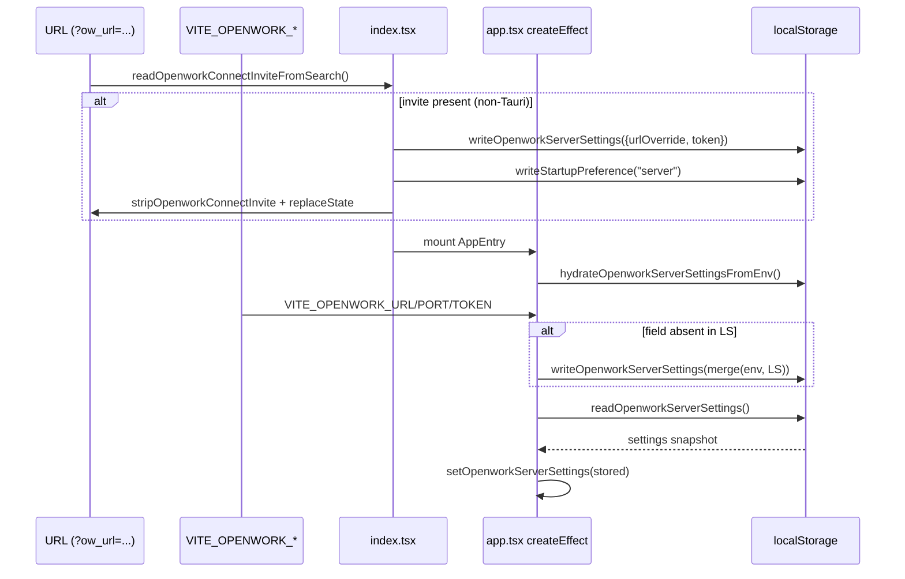

# 05f · OpenWork 设置与持久化

> 本文聚焦 OpenWork（`harnesswork/apps/app`、`apps/desktop`、`apps/server`）在**应用级设置**与**本地持久化**上的统一做法：
>
> 1. 全部设置项的字段、类型、默认值与存储位置（按代码事实枚举）；
> 2. 三种持久化渠道的选型与 API 抽象：直写 `localStorage`、`Persist` 命名空间化 store、Tauri `platform.storage()` 注入点；
> 3. 启动加载序列与 Provider 注入关系（AppEntry 四层 Provider 嵌套）；
> 4. 版本迁移与 legacy key 兼容策略。
>
> 本篇**不含** xingjing 子目录代码（`apps/app/src/app/xingjing/**`），也不含团随版、焦点模式、xingjing-server。

> **⚠️ v0.12.0 代码路径迁移注意**：本文档引用的 `apps/app/src/app/context/local.tsx`、`apps/app/src/app/context/model-config.ts`、`apps/app/src/app/context/extensions.ts` 等**已完全移除**。v0.12.0 迁移后对应能力路径：
> - LocalProvider / 本地偏好持久化：`apps/app/src/react-app/kernel/local-provider.tsx`
> - 模型配置：`apps/app/src/react-app/kernel/model-config.ts`
> - 设置页面：`apps/app/src/react-app/domains/settings/`
> - AppEntry Provider 链→新 `AppProviders` ：`apps/app/src/react-app/shell/providers.tsx`
> 
> 设计逻辑不变，代码锚点行号需应新路径重新定位。迁移完整符号映射见 [./audit-react-migration.md](./audit-react-migration.md)。

---

## 1. 持久化渠道总览

OpenWork 前端**没有使用 Tauri 的 `plugin-store` / `plugin-keyring`**；桌面与 Web 使用同一套 `window.localStorage`，差别仅在于 Tauri 端可由 `Platform.storage(name)` 注入替换实现。当前注入的 `platform.storage` 实际上也是 `window.localStorage` 上加前缀的包装（[index.tsx L147-L154](file:///Users/umasuo_m3pro/Desktop/startup/xingjing/harnesswork/apps/app/src/index.tsx#L147-L156)）：

```ts
storage: (name) => {
  const prefix = name ? `${name}:` : "";
  return {
    getItem: (key) => window.localStorage.getItem(prefix + key),
    setItem: (key, value) => window.localStorage.setItem(prefix + key, value),
    removeItem: (key) => window.localStorage.removeItem(prefix + key),
  };
}
```

在此之上出现**三种**持久化使用风格：

```
┌─ 渠道 A：直写 localStorage（散落于 app.tsx 等入口）────────┐
│  key 例：openwork.baseUrl / openwork.engineSource           │
│  读：一次性读取到 signal                                     │
│  写：createEffect 监听 signal 自动回写                       │
└──────────────────────────────────────────────────────────────┘
┌─ 渠道 B：persist.ts 抽象（按 scope 命名空间）────────────────┐
│  key 例：openwork.global.dat：local.ui                       │
│          openwork.workspace.<head>.<sum>.dat：workspace:xxx  │
│          openwork.workspace.<head>.<sum>.dat：session:<id>:x │
│  底层：@solid-primitives/storage makePersisted              │
│  特性：legacy 迁移、defaults merge、异步 ready               │
└──────────────────────────────────────────────────────────────┘
┌─ 渠道 C：独立 helper 模块（专用 getter/setter）─────────────┐
│  例：openwork-server.ts（server 连接四键）                   │
│      font-zoom.ts（字体缩放）                                │
│      session/draft-store.ts（草稿缓存）                      │
│      context/extensions.ts（自定义 MCP/Skills Hub）          │
│  特性：做 shape 校验、非法值降级、缓存 Map                    │
└──────────────────────────────────────────────────────────────┘
```

三种渠道**可以共存**——多数简单偏好走渠道 A；跨模块共享且需默认值 merge 的走渠道 B；需要结构校验、容错、批量写入的走渠道 C。

---

## 2. 持久化键全景表

全部 `openwork.*` 键（含遗留与子空间）按渠道汇总。除标注"Tauri 专属"外，全部字段在 Web 与 Tauri 共用。

### 2.1 渠道 A：直写 localStorage

| Key | 类型 | 默认 | 写入位置 | 读取位置 |
| --- | --- | --- | --- | --- |
| `openwork.baseUrl` | string | `""` | [app.tsx L1702-L1712](file:///Users/umasuo_m3pro/Desktop/startup/xingjing/harnesswork/apps/app/src/app/app.tsx#L1702-L1712) | [app.tsx L253-L257, L1566-L1571](file:///Users/umasuo_m3pro/Desktop/startup/xingjing/harnesswork/apps/app/src/app/app.tsx#L250-L260) |
| `openwork.clientDirectory` | string | `""` | L1714-L1724 | L1573-L1578 |
| `openwork.projectDir` | string | `""` | L1726-L1734（legacy 兼容） | — |
| `openwork.engineSource` | `"path" \| "sidecar" \| "custom"` | `isTauri ? "sidecar" : "path"` | L1736-L1743 | L1580-L1599 |
| `openwork.engineCustomBinPath` | string | `""` | L1745-L1757（空值走 remove） | L1583-L1588 |
| `openwork.engineRuntime` | `"direct" \| "openwork-orchestrator"` | `"openwork-orchestrator"` | L1759-L1766 | L1601-L1606 |
| `openwork.opencodeEnableExa` | `"0" \| "1"` | `"0"` | L1768-L1778 | L1608-L1613 |
| `openwork.updateAutoCheck` | `"0" \| "1"` | `"1"`（Tauri 启动首次） | L1780-L1790 | L1627-L1632 |
| `openwork.updateAutoDownload` | `"0" \| "1"` | `"0"` | L1792-L1802 | L1634-L1643（设 download=1 时隐式抬起 check=1） |
| `openwork.updateLastCheckedAt` | string(number) | — | L1821-L1834 | L1645-L1653 |
| `openwork.hideTitlebar` | bool(JSON) | `false` | L1804-L1819 + `setWindowDecorations` | L1615-L1625 |
| `openwork.workspace-last-session.v1` | `Record<workspaceId, sessionId>` | `{}` | L427-L434 | L415-L426 |
| `openwork.workspace-collapse.v1` | bool(JSON) | `false` | [sidebar.tsx L71](file:///Users/umasuo_m3pro/Desktop/startup/xingjing/harnesswork/apps/app/src/app/components/session/sidebar.tsx#L55-L75) | L55-L65 |

**`.v1` 后缀语义**：首次出现的正式版本序号；未来升级字段 shape 时改为 `.v2`，旧 key 保留以便回滚，由调用方决定是否清理。目前代码里尚无 v1→v2 实例，仅是命名约定。

### 2.2 渠道 A（独立 helper 分支）

| Key | 类型 | 默认 | 读写 API | 定义位置 |
| --- | --- | --- | --- | --- |
| `openwork.startupPref` | `"local" \| "server"` | `null` | `readStartupPreference()` / `writeStartupPreference()` / `clearStartupPreference()` | [utils/index.ts L103-L148](file:///Users/umasuo_m3pro/Desktop/startup/xingjing/harnesswork/apps/app/src/app/utils/index.ts#L103-L150) |
| `openwork.themePref` | `"light" \| "dark" \| "system"` | `"system"` | `bootstrapTheme()` / `persistThemeMode()` / `getInitialThemeMode()` | [theme.ts L3-L62](file:///Users/umasuo_m3pro/Desktop/startup/xingjing/harnesswork/apps/app/src/app/theme.ts#L3-L62) |
| `openwork.language` | `"en" \| "zh" \| …` | 系统 locale 探测 | `initLocale()` / `setLocale()` | [i18n/index.ts L63-L145](file:///Users/umasuo_m3pro/Desktop/startup/xingjing/harnesswork/apps/app/src/i18n/index.ts#L60-L145) |
| `openwork.desktop-font-zoom.v1` | number(string) | `1` | `readStoredFontZoom()` / `persistFontZoom()` | [font-zoom.ts](file:///Users/umasuo_m3pro/Desktop/startup/xingjing/harnesswork/apps/app/src/app/lib/font-zoom.ts) |

### 2.3 Server 连接专用键（openwork-server.ts）

[openwork-server.ts L467-L470](file:///Users/umasuo_m3pro/Desktop/startup/xingjing/harnesswork/apps/app/src/app/lib/openwork-server.ts#L465-L475) 定义了一组服务端连接设置键，由 `readOpenworkServerSettings()` / `writeOpenworkServerSettings()` 成对读写（L576-L633）。**空值一律删除键**而不是存空串：

| Key | 类型 | 默认 | 语义 |
| --- | --- | --- | --- |
| `openwork.server.urlOverride` | string(URL) | — | 服务端完整地址覆盖 |
| `openwork.server.port` | string(number) | — | 仅端口覆盖（当 urlOverride 缺失） |
| `openwork.server.token` | string | — | 连接 token |
| `openwork.server.remoteAccessEnabled` | `"1"` | 不存在=false | 是否启用远程访问模式 |

此外这些键在启动时还会被 `hydrateOpenworkServerSettingsFromEnv()`（L635-L679）用 `VITE_OPENWORK_URL` / `VITE_OPENWORK_PORT` / `VITE_OPENWORK_TOKEN` 环境变量**回填**——**仅当对应 localStorage 键为空时**才写入，保护用户显式设定不被环境变量覆盖。

### 2.4 Model / Variant 相关键（详见 [./05d-openwork-model-provider.md](./05d-openwork-model-provider.md)）

常量定义在 [constants.ts L3-L8](file:///Users/umasuo_m3pro/Desktop/startup/xingjing/harnesswork/apps/app/src/app/constants.ts#L3-L8)：

| 常量 | 实际 key | Scope | 说明 |
| --- | --- | --- | --- |
| `MODEL_PREF_KEY` | `openwork.defaultModel` | 全局 | 默认模型 `providerID/modelID` |
| `SESSION_MODEL_PREF_KEY` | `openwork.sessionModels` | **前缀**（`openwork.sessionModels.<workspaceId>`） | 每 workspace 下每 session 的模型覆盖 |
| `THINKING_PREF_KEY` | `openwork.showThinking` | 全局（legacy） | 已被迁移到 LocalProvider（见 §5.2） |
| `VARIANT_PREF_KEY` | `openwork.modelVariant` | **前缀**（`openwork.modelVariant.<workspaceId>`） | 按 workspace 记每个 model 的 variant |
| `LANGUAGE_PREF_KEY` | `openwork.language` | 全局 | 同 §2.2 |
| `HIDE_TITLEBAR_PREF_KEY` | `openwork.hideTitlebar` | 全局 | 同 §2.1 |

注意 `SESSION_MODEL_PREF_KEY` 与 `VARIANT_PREF_KEY` 被用作**前缀**：实际 key 形如 `openwork.sessionModels.<workspaceId>`、`openwork.modelVariant.<workspaceId>`，按 workspace 水平分片（[model-config.ts L235-L240](file:///Users/umasuo_m3pro/Desktop/startup/xingjing/harnesswork/apps/app/src/app/context/model-config.ts#L235-L240)）。

### 2.5 其它专用键

| Key | 类型 | 用途 | 位置 |
| --- | --- | --- | --- |
| `openwork.session-drafts.v1` | `Record<"workspace:session", { text, mode }>`，限 100 条 | 会话输入草稿缓存 | [draft-store.ts](file:///Users/umasuo_m3pro/Desktop/startup/xingjing/harnesswork/apps/app/src/app/session/draft-store.ts) |
| `openwork.skills.hubRepos.v1` | `Array<HubRepo>` | 自定义 Skill Hub 仓库列表 | [extensions.ts L188-L260](file:///Users/umasuo_m3pro/Desktop/startup/xingjing/harnesswork/apps/app/src/app/context/extensions.ts#L186-L260) |

---

## 3. 渠道 B：Persist 抽象

[utils/persist.ts](file:///Users/umasuo_m3pro/Desktop/startup/xingjing/harnesswork/apps/app/src/app/utils/persist.ts) 提供跨 scope 的统一 store 持久化。

### 3.1 命名空间

`Persist` 工厂函数 ([persist.ts L86-L100](file:///Users/umasuo_m3pro/Desktop/startup/xingjing/harnesswork/apps/app/src/app/utils/persist.ts#L86-L100))：

```ts
export const Persist = {
  global(key, legacy?)          -> { storage: "openwork.global.dat", key, legacy }
  workspace(dir, key, legacy?)  -> { storage: workspaceStorage(dir), key: "workspace:" + key, legacy }
  session(dir, session, key, legacy?) -> { storage: workspaceStorage(dir), key: "session:" + session + ":" + key, legacy }
  scoped(dir, session, key, legacy?)  -> session ? session(...) : workspace(...)
};
```

`workspaceStorage(dir)` 哈希算法（L71-L75）：

```ts
function workspaceStorage(dir: string) {
  const head = dir.slice(0, 12) || "workspace";
  const sum = checksum(dir);
  return `openwork.workspace.${head}.${sum}.dat`;
}
```

产出示例：`openwork.workspace./Users/alice.abc123.dat`；前 12 字符用于人眼识别（可读），checksum 保证唯一。

### 3.2 存储媒介选择

`persisted()` 根据 `Platform` 类型决定实际后端（L118-L140）：

```ts
const isDesktop = platform.platform === "desktop" && !!platform.storage;

const currentStorage =
  isDesktop ? platform.storage?.(config.storage)
            : (config.storage ? localStorageWithPrefix(config.storage)
                              : localStorage);
```

也就是说：

- **Web**：无 storage name → 裸 localStorage；有 name → 在 `localStorage` 上加 `name:` 前缀（等同于 Tauri 当前实现）。
- **Desktop (Tauri)**：调 `platform.storage(name)` 取 `AsyncStorage`；当前代码仍是 `localStorage` 前缀包装（无独立文件系统 store），但**接口预留**为可异步的 `getItem: Promise<string|null>`，未来可无痛替换为 `tauri-plugin-store`。

### 3.3 legacy 迁移与 defaults merge

`persisted()` 的核心逻辑（L142-L238）：

1. **读取流程**：
   - 先读主 key；存在 → `parse` → `migrate?` → `merge(defaults, ...)`；若 merged 与原始 raw 字符串不同（例如新加了字段），立刻回写规范化后的值。
   - 主 key 不存在 → 遍历 `legacy[]`，读到第一个存在的 legacyKey → 复制到主 key、从 legacyStore 删除、继续 migrate+merge 流程。
2. **写入流程**：直接写主 key，无 legacy 处理。
3. **defaults merge 语义**（L28-L52）：
   - value undefined → 用 defaults；
   - value null → 保留 null；
   - defaults 为 array：value 也是 array 则整体替换，否则退回 defaults；
   - defaults 为 object：逐字段 merge；value 中新出现的字段直接保留（不 drop）；
   - 其它标量：直接用 value。

**后果**：向 Persist store 新增字段无需手动迁移——默认值会在下次读取时自动合并回写；删除字段需要显式 migrate 回调；`value === null` 被视作"显式设为 null"而不是"未设"。

### 3.4 ready 信号

返回的 `[state, setState, init, ready]` 中的 `ready: Accessor<boolean>` 用 `createResource` 包装初始化 promise。Desktop 端异步初始化完成前，调用方应 Gate 写入，否则初始值可能尚未合并：

```ts
const [prefs, setPrefs, , prefsReady] = persisted(
  Persist.global("local.preferences", ["openwork.preferences"]),
  createStore<LocalPreferences>({ showThinking: false, modelVariant: null, defaultModel: null }),
);

createEffect(() => {
  if (!prefsReady()) return;
  // 此处才能安全 setPrefs
});
```

### 3.5 实际使用点：LocalProvider

目前 Persist 体系在 apps/app 主干**唯一实例化位置**在 [context/local.tsx L30-L45](file:///Users/umasuo_m3pro/Desktop/startup/xingjing/harnesswork/apps/app/src/app/context/local.tsx#L30-L50)：

| Store | 默认值 | 实际存储位置 | legacy |
| --- | --- | --- | --- |
| `local.ui` | `{ view: "settings", tab: "general" }` | `openwork.global.dat` key=`local.ui` | `["openwork.ui"]` |
| `local.preferences` | `{ showThinking: false, modelVariant: null, defaultModel: null }` | `openwork.global.dat` key=`local.preferences` | `["openwork.preferences"]` |

其它 Provider（workspace / session / skill 管理）目前仍走直写或独立 helper，尚未迁入 Persist 抽象。

### 3.6 手动清理

`removePersisted()`（L102-L116）在不挂载 Provider 的情况下手动删除 key。当前代码库无主动调用点，属 escape hatch。

---

## 4. 启动加载序列

按代码实际执行顺序（从 `index.tsx` 到 `App` 就绪）：

```
┌── 1. 静态入口 index.tsx ─────────────────────────────────────┐
│  bootstrapTheme()                                             │
│    └─ 读 "openwork.themePref" → applyTheme() → data-theme 属性 │
│  initLocale()                                                 │
│    └─ 读 "openwork.language" → setLocaleSignal() + <html lang>│
└───────────────────────────────────────────────────────────────┘
┌── 2. URL invite 预处理（仅非 Tauri）────────────────────────┐
│  readOpenworkConnectInviteFromSearch(location.search)         │
│    └─ 若含 ow_url/ow_token/ow_startup/ow_auto_connect         │
│       → writeOpenworkServerSettings({urlOverride, token})     │
│       → writeStartupPreference("server")                      │
│       → history.replaceState 清理 URL 参数                    │
└───────────────────────────────────────────────────────────────┘
┌── 3. Platform 注入 & Router 挂载 ────────────────────────────┐
│  <PlatformProvider value={platform}>                          │
│    <RouterComponent root={AppEntry}>...</RouterComponent>     │
│  </PlatformProvider>                                          │
└───────────────────────────────────────────────────────────────┘
┌── 4. AppEntry 四层 Provider 嵌套 ────────────────────────────┐
│  <ServerProvider defaultUrl={...}>                            │
│    <GlobalSDKProvider>                                        │
│      <GlobalSyncProvider>                                     │
│        <LocalProvider>       ← 此处启动 Persist 读            │
│          <App />                                              │
└───────────────────────────────────────────────────────────────┘
┌── 5. App createEffect 群 ────────────────────────────────────┐
│  • 初始化 signals（themeMode / engineSource / baseUrl / …）    │
│  • createEffect × 14：订阅 signal 写回对应 localStorage key   │
│  • createEffect 读取：在 onMount 等价的 createEffect 里批量    │
│    读取 openwork.* 键回填 signal                              │
│  • hydrateOpenworkServerSettingsFromEnv() 一次性 env → LS      │
│  • 读 readOpenworkServerSettings() 初始化 openworkServerStore │
│  • readOpenworkConnectInviteFromSearch() 处理 URL invite      │
│  • 读 readStartupPreference() 初始化 startupPreference signal │
│  • applyAndPersistFontZoom(readStoredFontZoom())               │
└───────────────────────────────────────────────────────────────┘
┌── 6. workspace bootstrap ────────────────────────────────────┐
│  workspaceStore.bootstrapOnboarding()                         │
│    └─ 拉 workspaceId → 设 engineInfo → (可选) 自动 connect    │
└───────────────────────────────────────────────────────────────┘
```

关键不变量：

1. **theme / locale 最早**：在 Provider 树挂载前就已 apply，避免 flash。
2. **ServerProvider 之前不触达网络**：invite URL 参数仅写入 LS，`bootstrapOnboarding` 之后才根据 startupPreference 决定是否 auto connect。
3. **LocalProvider 内部异步 ready**：其它组件如需读 `local.preferences` 必须观察 `ready()`。
4. **engineSource/baseUrl 在 Tauri 下不还原**：因为 opencode 每次重启端口随机，LS 中的 `openwork.baseUrl` 只在非 Tauri 下回读（[app.tsx L1560-L1571](file:///Users/umasuo_m3pro/Desktop/startup/xingjing/harnesswork/apps/app/src/app/app.tsx#L1560-L1571)）。

---

## 5. 迁移与兼容策略

### 5.1 startupPref 多代 legacy

[utils/index.ts L103-L135](file:///Users/umasuo_m3pro/Desktop/startup/xingjing/harnesswork/apps/app/src/app/utils/index.ts#L103-L135) 累计三代 key 与两代语义：

```ts
const STARTUP_PREF_KEY       = "openwork.startupPref";
const LEGACY_PREF_KEY        = "openwork.modePref";
const LEGACY_PREF_KEY_ALT    = "openwork_mode_pref";  // 注意无点号

readStartupPreference():
  读 STARTUP_PREF_KEY → if not exist → LEGACY_PREF_KEY → LEGACY_PREF_KEY_ALT
  值映射：
    "local"  → "local"
    "server" → "server"
    "host"   → "local"    // 旧版术语
    "client" → "server"   // 旧版术语

writeStartupPreference(next):
  写 STARTUP_PREF_KEY = next
  同步删除 LEGACY_PREF_KEY / LEGACY_PREF_KEY_ALT
```

设计策略：**读宽写窄**——向旧 key 退让读取，但写入时统一新 key 并清理旧 key，保证每次写入后字典只剩一条记录。

### 5.2 showThinking：独立键 → LocalPreferences

[local.tsx L49-L70](file:///Users/umasuo_m3pro/Desktop/startup/xingjing/harnesswork/apps/app/src/app/context/local.tsx#L49-L70) 在 `prefsReady()` 触发后执行一次性迁移：

```ts
createEffect(() => {
  if (!prefsReady()) return;
  if (typeof window === "undefined") return;

  const raw = window.localStorage.getItem(THINKING_PREF_KEY);  // "openwork.showThinking"
  if (raw == null) return;

  try {
    const parsed = JSON.parse(raw);
    if (typeof parsed === "boolean") {
      setPrefs("showThinking", parsed);   // 迁入 LocalPreferences store
    }
  } catch { /* invalid → drop */ }

  try { window.localStorage.removeItem(THINKING_PREF_KEY); } catch { /* ignore */ }
});
```

语义：**读一次、写一次新、删一次旧**；新版应用不再直接读 `openwork.showThinking`。

### 5.3 modelVariant：全局 → workspace scoped

[model-config.ts L877-L906](file:///Users/umasuo_m3pro/Desktop/startup/xingjing/harnesswork/apps/app/src/app/context/model-config.ts#L875-L910)：

```ts
createEffect(() => {
  const workspaceId = options.selectedWorkspaceId().trim();
  if (!workspaceId) { setWorkspaceVariantMap({}); return; }

  const scopedRaw = window.localStorage.getItem(workspaceModelVariantsKey(workspaceId));
  const legacyRaw = scopedRaw == null
    ? window.localStorage.getItem(VARIANT_PREF_KEY)     // "openwork.modelVariant" 无 workspace 后缀
    : null;
  setWorkspaceVariantMap(parseWorkspaceModelVariants(scopedRaw ?? legacyRaw, defaultModel()));
});
```

策略：**新 scoped key 优先；缺失时回退到 legacy 全局 key**。写入不再回填全局 key，即"新数据绝不污染 legacy 存储"。`resetAppDefaults()`（L806-L846）会主动清理所有 `openwork.modelVariant.*`、`openwork.sessionModels.*` 以及 legacy `openwork.modelVariant`。

### 5.4 Persist legacy 数组

Persist 体系通过 `legacy: string[]` 在 target 构造时声明旧 key 列表（[persist.ts L161-L176](file:///Users/umasuo_m3pro/Desktop/startup/xingjing/harnesswork/apps/app/src/app/utils/persist.ts#L161-L176)）：

```ts
Persist.global("local.ui", ["openwork.ui"])            // v2 → v1
Persist.global("local.preferences", ["openwork.preferences"])
```

迁移规则（每次读取时执行，幂等）：
1. 主 key 不存在；
2. 按 `legacy[]` 顺序查 legacy key；
3. 命中第一个：复制到主 key、从 legacyStore 移除、merge+migrate 后写回规范化值。

配套的 `migrate?: (value) => unknown` 钩子目前**未被使用**（所有调用点都省略了这个参数），代码路径只经过 `merge(defaults, parsed)` 分支。未来字段改 shape 时可通过它做字段重命名等。

### 5.5 server.token：空值一律删除

```ts
if (token) { setItem(STORAGE_TOKEN, token); }
else       { removeItem(STORAGE_TOKEN); }
```

贯穿 [openwork-server.ts writeOpenworkServerSettings](file:///Users/umasuo_m3pro/Desktop/startup/xingjing/harnesswork/apps/app/src/app/lib/openwork-server.ts#L597-L633) 与 [app.tsx engineCustomBinPath](file:///Users/umasuo_m3pro/Desktop/startup/xingjing/harnesswork/apps/app/src/app/app.tsx#L1745-L1757)。好处：

- 读端代码不需要区分 `""` vs `null` vs 不存在；
- env 回填路径 `hydrateOpenworkServerSettingsFromEnv()` 判断"当前字段为空"等价于判断 `readOpenworkServerSettings()[k] === undefined`，可精准决定是否覆盖。

---

## 6. 读写入口统一 API

没有一个"全局 settings object"——每个领域各自导出独立 API。读写**对称**且**容错**（try/catch 吞掉存储异常，非法值降级到默认）。

| 领域 | 读 | 写 | 清 |
| --- | --- | --- | --- |
| 主题 | `bootstrapTheme()` / `getInitialThemeMode()` | `persistThemeMode(mode)` | — |
| 语言 | `initLocale()` | `setLocale(lang)`（隐式 persist） | — |
| 启动偏好 | `readStartupPreference()` | `writeStartupPreference(pref)` | `clearStartupPreference()` |
| 字体缩放 | `readStoredFontZoom(storage)` | `persistFontZoom(storage, value)` | — |
| 服务端连接 | `readOpenworkServerSettings()` | `writeOpenworkServerSettings(next)` 返回 normalized | 写入 undefined 字段 → 等价清除 |
| 服务端连接（env） | `hydrateOpenworkServerSettingsFromEnv()` | — | — |
| URL invite | `readOpenworkConnectInviteFromSearch(search)` | — | `stripOpenworkConnectInviteFromUrl(url)` |
| 草稿 | `getSessionDraft(ws, sid)` | `saveSessionDraft(ws, sid, snap)` | `deleteSessionDraft(ws, sid)` |
| LocalProvider store | `local.ui` / `local.preferences` | `setUi(...)` / `setPrefs(...)` | `removePersisted(target)` |
| Model/Variant | model-config 的 `selectedSessionModel()` / `defaultModel()` 等 | 诸 `setDefaultModel()` 等 | `resetAppDefaults()` |

**约定**：所有 reader 必须对 `window === undefined` / `JSON.parse` 失败 / 非法值返回一个**安全默认**，不抛异常；所有 writer 必须 `try { ... } catch { /* ignore */ }` 包裹 `localStorage.setItem`（QuotaExceeded / SecurityError 等不能 crash 应用）。

---

## 7. 写入时机：createEffect 是单向绑定

App 里绝大多数设置走同一模式：

```
signal（源） ────────────▶ createEffect 自动 persist ──▶ localStorage
      ▲                                                       │
      └─ App 初始化 createEffect 读 localStorage 回填 ◀──────┘
```

例如 engineSource：

```ts
const [engineSource, setEngineSource] = createSignal<"path"|"sidecar"|"custom">(...);

// 初始化时读 LS（一次）
createEffect(() => {
  const stored = window.localStorage.getItem("openwork.engineSource");
  if (stored === "path" || stored === "sidecar" || stored === "custom") {
    if (stored === "custom" && !engineCustomBinPath().trim()) {
      setEngineSource(isTauriRuntime() ? "sidecar" : "path");   // 容错兜底
    } else {
      setEngineSource(stored);
    }
  }
});

// 持续 persist（每次 signal 变化）
createEffect(() => {
  try { window.localStorage.setItem("openwork.engineSource", engineSource()); }
  catch { /* ignore */ }
});
```

后果：

1. **UI 点击 → signal set → 下一 tick effect 写盘**，无需组件显式调 persist。
2. **不存在"脏标记"/"保存按钮"**——一切即时持久化。
3. **有容错降级**：读入非法值 / custom 但无 binPath → 回退到运行时默认。
4. **写入是幂等的**：同值反复 setItem 不影响语义（唯一副作用：localStorage 写事件触发其它 tab，但本 app 不监听）。

`update*` 系列（`updateLastCheckedAt`）是**单向衍生**：从 `updateStatus()` signal 派生，仅在 `state.state === "idle" && state.lastCheckedAt` 时持久化，避免把 `checking` / `downloading` 中间态写盘。

---

## 8. Provider 注入关系（与状态分层）

```
Platform (index.tsx)                 ← platform.storage 注入点
  └─ ServerProvider                  ← baseUrl / SDK client 创建
       └─ GlobalSDKProvider          ← opencode SDK 封装（详见 05h）
            └─ GlobalSyncProvider    ← provider/agent/mcp/skill 共享 store
                 └─ LocalProvider    ← Persist 实例（local.ui / local.preferences）
                      └─ App         ← 业务入口 + 其它 localStorage 直写
```

- `Platform.storage` 是**持久化唯一的平台接缝**；未来接 Tauri plugin-store 或 keyring 只需替换这一处。
- `ServerProvider` 不持久化，只从 LS 读 `openwork.baseUrl` / server.urlOverride 完成初始化。
- `GlobalSDKProvider` 不持久化（依赖 ServerProvider 提供的 client）。
- `GlobalSyncProvider` 不持久化（内存 store，由 SSE 拉取数据）。
- `LocalProvider` 持有所有"跨组件共享但本地持久"的 store——目前仅两个 store，是 Persist 体系的落脚点。

状态架构的完整拓扑详见 [./05h-openwork-state-architecture.md](./05h-openwork-state-architecture.md)（待写）。

---

## 9. 设计决策表（18 条）

| # | 决策 | 代码证据 | 影响 |
| --- | --- | --- | --- |
| 1 | 不引入 Tauri plugin-store / keyring | 全项目搜索无 `@tauri-apps/plugin-store` | Web / Tauri 持久化一致，简化实现；token 未加密存 LS |
| 2 | `Platform.storage` 作为唯一平台接缝 | [index.tsx L147-L154](file:///Users/umasuo_m3pro/Desktop/startup/xingjing/harnesswork/apps/app/src/index.tsx#L145-L156) | 未来替换 LS → Tauri store 只改一处 |
| 3 | 三种持久化渠道共存（直写/Persist/helper） | 见 §1 | 允许按复杂度选路 |
| 4 | 全部 key 统一 `openwork.*` 前缀 | [constants.ts](file:///Users/umasuo_m3pro/Desktop/startup/xingjing/harnesswork/apps/app/src/app/constants.ts) + app.tsx | 便于批量清理与审计 |
| 5 | 版本后缀 `.v1` 作为命名约定 | draft-store / font-zoom / workspace-last-session | 预留 shape 升级空间 |
| 6 | createEffect 单向 signal→LS 绑定 | app.tsx 14 处 | UI 点击即持久化，无 save 按钮 |
| 7 | 读入非法值降级到默认 | engineSource、themeMode、language 等 | 无需删旧数据即可升级枚举 |
| 8 | 空值一律 remove 而非存 `""` | openwork-server.ts / engineCustomBinPath | 读端语义简洁 |
| 9 | `Persist` 通过 `storage` 名 + `key` 名双层命名空间 | [persist.ts L86-L100](file:///Users/umasuo_m3pro/Desktop/startup/xingjing/harnesswork/apps/app/src/app/utils/persist.ts#L86-L100) | 同一 LS 下多 scope 不冲突 |
| 10 | workspaceStorage 用 `head + checksum` 避免碰撞 | persist.ts L71-L75 | 路径可读但必然唯一 |
| 11 | Persist legacy 数组读一次后清理 legacy key | persist.ts L161-L176 | 防止遗留数据复活 |
| 12 | Persist defaults merge 而非覆盖 | persist.ts L28-L52 | 新增字段自动回填 |
| 13 | Persist migrate 钩子预留未用 | 所有调用省略 migrate | 按需启用 |
| 14 | `ready()` signal Gate 异步初始化 | local.tsx L49-L50 | 防止早期 set 丢失 |
| 15 | startupPref 读宽写窄，支持 4 种旧值 | utils/index.ts | 平滑迁移用户端 |
| 16 | showThinking 旧键一次性迁入 LocalPreferences | local.tsx L49-L70 | 清理 global LS 噪音 |
| 17 | modelVariant 迁移到 workspace scoped，legacy 只读不写 | model-config.ts L877-L906 | 多 workspace 隔离 |
| 18 | env 只回填缺失字段，不覆盖用户选择 | openwork-server.ts L635-L679 | CI 环境可注入默认，用户设置保优先 |

---

## 10. 时序图：设置从 env / URL invite 进入持久化



---

## 11. 与其他文档的衔接

- ModelRef / sessionModels / modelVariant 的完整业务语义见 [./05d-openwork-model-provider.md](./05d-openwork-model-provider.md)。
- workspace connect 阶段调用 `refreshPendingPermissions` 的上下文见 [./05c-openwork-workspace-fileops.md](./05c-openwork-workspace-fileops.md)。
- AppEntry 四层 Provider、SSE coalescing、GlobalSync store 的完整拓扑见 [./05h-openwork-state-architecture.md](./05h-openwork-state-architecture.md)（待写）。
- Tauri 端 sidecar 进程与环境变量注入见 [./05g-openwork-process-runtime.md](./05g-openwork-process-runtime.md)（待写）。
- opencode.jsonc / openwork.json 等**配置文件**的 Schema、读写路径和差异见 [./05-openwork-platform-overview.md](./05-openwork-platform-overview.md)（服务端侧）及 [./05c-openwork-workspace-fileops.md](./05c-openwork-workspace-fileops.md)（前端 IO 层）。

---

## 12. 备忘：已确认**不在本篇**的内容

- **配置文件 Schema**（`opencode.jsonc` / `openwork.json` / `.opencode/openwork.json`）属于服务端配置而非前端本地持久化，在 05 系列服务端篇展开。
- **Tauri data dir / app config dir** 目前未被前端持久化路径使用；如未来启用 plugin-store 需另立章节。
- **xingjing 团队版** 的 `app-store.tsx` themeMode、`localStorage.setItem('xingjing:*')` 等键不在本篇范围。
- **keyring / 加密存储**：当前不使用，所有字段（含 token）以明文存 LS；若未来启用硬件级安全存储，需独立规划。
