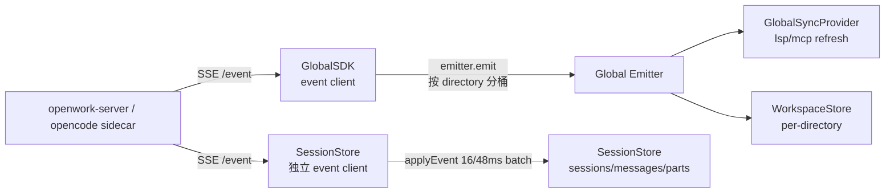
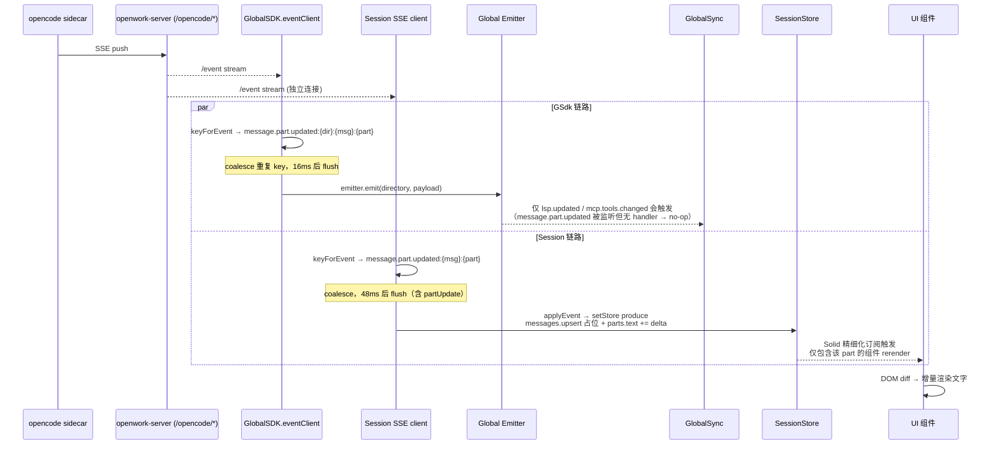

# 05h · OpenWork 前端状态架构

> **⚠️ v0.12.0 大幅更新**：本文档原来描述 SolidJS 时代的 `AppEntry` 4 层 Provider 架构。v0.12.0 迁移至 React 19 后，代码结构**已完全改变**。**旧架构描述（本文就体）仅作历史参考**，不能用于指导当前开发。
>
> **新架构要点**：
> - 入口文件：`apps/app/src/index.react.tsx`
> - Provider 链：`QueryClientProvider → PlatformProvider → AppProviders(BootStateProvider→ServerProvider→DenAuthProvider→LocalProvider...) → Router → AppRoot`
> - 全局状态：Zustand `useOpenworkStore`（[`kernel/store.ts`](file:///Users/umasuo_m3pro/Desktop/startup/xingjing/harnesswork/apps/app/src/react-app/kernel/store.ts)）
> - 服务端状态：React Query（[`infra/query-client.ts`](file:///Users/umasuo_m3pro/Desktop/startup/xingjing/harnesswork/apps/app/src/react-app/infra)）
> - SDK 客户端：`GlobalSDKProvider`（[`kernel/global-sdk-provider.tsx`](file:///Users/umasuo_m3pro/Desktop/startup/xingjing/harnesswork/apps/app/src/react-app/kernel/global-sdk-provider.tsx)）
> - 全局同步：`GlobalSyncProvider`（[`kernel/global-sync-provider.tsx`](file:///Users/umasuo_m3pro/Desktop/startup/xingjing/harnesswork/apps/app/src/react-app/kernel/global-sync-provider.tsx)）
>
> 新的完整 Provider 链和状态架构详见：[`audit-react-migration.md §5`](./audit-react-migration.md)、[`05-openwork-platform-overview.md §2.4`](./05-openwork-platform-overview.md)、[`06-openwork-bridge-contract.md §2`](./06-openwork-bridge-contract.md)。

---

> 以下就体内容为 **SolidJS v0.11.x 时代架构历史档案**，中的代码路径均已不存在。

---

本篇以代码为源，深入刻画 OpenWork 独立版前端（`harnesswork/apps/app`）独有的四层 Provider 架构、顶层 store 结构与 SSE 事件驱动模型。内容聚焦“状态如何在 Provider 链里传播与反应式刷新”，不涉及跨会话持久化的字节布局（参见 [./05f-openwork-settings-persistence.md](./05f-openwork-settings-persistence.md)），也不涉及多进程运行时（参见 [./05g-openwork-process-runtime.md](./05g-openwork-process-runtime.md)）。

---

## 1. 四层 Provider 嵌套与职责总览

`AppEntry` 组件按真实代码顺序固定 Provider 嵌套方向（外→内）：`ServerProvider → GlobalSDKProvider → GlobalSyncProvider → LocalProvider`，最终包裹 `<App />`。嵌套顺序决定了依赖方向：内层可以 `useXxx()` 访问外层所有能力，但外层无法看见内层。

参见 [`AppEntry`](file:///Users/umasuo_m3pro/Desktop/startup/xingjing/harnesswork/apps/app/src/app/entry.tsx#L9-L52)（代码锚点）。

```
┌─ ServerProvider(defaultUrl) ────────────────────────────────────┐
│  职责：多服务器列表 + 活动 URL + 健康探测（10s 轮询）              │
│  注入：{ url, name, list, healthy, setActive, add, remove }      │
│                                                                 │
│  ┌─ GlobalSDKProvider ────────────────────────────────────────┐ │
│  │  职责：OpenCode 客户端工厂 + 全局事件总线 + SSE 去重批处理   │ │
│  │  注入：{ url(), client(), event }                          │ │
│  │                                                            │ │
│  │  ┌─ GlobalSyncProvider ────────────────────────────────┐   │ │
│  │  │  职责：全局 store（config/providers/mcp/lsp/project │   │ │
│  │  │        /projectMeta/vcs）+ per-directory 子 store   │   │ │
│  │  │  注入：{ data, set, child(dir), refresh,            │   │ │
│  │  │         refreshDirectory(dir) }                     │   │ │
│  │  │                                                     │   │ │
│  │  │  ┌─ LocalProvider ───────────────────────────────┐  │   │ │
│  │  │  │  职责：本地 UI 状态 + 偏好（持久化）            │  │   │ │
│  │  │  │  注入：{ ui, setUi, prefs, setPrefs, ready }   │  │   │ │
│  │  │  │                                                │  │   │ │
│  │  │  │     <App />（组件内部再构造 SessionStore）      │  │   │ │
│  │  │  └────────────────────────────────────────────────┘  │   │ │
│  │  └─────────────────────────────────────────────────────┘   │ │
│  └────────────────────────────────────────────────────────────┘ │
└─────────────────────────────────────────────────────────────────┘
```

依赖方向（严格单向）：

```mermaid
graph TB
  Server[ServerProvider] --> GlobalSDK[GlobalSDKProvider]
  GlobalSDK --> GlobalSync[GlobalSyncProvider]
  GlobalSync --> Local[LocalProvider]
  Local --> App[App.tsx]
  App --> SessionStore["createSessionStore<br/>非 Provider 的工厂函数"]
  App --> WorkspaceStore[createWorkspaceStore]
  App --> ModelConfig[createModelConfigStore]
  Server -.独立. Platform["PlatformProvider<br/>由宿主注入，位置依赖宿主入口"]
  GlobalSDK -.usePlatform(). Platform
```

> `PlatformProvider` 不在 `AppEntry` 内，由宿主（桌面 `apps/desktop/src/main.tsx` 或 Web `apps/share`）在更外层注入，值结构见 [`Platform`](file:///Users/umasuo_m3pro/Desktop/startup/xingjing/harnesswork/apps/app/src/app/context/platform.tsx#L15-L28)。`GlobalSDKProvider` 通过 `usePlatform()` 拿 `fetch`（桌面端必须用 `@tauri-apps/plugin-http` 注入的 `tauriFetch` 以避免 CORS/ipc 协议问题）。

---

## 2. ServerProvider — 多服务器与健康探测

### 2.1 注入面（Context Value）

按 [`ServerContextValue`](file:///Users/umasuo_m3pro/Desktop/startup/xingjing/harnesswork/apps/app/src/app/context/server.tsx#L20-L28) 真实字段列：

| 字段 | 类型 | 语义 |
|------|------|------|
| `url` | getter → string | 当前活动 server URL（已 normalize，去尾斜杠） |
| `name` | getter → string | 去掉协议与尾斜杠的显示名 |
| `list` | getter → string[] | 已添加的 server 列表 |
| `healthy` | `() => boolean \| undefined` | `undefined` 表示未知 / 探测中 |
| `setActive` | `(url: string) => void` | 切换活动 server（仅对已持 normalized URL 生效） |
| `add` | `(url: string) => void` | 加入列表并激活 |
| `remove` | `(url: string) => void` | 从列表移除，若移的是当前激活则落回列表首项 |

### 2.2 内部信号

按 [`ServerProvider`](file:///Users/umasuo_m3pro/Desktop/startup/xingjing/harnesswork/apps/app/src/app/context/server.tsx#L32-L217)：

- `list: Signal<string[]>` — 持久化键 `openwork.server.list`
- `active: Signal<string>` — 持久化键 `openwork.server.active`
- `healthy: Signal<boolean | undefined>` — 不持久化
- `ready: Signal<boolean>` — 防止 bootstrap effect 与持久化 effect 竞态
- `activeUrl: Memo<string>` — 对 `active` 的 memo 包装（用于下游 `createEffect` 的稳定依赖）

### 2.3 三个 `createEffect`

1. **Bootstrap**（[L57-L100](file:///Users/umasuo_m3pro/Desktop/startup/xingjing/harnesswork/apps/app/src/app/context/server.tsx#L57-L100)）：
   - 仅执行一次（`if (ready()) return`）
   - Tauri 桌面端：强制 `list=[]`、`active=""`、`ready=true`。注释明确说明原因——桌面端 engine 端口由 `engine_info()` 动态分配，任何持久化的 localhost（尤其旧版本写入的 4096）都是过期垃圾，留在列表会触发每 10 秒一次 `/global/health` 失败叠加 WKWebView 的 `ipc://` 负载压力。
   - Hosted web（`isWebDeployment() && (PROD || VITE_OPENWORK_URL)`）：强制走 `fallback`（即 `${openworkUrl}/opencode`），不复用 localhost 持久化。
   - 其他（Vite dev）：合并 `storedList + fallback`，优先用持久化的 `active`。
2. **持久化**（[L102-L112](file:///Users/umasuo_m3pro/Desktop/startup/xingjing/harnesswork/apps/app/src/app/context/server.tsx#L102-L112)）：`ready()` 后每次 `list / active` 变动即写回 localStorage。
3. **健康探测**（[L140-L169](file:///Users/umasuo_m3pro/Desktop/startup/xingjing/harnesswork/apps/app/src/app/context/server.tsx#L140-L169)）：依赖 `activeUrl()`，每 10s 调 `client.global.health()`，`busy` 锁防并发。切换 URL 时 `setHealthy(undefined)` 先清状态再首帧探测，`onCleanup` 关 interval 并 `activeRun=false` 丢弃 in-flight 结果。

> **桌面端唯一例外**：桌面 `<App />` 的 `workspaceStore.engine()` 直接持有 engine 端口信息，ServerProvider 对桌面端等价于 no-op。下游 `GlobalSDKProvider` 看到的 `server.url === ""` 时会早退，不发 SSE 订阅。

---

## 3. GlobalSDKProvider — OpenCode 客户端 + 全局事件总线

### 3.1 注入面

按 [`GlobalSDKContextValue`](file:///Users/umasuo_m3pro/Desktop/startup/xingjing/harnesswork/apps/app/src/app/context/global-sdk.tsx#L16-L20)：

| 字段 | 类型 | 语义 |
|------|------|------|
| `url` | `() => string` | 复刻 `server.url` 的只读信号 |
| `client` | `() => ReturnType<typeof createOpencodeClient>` | 请求用 client（总是跟着 baseUrl 与 Authorization 同步） |
| `event` | `createGlobalEmitter<{ [key: string]: Event }>` | 按 `directory` 分发的事件总线（`key="global"` 为全局桶） |

### 3.2 两个 client 实例

代码中并行维护两个 OpenCode client，职责分离（参见 [L28-L73](file:///Users/umasuo_m3pro/Desktop/startup/xingjing/harnesswork/apps/app/src/app/context/global-sdk.tsx#L28-L73)）：

| 实例 | 构造位置 | `throwOnError` | `signal` | 用途 |
|------|----------|----------------|----------|------|
| 请求 client | `createSignal(createOpencodeClient({...}))` + effect 内 `setClient(...)` | `true` | 默认（各请求独立 AbortSignal） | 模块代码从 `client()` 取，做常规请求（config/provider/mcp/lsp/session 等） |
| 事件 client | 仅在 effect 局部构造（`eventClient = createOpencodeClient({..., signal: abort.signal})`） | 隐式 false | 共享同一 `AbortController` | 只调 `event.subscribe()` 建立 SSE 长连接 |

两者用完全相同的 `baseUrl / headers / fetch`，但生命周期不同：`baseUrl` 或 `healthy` 变化时 effect 销毁→ `abort.abort()` 断开旧 SSE，并基于新 URL 重新订阅。

### 3.3 Token 注入规则

`headers` 只在满足两个条件时附带 `Authorization: Bearer <token>`（[L41-L49](file:///Users/umasuo_m3pro/Desktop/startup/xingjing/harnesswork/apps/app/src/app/context/global-sdk.tsx#L41-L49)）：

1. localStorage `openwork.server.token` 非空字符串
2. `baseUrl` 字面包含 `/opencode`（说明走的是 openwork-server 反向代理路径）

否则 `headers` 为 `undefined`，client 走裸 URL。桌面端 direct 连 engine 时也走裸 URL（无 bearer token）。

### 3.4 SSE 订阅与 16ms coalescing

effect 内部消费 `eventClient.event.subscribe(...)` 返回的 async iterator（[L121-L149](file:///Users/umasuo_m3pro/Desktop/startup/xingjing/harnesswork/apps/app/src/app/context/global-sdk.tsx#L121-L149)）。核心数据结构：

```
queue: Array<Queued | undefined>   // Queued = { directory, payload }
coalesced: Map<string, number>      // key → queue 下标
timer: setTimeout | undefined
last: number                        // 上次 flush 时间戳
```

**事件去重 key**（[L82-L91](file:///Users/umasuo_m3pro/Desktop/startup/xingjing/harnesswork/apps/app/src/app/context/global-sdk.tsx#L82-L91)）：

| Event type | key 构造 |
|------------|----------|
| `session.status` | `session.status:{directory}:{sessionID}` |
| `lsp.updated` | `lsp.updated:{directory}` |
| `todo.updated` | `todo.updated:{directory}:{sessionID}` |
| `mcp.tools.changed` | `mcp.tools.changed:{directory}:{server}` |
| `message.part.updated` | `message.part.updated:{directory}:{messageID}:{partID}` |
| 其他 | 返回 undefined（不参与去重，每条都入队） |

去重方式：新事件命中已有 key 时，把旧下标位置置 `undefined`，新事件 `push` 到队尾并更新 `coalesced.set(key, queue.length)`。`flush` 时 `batch()` 内循环跳过 `undefined`，实现"只 emit 最后一次"。

**批处理节流**（[L111-L119](file:///Users/umasuo_m3pro/Desktop/startup/xingjing/harnesswork/apps/app/src/app/context/global-sdk.tsx#L111-L119)）：

```
schedule():
  if timer: return
  elapsed = Date.now() - last
  timer = setTimeout(flush, max(0, 16 - elapsed))
```

含义：两次 `flush` 间隔至少 16ms（约 60fps），队列不会被单条 event 高频触发 rerender。

**协作让权**（[L143-L146](file:///Users/umasuo_m3pro/Desktop/startup/xingjing/harnesswork/apps/app/src/app/context/global-sdk.tsx#L143-L146)）：每累计 8ms 同步处理后，`await setTimeout(0)` 一次，把控制权还给浏览器/WKWebView 事件循环，避免长流导致主线程饥饿。

### 3.5 消费侧

`emitter` 的消费模式为 `event.listen(payload => { if (payload.name === directory) ... })`。目前仅两个消费者：

- `GlobalSyncProvider` 对每个 directory 子 store 监听 `lsp.updated` / `mcp.tools.changed`，触发 `refreshLsp` / `refreshMcp`
- `GlobalSyncProvider` 对 global 桶（key `""`）做同样处理

Session / message / part / permission / question / todo 事件**不走 emitter**，而是由 `createSessionStore` 自己另起一条 SSE（见 §6）。这是本架构的关键二分：**全局派生数据用 emitter 粗粒度拉取，会话细粒度 diff 走独立订阅**。

---

## 4. GlobalSyncProvider — 全局 store 与子 workspace store

### 4.1 顶层 store 结构

按 [`GlobalState`](file:///Users/umasuo_m3pro/Desktop/startup/xingjing/harnesswork/apps/app/src/app/context/global-sync.tsx#L44-L56)：

| 字段 | 类型 | 初值 | 刷新入口 |
|------|------|------|----------|
| `ready` | boolean | false | `refresh()` 全部成功后 `true` |
| `error` | string? | undefined | 任一 refresh rejected 时写入 |
| `serverVersion` | string? | undefined | 从 `global.health().version` 读，版本变化触发 mcp/lsp/project/projectMeta/vcs 全清 |
| `config` | `Config` | `{}` | `refreshConfig()` |
| `provider` | `ProviderListResponse` | `{ all, connected, default }` | `refreshProviders()`，失败回退到 `config.providers` |
| `providerAuth` | `ProviderAuthResponse` | `{}` | `refreshProviderAuth()` |
| `mcp` | `Record<string, McpStatusMap>` | `{}` | `refreshMcp(directory?)`，按 `keyFor(dir||"")` 写入 |
| `lsp` | `Record<string, LspStatus[]>` | `{}` | `refreshLsp(directory?)` |
| `project` | `Project[]` | `[]` | `refreshProjects()` |
| `projectMeta` | `Record<string, ProjectMeta>` | `{}` | `refreshProjects()` 中同步写入（key 为 worktree） |
| `vcs` | `Record<string, VcsInfo \| null>` | `{}` | `refreshVcs(directory)`，失败写 `null` |

`keyFor(directory)` 规则：空串归一化为 `"global"`，用作顶层 key 与 `emitter` 桶 key。

### 4.2 子 workspace store

`child(directory): WorkspaceStore` 按需创建（[L241-L262](file:///Users/umasuo_m3pro/Desktop/startup/xingjing/harnesswork/apps/app/src/app/context/global-sync.tsx#L241-L262)）：

- 懒创建：`children: Map<string, WorkspaceStore>` 已有则复用
- 结构 [`WorkspaceState`](file:///Users/umasuo_m3pro/Desktop/startup/xingjing/harnesswork/apps/app/src/app/context/global-sync.tsx#L28-L35)：`{ status, session, session_status, message, part, todo }`（注意字段用 snake_case，与 session.ts 的 camelCase 不是同一份数据）
- 首次创建：立即 `void refreshDirectory(directory)` 拉 `mcp / lsp / vcs`
- 订阅：对该 directory 桶监听 `lsp.updated` / `mcp.tools.changed`，触发对应 refresh

⚠ 这份 WorkspaceState 与 `createSessionStore` 的顶层 store 是**两份独立数据**——前者由 GlobalSync 创建、subscriptions 驱动，主要存 lsp/mcp 静态状态；后者由 `App` 组件在 `<LocalProvider>` 之内构造，存 sessions/messages/parts 流式数据。两者都被 UI 消费但从不互相同步。

实际使用：`SyncProvider`（[sync.tsx](file:///Users/umasuo_m3pro/Desktop/startup/xingjing/harnesswork/apps/app/src/app/context/sync.tsx#L14-L25)）对某个 `directory` 取 `globalSync.child(directory)` 暴露给子树，`useSync()` 消费。

### 4.3 `refresh()` 启动序列

按 [L199-L239](file:///Users/umasuo_m3pro/Desktop/startup/xingjing/harnesswork/apps/app/src/app/context/global-sync.tsx#L199-L239)：

```
setReady(false) / clear error
health = unwrap(global.health())
if !health.healthy: set error, return
if serverVersion && health.version !== serverVersion:
  clear mcp/lsp/project/projectMeta/vcs
set serverVersion = health.version

Promise.allSettled([
  refreshConfig(), refreshProviders(), refreshProviderAuth(),
  refreshMcp(), refreshLsp(), refreshProjects(),
])  # 6 路并发
for rejected: setError(reason)
setReady(true)
```

`refreshProjects()` 内部再对每个 `project.worktree` 并发 `refreshVcs`（`Promise.allSettled` 包裹）。

### 4.4 Tauri 桌面端早退

刷新触发 effect（[L272-L283](file:///Users/umasuo_m3pro/Desktop/startup/xingjing/harnesswork/apps/app/src/app/context/global-sync.tsx#L272-L283)）一开始就 `if (isTauriRuntime()) return`。注释点明：桌面端 engine 直连（baseUrl 由 `app.tsx` 的 `engine_info` 动态发现），不走 OpenWork 多服务器链路；若不早退，某 tick 下 `server.url` 因 HMR / localStorage 脏数据瞬时非空，`refresh()` 会一次性发出 1 条 `global.health` + 6 条 `Promise.allSettled` 并发，共 7 个 fetch 压垮 macOS WKWebView 的 `ipc://` 通道（历史日志中 `IPC custom protocol failed, Tauri will now use the postMessage interface instead` 恰好 ×7）。

所以桌面端的全局 store 永远保持初值，UI 走另一条路径：`workspaceStore.engine()` + `createSessionStore` 直连本地 engine。

---

## 5. LocalProvider — 本地 UI 状态与偏好

### 5.1 两个持久化 store

按 [`LocalProvider`](file:///Users/umasuo_m3pro/Desktop/startup/xingjing/harnesswork/apps/app/src/app/context/local.tsx#L29-L81)：

| Store | Persist key | 迁移 key | 字段 |
|-------|-------------|----------|------|
| `ui` | `local.ui` | `openwork.ui`（旧 → 新合并，见 05f §持久化迁移） | `view: View`, `tab: SettingsTab` |
| `prefs` | `local.preferences` | `openwork.preferences` | `showThinking: boolean`, `modelVariant: string \| null`, `defaultModel: ModelRef \| null` |

`persisted(Persist.global(key, legacyKeys), createStore(...))` 返回 `[store, setStore, initialState, ready]`；`ready()` 用于防在 IDB 加载完成前覆盖。`LocalProvider` 自身暴露 `ready = () => uiReady() && prefsReady()`。

### 5.2 `THINKING_PREF_KEY` 迁移 effect

[L49-L70](file:///Users/umasuo_m3pro/Desktop/startup/xingjing/harnesswork/apps/app/src/app/context/local.tsx#L49-L70) 在 `prefsReady()` 后把旧 `THINKING_PREF_KEY`（legacy localStorage 键）值迁进 `prefs.showThinking`，然后删除旧键。这是一次性迁移而非双写。

### 5.3 消费模式

- UI tree 通过 `useLocal()` 拿到 `ui.view / ui.tab / prefs.showThinking / prefs.modelVariant / prefs.defaultModel`
- `setUi("view", "session")` / `setPrefs("showThinking", false)` 即可触发 UI + 持久化双写
- `ready()` 未就绪前上层 `<App />` 的 `createResource` 或 `createEffect` 可延后启动

---

## 6. SessionStore — 会话/消息/权限的实时聚合

### 6.1 不是 Provider，是工厂函数

`createSessionStore(options)`（[session.ts](file:///Users/umasuo_m3pro/Desktop/startup/xingjing/harnesswork/apps/app/src/app/context/session.ts#L157-L2082)）由 `<App />` 组件顶层在 `LocalProvider` 内部调用，产物挂到 JS 局部变量 `sessionStore`（[app.tsx L534-L552](file:///Users/umasuo_m3pro/Desktop/startup/xingjing/harnesswork/apps/app/src/app/app.tsx#L534-L552)）。因此"第五层 Provider"在语义上存在，但代码形式上是一个 store 工厂，而非 `<Provider>` 组件。

### 6.2 顶层 store 结构

按 [`StoreState`](file:///Users/umasuo_m3pro/Desktop/startup/xingjing/harnesswork/apps/app/src/app/context/session.ts#L51-L63)：

| 字段 | 类型 | 语义 |
|------|------|------|
| `sessions` | `Session[]` | 当前 workspace 作用域内的会话列表（按 `time.updated` 降序） |
| `sessionInfoById` | `Record<string, Session>` | 按 id 索引 |
| `sessionStatus` | `Record<string, string>` | sessionID → `"idle" \| "pending" \| ...` |
| `sessionErrorTurns` | `Record<string, SessionErrorTurn[]>` | 按 session 累计的错误回合 |
| `messages` | `Record<string, MessageInfo[]>` | sessionID → 消息数组（含占位消息） |
| `parts` | `Record<string, Part[]>` | messageID → parts 数组 |
| `todos` | `Record<string, TodoItem[]>` | sessionID → todo 列表 |
| `pendingPermissions` | `PendingPermission[]` | 跨会话的权限排队 |
| `pendingQuestions` | `PendingQuestion[]` | 跨会话的 ask 排队 |
| `events` | `OpencodeEvent[]` | 开发者调试面板用的事件 ring buffer |
| `sessionCompaction` | `Record<string, SessionCompactionState>` | 压缩进度 |

辅助信号（散布于工厂内）：`permissionReplyBusy`, `messageLimitBySession`, `messageCompleteBySession`, `messageLoadBusyBySession`, `loadedScopeRoot`, `blueprintSeedMessagesBySessionId`。

### 6.3 第二条 SSE：与 GlobalSDK emitter 并存的独立订阅

核心 effect 在 [L1825-L2026](file:///Users/umasuo_m3pro/Desktop/startup/xingjing/harnesswork/apps/app/src/app/context/session.ts#L1825-L2026)：

```
createEffect(() => {
  const c = options.client()   // 复用 GlobalSDK.client() 或宿主传入的 client 工厂
  if (!c) return
  …setup queue / coalesced / timer…

  connectSse(controller):
    sub = await c.event.subscribe(undefined, { signal })
    for await raw of sub.stream:
      event = normalizeEvent(raw); if !event continue
      key = keyForEvent(event)      // 与 GlobalSDK 的 key 规则相同但自用
      if key && coalesced.has(key):
        queue[oldIndex] = undefined; coalescedReplaced++
      coalesced.set(key, queue.length)
      queue.push(event); schedule()
      每 8ms 让权一次
    stream-ended → scheduleReconnect
  catch → scheduleReconnect (1s, 2s, 4s, 8s, 16s, 30s cap 指数退避)

  onCleanup: cancel; abort; clear timers; flush
})
```

**为什么要第二条 SSE？** GlobalSDK 的 emitter 按 `directory` 分桶仅做"派生数据通知"，没有把 event payload 原样回放到 session store；session store 需要 *每一条* `message.part.updated` / `message.part.delta` / `session.status` 等来维护 `messages / parts / sessionStatus`，并且需要自己的 reconnect 策略与 coalesce 节奏。

**批处理节奏的关键区别**（[L1915-L1920](file:///Users/umasuo_m3pro/Desktop/startup/xingjing/harnesswork/apps/app/src/app/context/session.ts#L1915-L1920)）：

```
const interval = queueHasPartUpdates ? 48 : 16
timer = setTimeout(flush, max(0, interval - elapsed))
```

含义：队列里若有 `message.part.updated / .delta`，放宽到 48ms（约 20fps）以合并高频字符流；否则与 GlobalSDK 一致 16ms。

**可观测性**（[L1897-L1912](file:///Users/umasuo_m3pro/Desktop/startup/xingjing/harnesswork/apps/app/src/app/context/session.ts#L1897-L1912)）：`developerMode()` 开启时，每次 flush 满足以下任一阈值即写 perf log：
- `elapsedMs >= 10`
- `queueWaitMs >= 40`
- `peakQueueDepth >= 25`
- `applied >= 30`
- `dropped >= 12`

### 6.4 事件 → store 的写入规则（摘核心）

按 `applyEvent` 分支（session.ts §message.* / session.* 段）：

| Event | 写入字段 | 方式 |
|-------|----------|------|
| `session.updated` / `session.created` | `sessions`, `sessionInfoById` | `upsertSession` + `rememberSession` |
| `session.deleted` | `sessions`, `sessionInfoById`, `sessionErrorTurns`, `sessionCompaction` | `produce` 多字段删除 |
| `session.status` | `sessionStatus[id]` | `normalizeSessionStatus` 归一 |
| `session.idle` | `sessionStatus[id]="idle"` + `session.get` 回源 | `upsertSession` |
| `session.error` | `sessionErrorTurns` 或顶层 `setError` | 过滤 `MessageAbortedError` |
| `message.updated` | `messages[sessionID]`, `sessionModelState` | `upsertMessageInfo` + 同步 model 状态 |
| `message.removed` | `messages[sessionID]`, `parts[messageID]=[]` | `removeMessageInfo` |
| `message.part.updated` | `messages[sessionID]`（补占位）, `parts[messageID]` | `produce`：文本 delta 直接 `text += delta`；否则 `upsertPartInfo`；同时跑 reload/invalid-tool 检测 |
| `message.part.delta` | `parts[messageID]` | `appendPartDelta(field, delta)` |
| `message.part.removed` | `parts[messageID]` | `removePartInfo` |
| `todo.updated` | `todos[sessionID]` | 直接覆盖 |
| `session.compacted` | `sessionCompaction` | `finishSessionCompaction` |
| `permission.asked` / `permission.replied` | — | 异步调 `refreshPendingPermissions()` |
| `question.asked` / `.replied` / `.rejected` | — | 异步调 `refreshPendingQuestions()` |
| `opencode.hotreload.applied` | — | 回调 `options.onHotReloadApplied?.()` |

> 注意：除 `message.part.updated` 用 `produce` 批量修改 draft（原子多字段），其它写入用 setStore 的路径签名 `setStore("messages", sessionID, updater)` — 依赖 SolidJS store 的精细化订阅只重绘相关组件。

### 6.5 派生 memo 与对外 API

工厂最终 `return { sessions, selectedSession, selectedSessionStatus, visibleMessages, messages, messagesBySessionId, todos, pendingPermissions, ... }`（完整清单见 [L2028-L2081](file:///Users/umasuo_m3pro/Desktop/startup/xingjing/harnesswork/apps/app/src/app/context/session.ts#L2028-L2081)）。其中 `selectedSessionCompactionState`, `selectedSessionErrorTurns` 等是 `createMemo` 包装，依赖 `options.selectedSessionId()`。

---

## 7. 两条 SSE 链路的并存与职责划分



| 维度 | GlobalSDK SSE | Session SSE |
|------|---------------|-------------|
| 订阅触发 | `baseUrl && healthy()` 变化 | `options.client()` 变化（App 级别） |
| 事件处理方式 | `emitter.emit(directory, payload)` | 直接写 store（按 event.type 分支） |
| 消费者 | GlobalSync refresh/child subscribe | UI 组件（session 列表、chat、permission 弹窗） |
| coalesce key | 5 种，按 directory | 3 种（`session.status / session.idle / message.part.updated / todo.updated`） |
| 节流间隔 | 固定 16ms | 16ms，或含 part-updated 时 48ms |
| 断线重连 | 无内置重连（effect 不变时不重跑） | 指数退避 1s…30s 自动 reconnect |
| 生命周期 | server.healthy 变 false 即停 | App 卸载或 client 变化才停 |
| 桌面端可用性 | `server.url === ""` 时早退不订阅 | 通过 `workspaceStore.engine()` 动态注入 client 仍可订阅 |

---

## 8. 响应式订阅关系全景

```mermaid
graph TB
  subgraph "外部来源"
    LS[(localStorage)]
    IDB[(IndexedDB / Persist)]
    OW[("openwork-server<br/>SSE stream")]
    Engine[(workspaceStore.engine())]
    Platform[(Platform.fetch)]
  end

  LS --> ServerList[server.list/active]
  LS --> ServerToken[openwork.server.token]

  ServerList --> ActiveUrl[active URL Memo]
  ActiveUrl --> Health["healthy signal<br/>10s interval"]
  ActiveUrl --> GSdkClient[GSDK.client()]
  ServerToken --> GSdkClient
  Health --> GSdkSse[GSDK SSE]
  GSdkClient --> GSdkSse

  GSdkSse --> Emitter["event emitter<br/>16ms coalesce"]
  Emitter --> GSync[GlobalSync refresh*]
  Emitter --> ChildStores[WorkspaceStore children]

  GSync --> Providers[providers/config/mcp/lsp/project/vcs store]

  Platform --> GSdkClient
  Engine --> SessClient[App.client()]
  SessClient --> SessSse["Session SSE<br/>16/48ms"]
  OW --> GSdkSse
  OW --> SessSse
  SessSse --> SessStore["sessions/messages/parts/<br/>pendingPermissions/todos/..."]

  IDB --> UiStore[Local.ui store]
  IDB --> PrefsStore[Local.prefs store]

  Providers --> UI[UI 组件]
  SessStore --> UI
  UiStore --> UI
  PrefsStore --> UI
```

---

## 9. 生命周期：启动 / workspace 切换 / 退出

### 9.1 启动序列

```
1. 宿主（desktop main.tsx / web share）mount <PlatformProvider value={platform}>
2. <AppEntry>
   ├─ defaultUrl 决算：
   │    isTauriRuntime() → ""     (走 no-op)
   │    VITE_OPENWORK_URL     → `${url}/opencode`
   │    isWebDeployment()&PROD → `${origin}/opencode`
   │    否则              → VITE_OPENCODE_URL || "http://127.0.0.1:4096"
   ├─ <ServerProvider defaultUrl={...}>
   │    createEffect bootstrap：
   │      桌面端: list=[], active="", ready=true (早退)
   │      forceProxy: list=[fallback], active=fallback
   │      其它: 合并 localStorage
   │    createEffect 持久化：每次 list/active 变动写回
   │    createEffect 健康: 10s 轮询
   ├─ <GlobalSDKProvider>
   │    createSignal(client) 初值基于 server.url
   │    createEffect 订阅 SSE（仅当 url && healthy 时）
   ├─ <GlobalSyncProvider>
   │    createStore(globalState)
   │    createEffect → refresh()（桌面端早退）
   │    全局 subscriptions 挂一次
   └─ <LocalProvider>
        persisted(ui), persisted(prefs)  // 异步等 IDB
        THINKING_PREF_KEY 迁移
        → <App>
            createWorkspaceStore() → engine() 来源
            createSessionStore(options)
            createModelConfigStore(options)
            createOpenworkServerStore(...)  // 仅桌面端
            组件首帧渲染（store 初值 + ready 未到 → 骨架屏）
```

### 9.2 Workspace 切换

触发源在 `workspaceStore.setSelectedWorkspaceId(id)`。传播链：

1. `selectedWorkspaceRoot()` / `selectedWorkspaceDisplay()` / `runtimeWorkspaceId()` 三个 signal 变化
2. `modelConfig`, `sessionStore`, `openworkServerStore` 通过 getter 读取（`() => workspaceStore?.selectedWorkspaceRoot?.() ?? ""`）自动失效
3. `sessionStore.loadSessions()`（由 App 的 effect 手动调，代码里搜 `loadSessions()`）重新按 `toSessionTransportDirectory` 过滤并 `setStore("sessions", ...)`
4. 旧 session 的 `messages / parts` 按需 unload（`messageLimitBySession` 随新 sessionId 变化）

⚠ SSE 两条链都**不因 workspace 切换重建**——两者订阅的是全量 event stream，workspace 过滤在 store 写入层完成（event payload 里的 `directory / sessionID` 与当前选中作比较）。

### 9.3 退出清理

- `ServerProvider` 的健康 effect 注册 `onCleanup(() => { activeRun=false; clearInterval })`
- `GlobalSDKProvider` 的 SSE effect 注册 `onCleanup(() => { abort.abort(); stop() })`
- `SessionStore` 的 SSE effect 注册 `onCleanup(() => { cancelled=true; controller.abort(); clearTimeout(reconnectTimer); flush() })`
- `GlobalSyncProvider` 的 `subscriptions: Map` 中每个 unsubscribe 由 emitter 的 `listen` 返回；目前 Provider 内部**未**在 Solid 销毁时批量 unsubscribe（依赖 App 级别一次性 mount 的模型）

> 这是一次性挂载的设计假设：App 不会在同一个页面多次 mount/unmount Provider 链。桌面端由 Tauri window 生命周期保证，Web 由 SPA 路由保证。

---

## 10. 端到端数据流时序（一次 SSE 事件）

以 `message.part.updated`（模型流式输出的 text delta）为例：



关键点：**GSdk 不写 session store**，这是被设计上的冗余订阅以支持未来 emit→session 的 bus 拓扑；当前 session UI 完全依赖第二条链。

---

## 11. SolidJS 响应性的真实使用模式

### 11.1 `createSignal` — 控制流与简单原子态

用于需要 getter/setter 语义、非集合型的状态：

- `server.tsx`: `list, active, healthy, ready`
- `global-sdk.tsx`: `client, url`
- `session.ts`: `permissionReplyBusy, messageLimitBySession, messageCompleteBySession, blueprintSeedMessagesBySessionId, loadedScopeRoot`
- `workspace.ts`: `engine, engineAuth, projectDir, sandboxDoctorResult, ...` 共 15+ 信号

### 11.2 `createMemo` — 派生与稳定依赖

- `server.tsx` L114: `activeUrl = createMemo(() => active())` — 传给下游 effect 做稳定依赖
- `session.ts`: `selectedSessionErrorTurns`, `selectedSessionCompactionState`, 等 `selected*` 变体

### 11.3 `createStore` + `produce` — 集合型结构化态

仅 4 个 createStore 存在：
- `GlobalState`（GlobalSyncProvider）
- `WorkspaceState`（每个 child）
- `StoreState`（SessionStore）
- `LocalUIState`, `LocalPreferences`（LocalProvider，持久化包装）

`produce` 用于"一次 setStore 改多个路径"的原子更新（session.ts 共 3 处，均涉及 `messages` + `parts` 协同写）。

### 11.4 `reconcile` — 差分替换

`session.ts` 顶部 `import { createStore, produce, reconcile } from "solid-js/store"`，用于某些需要整体替换但保留引用身份的场景（如重新加载后的 sessions 列表回填）。

### 11.5 `createResource` — 未使用

四层 Context 层内**未**使用 `createResource`；所有异步拉取均自行管理 loading/error，以便与 Persist ready / server healthy 信号组合。`createModelConfigStore` 与宿主 `workspace.ts` 内部可能有独立用法，不在本层边界内。

### 11.6 `createGlobalEmitter`（@solid-primitives/event-bus）

仅 `GlobalSDKProvider` 使用一次，作为"跨 Provider 边界的事件总线"；消费者通过 `event.listen(payload => ...)` 订阅，按 `payload.name === key` 过滤。

---

## 12. 与相邻文档的边界划分

| 主题 | 由谁负责 |
|------|---------|
| 四层 Provider 嵌套、signal/store/effect 关系、SSE coalesce 算法 | **本篇 05h** |
| Persist 引擎字节布局、迁移 Schema、IndexedDB 落盘 | [./05f-openwork-settings-persistence.md](./05f-openwork-settings-persistence.md) |
| Sidecar 进程、端口分配、Manager spawn | [./05g-openwork-process-runtime.md](./05g-openwork-process-runtime.md) |
| 会话/消息 API、SSE 事件语义 | [./05a-openwork-session-message.md](./05a-openwork-session-message.md) |
| MCP/Skill/Agent 状态结构来源 | [./05b-openwork-skill-agent-mcp.md](./05b-openwork-skill-agent-mcp.md) |
| Workspace 概念与生命周期 | [./05c-openwork-workspace-fileops.md](./05c-openwork-workspace-fileops.md) |
| 模型/Provider 解析、modelConfig 的内部状态 | [./05d-openwork-model-provider.md](./05d-openwork-model-provider.md) |
| pendingPermissions / pendingQuestions 的业务语义 | [./05e-openwork-permission-question.md](./05e-openwork-permission-question.md) |
| OpenWork 暴露给星静的能力接缝 | [./06-openwork-bridge-contract.md](./06-openwork-bridge-contract.md) |
