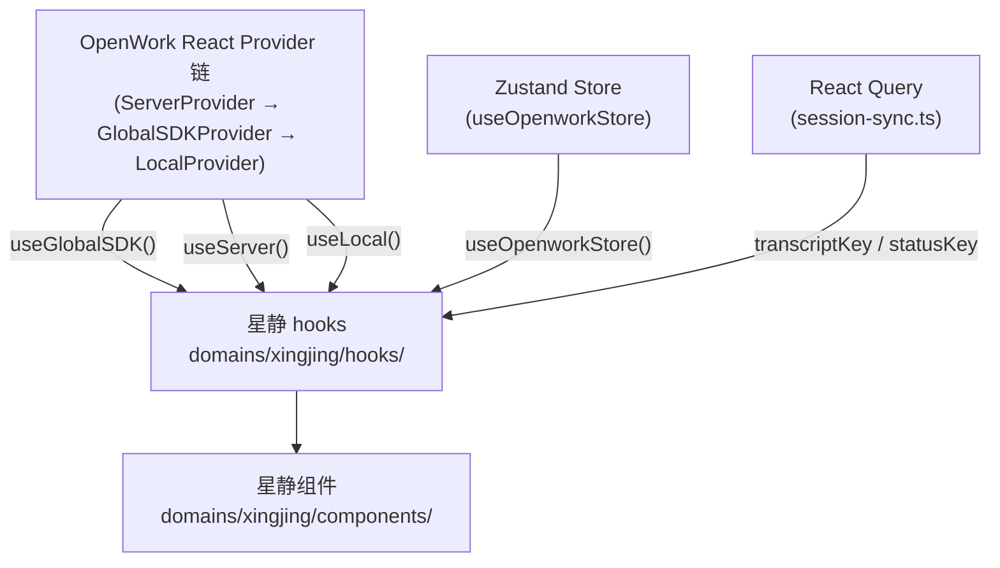
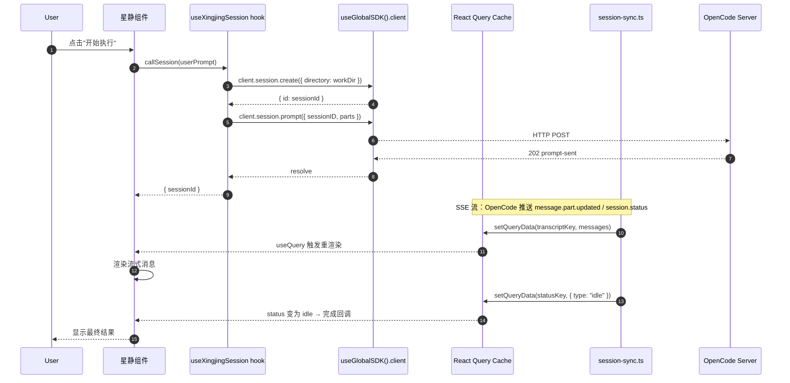
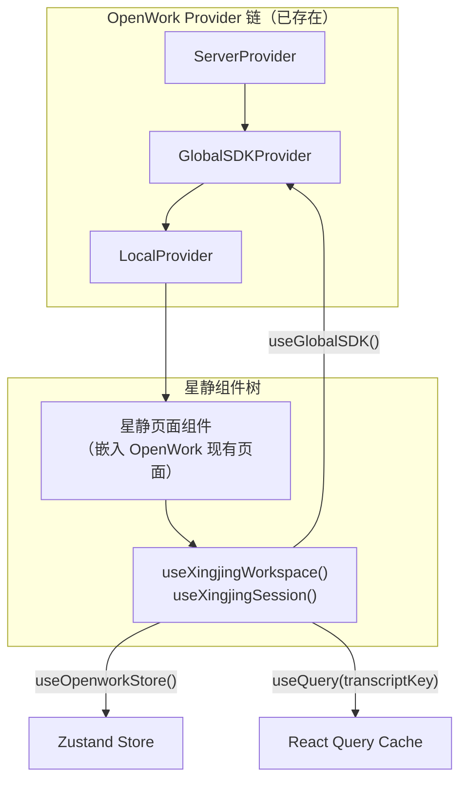

# 06 · 星静 ↔ OpenWork 接缝契约（React 集成模型）

本文件描述**星静（Xingjing）如何作为 OpenWork React 应用的领域模块嵌入并消费其能力**。

> **迁移背景**：原契约基于 SolidJS + Tauri 架构，设计了独立的 `/xingjing` 路由、`XingjingOpenworkContext` 46 字段注入对象、`XingjingBridge` 单例和 `initBridge/setSharedClient` 初始化模式。迁移到 React 19 + Electron 后，这些机制**全部废弃**，改为直接使用 OpenWork 的 React hooks。

---

## §1 集成原则

### 1.1 无独立路由、无 Bridge 单例、无 Props 注入

| 旧模式 | 新模式 |
|--------|--------|
| 独立路由 `/xingjing`，`XingjingNativePage` 组件挂载 | 星静组件直接嵌入 OpenWork 现有页面 |
| `XingjingOpenworkContext` 46 字段通过 props 注入 | 直接调用 OpenWork React hooks |
| `XingjingBridge` 单例 + `initBridge` / `destroyBridge` | 无单例，hooks 在组件内按需调用 |
| `setSharedClient` 模块级变量注入 | 通过 `useGlobalSDK()` 获取 client |
| SolidJS `createEffect` / `createSignal` / `createMemo` | React `useEffect` / `useState` / `useMemo` |

### 1.2 代码组织位置

星静领域代码放在：

```
apps/app/src/react-app/domains/xingjing/
├── hooks/          # 星静专用 React hooks（组合 OpenWork 内置 hooks）
├── components/     # 星静 React 组件
├── store/          # 星静 Zustand 切片（可选）
└── index.ts        # 公开导出
```

已有领域结构参考：`apps/app/src/react-app/domains/workspace/`、`apps/app/src/react-app/domains/session/`。

### 1.3 核心架构图



---

## §2 可用的 React Hooks（取代原 XingjingOpenworkContext）

以下是星静代码可以直接使用的所有 OpenWork 内置 hooks。所有 hook 均在 React 组件或自定义 hook 内调用，无需任何注入流程。

### 2.1 核心 hooks 一览

| Hook | 来源文件 | 返回类型 | 提供什么 |
|------|---------|---------|---------|
| `useGlobalSDK()` | `kernel/global-sdk-provider.tsx` | `{ url: string; client: OpencodeClient; event: GlobalEventEmitter }` | OpenCode SDK client、事件流订阅器、当前 server URL |
| `useOpenworkStore` | `kernel/store.ts` | Zustand store | 工作区列表、当前活跃工作区 ID、选中 session ID、服务器连接状态 |
| `useLocal()` | `kernel/local-provider.tsx` | `{ ui, setUi, prefs, setPrefs, ready }` | 本地 UI 状态、用户偏好（模型、显示思考过程、发布渠道） |
| `useServer()` | `kernel/server-provider.tsx` | `{ url, name, list, healthy, setActive, add, remove }` | OpenWork 服务器 URL、健康状态、服务器列表管理 |

### 2.2 `useGlobalSDK()` 详情

```ts
// 来源：apps/app/src/react-app/kernel/global-sdk-provider.tsx
type GlobalSDKContextValue = {
  url: string;                  // 当前 OpenCode server base URL
  client: OpencodeClient;       // @opencode-ai/sdk/v2/client 实例
  event: GlobalEventEmitter;    // 事件订阅器（见下方事件类型）
};

// GlobalEventEmitter 接口
type GlobalEventEmitter = {
  on: (channel: string, listener: (payload: Event) => void) => () => void;
  off: (channel: string, listener: (payload: Event) => void) => void;
  emit: (channel: string, payload: Event) => void;
};
```

`client` 对象直接使用 `@opencode-ai/sdk/v2/client` 的 `createOpencodeClient()` 返回值。星静可通过 `client.session.*` 创建和管理 AI 会话，通过 `client.global.health()` 检查服务健康。

`event` 是全局事件总线；channel 通常是工作区目录路径，payload 类型包括 `session.status`、`message.part.updated`、`lsp.updated`、`todo.updated` 等。

### 2.3 `useOpenworkStore` 详情

```ts
// 来源：apps/app/src/react-app/kernel/store.ts
type OpenworkStore = {
  bootstrapping: boolean;
  server: ServerState;                      // { url, token, status, error, version, capabilities, diagnostics }
  workspaces: OpenworkWorkspaceInfo[];       // 工作区列表
  activeWorkspaceId: string | null;          // 当前活跃工作区 ID
  selectedSessionId: string | null;          // 当前选中 session ID
  errorBanner: string | null;
  // actions
  setBootstrapping: (value: boolean) => void;
  setServer: (server: ServerState) => void;
  setWorkspaces: (workspaces: OpenworkWorkspaceInfo[]) => void;
  setActiveWorkspaceId: (workspaceId: string | null) => void;
  setSelectedSessionId: (sessionId: string | null) => void;
  setErrorBanner: (message: string | null) => void;
  clearErrorBanner: () => void;
};
```

**星静的产品 = OpenWork 的工作区**。`workspaces` 数组即产品列表，`activeWorkspaceId` 即当前产品 ID。

`server.status` 四态：`"idle" | "connecting" | "connected" | "error"`，对应原 `serverStatus()` 的三态。

### 2.4 `useLocal()` 详情

```ts
// 来源：apps/app/src/react-app/kernel/local-provider.tsx
type LocalContextValue = {
  ui: {
    view: View;         // "settings" | "chat" 等
    tab: SettingsTab;   // 当前设置 tab
  };
  setUi: (updater: (previous: LocalUIState) => LocalUIState) => void;
  prefs: {
    showThinking: boolean;
    modelVariant: string | null;
    defaultModel: ModelRef | null;   // { providerID: string; modelID: string }
    releaseChannel: ReleaseChannel;
    featureFlags: { microsandboxCreateSandbox: boolean };
  };
  setPrefs: (updater: (previous: LocalPreferences) => LocalPreferences) => void;
  ready: boolean;   // localStorage 已读完
};
```

`prefs.defaultModel` 对应原 `selectedModel()`，直接读即可，无需 accessor 调用。

### 2.5 `useServer()` 详情

```ts
// 来源：apps/app/src/react-app/kernel/server-provider.tsx
type ServerContextValue = {
  url: string;           // 当前激活的 OpenWork server URL
  name: string;          // 显示名称（去掉 http://）
  list: string[];        // 已保存的 server URL 列表
  healthy: boolean | undefined;  // undefined = 正在检测
  setActive: (url: string) => void;
  add: (url: string) => void;
  remove: (url: string) => void;
};
```

### 2.6 React Query keys（session 状态订阅）

```ts
// 来源：apps/app/src/react-app/domains/session/sync/session-sync.ts
export const transcriptKey = (workspaceId: string, sessionId: string) =>
  ["react-session-transcript", workspaceId, sessionId] as const;

export const statusKey = (workspaceId: string, sessionId: string) =>
  ["react-session-status", workspaceId, sessionId] as const;

export const todoKey = (workspaceId: string, sessionId: string) =>
  ["react-session-todos", workspaceId, sessionId] as const;
```

使用 `useQuery({ queryKey: transcriptKey(wsId, sid) })` 订阅 session 消息转录，使用 `statusKey` 订阅 session 状态（`idle | busy | retry`）。

---

## §3 工作区与产品映射

星静的**产品**概念对应 OpenWork 的**工作区（workspace）**。

### 3.1 创建产品工作区

通过 `desktop.ts` 的 `workspaceCreate()` 创建本地工作区，通过 OpenWork Server 的 `createLocalWorkspace` API 在服务器端注册：

```ts
// 来源：apps/app/src/app/lib/desktop-tauri.ts（由 desktop.ts re-export）
export async function workspaceCreate(input: {
  folderPath: string;
  name: string;
  preset: string;
}): Promise<WorkspaceList>;

// 或通过 openwork-server.ts client
const client = createOpenworkServerClient({ baseUrl, token });
await client.createLocalWorkspace({ folderPath, name, preset });
```

### 3.2 切换活跃工作区

```ts
// 本地桌面端
import { workspaceSetSelected } from "../../app/lib/desktop";
await workspaceSetSelected(workspaceId);

// 通过服务器端
const client = createOpenworkServerClient({ baseUrl, token });
await client.activateWorkspace(workspaceId);

// 更新 Zustand store
useOpenworkStore.getState().setActiveWorkspaceId(workspaceId);
```

### 3.3 工作区列表读取

```ts
// 通过 Zustand store（推荐，已由 OpenWork 维护同步）
const { workspaces, activeWorkspaceId } = useOpenworkStore();

// 或通过 openwork-server.ts client
const client = createOpenworkServerClient({ baseUrl, token });
const { items } = await client.listWorkspaces();
```

### 3.4 工作区 → OpenCode URL 映射

```ts
// 来源：apps/app/src/app/lib/openwork-server.ts
export function buildOpenworkWorkspaceBaseUrl(
  hostUrl: string,
  workspaceId?: string | null
): string | null;
// 结果形如：http://localhost:8787/w/<workspaceId>
// 此 URL 可作为 createOpencodeClient({ baseUrl }) 的参数
```

---

## §4 Session 管理

Session 管理直接通过 `useGlobalSDK()` 的 `client` 对象操作，状态消费通过 React Query + `session-sync.ts`。

### 4.1 创建与发送 Session

```ts
const { client } = useGlobalSDK();

// 创建 session
const session = await client.session.create({ directory: workDir });

// 发送 prompt
await client.session.prompt({
  sessionID: session.id,
  parts: [{ type: "text", text: userPrompt }],
  model: { providerID, modelID },
});
```

### 4.2 其他 Session 操作（来自 opencode-session.ts）

| 函数 | 签名 | 说明 |
|------|------|------|
| `abortSession` | `(client, sessionID)` | 终止活跃 session |
| `abortSessionSafe` | `(client, sessionID)` | 终止 session，忽略错误 |
| `revertSession` | `(client, sessionID, messageID)` | 回滚到某条消息 |
| `unrevertSession` | `(client, sessionID)` | 恢复所有回滚的消息 |
| `compactSession` | `(client, sessionID, model)` | 压缩 session 上下文 |

导入来源：`apps/app/src/app/lib/opencode-session.ts`

### 4.3 消费 Session 状态

```ts
import { useQuery } from "@tanstack/react-query";
import { transcriptKey, statusKey } from "../../domains/session/sync/session-sync";

// 在组件内
const { data: transcript } = useQuery({ queryKey: transcriptKey(wsId, sessionId) });
const { data: status }     = useQuery({ queryKey: statusKey(wsId, sessionId) });
// status.type: "idle" | "busy" | { type: "retry"; attempt; message; next }
```

### 4.4 事件流订阅（替代原 SSE 自建连接）

星静**不需要自建 SSE 连接**。`useGlobalSDK().event` 已经维护了全局事件总线；通过 React Query 消费 session 状态是推荐方式。如需直接订阅事件：

```ts
const { event } = useGlobalSDK();

useEffect(() => {
  const off = event.on(workDir, (payload) => {
    if (payload.type === "session.status") { /* 处理状态变化 */ }
  });
  return off;  // 组件卸载自动取消订阅
}, [event, workDir]);
```

---

## §5 Skill / Agent / Command 注册

通过 `createOpenworkServerClient()` 返回的 client 对象操作，或直接调用 server-v2 的 REST API。

### 5.1 OpenWork Server Client（推荐）

```ts
// 来源：apps/app/src/app/lib/openwork-server.ts
const client = createOpenworkServerClient({ baseUrl, token });

// Skill 操作
await client.listSkills(workspaceId);
await client.getSkill(workspaceId, skillName);
await client.upsertSkill(workspaceId, { name, content, description });
await client.deleteSkill(workspaceId, skillName);

// Command 操作
await client.listCommands(workspaceId);
await client.upsertCommand(workspaceId, { name, description, template, agent, model });
await client.deleteCommand(workspaceId, name);

// MCP 操作
await client.listMcp(workspaceId);
await client.addMcp(workspaceId, { name, config });
await client.removeMcp(workspaceId, name);
```

### 5.2 server-v2 Managed API（系统级）

server-v2 提供了托管资源 API，路径为 `/system/managed/:kind`，支持 `skills`、`mcps`、`plugins`、`providerConfigs` 四种资源类型：

| 方法 | 路径 | 说明 |
|------|------|------|
| `GET` | `/system/managed/skills` | 列出所有托管 skills |
| `POST` | `/system/managed/skills` | 创建托管 skill |
| `GET` | `/system/managed/skills/:itemId` | 获取单个托管 skill |
| `PUT` | `/system/managed/skills/:itemId` | 更新托管 skill |
| `DELETE` | `/system/managed/skills/:itemId` | 删除托管 skill |
| `GET` | `/system/managed/skills/:itemId/assignments` | 查看工作区分配情况 |
| `POST` | `/system/managed/skills/:itemId/assignments` | 分配到指定工作区 |

`mcps`、`plugins`、`providerConfigs` 遵循相同的路径模式，替换 `skills` 即可。

来源：`apps/server-v2/src/routes/managed.ts`、`apps/server-v2/src/routes/route-paths.ts`

---

## §6 文件操作

### 6.1 工作区文件读写（通过 openwork-server.ts）

```ts
const client = createOpenworkServerClient({ baseUrl, token });

// 读取文件
const { content, path, bytes, updatedAt } = await client.readWorkspaceFile(workspaceId, filePath);

// 写入文件
await client.writeWorkspaceFile(workspaceId, {
  path: filePath,
  content: newContent,
  baseUpdatedAt: updatedAt,  // 乐观锁
  force: false,
});
```

### 6.2 桌面端文件系统（通过 desktop.ts）

```ts
import {
  workspaceCreate,
  workspaceSetSelected,
  workspaceForget,
  getDesktopHomeDir,
  joinDesktopPath,
  pickDirectory,
} from "../../app/lib/desktop";
```

| 函数 | 说明 |
|------|------|
| `workspaceCreate({ folderPath, name, preset })` | 创建本地工作区 |
| `workspaceSetSelected(workspaceId)` | 切换选中工作区 |
| `workspaceSetRuntimeActive(workspaceId)` | 设置运行时活跃工作区 |
| `workspaceForget(workspaceId)` | 移除工作区（不删除文件） |
| `getDesktopHomeDir()` | 获取用户主目录 |
| `joinDesktopPath(...parts)` | 拼接路径 |
| `pickDirectory()` | 打开目录选择对话框 |

### 6.3 OpenCode 配置文件读写

```ts
const client = createOpenworkServerClient({ baseUrl, token });

// 读取 .opencode/opencode.json
const config = await client.readOpencodeConfigFile(workspaceId, "project");

// 写入配置
await client.writeOpencodeConfigFile(workspaceId, "project", jsonContent);
```

### 6.4 收件箱（Inbox）文件操作

```ts
// 上传文件到工作区收件箱
await client.uploadInbox(workspaceId, file, { path: "optional/target/path" });

// 列出收件箱文件
const { items } = await client.listInbox(workspaceId);

// 下载收件箱文件
const { data, contentType, filename } = await client.downloadInboxItem(workspaceId, inboxId);
```

---

## §7 迁移对照表（旧 XingjingOpenworkContext → 新 React 等价）

下表把原 46 字段 `XingjingOpenworkContext` 逐一映射到新的 React 等价接口。

### 7.1 Workspace 生命周期（原必需字段）

| 旧字段 | 新等价 | 来源 |
|--------|--------|------|
| `resolveWorkspaceByDir(dir)` | 遍历 `useOpenworkStore().workspaces` 按目录匹配 | `kernel/store.ts` |
| `createWorkspaceByDir(dir, name)` | `workspaceCreate({ folderPath: dir, name, preset })` | `lib/desktop.ts` |
| `activateWorkspaceById(wsId)` | `workspaceSetSelected(wsId)` 或 `client.activateWorkspace(wsId)` | `lib/desktop.ts` / `lib/openwork-server.ts` |
| `serverStatus()` | `useOpenworkStore().server.status` | `kernel/store.ts` |

### 7.2 OpenCode Client（原必需字段）

| 旧字段 | 新等价 | 来源 |
|--------|--------|------|
| `opencodeClient()` | `useGlobalSDK().client` | `kernel/global-sdk-provider.tsx` |
| `ensureClient()` | 无需，`client` 始终可用（`useGlobalSDK()` 保证非空） | 同上 |

### 7.3 模型选择（原必需字段）

| 旧字段 | 新等价 | 来源 |
|--------|--------|------|
| `selectedModel()` | `useLocal().prefs.defaultModel` | `kernel/local-provider.tsx` |

### 7.4 Skill CRUD（原必需字段）

| 旧字段 | 新等价 | 来源 |
|--------|--------|------|
| `listSkills(wsId)` | `client.listSkills(wsId)` | `lib/openwork-server.ts` |
| `getSkill(wsId, name)` | `client.getSkill(wsId, name)` | 同上 |
| `upsertSkill(wsId, payload)` | `client.upsertSkill(wsId, payload)` | 同上 |
| `deleteSkill(wsId, name)` | `client.deleteSkill(wsId, name)` | 同上 |
| `listHubSkills(options?)` | `client.listHubSkills(options)` | 同上 |
| `installHubSkill(wsId, name, options?)` | `client.installHubSkill(wsId, name, options)` | 同上 |

### 7.5 Session 访问（原可选字段）

| 旧字段 | 新等价 | 来源 |
|--------|--------|------|
| `sessionStatusById()` | `useQuery({ queryKey: statusKey(wsId, sid) })` | `domains/session/sync/session-sync.ts` |
| `messagesBySessionId(sid)` | `useQuery({ queryKey: transcriptKey(wsId, sid) })` | 同上 |
| `ensureSessionLoaded(sid)` | React Query 自动管理缓存，无需手动调用 | 同上 |
| `deleteSession(wsId, sid)` | `client.deleteSession(wsId, sid)` | `lib/openwork-server.ts` |

### 7.6 文件操作（原可选字段）

| 旧字段 | 新等价 | 来源 |
|--------|--------|------|
| `readWorkspaceFile(wsId, path)` | `client.readWorkspaceFile(wsId, path)` | `lib/openwork-server.ts` |
| `writeWorkspaceFile(wsId, payload)` | `client.writeWorkspaceFile(wsId, payload)` | 同上 |
| `listDir(absPath)` | 无直接等价；可通过 `pickDirectory()` 或桌面端 IPC | `lib/desktop.ts` |
| `readOpencodeConfig(wsId)` | `client.readOpencodeConfigFile(wsId, "project")` | `lib/openwork-server.ts` |
| `writeOpencodeConfig(wsId, content)` | `client.writeOpencodeConfigFile(wsId, "project", content)` | 同上 |

### 7.7 扩展 CRUD（原可选字段）

| 旧字段 | 新等价 | 来源 |
|--------|--------|------|
| `listMcp(wsId)` | `client.listMcp(wsId)` | `lib/openwork-server.ts` |
| `addMcp(wsId, payload)` | `client.addMcp(wsId, payload)` | 同上 |
| `removeMcp(wsId, name)` | `client.removeMcp(wsId, name)` | 同上 |
| `logoutMcpAuth(wsId, name)` | `client.logoutMcpAuth(wsId, name)` | 同上 |
| `listCommands(wsId)` | `client.listCommands(wsId)` | 同上 |
| `listAudit(wsId)` | `client.listAudit(wsId)` | 同上 |

### 7.8 引擎管理（原可选字段）

| 旧字段 | 新等价 | 来源 |
|--------|--------|------|
| `reloadEngine(wsId)` | `client.reloadEngine(wsId)` | `lib/openwork-server.ts` |
| `reloadWorkspaceEngine()` | 同上，传入当前 `activeWorkspaceId` | 同上 |
| `canReloadWorkspace` | 检查 `server.capabilities?.config.write` | 同上 |

### 7.9 服务器连接（原可选字段）

| 旧字段 | 新等价 | 来源 |
|--------|--------|------|
| `serverBaseUrl()` | `useServer().url` | `kernel/server-provider.tsx` |
| `reconnect()` | `useServer().setActive(url)` | 同上 |
| `restartLocalServer()` | 无直接等价（Electron 端通过桌面 IPC） | `lib/desktop.ts` |
| `currentOpenworkToken()` | `useOpenworkStore().server.token` | `kernel/store.ts` |
| `openworkRuntimeWorkspaceId` | `useOpenworkStore().server.diagnostics?.activeWorkspaceId` | 同上 |

### 7.10 Provider / Model 管理（原可选字段）

| 旧字段 | 新等价 | 来源 |
|--------|--------|------|
| `providerConnectedIds()` | 需通过 `client.global.*` 或 OpenWork Server capabilities | `lib/openwork-server.ts` |
| `submitProviderApiKey(pid, key)` | 无直接 client 等价；通过 OpenWork 设置页 UI 或内部 API | — |

### 7.11 导航（原可选字段）

| 旧字段 | 新等价 | 来源 |
|--------|--------|------|
| `navigateTo(target)` | React Router `useNavigate()` 或直接渲染目标组件 | React Router |

### 7.12 已废弃（无新等价）

以下字段在新架构下没有等价物，因为其功能由 React 生命周期和 React Query 自动管理：

| 旧字段 | 原因 |
|--------|------|
| `reloadBusy` | React Query 的 `isFetching` 替代 |
| `developerMode` | 直接读 `featureFlags` |
| `openworkReconnectBusy` | `useServer().healthy === undefined` 表示检测中 |
| `xingjingUrl()` | 无独立路由，此字段无意义 |
| `listScheduledJobs` / `deleteScheduledJob` | 当前架构无直接等价，按需对接 |

---

## §8 端到端时序：星静发起一次 AI 调用



**关键点**：星静不需要自建 SSE 连接。`session-sync.ts` 已经监听 OpenWork 的全局事件总线并写入 React Query 缓存，星静组件通过 `useQuery` 订阅即可。

---

## §9 生命周期与 Hook 初始化

在 React 模型下，无需手动管理 Bridge 初始化/销毁。所有状态由 React 生命周期和 Zustand 自动管理：



**没有** `initBridge`、`destroyBridge`、`setSharedClient`、`AppStoreProvider` 或任何单例初始化逻辑。组件挂载时通过 hooks 自动接入，卸载时 hooks 自动清理。

---

## §10 验证检查单

在实现星静领域代码前，确认以下文件已存在且可导入：

```bash
# Provider hooks
ls apps/app/src/react-app/kernel/global-sdk-provider.tsx  # useGlobalSDK
ls apps/app/src/react-app/kernel/store.ts                  # useOpenworkStore
ls apps/app/src/react-app/kernel/local-provider.tsx        # useLocal
ls apps/app/src/react-app/kernel/server-provider.tsx       # useServer

# 工具库
ls apps/app/src/app/lib/desktop.ts                         # workspaceCreate 等
ls apps/app/src/app/lib/openwork-server.ts                 # createOpenworkServerClient
ls apps/app/src/app/lib/opencode-session.ts                # abortSession 等

# Session 同步
ls apps/app/src/react-app/domains/session/sync/session-sync.ts  # transcriptKey 等
```

确认旧模式已彻底清除（应返回空）：

```bash
grep -rn "createSignal\|createStore\|solid-js\|XingjingOpenworkContext\|initBridge\|setSharedClient\|destroyBridge\|XingjingBridge" \
  apps/app/src/react-app/domains/xingjing/
```
