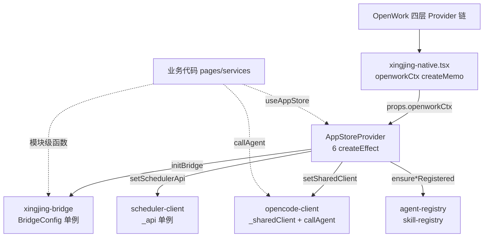
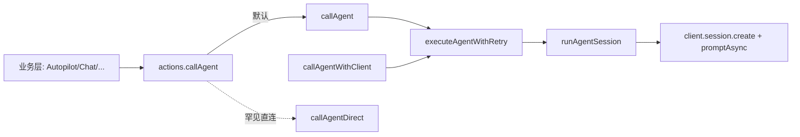
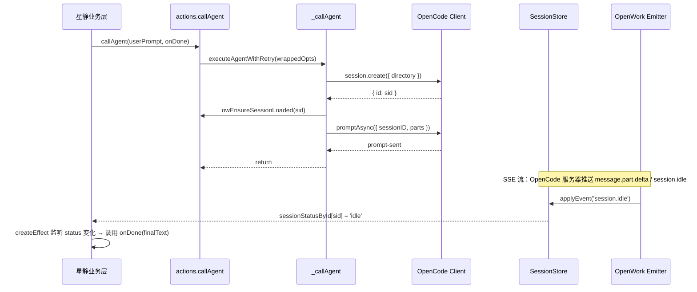
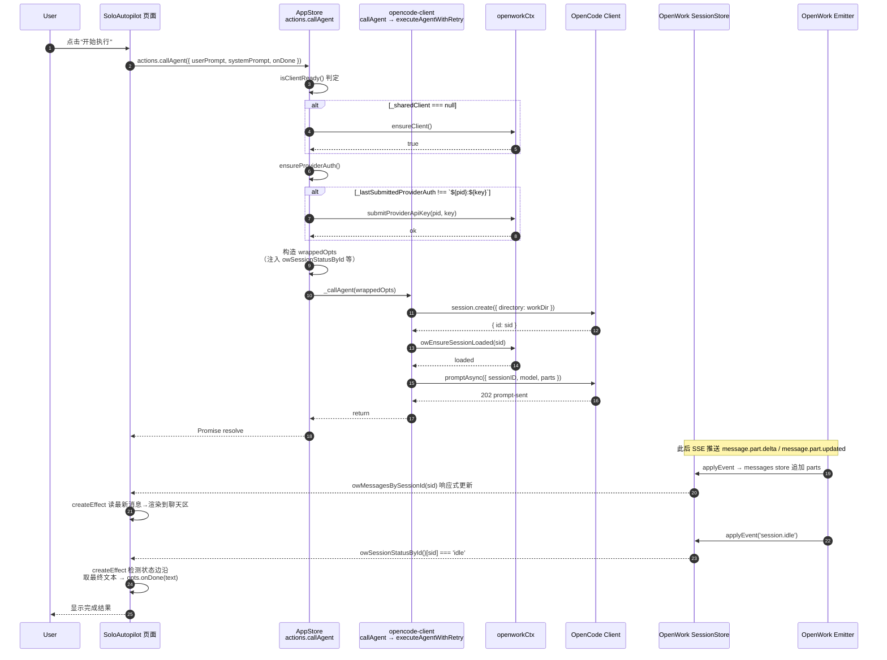

# 06 · 星静 ↔ OpenWork 接缝契约（XingjingBridge / AppStore / OpenworkContext）

本文件描述**星静如何嵌入 OpenWork 并消费其能力**的完整接缝契约。该契约由三段代码拼接而成：

1. **宿主端构造器**（OpenWork 侧）：[pages/xingjing-native.tsx](file:///Users/umasuo_m3pro/Desktop/startup/xingjing/harnesswork/apps/app/src/app/pages/xingjing-native.tsx) 将 OpenWork 的四层 Provider 信号、SDK Client、全局 store、路由回调组装成一个 `XingjingOpenworkContext` 对象，逐层向下注入。
2. **星静边界容器**（星静侧）：[AppStoreProvider](file:///Users/umasuo_m3pro/Desktop/startup/xingjing/harnesswork/apps/app/src/app/xingjing/stores/app-store.tsx#L256-L867) 接收上述 ctx，通过 6 个 `createEffect` 把能力分发到 4 个子系统（`setSharedClient` / `setSchedulerApi` / `ensureAgentsRegistered` / `initBridge`）。
3. **Bridge 单例 + 业务代理**：[xingjing-bridge.ts](file:///Users/umasuo_m3pro/Desktop/startup/xingjing/harnesswork/apps/app/src/app/xingjing/services/xingjing-bridge.ts) 持有 `BridgeConfig` 单例，对业务层暴露**无状态的模块级函数**；[opencode-client.ts](file:///Users/umasuo_m3pro/Desktop/startup/xingjing/harnesswork/apps/app/src/app/xingjing/services/opencode-client.ts) 则作为 `callAgent` 的专用通道（含直连 LLM 降级）。

本契约只覆盖**独立版（solo）**的真实代码路径。与 05 系列（OpenWork 子系统）的边界见 §12。

---

## 1. 对接契约总览

星静不直接创建 OpenCode Client，不持有 SSE 连接，不维护 workspace 列表。所有"访问 OpenWork 服务器"的能力都来自 OpenWork 主应用注入。

```
 ┌──────────────────────── 宿主层（OpenWork 路由下 /xingjing 挂载点）────────────────────────┐
 │ pages/xingjing-native.tsx                                                                │
 │   ├─ useServer() / useGlobalSDK() / useGlobalSync() / useLocal()  ← OpenWork 四层 Provider│
 │   ├─ const openworkCtx = createMemo(() => ({ ...46 字段 }))       ← 注入构造器             │
 │   └─ <AppStoreProvider openworkCtx={openworkCtx()}>                                       │
 │         <Router base="/xingjing" root={MainLayout}> …路由… </Router>                      │
 │       </AppStoreProvider>                                                                 │
 └──────────────────────────────────┬───────────────────────────────────────────────────────┘
                                    ▼  注入 props.openworkCtx
 ┌──────────────────────── 星静边界容器（xingjing/stores/app-store.tsx）──────────────────────┐
 │ AppStoreProvider                                                                         │
 │   ├─ 6 个 createEffect 分发                                                               │
 │   │   ① resolveWorkspaceByDir  →  _lastActivatedWsId  →  setResolvedWorkspaceId           │
 │   │   ② setSharedClient(ctx.opencodeClient())           → opencode-client 模块            │
 │   │   ③ setSchedulerApi({ listJobs, deleteJob })        → scheduler-client 模块          │
 │   │   ④ ensureAgentsRegistered + ensureSkillsRegistered + xingjing-context Skill          │
 │   │   ⑤ initBridge(BridgeConfig) / destroyBridge()      → xingjing-bridge 单例            │
 │   │   ⑥ currentUser / loadFromFiles(workDir)            → AppState                        │
 │   └─ useAppStore() → { state, productStore, openworkCtx, resolvedWorkspaceId, actions }   │
 └──────────────────────────────────┬───────────────────────────────────────────────────────┘
                                    ▼
 ┌─ 业务层（pages/solo/*, services/*, 组件）──────────────────────────────────────────────────┐
 │   // 两条消费路径                                                                          │
 │   A) import { fileRead, sessionCreate, listSkills, … } from '../services/xingjing-bridge' │
 │   B) const { state, actions, openworkCtx } = useAppStore()                                 │
 └───────────────────────────────────────────────────────────────────────────────────────────┘
```



**设计底线**：
- 星静**永远**通过这三个接缝消费能力，不直接 `fetch(opencodeUrl)`、不直接 `createClient()`、不直接订阅 SSE。
- 三个接缝彼此正交：Bridge 负责"有 workspace 的操作"，`_sharedClient` 负责 `callAgent` 这种"原始 client 请求"，AppStore 负责"有产品状态的业务动作"。
- 三条接缝对 `ready` 状态的解释不同：`isReady()`（Bridge）= 已注入 **且** `client()` 非空；`isClientReady()`（opencode-client）= `_sharedClient !== null`；`openworkStatus()`（AppStore）= `serverStatus()` 返回值。

---

## 2. 注入面：xingjing-native.tsx 的 openworkCtx 构造

OpenWork 主应用在 `Router` 中把星静挂到 `/xingjing` 路径下，宿主组件是 [XingjingNativePage](file:///Users/umasuo_m3pro/Desktop/startup/xingjing/harnesswork/apps/app/src/app/pages/xingjing-native.tsx#L106-L279)。该组件通过**单个 `createMemo`** 组装注入对象：

```text
const openworkCtx = createMemo<XingjingOpenworkContext>(() => {
  return {
    resolveWorkspaceByDir: props.resolveWorkspaceByDir,
    createWorkspaceByDir:  props.createWorkspaceByDir,
    activateWorkspaceById: async (wsId) => { /* 先查 list.activeId 短路 */ },
    opencodeClient:        () => hasOpenworkClient() ? props.openworkServerClient!.client() : null,
    serverStatus:          props.serverStatus,
    selectedModel:         props.selectedModel,
    listSkills/getSkill/upsertSkill/deleteSkill/...
    readWorkspaceFile/writeWorkspaceFile/listDir,
    messagesBySessionId, ensureSessionLoaded, sessionStatusById,
    navigateTo, reloadEngine, providerConnectedIds, submitProviderApiKey,
    ensureClient, restartLocalServer, ...
  }
})
```

全部 24 个透传 prop 的定义见 [XingjingNativePageProps](file:///Users/umasuo_m3pro/Desktop/startup/xingjing/harnesswork/apps/app/src/app/pages/xingjing-native.tsx#L49-L104)，扁平化成 46 字段的 ctx 见 [openworkCtx createMemo](file:///Users/umasuo_m3pro/Desktop/startup/xingjing/harnesswork/apps/app/src/app/pages/xingjing-native.tsx#L121-L252)。

### 2.1 稳定布尔 `hasOpenworkClient` —— 避免反复重建

`openworkCtx` 的响应式依赖**只有一个布尔**：

```text
const hasOpenworkClient = createMemo(() => !!props.openworkServerClient);
```

代码注释明确动机：OpenWork 的 `serverStatus()` 在 `connected ↔ limited ↔ reconnecting` 三态间频繁切换，但只要 `openworkServerClient` 引用还在，下游就没有理由重新构建整个 ctx。把 memo 依赖压缩成 `!!client`，让三态切换不会导致 `AppStoreProvider` 重算 → `initBridge/destroyBridge` 反复边沿切换 → `setSharedClient` 返回 true → 下游订阅者重运行。

### 2.2 `activateWorkspaceById` 短路

在 ctx 里对 `activateWorkspaceById` 做了一层包装（[xingjing-native.tsx#L161-L174](file:///Users/umasuo_m3pro/Desktop/startup/xingjing/harnesswork/apps/app/src/app/pages/xingjing-native.tsx#L161-L174)）：

- 读 `props.workspaceList().activeId`，若恰好等于入参则返回 `true`，跳过 POST。
- 只有当活跃 id 真的不同才走 OpenWork 的 `workspace.activate` RPC。

此短路与 AppStore 里的 `_lastActivatedWsId` 形成**双层防重**（见 §3.1）。

### 2.3 认证守卫

XingjingNativePage 在渲染 Router 前有 `Show when={authChecked()}` 判定（[xingjing-native.tsx#L254-L278](file:///Users/umasuo_m3pro/Desktop/startup/xingjing/harnesswork/apps/app/src/app/pages/xingjing-native.tsx#L254-L278)）：未登录时显示 `AuthPage`，不挂载 `AppStoreProvider`。这是**整个契约的前置条件**——星静进入业务逻辑之前必有登录用户，下游 `currentUser()` 永远可读非空。

---

## 3. 星静边界容器：AppStoreProvider 的 6 个 createEffect

AppStoreProvider 是契约的**枢纽**：它把上游推下来的 `openworkCtx` 扇出到 5 个模块级单例 + 2 个 Signal。全部副作用在 SolidJS 响应式作用域内，不依赖任何生命周期钩子。

代码位置：[AppStoreProvider](file:///Users/umasuo_m3pro/Desktop/startup/xingjing/harnesswork/apps/app/src/app/xingjing/stores/app-store.tsx#L256-L867)。

### 3.1 Effect ①：workspace 解析 + 激活防重

[app-store.tsx#L275-L322](file:///Users/umasuo_m3pro/Desktop/startup/xingjing/harnesswork/apps/app/src/app/xingjing/stores/app-store.tsx#L275-L322) 维护 `resolvedWorkspaceId` Signal：

- 响应 `productStore.activeProduct()` 变化。
- 若产品 `workDir` 已存在对应 workspace → 调 `ctx.resolveWorkspaceByDir(workDir)` 获取 `wsId`，随后**仅在 wsId 真正切换时**（`wsId !== _lastActivatedWsId`）调用 `activateWorkspaceById(wsId)`；激活后更新 `_lastActivatedWsId`。
- 若 resolve 返回 `null` → 调 `createWorkspaceByDir(workDir, productName)` 自动创建。
- 任何失败路径统一降级为 `setResolvedWorkspaceId(null)`，下游所有依赖 `wsId` 的 effect 自动停工。

`_lastActivatedWsId` 是闭包变量（而非 Signal），不触发响应式重算；它只负责"**状态抖动不要触发 activate POST**"这一个目的。

### 3.2 Effect ②：setSharedClient 幂等注入

[app-store.tsx#L324-L341](file:///Users/umasuo_m3pro/Desktop/startup/xingjing/harnesswork/apps/app/src/app/xingjing/stores/app-store.tsx#L324-L341) 把 `ctx.opencodeClient()` 注入 [opencode-client._sharedClient](file:///Users/umasuo_m3pro/Desktop/startup/xingjing/harnesswork/apps/app/src/app/xingjing/services/opencode-client.ts#L27-L31)：

```text
createEffect(() => {
  const client = props.openworkCtx?.opencodeClient?.();
  const changed = setSharedClient(client ?? null);
  if (!changed) return;
  // 只在边沿打印日志
});
```

`setSharedClient` 返回布尔：引用未变时返回 `false`，作用域内 effect 直接 `return` 不打印。这是**日志降噪 + 副作用幂等**的统一手段。

### 3.3 Effect ③：setSchedulerApi 注入

[app-store.tsx#L346-L357](file:///Users/umasuo_m3pro/Desktop/startup/xingjing/harnesswork/apps/app/src/app/xingjing/stores/app-store.tsx#L346-L357) 把 `ctx.listScheduledJobs` / `ctx.deleteScheduledJob` 绑定当前 `wsId` 后注入 [scheduler-client](file:///Users/umasuo_m3pro/Desktop/startup/xingjing/harnesswork/apps/app/src/app/xingjing/services/scheduler-client.ts#L22-L26)：

- `wsId` 缺失或 ctx 方法未实现 → `setSchedulerApi(null)`。
- 闭包捕获当时的 `wsId`，后续 workspace 切换会重建 api。

### 3.4 Effect ④：内置 Agent / Skill 延迟注册

[app-store.tsx#L367-L423](file:///Users/umasuo_m3pro/Desktop/startup/xingjing/harnesswork/apps/app/src/app/xingjing/stores/app-store.tsx#L367-L423) 是契约中最讲究的一段：

```text
createEffect(() => {
  const wsId = resolvedWorkspaceId();
  if (!wsId) return;
  untrack(() => {
    const mode = state.appMode;
    const product = productStore.activeProduct();
    const runIdle = window.requestIdleCallback ?? (cb => setTimeout(cb, 200));
    runIdle(() => {
      void ensureAgentsRegistered(mode);
      void ensureSkillsRegistered(mode, upsertSkill, listSkills);
      // xingjing-context skill 幂等同步（产品信息→Markdown）
      if (product && ctx) { void ctx.upsertSkill(wsId, 'xingjing-context', skillContent, …) }
    });
  });
});
```

三条规则并存：
1. **只依赖 `wsId`**：`state.appMode` 和 `productStore.activeProduct()` 用 `untrack` 切断追踪，避免 `setAppMode` / 产品元数据变更反复重跑；注册工作本身重跑成本高。
2. **延迟到 idle**：`ensureAgentsRegistered` + `ensureSkillsRegistered` 会向 OpenWork 发出多路写入；如果在挂载阶段同步触发，会与 OpenWork 自身的启动 fetch 在 WKWebView IPC 队列里争抢。`requestIdleCallback` 保证它们排在浏览器空闲帧。
3. **幂等守卫由被调方实现**：`ensureAgentsRegistered` / `ensureSkillsRegistered` 内部读取 OpenWork 已有列表、比对差集后才 upsert；即使 effect 多次触发也不会重复扇出。

`xingjing-context` skill 是产品信息到 AI 上下文的**幂等映射**：每次 workspace 就绪时用最新产品元数据渲染 Markdown 写回 `.opencode/skills/xingjing-context/SKILL.md`。

### 3.5 Effect ⑤：initBridge / destroyBridge

[app-store.tsx#L425-L467](file:///Users/umasuo_m3pro/Desktop/startup/xingjing/harnesswork/apps/app/src/app/xingjing/stores/app-store.tsx#L425-L467) 构造 [BridgeConfig](file:///Users/umasuo_m3pro/Desktop/startup/xingjing/harnesswork/apps/app/src/app/xingjing/services/xingjing-bridge.ts#L134-L148) 并调 `initBridge`：

```text
createEffect(() => {
  const ctx = props.openworkCtx;
  const wsId = resolvedWorkspaceId();
  if (ctx && wsId) {
    initBridge({
      client:      () => ctx.opencodeClient?.() ?? null,
      fileOps:     (ctx.readWorkspaceFile && ctx.writeWorkspaceFile)
                   ? { read, write, list: ctx.listDir } : null,
      workspaceId: () => resolvedWorkspaceId(),
      extensions:  { listSkills, getSkill, upsertSkill, …, readOpencodeConfig, writeOpencodeConfig },
      workspace:   { resolveByDir, createByDir },
      serverStatus, fileBrowser, scheduler, navigateTo,
    });
  } else {
    destroyBridge();
  }
});
```

关键设计：
- **所有字段都是函数（响应式读取）**，不是值快照。`workspaceId` 传 `() => resolvedWorkspaceId()`，这样 Bridge 模块级函数在每次调用时读到最新 id。
- **`wsId` 绑定在闭包里**：`extensions.listSkills` 定义为 `() => ctx.listSkills(wsId)`，相当于把调用时 ctx + wsId 的快照冻结进去。workspace 切换会让整个 `createEffect` 重跑 → 重新 `initBridge` → 新的闭包捕获新的 `wsId`。
- **`initBridge` 自身幂等**（[xingjing-bridge.ts#L161-L168](file:///Users/umasuo_m3pro/Desktop/startup/xingjing/harnesswork/apps/app/src/app/xingjing/services/xingjing-bridge.ts#L161-L168)）：只在 `_bridge === null → !==null` 的**边沿**打印"Bridge 已初始化"，避免 workspace 多次切换时日志刷屏。

### 3.6 Effect ⑥：currentUser 同步 + loadFromFiles

[app-store.tsx#L500-L515](file:///Users/umasuo_m3pro/Desktop/startup/xingjing/harnesswork/apps/app/src/app/xingjing/stores/app-store.tsx#L500-L515) 做两件事：
- `currentUser()` → `setState('currentUser', user.name)`；依赖 [auth-service](file:///Users/umasuo_m3pro/Desktop/startup/xingjing/harnesswork/apps/app/src/app/xingjing/services/auth-service.ts)。
- `productStore.activeProduct()?.workDir` → `loadFromFiles(workDir)` 加载 PRD/Task/Backlog 本地文件。

这是**业务数据**的装载，不涉及 OpenWork；放在本契约里只因它与其它 effect 共用 AppStoreProvider 响应式作用域。

---

## 4. 导出面 A：XingjingOpenworkContext 46 字段

这是星静对 OpenWork 的**最大需求面**，每个字段都对应 AppStoreProvider 的某条消费路径。完整定义见 [XingjingOpenworkContext](file:///Users/umasuo_m3pro/Desktop/startup/xingjing/harnesswork/apps/app/src/app/xingjing/stores/app-store.tsx#L55-L166)。

### 4.1 必需字段（11 个）—— 独立版启动前必须全部到位

| 字段 | 类型 | 职责 |
|------|------|------|
| `resolveWorkspaceByDir` | `(dir) => Promise<string \| null>` | 按产品目录查 workspace id |
| `serverStatus` | `() => 'connected'\|'disconnected'\|'limited'` | OpenWork 服务器三态 |
| `opencodeClient` | `() => Client \| null` | 当前 OpenCode SDK Client |
| `selectedModel` | `() => { providerID, modelID } \| null` | 全局选中模型 |
| `listSkills` / `getSkill` / `upsertSkill` | Skill CRUD | §5 / §7 |
| `readOpencodeConfig` / `writeOpencodeConfig` | `.opencode/opencode.json` 读写 | 设置页 |
| `createWorkspaceByDir` | `(dir, name) => Promise<string \| null>` | workspace 自动创建 |
| `listMcp` / `listCommands` / `listAudit` | 基础只读 API | 扩展页 |

### 4.2 可选字段（35 个）—— 缺失走降级

按语义分组：

**Workspace 生命周期**
- `activateWorkspaceById(wsId)`：§2.2 双层防重的内层。
- `reloadEngine(wsId)` / `reloadWorkspaceEngine()`：手动重启引擎。
- `canReloadWorkspace` / `reloadBusy` / `developerMode`：UI 状态。

**Session 全局 store 复用**（关键）
- `sessionStatusById()`：`callAgent` 完成检测用，参见 §7。
- `messagesBySessionId(sid)`：从 OpenWork 全局 session store 读消息列表，避免星静重复订阅。
- `ensureSessionLoaded(sid)`：若消息未加载则触发 HTTP 加载，幂等。
- `deleteSession(wsId, sid)`：显式删除。

**扩展 CRUD**
- `addMcp` / `removeMcp` / `logoutMcpAuth` / `deleteSkill` / `listHubSkills` / `installHubSkill`。

**文件操作**
- `readWorkspaceFile(wsId, path)` / `writeWorkspaceFile(wsId, payload)`：仅包装 OpenWork Server 的 `/workspace/:id/file/*` 路由。
- `listDir(absPath)`：绝对路径的 readdir。

**Provider 管理**
- `providerConnectedIds()` / `submitProviderApiKey(pid, key)`：§3.2 ensureProviderAuth 的底层 API。
- `ensureClient()`：无 workspace 时按需创建 client，用于 §6 callAgent 兜底。

**Scheduler / 定时任务**
- `listScheduledJobs(wsId)` / `deleteScheduledJob(wsId, name)`。

**导航回调**
- `navigateTo(target: NavigationTarget)`：§5 列举的 8 种目标。

**连接设置**
- `serverBaseUrl()` / `xingjingUrl()` / `currentOpenworkToken()`：显示用。
- `reconnect()` / `updateOpenworkSettings({ urlOverride, token })` / `restartLocalServer()`：设置页动作。
- `openworkServerUrl` / `openworkReconnectBusy` / `openworkRuntimeWorkspaceId`：展示用快照字段。

**降级语义**：所有可选字段的**缺失即降级**。业务代码用可选链 `ctx?.method?.(args)` 读，返回 `undefined` 时走默认分支（通常返回空数组 / `null` / `false`）。这让星静可以在 OpenWork 部分能力未就绪时继续运行，而不是整体崩溃。

---

## 5. 导出面 B：XingjingBridge 单例 + 50+ 模块级函数

`xingjing-bridge.ts` 是**星静业务代码的首选入口**。它把 46 字段的 ctx 折叠成 10 个分组接口，业务代码用 `import { xxx } from '../services/xingjing-bridge'` 消费。

### 5.1 10 个 Bridge 接口

全部定义集中在 [xingjing-bridge.ts#L24-L148](file:///Users/umasuo_m3pro/Desktop/startup/xingjing/harnesswork/apps/app/src/app/xingjing/services/xingjing-bridge.ts#L24-L148)。

| 接口 | 职责 | 承载的顶层函数 |
|------|------|----------------|
| `BridgeFileOps` | 工作区文件读写列表 | `fileRead` / `fileWrite` / `fileList` |
| `BridgeSessionApi` | 从全局 store 读 session 状态与消息 | `sessionStatusById` / `messagesBySessionId` / `ensureSessionLoaded` / `sessionDelete` |
| `BridgeExtensionsApi` | Skill/MCP/Command/Audit/OpencodeConfig 六大原语 | `listSkills` / `getSkill` / `upsertSkill` / `deleteSkill` / `listHubSkills` / `installHubSkill` / `listMcp` / `addMcp` / `removeMcp` / `logoutMcpAuth` / `listCommands` / `listAudit` / `readOpencodeConfig` / `writeOpencodeConfig` |
| `BridgeMessagingApi` | 消息通道（当前为占位） | — |
| `BridgeFileBrowserApi` | 绝对路径目录浏览 | `browseDir` |
| `BridgePermissionsApi` | 权限 always-allow | `autoAuthorizeWorkDir` |
| `BridgeWorkspaceApi` | workspace 解析/创建 | `resolveWorkspaceByDir` / `createWorkspaceByDir` |
| `BridgeModelApi` | Provider/Model 能力 | `selectedModel` / `providerConnectedIds` / `modelOptions` / `submitProviderApiKey` |
| `BridgeSchedulerApi` | 定时任务 | `listScheduledJobs` / `deleteScheduledJob` |
| `BridgeEngineApi` | 引擎管理 | `reloadEngine` |

顶层导航：`navigateTo(target)` 接 `NavigationTarget` 联合类型（[xingjing-bridge.ts#L121-L131](file:///Users/umasuo_m3pro/Desktop/startup/xingjing/harnesswork/apps/app/src/app/xingjing/services/xingjing-bridge.ts#L121-L131)）：
```
'settings/model' | 'settings/appearance' | 'plugins' | 'mcp' | 'skills'
| 'automations' | 'identities' | 'extensions' | { session: string } | { settings: string }
```

顶层会话：`sessionCreate` / `sessionPrompt`（直接走 `getClient()`，不经过 BridgeSessionApi）。

### 5.2 Bridge 单例与就绪信号

```
let _bridge: BridgeConfig | null = null;
const [_ready, _setReady] = createSignal(false);
```

- `initBridge(config)`：写入单例，设 `_ready = true`，**只在"未就绪 → 就绪"边沿打印日志**（[L161-L168](file:///Users/umasuo_m3pro/Desktop/startup/xingjing/harnesswork/apps/app/src/app/xingjing/services/xingjing-bridge.ts#L161-L168)）。
- `destroyBridge()`：清空单例，设 `_ready = false`，同样只在"就绪 → 未就绪"边沿打印（[L175-L180](file:///Users/umasuo_m3pro/Desktop/startup/xingjing/harnesswork/apps/app/src/app/xingjing/services/xingjing-bridge.ts#L175-L180)）。
- `isReady()`：`_ready() && _bridge !== null && _bridge.client() !== null`——三个条件都成立才算真正可用（workspace 解析 + client 注入 + 未销毁），[L185-L187](file:///Users/umasuo_m3pro/Desktop/startup/xingjing/harnesswork/apps/app/src/app/xingjing/services/xingjing-bridge.ts#L185-L187)。
- `serverStatus()`：透传 `_bridge.serverStatus()`，未注入时默认 `'disconnected'`。

### 5.3 模块级函数的模板

所有顶层函数遵循同一套模板：读 `_bridge?.workspaceId()`，若为空则警告并返回空值；否则调用对应接口方法。示例见 [fileRead](file:///Users/umasuo_m3pro/Desktop/startup/xingjing/harnesswork/apps/app/src/app/xingjing/services/xingjing-bridge.ts#L219-L232)：

```text
export async function fileRead(path: string): Promise<string | null> {
  const wsId = _bridge?.workspaceId();
  if (!_bridge?.fileOps || !wsId) {
    console.warn('[xingjing-bridge] fileRead: Bridge 未就绪或 workspace 未解析');
    return null;
  }
  try {
    const result = await _bridge.fileOps.read(wsId, path);
    return result?.content ?? null;
  } catch (e) {
    console.warn('[xingjing-bridge] fileRead 失败:', path, e.message);
    return null;
  }
}
```

这种"空值静默 + 日志警告 + try/catch 兜底"的模板**刻意不抛异常**，让业务层直接按返回值判断是否降级。

### 5.4 `autoAuthorizeWorkDir` 的特殊地位

[L545-L560](file:///Users/umasuo_m3pro/Desktop/startup/xingjing/harnesswork/apps/app/src/app/xingjing/services/xingjing-bridge.ts#L545-L560) 直接调 client 的 `permission.reply` API：
```
await permApi.reply({ reply: 'always', path: dir });
```
这是星静对 OpenWork 权限系统的一次性写入：把产品工作目录登记为 always-allow，后续所有文件读写/工具调用都不再触发权限弹窗。调用时机由产品初始化和 Bridge 就绪两个入口共同负责。

---

## 6. 导出面 C：opencode-client.ts 与 callAgent 三层

`xingjing-bridge` 负责"有 workspace 的受约束请求"。而真正驱动 AI 的代码走第二条路：`opencode-client.ts` 持有自己的 `_sharedClient`，由 AppStore 在 §3.2 注入。

### 6.1 Client 状态机

```text
let _sharedClient: ReturnType<typeof createClient> | null = null;
let _directory = '';

export function setSharedClient(client) {
  if (_sharedClient === client) return false;  // 引用相同直接跳过
  _sharedClient = client;
  return true;
}
export function setWorkingDirectory(dir) { _directory = dir; }
export function getXingjingClient() {
  if (!_sharedClient) throw new Error('[xingjing] OpenWork Client 未注入，无法使用 AI 能力');
  return _sharedClient;
}
export function isClientReady() { return _sharedClient !== null; }
```

代码：[opencode-client.ts#L18-L62](file:///Users/umasuo_m3pro/Desktop/startup/xingjing/harnesswork/apps/app/src/app/xingjing/services/opencode-client.ts#L18-L62)。

- `_directory` 由 [product-store.setActiveProductById](file:///Users/umasuo_m3pro/Desktop/startup/xingjing/harnesswork/apps/app/src/app/xingjing/services/product-store.ts) 在产品切换时通过 `setWorkingDirectory` 注入，作为 `session.create` / `promptAsync` 的缺省 directory。
- `getXingjingClient` 在 client 未注入时**主动抛异常**，与 bridge 的"静默返回 null"不同——调用方（`callAgent`）会被强制进入 `RETRY_DELAYS` 退避。

### 6.2 三层 callAgent



| 层 | 职责 | 使用的 client 来源 |
|----|------|--------------------|
| [actions.callAgent](file:///Users/umasuo_m3pro/Desktop/startup/xingjing/harnesswork/apps/app/src/app/xingjing/stores/app-store.tsx#L693-L763) | 注入 `owSessionStatusById` / `owMessagesBySessionId` / `owEnsureSessionLoaded` / `autoApproveTools`；日志埋点；`ensureProviderAuth` dedup；`ensureClient` 兜底 | — |
| [callAgent](file:///Users/umasuo_m3pro/Desktop/startup/xingjing/harnesswork/apps/app/src/app/xingjing/services/opencode-client.ts#L738-L749) | 薄包装：用 `getXingjingClient` 作为 client 来源调 `executeAgentWithRetry` | `_sharedClient`（必存在，否则抛） |
| [callAgentWithClient](file:///Users/umasuo_m3pro/Desktop/startup/xingjing/harnesswork/apps/app/src/app/xingjing/services/opencode-client.ts#L727-L732) | 直接使用外部传入的 client（如嵌入场景） | 外部注入 |
| [callAgentDirect](file:///Users/umasuo_m3pro/Desktop/startup/xingjing/harnesswork/apps/app/src/app/xingjing/services/opencode-client.ts#L770-L906) | 跳过 OpenCode，裸 `fetch` SSE 调 OpenAI 兼容 / Anthropic API | 无 client，纯 HTTP |

`executeAgentWithRetry`（[L681-L722](file:///Users/umasuo_m3pro/Desktop/startup/xingjing/harnesswork/apps/app/src/app/xingjing/services/opencode-client.ts#L681-L722)）用 `RETRY_DELAYS = [1000, 2000, 5000]` 做指数退避；每轮调 `runAgentSession`（`create → promptAsync`）。成功返回 `prompt-sent` 后**不等待完成**——完成检测由调用方通过 `sessionStatusById` 在 SolidJS reactive effect 里驱动（见 §7）。

### 6.3 `ensureProviderAuth` 去重

[app-store.tsx#L550-L563](file:///Users/umasuo_m3pro/Desktop/startup/xingjing/harnesswork/apps/app/src/app/xingjing/stores/app-store.tsx#L550-L563)：

```text
let _lastSubmittedProviderAuth = '';
const ensureProviderAuth = async () => {
  if (!pid || pid === 'custom' || !key || key.length <= 4) return;
  const authKey = `${pid}:${key}`;
  if (authKey === _lastSubmittedProviderAuth) return;
  await ctx.submitProviderApiKey(pid, key);
  _lastSubmittedProviderAuth = authKey;
};
```

动机明确：`submitProviderApiKey` 底层走 OpenWork 的 `refreshProviders({ dispose: true })`——重跑会销毁当前 provider 实例；如果每次 `callAgent` 都无条件 submit，会与用户界面上的 provider 操作竞态。`_lastSubmittedProviderAuth` 记录最近成功的 `providerID:apiKey` 签名，首次同步后对同一签名直接跳过。

---

## 7. 事件契约：会话状态的零订阅消费

星静与 OpenWork 的**最关键**的一条事件契约：**星静不独立订阅 SSE**，而是从 OpenWork 全局 session store 读状态。

### 7.1 三个接口

`actions.callAgent` 向 `_callAgent` 透传这三个函数（[app-store.tsx#L720-L727](file:///Users/umasuo_m3pro/Desktop/startup/xingjing/harnesswork/apps/app/src/app/xingjing/stores/app-store.tsx#L720-L727)）：

| 接口 | 签名 | 用途 |
|------|------|------|
| `owSessionStatusById` | `() => Record<string, string>` | 响应式读取 sessionId → 'idle'\|'running'\|'retry' 等 |
| `owMessagesBySessionId` | `(sid) => MessageWithParts[]` | 响应式读取消息列表（Part-based） |
| `owEnsureSessionLoaded` | `(sid) => Promise<void>` | 确保消息已加载到全局 store（幂等） |

这三个接口都由 OpenWork 的 [GlobalSyncProvider / SessionStore](./05h-openwork-state-architecture.md) 维护——星静无需部署任何 SSE 代码。

### 7.2 完成检测的标准写法



完成检测**不在 `_callAgent` 内部**。`_callAgent` 发完 prompt 立刻返回，下一步由业务层的 SolidJS effect 监听 `owSessionStatusById()[sid]` 从 `running` → `idle` 的边沿，读 `owMessagesBySessionId(sid)` 拿到最终文本，再调 `opts.onDone(text)`。

**为什么这样设计**：避免星静侧重复建立一套 SSE / 轮询，与 OpenWork 的 session UI 共享同一事实源，不会出现"星静说 idle 但 OpenWork 还在 running"的状态分裂。

---

## 8. 文件契约：Skill 目录 + xingjing-context

星静写入 OpenWork workspace 的文件严格限定在几个目录内：

| 目录 | 角色 | 代码 |
|------|------|------|
| `.opencode/skills/<name>/SKILL.md` | OpenCode 原生技能 | [skill-defs.ts](file:///Users/umasuo_m3pro/Desktop/startup/xingjing/harnesswork/apps/app/src/app/xingjing/skills/skill-defs.ts) + `ensureSkillsRegistered` |
| `.agents/skills/<name>/SKILL.md` | Agents 约定 | 读取用 |
| `.claude/skills/<name>.md` | Claude 约定（单文件） | 读取用 |
| `.kiro/skills/<name>.md` | Kiro 约定（单文件） | 读取用 |
| `.opencode/opencode.json` | 工作区 OpenCode 配置 | `readOpencodeConfig` / `writeOpencodeConfig` |

`SKILL_DIRS` 常量见 [opencode-client.ts#L194-L200](file:///Users/umasuo_m3pro/Desktop/startup/xingjing/harnesswork/apps/app/src/app/xingjing/services/opencode-client.ts#L194-L200)。其中 `.opencode/skills` 和 `.agents/skills` 是**子目录形态**（每个 skill 一个文件夹，SKILL.md 为入口），`.claude/skills` 和 `.kiro/skills` 是**单文件形态**。

### xingjing-context skill

[app-store.tsx#L397-L420](file:///Users/umasuo_m3pro/Desktop/startup/xingjing/harnesswork/apps/app/src/app/xingjing/stores/app-store.tsx#L397-L420) 把活跃产品元数据渲染为 Markdown 写入 `.opencode/skills/xingjing-context/SKILL.md`：

```markdown
# 星静产品上下文

## 产品信息
- 名称：${product.name}
- 编码：${product.code}
- 工作目录：${product.workDir}
- 产品类型：${product.productType}

${description && `## 描述\n${description}`}

## 重要指引
你是这个产品的 AI 助手。工作目录为 ${workDir}，请在此目录下查找代码和文档。
```

每次 `resolvedWorkspaceId` 切换时幂等重写。产品元数据变更后用户下一次进入星静或切 workspace 会自动刷新。

---

## 9. 生命周期：init / switch / destroy

下表按时间顺序列出契约涉及的所有状态转换：

| 时间点 | 触发源 | 副作用 | 代码位置 |
|--------|--------|--------|----------|
| OpenWork 启动 | — | 四层 Provider 就绪；`openworkServerClient` 可能为 null | [entry.tsx](file:///Users/umasuo_m3pro/Desktop/startup/xingjing/harnesswork/apps/app/src/app/entry.tsx) |
| 用户导航到 `/xingjing` | Router | XingjingNativePage 挂载；`openworkCtx` memo 首次求值 | [xingjing-native.tsx#L106-L279](file:///Users/umasuo_m3pro/Desktop/startup/xingjing/harnesswork/apps/app/src/app/pages/xingjing-native.tsx#L106-L279) |
| AppStoreProvider 挂载 | — | 6 个 createEffect 首次运行；`_sharedClient` 可能被置空或注入 | [app-store.tsx#L256-L515](file:///Users/umasuo_m3pro/Desktop/startup/xingjing/harnesswork/apps/app/src/app/xingjing/stores/app-store.tsx#L256-L515) |
| 用户选择产品（或恢复上次活跃产品） | `productStore.activeProduct()` 变化 | Effect ① resolve → activate → `setResolvedWorkspaceId`；Effect ④ 延迟注册 Skill；Effect ⑤ `initBridge` | §3.1 / §3.4 / §3.5 |
| OpenWork 连接恢复 | `openworkServerClient` 引用变化 | `hasOpenworkClient()` 重算 → `openworkCtx` 重构 → Effect ② `setSharedClient` 返回 true → 日志打印 | §2.1 |
| 产品切换到另一 workDir | Effect ① 重跑 | `_lastActivatedWsId` 比对；若不同 → `activateWorkspaceById`；`resolvedWorkspaceId` 更新 → Effect ④⑤ 重跑 | §3.1 |
| 用户回到主 App 路由 | XingjingNativePage 卸载 | AppStoreProvider 卸载 → 全部 `createEffect` dispose；`destroyBridge` 不会自动调用（因为不在 `onCleanup`） | — |

**注意**：当前代码**没有**在 AppStoreProvider 卸载时显式调 `destroyBridge`。Bridge 单例是模块级变量，只要主 App 还运行，Bridge 会一直"脏"着；下次重新进入 `/xingjing` 时，Effect ⑤ 会用新的 `ctx` + `wsId` 重新 `initBridge` 覆盖旧值。仅在"`ctx` 缺失 或 `wsId === null`"时 Effect ⑤ 才会 `destroyBridge()`（`else` 分支，[L464-L466](file:///Users/umasuo_m3pro/Desktop/startup/xingjing/harnesswork/apps/app/src/app/xingjing/stores/app-store.tsx#L464-L466)）。

---

## 10. 边界与降级

### 10.1 OpenCode 不可达 → 直连 LLM

当 `getXingjingClient()` 抛异常或 OpenCode session 接口连续失败（`RETRY_DELAYS` 耗尽），业务代码可改调 [callAgentDirect](file:///Users/umasuo_m3pro/Desktop/startup/xingjing/harnesswork/apps/app/src/app/xingjing/services/opencode-client.ts#L770-L906)。此函数：

- 读 `state.llmConfig`（`apiUrl` / `apiKey` / `modelID` / `providerID`）。
- 按 `providerID === 'anthropic'` 分两种请求体：`/messages` + `x-api-key` 或 `/chat/completions` + `Bearer`。
- 流式读取 SSE 增量，通过 `opts.onText(accumulated)` 推送部分结果，`opts.onDone(final)` 推送完成。

这条路径**不经过 workspace、不经过 Skill、不经过 MCP**——纯粹是"离线单轮对话"。

### 10.2 `fileBrowser.listDir` 缺失 → fileOps.list 回落

[browseDir](file:///Users/umasuo_m3pro/Desktop/startup/xingjing/harnesswork/apps/app/src/app/xingjing/services/xingjing-bridge.ts#L526-L537) 的逻辑：

```text
if (!_bridge?.fileBrowser?.listDir) {
  return fileList(absPath);  // 回落到 fileOps
}
```

OpenWork 的 `listDir` 是**绝对路径** readdir，`fileOps.list` 是**工作区相对路径**变体。当 OpenWork 没有导出 `listDir` 时降级到 workspace 内浏览。

### 10.3 activateWorkspaceById 短路

§2.2 已述。另外 [ensureWorkspaceForActiveProduct](file:///Users/umasuo_m3pro/Desktop/startup/xingjing/harnesswork/apps/app/src/app/xingjing/stores/app-store.tsx#L815-L835) 提供"主动触发"的替代入口：先 `resolveWorkspaceByDir` 查一次（避免竞态），不存在再 `createWorkspaceByDir`，并在成功后 lazy import `workflow-sync` 同步流程编排配置。

### 10.4 Bridge 未就绪 → 各函数返回空值

所有 `xingjing-bridge.ts` 顶层函数在 `_bridge === null || !wsId || !method` 时返回 `null` / `false` / `[]`。业务层按返回值决定是否显示"OpenWork 未连接"的空状态；不需要额外的 `try/catch`。

### 10.5 provider 未认证 → callAgent 提前失败

`ensureProviderAuth` 在 `apiKey.length <= 4` 时不会提交；接着 `executeAgentWithRetry` 发 prompt 会收到 OpenCode 的 auth 错误，进入 `RETRY_DELAYS` 重试直到耗尽，最终 `opts.onError('重试耗尽，请检查网络连接或 OpenCode 服务状态')`。UI 层在此错误下应提示用户打开设置页的 Provider 配置（`navigateTo('settings/model')`）。

---

## 11. 端到端时序：Autopilot 发起一次 AI 调用



全链路**没有一处星静自建的 SSE 连接**；session 完成判定、消息流渲染、状态追踪全部复用 OpenWork 已就绪的 store。

---

## 12. 与 05 系列的边界划分

| 契约关心 | 05 系列关心 |
|---------|------------|
| 星静如何**消费** OpenWork 的能力 | OpenWork 如何**实现**该能力 |
| `ctx.opencodeClient()` 返回什么 | GlobalSDKProvider 如何创建两个 client（见 [05h §3](./05h-openwork-state-architecture.md)） |
| `ctx.sessionStatusById()` 响应式来源 | SessionStore 如何从 SSE 的 `session.idle` 更新 `status` 字段（见 [05a](./05a-openwork-session-message.md) + [05h §6](./05h-openwork-state-architecture.md)） |
| `ctx.resolveWorkspaceByDir` 语义 | OpenWork workspace 的存储 schema 与路由（见 [05c](./05c-openwork-workspace-fileops.md)） |
| `ctx.submitProviderApiKey` 调用后发生什么 | `providers/store.ts` 的 `refreshProviders({ dispose: true })` 流程（见 [05d](./05d-openwork-model-provider.md)） |
| `ctx.readOpencodeConfig` 返回的 `{path, exists, content}` 包装对象 | `/workspace/:id/file/read` 路由（见 [05c](./05c-openwork-workspace-fileops.md) + [05f](./05f-openwork-settings-persistence.md)） |
| `ctx.navigateTo('mcp')` 跳到哪里 | OpenWork 路由表（见 [05](./05-openwork-platform-overview.md)） |
| 星静注入产品目录到 always-allow | OpenWork permission 子系统的 `always` 语义（见 [05e](./05e-openwork-permission-question.md)） |

**契约不覆盖 OpenWork 内部实现**——如果读者想了解某个字段"为什么这样返回"，请从本文档跳转到对应 05x。本文档只保证星静一侧的"**字段如何被消费、在哪些 effect 里流转、失效时如何降级**"。

---
