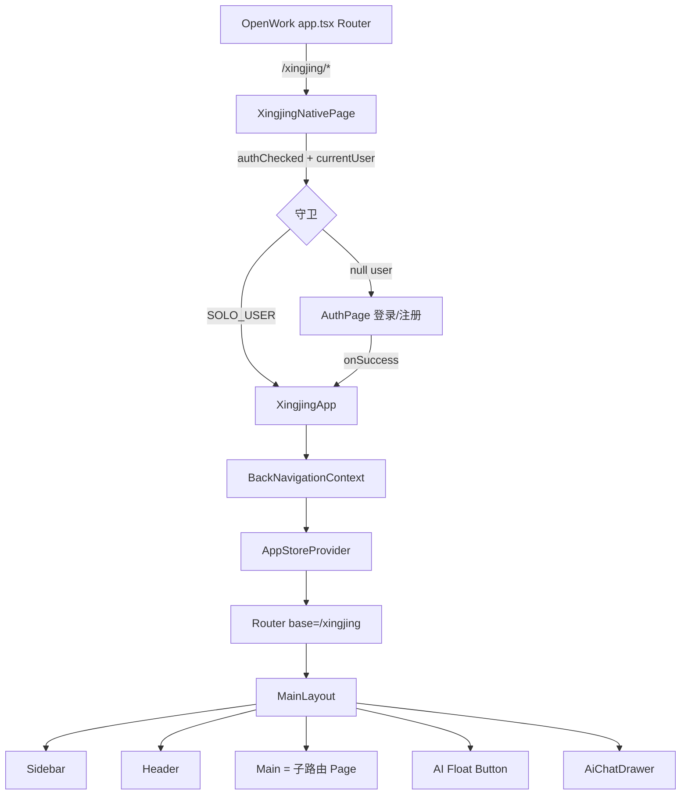
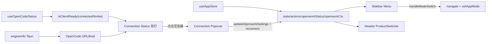
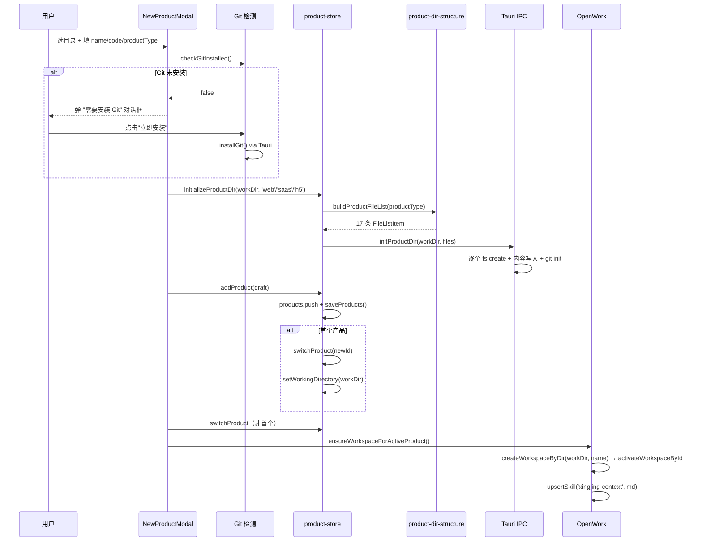
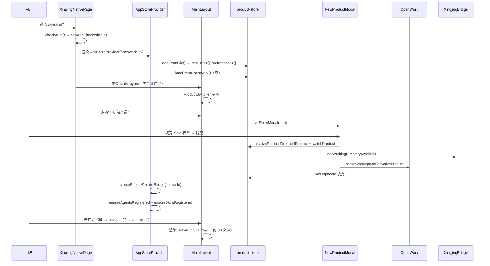
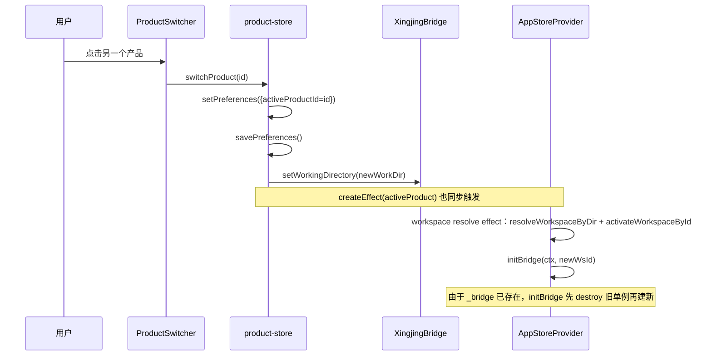

# 10 · 星静 Shell / 路由 / 布局契约

> 范围：星静独立版 Shell 层（认证门 · 产品治理 · 路由 · 主布局 · OpenWork 连接面板）
> 参考：[00 总览](./00-overview.md) · [06 星静–OpenWork 接缝契约](./06-openwork-bridge-contract.md)

> **⚠️ v0.12.0 重要变更 — 旧实现已完全移除**：
> 
> 本文档描述的旧 Shell 层（`XingjingNativePage`、`XingjingApp`、`MainLayout`、独立路由 `/xingjing`、`XingjingOpenworkContext` 46 字段注入）均**已随 SolidJS 代码一并删除**，相关源文件不再存在。
> 
> **新集成方案（React 19）**：星静 Shell 层直接复用 OpenWork 原生壳层，不再有独立的 Shell。具体分映：
> 
> | 旧功能 | 新方案 |
> |---|---|
> | 独立路由 `/xingjing` + `XingjingNativePage` | 无独立路由；星静集成进 `/session`、`/settings` 现有路由 |
> | 认证门 `AuthPage` + Solo Bypass | 复用 [`DenSigninGate`](file:///Users/umasuo_m3pro/Desktop/startup/xingjing/harnesswork/apps/app/src/react-app/shell/app-root.tsx)，无需独立认证 |
> | `ProductSwitcher` 产品切换器 | workspace 切换器扩展（`domains/workspace/`） |
> | `MainLayout` 左侧护栏 + 导航骨架 | SessionRoute 左侧栏扩展 |
> | `XingjingOpenworkContext` 46 字段 props 注入 | `useGlobalSDK()`、`useOpenworkStore()`、`useGlobalSync()` 等 React hooks |
> | 连接状态指示灯 | [`openwork-connection.ts`](file:///Users/umasuo_m3pro/Desktop/startup/xingjing/harnesswork/apps/app/src/react-app/shell/openwork-connection.ts) 已内置提供 |
> 
> **以下内容为 SolidJS v0.11.x 时代的展示模块历史设计档案**，可作产品功能设计参考，具体实现必须按 React 19 + OpenWork 原生集成方案重新设计。

---

## §1 模块定位与用户价值

星静 Shell 是用户进入星静后见到的**第一层外壳**，它承担四个职责：

| # | 职责 | 实现位置 |
|---|------|----------|
| 1 | **宿主挂载点**：把星静作为 `Router base="/xingjing"` 的子路由挂到 OpenWork 主应用上 | [XingjingNativePage](file:///Users/umasuo_m3pro/Desktop/startup/xingjing/harnesswork/apps/app/src/app/pages/xingjing-native.tsx#L106-L278) |
| 2 | **认证门**：决定是否渲染 AuthPage 还是放行进入 XingjingApp（独立版为 Solo Bypass，永真通过） | [auth-service.ts](file:///Users/umasuo_m3pro/Desktop/startup/xingjing/harnesswork/apps/app/src/app/xingjing/services/auth-service.ts#L28-L48) |
| 3 | **产品治理中心**：产品注册表、创建、切换、激活，以及活跃产品向 OpenWork workspace 的映射 | [product-store.ts](file:///Users/umasuo_m3pro/Desktop/startup/xingjing/harnesswork/apps/app/src/app/xingjing/services/product-store.ts#L88-L540) |
| 4 | **连接面板 + 导航骨架**：左侧双模菜单、顶栏 ProductSwitcher、OpenWork/OpenCode 双指示灯、邀请链接、悬浮 AI 按钮与 Drawer | [main-layout.tsx](file:///Users/umasuo_m3pro/Desktop/startup/xingjing/harnesswork/apps/app/src/app/xingjing/components/layouts/main-layout.tsx#L1-L870) |

Shell 不含任何业务逻辑（需求评审/开发工坊/知识库等均由子路由对应的独立 Page 承载）；它只负责"让用户在正确的产品上下文内，找到自己想去的那个子页面"。

---

## §2 层级结构总览

### §2.1 ASCII 层级图

```
┌────────────────────────────────────────────────────────────────────────┐
│ OpenWork 主 Router（apps/app/src/app/app.tsx）                         │
│   <Route path="/xingjing/*" component={XingjingNativePage} />          │
└────────────────────────────────────────────────────────────────────────┘
                              │  注入 14+ props（openworkServerClient / ...）
                              ▼
┌────────────────────────────────────────────────────────────────────────┐
│ XingjingNativePage（pages/xingjing-native.tsx）                        │
│                                                                         │
│   createMemo hasOpenworkClient = !!openworkServerClient                │
│   createMemo openworkCtx = { 46 字段的 XingjingOpenworkContext }       │
│                                                                         │
│   onMount → checkAuth() → setAuthChecked(true)                         │
│                                                                         │
│   ┌───────────────────────────────────────────────────────────────┐   │
│   │ <Show when={authChecked()}>                                    │   │
│   │   <Show when={currentUser()} fallback={<AuthPage/>}>           │   │
│   │     <XingjingApp openworkCtx={openworkCtx()} />                │   │
│   │   </Show>                                                       │   │
│   │ </Show>                                                         │   │
│   └───────────────────────────────────────────────────────────────┘   │
└────────────────────────────────────────────────────────────────────────┘
                              │
                              ▼
┌────────────────────────────────────────────────────────────────────────┐
│ XingjingApp（同文件 L283-L348）                                        │
│                                                                         │
│   顶部固定栏：← 返回模式选择 · 🌙 星静 · 副标题                         │
│                                                                         │
│   <BackNavigationContext.Provider value={() => outerNavigate(...)}>    │
│     <AppStoreProvider openworkCtx={props.openworkCtx}>                 │
│       <Suspense>                                                        │
│         <Router base="/xingjing" root={MainLayout}>                    │
│           <Route .../>  × 15 团队版 + 10 独立版                        │
│         </Router>                                                       │
│       </Suspense>                                                       │
│     </AppStoreProvider>                                                 │
│   </BackNavigationContext.Provider>                                     │
└────────────────────────────────────────────────────────────────────────┘
                              │
                              ▼
┌────────────────────────────────────────────────────────────────────────┐
│ MainLayout（components/layouts/main-layout.tsx）                        │
│                                                                         │
│   ┌────────────────────────┬────────────────────────────────────────┐ │
│   │ Sidebar 200px          │ Header（ProductSwitcher · 角色 · 主题） │ │
│   │  - Logo                │────────────────────────────────────────│ │
│   │  - Mode Switcher       │                                         │ │
│   │  - Menu（team/solo）   │          Main = {props.children}        │ │
│   │  - Energy Mode（solo） │                                         │ │
│   │  - Connection Status   │                                         │ │
│   │  - Connection Popover  │                                         │ │
│   └────────────────────────┴────────────────────────────────────────┘ │
│                                                                         │
│   悬浮 AI 按钮（可拖拽，position 存 LocalStorage）                     │
│   AiChatDrawer（右侧抽屉，callAgent 透传）                              │
└────────────────────────────────────────────────────────────────────────┘
```

### §2.2 Mermaid 层级关系



---

## §3 认证门

星静独立版采用 **Solo Bypass** 策略：模块加载即写入 `SOLO_USER`，`checkAuth()` 永远返回 true，AuthPage 永不会被渲染。保留登录 UI 仅为未来团队版 / 企业版预留。

### §3.1 Solo Bypass 实现

```ts
// auth-service.ts L28-L48
const SOLO_USER: AuthUser = {
  id: 'solo-user',
  email: 'solo@xingjing.local',
  name: '独立开发者',
  organizationId: 'solo-org',
  teamIds: [],
  createdAt: new Date().toISOString(),
  updatedAt: new Date().toISOString(),
};

const [currentUser] = createSignal<AuthUser | null>(SOLO_USER);
// ...
export function getAuthToken() { return 'solo-standalone-token'; }
export async function checkAuth() { return true; }
```

[auth-service.ts 完整 55 行](file:///Users/umasuo_m3pro/Desktop/startup/xingjing/harnesswork/apps/app/src/app/xingjing/services/auth-service.ts)中，`login/register/logout/updateProfile/changePassword/deleteAccount` 均为 no-op：它们不会发起任何网络请求，直接返回 `SOLO_USER` 或空值。

### §3.2 AuthPage 布局（团队版预留）

登录页采用**全屏中心卡片**样式，实现于 [pages/auth/index.tsx](file:///Users/umasuo_m3pro/Desktop/startup/xingjing/harnesswork/apps/app/src/app/xingjing/pages/auth/index.tsx#L75-L236)：

```
┌────────────────────────────────────────────────────────────────────┐
│ background: radial-gradient glow + 全屏 grid 点阵                  │
│                                                                    │
│                 ┌─────────────────────────────┐                   │
│                 │         🌙  星静            │                   │
│                 │   All-in-One 研发平台       │                   │
│                 ├─────────────────────────────┤                   │
│                 │  [  登录  ] [  注册  ]      │  ← Tabs           │
│                 ├─────────────────────────────┤                   │
│                 │  Email / Password / Name    │                   │
│                 │  [    登录 / 注册    ]      │  ← SubmitButton  │
│                 │                             │                   │
│                 │  错误提示（红色）            │                   │
│                 └─────────────────────────────┘                   │
│                       380px 宽 · 居中                              │
└────────────────────────────────────────────────────────────────────┘
```

关键组件：[`AuthPageProps.onSuccess`](file:///Users/umasuo_m3pro/Desktop/startup/xingjing/harnesswork/apps/app/src/app/xingjing/pages/auth/index.tsx#L13-L15) · [`type Tab = 'login' | 'register'`](file:///Users/umasuo_m3pro/Desktop/startup/xingjing/harnesswork/apps/app/src/app/xingjing/pages/auth/index.tsx#L17) · [`handleLogin/handleRegister`](file:///Users/umasuo_m3pro/Desktop/startup/xingjing/harnesswork/apps/app/src/app/xingjing/pages/auth/index.tsx#L41-L73) · [`Field/SubmitButton` 子组件](file:///Users/umasuo_m3pro/Desktop/startup/xingjing/harnesswork/apps/app/src/app/xingjing/pages/auth/index.tsx#L238-L288)。

> Solo Bypass 下此文件永远走不到，但保留它可让未来团队版直接恢复渲染，无需重写 Shell 守卫逻辑。

---

## §4 路由表

`XingjingApp` 内声明了 25 条子路由（[xingjing-native.tsx L311-L341](file:///Users/umasuo_m3pro/Desktop/startup/xingjing/harnesswork/apps/app/src/app/pages/xingjing-native.tsx#L311-L341)），以 `Router base="/xingjing"` 作为子 Router 挂载。

### §4.1 团队版路由（15 条）

| 路径 | Page 模块 | 功能 |
|------|-----------|------|
| `/` · `/autopilot` | [team/autopilot](file:///Users/umasuo_m3pro/Desktop/startup/xingjing/harnesswork/apps/app/src/app/pages/xingjing-native.tsx#L23) | 团队版自动驾驶入口 |
| `/planning` | team/planning | 产品规划 |
| `/requirements` | team/requirements | 需求工坊 |
| `/requirements/edit/:id` | team/requirements/prd-editor | PRD 编辑器 |
| `/design` | team/design | 设计工坊 |
| `/dev` | team/dev | 开发工坊 |
| `/dev/pr/:taskId` | team/dev/pr-submit | PR 提交页 |
| `/sprint` | team/sprint | Sprint 中心 |
| `/sprint/plan` | team/sprint/sprint-plan | Sprint 规划 |
| `/quality` | team/quality | 质量中心 |
| `/release-ops` | team/release-ops | 发布运维 |
| `/dashboard` | team/dashboard | 仪表盘 |
| `/knowledge` | team/knowledge | 知识中心 |
| `/agent-workshop` | team/agent-workshop | Agent 工坊 |
| `/settings` | pages/settings | 设置 |

### §4.2 独立版路由（10 条）

| 路径 | Page 模块 | 对应业务文档 |
|------|-----------|--------------|
| `/solo` · `/solo/autopilot` | solo/autopilot | [30 自动驾驶](./30-autopilot.md) |
| `/solo/focus` | solo/focus | 专注模式（不在本次文档范围） |
| `/solo/product` | solo/product | [50 产品模式](./50-product-mode.md) |
| `/solo/build` | solo/build | 构建（由 50 覆盖） |
| `/solo/release` | solo/release | 发布（由 50 覆盖） |
| `/solo/review` | solo/review | [70 复盘](./70-review.md) |
| `/solo/knowledge` | solo/knowledge | [60 知识库](./60-knowledge-base.md) |
| `/solo/agent-workshop` | solo/agent-workshop | [40 Agent 工坊](./40-agent-workshop.md) |
| `/solo/settings` | pages/settings | [80 设置](./80-settings.md) |

### §4.3 BackNavigationContext

Shell 需要提供一个"返回模式选择"按钮（在 OpenWork /mode-select 路由下选择"星静"之后进入），但 MainLayout 处于子 Router 内部，无法访问外层 `useNavigate()`。解决方案：

```ts
// main-layout.tsx L9-L19
export const BackNavigationContext = createContext<() => void>(
  () => {
    // 默认降级：如果外层未提供 navigate，使用 hash 跳转
    if (typeof window !== 'undefined') {
      window.location.hash = '/mode-select';
    }
  }
);
```

[XingjingApp L304](file:///Users/umasuo_m3pro/Desktop/startup/xingjing/harnesswork/apps/app/src/app/pages/xingjing-native.tsx#L304) 通过 `<BackNavigationContext.Provider value={() => outerNavigate('/mode-select')}>` 注入外层 navigate；MainLayout 通过 `useContext(BackNavigationContext)` 消费。若将来 Shell 被单独渲染（非 OpenWork 宿主），默认 hash 跳转兜底保证不崩溃。

---

## §5 MainLayout 布局骨架

### §5.1 ASCII 三区布局

```
┌──────────────────────────────────────────────────────────────────────┐
│ 顶部 Header（h-14，border-b）                                         │
│  ProductSwitcher ── 角色选择（团队版）── 主题切换 ── Avatar           │
├─────────┬────────────────────────────────────────────────────────────┤
│ Sidebar │                                                            │
│ 200px   │                                                            │
│         │                                                            │
│  🌙     │                                                            │
│  星静   │                                                            │
│         │                                                            │
│ [模式]  │                    Main = {props.children}                │
│ ──      │                                                            │
│ 📋 自动 │                                                            │
│ 🚀 ..   │                                                            │
│ 🤖 Agent│                                                            │
│ ⚙ 设置  │                                                            │
│ ──      │                                                            │
│ [能量]  │                                                            │
│ ──      │                                                            │
│ 🟢 OW   │                                                            │
│ 🟢 OC   │                                                            │
└─────────┴────────────────────────────────────────────────────────────┘
                                              ⊕ AI Float Button（可拖拽）
                                              ┌── AiChatDrawer（右抽屉）
```

### §5.2 Mermaid 数据流



[useAppStore/useOpenCodeStatus/engineInfo 入口](file:///Users/umasuo_m3pro/Desktop/startup/xingjing/harnesswork/apps/app/src/app/xingjing/components/layouts/main-layout.tsx#L100-L102)。

---

## §6 双模菜单与模式切换

Shell 同时承载"团队版"与"独立版"两套菜单，通过 `state.appMode` 切换；每套菜单都是**带分组的路径表 + 对应 SVG 图标**。

### §6.1 菜单定义

- [团队版 `teamMenuItems` L52-L72](file:///Users/umasuo_m3pro/Desktop/startup/xingjing/harnesswork/apps/app/src/app/xingjing/components/layouts/main-layout.tsx#L52-L72)：**自动驾驶**分组（10 条：规划/需求/设计/开发/Sprint/质量/发布/仪表盘/知识中心）+ AI 搭档 + 设置
- [独立版 `soloMenuItems` L74-L92](file:///Users/umasuo_m3pro/Desktop/startup/xingjing/harnesswork/apps/app/src/app/xingjing/components/layouts/main-layout.tsx#L74-L92)：**自动驾驶**分组（7 条：产品/构建/发布/复盘/专注/知识库 等）+ AI 搭档 + 设置

### §6.2 路径匹配规则

MainLayout 需要解决"Router base 前缀"问题：`useLocation()` 返回的是 `/xingjing/solo/autopilot`，而菜单里写的是 `/solo/autopilot`。通过 [`normPath()`](file:///Users/umasuo_m3pro/Desktop/startup/xingjing/harnesswork/apps/app/src/app/xingjing/components/layouts/main-layout.tsx#L229-L236) 归一化：

```ts
const ROUTER_BASE = '/xingjing';
const normPath = (p: string) =>
  p.startsWith(ROUTER_BASE) ? p.slice(ROUTER_BASE.length) || '/' : p;

const isActive = (path: string) => normPath(location.pathname) === path;
const isGroupActive = (items: MenuItem[]) =>
  items.some((it) => isActive(it.path));
```

活跃项样式在 [`activeItemClass` L249-L252](file:///Users/umasuo_m3pro/Desktop/startup/xingjing/harnesswork/apps/app/src/app/xingjing/components/layouts/main-layout.tsx#L249-L252) 按 Solo（绿色）/Team（紫色）区分。

### §6.3 handleModeSwitch 行为

用户点击左上"团队版 / 独立版"切换器时触发：

```ts
// main-layout.tsx L263-L272
const handleModeSwitch = (mode: 'team' | 'solo') => {
  if (state.appMode === mode) return;
  actions.setAppMode(mode);
  // 自动跳转到对应模式的默认路径
  navigate(mode === 'solo' ? '/solo/autopilot' : '/autopilot');
  // 默认展开自动驾驶分组
  setExpandedGroups(new Set(['autopilot']));
};
```

进入时的初始模式判定（[`onMount` L290-L304](file:///Users/umasuo_m3pro/Desktop/startup/xingjing/harnesswork/apps/app/src/app/xingjing/components/layouts/main-layout.tsx#L290-L304)）：若当前路径以 `/solo` 开头 → `appMode='solo'`；否则 `appMode='team'` 且 `navigate('/autopilot')`。

---

## §7 产品注册表与 ProductSwitcher

### §7.1 数据模型

```ts
// product-store.ts L19-L68
interface XingjingProduct {
  id: string;              // prod-${Date.now()}
  name: string;
  code: string;            // 英文数字编码
  workDir: string;         // 绝对路径
  createdAt: string;
  updatedAt: string;
  productType?: 'team' | 'solo';
  teamStructure?: TeamStructure;  // 仅团队版
  _workspaceId?: string;   // OpenWork 动态映射（非持久化）
}

interface XingjingPreferences {
  activeProductId?: string;
  viewMode?: 'team' | 'solo';
}
```

持久化位置（均为 YAML）：

| 文件 | 内容 |
|------|------|
| `~/.xingjing/products.yaml` | 产品列表（XingjingProduct 数组） |
| `~/.xingjing/preferences.yaml` | `activeProductId` · `viewMode` |

路径常量定义于 [product-store.ts L82-L83](file:///Users/umasuo_m3pro/Desktop/startup/xingjing/harnesswork/apps/app/src/app/xingjing/services/product-store.ts#L82-L83)。

### §7.2 Store 核心 API

[`createProductStore()` L88-L540](file:///Users/umasuo_m3pro/Desktop/startup/xingjing/harnesswork/apps/app/src/app/xingjing/services/product-store.ts#L88-L540) 返回一系列 signals + 操作函数：

| API | 职责 |
|-----|------|
| `loadFromFile()` | 启动时从 YAML 读取 products 与 preferences |
| `loadFromOpenWork()` | 逐条 `resolveWorkspaceByDir(product.workDir)`，填充 `_workspaceId` |
| `addProduct(draft)` | `id=prod-${Date.now()}`，首条自动激活 |
| `addProductWithOpenwork(draft, ctx)` | 在 addProduct 基础上 `createWorkspaceByDir` + 首次 `upsertSkill('xingjing-context', md)` |
| `removeProduct(id)` | 移除；若删的是活跃产品则自动切到下一个 |
| `switchProduct(id)` | 更新 `updatedAt` + 写 preferences + **调 `setWorkingDirectory(workDir)` 通知 Bridge** |
| `setViewMode(mode)` | 切换 team/solo；若目标模式无产品则置空活跃产品 |
| `initializeProductDir(workDir, productType)` | Solo 骨架落盘 |
| `initializeTeamProduct(draft)` | Team 多仓库骨架 + 3 次 git init |

### §7.3 Side Effect：activeProduct → setWorkingDirectory

```ts
// product-store.ts L510-L515
createEffect(() => {
  const p = activeProduct();
  if (p?.workDir) setWorkingDirectory(p.workDir);
});
```

这是星静"产品切换 → Bridge 工作目录变更"的**唯一**链路。下游 [XingjingBridge](./06-openwork-bridge-contract.md#§5) 读 `getWorkingDirectory()` 作为所有 fileOps / session 的目标路径。

### §7.4 ProductSwitcher UI

[`components/product/product-switcher.tsx`](file:///Users/umasuo_m3pro/Desktop/startup/xingjing/harnesswork/apps/app/src/app/xingjing/components/product/product-switcher.tsx) 是顶栏左侧的产品下拉：

```
[ 🌙 当前产品名 ▼ ]  ← w-140px，点击展开
     │
     ▼
┌───────────────────────────┐
│  ▌产品列表                │
│  ─────────────────────    │
│  ✓ 产品 A     （活跃）    │
│    产品 B                 │
│    产品 C                 │
│  ─────────────────────    │
│  + 新建产品                │
└───────────────────────────┘
```

- [触发按钮 + Backdrop + Dropdown L28-L115](file:///Users/umasuo_m3pro/Desktop/startup/xingjing/harnesswork/apps/app/src/app/xingjing/components/product/product-switcher.tsx#L28-L115)
- [空状态 "No data" L59-L77](file:///Users/umasuo_m3pro/Desktop/startup/xingjing/harnesswork/apps/app/src/app/xingjing/components/product/product-switcher.tsx#L59-L77)
- [产品 For 迭代 + ✓ 标记 L81-L100](file:///Users/umasuo_m3pro/Desktop/startup/xingjing/harnesswork/apps/app/src/app/xingjing/components/product/product-switcher.tsx#L81-L100)
- [新建产品按钮触发 NewProductModal L118-L121](file:///Users/umasuo_m3pro/Desktop/startup/xingjing/harnesswork/apps/app/src/app/xingjing/components/product/product-switcher.tsx#L118-L121)

---

## §8 产品创建：双流分叉

[`NewProductModal`](file:///Users/umasuo_m3pro/Desktop/startup/xingjing/harnesswork/apps/app/src/app/xingjing/components/product/new-product-modal.tsx) 统一承载"新建产品"弹窗，内部按 `productType` 分流：

### §8.1 双流对照

| 维度 | Solo（独立版） | Team（团队版） |
|------|----------------|----------------|
| 仓库结构 | **Monorepo**：单 `workDir` 下 17 个文件/目录 | **多仓库**：父目录下 3 个独立子仓库（pl + domain + app） |
| 必填字段 | `name` · `code` · `workDir` · `productType: web/saas/h5` | `name` · `code` · `workDir`（父目录） · domainName · domainCode · firstAppName · firstAppCode |
| 骨架落盘 | [`initializeProductDir()`](file:///Users/umasuo_m3pro/Desktop/startup/xingjing/harnesswork/apps/app/src/app/xingjing/services/product-store.ts#L325-L336) → Tauri `initProductDir(workDir, buildProductFileList(...))` | [`initializeTeamProduct()`](file:///Users/umasuo_m3pro/Desktop/startup/xingjing/harnesswork/apps/app/src/app/xingjing/services/product-store.ts#L343-L418) → 3 次 `initProductDir` + 3 次 git init |
| Git 卡片数 | 1（主仓库） | 3（产品线/Domain/App 各一个 GitInputRow） |
| workspace 映射 | `ensureWorkspaceForActiveProduct()` 仅对根目录建 workspace | 仅对父目录建 workspace（子仓库由业务 Page 自行激活） |

### §8.2 Solo 流程（doCreateProduct solo 分支 L132-L152）



### §8.3 Team 流程（doCreateProduct team 分支 L153-L180）

步骤类似 Solo，但 `initializeTeamProduct()` 会：

1. 在父目录下写 [`buildTeamRootConfig(...)` L956](file:///Users/umasuo_m3pro/Desktop/startup/xingjing/harnesswork/apps/app/src/app/xingjing/services/product-dir-structure.ts#L956) 产出的 `.xingjing/team-config.yaml`；
2. 创建 `${code}-pl` 子目录 + [`buildTeamProductLineFiles(...)` L816](file:///Users/umasuo_m3pro/Desktop/startup/xingjing/harnesswork/apps/app/src/app/xingjing/services/product-dir-structure.ts#L816) + `git init`；
3. 创建 `${domainCode}` 子目录 + [`buildTeamDomainFiles(...)` L870](file:///Users/umasuo_m3pro/Desktop/startup/xingjing/harnesswork/apps/app/src/app/xingjing/services/product-dir-structure.ts#L870) + `git init`；
4. 创建 `${firstAppCode}` 子目录 + [`buildTeamAppFiles(...)` L913](file:///Users/umasuo_m3pro/Desktop/startup/xingjing/harnesswork/apps/app/src/app/xingjing/services/product-dir-structure.ts#L913) + `git init`。

每次失败都可降级为"目录已创建但 git init 失败"，UI 仍继续流程（[product-store.ts L391-L411](file:///Users/umasuo_m3pro/Desktop/startup/xingjing/harnesswork/apps/app/src/app/xingjing/services/product-store.ts#L391-L411) 用 try-catch 吞异常）。

### §8.4 Solo Monorepo 目录骨架（17 条）

`buildProductFileList(productType)` 的返回值（[product-dir-structure.ts L1575-L1629](file:///Users/umasuo_m3pro/Desktop/startup/xingjing/harnesswork/apps/app/src/app/xingjing/services/product-dir-structure.ts#L1575-L1629)）：

```
<workDir>/
├── .xingjing/
│   ├── config.yaml           ← 产品元数据
│   └── dir-graph.yaml        ← 目录图谱（Autopilot 读）
├── product/
│   ├── overview.md           ← 产品概述
│   ├── roadmap.md            ← 路线图
│   ├── features/_index.yml   ← 特性索引
│   └── backlog.yaml          ← Backlog
├── iterations/
│   ├── hypotheses/_index.yml ← 假设池
│   ├── tasks/_index.yml      ← 任务池
│   ├── releases/.gitkeep     ← 发布记录
│   ├── archive/.gitkeep      ← 归档
│   └── feedbacks/.gitkeep    ← 反馈
├── knowledge/
│   ├── _index.yml
│   ├── pitfalls/.gitkeep     ← 踩坑
│   ├── insights/.gitkeep     ← 洞察
│   └── tech-notes/.gitkeep   ← 技术笔记
├── focus.yml                 ← 专注模式状态
├── metrics.yml               ← 度量
├── feature-flags.yml         ← 特性开关
├── adrs.yml                  ← ADR 记录
├── code/.gitkeep             ← 代码区（50 产品模式读）
└── .opencode/                ← Solo Knowledge Agent（buildSoloKnowledgeAgentFiles）
```

业务层各模块对这些文件的读写规则详见 [30 自动驾驶](./30-autopilot.md) · [50 产品模式](./50-product-mode.md) · [60 知识库](./60-knowledge-base.md) · [70 复盘](./70-review.md)。

### §8.5 Git 安装检测与安装

[NewProductModal L88-L125](file:///Users/umasuo_m3pro/Desktop/startup/xingjing/harnesswork/apps/app/src/app/xingjing/components/product/new-product-modal.tsx#L88-L125) 提交时先 `checkGitInstalled()`；若 false，弹出 [`showGitInstallDialog` L249-L294](file:///Users/umasuo_m3pro/Desktop/startup/xingjing/harnesswork/apps/app/src/app/xingjing/components/product/new-product-modal.tsx#L249-L294)；用户点击"立即安装"调用 [`handleConfirmInstallGit` L198-L213](file:///Users/umasuo_m3pro/Desktop/startup/xingjing/harnesswork/apps/app/src/app/xingjing/components/product/new-product-modal.tsx#L198-L213) 执行 `installGit()`，成功后才继续 `doCreateProduct()`。

### §8.6 Web vs Tauri 目录选择

[`handlePickDir` L68-L85](file:///Users/umasuo_m3pro/Desktop/startup/xingjing/harnesswork/apps/app/src/app/xingjing/components/product/new-product-modal.tsx#L68-L85)：
- **Tauri 环境**：调用 `pickDirectory()` 弹原生目录选择器；
- **Web 环境**：触发 `<input type="file" webkitdirectory>`，从 `webkitRelativePath` 拼出相对路径。

Web 下的"工作目录"实际上只是相对文件路径，无法进行真实 Tauri fs 写入，所以产品创建在 Web 下实际会在 `initProductDir` 这一步降级失败，但 UI 不会崩溃——用户看到的是"创建失败，请重试"错误提示（[handleSubmit catch L190-L192](file:///Users/umasuo_m3pro/Desktop/startup/xingjing/harnesswork/apps/app/src/app/xingjing/components/product/new-product-modal.tsx#L190-L192)）。

---

## §9 连接状态与 OpenWork 配置面板

Shell 左下角的**双灯 + Popover** 是独立版与 OpenWork 宿主的交互控制面板，位于 [main-layout.tsx L617-L754](file:///Users/umasuo_m3pro/Desktop/startup/xingjing/harnesswork/apps/app/src/app/xingjing/components/layouts/main-layout.tsx#L617-L754)。

### §9.1 双指示灯语义

| 灯 | 状态来源 | 颜色映射 |
|----|----------|----------|
| **OpenWork** | `openworkStatus()` from `useAppStore` | `connected` → 绿 · `limited` → 琥珀 · `disconnected` → 红 |
| **OpenCode** | `useOpenCodeStatus().isClientReady/connected` | 已就绪 → 绿 · 受限/未就绪 → 琥珀/灰 |

两灯分别对应"是否能调 OpenWork 受约束 API（Skill/Workspace/File）"与"是否能发起 session/prompt"。详见 [06 接缝契约 §5](./06-openwork-bridge-contract.md#§5)。

### §9.2 交互规则

- **任一灯为红/灰时**：点击整个连接状态区 → 弹 Popover
- **双灯都为绿时**：点击 → 复制邀请链接到剪贴板

### §9.3 Connection Popover 内容

[Popover L524-L615](file:///Users/umasuo_m3pro/Desktop/startup/xingjing/harnesswork/apps/app/src/app/xingjing/components/layouts/main-layout.tsx#L524-L615) 提供三件事：

1. **OpenWork Server 地址**输入（`urlOverride`）
2. **Token** 输入（`token`）
3. 点击"应用并重连" → 调 `openworkCtx.updateOpenworkSettings({ urlOverride, token })` 再调 `openworkCtx.reconnect()`

这两个函数均由 XingjingNativePage 经 openworkCtx 透传，最终落到 OpenWork 的 settings store 与 SSE reconnect 流程；详见 [05f OpenWork Settings](./05f-openwork-settings-persistence.md) 与 [05g OpenWork Process Runtime](./05g-openwork-process-runtime.md)。

### §9.4 邀请链接生成

[`buildInviteUrl` L130-L142](file:///Users/umasuo_m3pro/Desktop/startup/xingjing/harnesswork/apps/app/src/app/xingjing/components/layouts/main-layout.tsx#L130-L142)：

```
${origin}/xingjing?ow_url=${encodeURI(baseUrl)}
                  &ow_token=${encodeURI(token)}
                  &ow_startup=server
                  &ow_auto_connect=1
```

把当前用户的 OpenWork 连接信息编码为 URL，复制后让另一台设备（或团队成员）打开即可自动连接到同一个 OpenWork 实例。

### §9.5 OpenCode Engine Info

[`engineInfo()` onMount L195-L202](file:///Users/umasuo_m3pro/Desktop/startup/xingjing/harnesswork/apps/app/src/app/xingjing/components/layouts/main-layout.tsx#L195-L202)：

在 Tauri 环境下，Shell 启动时调用 Tauri IPC 读取 OpenCode 进程信息（URL、kind），展示在 OpenCode 灯旁边作为辅助诊断。Web 环境下此函数不执行，字段空缺。

---

## §10 顶栏与主题

### §10.1 Header 结构

[Header L773-L823](file:///Users/umasuo_m3pro/Desktop/startup/xingjing/harnesswork/apps/app/src/app/xingjing/components/layouts/main-layout.tsx#L773-L823) 从左到右：

| 元素 | 行为 |
|------|------|
| ProductSwitcher | 见 §7.4 |
| 角色选择器（仅团队版） | 产品经理 · 架构师 等，切 `state.activeRole` |
| 主题切换（🌞/🌙） | `actions.setThemeMode('light'/'dark')` |
| Avatar | `currentUser().name` 首字母圆圈（Solo Bypass 下永远显示"独"） |

### §10.2 主题应用

[theme effect L216-L223](file:///Users/umasuo_m3pro/Desktop/startup/xingjing/harnesswork/apps/app/src/app/xingjing/components/layouts/main-layout.tsx#L216-L223)：

```ts
createEffect(() => {
  const root = document.documentElement;
  root.setAttribute('data-theme', state.themeMode); // 'light' | 'dark'
});
```

CSS 变量 `--dls-*` 在 OpenWork 的根样式表中按 `[data-theme='dark']` 切换，覆盖所有组件。

### §10.3 Logo 点击导航

[Logo L320-L337](file:///Users/umasuo_m3pro/Desktop/startup/xingjing/harnesswork/apps/app/src/app/xingjing/components/layouts/main-layout.tsx#L320-L337)：

- 当前 `appMode='solo'` → 点击跳 `/solo/focus`（专注模式，独立版首屏）
- 当前 `appMode='team'` → 点击跳 `/autopilot`（团队版首屏）

---

## §11 悬浮 AI 按钮与 AiChatDrawer

### §11.1 悬浮按钮

[Float Button L147-L192](file:///Users/umasuo_m3pro/Desktop/startup/xingjing/harnesswork/apps/app/src/app/xingjing/components/layouts/main-layout.tsx#L147-L192) 是一颗 56×56 的可拖拽紫色圆按钮：

- 位置持久化到 `localStorage.ai-float-btn-pos`（`{x,y}` 像素）
- 拖拽判定：`hasMoved > 4px` 视为拖拽，否则视为点击
- 点击 → `setAiDrawerOpen(true)` 打开右侧抽屉

`aiDrawerOpen` 是 [模块级 signal L95](file:///Users/umasuo_m3pro/Desktop/startup/xingjing/harnesswork/apps/app/src/app/xingjing/components/layouts/main-layout.tsx#L95)，跨组件共享。

### §11.2 AiChatDrawer

[AiChatDrawer L855-L864](file:///Users/umasuo_m3pro/Desktop/startup/xingjing/harnesswork/apps/app/src/app/xingjing/components/layouts/main-layout.tsx#L855-L864) 只接收两个 prop：

```tsx
<AiChatDrawer
  open={aiDrawerOpen()}
  onClose={() => setAiDrawerOpen(false)}
  callAgentFn={actions.callAgent}
/>
```

所有业务由 Drawer 内部自管：session、messages、发送、流式。`callAgentFn` 完全复用 [AppStore.actions.callAgent](./06-openwork-bridge-contract.md#§6)，与 Autopilot / 各业务 Page 走同一条管线。

### §11.3 名言轮播

[slogans L205-L213](file:///Users/umasuo_m3pro/Desktop/startup/xingjing/harnesswork/apps/app/src/app/xingjing/components/layouts/main-layout.tsx#L205-L213)：Sidebar 底部 6 条名言每 10 秒轮换一条（`setInterval` + `setSloganIdx`），纯装饰性，onCleanup 自动 clearInterval。

---

## §12 OpenWork 集成点清单

Shell 内直接调用 `openworkCtx` 或 `state.actions` 背后的 OpenWork 能力，全部列表如下（对应文件 / 行号可直接跳转）：

| # | 集成点 | 调用位置 | 用途 |
|---|--------|----------|------|
| 1 | `openworkCtx.serverBaseUrl()` | [main-layout L530](file:///Users/umasuo_m3pro/Desktop/startup/xingjing/harnesswork/apps/app/src/app/xingjing/components/layouts/main-layout.tsx#L530) | Popover 输入框默认值 |
| 2 | `openworkCtx.currentOpenworkToken()` | Popover + 邀请链接 | token 回填 / 拼 ow_token |
| 3 | `openworkCtx.updateOpenworkSettings({urlOverride, token})` | Popover "应用并重连" | 写入 OpenWork settings store |
| 4 | `openworkCtx.reconnect()` | Popover "应用并重连" | 触发 SSE reconnect |
| 5 | `openworkCtx.resolveWorkspaceByDir(workDir)` | `productStore.loadFromOpenWork()` L129-L150 | 产品启动时填 `_workspaceId` |
| 6 | `openworkCtx.createWorkspaceByDir(workDir, name)` | `addProductWithOpenwork()` L187-L242 | 新建产品时建 workspace |
| 7 | `openworkCtx.upsertSkill('xingjing-context', md)` | `addProductWithOpenwork()` L227 | 首次写入产品 context skill |
| 8 | `openworkCtx.activateWorkspaceById(wsId)` | `ensureWorkspaceForActiveProduct()`（AppStore） | 切产品时激活 workspace |
| 9 | `actions.callAgent(...)` | Float Button / AiChatDrawer | 右侧 Drawer 发送消息 |
| 10 | `engineInfo()` Tauri IPC | onMount L195-L202 | 读 OpenCode URL/kind |
| 11 | `state.openworkStatus()` | Connection Status 灯 | 渲染 OpenWork 状态 |
| 12 | `useOpenCodeStatus()` | Connection Status 灯 | 渲染 OpenCode 状态 |
| 13 | `BackNavigationContext` | Header "← 返回模式选择" | 外层 outerNavigate 透传 |

所有这些调用在 `openworkCtx === undefined` 或对应字段缺失时都会走降级分支（空数组 / null / no-op），Shell 本身不会崩溃。详见 [06 接缝契约 §10 降级矩阵](./06-openwork-bridge-contract.md#§10)。

---

## §13 数据持久化与 LocalStorage

### §13.1 YAML 文件（Tauri fs）

| 文件 | 触发写入的时机 | 读取时机 |
|------|----------------|----------|
| `~/.xingjing/products.yaml` | `addProduct / removeProduct / switchProduct / updateProduct` | `loadFromFile()` on Shell boot |
| `~/.xingjing/preferences.yaml` | `switchProduct / setViewMode` | 同上 |

两者的读写函数 [`loadFromFile` L103-L127](file:///Users/umasuo_m3pro/Desktop/startup/xingjing/harnesswork/apps/app/src/app/xingjing/services/product-store.ts#L103-L127) · [`saveProducts/savePreferences` L153-L159](file:///Users/umasuo_m3pro/Desktop/startup/xingjing/harnesswork/apps/app/src/app/xingjing/services/product-store.ts#L153-L159) 通过 Tauri IPC 读写文件系统；Web 环境降级为 no-op（读返回空，写忽略）。

### §13.2 LocalStorage

| Key | 内容 | 用途 |
|-----|------|------|
| `ai-float-btn-pos` | `{"x":1234,"y":567}` JSON | 悬浮 AI 按钮位置 |
| `xingjing:git-tokens` | `Record<platform, token>` | Git 平台 token 缓存（github/gitlab/gitee 等） |

[Git Token API L544-L575](file:///Users/umasuo_m3pro/Desktop/startup/xingjing/harnesswork/apps/app/src/app/xingjing/services/product-store.ts#L544-L575) 提供 `getGitToken/setGitToken/clearGitToken/getAllGitTokens` 四个函数，供 NewProductModal 的 GitInputRow 保存 token 后续使用。

### §13.3 XingjingProduct 中的非持久字段

`_workspaceId` 以下划线开头，**不**被 YAML 序列化；它在每次 `loadFromOpenWork()` 时由 `resolveWorkspaceByDir` 动态填充，表示"这个产品目录在 OpenWork 侧对应的 workspace ID"。这样避免了 products.yaml 被跨机器/跨 workspace 复用时 ID 不一致的问题。

---

## §14 错误降级矩阵

| 场景 | 降级策略 | 代码位置 |
|------|----------|----------|
| OpenWork 未连接（`openworkServerClient` 为 null） | `hasOpenworkClient=false`，openworkCtx 整体 undefined；Shell 照常渲染，产品创建会走纯本地分支（不建 workspace） | [xingjing-native L121-L252](file:///Users/umasuo_m3pro/Desktop/startup/xingjing/harnesswork/apps/app/src/app/pages/xingjing-native.tsx#L121-L252) |
| Git 未安装 | 弹 "需要安装 Git" 对话框，调 `installGit()`；失败则允许用户手动安装后重试 | [new-product-modal L249-L294](file:///Users/umasuo_m3pro/Desktop/startup/xingjing/harnesswork/apps/app/src/app/xingjing/components/product/new-product-modal.tsx#L249-L294) |
| `createWorkspaceByDir` 失败 | `ensureWorkspaceForActiveProduct().catch(() => null)` 静默吞异常；产品已创建但 `_workspaceId` 为空，后续业务 Page 调 `ensureWorkspaceForActiveProduct()` 重试 | [new-product-modal L186](file:///Users/umasuo_m3pro/Desktop/startup/xingjing/harnesswork/apps/app/src/app/xingjing/components/product/new-product-modal.tsx#L186) |
| Tauri `initProductDir` 失败 | try-catch 抛回 `handleSubmit`，设 `error` state 显示红色提示 | [new-product-modal L190-L192](file:///Users/umasuo_m3pro/Desktop/startup/xingjing/harnesswork/apps/app/src/app/xingjing/components/product/new-product-modal.tsx#L190-L192) |
| Team 版中某个子仓库 git init 失败 | 吞异常继续下一个，用户可稍后手动 git init | [product-store L391-L411](file:///Users/umasuo_m3pro/Desktop/startup/xingjing/harnesswork/apps/app/src/app/xingjing/services/product-store.ts#L391-L411) |
| Web 环境下 `pickDirectory` 不可用 | 使用 `<input webkitdirectory>` 降级，拿 `webkitRelativePath` 拼路径 | [new-product-modal L68-L85](file:///Users/umasuo_m3pro/Desktop/startup/xingjing/harnesswork/apps/app/src/app/xingjing/components/product/new-product-modal.tsx#L68-L85) |
| Solo 产品 `ensureSkillsRegistered` 失败 | 不阻断产品创建；后续 Autopilot 调时再次尝试 | 间接链路，见 [06 §3](./06-openwork-bridge-contract.md#§3) |
| BackNavigationContext 未注入（Shell 被单独渲染） | 默认 `window.location.hash = '/mode-select'` | [main-layout L9-L19](file:///Users/umasuo_m3pro/Desktop/startup/xingjing/harnesswork/apps/app/src/app/xingjing/components/layouts/main-layout.tsx#L9-L19) |
| `checkAuth()` 失败（未来联网版） | `finally(setAuthChecked(true))` 保证不卡在"验证身份中..."；currentUser 为空时渲染 AuthPage | [xingjing-native L257-L278](file:///Users/umasuo_m3pro/Desktop/startup/xingjing/harnesswork/apps/app/src/app/pages/xingjing-native.tsx#L257-L278) |

---

## §15 关键交互时序

### §15.1 首次启动 → 产品创建 → Autopilot



### §15.2 产品切换



---

## §16 与其他文档的边界

| 文档 | 职责 |
|------|------|
| [00 总览](./00-overview.md) | 整个星静系统各模块的一页地图 |
| [05x · 05h OpenWork 平台](./05-openwork-platform-overview.md) | OpenWork 侧的 session / skill / workspace / model / permission / settings / runtime / state 总计 8 篇 |
| [06 接缝契约](./06-openwork-bridge-contract.md) | XingjingNativePage → AppStoreProvider → XingjingBridge 三段接缝的详细注入面 / 事件契约 / 降级 |
| **本文（10 Shell）** | **Shell 层本身**：认证门 · 路由表 · 菜单 · ProductSwitcher · 产品创建 · 连接面板 · 主题 · 悬浮按钮 |
| [30 自动驾驶](./30-autopilot.md) | `/solo/autopilot` 页面业务逻辑 |
| [40 Agent 工坊](./40-agent-workshop.md) | `/solo/agent-workshop` |
| [50 产品模式](./50-product-mode.md) | `/solo/product` · `/solo/build` · `/solo/release` |
| [60 知识库](./60-knowledge-base.md) | `/solo/knowledge` |
| [70 复盘](./70-review.md) | `/solo/review` |
| [80 设置](./80-settings.md) | `/solo/settings` |

> Shell 文档（本文）**不**包含任何业务 Page 的实现细节；各业务 Page 只通过"某路径进入"与本文产生耦合，具体做什么由 30-80 文档独立描述。

---

## §17 代码资产清单（本文档引用的全部文件）

| 绝对路径 | 角色 |
|----------|------|
| [pages/xingjing-native.tsx](file:///Users/umasuo_m3pro/Desktop/startup/xingjing/harnesswork/apps/app/src/app/pages/xingjing-native.tsx) | Shell 入口 + 25 条路由 + openworkCtx 注入 |
| [xingjing/services/auth-service.ts](file:///Users/umasuo_m3pro/Desktop/startup/xingjing/harnesswork/apps/app/src/app/xingjing/services/auth-service.ts) | Solo Bypass 认证 |
| [xingjing/pages/auth/index.tsx](file:///Users/umasuo_m3pro/Desktop/startup/xingjing/harnesswork/apps/app/src/app/xingjing/pages/auth/index.tsx) | 登录/注册 UI（团队版预留） |
| [xingjing/components/layouts/main-layout.tsx](file:///Users/umasuo_m3pro/Desktop/startup/xingjing/harnesswork/apps/app/src/app/xingjing/components/layouts/main-layout.tsx) | 主骨架（Sidebar · Header · Main · Float · Drawer · Connection Popover） |
| [xingjing/components/product/product-switcher.tsx](file:///Users/umasuo_m3pro/Desktop/startup/xingjing/harnesswork/apps/app/src/app/xingjing/components/product/product-switcher.tsx) | 顶栏产品切换器 |
| [xingjing/components/product/new-product-modal.tsx](file:///Users/umasuo_m3pro/Desktop/startup/xingjing/harnesswork/apps/app/src/app/xingjing/components/product/new-product-modal.tsx) | 产品创建弹窗（双流 · Git 检测） |
| [xingjing/services/product-store.ts](file:///Users/umasuo_m3pro/Desktop/startup/xingjing/harnesswork/apps/app/src/app/xingjing/services/product-store.ts) | 产品注册表 · preferences · initializeProductDir / initializeTeamProduct · Git Token |
| [xingjing/services/product-dir-structure.ts](file:///Users/umasuo_m3pro/Desktop/startup/xingjing/harnesswork/apps/app/src/app/xingjing/services/product-dir-structure.ts) | Solo Monorepo 骨架清单 + 4 个 `buildTeam*` 函数 |
| [xingjing/stores/app-store.tsx](file:///Users/umasuo_m3pro/Desktop/startup/xingjing/harnesswork/apps/app/src/app/xingjing/stores/app-store.tsx) | AppStoreProvider（详见 06） |

---

*本文档仅依据上述代码撰写，未参考任何已有 Markdown 资料。*
