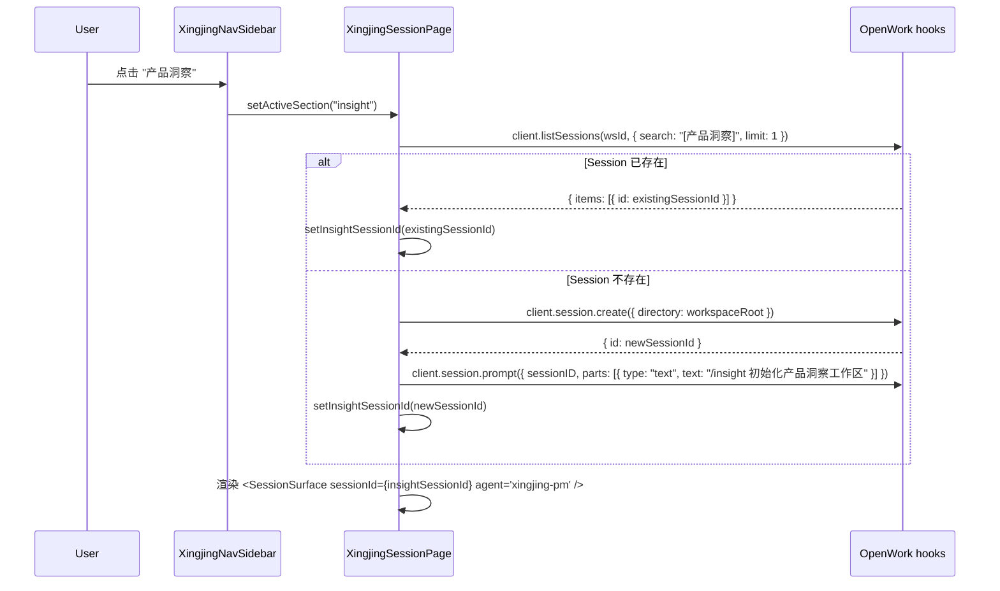

# 10 · 星静壳层设计

> 范围：星静在 OpenWork React 19 + Electron 架构中的完整壳层形态——入口路由、布局结构、各功能区设计、数据层接入方式。
>
> 配套阅读：[00 总览](./00-overview.md) · [06 对接契约](./06-openwork-bridge-contract.md) · [30 Autopilot](./30-autopilot.md) · [40 Agent Workshop](./40-agent-workshop.md) · [50 产品模式](./50-product-mode.md) · [80 设置](./80-settings.md)

---

## §1 定位

星静（Xingjing）是基于 OpenWork 二次开发、面向软件产品开发团队的**全流程端到端 AI 产品平台**。它有自己完整的交互界面，而不是对 OpenWork 原界面的薄层包装。

**复用边界**（"不重复造轮子"的准确含义）：

| 复用层 | 说明 |
|---|---|
| **数据层** | OpenWork 的 hooks（`useGlobalSDK`、`useOpenworkStore`、`useXingjingAutopilot`）、openwork-server.ts client、React Query 缓存 |
| **会话引擎** | `SessionSurface` + `ReactSessionComposer`（AI 对话主画布）作为各功能区的交互内核 |
| **Electron IPC** | `desktop.ts` 的所有桌面能力（workspace 创建、目录选择等） |
| **Modals** | 权限弹窗、问询弹窗、Provider Auth 弹窗——直接复用 OpenWork 组件 |
| **设置** | 直接导航到 OpenWork `/settings/*` 路由 |

| 自建层 | 说明 |
|---|---|
| 壳层布局 | 星静自己的五区域布局（顶栏 + 左导航 + 主内容 + 右抽屉） |
| **左导航** | 面向产品工程全流程的10 个功能区，不复用 WorkspaceSessionList |
| **各功能区视图** | Cockpit/Focus/Insight 等区域有各自的视图组件 |
| **ModeSelectPage** | 星静品牌化的模式选择入口页 |

---

## §2 路由结构

### 2.1 默认入口：`/mode-select`

`app-root.tsx` 的默认路由（`/` 和 `*` 兜底）均指向 `/mode-select`。这是**有意为之的**：星静和 OpenWork 原生模式是面向不同用户的两种产品形态，首次打开时需要明确选择。

```
路由表（app-root.tsx）：
  /signin        → ForcedSigninPage
  /mode-select   → ModeSelectPage        ← 默认入口
  /session       → SessionRoute（根据 localStorage 渲染 SessionPage 或 XingjingSessionPage）
  /session/:id   → SessionRoute
  /settings/*    → SettingsRoute
  /              → /mode-select（redirect）
  *              → /mode-select（redirect）
```

### 2.2 模式持久化

`ModeSelectPage` 写入 `localStorage["xingjing.app-mode"]`（`APP_MODE_KEY`），`session-route.tsx` 读取该键决定渲染哪个 `PageComponent`：

```ts
// session-route.tsx
const [appMode] = useState(() => localStorage.getItem("xingjing.app-mode"));
const PageComponent = appMode === "xingjing" ? XingjingSessionPage : SessionPage;
```

选择后不再弹出 mode-select，用户从 Xingjing 界面内部即可切换回 OpenWork。

### 2.4 OpenWork 原生模式的返回入口

当用户选择“OpenWork 原生”进入 `/session` 时，`SessionPage` 也在页面最顶部增加了一个 TitleBar（h-10）：

```
┌──────────────────────────────────────────────────┐
│  [← 返回模式选择]                                 │
└──────────────────────────────────────────────────┘
```

按钮调用 `navigate("/mode-select")`，让用户随时切回模式选择页。
文件位置：`apps/app/src/react-app/domains/session/chat/session-page.tsx`

### 2.3 ModeSelectPage 设计方向

现有的两张卡片（openwork 原始版本 / 星静 React 版）是正确结构，但需要品牌化升级：

```
┌─────────────────────────────────────────────────────────────────┐
│                         欢迎使用                                 │
│              选择适合你的工作模式                                  │
│                                                                 │
│  ┌──────────────────────┐    ┌──────────────────────────────┐   │
│  │    ⚡ OpenWork        │    │  🌙 星静                      │   │
│  │    AI 编码工作流       │    │  All-in-One 产品研发平台       │   │
│  │                      │    │                              │   │
│  │  适合：             │    │  适合：产品团队、研发团队       │   │
│  │  · 开发者           │    │  产品规划 / 需求 / 研发 /       │   │
│  │  · AI 编码提效       │    │  质量 / 发布 / 数据 全流程      │   │
│  └──────────────────────┘    └──────────────────────────────┘   │
└─────────────────────────────────────────────────────────────────┘
```

设计约束：遵循 `DESIGN-LANGUAGE.md` 的「quiet / premium / operational」基调，不使用过度渐变/阴影。

---

## §3 XingjingSessionPage 布局

`XingjingSessionPage` 接受与 `SessionPage` 完全相同的 `SessionPageProps`，是 `session-route.tsx` 中 `SessionPage` 的直接替换。

### 3.1 五区域整机 Wireframe

```
┌─────────────────────────────────────────────────────────────────────────────────────┐
│ TitleBar h-10                                                                        │
│  [🌙 星静]  [当前产品名]  ...  [状态指示]                                              │
├────────────┬────────────────────────────────────────────────────────┬───────────────┤
│ 左导航      │ 主内容区域（flex-1）                                      │ 右侧产出物     │
│  180px     │                                                        │  抽屉          │
│            │  ┌──────────────────────────────────────────────────┐  │  40px / 280px  │
│ [自动驾驶] │  │                                                  │  │                │
│ [驾驶舱  ] │  │  根据 activeSection 渲染对应视图：                 │  │  Files         │
│ [今日焦点] │  │                                                  │  │  Tools         │
│ [产品洞察] │  │  · autopilot → SessionSurface                    │  │  Tasks         │
│ [产品研发] │  │  · cockpit   → CockpitView（仪表盘）              │  │                │
│ [发布管理] │  │  · focus     → FocusView（今日聚焦）              │  │                │
│ [数据复盘] │  │  · insight   → InsightView（产品洞察）            │  │                │
│ [知识库   ] │  │  · dev/release/review → SessionSurface           │  │                │
│            │  │  · knowledge → KnowledgeView（文件浏览器）         │  │                │
│ ─────────  │  │                                                  │  │                │
│ [设置     ] │  └──────────────────────────────────────────────────┘  │                │
│            │                                                        │                │
│ 连接状态   │                                                        │                │
└────────────┴────────────────────────────────────────────────────────┴───────────────┘
```

### 3.2 组件树

```
XingjingSessionPage(SessionPageProps)
├── TitleBar（h-10，品牌栏）
├── 主体区域（flex-1，flex-row）
│   ├── XingjingNavSidebar（w-[180px]，shrink-0）
│   │   ├── Logo + 产品名
│   │   ├── 产品切换（WorkspacePreset picker，复用 useXingjingWorkspace）
│   │   ├── 功能区 nav 列表（9 项）
│   │   └── 底部：连接状态 + openwork server URL（可复制）
│   ├── 主内容区（flex-1，min-w-0）
│   │   ├── Section Header（h-10，面包屑 + 操作按钮）
│   │   └── Section Content（flex-1，min-h-0）
│   │       ├── autopilot → <SessionSurface ...props.surface />
│   │       ├── cockpit   → <CockpitView client openworkServerClient wsId />
│   │       ├── focus     → <FocusView wsId sessionId />
│   │       ├── insight   → <SessionSurface agent="xingjing-pm" />
│   │       ├── dev       → <SessionSurface agent="xingjing-dev" />
│   │       ├── release   → <SessionSurface agent="xingjing-release" />
│   │       ├── review    → <SessionSurface agent="xingjing-data" />
│   │       └── knowledge → <KnowledgeView client wsId />
│   └── ArtifactsDrawer（shrink-0，40/280px）
└── Modals（复用 OpenWork：PermissionModal、QuestionModal、RenameSessionModal 等）
```

---

## §4 功能区设计与数据来源

### 4.1 自动驾驶（autopilot）

**定位**：Autopilot 主工作面，AI 任务执行核心。

**渲染**：直接渲染 `<SessionSurface {...props.surface} />`，与 `SessionPage` 完全一致，不做任何 UI 修改。

**数据**：`session-sync.ts` → React Query `transcriptKey / statusKey / todoKey`，由 `useXingjingAutopilot` 消费。

**Section Header 操作**：新建 Session、重命名、删除（复用 `props.onCreateTaskInWorkspace` / `props.onRenameSession` / `props.onDeleteSession`）。

---

### 4.2 驾驶舱（cockpit）

**定位**：产品运营全景仪表盘，聚合最近活动、产出物、质量指标。

**渲染**：`CockpitView` 组件，纯数据展示，不嵌 `SessionSurface`（除非用户点击「去执行」）。

**数据来源**：

```ts
// 复用 openwork-server.ts client
const client = props.openworkServerClient;  // 已由 session-route 构造
const wsId = props.runtimeWorkspaceId;

// 1. 最近 Session 列表
const { data: sessions } = useQuery({
  queryKey: ["xingjing.cockpit.sessions", wsId],
  queryFn: () => client.listSessions(wsId, { limit: 10 }),
  staleTime: 30_000,
});

// 2. 审计日志（工具调用、文件写入记录）
const { data: audit } = useQuery({
  queryKey: ["xingjing.cockpit.audit", wsId],
  queryFn: () => client.listAudit(wsId, 50),
  staleTime: 60_000,
});

// 3. Todos 聚合（来自最近活跃 session 的 React Query 缓存）
const { todos } = useXingjingArtifacts(wsId, props.selectedSessionId);
```

**视图结构**：

```
CockpitView
├── 顶部：关键数字（本周 Session 数 / 产出文件数 / 完成 Todo 数）
├── 中左：最近 Session 列表（可点击跳转到 autopilot 并切换 session）
├── 中右：最近产出物列表（files，点击用 shell.openExternal 打开）
└── 底部：审计日志（最近 20 条工具调用记录）
```

---

### 4.3 今日焦点（focus）

**定位**：当日工作聚焦，将最重要的 Todo 项汇总，快速创建执行 Session。

**数据来源**：

```ts
// 从所有 tracked session 的 React Query 缓存中聚合 todos
const activeTodos = useQuery({
  queryKey: ["xingjing.focus.todos", wsId],
  queryFn: async () => {
    const { items: sessions } = await client.listSessions(wsId, { limit: 5 });
    // 从每个 session 的 React Query 缓存读取 todo（已由 session-sync 维护）
    const qc = getReactQueryClient();
    return sessions.flatMap(s => qc.getQueryData(todoKey(wsId, s.id)) ?? []);
  },
  staleTime: 10_000,
});
```

**交互**：
- 展示 Todo 卡片列表，按 `in_progress / pending / completed` 分组
- 「开始执行」按钮 → 切换到 autopilot 区域，创建 focus Session（`client.session.create({ directory: workspaceRoot })`），并在 Composer 预填对应 Todo 内容

---

### 4.4 产品洞察（insight）

**定位**：产品需求、用研报告、竞品分析的 AI 辅助分析工作区。

**渲染**：嵌 `SessionSurface`，但预选 `agent="xingjing-pm"`（来自工作区 `.opencode/agents/xingjing-pm.md`）。

**进入时序**：
1. Section 切换到 insight 时，检查工作区是否已存在名为 `[产品洞察]` 的 Session（通过 `listSessions` 按 title 搜索）
2. 若存在则复用；若不存在则调用 `client.session.create` 创建并预设 system prompt（来自工作区的 `xingjing-pm` agent 定义）
3. 将 session ID 存入 component state，传给 `SessionSurface`

**复用 props**：从 `SessionPageProps.surface` 中提取 `listCommands / listAgents / searchFiles / onSendDraft` 等传给 `SessionSurface`，而非自实现。

---

### 4.5 产品研发（dev）/ 发布管理（release）/ 数据复盘（review）

**模式与 insight 相同**：Session-based 功能区，预选对应 Agent，进入时复用或创建专属 Session。

| 功能区 | Agent | Session 命名规则 |
|---|---|---|
| 产品研发 | `xingjing-dev` | `[产品研发]` |
| 发布管理 | `xingjing-release` | `[发布管理]` |
| 数据复盘 | `xingjing-data` | `[数据复盘]` |

这些 Agent 定义存放在工作区 `.opencode/agents/` 目录，由 preset 预装（见 [50-product-mode.md](./50-product-mode.md)）。

---

### 4.6 个人知识库（knowledge）

**定位**：工作区 `.opencode/docs/` 目录的文件浏览器 + 快速查阅界面。

**数据来源**：

```ts
// 读取知识库文件列表
const { data: inboxFiles } = useQuery({
  queryKey: ["xingjing.knowledge.inbox", wsId],
  queryFn: () => client.listInbox(wsId),
  staleTime: 30_000,
});

// 读取单个文件内容（用户点击后）
const { data: fileContent } = useQuery({
  queryKey: ["xingjing.knowledge.file", wsId, selectedFilePath],
  queryFn: () => client.readWorkspaceFile(wsId, selectedFilePath),
  enabled: Boolean(selectedFilePath),
  staleTime: 60_000,
});
```

**视图结构**：

```
KnowledgeView
├── 左：文件列表（inbox 文件 + .opencode/docs/ 文件，可上传）
└── 右：文件预览（Markdown 渲染，使用 marked + dompurify，已在 apps/app 中引入）
```

文件上传复用 `props.surface.onUploadInboxFiles`（已在 `SessionPageSurfaceProps` 中定义）。

---

### 4.7 设置（settings）

功能区 nav 点击「设置」直接调用 `navigate("/settings/general")`，复用 OpenWork 原生设置页，不新建任何 UI。

---

## §5 左导航（XingjingNavSidebar）设计

### 5.1 三个区域

```
┌──────────────────────┐
│ Logo区（h-10）        │   🌙 星静  [产品名]
├──────────────────────┤
│ 产品切换区（shrink-0）│   workspace picker（useXingjingWorkspace）
├──────────────────────┤
│ 功能导航区（flex-1）  │   10 个 nav 项
├──────────────────────┤
│ 底部状态区（shrink-0）│   连接状态 + server URL 复制
└──────────────────────┘
```

### 5.2 产品切换（Workspace Picker）

复用 `useXingjingWorkspace()` hook（已实现）：

```ts
const { products, activeProduct, setActiveProduct } = useXingjingWorkspace();
// products = OpenWork workspaces（带 preset）
// activeProduct = 当前产品
// setActiveProduct(id) = 切换 workspace
```

渲染为一个下拉 select 或 popover，展示 `workspace.displayName`，选择后调用 `setActiveProduct`（内部调用 `useOpenworkStore.setActiveWorkspaceId`，`session-route.tsx` 的 bootstrap 副作用自动跟进）。

### 5.3 Nav 项设计

```ts
const NAV_ITEMS = [
  { id: "autopilot",       label: "自动驾驶",  icon: Zap           },
  { id: "cockpit",         label: "驾驶舱",    icon: LayoutDashboard },
  { id: "focus",           label: "今日焦点",  icon: Target         },
  { id: "product-insight", label: "产品洞察",  icon: Lightbulb      },
  { id: "product-dev",     label: "产品研发",  icon: Code2          },
  { id: "release",         label: "发布管理",  icon: Rocket         },
  { id: "data-review",     label: "数据复盘",  icon: BarChart2      },
  { id: "knowledge",       label: "个人知识库", icon: BookOpen     },
  { id: "ai-partner",      label: "AI搭档",    icon: Bot            },
  { id: "settings",        label: "设置",      icon: Settings       },
] as const;
```

### 5.4 连接状态区

底部固定区域（`shrink-0`, `border-t`, `p-2`），展示三行内容：

1. **OpenWork 状态行**：彩色圆点（绿/灰）+ "OpenWork" 标签 + "已连接/断开"文字，数据来源 `props.clientConnected`。
2. **OpenCode 状态行**：同上，数据来源 `openworkServerClient` 是否存在。
3. **CopyUrlButton**：点击复制浏览器可直接访问的邀请链接：
   ```
   {window.location.origin}?ow_url={baseUrl}&ow_token={token}&ow_startup=server&ow_auto_connect=1
   ```
   - 显示文本为 `baseUrl`（去掉协议头 `http://`）
   - 复制成功后短暂显示"已复制!"
   - 数据来源：`props.openworkServerClient.baseUrl` + `token`
   - 仅当 `openworkServerClient?.baseUrl` 存在时渲染

---

## §6 右侧 ArtifactsDrawer

**保持现有实现不变**。

收起时宽 `40px`，展开时宽 `280px`，三 tab（Files / Tools / Tasks），数据来源 `useXingjingArtifacts(workspaceId, sessionId)`。

**仅在 autopilot 区域展示时显示有效数据**，其他 Section 下依然可见但数据来自当前选中 session（可能为空）。

---

## §7 顶栏（TitleBar）设计

XingjingSessionPage 顶栏（h-10, `bg-white/80 backdrop-blur-sm`）从左到右依次为：

```
┌──────────────────────────────────────────────────────────────┐
│  [← 返回模式选择]  |  🌙  星静  All-in-One 研发平台           │
└──────────────────────────────────────────────────────────────┘
```

- **「← 返回模式选择」按钮**：清除 `localStorage["xingjing.app-mode"]`，调用 `navigate("/mode-select")`，返回模式选择页。
- 连接状态**不在顶栏**，而在左导航底部的连接状态区（§5.4）。

---

## §8 Modals（完整复用 OpenWork）

`XingjingSessionPage` 尾部保留与 `SessionPage` 完全相同的 Modal 挂载：

| Modal | Props 来源 | 复用组件 |
|---|---|---|
| Provider Auth | `props.providerAuthModal` | `<ProviderAuthModal>` |
| Rename Session | `props.onRenameSession` | `<RenameSessionModal>` |
| Delete Session | `props.onDeleteSession` | `<ConfirmModal>` |
| Share Workspace | `props.shareWorkspaceModal` | `<ShareWorkspaceModal>` |
| Permission | `props.activePermission` | 内联 Permission UI（现有实现） |
| Question | `props.activeQuestion` | `<QuestionModal>` |

所有 Modal 的 props 直接来自 `SessionPageProps`，`session-route.tsx` 已经构造好这些 props，无需任何修改。

---

## §9 Section 切换时序



**关键约束**：创建 Session 的 `client` 来自 `useGlobalSDK().client`（OpenCode SDK），而非 `openworkServerClient`（openwork-server）。Session 创建通过 SDK；文件/inbox 读取通过 openwork-server client。

---

## §10 废弃项与保留项

### 保留（正确设计）

| 文件 / 组件 | 状态 |
|---|---|
| `useXingjingWorkspace` | ✅ 保留，workspace→product 抽象正确 |
| `useXingjingAutopilot` | ✅ 保留，session 状态订阅正确 |
| `useXingjingArtifacts` | ✅ 保留，产出物聚合正确 |
| `ArtifactsDrawer` | ✅ 保留，右侧抽屉实现完整 |
| `ModeSelectPage` + `/mode-select` 路由 | ✅ 保留，需品牌化升级 |
| `session-route.tsx` 中的 `appMode` 切换逻辑 | ✅ 保留 |
| `XingjingSessionPage` 的 `SessionSurface` 渲染 | ✅ 保留，autopilot 区域直接使用 |
| `XingjingSessionPage` 的 Modal 挂载 | ✅ 保留 |

### 需重构（当前是占位符）

| 问题 | 处理 |
|---|---|
| 10 个 section 渲染同一 SessionSurface，无功能区分 | 为每个 section 实现对应视图组件 |
| 顶栏「返回模式选择」按钮 | 移除，改为产品 context menu 或 settings 入口 |
| Nav 中「团队版 / 独立版」edition toggle | 按实际产品形态实现，或移除 |
| 连接状态区没有 OpenCode URL（只有 baseUrl）| 从 `props.openworkServerClient.baseUrl` + workspaceId 构造完整 opencode URL |
