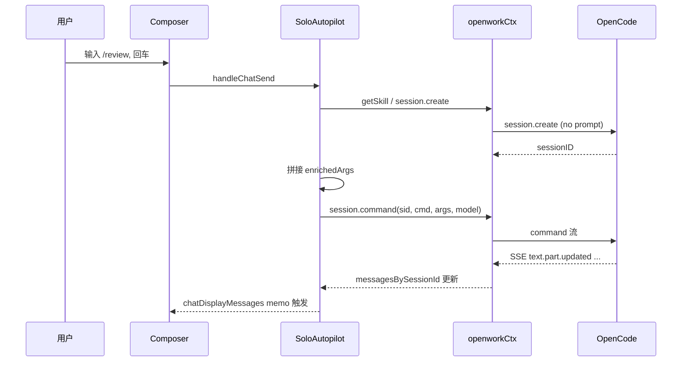
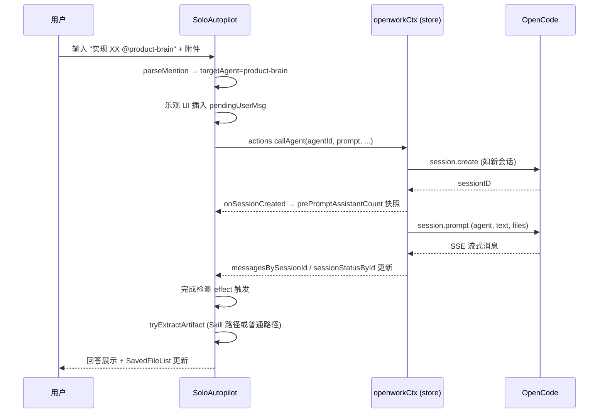
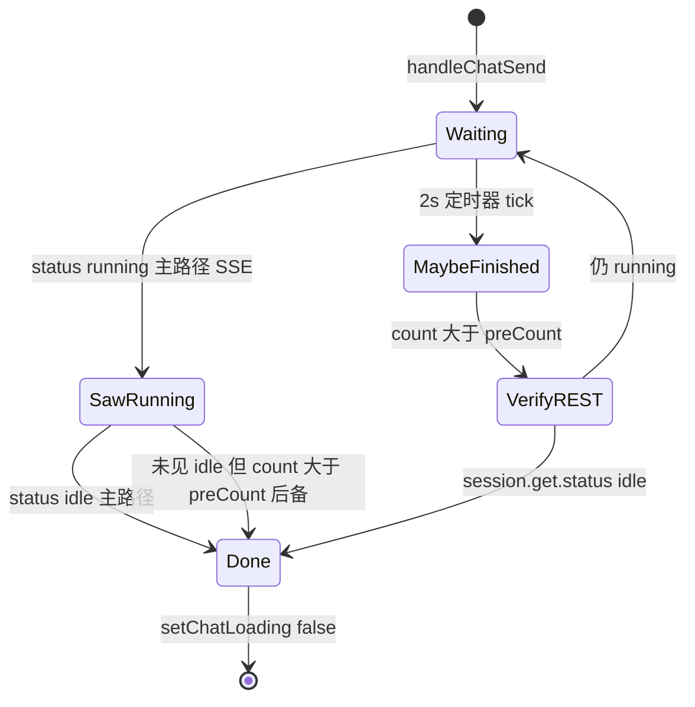
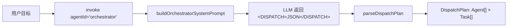
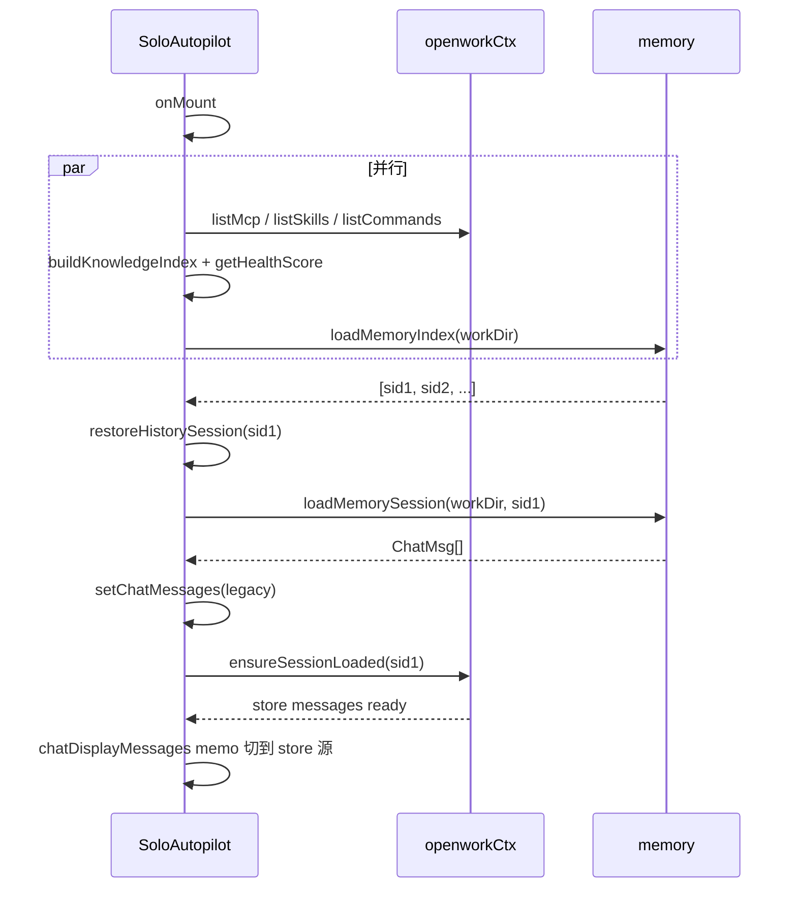
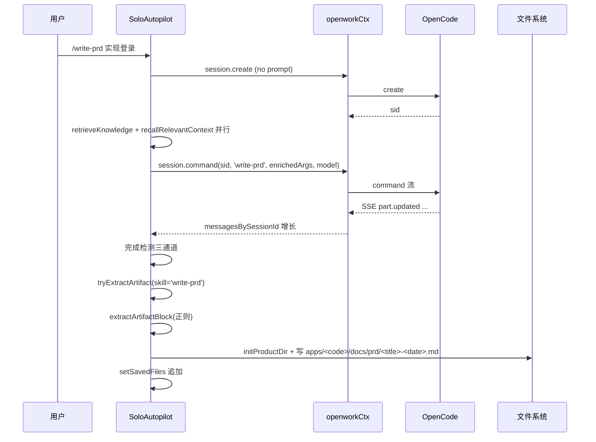

# 30 · 独立版自动驾驶（Solo Autopilot）

> 独立版唯一业务主页。定位：**面向 Solo 开发者的 AI 虚拟团队会话入口**。上承 [10 · Shell 路由/布局](./10-product-shell.md) 挂载到 `/solo/autopilot`，下接 [05a · 会话与消息](./05a-openwork-session-message.md)、[05b · Skill/Agent/MCP](./05b-openwork-skill-agent-mcp.md)、[05e · 权限与问题](./05e-openwork-permission-question.md) 的 OpenWork 底座能力，并通过 [06 · OpenWork 桥契约](./06-openwork-bridge-contract.md) 定义的 `useAppStore` / `openworkCtx` 统一注入。

> **⚠️ v0.12.0 重要变更 — 旧实现已完全移除**：
> 
> 本文档描述的 `EnhancedComposer`、`AutopilotPage`、`SavedFileList`、`autopilot-executor.ts` 等所有 `apps/app/src/app/xingjing/` 下的源文件**已完全删除**。
> 
> **新集成方案（React 19）**：
> 
> | 旧功能 | 新方案 |
> |---|---|
> | `AutopilotPage`（`/solo/autopilot`） | 直接复用 [`SessionRoute`](file:///Users/umasuo_m3pro/Desktop/startup/xingjing/harnesswork/apps/app/src/react-app/shell/session-route.tsx) 页面 |
> | `EnhancedComposer` | 扩展 `domains/session/` 的 Composer 组件 |
> | `@skill:xxx` mention 解析 | `useEffect` hook 在 Composer 中添加 |
> | `SavedFileList` 侧栏 | 注入 SessionPage 右侧栏 slot |
> | 产出物检测 | `useEffect` 监听 session 消息中的文件写入事件 |
> | workspace preset `xingjingMode` | 配置默认 agent/systemPrompt，实例化时应用 |
> 
> **以下内容为 SolidJS v0.11.x 时代 Autopilot 模块历史设计档案**，可作产品功能设计参考。

---

## §1 模块定位与用户价值

独立版没有"任务看板 / 需求池 / 迭代规划"这类团队协作视图。唯一业务视图就是 **Autopilot 会话页**：用户键入自然语言目标，页面负责把目标翻译到三条执行路径之一（`/command` 命令、`@skill:xxx` 直调、`@agent` 或纯对话），由 OpenWork/OpenCode 底座驱动 Agent 完成工作，产出物自动沉淀到产品目录。

四项核心职责：

| 职责 | 边界 |
|------|------|
| 输入装配 | @agent / @file / @skill / /slash / 附件 / 模型选择，聚合在 [EnhancedComposer](file:///Users/umasuo_m3pro/Desktop/startup/xingjing/harnesswork/apps/app/src/app/xingjing/components/autopilot/enhanced-composer.tsx) 一个组件内 |
| 路径分叉 | `/command` → `session.command`；`@skill:xxx` → `runDirectSkill`；其它 → `parseMention + actions.callAgent` |
| 消息呈现 | store 驱动为主 + 乐观 UI pending + legacy ChatMsg 向后兼容，三源合并在 `chatDisplayMessages` memo |
| 产出沉淀 | 双路径产出物检测，Skill 驱动自动落盘到 `apps/<code>/docs/<prd/architecture/delivery>`；普通聊天仅展示 |

职责之外（由底座或其它模块承担）：

- 模型调用 / Provider 鉴权 → [05d](./05d-openwork-model-provider.md)
- 权限与问题交互组件渲染路径 → [05e](./05e-openwork-permission-question.md)
- 知识检索 / 记忆回忆 API → [60 · 知识库](./60-knowledge-base.md)（本页只说注入时机）
- Orchestrator 多 Agent 编排 → [autopilot-executor.ts](file:///Users/umasuo_m3pro/Desktop/startup/xingjing/harnesswork/apps/app/src/app/xingjing/services/autopilot-executor.ts) 已提供 `runOrchestratedAutopilot` 作为可选能力，本主页当前**未直接调用**，见 §14

---

## §2 页面布局总览

### 2.1 三栏骨架

```
┌──────────────┬─────────────────────────────────────┬──────────────┐
│              │  顶栏（知识健康度 · 历史 · 压缩 ·   │              │
│  History     │        新建对话 · 返回）            │  SavedFiles  │
│  Sidebar     ├─────────────────────────────────────┤  Sidebar     │
│  220px       │                                     │  200px       │
│              │  MessageList                        │              │
│  最近 N 条   │  （bubble variant）                 │  已保存产出  │
│  会话        │                                     │  物列表      │
│              │  — 空态 QUICK_SAMPLES ×6 —          │              │
│  可折叠      │                                     │  点击用      │
│              ├─────────────────────────────────────┤  Tauri shell │
│              │  EnhancedComposer                   │  open 打开   │
│              │  （@mention · /slash · 附件 · 模型）│              │
└──────────────┴─────────────────────────────────────┴──────────────┘

覆盖层（绝对定位在中央列之上 · keyed Show）：
  ┌───────────────────────────────────────────────┐
  │  PermissionDialog（30s 倒计时 · 一次一个）    │
  └───────────────────────────────────────────────┘
```

- History 侧栏：可选展示（`showHistory` signal），默认折叠入 toolbar，参见 [HistorySidebar](file:///Users/umasuo_m3pro/Desktop/startup/xingjing/harnesswork/apps/app/src/app/xingjing/pages/solo/autopilot/index.tsx#L184-L285)
- SavedFiles 侧栏：**有产出物时才渲染**，来自 [saved-file-list.tsx](file:///Users/umasuo_m3pro/Desktop/startup/xingjing/harnesswork/apps/app/src/app/xingjing/components/autopilot/saved-file-list.tsx)
- 中央列始终存在：顶栏 + MessageList + EnhancedComposer

### 2.2 数据流概览

```mermaid
graph TB
    User[用户输入] --> Composer[EnhancedComposer]
    Composer --> Send[handleChatSend]
    Send --> Branch{路径判定}
    Branch -->|pendingCommand| Cmd[session.command]
    Branch -->|@skill:xxx| Skill[runDirectSkill]
    Branch -->|其它| Native[actions.callAgent]
    Cmd --> Store[openworkCtx store]
    Skill --> Store
    Native --> Store
    Store --> Messages[messagesBySessionId]
    Store --> Status[sessionStatusById]
    Messages --> Memo[chatDisplayMessages memo]
    Status --> Detect[完成检测 effect]
    Memo --> List[MessageList]
    Detect --> Artifact[tryExtractArtifact]
    Artifact --> Sink[autoSaveArtifact]
    Sink --> Saved[SavedFileList]
```

---

## §3 入口路由与状态机

### 3.1 路由挂载

`/solo/autopilot` 由 [10 · Shell](./10-product-shell.md#§4-路由表) 的 `XingjingApp` Router 通过 `lazy` 加载：

```ts
const SoloAutopilot = lazy(() => import('./pages/solo/autopilot'));
<Route path="/solo/autopilot" component={SoloAutopilot} />
```

### 3.2 渲染状态机

[SoloAutopilot 主组件](file:///Users/umasuo_m3pro/Desktop/startup/xingjing/harnesswork/apps/app/src/app/xingjing/pages/solo/autopilot/index.tsx#L289) 按四级状态渲染：

| 状态 | 触发条件 | 画面 |
|------|---------|------|
| **LOADING** | `!clientReady()` | 整页 fallback loading 页（等 OpenCode 客户端就绪） |
| **NO_PRODUCT** | `!activeProduct` | 居中"先创建产品"空态 + 打开 CreateProductModal 按钮 |
| **WELCOME** | 有产品 · 无消息 · 无 pending | 欢迎语 + `QUICK_SAMPLES` 6 条快捷示例气泡 |
| **CONVERSATION** | `chatDisplayMessages().length > 0 \|\| chatLoading()` | MessageList + Composer |

特殊子态：

- `restoringSessionId()` 有值 → 顶栏横幅"正在恢复会话..."，其余区域保持 CONVERSATION 骨架
- `chatLoading()` 为 true → Composer 进入 `isRunning`（停止按钮替换发送按钮 + pulse 动画）

`clientReady` 由 [isClientReady](file:///Users/umasuo_m3pro/Desktop/startup/xingjing/harnesswork/apps/app/src/app/xingjing/pages/solo/autopilot/index.tsx#L294-L295) 在 `createEffect` 内轮询 `openworkCtx.opencodeClient()` 就绪状态得出。

---

## §4 核心组件清单

| 组件 | 文件 | 职责 |
|------|------|------|
| [EnhancedComposer](file:///Users/umasuo_m3pro/Desktop/startup/xingjing/harnesswork/apps/app/src/app/xingjing/components/autopilot/enhanced-composer.tsx) | 同左 | 文本框 + @mention + /slash + 附件 + 模型选择 + IME 保护 |
| [SlashCommandPanel](file:///Users/umasuo_m3pro/Desktop/startup/xingjing/harnesswork/apps/app/src/app/xingjing/components/autopilot/enhanced-composer.tsx#L151-L262) | 同上文件 | Portal 渲染 / slash 面板，显示 source badge（skill/mcp/cmd） |
| [HistorySidebar](file:///Users/umasuo_m3pro/Desktop/startup/xingjing/harnesswork/apps/app/src/app/xingjing/pages/solo/autopilot/index.tsx#L184-L285) | 主文件内联 | 220px 左侧栏，列出最近会话，点击 `restoreHistorySession` |
| [SavedFileList](file:///Users/umasuo_m3pro/Desktop/startup/xingjing/harnesswork/apps/app/src/app/xingjing/components/autopilot/saved-file-list.tsx) | 同左 | 200px 右侧栏，Tauri shell open + 复制路径 |
| [PermissionDialog](file:///Users/umasuo_m3pro/Desktop/startup/xingjing/harnesswork/apps/app/src/app/xingjing/components/autopilot/permission-dialog.tsx) | 同左 | 30s 倒计时 → auto `once`，对接 `client.permission.reply` |
| `MessageList` | `packages/ui`（OpenWork） | bubble variant，入参 `messages`、`status`、`sessionId` |
| [QuestionDialog](file:///Users/umasuo_m3pro/Desktop/startup/xingjing/harnesswork/apps/app/src/app/xingjing/components/autopilot/question-dialog.tsx) | 同左 | 组件已备但主页 **未装配**（见 §13） |
| [mention-input.tsx](file:///Users/umasuo_m3pro/Desktop/startup/xingjing/harnesswork/apps/app/src/app/xingjing/components/autopilot/mention-input.tsx) | 同左 | **已被 EnhancedComposer 内置 mentionItems 取代**，当前主流程未使用 |

---

## §5 输入能力：EnhancedComposer

### 5.1 @mention 三类目标

`EnhancedComposer` 内聚合三类 @ 目标（[mentionItems memo](file:///Users/umasuo_m3pro/Desktop/startup/xingjing/harnesswork/apps/app/src/app/xingjing/components/autopilot/enhanced-composer.tsx#L579-L607)）：

```
┌───────────────────────────────┐
│ group: 'agent'    | AI 角色    │  @product-brain / @eng-brain / @orchestrator ...
├───────────────────────────────┤
│ group: 'recent'   | 近 10 文件 │  最近用过的 @file 缓存
├───────────────────────────────┤
│ group: 'search'   | 工作区搜索 │  client.find.files({query, dirs:'true', limit:50, directory})
└───────────────────────────────┘
```

- @agent → 插入 `@<agentId>` 文本 + 回写 `targetAgentId` 预存
- @skill → 特殊前缀 `@skill:<name>`，由 `parseMention` 识别，走 `runDirectSkill` 直调
- @file → 插入路径文本（相对 workDir），在最终 prompt 交给底座处理，debounce 150ms 后触发搜索

### 5.2 /slash 命令

[listSlashCommands](file:///Users/umasuo_m3pro/Desktop/startup/xingjing/harnesswork/apps/app/src/app/xingjing/pages/solo/autopilot/index.tsx#L1286-L1318) 并行聚合两路来源并去重：

| 来源 | API | 优先级 |
|------|-----|-------|
| OpenCode 原生 commands | `listCommandsTyped(client, workDir)` | 高 |
| OpenWork Skills | `openworkCtx.listSkills(wsId)` | 低，仅当名字不重复时补入 |

[SlashCommandPanel](file:///Users/umasuo_m3pro/Desktop/startup/xingjing/harnesswork/apps/app/src/app/xingjing/components/autopilot/enhanced-composer.tsx#L151-L262) 按 source 打不同 badge：`skill` / `mcp` / `cmd`。选中后 `setPendingCommand` 存入待消费队列，不立即发送。

### 5.3 附件

[附件约束常量](file:///Users/umasuo_m3pro/Desktop/startup/xingjing/harnesswork/apps/app/src/app/xingjing/components/autopilot/enhanced-composer.tsx#L46-L53)：

| 项 | 值 |
|----|----|
| `MAX_ATTACHMENT_BYTES` | 8 MB |
| 图片压缩尺寸上限 | 2048 px |
| 图片压缩质量 | 0.82 |
| 压缩目标大小 | 1.5 MB |
| 允许类型 | PNG / JPEG / GIF / WEBP / PDF |

三种方式添加附件：

- 点击 📎 按钮（隐藏 `<input type=file>` + `accept` 白名单）
- `onPaste`（监听 clipboard items）
- `onDrop`（dragover + dragleave 高亮，实际落在 `addAttachments`）

图片走 [compressImageFile](file:///Users/umasuo_m3pro/Desktop/startup/xingjing/harnesswork/apps/app/src/app/xingjing/components/autopilot/enhanced-composer.tsx#L62-L94)：`OffscreenCanvas` 缩放 → 0.82 质量 JPEG。超限时不发送，顶部 notice 提示。PDF 不压缩，超限直接丢弃并报错。

`objectUrls` 在 `onCleanup` 统一 `URL.revokeObjectURL` 防泄漏，发送后通过 `clearSentAttachments` 清空。

### 5.4 IME 三重保护

中文输入法组合键阶段绝不触发发送：

```ts
// e.isComposing：W3C 标准
// imeComposing：onCompositionStart/End 维护的 signal
// keyCode === 229：浏览器兼容兜底
if (e.isComposing || imeComposing() || e.keyCode === 229) return;
```

见 [handleKeyDown](file:///Users/umasuo_m3pro/Desktop/startup/xingjing/harnesswork/apps/app/src/app/xingjing/components/autopilot/enhanced-composer.tsx#L694-L735)。

### 5.5 键盘导航

| 按键 | 面板打开时 | 面板关闭时 |
|------|-----------|-----------|
| `ArrowUp` / `Ctrl+p` | 候选项上移 | — |
| `ArrowDown` / `Ctrl+n` | 候选项下移 | — |
| `Tab` / `Enter` | 选中当前候选 | `Enter` 发送（非 IME） |
| `Escape` | 关闭面板 | — |
| `Shift+Enter` | — | 换行 |

### 5.6 模型选择

底部工具栏选择器数据来自 `props.configuredModels`（由 `loadProviderKeys` 基于 `state.llmConfig + loadProjectSettings(workDir).llmProviderKeys` 组装），选中项写入 `sessionModelId`（会话级）。`configuredModels` 为空时显示灰字"未配置模型"，发送按钮不可用。

---

## §6 三执行路径（核心）

[handleChatSend](file:///Users/umasuo_m3pro/Desktop/startup/xingjing/harnesswork/apps/app/src/app/xingjing/pages/solo/autopilot/index.tsx#L881-L1251) 按优先级分叉：

### 6.1 路径判定

```mermaid
graph TB
    Start[handleChatSend] --> Pre["前置校验: 模型+工作目录"]
    Pre --> ReadPending{pendingCommand?}
    ReadPending -->|是| CmdPath[命令路径]
    ReadPending -->|否| Parse[parseMention 解析]
    Parse --> IsSkill{targetSkill?}
    IsSkill -->|是| SkillPath[@skill 路径]
    IsSkill -->|否| NativePath[普通对话路径]
    CmdPath --> End[落 store]
    SkillPath --> End
    NativePath --> End
```

### 6.2 命令路径（/slash 选中后）

[命令路径源](file:///Users/umasuo_m3pro/Desktop/startup/xingjing/harnesswork/apps/app/src/app/xingjing/pages/solo/autopilot/index.tsx#L932-L1069) 步骤：

1. `setActiveSessionSkill`（记录本 session 绑定的 skill）
2. `client.session.create({ title })`（**不携带 prompt**，避免 OpenCode 错把 slash 当文本发送）
3. `actions.ensureProviderAuth(model)` 兜底鉴权
4. 合并 `arguments`：原始用户 text 拼接 `retrieveKnowledge` + `recallRelevantContext` 产出的 `knowledgeContext` 与 `recallContext`
5. `client.session.command({ sessionID, command: pendingCmd, arguments: enrichedArgs, model })`
6. 启动 `startCompletionTimer(sid, preAssistantCount)` 作为完成兜底（见 §9）
7. 注册 120 s 超时：未完成 → 释放 `chatLoading`，给出"超时请重试"提示

时序：



### 6.3 @skill 路径

[@skill 路径源](file:///Users/umasuo_m3pro/Desktop/startup/xingjing/harnesswork/apps/app/src/app/xingjing/pages/solo/autopilot/index.tsx#L1082-L1143)：

```ts
// parseMention 解析到 targetSkill = 'spec-review' 后
await runDirectSkill({
  client, sessionId,  // 复用当前会话或新建
  skillName: targetSkill,
  userText: cleanText,          // 已剥离 @skill:xxx
  model: sessionModelId(),
  directory: workDir,
});
```

`runDirectSkill` 内部通过 `injectSkillContext(skillName)` 把 Skill 的 markdown 注入 systemPrompt，然后以**默认 Agent**执行，不需要存在同名 Agent。细节见 [autopilot-executor.ts L399-L460](file:///Users/umasuo_m3pro/Desktop/startup/xingjing/harnesswork/apps/app/src/app/xingjing/services/autopilot-executor.ts#L399-L460)。

### 6.4 普通对话路径（默认）

[普通路径源](file:///Users/umasuo_m3pro/Desktop/startup/xingjing/harnesswork/apps/app/src/app/xingjing/pages/solo/autopilot/index.tsx#L1145-L1250) 主干：

1. `parseMention` 解析出 `targetAgent`（可空）+ `cleanText`
2. 组装乐观 UI 的 `userParts`：text + file parts（attachments 映射）并插入 `pendingUserMsg` signal
3. 检测 `GIT_TRIGGER_KEYWORDS`（如"提交"、"commit"、"push"），命中则调 `buildGitSystemContext(workDir)` 注入 Git 状态
4. 快照 `prePromptAssistantCount`（决定完成检测的 baseline）：
   - 有 `existingSessionId` → 立即从 store 读
   - 新会话 → 在 `onSessionCreated` 回调中读
5. 调用 `actions.callAgent`（参见 [06 · 桥契约 §callAgent](./06-openwork-bridge-contract.md)）：
   - `userPrompt` / `agentId` / `systemPrompt`（含 Git context + product description）
   - `title`（新会话的标题，取 prompt 前 50 字）
   - `model` / `directory` / `existingSessionId`
   - `attachments` / `onSessionCreated` / `onError`
6. `.then` 分支：`setPromptSent(true)` + `startCompletionTimer(sid, preCount)`（完成检测门控打开）

时序：



---

## §7 OpenCode Session 管理

本页对 Session 的操作都通过 `openworkCtx.opencodeClient()` 执行：

| 操作 | 调用 | 触发时机 |
|------|------|---------|
| 创建 | `session.create({ title })` | 首次发送 · 标题取 prompt 前 50 字（无则"新对话"） |
| Prompt | `session.prompt` / `actions.callAgent` | 普通对话 + @skill 路径 |
| Command | `session.command({ sessionID, command, arguments, model })` | /slash 命令路径 |
| List | `session.list({ directory })` | `loadHistory` 的降级路径 |
| Get | `session.get({ path: { id: sid } })` | `startCompletionTimer` 查真实状态 |
| Compact | `compactSession(sid, client)` | 工具栏"压缩" 按钮（消息 ≥ 10 显示） |
| Abort | `abortSessionSafe(sid, client)` | Composer "停止"按钮 |

注意：

- `session.create` 首次**不携带 prompt**，所有真正输入随后续 `prompt` / `command` 发出。
- 多轮对话复用 `currentChatSessionId()` signal，不会每次新建会话。
- `restoreHistorySession` 会同时设置 `currentChatSessionId` 并调 `openworkCtx.ensureSessionLoaded(sid)` 触发 store 加载历史消息。

---

## §8 消息合并与渲染

### 8.1 三源合并 memo

[chatDisplayMessages memo](file:///Users/umasuo_m3pro/Desktop/startup/xingjing/harnesswork/apps/app/src/app/xingjing/pages/solo/autopilot/index.tsx#L385-L418)：

```
store 有消息?
  ├─是 → return [...storeMessages, pending(按 time 插入)]
  └─否 → return [...legacyToMessageWithParts(chatMessages), pending]
```

- **store 消息**：`openworkCtx.messagesBySessionId[sid]`，是真正的服务端流式结果
- **legacy chatMessages**：`ChatMsg[]` 是历史会话恢复时先写入的本地数组，store 加载完毕后由 store 接管
- **pendingUserMsg**：用户刚点发送、服务端还没回执期间的乐观占位，按 `createdAt` 时间戳插入到队尾合适位置

[清除乐观占位 effect](file:///Users/umasuo_m3pro/Desktop/startup/xingjing/harnesswork/apps/app/src/app/xingjing/pages/solo/autopilot/index.tsx#L423-L434) 监听 store 消息条数增加，自动把 pending 置空。

### 8.2 系统注入剥离

历史消息在进入 store 之前会被加 `## 当前系统时间 YYYY-MM-DD HH:MM:SS` 等系统 context 头，以下函数负责向后兼容清理：

- [stripSystemContext](file:///Users/umasuo_m3pro/Desktop/startup/xingjing/harnesswork/apps/app/src/app/xingjing/pages/solo/autopilot/index.tsx#L88-L96) — 剥离 SystemContext 整段
- [stripAccUserMsg](file:///Users/umasuo_m3pro/Desktop/startup/xingjing/harnesswork/apps/app/src/app/xingjing/pages/solo/autopilot/index.tsx#L108-L124) — 剥离 ACC 累积用户消息头

---

## §9 完成检测（三通道 · 三门控）

OpenCode 的 SSE 流在网络不稳时可能丢事件，单通道不可靠。SoloAutopilot 用**三套冗余 + 三门控**保证 loading 能如期释放。

### 9.1 三门控

| 门控 | 意义 | 赋值时机 |
|------|------|---------|
| `promptSent` | HTTP 发送 POST 已返回 ok | `actions.callAgent().then` |
| `sessionSawRunning` | store 里本次 session 曾经出现过 `running` 状态 | 完成检测 effect 内监听状态变化 |
| `prePromptAssistantCount` | 发送前的 assistant 消息数快照 | 新会话 onSessionCreated / 旧会话立即读 |

只有 `promptSent` 打开 **且** 快照已记录，完成检测才开始生效。

### 9.2 三通道



对应代码：

- [主路径 + 后备 effect](file:///Users/umasuo_m3pro/Desktop/startup/xingjing/harnesswork/apps/app/src/app/xingjing/pages/solo/autopilot/index.tsx#L539-L578)：store `sessionStatusById` 变化时触发
- [startCompletionTimer](file:///Users/umasuo_m3pro/Desktop/startup/xingjing/harnesswork/apps/app/src/app/xingjing/pages/solo/autopilot/index.tsx#L490-L537)：每 2 s 轮询，条件满足时 `session.get` 二次确认
- [handleSessionComplete](file:///Users/umasuo_m3pro/Desktop/startup/xingjing/harnesswork/apps/app/src/app/xingjing/pages/solo/autopilot/index.tsx#L475-L487)：统一收敛的"完成"处理，负责清 loading、关定时器、触发产出物检测

命令路径另有 120 s 硬兜底（见 §6.2 第 7 步）。

---

## §10 产出物自动检测与沉淀

### 10.1 双路径分叉

[tryExtractArtifact](file:///Users/umasuo_m3pro/Desktop/startup/xingjing/harnesswork/apps/app/src/app/xingjing/pages/solo/autopilot/index.tsx#L638-L690) 在完成检测后调用，按"本次是否 Skill 驱动"分两路：

| 路径 | 触发 | 处理 |
|------|------|------|
| **Skill 驱动** | 本 session 绑定了 skill（命令路径或 @skill） | `resolveSkillArtifactConfig(skillName)` 读 skill 的 `artifact.savePath` / `extractPattern` → `extractArtifactBlock` 按正则抽取代码块 → `autoSaveArtifact` **落盘** |
| **普通聊天** | 无 skill 绑定 | `looksLikeDocument`（≥ 400 字 + 含 `h1/h2` 或 markdown 2 级标题以上）→ 仅展示在 `savedFiles`，**不落盘** |

### 10.2 落盘规则

[autoSaveArtifact](file:///Users/umasuo_m3pro/Desktop/startup/xingjing/harnesswork/apps/app/src/app/xingjing/pages/solo/autopilot/index.tsx#L594-L635)：

1. 读 `.xingjing/config.yaml` 的 `apps[0]`（当前产品）
2. `dirMap` 按 agentId 映射产出目录：

| agentId | 子目录 |
|---------|--------|
| `product-brain` | `prd` |
| `eng-brain` | `architecture` |
| 其它 / 默认 | `delivery` |

3. 文件路径：`apps/<appCode>/docs/<子目录>/<title>-<YYYY-MM-DD>.<md|html>`
4. Tauri IPC 调 `initProductDir` 确保父目录存在
5. 写入完成 → `setSavedFiles(prev => [newItem, ...prev])` 追加到侧栏

### 10.3 文档样貌检测

[detectMsgFormatForArtifact / looksLikeDocument / extractDocTitle](file:///Users/umasuo_m3pro/Desktop/startup/xingjing/harnesswork/apps/app/src/app/xingjing/pages/solo/autopilot/index.tsx#L126-L159) 负责：

- 判定格式（md / html）
- 字数阈值 400
- 标题抽取（首个 `#` / `<h1>`）

只用于普通聊天路径的展示判定，Skill 路径完全由 `skill.artifact` 配置决定。

---

## §11 知识与回忆上下文

每次发送前并行拉取两路 context 并拼入 prompt：

| 路径 | API | 产出 |
|------|-----|------|
| 知识检索 | `retrieveKnowledge({ workDir, skillApi, query, scene:'autopilot' })` | `knowledgeContext` 字符串 |
| 记忆回忆 | `recallRelevantContext(workDir, query)` | `.contextText` |

注入位置差异：

- **命令路径**：手动拼到 `enrichedArgs`（arguments 字段）
- **普通对话路径**：由 `actions.callAgent` 的 `knowledgeContext` / `recallContext` 参数承载（[06 · 桥契约](./06-openwork-bridge-contract.md#§callAgent)）

顶栏的"知识健康度"徽标由 `buildKnowledgeIndex + getHealthScore` 在 `onMount` 阶段并行计算（[onMount](file:///Users/umasuo_m3pro/Desktop/startup/xingjing/harnesswork/apps/app/src/app/xingjing/pages/solo/autopilot/index.tsx#L844-L872)），分数细节参见 [60 · 知识库](./60-knowledge-base.md)。

---

## §12 历史会话恢复

[loadHistory](file:///Users/umasuo_m3pro/Desktop/startup/xingjing/harnesswork/apps/app/src/app/xingjing/pages/solo/autopilot/index.tsx#L718-L761) 双路径：

```
loadMemoryIndex(workDir) 优先 ──> memory meta 本地索引（快、含 title/updatedAt）
  │
  └─失败（文件缺失/解析错）──> client.session.list({directory}) 降级 ──> OpenCode session 列表
```

恢复流程 [restoreHistorySession](file:///Users/umasuo_m3pro/Desktop/startup/xingjing/harnesswork/apps/app/src/app/xingjing/pages/solo/autopilot/index.tsx#L764-L811)：

1. `loadMemorySession(workDir, id)` 读取 `.xingjing/memory/<id>.json` → `ChatMsg[]`
2. `setChatMessages(legacy)`：先把 legacy 数组渲染出来（用户看到历史）
3. `setCurrentChatSessionId(id)`
4. `openworkCtx.ensureSessionLoaded(id)`：异步加载 store 的完整 message 状态；store 就绪后 `chatDisplayMessages` memo 自动切换到 store 源

`onMount` 最后还会"自动恢复最近一次"：取 memoryIndex 第一项调 `restoreHistorySession`。

会话元数据持久化：每次会话产生新消息时由 `saveMemoryMeta` 写入 memory 索引。

---

## §13 权限与问题交互

### 13.1 PermissionDialog

[permission-dialog.tsx](file:///Users/umasuo_m3pro/Desktop/startup/xingjing/harnesswork/apps/app/src/app/xingjing/components/autopilot/permission-dialog.tsx) 关键逻辑：

- `permissionQueue` signal 由 store 推送（OpenCode 的 permission.requested 事件）
- 30 s 倒计时，归零时 `handleResolve('once')` 自动通过
- 三按钮：`allow once` / `allow always` / `deny`，落到 `client.permission.reply({ requestID, reply })`
- 一次队列只渲染第一个（keyed），处理完出队自动显示下一个

渲染挂在 [主组件底部 keyed Show](file:///Users/umasuo_m3pro/Desktop/startup/xingjing/harnesswork/apps/app/src/app/xingjing/pages/solo/autopilot/index.tsx#L1360)。

### 13.2 QuestionDialog（已备未装配）

[question-dialog.tsx](file:///Users/umasuo_m3pro/Desktop/startup/xingjing/harnesswork/apps/app/src/app/xingjing/components/autopilot/question-dialog.tsx) 支持多选题型的 AI 反问交互，但 **SoloAutopilot 主页面当前未 import 该组件**。OpenWork 底座的 question 事件流存在，但目前在独立版不渲染。如需启用，需：

1. 在主组件 import QuestionDialog
2. 订阅 `openworkCtx.questionQueue`（或等价事件）
3. 在 PermissionDialog 同级挂一个 keyed Show

本限制来自当前迭代，不属于能力缺失，见 [05e · 权限与问题](./05e-openwork-permission-question.md)。

---

## §14 Orchestrator 模式（可选 · 非主流程）

[autopilot-executor.ts](file:///Users/umasuo_m3pro/Desktop/startup/xingjing/harnesswork/apps/app/src/app/xingjing/services/autopilot-executor.ts) 提供了一套多 Agent 编排能力，但 **SoloAutopilot 当前主流程使用的是 `actions.callAgent + parseMention`，并未直接调用 Orchestrator**。保留在代码中供后续迭代启用。

### 14.1 Phase 1 — 任务分解



- `orchestrator` Agent 作为 OpenCode 原生内置 Agent 由 opencode-router 加载 systemPrompt（见 [`autopilot-executor.ts` L190 注释](file:///Users/umasuo_m3pro/Desktop/startup/xingjing/harnesswork/apps/app/src/app/xingjing/services/autopilot-executor.ts#L190-L192)）
- [buildOrchestratorSystemPrompt](file:///Users/umasuo_m3pro/Desktop/startup/xingjing/harnesswork/apps/app/src/app/xingjing/services/autopilot-executor.ts#L46-L63) 动态注入所有可用 Agent 清单
- 不相关问题允许 LLM 直接回答（不发 DISPATCH）

### 14.2 Phase 2 — 并发执行

[runOrchestratedAutopilot](file:///Users/umasuo_m3pro/Desktop/startup/xingjing/harnesswork/apps/app/src/app/xingjing/services/autopilot-executor.ts#L152-L318) `Promise.all(plan.map(...))`：

- 每个子 Agent `invoke({ agentId: opencodeAgentId, userPrompt: task, skillContext, knowledgeContext })`
- 状态通过 `onAgentStatus` 回调：`thinking → working → done/error`
- 产出通过 `sinkAgentOutput` **异步**沉淀（不阻塞主对话）

### 14.3 直连辅助 API

| API | 用途 |
|-----|------|
| [runDirectAgent](file:///Users/umasuo_m3pro/Desktop/startup/xingjing/harnesswork/apps/app/src/app/xingjing/services/autopilot-executor.ts#L322-L389) | 单 Agent 直连，附带 injectSkills 注入 |
| [runDirectSkill](file:///Users/umasuo_m3pro/Desktop/startup/xingjing/harnesswork/apps/app/src/app/xingjing/services/autopilot-executor.ts#L399-L460) | @skill 路径当前**实际使用**（§6.3） |
| [runAgentByNativeId](file:///Users/umasuo_m3pro/Desktop/startup/xingjing/harnesswork/apps/app/src/app/xingjing/services/autopilot-executor.ts#L473-L491) | 直接按 OpenCode 原生 agentID 调用 |

---

## §15 OpenWork 集成点清单

| 集成点 | 来自 | 用途 |
|--------|------|------|
| `useAppStore()` | 桥契约 [06](./06-openwork-bridge-contract.md) | 解构 `state / productStore / actions / resolvedWorkspaceId / openworkCtx` |
| `openworkCtx.opencodeClient()` | 桥契约 / [05a](./05a-openwork-session-message.md) | Session / Command / Permission / Find 全部 HTTP 调用入口 |
| `openworkCtx.messagesBySessionId` | [05a](./05a-openwork-session-message.md) | 消息流 store 源 |
| `openworkCtx.sessionStatusById` | [05a](./05a-openwork-session-message.md) | 完成检测 effect 的数据源 |
| `openworkCtx.ensureSessionLoaded(sid)` | [05a](./05a-openwork-session-message.md) | 恢复历史时触发 store 加载 |
| `openworkCtx.listMcp / listSkills / listCommands` | [05b](./05b-openwork-skill-agent-mcp.md) | 顶栏能力徽标 + /slash 数据源 |
| `openworkCtx.listSkills(wsId)` | [05b](./05b-openwork-skill-agent-mcp.md) | /slash 合并时的 skill 补齐 |
| `actions.getOpenworkSkill` | 桥契约 [06](./06-openwork-bridge-contract.md) | `resolveSkillArtifactConfig` 读 skill 元数据 |
| `actions.ensureProviderAuth` | [05d](./05d-openwork-model-provider.md) | 命令路径发送前鉴权兜底 |
| `actions.callAgent` | 桥契约 [06](./06-openwork-bridge-contract.md) | 普通对话路径主入口 |
| `client.find.files` | [05c](./05c-openwork-workspace-fileops.md) | @file 工作区文件搜索 |
| `client.permission.reply` | [05e](./05e-openwork-permission-question.md) | PermissionDialog 的响应出口 |
| `compactSession / abortSessionSafe` | `opencode-session` lib | 压缩 / 停止 |
| `listCommandsTyped` | OpenCode 封装 | /slash OpenCode 原生 command 来源 |
| `buildKnowledgeIndex / getHealthScore` | [60](./60-knowledge-base.md) | 顶栏知识健康度 |
| `retrieveKnowledge` | [60](./60-knowledge-base.md) | 发送前注入 knowledgeContext |
| `recallRelevantContext` | 记忆模块 | 发送前注入 recallContext |
| `loadMemoryIndex / loadMemorySession / saveMemoryMeta` | 记忆模块 | 会话历史持久化 |
| `initProductDir` (Tauri IPC) | [10 · Shell](./10-product-shell.md) | `autoSaveArtifact` 前的目录保障 |
| `loadProjectSettings` | [05f](./05f-openwork-settings-persistence.md) | `loadProviderKeys` 读 Provider 配置 |
| `buildGitSystemContext` | 本模块工具 | 命中 GIT_TRIGGER_KEYWORDS 时注入 Git 状态到 systemPrompt |
| `parseMention / listAllAgents` | [autopilot-executor](file:///Users/umasuo_m3pro/Desktop/startup/xingjing/harnesswork/apps/app/src/app/xingjing/services/autopilot-executor.ts) | 普通路径的 mention 解析 + Agent 清单 |
| `resolveSkillArtifactConfig / extractArtifactBlock` | skill-artifact | 产出物 Skill 路径 |

---

## §16 错误降级矩阵

| 场景 | 处理 |
|------|------|
| `clientReady() === false` | 整页 fallback loading，等待底座就绪 |
| `configuredModels` 为空 | 发送按钮灰禁 + "未配置模型"提示，引导去 [80 · 设置](./80-settings.md) |
| Provider Auth 失败（HeyAPI `ConfigInvalidError`） | 命令路径弹错误提示"Provider 未正确配置" + 不启定时器 |
| `client.permission.reply` 失败 | `console.warn` 静默，不打断用户流 |
| `loadMemoryIndex` 失败 | 降级走 `client.session.list` |
| `retrieveKnowledge` / `recallRelevantContext` 抛错 | `catch` 后静默继续，相当于 context 为空 |
| SSE 不吐 `idle` 事件 | 后备通道 + 2 s 定时器 + REST `session.get` 三重兜底释放 loading |
| 命令路径 120 s 未回 | 硬兜底释放 `chatLoading` + Toast "执行超时，请重试" |
| 附件超 8 MB / 非白名单 | Composer 顶部 notice 红字，不加入 attachments |
| `autoSaveArtifact` 写盘失败 | 弹 warning，不影响对话主流；产出物仍出现在 `savedFiles` 展示 |
| `restoreHistorySession` 读取失败 | 清空 legacy，保持空会话状态，允许新发言 |
| `ensureSessionLoaded` 超时 | 先展示 legacy，等 store 就绪后由 memo 自动切换 |

---

## §17 关键交互时序合集

### 17.1 首次进入 · 自动恢复最近会话



### 17.2 发送 → 流式接收 → 产出物落盘（Skill 路径）



---

## §18 代码资产清单

| 文件 | 行数 | 职责 |
|------|------|------|
| [pages/solo/autopilot/index.tsx](file:///Users/umasuo_m3pro/Desktop/startup/xingjing/harnesswork/apps/app/src/app/xingjing/pages/solo/autopilot/index.tsx) | 1711 | 主页组件 · 状态机 · 三路径 · 完成检测 · 产出物沉淀 · 历史恢复 |
| [components/autopilot/enhanced-composer.tsx](file:///Users/umasuo_m3pro/Desktop/startup/xingjing/harnesswork/apps/app/src/app/xingjing/components/autopilot/enhanced-composer.tsx) | 1091 | Composer · @mention · /slash · 附件 · IME 保护 · 模型选择 |
| [components/autopilot/saved-file-list.tsx](file:///Users/umasuo_m3pro/Desktop/startup/xingjing/harnesswork/apps/app/src/app/xingjing/components/autopilot/saved-file-list.tsx) | 127 | 产出物侧栏 · Tauri shell open |
| [components/autopilot/permission-dialog.tsx](file:///Users/umasuo_m3pro/Desktop/startup/xingjing/harnesswork/apps/app/src/app/xingjing/components/autopilot/permission-dialog.tsx) | 232 | 权限弹窗 · 30s 倒计时 |
| [components/autopilot/question-dialog.tsx](file:///Users/umasuo_m3pro/Desktop/startup/xingjing/harnesswork/apps/app/src/app/xingjing/components/autopilot/question-dialog.tsx) | 221 | 问题弹窗（已备未装配） |
| [components/autopilot/mention-input.tsx](file:///Users/umasuo_m3pro/Desktop/startup/xingjing/harnesswork/apps/app/src/app/xingjing/components/autopilot/mention-input.tsx) | 181 | 早期 @ 选择器（已弃用） |
| [services/autopilot-executor.ts](file:///Users/umasuo_m3pro/Desktop/startup/xingjing/harnesswork/apps/app/src/app/xingjing/services/autopilot-executor.ts) | 492 | parseMention · runDirectSkill · Orchestrator 可选编排 |

---

## §19 与其他文档的边界

| 话题 | 归属 |
|------|------|
| Shell 路由挂载 / MainLayout | [10 · Shell](./10-product-shell.md) |
| 会话/消息底层机制 | [05a](./05a-openwork-session-message.md) |
| Skill / Agent / MCP 注册与解析 | [05b](./05b-openwork-skill-agent-mcp.md) |
| `client.find.files` / 文件 API | [05c](./05c-openwork-workspace-fileops.md) |
| Provider / 模型配置 | [05d](./05d-openwork-model-provider.md) |
| 权限 / 问题事件流 | [05e](./05e-openwork-permission-question.md) |
| memory / settings 持久化 | [05f](./05f-openwork-settings-persistence.md) |
| sidecar 进程与状态架构 | [05g](./05g-openwork-process-runtime.md) · [05h](./05h-openwork-state-architecture.md) |
| `useAppStore` / `actions.callAgent` 契约 | [06](./06-openwork-bridge-contract.md) |
| Agent 工作坊（编辑 .opencode/agent） | [40](./40-agent-workshop.md) |
| 产品模式切换 | [50](./50-product-mode.md) |
| 知识库健康度 · 检索实现 | [60](./60-knowledge-base.md) |
| 代码评审页 | [70](./70-review.md) |
| 设置页 | [80](./80-settings.md) |
