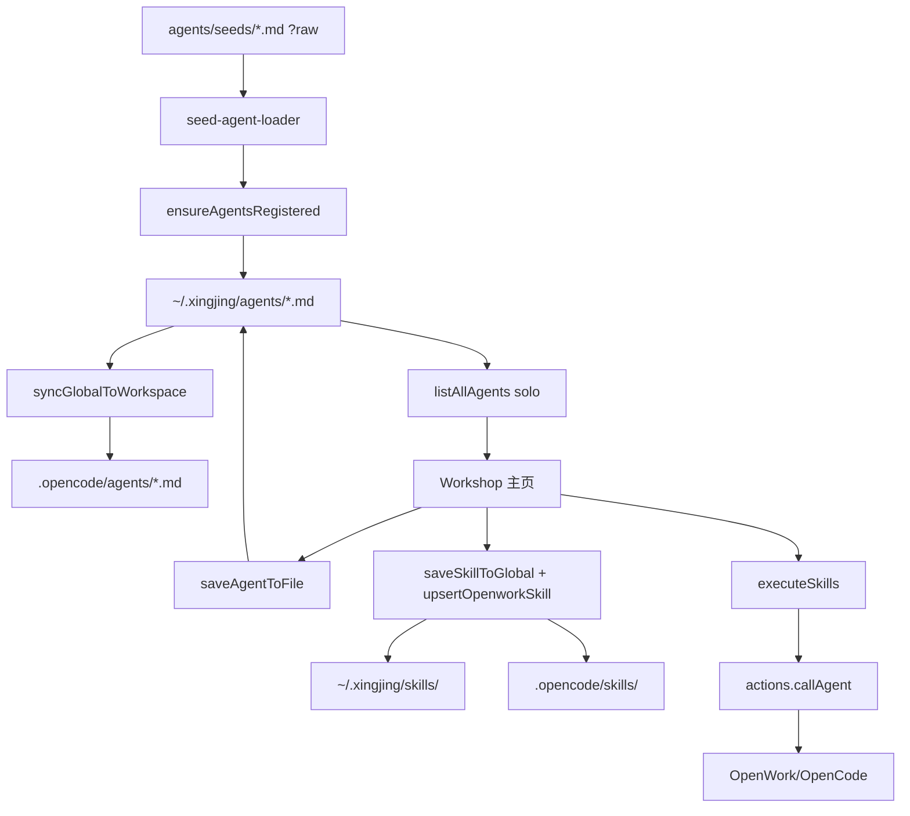
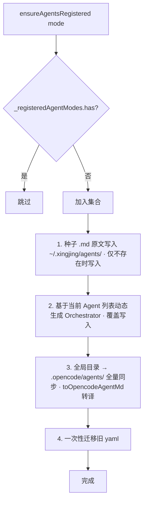
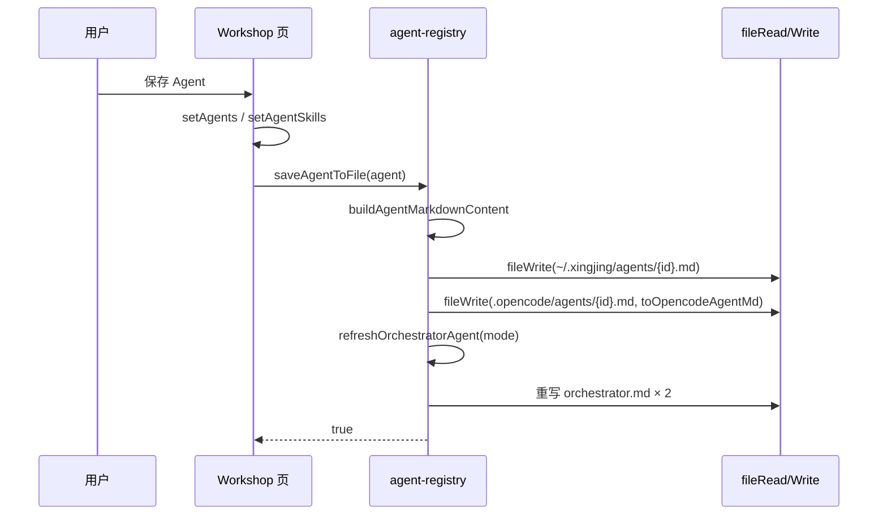
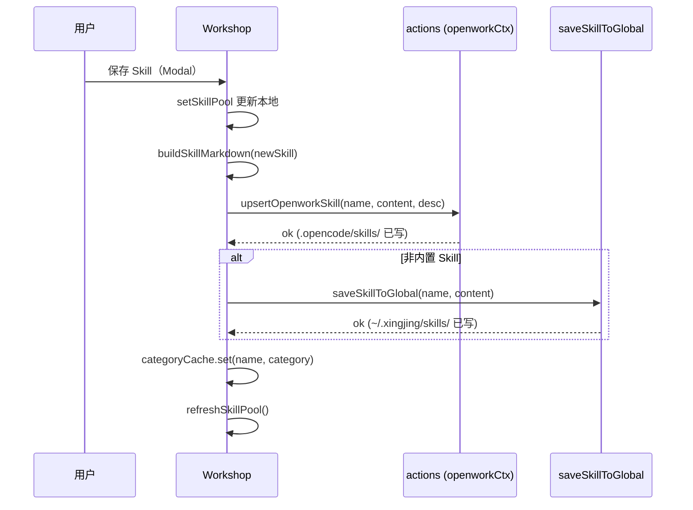
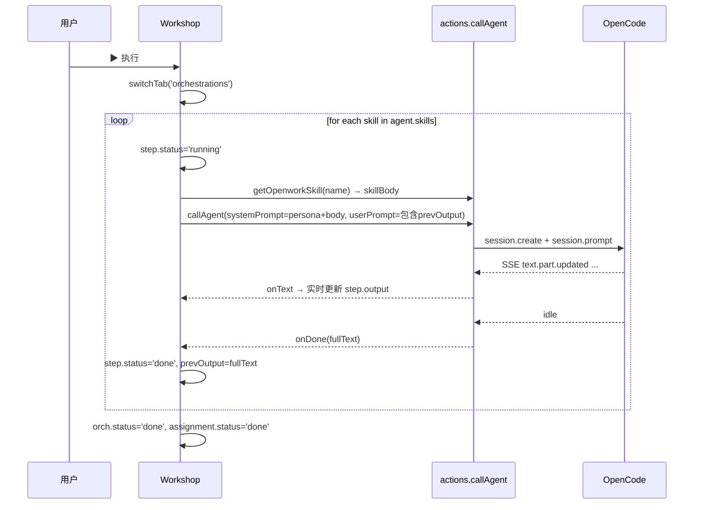
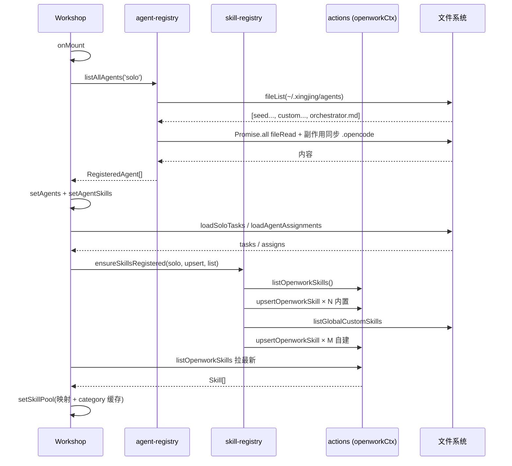
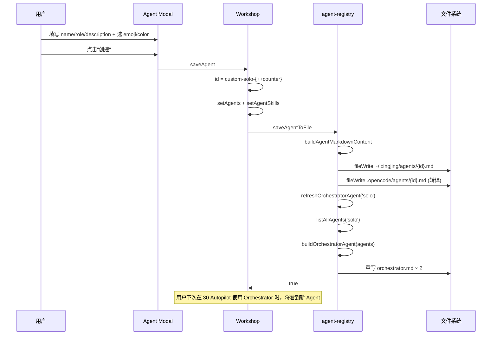

# 40 · Agent/Skill 工作台（Agent Workshop）

> 独立版的"AI 虚拟团队"可视化配置面板。定位：**管理 AI 搭档（Agent）与 Skill 池、配置搭档技能栈、把任务指派给搭档并真实触发 Skill 串行执行**。上承 [10 · Shell](./10-product-shell.md) 挂载到 `/solo/agent-workshop`；数据层依托 [05b · Skill/Agent/MCP](./05b-openwork-skill-agent-mcp.md) 的 OpenWork 原生注册表 + 星静全局目录双写；执行层通过 [06 · 桥契约](./06-openwork-bridge-contract.md) 的 `actions.callAgent` 顺序串行每个 Skill。

---

## §1 模块定位与用户价值

Agent Workshop 是独立版"把 AI 当团队成员管理"的后台。Solo 开发者可以在这里像组建真人团队一样：**定义角色（Agent）→ 分发能力（Skill）→ 指派任务 → 观察执行过程**。

四项核心职责：

| 职责 | 边界 |
|------|------|
| Agent 管理 | 新建/编辑/删除 AI 搭档（颜色、Emoji、角色、描述、skills 绑定）；全局可见，跨产品复用；写到 `~/.xingjing/agents/` + `.opencode/agents/` 双位置 |
| Skill 池管理 | 新建/编辑/删除 Skill；用户自建 Skill 双写全局 `~/.xingjing/skills/` 与当前 workspace `.opencode/skills/`；内置 Skill 只写 workspace |
| 任务指派 | 把本产品的 `soloTasks` 勾给指定搭档，持久化到 `${workDir}/.xingjing/agent-assignments-solo.yaml` |
| 编排执行 | **Orchestrations Tab**：逐个 Skill 串行调用 `actions.callAgent`，合并 Agent 人设 + Skill body 为 systemPrompt，步骤间传递 `prevOutput`，UI 实时展示 pending / running / done / error |

职责之外：

- 底层 Skill / Agent 注册机制 → [05b](./05b-openwork-skill-agent-mcp.md)
- 产品目录识别 / workspace 解析 → [05c](./05c-openwork-workspace-fileops.md)
- 模型调用 / 鉴权 → [05d](./05d-openwork-model-provider.md)
- 主会话使用 Skill 的运行时路径 → [30 · Autopilot](./30-autopilot.md)
- `callAgent` 回调契约 → [06 · 桥契约](./06-openwork-bridge-contract.md)

---

## §2 页面布局总览

### 2.1 三栏自适应骨架

未选中 Agent（12 列栅格 · 9 + 3）：

```
┌─────────────────────────────────────────────┬─────────────┐
│  AI 搭档团队 (N)                  + 新建搭档 │ Skill 池    │
├─────────────────────────────────────────────┤ (col-span-3)│
│  ┌─────────┬─────────┬─────────┐           │             │
│  │ Agent A │ Agent B │ Agent C │           │ [draggable] │
│  │  🧠     │  🏗️    │  💻    │           │ [draggable] │
│  │ 3 Skill │ 2 Skill │ 4 Skill │           │    ...      │
│  └─────────┴─────────┴─────────┘           │             │
│  (col-span-9 · 3 列网格)                    │   + 新建    │
└─────────────────────────────────────────────┴─────────────┘
```

选中某个 Agent（5 + 3 + 4）：

```
┌──────────────────┬─────────────┬────────────────────────┐
│  AI 搭档团队      │ Skill 池    │ Agent 详情面板         │
│                   │             │ ──────────────────────│
│  (col-span-5 ·   │ (col-span-3)│ [ Skills | Tasks |     │
│   2 列网格)       │             │   Orchestrations ]    │
│                   │ ← 拖拽源    │ ─────── Tab 内容 ──── │
│  [Agent A *]      │             │ [drop zone]           │
│  [Agent B ]       │             │ ⠿ 假设验证            │
│  [Agent C ]       │             │ ⠿ 用户洞察            │
│                   │             │ ⠿ 功能优先级          │
└──────────────────┴─────────────┴────────────────────────┘
```

三列宽度由 `selectedAgent()` 信号驱动，参见 [索引 L706-L1049](file:///Users/umasuo_m3pro/Desktop/startup/xingjing/harnesswork/apps/app/src/app/xingjing/pages/solo/agent-workshop/index.tsx#L706-L1049)。

### 2.2 数据流概览



---

## §3 入口路由

`/solo/agent-workshop` 由 [XingjingApp Router](./10-product-shell.md#§4-路由表) 挂载，`lazy` 加载 [SoloAgentWorkshop](file:///Users/umasuo_m3pro/Desktop/startup/xingjing/harnesswork/apps/app/src/app/xingjing/pages/solo/agent-workshop/index.tsx#L161) 组件。本页不依赖路由参数，所有数据由 `useAppStore()` 注入。

---

## §4 三栏组件

### 4.1 AgentCard（左栏 · 网格单元）

[AgentCard L35-L107](file:///Users/umasuo_m3pro/Desktop/startup/xingjing/harnesswork/apps/app/src/app/xingjing/pages/solo/agent-workshop/index.tsx#L35-L107) 职责：

| 视觉元素 | 数据源 |
|---------|-------|
| 2.5xl emoji 头像 | `agent.emoji` |
| name / role | `agent.name` / `agent.role` |
| description（3 行省略） | `agent.description` |
| Skills badge（前 3 + `+N`） | `agentSkills[agentId]` |
| 右上角数字徽标（红点） | `getAssignedCount(agentId)` — 本 Agent 被指派的任务数 |
| 底部 "⚡ 已绑定 N 个任务" | 同上 |
| 卡片背景 | `linear-gradient(135deg, bgColor, surface)` |

点击卡片 → `openAgentPanel` → 右侧详情面板出现。

### 4.2 SkillPoolItem（中栏 · 可拖拽条目）

[SkillPoolItem L110-L158](file:///Users/umasuo_m3pro/Desktop/startup/xingjing/harnesswork/apps/app/src/app/xingjing/pages/solo/agent-workshop/index.tsx#L110-L158) 职责：

- `draggable` 原生拖拽，`dataTransfer.setData('skill', skill.name)`
- 左侧：skill name + category 徽标（`categoryColor` 按 "产品/工程/增长/运营" 着色）
- 右侧：✎ 编辑 / ✕ 删除按钮
- 被拖到右侧 Agent drop-zone 后 → `addSkillToAgent(agentId, skillName)`

### 4.3 Agent 详情面板（右栏 · 三 Tab）

[面板 L778-L1048](file:///Users/umasuo_m3pro/Desktop/startup/xingjing/harnesswork/apps/app/src/app/xingjing/pages/solo/agent-workshop/index.tsx#L778-L1048) 结构：

```
┌─────────────────────────────────────┐
│ Header: emoji + name/role | 编辑 | 删除 | ✕ │
├─────────────────────────────────────┤
│ [ Skill配置 | 任务指派 | 编排记录 ]   │
├─────────────────────────────────────┤
│  Tab 内容（见下三节）                 │
└─────────────────────────────────────┘
```

#### Tab 1 · Skill 配置

- Drop zone（2 px dashed 边框，`onDragOver/onDragLeave/onDrop`）
- 已绑定的 Skill 列表：每条支持 **再次 drag 重新排序**（`dataTransfer.setData('reorder', idx)`，drop 触发 `moveSkill`）
- 空态提示 / "+ 新建并添加 Skill" 快捷入口

#### Tab 2 · 任务指派

- 列出当前产品的 `soloTasks()`
- 自定义勾选框（非原生 checkbox）→ `setPendingTaskIds`
- 任务状态徽标：`doing` / `done` / `todo`
- 已指派状态：`assignStatusStyle`（assigned/working/done）
- 底部 "确认指派 (N 个任务)" → `confirmAssignment` → `persistAssignments`

#### Tab 3 · 编排记录

- 展示 `agentOrchestrations()` 按 Agent 过滤的执行历史
- 每条记录：taskTitle + status 徽标 + steps 列表
- Step 图标：`○ pending / ⟳ running / ✓ done / ✗ error`
- 流式输出实时渲染：`step.output`（`whitespace-pre-wrap` 保留格式）
- 错误提示条（`execErrors[agentId-taskId]`）
- 按钮：`▶ 执行 / ⟳ 执行中 / ↻ 重试 / ↻ 重新执行`（根据 status 切换文案和颜色）

---

## §5 数据模型分层

### 5.1 SkillFrontmatter 三层结构

定义在 [types/agent-workshop.ts](file:///Users/umasuo_m3pro/Desktop/startup/xingjing/harnesswork/apps/app/src/app/xingjing/types/agent-workshop.ts)：

```
SkillFrontmatter           SkillDef (extends)           运行时 UI 元数据
──────────────────         ──────────────────           ─────────────────
name             (OW)      systemPrompt (body)          id
description      (OW)      (body 在 Markdown 正文)      icon
trigger          (OW)      ────────────────────         inputParams[]
glob             (OW)                                    outputType
────────────────
category         (星静扩展)
mode             (星静扩展 solo|team)
artifact         (星静扩展)
```

其中：

- **OW**（OpenWork 原生）字段会被 OpenCode schema 识别并用于 `trigger` 激活、`glob` 文件匹配
- **星静扩展**字段写入 frontmatter 但被 OpenWork 视为额外元数据，不会报错
- `artifact`（[SkillArtifactConfig](file:///Users/umasuo_m3pro/Desktop/startup/xingjing/harnesswork/apps/app/src/app/xingjing/types/agent-workshop.ts#L15-L24)）是星静私有，用于驱动 [30 · Autopilot](./30-autopilot.md#§10-产出物自动检测与沉淀) 的产出物自动落盘

### 5.2 AgentDef × RegisteredAgent

| 字段 | AgentDef（UI 用） | RegisteredAgent（服务层） |
|------|-------------------|--------------------------|
| id/name/role/emoji/color/bgColor/borderColor/skills/description | ✓ | ✓ |
| mode (`'solo' \| 'team'`) | — | ✓（`systemPrompt`、`injectSkills` 也在这层） |
| source (`'seed' \| 'custom'`) | — | ✓ |
| filePath / opencodeAgentId | — | ✓ |
| editable | — | ✓（种子不可编辑 → `!isSeed`） |

主页加载时用 `listAllAgents('solo')` 得到 RegisteredAgent[]，映射到 AgentDef 渲染。

### 5.3 AgentAssignment / TaskOrchestration / SkillExecution

```
AgentAssignment { agentId, taskId, status: 'assigned' | 'working' | 'done' }
TaskOrchestration { agentId, taskId, taskTitle?, status?, steps: SkillExecution[] }
SkillExecution { skillName, status: 'pending' | 'running' | 'done' | 'error', output? }
```

前者持久化到 `${workDir}/.xingjing/agent-assignments-solo.yaml`（见 §7.3），后两者是**运行时内存态**，页面重载丢失。

### 5.4 UI 预设常量

[types/agent-workshop.ts L100-L117](file:///Users/umasuo_m3pro/Desktop/startup/xingjing/harnesswork/apps/app/src/app/xingjing/types/agent-workshop.ts#L100-L117) 提供：

- `agentColorPresets`：10 色套装（label + color + bgColor + borderColor），用于新建/编辑 Agent 选色
- `emojiPresets`：16 个预设 emoji（📋🏗️💻🧪🚀📊🧠⚙️📈🔧🎯🔍🛡️📦🤖💡），Modal 只展示前 12 个

---

## §6 Agent 注册表与种子机制

### 6.1 种子加载（构建期绑定）

[seed-agent-loader.ts](file:///Users/umasuo_m3pro/Desktop/startup/xingjing/harnesswork/apps/app/src/app/xingjing/services/seed-agent-loader.ts) 用 Vite `?raw` 把 10 个种子 Agent 的 markdown 原文打进产物：

```
product-brain | eng-brain | growth-brain | ops-brain | pm-agent |
arch-agent    | dev-agent  | qa-agent     | sre-agent | mgr-agent
```

每个种子文件形如 [product-brain.md](file:///Users/umasuo_m3pro/Desktop/startup/xingjing/harnesswork/apps/app/src/app/xingjing/agents/seeds/product-brain.md)：`frontmatter(id/name/mode/role/emoji/color/skills/injectSkills/description) + body(systemPrompt)`。

### 6.2 ensureAgentsRegistered · 三步注册

[agent-registry.ts L251-L283](file:///Users/umasuo_m3pro/Desktop/startup/xingjing/harnesswork/apps/app/src/app/xingjing/services/agent-registry.ts#L251-L283)：



**幂等守卫**（`_registeredAgentModes: Set<'solo'|'team'>`）防止 SolidJS effect 重跑导致数十次 Tauri IPC 扇出，这是之前"custom protocol failed"事故的防护套。

### 6.3 toOpencodeAgentMd · Schema 兼容翻译

[L147-L172](file:///Users/umasuo_m3pro/Desktop/startup/xingjing/harnesswork/apps/app/src/app/xingjing/services/agent-registry.ts#L147-L172) 负责把 xingjing Agent .md 翻译成 OpenCode 合法格式：

| xingjing 字段 | OpenCode 对应 | 处理 |
|--------------|--------------|------|
| `description` / `role` / `name` | `description` | 按优先级取第一个非空 |
| `mode: solo\|team` | — | **剥离**（语义冲突） |
| — | `mode` | **固定写 `primary`**（`@` 调用的 Agent 一律以主执行模式运行） |
| `temperature` / `model` | 同名 | 透传 |
| `id` / `emoji` / `color` / `bgColor` / `skills` / `injectSkills` | — | 剥离（xingjing 私有） |
| body | body | 原样保留作为 systemPrompt |

这一步保证 OpenCode schema 校验不会因为 xingjing 扩展字段失败，同时让 `@agent` 可以正常调度到对应 prompt。

### 6.4 listAllAgents · 读取路径

[L85-L114](file:///Users/umasuo_m3pro/Desktop/startup/xingjing/harnesswork/apps/app/src/app/xingjing/services/agent-registry.ts#L85-L114)：

1. `fileList('~/.xingjing/agents')` 列全部 `.md`（过滤 `.` 开头和非 md）
2. 并行 `fileRead` → `parseAgentFile`（种子 id 命中 `getSeedAgentIds()` 则标记 `source='seed'`, `editable=false`）
3. **副作用**：每条读取顺带把正确翻译的内容幂等同步到 `.opencode/agents/<id>.md`，修复历史 schema 非法文件
4. 按 mode 过滤：`mode === target || !mode`（mode 缺失的自建 Agent 跨模式都可见）

### 6.5 Orchestrator 动态刷新

`refreshOrchestratorAgent(mode)` 在 **每次 `saveAgentToFile` / `deleteAgentFile`** 后调用：

```
1. listAllAgents(mode) 拿最新列表
2. buildOrchestratorAgent(agents, mode) — 固定 id='orchestrator', emoji='🎯'
   → systemPrompt = buildOrchestratorSystemPrompt(agents)   （见 [autopilot-executor.ts §Phase1](./30-autopilot.md#§14-orchestrator-模式-可选-·-非主流程)）
3. 写入 ~/.xingjing/agents/orchestrator.md + 同步 .opencode/agents/orchestrator.md
```

含义：**Workshop 里对 Agent 列表的任何改动，会自动反映到 Autopilot 的 Orchestrator 调度能力**。

### 6.6 CRUD 落盘时序



---

## §7 Skill 注册表与双写策略

### 7.1 三层存储

| 位置 | 读写者 | 内容 |
|------|-------|------|
| `xingjing/skills/skill-defs.ts` `SKILL_DEFS` | 构建期常量 | 34 个内置 Skill 的完整 SKILL.md 文本，合并 solo/team |
| `~/.xingjing/skills/<name>/SKILL.md` | 星静全局目录（**仅用户自建** Skill 写入） | 跨 workspace 权威源 |
| `.opencode/skills/<name>/SKILL.md` | OpenWork 运行时（**所有** Skill 都写） | `@skill` / `/slash` / `getSkill` 的实际来源 |

内置 Skill **不写全局**，避免污染；用户自建 Skill **双写全局 + workspace**。

### 7.2 ensureSkillsRegistered · 入口

[skill-registry.ts L37-L94](file:///Users/umasuo_m3pro/Desktop/startup/xingjing/harnesswork/apps/app/src/app/xingjing/services/skill-registry.ts#L37-L94)：

1. 幂等守卫 `_registeredSkillModes.has(mode)` 防重复扇出
2. `listSkills()` 查当前 workspace 已有 Skill → `Set<string>` 避免重复写
3. **内置**：遍历 `SKILL_DEFS`，按 frontmatter `mode` 过滤（solo 模式只写 `mode: solo` 或无 mode 的），调 `upsertSkill(name, rawContent)`
4. **全局自定义**：`listGlobalCustomSkills()` 读 `~/.xingjing/skills/`，把每个 `SKILL.md` 内容 upsert 到当前 workspace

被 Workshop 的 `refreshSkillPool` 首次调用时触发（[index.tsx L199](file:///Users/umasuo_m3pro/Desktop/startup/xingjing/harnesswork/apps/app/src/app/xingjing/pages/solo/agent-workshop/index.tsx#L199)），传入的是来自 [06 · 桥契约](./06-openwork-bridge-contract.md) 的 `actions.upsertOpenworkSkill` 与 `actions.listOpenworkSkills`。

### 7.3 buildSkillMarkdown · 保存格式

[L101-L116](file:///Users/umasuo_m3pro/Desktop/startup/xingjing/harnesswork/apps/app/src/app/xingjing/services/skill-registry.ts#L101-L116) 使用统一的 `stringifyFrontmatter` 序列化：

```
---
name: <name>
description: <desc>
category: <category>      # 星静扩展
trigger: <trigger?>        # OpenWork
glob: <glob?>              # OpenWork
mode: <mode?>              # 星静扩展
artifact:                  # 星静扩展（仅 enabled 时写）
  enabled: true
  format: auto
  autoSave: true
  savePath: docs/product/prd
---

<body / systemPrompt>
```

`artifact` 由 OpenWork 容忍地"忽略但不报错"，由 [30 · Autopilot](./30-autopilot.md#§10-产出物自动检测与沉淀) 的 `parseSkillArtifactConfig` 主动读取。

### 7.4 保存流程（Workshop 页内）

[saveSkill L596-L646](file:///Users/umasuo_m3pro/Desktop/startup/xingjing/harnesswork/apps/app/src/app/xingjing/pages/solo/agent-workshop/index.tsx#L596-L646)：



判断"是否内置"：`Object.keys(SKILL_DEFS).includes(name)`（新建用当前名，编辑用原名）。

### 7.5 删除流程

[handleDeleteSkill L648-L678](file:///Users/umasuo_m3pro/Desktop/startup/xingjing/harnesswork/apps/app/src/app/xingjing/pages/solo/agent-workshop/index.tsx#L648-L678)：

1. 从所有 Agent 的 `skills[]` 中移除该 skillName → `persistAgent`
2. `actions.deleteOpenworkSkill(name)` 删 workspace 副本
3. 非内置时 `deleteSkillFromGlobal(name)` 删全局目录
4. `refreshSkillPool` 重拉

---

## §8 编排执行（Orchestrations Tab 核心）

### 8.1 executeSkills 串行循环

[L374-L479](file:///Users/umasuo_m3pro/Desktop/startup/xingjing/harnesswork/apps/app/src/app/xingjing/pages/solo/agent-workshop/index.tsx#L374-L479)：

```
1. 空 skills 列表 → alert 提示，return
2. 构造 agentPersona（agent.name + role + description）
3. 初始化 TaskOrchestration { steps: skills.map(s => ({skillName, status: 'pending'})) }
4. setAssignments 该任务 status = 'working'
5. for i in skills:
   5.1 把第 i 个 step 置为 'running'
   5.2 getOpenworkSkill(skillName) 拿 SKILL.md → 提取 body 作为 skillBasePrompt
       失败 → 降级使用 "你是一个专业的{skillName}执行助手。"
   5.3 systemPrompt = agentPersona + '\n\n' + skillBasePrompt
   5.4 userPrompt =
         "请以「{agent.name}」身份执行「{skillName}」"
         + "当前任务：{taskTitle}"
         + 可选：上一步输出 prevOutput
         + "请输出：1. 执行摘要 2. ### 产出物：标题\n内容"
   5.5 await new Promise((resolve, reject) => actions.callAgent({
         systemPrompt, userPrompt, title, directory: workDir,
         onText: (text) => 更新该 step 的 output,（流式）
         onDone: (full) => resolve(full),
         onError: (err) => reject(err),
       }))
   5.6 保存 output → initialSteps[i].output（下轮作为 prevOutput）
   5.7 置 step.status = 'done'

   异常分支：catch → step.status='error', output='❌ {errMsg}'
            setExecErrors[agentId-taskId] = 错误文案
            整体 orch.status = 'error'
            assignment 回退为 'assigned'
            return（中止后续步骤）
6. 全部成功 → orch.status='done', assignment.status='done'
```

### 8.2 串行链路时序



### 8.3 关键设计决策

| 决策 | 依据 |
|------|------|
| **串行而非并发** | 下一个 Skill 需要使用上一步 `prevOutput` 作为上下文输入 |
| **每步独立 session** | `callAgent` 内部默认 `session.create`，不传 `existingSessionId` → 每次新会话，避免历史消息污染 |
| **失败中止** | 后续 Skill 强依赖前置产出，前步失败则无意义继续 |
| **人设前缀** | 让同一个 Skill 在不同 Agent 下表现出不同视角（产品 vs 工程师） |
| **`### 产出物：标题`** | 与 [30 · Autopilot §10.3 looksLikeDocument](./30-autopilot.md#§10-产出物自动检测与沉淀) 保持产出物格式一致，将来可共用抽取器 |

---

## §9 拖拽交互细节

### 9.1 Skill 池 → Agent drop zone

```
SkillPoolItem (draggable=true)
  └─ onDragStart: dataTransfer.setData('skill', skillName)
                  setDraggingSkill(skillName)
                            ↓
Agent 面板 Drop zone
  ├─ onDragOver: preventDefault + setDropOver(true)
  ├─ onDragLeave: setDropOver(false)
  └─ onDrop (handleDropOnAgent L480-L487):
       dataTransfer.getData('skill') → addSkillToAgent(agentId, skillName)
```

### 9.2 Agent 内部 Skill 排序

[L851-L892](file:///Users/umasuo_m3pro/Desktop/startup/xingjing/harnesswork/apps/app/src/app/xingjing/pages/solo/agent-workshop/index.tsx#L851-L892)：

- 每个已绑定 skill 条目也是 `draggable`
- `onDragStart` 同时写 `'skill'` 和 `'reorder': idx`
- 同条目的 `onDrop`：`e.stopPropagation()` 阻止冒泡到外层 drop zone，`moveSkill(agentId, fromIdx, toIdx)`
- UI：`⠿` 拖柄 + hover 时显示 × 删除按钮

### 9.3 `addSkillToAgent` 副作用

[L328-L335](file:///Users/umasuo_m3pro/Desktop/startup/xingjing/harnesswork/apps/app/src/app/xingjing/pages/solo/agent-workshop/index.tsx#L328-L335)：

```ts
setAgentSkills  prev => 增加 skillName
persistAgent(...)  // 顺带把 agent.skills 变更落盘到 ~/.xingjing/agents/{id}.md
```

即 **拖拽即持久化**，无需显式"保存"按钮。

---

## §10 模态框（Modal）

### 10.1 Agent Modal

[L1052-L1176](file:///Users/umasuo_m3pro/Desktop/startup/xingjing/harnesswork/apps/app/src/app/xingjing/pages/solo/agent-workshop/index.tsx#L1052-L1176) 字段：

- 头像选择：`emojiPresets.slice(0, 12)` 网格
- 颜色选择：`agentColorPresets` 10 圆点
- 名称 *（必填）
- 角色 *（必填）
- 描述
- 底部实时预览：`bgColor` + `borderColor` + `emoji` + name/role

保存逻辑 [saveAgent L506-L525](file:///Users/umasuo_m3pro/Desktop/startup/xingjing/harnesswork/apps/app/src/app/xingjing/pages/solo/agent-workshop/index.tsx#L506-L525) 区分新建 / 编辑，新建 id 格式 `custom-solo-${agentIdCounter}`（启动时从已有 id 推导最大值避免碰撞）。

### 10.2 Skill Modal

[L1179-L1419](file:///Users/umasuo_m3pro/Desktop/startup/xingjing/harnesswork/apps/app/src/app/xingjing/pages/solo/agent-workshop/index.tsx#L1179-L1419) 字段：

| 区块 | 字段 |
|------|------|
| 基本 | Skill 名称 · 描述 · 分类（产品/工程/增长/运营）· 输出类型 |
| OpenWork 原生 | 触发条件（trigger）· 文件匹配（glob） |
| 参数 | InputParams[]：name + type + required(toggle) + description，可增删 |
| Body | System Prompt（textarea 6 行） |
| Artifact | 总开关 → 启用时显示子表单：输出格式（auto/markdown/html）· 自动保存 toggle · 保存路径（相对产品目录） |

编辑已有 Skill 时 [openEditSkillModal L545-L594](file:///Users/umasuo_m3pro/Desktop/startup/xingjing/harnesswork/apps/app/src/app/xingjing/pages/solo/agent-workshop/index.tsx#L545-L594) 会：

1. `actions.getOpenworkSkill(skill.name)` 拿完整 SKILL.md
2. 正则从 frontmatter 提 category/trigger/glob
3. `parseSkillArtifactConfig(content)` 拿 artifact 配置
4. 从 `---\n...\n---\n(body)` 正则抽 body 填回 systemPrompt

### 10.3 删除确认

[L1422-L1436](file:///Users/umasuo_m3pro/Desktop/startup/xingjing/harnesswork/apps/app/src/app/xingjing/pages/solo/agent-workshop/index.tsx#L1422-L1436)：轻量半透明蒙层 + 确认框，防误删。Skill 删除走原生 `confirm()` 而非自定义蒙层。

---

## §11 数据持久化路径

```
~/.xingjing/                           # 全局（跨产品）
├─ agents/
│  ├─ <seed-id>.md         # 10 个种子 Agent
│  ├─ custom-solo-<n>.md    # 用户自建 Agent
│  ├─ orchestrator.md       # 动态生成
│  └─ .workshop-migrated    # 一次性迁移标记
└─ skills/
   └─ <name>/SKILL.md       # 用户自建 Skill（内置不写）

<workDir>/                              # 产品级
└─ .xingjing/
   └─ agent-assignments-solo.yaml       # 该产品的任务指派记录

<workDir>/.opencode/                    # OpenWork 运行时（每个 workspace）
├─ agents/<id>.md                       # 全部 Agent（已 toOpencodeAgentMd 转译）
└─ skills/<name>/SKILL.md               # 全部 Skill（含内置）
```

### 11.1 产品级 vs 全局

| 数据 | 级别 | 原因 |
|------|------|------|
| Agent 列表 | 全局 | 虚拟团队应跨产品复用 |
| Skill 池 | 全局（自建）+ 内置常量 | Skill 是能力库，与产品无关 |
| Assignment | 产品级 | 任务归产品所有 |
| Orchestration 执行记录 | 内存态 | 只用作当次调试反馈，不持久化 |

### 11.2 一次性迁移

[migrateWorkshopYamlToAgentFiles L345-L392](file:///Users/umasuo_m3pro/Desktop/startup/xingjing/harnesswork/apps/app/src/app/xingjing/services/agent-registry.ts#L345-L392)：

- 检查 `~/.xingjing/agents/.workshop-migrated` 标记文件
- 读旧 yaml `loadGlobalAgentWorkshop` → 跳过种子 ID
- 构造 AutopilotAgent → `buildAgentMarkdownContent` → 写入 `~/.xingjing/agents/<id>.md`
- 写标记文件，避免重复迁移

---

## §12 OpenWork 集成点清单

| 集成点 | 来自 | 用途 |
|--------|------|------|
| `useAppStore()` | 桥契约 [06](./06-openwork-bridge-contract.md) | 解构 `productStore` + `actions` |
| `productStore.activeProduct()?.workDir` | [10 · Shell](./10-product-shell.md#§7-产品注册表与-productswitcher) | 拉取 soloTasks / 保存 assignments |
| `actions.listOpenworkSkills` | [05b](./05b-openwork-skill-agent-mcp.md) | Skill 池权威源 |
| `actions.upsertOpenworkSkill` | [05b](./05b-openwork-skill-agent-mcp.md) | 新建/编辑 Skill 的 workspace 写入口 |
| `actions.deleteOpenworkSkill` | [05b](./05b-openwork-skill-agent-mcp.md) | 删除 Skill 的 workspace 出口 |
| `actions.getOpenworkSkill` | [05b](./05b-openwork-skill-agent-mcp.md) | 编辑 / 执行前拉完整 SKILL.md |
| `actions.callAgent` | 桥契约 [06](./06-openwork-bridge-contract.md) | 真实执行每个 Skill |
| `listAllAgents` | 本模块 agent-registry | Agent 列表读取 |
| `saveAgentToFile` / `deleteAgentFile` | 本模块 agent-registry | Agent CRUD |
| `buildSkillMarkdown` | 本模块 skill-registry | 保存前序列化 |
| `saveSkillToGlobal` / `deleteSkillFromGlobal` | 本模块 skill-registry | 全局目录双写 |
| `ensureSkillsRegistered` | 本模块 skill-registry | Workshop 首次加载触发 |
| `fileRead` / `fileWrite` / `fileList` / `fileDelete` | [05c · file-ops](./05c-openwork-workspace-fileops.md) | 所有落盘操作的底层 |
| `parseSkillArtifactConfig` | 本模块 skill-artifact | 编辑 Skill 时恢复 artifact 字段 |
| `loadSoloTasks` / `loadAgentAssignments` / `saveAgentAssignments` | `services/file-store.ts` | 任务 & 指派持久化 |
| `buildOrchestratorSystemPrompt` | [autopilot-executor](./30-autopilot.md#§14-orchestrator-模式-可选-·-非主流程) | Orchestrator 动态刷新使用 |
| `SKILL_DEFS` 常量 | 本模块 `skills/skill-defs.ts` | 内置 Skill 唯一定义源（34 个） |
| `?raw` Vite 导入 | Vite 构建 | 把 10 个种子 .md 打进产物 |

---

## §13 错误降级矩阵

| 场景 | 处理 |
|------|------|
| `~/.xingjing/agents/` 读取失败 | `listAllAgents` 返回空 → Workshop 保留 mock `soloAgents`（mock 作为启动兜底数据） |
| 单个 Agent .md frontmatter 不合法 | `parseAgentFile` 返回 null 并跳过 |
| `saveAgentToFile` 失败 | `console.warn` 静默；本地 signal 已经更新，用户体验无感 |
| `actions.listOpenworkSkills` 失败 | 保留当前 `skillPool()`（首次为空，后续为上次状态）；`skillPoolLoading` 释放 |
| `actions.upsertOpenworkSkill` 失败 | catch 静默，不阻塞 UI；本地 Skill 列表已更新 |
| `saveSkillToGlobal` 失败 | catch 静默；workspace 已写入即可运行 |
| `getOpenworkSkill` 失败（执行时） | 降级使用默认 `"你是一个专业的{skillName}执行助手。"` |
| `callAgent` 失败 | 该 step 标 error + 写 `execErrors` + **中止后续 step** + assignment 回退 assigned |
| 没有配置 Skill 直接点执行 | `alert('该 AI搭档尚未配置技能，请先添加技能')` |
| `executingTaskId` 非空时点其它执行按钮 | 按钮 disabled；单队列串行，避免并发引发消息竞争 |
| 迁移 yaml 失败 | `console.warn` 静默，不阻塞注册主流程 |
| Orchestrator 刷新失败 | non-blocking，下次 ensureAgentsRegistered 会重建 |

---

## §14 关键时序合集

### 14.1 首次进入 Workshop



### 14.2 用户新建自定义 Agent



---

## §15 代码资产清单

| 文件 | 行数 | 职责 |
|------|------|------|
| [pages/solo/agent-workshop/index.tsx](file:///Users/umasuo_m3pro/Desktop/startup/xingjing/harnesswork/apps/app/src/app/xingjing/pages/solo/agent-workshop/index.tsx) | 1442 | 主页 · 三栏布局 · 三 Tab 面板 · Modal × 2 · executeSkills 串行 |
| [services/agent-registry.ts](file:///Users/umasuo_m3pro/Desktop/startup/xingjing/harnesswork/apps/app/src/app/xingjing/services/agent-registry.ts) | 393 | Agent CRUD · 种子注册 · toOpencodeAgentMd · Orchestrator 动态刷新 · 迁移 |
| [services/skill-registry.ts](file:///Users/umasuo_m3pro/Desktop/startup/xingjing/harnesswork/apps/app/src/app/xingjing/services/skill-registry.ts) | 164 | ensureSkillsRegistered · buildSkillMarkdown · 全局目录 CRUD |
| [services/seed-agent-loader.ts](file:///Users/umasuo_m3pro/Desktop/startup/xingjing/harnesswork/apps/app/src/app/xingjing/services/seed-agent-loader.ts) | 43 | 10 个种子 Agent `?raw` 导入 |
| [agents/seeds/](file:///Users/umasuo_m3pro/Desktop/startup/xingjing/harnesswork/apps/app/src/app/xingjing/agents/seeds) | 10 × ~0.7KB | product-brain/eng-brain/growth-brain/ops-brain/pm-agent/arch-agent/dev-agent/qa-agent/sre-agent/mgr-agent |
| [types/agent-workshop.ts](file:///Users/umasuo_m3pro/Desktop/startup/xingjing/harnesswork/apps/app/src/app/xingjing/types/agent-workshop.ts) | 118 | SkillFrontmatter / SkillDef / AgentAssignment / TaskOrchestration + UI 预设常量 |
| [skills/skill-defs.ts](file:///Users/umasuo_m3pro/Desktop/startup/xingjing/harnesswork/apps/app/src/app/xingjing/skills/skill-defs.ts) | 629 | 34 个内置 Skill 完整 SKILL.md 文本（solo + team） |
| [utils/skill-artifact.ts](file:///Users/umasuo_m3pro/Desktop/startup/xingjing/harnesswork/apps/app/src/app/xingjing/utils/skill-artifact.ts) | 129 | parseSkillArtifactConfig / extractArtifactBlock / resolveSkillArtifactConfig |

---

## §16 与其他文档的边界

| 话题 | 归属 |
|------|------|
| Shell 路由挂载 | [10 · Shell](./10-product-shell.md) |
| Skill / Agent / MCP 注册底座机制 | [05b](./05b-openwork-skill-agent-mcp.md) |
| workspace 解析 / 文件 IO | [05c](./05c-openwork-workspace-fileops.md) |
| 模型 / Provider 调用链 | [05d](./05d-openwork-model-provider.md) |
| `actions.callAgent` 回调契约 | [06 · 桥契约](./06-openwork-bridge-contract.md) |
| Skill 在主对话页的消费（含产出物落盘） | [30 · Autopilot](./30-autopilot.md) |
| Orchestrator 多 Agent 分派 Phase 1/2 | [30 · Autopilot §14](./30-autopilot.md#§14-orchestrator-模式-可选-·-非主流程) |
| 产品模式 / PRD / SDD 的 artifact 消费 | [50 · 产品模式](./50-product-mode.md) |
| 知识库 / memory | [60 · 知识库](./60-knowledge-base.md) |
| Provider Key 设置 | [80 · 设置](./80-settings.md) |
