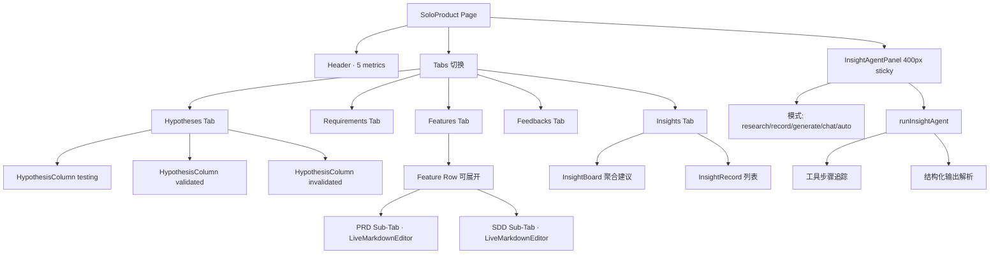

# 50 · 产品模式（Product Mode）技术设计

> 本章描述星静「产品模式」的完整实现——以 [pages/solo/product/index.tsx](file:///Users/umasuo_m3pro/Desktop/startup/xingjing/harnesswork/apps/app/src/app/xingjing/pages/solo/product/index.tsx) 为入口，围绕 **假设验证 → 需求生成 → 功能文档 → 反馈收集 → 洞察沉淀** 的五步闭环，结合右侧 Insight Agent 面板完成从市场信号到开发任务的全链路转化。
>
> 相关文档：
> - [00-overview.md](./00-overview.md) 系统总览
> - [10-product-shell.md](./10-product-shell.md) 外壳与导航
> - [30-autopilot.md](./30-autopilot.md) 自动飞行
> - [40-agent-workshop.md](./40-agent-workshop.md) 工坊
> - [60-knowledge-base.md](./60-knowledge-base.md) 知识库

> **⚠️ v0.12.0 重要变更 — 旧实现已完全移除**：
> 
> 本文档描述的 `ProductModePage`、`file-store.ts`、`insight-executor.ts`、`requirement-dev-bridge.ts` 等 `apps/app/src/app/xingjing/` 下所有源文件**已完全删除**。
> 
> **新集成方案（React 19）**：
> - 产品目录结构映射到 workspace preset（一个产品 = 一个 workspace）
> - 产品文档 session sidebar 面板扩展（注入 SessionRoute 右侧栏）
> - 知识沉淀：`.opencode/docs/` 下的 workspace 文件
> - 不再有独立的 `file-store.ts`；文件操作通过 server-v2 files API
> 
> **以下内容为 SolidJS v0.11.x 时代产品模式历史设计档案**，可作产品功能设计参考。

---

## 1. 模块定位与价值

产品模式是星静独立版的「产品经理工作台」。它承担三类职责：

| 职责 | 解决的问题 | 对应 UI |
|------|------------|---------|
| **假设驱动** | 想法如何变成可验证的实验，而不是直接写代码 | Hypothesis Kanban 三态看板 |
| **需求沉淀** | 验证通过的假设如何结构化为可开发的需求 | Requirement 列表 + 状态机 |
| **文档双生** | 需求如何映射到功能并自动维护 PRD / SDD | Features 可展开双 Tab 编辑器 |
| **用户回响** | 反馈与洞察如何反哺下一轮假设 | Feedbacks / Insights + InsightBoard |

与传统 PM 工具的关键区别：**所有结构化文本都是本地 Markdown/YAML 文件**（见 §13 持久化路径表），Agent 始终作为「第二手」而非「第一手」存在，用户保有最终决定权。

---

## 2. 三栏页面布局

### 2.1 ASCII 布局

```
┌─────────────────────────────────────────────────────────────────────────────┐
│ Header: 🚀 产品模式  · 假设: 3  需求: 5  功能: 8  反馈: 12  [新建假设]         │
├─────────────────────────────────────────────────────────────────────────────┤
│ Tabs:  [假设看板] [需求列表] [功能文档] [用户反馈] [洞察沉淀]                    │
├──────────────────────────────────────────────────────┬──────────────────────┤
│                                                      │                      │
│  中央工作区（Tab 切换）                                 │  右侧 InsightAgent   │
│                                                      │  sticky · 400px 宽    │
│  · 假设: 三列 Kanban（testing/validated/invalidated）  │                      │
│  · 需求: 筛选条 + 卡片列表 + 状态守卫按钮                │  模式切换:             │
│  · 功能: 可展开行 · 内嵌 PRD/SDD 双 Tab                │  [auto][🔍调研]         │
│  · 反馈: sentiment 卡片                               │  [💭记录][📋生成][💬聊] │
│  · 洞察: InsightBoard (聚合建议 + 记录列表)              │                      │
│                                                      │  消息流 + 工具步骤         │
│                                                      │  快捷提示词               │
│                                                      │  输入框 (Shift+Enter 换行) │
└──────────────────────────────────────────────────────┴──────────────────────┘
```

### 2.2 Mermaid 结构图



---

## 3. 五个 Tab 与状态机

入口状态由 [SoloProduct](file:///Users/umasuo_m3pro/Desktop/startup/xingjing/harnesswork/apps/app/src/app/xingjing/pages/solo/product/index.tsx#L329-L400) 管理：

| Tab 值 | 标签 | 数据源 | 关键 signal |
|--------|------|--------|-------------|
| `hypotheses` | 假设看板 | `loadHypotheses()` | `hypotheses` |
| `requirements` | 需求列表 | `loadRequirementOutputs()` | `requirements` + `filterRequirements` |
| `features` | 功能文档 | `loadProductFeatures()` | `productFeatures` + `featurePrds/featureSdds` Map |
| `feedbacks` | 用户反馈 | `loadFeedbackRecords()` | `feedbacks` |
| `insights` | 洞察沉淀 | `loadInsightRecords()` | `insightRecords` |

> 注意：规划曾列举 Roadmap/PRD/SDD 为独立 Tab，但实际代码中 Roadmap 融入 Features 行头、PRD/SDD 嵌入 Features 展开区作为双子 Tab——以代码为准。

### 3.1 并发加载与竞态保护

[loadAllData](file:///Users/umasuo_m3pro/Desktop/startup/xingjing/harnesswork/apps/app/src/app/xingjing/pages/solo/product/index.tsx#L496-L543) 用 10 路 `Promise.all` 并发读取：

```
loadVersion 自增 → Promise.all([hypotheses, prds, sdds, feedbacks,
    requirements, insights, roadmap, overview, features, sprints])
 → 若 loadVersion 已被后续调用刷新，则丢弃当前结果
```

这避免了用户快速切换产品时旧产品的结果覆盖新产品。

---

## 4. 假设看板（Hypothesis Kanban）

### 4.1 三列 + 拖拽

三列由 [HypothesisColumn](file:///Users/umasuo_m3pro/Desktop/startup/xingjing/harnesswork/apps/app/src/app/xingjing/pages/solo/product/index.tsx#L120-L295) 渲染：`testing` / `validated` / `invalidated`，颜色主题在 `columnTheme` 中定义。

拖拽兼容关键点（WebKit + Tauri 环境）：

1. **setData 必须调用**：
   ```ts
   e.dataTransfer.setData('text/plain', h.id);
   e.dataTransfer.effectAllowed = 'move';
   ```
   否则 WebKit 根本不触发 `drop` 事件。

2. **dragLeave 使用 enterCount 计数**：在 Tauri/WebKit 移入子元素时 `relatedTarget` 可能为 null。通过进入 +1 / 离开 -1 的计数器，只有计数归零才认为真正离开。

3. **高亮状态 dropHint**：列标题带动态 badge 提示「松开以标记为 xxx」。

### 4.2 状态流转

拖拽到新列 → 触发 `drag.onDrop` → [handleHypothesisStatusChange](file:///Users/umasuo_m3pro/Desktop/startup/xingjing/harnesswork/apps/app/src/app/xingjing/pages/solo/product/index.tsx#L632-L645)：

```
saveHypothesis({ ...h, status: newStatus, validatedAt?, result? })
 → reload hypotheses
 → 若新状态 ∈ {validated, invalidated} 且存在 linkedFeatureId
    → appendHypothesisResultToPrd(featureId, h.id, h.result)
```

### 4.3 双写持久化

[saveHypothesis](file:///Users/umasuo_m3pro/Desktop/startup/xingjing/harnesswork/apps/app/src/app/xingjing/services/file-store.ts#L933-L971) 同时写两个位置：

| 位置 | 作用 |
|------|------|
| `iterations/hypotheses/{id}.md` | frontmatter + body markdownDetail，单假设全量 |
| `iterations/hypotheses/_index.yml` | 目录索引 upsert 同一条记录，含 feature 关联 |

[loadHypotheses](file:///Users/umasuo_m3pro/Desktop/startup/xingjing/harnesswork/apps/app/src/app/xingjing/services/file-store.ts#L882-L931) 反向合并：以 md 为主，对只存在于 `_index.yml` 的条目提供兜底。

### 4.4 幂等回写 PRD

[appendHypothesisResultToPrd](file:///Users/umasuo_m3pro/Desktop/startup/xingjing/harnesswork/apps/app/src/app/xingjing/services/file-store.ts#L981-L1009) 以 `marker=hypothesis-${id}` HTML 注释为锚点：

```markdown
## 假设验证记录
<!-- hypothesis-h_abc123 -->
- **已证实**（2026-04-27）：用户确实更倾向…
```

同一 id 多次写入不会追加重复条目，只更新对应段落。

### 4.5 新建 / 转需求

- **新建**：[New Hypothesis Modal](file:///Users/umasuo_m3pro/Desktop/startup/xingjing/harnesswork/apps/app/src/app/xingjing/pages/solo/product/index.tsx#L1434-L1490) 收集 `belief/why/method/impact/feature`。
- **转需求**：[handleConvertHypothesisToRequirement](file:///Users/umasuo_m3pro/Desktop/startup/xingjing/harnesswork/apps/app/src/app/xingjing/pages/solo/product/index.tsx#L780-L788) 调用 [convertHypothesisToRequirement](file:///Users/umasuo_m3pro/Desktop/startup/xingjing/harnesswork/apps/app/src/app/xingjing/services/file-store.ts#L1015-L1034)：
  ```
  impact=high   → P0
  impact=medium → P1
  impact=low    → P2
  ```
  落盘为 `SoloRequirementOutput` 并附 `linkedHypothesis` / `linkedFeatureId`。

---

## 5. 需求列表与生命周期

### 5.1 六态状态机

由 [SoloRequirementStatus](file:///Users/umasuo_m3pro/Desktop/startup/xingjing/harnesswork/apps/app/src/app/xingjing/services/file-store.ts#L1155-L1204) 定义：

```
draft → under-review → confirmed → in-dev → shipped
                     ↘  rejected
```

卡片 [RequirementCard](file:///Users/umasuo_m3pro/Desktop/startup/xingjing/harnesswork/apps/app/src/app/xingjing/components/requirement/requirement-card.tsx) 用 `canConfirm` / `canPush` / `canReject` 守卫按钮：

| 状态 | 可操作 |
|------|--------|
| `draft` / `under-review` | 确认、驳回、推送开发 |
| `confirmed` | 推送开发 |
| `in-dev` / `shipped` | 只读 |

### 5.2 筛选条

[filterRequirements](file:///Users/umasuo_m3pro/Desktop/startup/xingjing/harnesswork/apps/app/src/app/xingjing/pages/solo/product/index.tsx#L969-L1014) 支持按：

- 状态（全部 / 草稿 / 评审中 / 已确认 / …）
- 优先级（P0-P3）
- 关联功能（linkedFeatureId）

### 5.3 推送到开发（核心桥接）

见 §11。

---

## 6. 功能文档（Features + PRD/SDD）

### 6.1 列表源

[loadProductFeatures](file:///Users/umasuo_m3pro/Desktop/startup/xingjing/harnesswork/apps/app/src/app/xingjing/services/file-store.ts#L1069-L1102) 从 `product/features/_index.yml` 的 `features[]` 数组读取；每项包含 `id/title/status/description` 等字段。

### 6.2 可展开双子 Tab

点击某行 → `expandedFeatureId` 写入该功能 id → 下方展开：

```
┌─ [PRD] [SDD] ─ 🖉编辑 ─ ⛶全屏 ─────────────┐
│                                          │
│  LiveMarkdownEditor (预览/编辑模式切换)      │
│                                          │
└──────────────────────────────────────────┘
```

- `featurePrds: Map<string, SoloPrd>` / `featureSdds: Map<string, SoloSdd>` 以 `_featureSlug` 建索引。
- 编辑器 [LiveMarkdownEditor](file:///Users/umasuo_m3pro/Desktop/startup/xingjing/harnesswork/apps/app/src/app/components/live-markdown-editor.tsx) 来自 OpenWork 共享组件池（非 xingjing 自建）。

### 6.3 Markdown 工具栏

[Fullscreen Modal](file:///Users/umasuo_m3pro/Desktop/startup/xingjing/harnesswork/apps/app/src/app/xingjing/pages/solo/product/index.tsx#L1515-L1610) 11 按钮：H1 / H2 / H3 / 粗体 / 斜体 / 删除线 / 代码块 / 列表 / 引用 / 链接 / 分割线。

三个通用 helper：
- `mdWrapSel(before, after)` 包裹选区
- `mdLinePrefix(prefix)` 行首插入
- `mdInsertAt(text)` 光标处插入

### 6.4 落盘路径

`product/features/{slug}/PRD.md` 与 `product/features/{slug}/SDD.md`。`slug` 由 [toFeatureSlug](file:///Users/umasuo_m3pro/Desktop/startup/xingjing/harnesswork/apps/app/src/app/xingjing/services/file-store.ts#L371-L380) 做 kebab-case 转换（保留中文，驼峰拆分，空白转横线）。

保存后 `loadPrds()` / `loadSdds()` 重新构建 Map 以刷新当前展开区。

---

## 7. 用户反馈（Feedbacks）

### 7.1 数据结构

每条反馈含 `sentiment ∈ {positive, negative, neutral}` 与 `channel ∈ {Product Hunt, Twitter, In-app, Email}`。

### 7.2 卡片渲染

[FeedbackCard](file:///Users/umasuo_m3pro/Desktop/startup/xingjing/harnesswork/apps/app/src/app/xingjing/components/insight/feedback-card.tsx)：
- `SENTIMENT_CONFIG` 配色：正 · 绿 / 负 · 红 / 中 · 灰
- `CHANNEL_CONFIG` 小图标
- 点击展开全文

---

## 8. 洞察 Agent · 四模式 + auto

### 8.1 模式枚举

[InsightMode](file:///Users/umasuo_m3pro/Desktop/startup/xingjing/harnesswork/apps/app/src/app/xingjing/services/insight-executor.ts#L27)：

| 模式 | 颜色 | 场景 | 系统 Prompt |
|------|------|------|-------------|
| `research` 🔍 | 蓝 | 市场 / 竞品调研 | `buildResearchSystemPrompt` |
| `record` 💭 | 紫 | 用户访谈记录 → 假设提取 | `buildRecordSystemPrompt` + 注入 `product-hypothesis` Skill |
| `generate` 📋 | 绿 | 生成需求文档 `[REQ_DOC:模块]` | `buildGenerateSystemPrompt` |
| `chat` 💬 | 灰 | 自由对话 | `buildChatSystemPrompt` |
| `auto` ✨ | 蓝 | 按输入关键词自动识别 | `detectInsightMode(input)` 动态评分 |

### 8.2 关键词评分

[detectInsightMode](file:///Users/umasuo_m3pro/Desktop/startup/xingjing/harnesswork/apps/app/src/app/xingjing/services/insight-executor.ts#L70-L82)：对每个候选模式扫描专属关键词列表累加得分，最高分胜出；若全部为 0 则退回 `chat`。

### 8.3 运行主流程

[runInsightAgent](file:///Users/umasuo_m3pro/Desktop/startup/xingjing/harnesswork/apps/app/src/app/xingjing/services/insight-executor.ts#L276-L387)：

```
mode ← (opts.mode === 'auto') ? detectInsightMode(input) : opts.mode
onModeDetected(mode)                 // 面板可展示最终模式
systemPrompt ← buildXxxSystemPrompt()
if mode === 'record' 且 skillApi 可用
   → prepend skillContext(product-hypothesis)
callAgentFn({
  systemPrompt, userInput, productContext,
  onToolUse → handleToolUse → onToolStep(card)
  onToolResult → onToolStepDone(elapsed)
  onText → onStream (流式)
  onDone → _handleDone
})
```

### 8.4 工具步骤分类

[handleToolUse](file:///Users/umasuo_m3pro/Desktop/startup/xingjing/harnesswork/apps/app/src/app/xingjing/services/insight-executor.ts#L313-L335) 按工具名映射为 UI 类型：

| 工具 | 卡片类型 |
|------|---------|
| `search` / `browser` | search |
| `analyz*` / `inspect*` | analyze |
| `write_file` / `save_*` | write |
| 其他 | thinking |

配合 [ToolCallStepCard](file:///Users/umasuo_m3pro/Desktop/startup/xingjing/harnesswork/apps/app/src/app/xingjing/components/insight/tool-call-step-card.tsx) 展示 running(spinner) / done(✅) / error(⚠️)。

### 8.5 三条结构化提取管线

[_handleDone](file:///Users/umasuo_m3pro/Desktop/startup/xingjing/harnesswork/apps/app/src/app/xingjing/services/insight-executor.ts#L392-L432) 完成时并行尝试：

| 管线 | 触发符 | 产物 |
|------|--------|------|
| [parseHypothesisFromOutput](file:///Users/umasuo_m3pro/Desktop/startup/xingjing/harnesswork/apps/app/src/app/xingjing/services/insight-executor.ts#L179-L203) | ```` ```hypothesis ```` JSON 块 | 假设草稿（belief/why/method/impact 四字段 + 可选 feature/expected_result） |
| [parseRequirementFromOutput](file:///Users/umasuo_m3pro/Desktop/startup/xingjing/harnesswork/apps/app/src/app/xingjing/services/insight-executor.ts#L208-L224) | `[REQ_DOC:模块名]` | 需求草稿 Markdown 体 |
| [parseProductSuggestions](file:///Users/umasuo_m3pro/Desktop/startup/xingjing/harnesswork/apps/app/src/app/xingjing/services/insight-executor.ts#L229-L262) | `## 💡 产品建议` 下行 | `[{priority, title, category, reason}]` |

`research` 模式额外聚合为 `InsightRecord`：调用 [_extractSourcesFromText](file:///Users/umasuo_m3pro/Desktop/startup/xingjing/harnesswork/apps/app/src/app/xingjing/services/insight-executor.ts#L434-L451) 从 `## 📊 外部证据` 下 `-` 列表抓取 `title/url/snippet`。

### 8.6 面板 UI

[InsightAgentPanel](file:///Users/umasuo_m3pro/Desktop/startup/xingjing/harnesswork/apps/app/src/app/xingjing/components/insight/insight-agent-panel.tsx)：

- 顶部 5 个模式 Tab + MODE_CONFIG 配色
- 消息气泡含 toolSteps（工具步骤卡堆叠）、markdownToSafeHtml 正文、流式闪烁指示器
- 若解析到假设草稿 → 渲染 [HypothesisDraftCard](file:///Users/umasuo_m3pro/Desktop/startup/xingjing/harnesswork/apps/app/src/app/xingjing/components/insight/hypothesis-draft-card.tsx)（可编辑 belief/why/method/impact 后落盘）
- 若解析到需求草稿 → 显示绿色「已生成 · 前往需求列表」提示
- 快捷提示词 chips 由 [generateQuickPrompts](file:///Users/umasuo_m3pro/Desktop/startup/xingjing/harnesswork/apps/app/src/app/xingjing/services/insight-executor.ts#L464-L478) 按当前模式给出
- 输入框 Shift+Enter 换行，Enter 发送

---

## 9. InsightBoard · 建议聚合

[InsightBoard](file:///Users/umasuo_m3pro/Desktop/startup/xingjing/harnesswork/apps/app/src/app/xingjing/components/insight/insight-board.tsx) 用 `createMemo` 计算 `allSuggestions`：

```
flatMap(records → record.suggestions)
 .filter(s => !s.adopted)          // 过滤已采纳
 .dedupe(by title + category)      // seen Set 去重
 .sort(PRIORITY_ORDER P0>P1>P2>P3)
```

每条建议两个操作：
- **存为假设** → 预填 `createHypothesisFromSuggestion` 打开 New Hypothesis Modal
- **转为需求** → 直接 `saveRequirementOutput({ linkedSuggestionId, priority, ... })`

---

## 10. productContext · 右侧面板的上下文注入

右侧 Panel 每次调用 Agent 都拼接一份 7 段上下文字符串（[拼接处](file:///Users/umasuo_m3pro/Desktop/startup/xingjing/harnesswork/apps/app/src/app/xingjing/pages/solo/product/index.tsx#L1225-L1244)）：

| 节名 | 来源 | 容量上限 |
|------|------|---------|
| `## 产品概述` | `productOverview` | 全文 |
| `## 路线图` | `productRoadmap` | 全文 |
| `## 业务指标` | metrics 聚合 | 少量数值 |
| `## 当前产品假设` | `hypotheses.slice(0, 20)` | 20 条 |
| `## 功能注册表` | `productFeatures.slice(0, 20)` | 20 条 |
| `## 用户反馈摘要` | `feedbacks.slice(0, 5)` | 5 条 |
| `## 已有需求文档` | `requirements.slice(0, 20)` | 20 条 |

各节 `.filter(Boolean).join('\n\n')`；容量上限避免超出模型上下文。

---

## 11. 需求→开发桥（requirement-dev-bridge）

### 11.1 推送流程

[pushRequirementToDev](file:///Users/umasuo_m3pro/Desktop/startup/xingjing/harnesswork/apps/app/src/app/xingjing/services/requirement-dev-bridge.ts#L48-L90)：

```
for draft in tasks:
  task ← { id, title, type, est, dod,
           requirementId, linkedReqTitle,  // 向上溯源
           sprintId, status:'todo' }
  saveSoloTask(task)
  createdIds.push(task.id)

updateRequirement({
  status: 'in-dev',
  linkedTaskIds: [...prev, ...createdIds],  // 累加不覆盖
  sprintId,
  updatedAt: now,
})
```

双向引用：Task 存 `requirementId` / `linkedReqTitle` 便于追溯；Requirement 存 `linkedTaskIds[]` 便于正向跳转。

### 11.2 PushToDevModal 双模式

[PushToDevModal](file:///Users/umasuo_m3pro/Desktop/startup/xingjing/harnesswork/apps/app/src/app/xingjing/components/requirement/push-to-dev-modal.tsx)：

| 模式 | 行为 |
|------|------|
| **AI 拆解** | 调 [decomposeRequirementWithAgent](file:///Users/umasuo_m3pro/Desktop/startup/xingjing/harnesswork/apps/app/src/app/xingjing/services/requirement-dev-bridge.ts#L120-L131) → 流式 `decomposeOutput` → [parseTasksFromAgentOutput](file:///Users/umasuo_m3pro/Desktop/startup/xingjing/harnesswork/apps/app/src/app/xingjing/services/requirement-dev-bridge.ts#L140-L172) 生成任务列表，用户可增删改 |
| **手动录入** | 用户直接填 `title/type/est/dod` |

Sprint 三选：`current` / `next` / `backlog`。

### 11.3 三级降级解析

`parseTasksFromAgentOutput` 依次尝试：

```
1. ```tasks  ... ```      ← 首选约定块
2. ```json   ... ```      ← 通用 JSON 块
3. /\[\s*\{[\s\S]*?\}\s*\]/   ← 裸数组兜底
```

任一成功即返回；全部失败则抛错由 UI 显示。

---

## 12. AI 产品搭档 · 奇想模式 + 离线降级

### 12.1 enrichedSystemPrompt

[handleAgentSend](file:///Users/umasuo_m3pro/Desktop/startup/xingjing/harnesswork/apps/app/src/app/xingjing/pages/solo/product/index.tsx#L696-L775) 将 `productBrainAgent.systemPrompt` 与需求文档生成规则拼接：

```
原始 systemPrompt
+ "## 需求文档生成规则"
+ "输出以 [REQ_DOC:模块名] 起始，包含:"
+ "  - 用户故事"
+ "  - 验收标准"
+ "  - 非功能需求"
```

### 12.2 奇想模式（ideaMode）

用户在输入前开启「💡 奇想」开关时：
- 要求 Agent 在回复末尾追加 ` ```json ... ``` ` 含 `{belief, why, method, impact}`
- [extractIdeaJson](file:///Users/umasuo_m3pro/Desktop/startup/xingjing/harnesswork/apps/app/src/app/xingjing/pages/solo/product/index.tsx#L306-L323) 解析 → 自动 `createHypothesisFromIdea` 存入 Kanban testing 列

### 12.3 离线降级三分支

当 Agent 调用抛错时走离线分支：

| 条件（对输入分词）| 回复模板 |
|---|---|
| 含「重写 / 段落 / MVP」| 产品定位建议模板 |
| 含「团队 / 协作」| 团队协作切入点模板 |
| 其他 | 通用产品思考清单模板 |

保证网络断开时 UI 不卡死、给出可落地建议。

---

## 13. 数据持久化路径表

| 实体 | 路径 | 格式 | 读写函数 |
|------|------|------|---------|
| 假设 · 单体 | `iterations/hypotheses/{id}.md` | MD + frontmatter | saveHypothesis / loadHypotheses |
| 假设 · 索引 | `iterations/hypotheses/_index.yml` | YAML | upsert in saveHypothesis |
| 需求文档 | `iterations/requirements/{id}.yaml` | YAML | saveRequirementOutput / loadRequirementOutputs |
| 任务 | `iterations/tasks/{id}.yaml` | YAML | saveSoloTask / loadSoloTasks |
| 功能注册 | `product/features/_index.yml` | YAML | loadProductFeatures |
| PRD | `product/features/{slug}/PRD.md` | MD + frontmatter | savePrd / loadPrds |
| SDD | `product/features/{slug}/SDD.md` | MD + frontmatter | saveSdd / loadSdds |
| 产品概述 | `product/overview.md` | MD | loadProductOverview |
| 路线图 | `product/roadmap.md` | MD | loadProductRoadmap |
| 洞察记录 | `knowledge/insights/{id}.md` | MD + frontmatter（`category: user-insight`） | saveInsightRecord / loadInsightRecords |
| 反馈 | `iterations/feedbacks/*.yaml` | YAML | loadFeedbackRecords |

> 洞察记录存于 `knowledge/insights/` 下采用 Knowledge 标准 `category: user-insight` + 保留 `insightCategory` 原分类，是本模块与 [60-knowledge-base.md](./60-knowledge-base.md) 的交集——读写两端都做双格式兼容。

---

## 14. OpenWork 集成点清单

| 集成能力 | 引用自 | 用途 |
|---------|--------|------|
| `LiveMarkdownEditor` | [`app/components/live-markdown-editor.tsx`](file:///Users/umasuo_m3pro/Desktop/startup/xingjing/harnesswork/apps/app/src/app/components/live-markdown-editor.tsx) | PRD / SDD 双 Tab 编辑（OpenWork 共享） |
| `SkillApiAdapter` | OpenWork Skill 体系 | record 模式注入 `product-hypothesis` Skill |
| `productBrainAgent` | Agent 工坊 | 提供 systemPrompt 与调用入口 |
| `marked` + `DOMPurify` | OpenWork 共享 | 消息气泡安全渲染 |
| `callAgentFn` 通道 | OpenWork Session | 流式工具事件 + 文本推送 |

详见 [05b-openwork-skill-agent-mcp.md](./05b-openwork-skill-agent-mcp.md) 与 [06-openwork-bridge-contract.md](./06-openwork-bridge-contract.md)。

---

## 15. 错误降级矩阵

| 场景 | 检测方式 | 降级行为 |
|------|---------|---------|
| Agent 调用异常 | try/catch `handleAgentSend` | 走 §12.3 离线三分支回复 |
| Insight Agent 抛错 | `runInsightAgent.onError` | 面板消息末尾追加 ⚠️，保留已收集工具步骤 |
| 结构化解析全部失败 | 三管线均返回 null | 消息仅渲染原文，不附任何草稿卡 |
| `pushRequirementToDev` 局部失败 | for 循环中 catch | 已成功 Task 保留，requirement 不改 `in-dev` 避免脏数据 |
| `loadAllData` 某路 reject | Promise.all 整体失败 | 顶部 `loadError` 横幅 + 重试按钮 |
| 产品切换竞态 | `loadVersion` 不匹配 | 静默丢弃旧结果 |
| 拖拽 drop 在同列 | `h.status === newStatus` | 直接 return 不写盘 |
| appendHypothesisResultToPrd 无 marker | 第一次写入 | 追加 `## 假设验证记录` 节 |
| 洞察记录兼容旧格式 | body 含 `## 洞察` / `## 外部来源` | 正则兼容两套段名 |

---

## 16. 代码资产与模块边界

### 16.1 星静自建

- [pages/solo/product/index.tsx](file:///Users/umasuo_m3pro/Desktop/startup/xingjing/harnesswork/apps/app/src/app/xingjing/pages/solo/product/index.tsx) · 1615 行 · 主页面
- [services/file-store.ts](file:///Users/umasuo_m3pro/Desktop/startup/xingjing/harnesswork/apps/app/src/app/xingjing/services/file-store.ts) · 产品相关类型与读写
- [services/insight-executor.ts](file:///Users/umasuo_m3pro/Desktop/startup/xingjing/harnesswork/apps/app/src/app/xingjing/services/insight-executor.ts) · 四模式 Agent 执行器
- [services/insight-store.ts](file:///Users/umasuo_m3pro/Desktop/startup/xingjing/harnesswork/apps/app/src/app/xingjing/services/insight-store.ts) · 洞察记录持久化
- [services/requirement-dev-bridge.ts](file:///Users/umasuo_m3pro/Desktop/startup/xingjing/harnesswork/apps/app/src/app/xingjing/services/requirement-dev-bridge.ts) · 需求→任务桥
- [components/insight/insight-agent-panel.tsx](file:///Users/umasuo_m3pro/Desktop/startup/xingjing/harnesswork/apps/app/src/app/xingjing/components/insight/insight-agent-panel.tsx)
- [components/insight/insight-board.tsx](file:///Users/umasuo_m3pro/Desktop/startup/xingjing/harnesswork/apps/app/src/app/xingjing/components/insight/insight-board.tsx)
- [components/insight/hypothesis-draft-card.tsx](file:///Users/umasuo_m3pro/Desktop/startup/xingjing/harnesswork/apps/app/src/app/xingjing/components/insight/hypothesis-draft-card.tsx)
- [components/insight/tool-call-step-card.tsx](file:///Users/umasuo_m3pro/Desktop/startup/xingjing/harnesswork/apps/app/src/app/xingjing/components/insight/tool-call-step-card.tsx)
- [components/insight/feedback-card.tsx](file:///Users/umasuo_m3pro/Desktop/startup/xingjing/harnesswork/apps/app/src/app/xingjing/components/insight/feedback-card.tsx)
- [components/requirement/requirement-card.tsx](file:///Users/umasuo_m3pro/Desktop/startup/xingjing/harnesswork/apps/app/src/app/xingjing/components/requirement/requirement-card.tsx)
- [components/requirement/push-to-dev-modal.tsx](file:///Users/umasuo_m3pro/Desktop/startup/xingjing/harnesswork/apps/app/src/app/xingjing/components/requirement/push-to-dev-modal.tsx)

### 16.2 OpenWork 复用（禁止重复建设）

- LiveMarkdownEditor · Markdown 预览/编辑
- Skill API · product-hypothesis Skill 注入
- Agent 运行时 · 流式回调通道
- marked + DOMPurify · 安全渲染

### 16.3 明确不做的事

- ❌ 不包含团队版相关页面 / 路由
- ❌ 不建立独立 PRD/SDD 数据库，所有文档都是本地文件
- ❌ 不在右侧 Insight Agent 中直接改动 PRD / SDD 内容（写操作必须经过用户确认或显式管道）
- ❌ 不缓存 `productContext` 快照；每次请求实时拼接保证时效

---

> 下一步：看 [60-knowledge-base.md](./60-knowledge-base.md) 了解洞察记录如何进入跨模式的知识库闭环。
