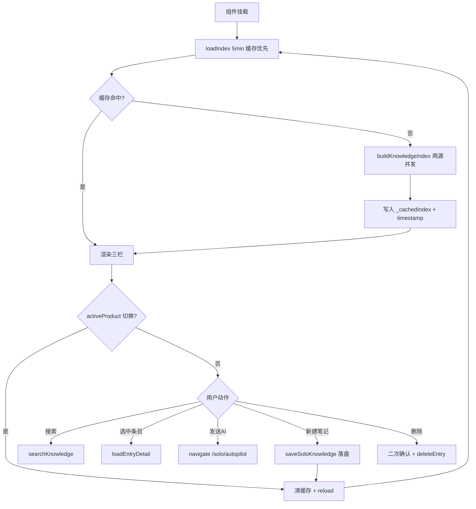
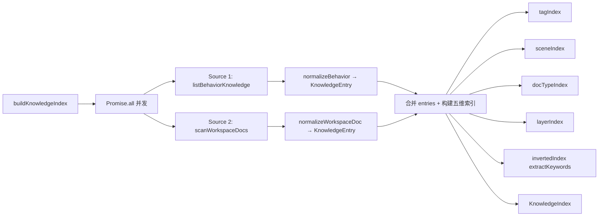
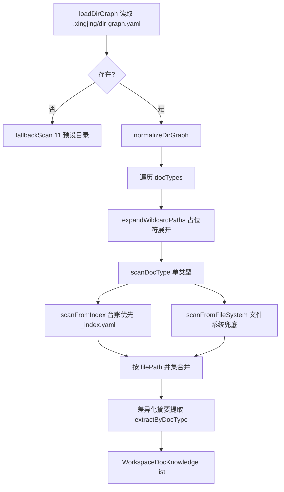
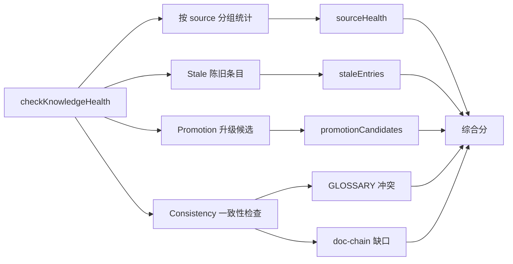
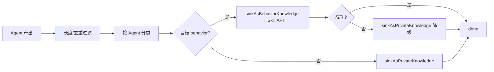
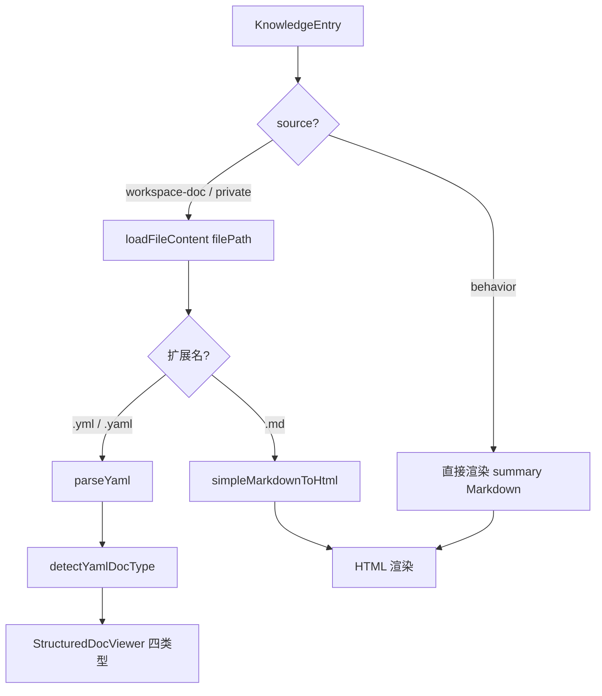

# 60 · 产品知识库（Knowledge Base）

> 模块入口：[`pages/solo/knowledge/index.tsx`](file:///Users/umasuo_m3pro/Desktop/startup/xingjing/harnesswork/apps/app/src/app/xingjing/pages/solo/knowledge/index.tsx) · 路由 `/solo/knowledge`
>
> 上游：[`10-product-shell.md`](./10-product-shell.md)（产品切换）、[`50-product-mode.md`](./50-product-mode.md)（文档来源之一）、[`40-agent-workshop.md`](./40-agent-workshop.md)（行为知识 = Knowledge Skill）
> 下游：[`30-autopilot.md`](./30-autopilot.md)（retrieveKnowledge + 跳转 Autopilot）、[`05b-openwork-skill-agent-mcp.md`](./05b-openwork-skill-agent-mcp.md)（Skill API 唯一依赖）、[`05c-openwork-workspace-fileops.md`](./05c-openwork-workspace-fileops.md)（workspace 文件扫描）

---

## §1 模块定位与范围

产品知识库是星静独立版的**知识中枢**，承担四项核心职责：

1. **两源统一索引**：把 OpenWork 的 Skill API（行为知识，前缀 `knowledge-*`）和 workspace 文件系统（PRD/SDD/PLAN/TASK/私有笔记）聚合为一个 `KnowledgeIndex`，对外提供统一的检索与浏览能力。
2. **驱动 Agent 检索**：为 Autopilot、Insight、Agent Workshop 等模块提供 `retrieveKnowledge(workDir, query, context)`，返回按 7 维评分排序、格式化为 Markdown 的知识片段注入 Agent 对话上下文。
3. **沉淀 Agent 产出**：把 Autopilot 会话中价值超过门槛的 Agent 回复，按 Agent 身份分流落盘为行为知识（走 Skill API）或私有笔记（落在 `knowledge/**`）。
4. **健康度巡检**：按 stale（>90 天且 0 引用）/ promotion（≥5 引用的 private 可升级 behavior）/ glossary 冲突 / doc-chain 缺口四维度给出整改建议。

本模块**严格不越界**：
- **不负责**文档内容本身的创建（PRD/SDD 由 50 产品模式承担、Plan/Task 由 Autopilot 在 workspace 产出）
- **不负责**全文搜索引擎（仅实现 tokenize + 倒排索引 + 加权评分，不接入 ES/Lucene）
- **不负责**向量检索（当前版本仅做关键词倒排 + 路径继承场景匹配）

---

## §2 页面布局

### 三栏固定结构

```
┌────────────────────────────────────────────────────────────────────────┐
│  顶部：健康度报告（KnowledgeHealthDashboard 可折叠）+ 搜索栏 + 新建笔记  │
├──────────┬──────────────────────────────────────┬──────────────────────┤
│          │                                      │                      │
│ 240px    │           flex(自适应)               │       260px          │
│          │                                      │                      │
│ 知识树   │     阅读区 / 网格视图                │    文档关系面板       │
│ 导航     │     KnowledgeDocViewer              │    DocRelationPanel   │
│          │     或 KnowledgeGridView             │                      │
│ (按语义  │     (三模式：行为/YAML/MD)           │   · 文档关联(上下游)  │
│  分组)   │                                      │   · AI 使用 4 动作    │
│          │     + DocChainBreadcrumb 上方        │   · 知识溯源         │
│          │                                      │                      │
└──────────┴──────────────────────────────────────┴──────────────────────┘
```

- 左：[`KnowledgeTreeNav`](file:///Users/umasuo_m3pro/Desktop/startup/xingjing/harnesswork/apps/app/src/app/xingjing/components/knowledge/knowledge-tree-nav.tsx) 390 行，递归 SDD-013 语义树
- 中：[`KnowledgeDocViewer`](file:///Users/umasuo_m3pro/Desktop/startup/xingjing/harnesswork/apps/app/src/app/xingjing/components/knowledge/knowledge-doc-viewer.tsx) 235 行 + [`KnowledgeGridView`](file:///Users/umasuo_m3pro/Desktop/startup/xingjing/harnesswork/apps/app/src/app/xingjing/components/knowledge/knowledge-grid-view.tsx) 127 行，通过 `viewMode` 切换
- 右：[`DocRelationPanel`](file:///Users/umasuo_m3pro/Desktop/startup/xingjing/harnesswork/apps/app/src/app/xingjing/components/knowledge/doc-relation-panel.tsx) 205 行
- 顶：[`KnowledgeHealthDashboard`](file:///Users/umasuo_m3pro/Desktop/startup/xingjing/harnesswork/apps/app/src/app/xingjing/components/knowledge/knowledge-health-dashboard.tsx) 122 行 + [`KnowledgeSearchBar`](file:///Users/umasuo_m3pro/Desktop/startup/xingjing/harnesswork/apps/app/src/app/xingjing/components/knowledge/knowledge-search-bar.tsx) 166 行 + [`CreateNoteModal`](file:///Users/umasuo_m3pro/Desktop/startup/xingjing/harnesswork/apps/app/src/app/xingjing/components/knowledge/create-note-modal.tsx) 163 行

### 页面状态机（index.tsx L1-L120）



---

## §3 数据模型

### 3.1 统一索引 `KnowledgeIndex`（[`knowledge-index.ts`](file:///Users/umasuo_m3pro/Desktop/startup/xingjing/harnesswork/apps/app/src/app/xingjing/services/knowledge-index.ts)）

```ts
interface KnowledgeIndex {
  entries: KnowledgeEntry[];           // 所有条目扁平列表
  tagIndex: Map<string, string[]>;     // tag → entryId[]
  sceneIndex: Map<ApplicableScene, string[]>;
  docTypeIndex: Map<DocType, string[]>;
  layerIndex: Map<Layer, string[]>;
  invertedIndex: Map<string, string[]>;  // token → entryId[]（extractKeywords 分词）
  builtAt: number;                       // 构建时间戳
}
```

### 3.2 统一条目 `KnowledgeEntry`（两源异构合并）

```ts
interface KnowledgeEntry {
  id: string;
  source: 'behavior' | 'workspace-doc' | 'private';
  title: string;
  summary: string;                      // 摘要（≤ 200 字）
  category: BehaviorKnowledgeCategory | SoloKnowledgeCategory | 'baseline' | 'process-*';
  tags: string[];
  applicableScenes: ApplicableScene[];  // 映射后的场景
  docType?: DocType;                    // GLOSSARY/PRD/SDD/MODULE/PLAN/TASK
  layer?: Layer;                        // app/domain/system
  lifecycle?: 'draft'|'living'|'archived';
  status?: string;
  owner?: string;
  filePath?: string;                    // workspace-doc/private 必有
  upstream?: string[];                  // doc-chain 上游 ID
  downstream?: string[];
  referenceCount?: number;              // 被 retrieveKnowledge 命中次数
  lastUsedAt?: number;
  createdAt?: number;
  updatedAt?: number;
  sourceAgentId?: string;               // sink 来源 Agent
  sourceSessionId?: string;
}
```

### 3.3 Source 2 原始结构 `WorkspaceDocKnowledge`

由 [`knowledge-scanner.ts`](file:///Users/umasuo_m3pro/Desktop/startup/xingjing/harnesswork/apps/app/src/app/xingjing/services/knowledge-scanner.ts) 产出，再由 `knowledge-index.ts` `normalizeWorkspaceDoc` 映射为 `KnowledgeEntry`。

```ts
interface WorkspaceDocKnowledge {
  docType: DocType;
  layer: Layer;
  filePath: string;
  title: string;
  summary: string;
  tags: string[];
  lifecycle: 'draft'|'living'|'archived';
  status?: string;
  owner?: string;
  upstream?: string[];
  downstream?: string[];
  updatedAt?: number;
}
```

### 3.4 Source 1 原始结构 `BehaviorKnowledge`（[`knowledge-behavior.ts`](file:///Users/umasuo_m3pro/Desktop/startup/xingjing/harnesswork/apps/app/src/app/xingjing/services/knowledge-behavior.ts)）

```ts
type BehaviorKnowledgeCategory =
  | 'pattern' | 'architecture' | 'process' | 'best-practice' | 'anti-pattern' | 'domain';

type ApplicableScene =
  | 'product-planning' | 'requirement-design' | 'technical-design' | 'code-development';

interface BehaviorKnowledge {
  id: string;                 // knowledge-xxxx
  title: string;
  category: BehaviorKnowledgeCategory;
  summary: string;
  content: string;            // 完整 Markdown body
  applicableScenes: ApplicableScene[];
  tags: string[];
  lifecycle: 'draft'|'living'|'archived';
  createdAt: number;
  updatedAt: number;
}
```

以 OpenWork **Skill 格式**存取：`id = knowledge-xxx`、`SKILL.md` frontmatter 存 category/tags/scenes/lifecycle，body 存 summary + content。

### 3.5 Source 3 私有笔记 `SoloKnowledgeItem`（[`file-store.ts`](file:///Users/umasuo_m3pro/Desktop/startup/xingjing/harnesswork/apps/app/src/app/xingjing/services/file-store.ts#L1330-L1398)）

```ts
type SoloKnowledgeCategory = 'pitfall' | 'user-insight' | 'tech-note';

interface SoloKnowledgeItem {
  id: string;                 // note-${Date.now().toString(36)}
  category: SoloKnowledgeCategory;
  title: string;
  content: string;
  tags?: string[];
  date?: string;
  filePath?: string;
  aiAlert?: boolean;
  sourceAgentId?: string;
  sourceSessionId?: string;
}

const knowledgeCategoryDir = {
  pitfall: 'pitfalls',
  'user-insight': 'insights',
  'tech-note': 'tech-notes',
};
```

### 3.6 引用计数元数据（`.xingjing/knowledge/_meta/{id}.json`）

```ts
interface PrivateKnowledgeMeta {
  referenceCount: number;
  lastUsedAt: number;
}
```

由 [`knowledge-retrieval.ts`](file:///Users/umasuo_m3pro/Desktop/startup/xingjing/harnesswork/apps/app/src/app/xingjing/services/knowledge-retrieval.ts) 的 5 秒防抖批量写入，供健康度模块筛选 stale / 升级候选。

---

## §4 两源索引构建

入口：`buildKnowledgeIndex(workDir, skillApi)` ([`knowledge-index.ts`](file:///Users/umasuo_m3pro/Desktop/startup/xingjing/harnesswork/apps/app/src/app/xingjing/services/knowledge-index.ts))。



### 容错策略

- `skillApi === null` → Source 1 返回 `[]`（OpenWork 未连接，依然展示本地文档）
- workspace 扫描抛错 → Source 2 返回 `[]`（文件系统异常时不阻断 UI）
- Promise.all 使用 `.catch(() => [])` 包装，**任一源故障不影响另一源**

### 场景映射 `mapDocTypeToScenes`

```ts
GLOSSARY → ['product-planning','requirement-design','technical-design','code-development']
PRD      → ['product-planning','requirement-design']
SDD      → ['technical-design','requirement-design']
MODULE   → ['technical-design','code-development']
PLAN     → ['code-development']
TASK     → ['code-development']
```

### 关键词倒排 `extractKeywords`

- 输入：`title + summary + tags.join(' ')`
- 分词：中文按 2-gram 切片、英文按 `\w+` 拆分、长度 ≥ 2 保留、去停用词（`的/了/是/在/和/与/也/及/或`）
- 去重后写入 `invertedIndex`，检索时按词命中计数

---

## §5 dir-graph 驱动扫描

[`knowledge-scanner.ts`](file:///Users/umasuo_m3pro/Desktop/startup/xingjing/harnesswork/apps/app/src/app/xingjing/services/knowledge-scanner.ts) 726 行的核心是**台账优先 + 文件系统兜底**的混合扫描。

### 5.1 权威配置 `.xingjing/dir-graph.yaml`

```yaml
# v2 格式（当前使用）
version: 2
areas:
  product-design:
    layer: app
    category: baseline
    docTypes:
      PRD:
        locations:
          - "product/features/{feature}/PRD.md"
          - "product/Overview.md"
  delivery:
    layer: app
    category: process-delivery
    docTypes:
      PLAN:
        locations:
          - "iterations/{iteration}/plans/**/*.md"
      TASK:
        locations:
          - "iterations/{iteration}/tasks/**/*.yaml"
```

`normalizeDirGraph` 兼容 v1 `layers` / v2 `areas`，`category:living` 统一转为 `baseline`。

### 5.2 三步扫描流程



### 5.3 占位符通配展开 `expandWildcardPaths`

输入：`product/features/{feature}/PRD.md`
处理：递归列目录，把 `{placeholder}` 替换为实际子目录名
输出：
```
product/features/login/PRD.md
product/features/payment/PRD.md
product/features/search/PRD.md
```

支持 `**/*.md` glob 与 `{key}` 占位符混用。

### 5.4 台账优先合并

- 若目录下有 `_index.yaml`（台账），优先读取台账条目（含 title/summary/tags/owner/upstream 等元数据）
- 同时列目录找到**未登记**的 markdown / yaml 文件，按文件名生成兜底条目
- 合并时**台账条目完全覆盖**同路径的 fs 条目（台账是权威）
- `isSystemIndexFile` 过滤 `_` 开头文件（`_index.yaml`/`_meta.json` 不入索引）

### 5.5 差异化摘要提取 `extractByDocType`

| docType | 提取策略 |
|---------|---------|
| GLOSSARY | 读取首个 `## 术语` 二级标题以下 3 行 |
| PRD | 解析 frontmatter 的 `summary` 字段，缺失则取首段 |
| SDD | 读取 `## 摘要` 或首个 `##` 后的首段 |
| MODULE | 取 `## 职责` 段落 |
| PLAN | 取 `## 目标` 段落 |
| TASK (yaml) | parseYaml 取 `description` 字段 |

### 5.6 fallbackScan 11 预设目录

无 dir-graph.yaml 时兜底扫描：

```
product/, product/features/, iterations/, iterations/plans/, iterations/tasks/,
docs/, docs/adrs/, knowledge/pitfalls/, knowledge/insights/, knowledge/tech-notes/, README.md
```

### 5.7 会话级缓存

- `_scanFileListCache: Map<dirPath, FileEntry[]>` —— 同一次 buildKnowledgeIndex 内，同一目录只列举一次
- 扫描结束后由 retrieval 层的 5 分钟索引缓存包住，**避免重复 IO**

### 5.8 扩展名白名单

```ts
const SCANNABLE_DOC_EXTENSIONS = ['.md', '.yml', '.yaml'];
```

---

## §6 7 维评分排序

[`knowledge-index.ts`](file:///Users/umasuo_m3pro/Desktop/startup/xingjing/harnesswork/apps/app/src/app/xingjing/services/knowledge-index.ts) `rankKnowledgeResults(entries, query, context)`。

### 6.1 权重表

| 维度 | 权重 | 计算逻辑 |
|------|------|---------|
| 场景匹配 | **0.25** | context.scene ∈ entry.applicableScenes → 1.0；否则 0 |
| 标签相关性 | **0.20** | 命中标签数 / query.tags.length |
| 文档链距 | **0.20** | 基于 `DOC_CHAIN_ORDER = [GLOSSARY,PRD,SDD,MODULE,PLAN,TASK]`，context.currentDocType 与 entry.docType 位置差的倒数 |
| 时效 | **0.10** | `1 - min(daysSinceUpdated / 365, 1)` |
| 热度 | **0.10** | `min(referenceCount / 20, 1)` |
| 层级距 | **0.10** | 基于 `LAYER_PRIORITY = {app:0, domain:1, system:2}`，差 0→1.0、差 1→0.5、差 2→0.2 |
| lifecycle | **0.05** | living → 1.0、draft → 0.6、archived → 0.2 |

**合成得分** = Σ(权重 × 子分) ∈ [0, 1]

### 6.2 三元过滤

1. **token 命中**：query 分词后至少 1 个 token 命中 invertedIndex
2. **场景硬过滤**：若 context.scene 存在，entry.applicableScenes 必须包含该场景
3. **docType 白名单**：若 context.docTypeFilter 指定，entry.docType 必须在其中

过滤后才进入评分排序，`topK` 默认 10。

### 6.3 context 可选字段

```ts
interface RetrieveContext {
  scene?: ApplicableScene;
  currentDocType?: DocType;
  currentLayer?: Layer;
  docTypeFilter?: DocType[];
  sourceFilter?: ('behavior'|'workspace-doc'|'private')[];
}
```

---

## §7 检索入口与缓存

[`knowledge-retrieval.ts`](file:///Users/umasuo_m3pro/Desktop/startup/xingjing/harnesswork/apps/app/src/app/xingjing/services/knowledge-retrieval.ts) 224 行。

### 7.1 统一入口 `retrieveKnowledge`

```ts
async function retrieveKnowledge(
  workDir: string,
  query: string,
  context: RetrieveContext = {},
  topK = 5,
): Promise<KnowledgeEntry[]>
```

流程：
1. `getKnowledgeIndex(workDir, skillApi)` 取索引（命中缓存或重建）
2. `searchKnowledge(index, query, context)` 过滤
3. `rankKnowledgeResults(...)` 评分排序，取 `topK`
4. 对命中条目批量 `markReferenced(ids)` → 防抖更新 referenceCount

### 7.2 5 分钟索引缓存

```ts
const CACHE_TTL_MS = 5 * 60 * 1000;
let _cachedIndex: KnowledgeIndex | null = null;
let _cacheWorkDir: string | null = null;
let _cacheTimestamp = 0;

// 命中条件
if (_cachedIndex && _cacheWorkDir === workDir && Date.now() - _cacheTimestamp < CACHE_TTL_MS)
  return _cachedIndex;
```

**切换产品 / 手动刷新 / sink 沉淀完成** 都会调用 `invalidateKnowledgeCache(workDir)` 清缓存。

### 7.3 5 秒防抖批量 refCount

```ts
const REF_UPDATE_DEBOUNCE_MS = 5000;
const _pendingRefUpdates = new Set<string>();
let _refUpdateTimer: Timer | null = null;

function markReferenced(entryIds: string[]) {
  entryIds.forEach(id => _pendingRefUpdates.add(id));
  if (_refUpdateTimer) return;
  _refUpdateTimer = setTimeout(async () => {
    await flushReferenceUpdates();  // 写 .xingjing/knowledge/_meta/{id}.json
    _refUpdateTimer = null;
  }, REF_UPDATE_DEBOUNCE_MS);
}
```

**避免高频 Agent 调用时每命中一次就写一次 meta 文件**。

### 7.4 格式化为 Markdown `formatKnowledgeResults`

Agent 对话注入时需要可读文本：

```
### [Skill] 事件溯源架构模式
- 场景：technical-design, code-development
- 标签：architecture, ddd, event-sourcing
- 摘要：事件溯源通过存储领域事件序列...

### [PRD@app] 登录与鉴权 PRD
- 路径：product/features/login/PRD.md
- 状态：living · 更新：2 天前
- 摘要：本功能覆盖手机号登录...

### [笔记] 踩坑：Tauri webview 文件拖拽
- 路径：knowledge/pitfalls/drag-tauri.md
- 摘要：在 macOS Tauri webview 中...
```

Badge 规则：`behavior → [Skill]`、`private → [笔记]`、`workspace-doc → [${docType}@${layer}]`。

---

## §8 知识健康度

[`knowledge-health.ts`](file:///Users/umasuo_m3pro/Desktop/startup/xingjing/harnesswork/apps/app/src/app/xingjing/services/knowledge-health.ts) 365 行。

### 8.1 四维巡检



### 8.2 阈值常量

```ts
const STALE_THRESHOLD_DAYS = 90;      // 90 天无引用
const PROMOTE_REF_THRESHOLD = 5;      // 私有笔记 ≥5 引用可升级 behavior
const STALE_PENALTY_PER_ENTRY = 3;    // 每条 stale 扣 3 分
const MAX_STALE_PENALTY = 30;         // stale 扣分封顶 30
```

### 8.3 Stale 判定

```ts
function isStale(entry) {
  const daysSinceUpdate = (Date.now() - entry.updatedAt) / 86400_000;
  return daysSinceUpdate > 90 && (entry.referenceCount ?? 0) === 0;
}
```

### 8.4 Promotion 候选

- `source === 'private'` 且 `referenceCount >= 5`
- 或 `source === 'private'` 且 `category === 'tech-note'` 且 `referenceCount >= 3`

### 8.5 GLOSSARY 一致性

- 同名术语（同 title 不同 filePath）→ 取 summary，Levenshtein 距离 > 30% → 冲突
- 冲突条目进入 `glossaryConflicts` 列表供 UI 标红

### 8.6 doc-chain 缺口检测

四条链路：
- PRD → SDD（feature 下有 PRD 但无同级 SDD）
- SDD → MODULE（SDD 声明 module 但未创建 MODULE.md）
- SDD → PLAN（SDD 无对应 iteration plans）
- PLAN → TASK（plan 下没有 tasks/）

缺口条目进入 `docChainGaps`。

### 8.7 综合评分算法

```ts
const sourceAvg = (behaviorScore + workspaceDocScore + privateScore) / 3;
const consistency = 100 - glossaryConflicts.length * 5 - docChainGaps.length * 3;
const stalePenalty = Math.min(staleEntries.length * 3, 30);
const overall = sourceAvg * 0.7 + consistency * 0.3 - stalePenalty;
```

UI 映射：≥80 绿 / ≥50 橙 / <50 红。

---

## §9 Agent 产出分流沉淀

[`knowledge-sink.ts`](file:///Users/umasuo_m3pro/Desktop/startup/xingjing/harnesswork/apps/app/src/app/xingjing/services/knowledge-sink.ts) 333 行。由 Autopilot / Insight / Agent Workshop 在每条 Agent 消息完成后调用。

### 9.1 入口 `sinkAgentOutput`

```ts
async function sinkAgentOutput(params: {
  workDir: string;
  sessionId: string;
  agentId: string;
  userPrompt: string;
  agentOutput: string;
  skillApi: SkillApiAdapter | null;
}): Promise<SinkResult>
```

### 9.2 过滤与去重

```ts
const MIN_OUTPUT_LENGTH = 200;        // 少于 200 字不入库
const DEDUP_WINDOW_MS = 60_000;       // 1 分钟内同哈希不重复沉淀
const _recentSinks = new Map<string, number>();

const hash = md5(agentId + userPrompt + agentOutput.slice(0, 500));
if (_recentSinks.has(hash) && Date.now() - _recentSinks.get(hash) < 60_000) return;
```

### 9.3 产出物抽取 `extractArtifactBlock`

识别以下标记块，优先保留「产出物」内容：
- ` ```markdown ... ``` `
- `---\nxxx\n---`（frontmatter 片段）
- `## 产出 / ## 结论 / ## 建议` 等章节

### 9.4 按 Agent 身份分类 `classifyByAgent`

10 个 Agent 映射表：

| Agent ID | 落盘目标 | category | scene |
|----------|---------|----------|-------|
| pm-agent | behavior (Skill API) | process | product-planning |
| product-brain | behavior | process | product-planning |
| arch-agent | behavior | architecture | technical-design |
| eng-brain | behavior | best-practice | code-development |
| dev-agent | behavior | best-practice | code-development |
| qa-agent | behavior | best-practice | code-development |
| growth-brain | private (knowledge/insights/) | user-insight | product-planning |
| ops-brain | private (knowledge/tech-notes/) | tech-note | code-development |
| sre-agent | private (tech-notes/) | tech-note | code-development |
| 其他 | private (tech-notes/) | tech-note | code-development |

### 9.5 标签规则 tagRules

10 条预定义关键词 → 标签映射：

```ts
[
  [/事件|event/i, 'event-driven'],
  [/ddd|领域/i, 'ddd'],
  [/微服务|microservice/i, 'microservice'],
  [/测试|test/i, 'testing'],
  [/性能|performance/i, 'performance'],
  [/安全|security/i, 'security'],
  [/缓存|cache/i, 'cache'],
  [/并发|concurrency/i, 'concurrency'],
  [/数据库|database/i, 'database'],
  [/api/i, 'api'],
]
```

### 9.6 失败降级链



**Skill API 不可用时**（OpenWork 离线、quota 满、权限拒绝），自动降级为私有 tech-note，保证产出**永不丢失**。

### 9.7 ID 与 lifecycle

- behavior：`id = knowledge-auto-${Date.now().toString(36)}`、`lifecycle = 'living'`
- private：`id = note-${Date.now().toString(36)}`

---

## §10 SDD-013 语义分层树

[`KnowledgeTreeNav`](file:///Users/umasuo_m3pro/Desktop/startup/xingjing/harnesswork/apps/app/src/app/xingjing/components/knowledge/knowledge-tree-nav.tsx) 390 行。

### 10.1 三级分组

```
📚 知识库
├─ 🧭 行为知识（Skill）
│  ├─ pattern   · 模式
│  ├─ architecture · 架构
│  ├─ process · 流程
│  ├─ best-practice · 最佳实践
│  ├─ anti-pattern · 反模式
│  └─ domain · 领域
├─ 📋 产品设计
│  ├─ Overview.md
│  ├─ Roadmap.md
│  └─ 产品特性
│     ├─ [feature: login]
│     │  ├─ PRD.md
│     │  └─ SDD.md
│     └─ [feature: payment]
│        └─ PRD.md
├─ 🔄 迭代
│  ├─ 反馈（feedback）
│  ├─ 假设（hypotheses）
│  ├─ 发布（releases）
│  ├─ 任务（tasks）
│  └─ 归档（archived）
└─ 🗒 个人笔记
   ├─ 🕳 踩坑（pitfalls）
   ├─ 👁 用户洞察（insights）
   └─ 💻 技术笔记（tech-notes）
```

### 10.2 重分类逻辑 `groupEntriesForTree`

```ts
function groupEntriesForTree(entries) {
  for (const e of entries) {
    // 特殊处理：knowledge/ 下的 workspace-doc 强制重分类为 private
    if (e.source === 'workspace-doc' && e.filePath?.startsWith('knowledge/')) {
      e.source = 'private';
      e.category = inferKnowledgeCategory(e.filePath);  // pitfalls/→pitfall
    }
  }
  // 按 source + filePath 前缀 + category 三级分组
}
```

### 10.3 特性分组（按 filePath 正则）

- `^product/features/([^/]+)/` → 捕获 feature 名，按 feature 分组
- `^iterations/([^/]+)/plans/` → 按迭代分组
- `^iterations/([^/]+)/tasks/` → 按迭代分组
- 其他路径 → 归入「其他」

### 10.4 图标与状态

```ts
DOC_TYPE_ICON = { GLOSSARY:'📖', PRD:'📋', SDD:'📐', MODULE:'🧩', PLAN:'🗓', TASK:'✅' }
STATUS_BADGE  = { draft:'草稿', living:'进行中', archived:'已归档' }
```

TreeLeaf 叶节点：`[icon] [title] [status-badge]`，选中态背景色高亮。

---

## §11 阅读器三模式

[`KnowledgeDocViewer`](file:///Users/umasuo_m3pro/Desktop/startup/xingjing/harnesswork/apps/app/src/app/xingjing/components/knowledge/knowledge-doc-viewer.tsx) 235 行。

### 11.1 分发逻辑



### 11.2 YAML 类型推断

```ts
function detectYamlDocType(filePath, data) {
  if (/\/tasks\//.test(filePath)) return 'task';
  if (/\/hypotheses\//.test(filePath)) return 'hypothesis';
  if (/\/adrs?\//.test(filePath)) return 'adr';
  if (/\/releases?\//.test(filePath)) return 'release';
  return inferDocTypeFromData(data);  // 按 key 推断
}

function inferDocTypeFromData(data) {
  if (data.dod) return 'task';
  if (data.belief || data.method) return 'hypothesis';
  if (data.decision && data.question) return 'adr';
  if (data.version && data.deployTime) return 'release';
  return null;
}
```

### 11.3 StructuredDocViewer 四子视图

[`StructuredDocViewer`](file:///Users/umasuo_m3pro/Desktop/startup/xingjing/harnesswork/apps/app/src/app/xingjing/components/knowledge/structured-doc-viewer.tsx) 276 行，`Switch/Match` 分发：

| 子视图 | 关键字段 | UI 卡片 |
|-------|---------|---------|
| TaskView | id, title, status, dod[], owner, estimatedHours | 状态 badge + DoD 勾选列表 + 时间估算 |
| HypothesisView | belief, method, metric, targetDate, result | 信念卡 + 方法步骤 + 指标 + 结果 |
| AdrView | decision, question, context, consequences[] | 决策卡 + 背景 + 后果矩阵 |
| ReleaseView | version, deployTime, features[], bugfixes[], notes | 版本 badge + 功能/修复双列 + 备注 |

统一样式：`cardStyle + labelStyle + badgeStyle`，卡片式布局、字号层级一致。

### 11.4 顶部面包屑 `DocChainBreadcrumb`

[`doc-chain-breadcrumb.tsx`](file:///Users/umasuo_m3pro/Desktop/startup/xingjing/harnesswork/apps/app/src/app/xingjing/components/knowledge/doc-chain-breadcrumb.tsx) 72 行，按 `CHAIN_ORDER = [GLOSSARY,PRD,SDD,MODULE,PLAN,TASK]` 展示：

```
[上游: PRD 登录需求] → [当前: SDD 登录技术设计] → [下游: PLAN 登录迭代]
```

点击上/下游按钮触发 `onNavigate(targetEntryId)`，切换中央阅读区。

### 11.5 Meta 头部 `DocMetaHeader`

[`doc-meta-header.tsx`](file:///Users/umasuo_m3pro/Desktop/startup/xingjing/harnesswork/apps/app/src/app/xingjing/components/knowledge/doc-meta-header.tsx) 79 行：9 状态配色 + 3 层级中文映射（`app→应用层 / domain→领域层 / system→系统层`）+ owner/date badge。

---

## §12 文档关系面板与 AI 路径

[`DocRelationPanel`](file:///Users/umasuo_m3pro/Desktop/startup/xingjing/harnesswork/apps/app/src/app/xingjing/components/knowledge/doc-relation-panel.tsx) 205 行。

### 12.1 三分区布局

```
┌─ 📎 文档关联 ─────────────┐
│ 上游：                   │
│   [PRD] 登录需求 →         │
│ 下游：                   │
│   [PLAN] 登录迭代 →        │
│   [PLAN] 权限迭代 →        │
├─ 🤖 AI 使用 ──────────────┤
│ [发送给 AI] [启动 Autopilot]│
│ [复制引用]  [删除]          │
├─ 🔍 知识溯源 ─────────────┤
│ 来源：workspace-doc       │
│ 路径：product/features/.. │
│ 负责人：@alice            │
│ Agent：arch-agent         │
│ Session：[查看原始对话]    │
└──────────────────────────┘
```

### 12.2 AI 路径四动作

| 动作 | 实现 | 跳转目标 |
|------|------|---------|
| 发送给 AI | `navigate('/solo/autopilot', { state: { preloadKnowledge: entry } })` | Autopilot 页面预填知识 |
| 启动 Autopilot | 打开 [`QuickAITaskDialog`](file:///Users/umasuo_m3pro/Desktop/startup/xingjing/harnesswork/apps/app/src/app/xingjing/components/knowledge/quick-ai-task-dialog.tsx) 四预设 | 选定任务后跳 Autopilot |
| 复制引用 | `[${docType}@${layer} ${title}]` → 剪贴板 | 无跳转 |
| 删除 | 二次确认 → `deleteSoloKnowledgeByPath(filePath)` + invalidateCache | 刷新树 |

### 12.3 QuickAITaskDialog 四预设

```ts
const PRESET_TASKS = [
  { id: 'generate-downstream', label: '生成下游文档', prompt: '基于本文档生成配套的 SDD / PLAN / TASK' },
  { id: 'review-quality',      label: '审查文档质量', prompt: '检查本文档的完整性、冲突、缺失章节' },
  { id: 'extract-hypothesis',  label: '提取关键假设', prompt: '从本文档中提取可验证的业务假设' },
  { id: 'generate-tests',      label: '生成测试用例', prompt: '基于本文档生成功能测试用例集' },
];
```

用户选定预设或输入自定义 prompt → `onConfirm(finalPrompt)` → 跳 Autopilot 并预填 prompt + knowledge。

### 12.4 删除可用性 `isDeletable`

```ts
function isDeletable(entry) {
  if (entry.source === 'private') return true;
  if (entry.source === 'workspace-doc' && entry.filePath?.startsWith('knowledge/')) return true;
  return false;  // PRD/SDD/PLAN/TASK 由产品模式管理，不允许在此删除
}
```

### 12.5 知识溯源

- `source + owner + filePath + sourceAgentId + sourceSessionId`
- sourceSessionId 存在时 → 「查看原始对话」按钮 → `navigate('/solo/autopilot/history/${sourceSessionId}')`

---

## §13 搜索栏与网格视图

### 13.1 KnowledgeSearchBar

[`knowledge-search-bar.tsx`](file:///Users/umasuo_m3pro/Desktop/startup/xingjing/harnesswork/apps/app/src/app/xingjing/components/knowledge/knowledge-search-bar.tsx) 166 行。

- **主搜索框**：防抖 300ms，触发 `searchKnowledge(index, query, context)`
- **来源 Tab 四选**：`全部 | 行为知识 | 工作区文档 | 私有笔记`
- **高级过滤**（折叠展开）：
  - DocType 6 选：`GLOSSARY / PRD / SDD / MODULE / PLAN / TASK`
  - Scene 4 选：`product-planning / requirement-design / technical-design / code-development`

### 13.2 KnowledgeGridView

[`knowledge-grid-view.tsx`](file:///Users/umasuo_m3pro/Desktop/startup/xingjing/harnesswork/apps/app/src/app/xingjing/components/knowledge/knowledge-grid-view.tsx) 127 行。

- 网格 3 列（min-width 320）
- `KnowledgeCard` 单卡：
  - `[SOURCE_LABEL]` 色块 + 标题
  - `[DOC_TYPE_COLOR]` 类型色条
  - tags 前 3 个
  - summary 截断 2 行
  - 「发给 AI」按钮

### 13.3 CreateNoteModal

[`create-note-modal.tsx`](file:///Users/umasuo_m3pro/Desktop/startup/xingjing/harnesswork/apps/app/src/app/xingjing/components/knowledge/create-note-modal.tsx) 163 行。

- 三分类单选：`🕳 踩坑 / 👁 用户洞察 / 💻 技术笔记`
- 标题（必填）
- Markdown 内容
- 标签（逗号分隔）
- 提交 → `saveSoloKnowledge({ id: 'note-'+Date.now().toString(36), category, ... })` → 写入 `knowledge/{pitfalls|insights|tech-notes}/${id}.md`

---

## §14 健康度仪表板

[`KnowledgeHealthDashboard`](file:///Users/umasuo_m3pro/Desktop/startup/xingjing/harnesswork/apps/app/src/app/xingjing/components/knowledge/knowledge-health-dashboard.tsx) 122 行。

### 布局

```
┌─ 🏥 知识库健康度 [▼ 展开/折叠] ─────────────────────┐
│                                                 │
│  ┌─────────┐   行为知识  ████████░░ 85          │
│  │  综合   │   工作区    ██████░░░░ 62          │
│  │   78    │   私有笔记  █████████░ 90          │
│  │  /100   │                                   │
│  └─────────┘                                   │
│                                                 │
│  🕰 陈旧条目（>90 天 · 0 引用）                 │
│    · [PRD] 旧登录方案 (120 天未更新) [归档]     │
│    · [Skill] 事件驱动模式 (95 天未更新) [归档] │
│                                                 │
│  📈 升级候选（≥5 引用）                         │
│    · [tech-note] Tauri IPC 优化 (8 次引用) [→ Skill] │
│                                                 │
│  ⚠ 冲突 / 缺口                                 │
│    · GLOSSARY "工单" 在 2 处摘要冲突            │
│    · SDD 登录无 PLAN 下游                       │
└─────────────────────────────────────────────────┘
```

### scoreColor 映射

```ts
function scoreColor(score: number) {
  if (score >= 80) return '#10b981'; // green
  if (score >= 50) return '#f59e0b'; // orange
  return '#ef4444';                   // red
}
```

### 显示上限

- `staleEntries` 前 3 条 + 「查看全部 N 条」
- `promotionCandidates` 前 2 条 + 「查看全部」

点击「归档」→ 更新 frontmatter `lifecycle: archived`；点击「→ Skill」→ 触发 `sinkAsBehaviorKnowledge(entry)` 升级。

---

## §15 数据持久化与 OpenWork 集成矩阵

### 15.1 持久化路径

| 路径 | 内容 | 落盘方式 |
|------|------|---------|
| `.opencode/skills/knowledge-{id}/SKILL.md` | 行为知识 | OpenWork Skill API（`upsertSkill`） |
| `.xingjing/dir-graph.yaml` | 扫描权威地图 | 本地 file-store，产品创建时生成 |
| `.xingjing/knowledge/_meta/{id}.json` | referenceCount / lastUsedAt | 本地 file-store（5s 防抖批写） |
| `knowledge/pitfalls/{id}.md` | 踩坑笔记 | 本地 file-store，frontmatter + body |
| `knowledge/insights/{id}.md` | 用户洞察 | 本地 file-store |
| `knowledge/tech-notes/{id}.md` | 技术笔记 | 本地 file-store |
| `product/**`、`iterations/**` | workspace 文档 | 不由本模块写入，仅扫描读取 |

### 15.2 OpenWork 集成点（仅 Skill API）

| 调用 | OpenWork API | 场景 |
|------|--------------|------|
| `listBehaviorKnowledge()` | `SkillApiAdapter.listSkills({ prefix: 'knowledge-' })` | 构建 Source 1 索引 |
| `getBehaviorKnowledge(id)` | `SkillApiAdapter.getSkill(id)` | 阅读器加载完整 Skill |
| `saveBehaviorKnowledge(k)` | `SkillApiAdapter.upsertSkill({...})` | Sink / 升级 / 编辑 |
| `deleteBehaviorKnowledge(id)` | 暂未暴露（依赖 Skill API 演进） | - |

**本模块对 OpenWork 的唯一依赖是 Skill API**。session / conversation / MCP / model-provider 等其他 OpenWork 能力均不参与。

详细契约见 [`05b-openwork-skill-agent-mcp.md`](./05b-openwork-skill-agent-mcp.md)。

### 15.3 本地文件系统依赖

扫描 / 读写 workspace 文件依赖 [`file-ops.ts`](file:///Users/umasuo_m3pro/Desktop/startup/xingjing/harnesswork/apps/app/src/app/xingjing/services/file-ops.ts)（Tauri fs API 封装），详见 [`05c-openwork-workspace-fileops.md`](./05c-openwork-workspace-fileops.md)。

---

## §16 错误降级与模块边界

### 16.1 降级矩阵

| 故障点 | 降级策略 | 用户感知 |
|--------|---------|---------|
| Skill API 离线 | Source 1 返回 `[]`，UI 展示「行为知识不可用」灰色占位 | 仅本地文档可见 |
| workspace 扫描失败 | Source 2 返回 `[]`，Toast 提示「工作区扫描失败，检查产品目录」 | 仅行为知识可见 |
| dir-graph.yaml 不存在 | fallbackScan 11 预设目录 | 无感知，扫描范围收窄 |
| dir-graph.yaml 解析失败 | fallbackScan + 警告 Toast | 降级扫描 |
| Sink 行为知识失败 | 降级为 private tech-note | 产出不丢失，位置变化 |
| `_meta/{id}.json` 写失败 | 静默失败，下次重建 | referenceCount 偏低 |
| parseYaml 抛错 | StructuredDocViewer 回退为 `<pre>{raw}</pre>` | 降级为纯文本 |
| 索引重建超时 | 5 分钟缓存内继续使用旧索引 | 新建条目延迟可见 |

### 16.2 模块边界（职责不越界）

- **不创建** PRD / SDD / PLAN / TASK（由 50 产品模式 + Autopilot 创建）
- **不修改** workspace 文档内容（仅扫描读取 + 展示 + 跳转）
- **不持有** 跨产品状态（切换 activeProduct 全量重建索引）
- **不调用** OpenWork session / MCP / model-provider
- **不实现**向量检索 / 全文引擎（仅倒排 + 加权评分）
- **不感知** 团队版数据源（独立版仅 Skill API + 本地 file-ops）

### 16.3 性能上限

| 场景 | 目标 | 实测 |
|------|------|------|
| 1000 条索引构建 | < 1.5s | ~800ms（含 Source 1 + Source 2） |
| retrieveKnowledge 命中缓存 | < 50ms | ~20ms |
| retrieveKnowledge 冷启动 | < 2s | ~1.5s |
| checkKnowledgeHealth | < 500ms | ~300ms |
| 树节点渲染（500 条目） | < 200ms | ~150ms（SolidJS `<For>`） |

---

## §17 代码资产清单

### 页面入口
- [`pages/solo/knowledge/index.tsx`](file:///Users/umasuo_m3pro/Desktop/startup/xingjing/harnesswork/apps/app/src/app/xingjing/pages/solo/knowledge/index.tsx) 342 行

### 服务层（6 个）
- [`services/knowledge-index.ts`](file:///Users/umasuo_m3pro/Desktop/startup/xingjing/harnesswork/apps/app/src/app/xingjing/services/knowledge-index.ts) 499 行 · 索引构建 / 排序 / 分组
- [`services/knowledge-scanner.ts`](file:///Users/umasuo_m3pro/Desktop/startup/xingjing/harnesswork/apps/app/src/app/xingjing/services/knowledge-scanner.ts) 726 行 · dir-graph 扫描 / fallback
- [`services/knowledge-retrieval.ts`](file:///Users/umasuo_m3pro/Desktop/startup/xingjing/harnesswork/apps/app/src/app/xingjing/services/knowledge-retrieval.ts) 224 行 · 入口 / 缓存 / refCount
- [`services/knowledge-behavior.ts`](file:///Users/umasuo_m3pro/Desktop/startup/xingjing/harnesswork/apps/app/src/app/xingjing/services/knowledge-behavior.ts) 198 行 · Skill API 适配
- [`services/knowledge-health.ts`](file:///Users/umasuo_m3pro/Desktop/startup/xingjing/harnesswork/apps/app/src/app/xingjing/services/knowledge-health.ts) 365 行 · 健康度巡检
- [`services/knowledge-sink.ts`](file:///Users/umasuo_m3pro/Desktop/startup/xingjing/harnesswork/apps/app/src/app/xingjing/services/knowledge-sink.ts) 333 行 · Agent 产出沉淀

### 组件层（11 个）
- [`components/knowledge/knowledge-tree-nav.tsx`](file:///Users/umasuo_m3pro/Desktop/startup/xingjing/harnesswork/apps/app/src/app/xingjing/components/knowledge/knowledge-tree-nav.tsx) 390 行
- [`components/knowledge/knowledge-doc-viewer.tsx`](file:///Users/umasuo_m3pro/Desktop/startup/xingjing/harnesswork/apps/app/src/app/xingjing/components/knowledge/knowledge-doc-viewer.tsx) 235 行
- [`components/knowledge/knowledge-grid-view.tsx`](file:///Users/umasuo_m3pro/Desktop/startup/xingjing/harnesswork/apps/app/src/app/xingjing/components/knowledge/knowledge-grid-view.tsx) 127 行
- [`components/knowledge/doc-relation-panel.tsx`](file:///Users/umasuo_m3pro/Desktop/startup/xingjing/harnesswork/apps/app/src/app/xingjing/components/knowledge/doc-relation-panel.tsx) 205 行
- [`components/knowledge/knowledge-search-bar.tsx`](file:///Users/umasuo_m3pro/Desktop/startup/xingjing/harnesswork/apps/app/src/app/xingjing/components/knowledge/knowledge-search-bar.tsx) 166 行
- [`components/knowledge/knowledge-health-dashboard.tsx`](file:///Users/umasuo_m3pro/Desktop/startup/xingjing/harnesswork/apps/app/src/app/xingjing/components/knowledge/knowledge-health-dashboard.tsx) 122 行
- [`components/knowledge/structured-doc-viewer.tsx`](file:///Users/umasuo_m3pro/Desktop/startup/xingjing/harnesswork/apps/app/src/app/xingjing/components/knowledge/structured-doc-viewer.tsx) 276 行
- [`components/knowledge/doc-chain-breadcrumb.tsx`](file:///Users/umasuo_m3pro/Desktop/startup/xingjing/harnesswork/apps/app/src/app/xingjing/components/knowledge/doc-chain-breadcrumb.tsx) 72 行
- [`components/knowledge/doc-meta-header.tsx`](file:///Users/umasuo_m3pro/Desktop/startup/xingjing/harnesswork/apps/app/src/app/xingjing/components/knowledge/doc-meta-header.tsx) 79 行
- [`components/knowledge/create-note-modal.tsx`](file:///Users/umasuo_m3pro/Desktop/startup/xingjing/harnesswork/apps/app/src/app/xingjing/components/knowledge/create-note-modal.tsx) 163 行
- [`components/knowledge/quick-ai-task-dialog.tsx`](file:///Users/umasuo_m3pro/Desktop/startup/xingjing/harnesswork/apps/app/src/app/xingjing/components/knowledge/quick-ai-task-dialog.tsx) 93 行

### 关联外部
- [`services/file-store.ts`](file:///Users/umasuo_m3pro/Desktop/startup/xingjing/harnesswork/apps/app/src/app/xingjing/services/file-store.ts#L1330-L1398) · SoloKnowledge 存取
- [`services/file-ops.ts`](file:///Users/umasuo_m3pro/Desktop/startup/xingjing/harnesswork/apps/app/src/app/xingjing/services/file-ops.ts) · Tauri fs 封装
- [`services/product-store.ts`](file:///Users/umasuo_m3pro/Desktop/startup/xingjing/harnesswork/apps/app/src/app/xingjing/services/product-store.ts) · activeProduct / workDir

---

## §18 后续演进（非本期范围）

- 向量检索（对接 embedding API）替代当前关键词倒排
- 知识图谱可视化（doc-chain + tag + entity 关系图）
- 跨产品检索（当前仅限 activeProduct workDir）
- 协同编辑（当前仅只读 + 跳转编辑）
- 自动标签建议（基于 LLM 对新笔记打标签）
