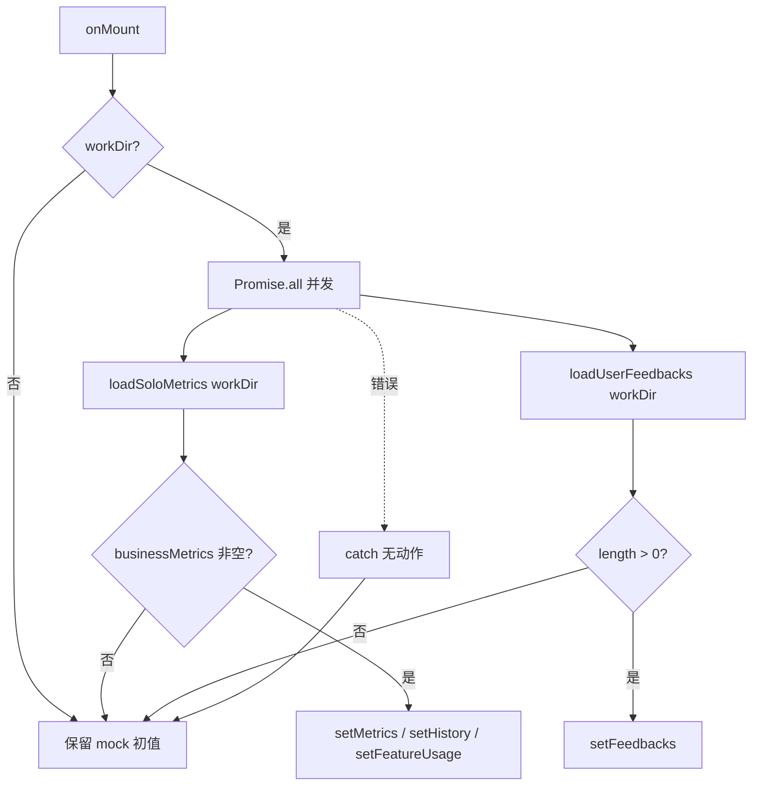
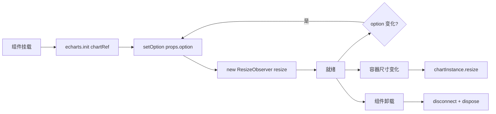
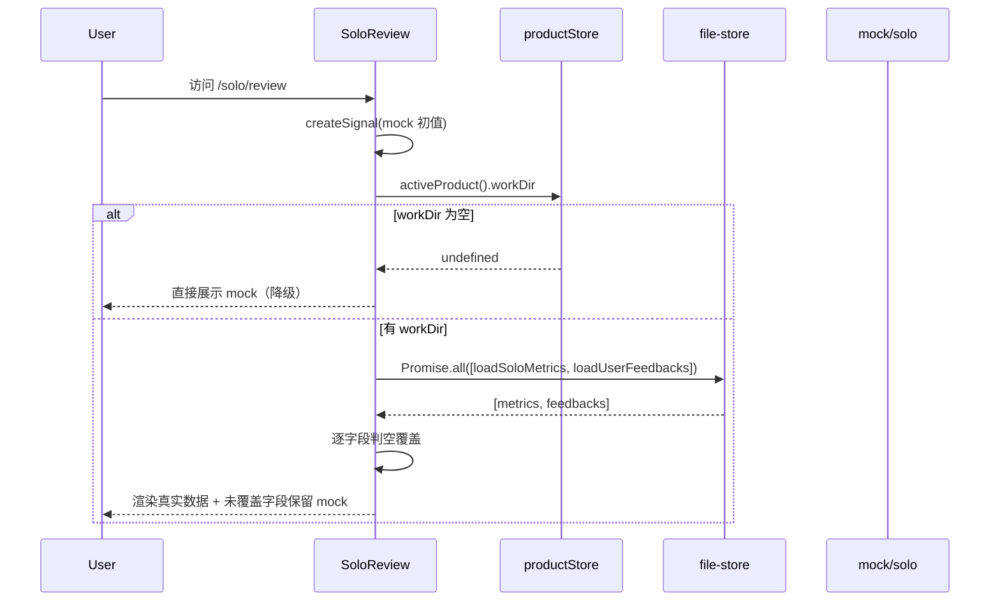
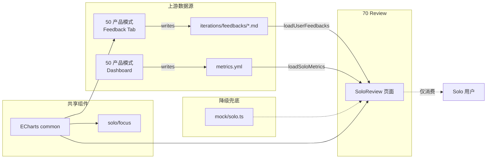

# 70 · 运营评估（Solo Review）

> 模块入口：[`pages/solo/review/index.tsx`](file:///Users/umasuo_m3pro/Desktop/startup/xingjing/harnesswork/apps/app/src/app/xingjing/pages/solo/review/index.tsx) · 路由 `/solo/review`
>
> 上游：[`50-product-mode.md`](./50-product-mode.md)（反馈数据来源）、[`10-product-shell.md`](./10-product-shell.md)（activeProduct workDir）
> 下游：无（本模块为终端消费模块，不对外暴露服务）

> **⚠️ v0.12.0 重要变更 — 旧实现已完全移除**：
> 
> 本文档描述的 `ReviewPage`、`components/common/echarts.tsx` 等 `apps/app/src/app/xingjing/` 下所有源文件**已完全删除**。
> 
> **新集成方案（React 19）**：
> - 评估模块集成进 `/settings/xingjing/review` tab（扩展 [`SettingsRoute`](file:///Users/umasuo_m3pro/Desktop/startup/xingjing/harnesswork/apps/app/src/react-app/shell/settings-route.tsx)）
> - 数据来源：本地 `.opencode/docs/metrics.yml`（workspace 文件）
> - 图表可中就 echarts 或 React 图表库重新实现
> 
> **以下内容为 SolidJS v0.11.x 时代评估模块历史设计档案**，可作产品功能设计参考。

---

## §1 模块定位与用户价值

Solo Review 是星静独立版的**商业数据复盘中枢**，与团队版的 DORA 工程效能度量形成明确对照。

### 1.1 核心定位

> **独立开发者关心的不是"部署频率"，而是"这周有多少人付钱"。**

| 维度 | 独立版（本模块） | 团队版（out of scope） |
|------|----------------|------------------------|
| 核心关注 | **商业指标** | 工程效能（DORA） |
| 指标示例 | DAU、MRR、留存、NPS | 部署频率、前置时间、失败率、MTTR |
| 用户视角 | 产品运营者 | 研发管理者 |
| 决策对象 | 「下周做哪个功能」 | 「下周优化哪个流程」 |

### 1.2 模块职责

1. **业务指标看板**：DAU / MRR / 7日留存 / NPS 四项核心指标实时汇总
2. **趋势可视化**：6 周 DAU + MRR 双轴折线，功能使用率横条
3. **用户反馈聚合**：跨 4 个渠道（Email / Product Hunt / Twitter / In-app）的反馈流 + 情感分色
4. **AI 洞察卡片**：4 张聚焦性结论卡，辅助产品决策（是否做团队版/是否下线功能/推送时间优化）

### 1.3 不做的事

- **不计算**指标（指标由外部数据源或用户手动录入 `metrics.yml`）
- **不支持**自定义指标配置（固定 4 项业务指标 + 功能使用率）
- **不接入**实时数据源（Stripe / Mixpanel / Segment），仅读本地 yaml
- **不触发**反馈响应（反馈仅展示，回复动作在产品模式 Feedback Tab）
- **不跨产品聚合**（始终绑定 `activeProduct.workDir`）

---

## §2 页面布局

### 2.1 四层网格结构

```
┌───────────────────────────────────────────────────────────────────┐
│  [📈 数据复盘]                              [过去 6 周]             │
├───────────────────────────────────────────────────────────────────┤
│  💡 对比团队版提示条（警告黄 + 左侧 strong 标签）                   │
├───────────────────────────────────────────────────────────────────┤
│  ┌──────────┬──────────┬──────────┬──────────┐                    │
│  │ DAU      │ MRR      │ 7日留存  │ NPS      │  业务指标 4 卡     │
│  │ 142 ↑   │ $1,240 ↑│ 68%     │ 42 ↑    │                    │
│  └──────────┴──────────┴──────────┴──────────┘                    │
├───────────────────────────────────────────────────────────────────┤
│  ┌─────────────────────────────┐  ┌──────────────────────┐       │
│  │  DAU + MRR 双轴折线图       │  │  功能使用率横条图    │       │
│  │  (6 周 · 2fr)                │  │  (1fr)              │       │
│  │                              │  │                      │       │
│  │                              │  │  ▲ 上升 — 稳定 ▼ 下降│       │
│  └─────────────────────────────┘  └──────────────────────┘       │
├───────────────────────────────────────────────────────────────────┤
│  ┌─────────────────────────────┐  ┌──────────────────────┐       │
│  │  用户反馈摘要 (2fr)          │  │  🤖 AI 洞察 (1fr)    │       │
│  │  😊 N 正面  😞 M 负面        │  │                      │       │
│  │  ┌─┐ @alice [PH] 04-09      │  │  📈 MRR 增长健康     │       │
│  │  │😊│ 内容...                │  │  ⚠ 引用检查需评估   │       │
│  │  └─┘ ────────────────        │  │  🎯 团队版信号明确   │       │
│  │  ┌─┐ 匿名 [In-app] 04-08    │  │  🌙 优化推送时间     │       │
│  │  │😞│ 内容...                │  │                      │       │
│  │  └─┘                         │  │                      │       │
│  └─────────────────────────────┘  └──────────────────────┘       │
└───────────────────────────────────────────────────────────────────┘
```

所有区块单页呈现、**不分屏不滚动切换**，保持「一眼看完」的复盘节奏。

### 2.2 Grid 配置

| 区块 | 布局 | 尺寸约束 |
|------|------|---------|
| 指标卡 | `grid-template-columns: repeat(4, 1fr)` | gap 12px |
| 图表行 | `grid-template-columns: 2fr 1fr` | gap 16px，趋势图高 260px、使用率图高 220px |
| 反馈 + 洞察 | `grid-template-columns: 2fr 1fr` | gap 16px，反馈列表无固定高度（自适应） |

### 2.3 配色语义

| 语义 | 常量 | 用途 |
|------|------|------|
| success | `chartColors.success` (#52c41a) | 正面反馈、上升趋势、MRR |
| error | `chartColors.error` (#ff4d4f) | 负面反馈、下降趋势 |
| primary | `chartColors.primary` (#1264e5) | DAU、稳定趋势、徽标 |
| warning | `themeColors.warning*` | 对比团队版提示条 |
| purple | `themeColors.purple*` | AI 洞察「优化推送时间」卡 |

色值与 echarts series color 在 index.tsx 中**硬编码耦合**（#1264e5 / #52c41a / #ff4d4f），不经主题系统动态化。

---

## §3 数据模型

### 3.1 `SoloMetricsData`（[`file-store.ts`](file:///Users/umasuo_m3pro/Desktop/startup/xingjing/harnesswork/apps/app/src/app/xingjing/services/file-store.ts#L831-L835)）

```ts
interface SoloMetricsData {
  businessMetrics: SoloBusinessMetric[];  // 4 张指标卡
  metricsHistory: SoloMetricHistory[];    // 周粒度时间序列
  featureUsage: SoloFeatureUsage[];       // 功能使用率
}

interface SoloBusinessMetric {
  key: string;
  label: string;
  value: string | number;
  unit?: string;
  trend: 'up' | 'down' | 'stable';
  trendValue: string;
  color: string;       // hex 色值
  good: boolean;       // 是否「越大越好」
}

interface SoloMetricHistory {
  week: string;        // 'W1'..'W6'
  dau: number;
  mrr: number;
  retention: number;
}

interface SoloFeatureUsage {
  feature: string;
  usage: number;       // 0-100 的百分比
  trend: 'up' | 'down' | 'stable';
}
```

### 3.2 `SoloUserFeedback`（[`file-store.ts`](file:///Users/umasuo_m3pro/Desktop/startup/xingjing/harnesswork/apps/app/src/app/xingjing/services/file-store.ts#L1403-L1411)）

```ts
interface SoloUserFeedback {
  id: string;
  user: string;                      // '@alice_writes' / 'zhuming@corp.com' / '匿名用户'
  channel: 'Email' | 'Product Hunt' | 'Twitter' | 'In-app';
  content?: string;                  // 反馈正文，存 markdown body
  sentiment: 'positive' | 'negative' | 'neutral';
  date: string;                      // ISO date
  archived?: boolean;
}
```

### 3.3 固定 `aiInsights`（index.tsx L119-L136）

**目前为 in-code 常量**，4 张卡的 icon/title/content/bg/border 硬编码在组件内。未来演进为 LLM 生成（见 §10）。

---

## §4 数据加载与降级

### 4.1 加载流程



### 4.2 三元兜底策略

每个字段独立判空，**非空才覆盖**：

```ts
if (fileMetrics.businessMetrics.length > 0) setMetrics(...);
if (fileMetrics.metricsHistory.length > 0) setHistory(...);
if (fileMetrics.featureUsage.length > 0) setFeatureUsage(...);
if (fileFeedbacks.length > 0) setFeedbacks(...);
```

**含义**：用户可以只提供部分字段（如仅 `metricsHistory`），其他字段自动保留 mock 展示。

### 4.3 文件格式

#### `metrics.yml`（`loadSoloMetrics` 读取）

位于 `{workDir}/metrics.yml`，由 [`readYaml`](file:///Users/umasuo_m3pro/Desktop/startup/xingjing/harnesswork/apps/app/src/app/xingjing/services/file-store.ts#L840) 解析：

```yaml
businessMetrics:
  - key: dau
    label: DAU
    value: 142
    unit: 人
    trend: up
    trendValue: "+12% vs 上周"
    color: "#1264e5"
    good: true
  - key: mrr
    label: MRR
    value: "$1,240"
    trend: up
    trendValue: "+$180 vs 上月"
    color: "#52c41a"
    good: true
  - key: retention
    label: 7日留存
    value: "68%"
    trend: stable
    trendValue: "±1% vs 上周"
    color: "#722ed1"
    good: true
  - key: nps
    label: NPS
    value: 42
    trend: up
    trendValue: "+5 vs 上月"
    color: "#faad14"
    good: true

metricsHistory:
  - { week: W1, dau: 58,  mrr: 620,  retention: 61 }
  - { week: W2, dau: 74,  mrr: 720,  retention: 63 }
  - { week: W3, dau: 89,  mrr: 820,  retention: 65 }
  - { week: W4, dau: 105, mrr: 940,  retention: 66 }
  - { week: W5, dau: 127, mrr: 1060, retention: 67 }
  - { week: W6, dau: 142, mrr: 1240, retention: 68 }

featureUsage:
  - { feature: AI 续写,  usage: 89, trend: up }
  - { feature: 段落精修, usage: 72, trend: up }
  - { feature: 风格转换, usage: 54, trend: stable }
  - { feature: 大纲生成, usage: 38, trend: up }
  - { feature: 引用检查, usage: 12, trend: down }
```

#### `iterations/feedbacks/*.md`（`loadUserFeedbacks` 读取）

每条反馈独立一个 markdown 文件，frontmatter 承载结构化字段，body 承载自由文本：

```markdown
---
id: uf1
user: "@alice_writes"
channel: Product Hunt
sentiment: positive
date: 2026-04-09
---

终于有一个真正懂中文写作的 AI 工具了，续写质量比 Jasper 好多了！就是希望能加个段落重写功能。
```

加载逻辑：[`readMarkdownDir('iterations/feedbacks', workDir)`](file:///Users/umasuo_m3pro/Desktop/startup/xingjing/harnesswork/apps/app/src/app/xingjing/services/file-store.ts#L1415) → 每条 `content = body.trim() || frontmatter.content`，过滤 `!id` 条目。

### 4.4 与产品模式共享数据源

- **Feedback**：50 产品模式的 Feedback Tab 与 70 Review 的反馈摘要**共用 `iterations/feedbacks/`**，产品模式可以创建/编辑，Review 只读展示
- **Metrics**：`metrics.yml` 由产品模式的 Dashboard 写入（`saveSoloMetrics`），Review 只读

Review **不写入**任何文件，完全消费型。

---

## §5 业务指标卡渲染

### 5.1 For 循环模板

```tsx
<For each={metrics()}>
  {(m) => (
    <div style={{
      padding: '16px',
      borderRadius: '12px',
      border: `1px solid ${m.color}33`,   // 20% alpha 边框
      background: `${m.color}08`,           // 3% alpha 背景
    }}>
      <div>{m.label}</div>                 {/* 'DAU' / 'MRR' / ... */}
      <div style={{ color: m.color }}>
        {m.trend === 'up' && <span>↑</span>}
        {m.value}                          {/* 142 / $1,240 / ... */}
      </div>
      <div>{m.trendValue}</div>            {/* '+12% vs 上周' */}
    </div>
  )}
</For>
```

### 5.2 色值算法

- 边框：`{color}33` = color + 20% alpha
- 背景：`{color}08` = color + 3% alpha
- 主文字：`{color}` 原色

使用八位 hex（RGBA）实现「同色系深浅层次」，**无需外部色板或主题计算**。

### 5.3 趋势箭头规则

仅在 `trend === 'up'` 时展示 `↑` 图标（success 绿），down/stable **不展示任何箭头**（不显眼地压低「下降」视觉权重，避免用户一眼看到负面信号）。

---

## §6 图表封装 `ECharts`

### 6.1 最小封装

[`components/common/echarts.tsx`](file:///Users/umasuo_m3pro/Desktop/startup/xingjing/harnesswork/apps/app/src/app/xingjing/components/common/echarts.tsx) 43 行，仅 3 个能力：

```ts
interface EChartsProps {
  option: Record<string, any>;          // ECharts 原生 option
  style?: Record<string, string>;
}
```

1. `createEffect` 内初始化 + `setOption`（response option 变化重渲染）
2. `ResizeObserver` 响应容器尺寸变化，自动 `chartInstance.resize()`
3. `onCleanup` 释放 observer + `chartInstance.dispose()`

### 6.2 生命周期



### 6.3 反模式规避

- **不做**全局 chart 实例缓存（每个 `<ECharts>` 独立实例）
- **不注入**主题（主题色由父组件通过 option.series.itemStyle.color 直接指定）
- **不内置** loading（loading 态由父组件控制是否渲染 `<ECharts>`）

保持薄封装，避免过度抽象。

---

## §7 DAU + MRR 双轴折线

### 7.1 `trendOption` 关键点

```ts
{
  xAxis: { type: 'category', data: ['W1'..'W6'] },
  yAxis: [
    { type: 'value', name: 'DAU' },         // 左轴
    { type: 'value', name: 'MRR ($)' },     // 右轴
  ],
  series: [
    {
      name: 'DAU',
      type: 'line',
      data: [58, 74, 89, 105, 127, 142],
      smooth: true,
      itemStyle: { color: '#1264e5' },
      areaStyle: { color: 'rgba(18,100,229,0.08)' },
    },
    {
      name: 'MRR ($)',
      type: 'line',
      yAxisIndex: 1,                         // 绑定右轴
      data: [620, 720, 820, 940, 1060, 1240],
      smooth: true,
      itemStyle: { color: '#52c41a' },
      areaStyle: { color: 'rgba(82,196,26,0.08)' },
    },
  ],
}
```

### 7.2 双轴设计决策

- **为什么不归一化**：DAU（~150）和 MRR（~1200）数量级差 10 倍，单轴会让 DAU 曲线压扁；双轴各自满刻度显示更利于判读
- **为什么用 smooth**：业务指标通常连续变化，平滑曲线更符合直觉
- **为什么加 areaStyle**：低 alpha 面积强化趋势方向，避免折线穿越视觉割裂

### 7.3 不展示 retention

虽然 `SoloMetricHistory` 含 `retention` 字段，但趋势图**只画 DAU + MRR**，留存由指标卡单独展示。这是刻意的信息层级控制：
- 指标卡：**瞬时状态**
- 折线图：**动势走向**（只放最能反映商业成败的两个）

---

## §8 功能使用率横条

### 8.1 `featureUsageOption` 关键点

```ts
{
  xAxis: { type: 'value', max: 100 },       // 百分比
  yAxis: {
    type: 'category',
    data: ['引用检查', '大纲生成', '风格转换', '段落精修', 'AI 续写'],  // .reverse()
    axisLabel: { fontSize: 11 },
  },
  series: [
    {
      type: 'bar',
      data: [
        { value: 12, itemStyle: { color: '#ff4d4f' } },  // 引用检查 · down
        { value: 38, itemStyle: { color: '#52c41a' } },  // 大纲生成 · up
        { value: 54, itemStyle: { color: '#1264e5' } },  // 风格转换 · stable
        { value: 72, itemStyle: { color: '#52c41a' } },  // 段落精修 · up
        { value: 89, itemStyle: { color: '#52c41a' } },  // AI 续写 · up
      ],
      barMaxWidth: 24,
      label: { show: true, position: 'right', formatter: '{c}%' },
    },
  ],
}
```

### 8.2 reverse() 的用意

ECharts 的 category axis **从底向上递增**，直接传数组会导致最常用功能显示在底部。`.reverse()` 使「AI 续写」置顶，符合用户阅读习惯。

### 8.3 trend → 颜色映射

```ts
f.trend === 'up'   ? '#52c41a'   // 绿
: f.trend === 'down' ? '#ff4d4f' // 红
:                    '#1264e5'   // 蓝 stable
```

**图例**固定写在图表下方：`▲ 上升 — 稳定 ▼ 下降`。

---

## §9 用户反馈摘要

### 9.1 头部计数条

```tsx
<span>😊 {positiveCount()} 正面</span>
<span>😞 {negativeCount()} 负面</span>

positiveCount = feedbacks().filter(f => f.sentiment === 'positive').length
negativeCount = feedbacks().filter(f => f.sentiment === 'negative').length
```

`neutral` **不计数**（避免噪声），也不展示徽标。

### 9.2 单条渲染结构

```
┌─────┬────────────────────────────────────────┐
│ 😊  │ @alice_writes  [Product Hunt] 2026-04-09│
│(32×)│ 终于有一个真正懂中文写作的 AI 工具了...  │
└─────┴────────────────────────────────────────┘
  ↑情感头像(圆形)           ↑渠道色块标签
```

- 头像：32×32 圆形、边框 + 背景用 `sentimentStyle[sentiment]`
- 渠道标签：色块用 `channelStyle[channel]`

### 9.3 情感配色 `sentimentStyle`

```ts
positive → { bg: successBg,   border: successBorder }
negative → { bg: errorBg,     border: errorBorder }
neutral  → { bg: bgSubtle,    border: border }
```

### 9.4 渠道配色 `channelStyle`

```ts
Email         → { bg: hover,       color: textSecondary }   // 灰
'Product Hunt'→ { bg: warningBg,   color: warningDark }     // 橙
Twitter       → { bg: primaryBg,   color: primary }         // 蓝
'In-app'      → { bg: purpleBg,    color: purple }          // 紫
```

未匹配渠道 fallback 到灰色（Email 同款）。

### 9.5 为什么不做分页/筛选

反馈列表**显式不做分页**，一次性 For 渲染所有条目。设计原因：
- 独立开发者日增反馈通常 < 20 条，无分页压力
- Review 页面强调「一眼扫完」的复盘体验
- 深度筛选/回复场景已在 50 产品模式的 Feedback Tab 提供

---

## §10 AI 洞察卡片

### 10.1 四卡内容（index.tsx L119-L136 硬编码）

| 卡 | 图标 | 标题 | 色系 | 核心结论 |
|---|------|------|------|---------|
| 1 | 📈 | MRR 增长健康 | success | 6 周翻倍，3 月内可达 $2,700+ |
| 2 | ⚠️ | 引用检查功能需重新评估 | warning | 12% 且下降，建议合并为插件 |
| 3 | 🎯 | 团队版信号明确 | primary | 先用共享链接验证，别贸然开发 |
| 4 | 🌙 | 优化推送时间 | purple | 78% 活跃在 20-23 点，调整到 20:30 |

### 10.2 卡片结构

```tsx
<div style={{ border: `1px solid ${insight.border}`, background: insight.bg }}>
  <div>{insight.icon} {insight.title}</div>
  <p>{insight.content}</p>
</div>
```

纯展示组件，**无交互、无跳转**。

### 10.3 当前实现局限与演进路线（非本期）

当前四张卡是**静态 mock**。后续演进方向（见 §12）：
- 接入 Insight Agent（见 [`50-product-mode.md`](./50-product-mode.md) §9）生成真实洞察
- 洞察结果缓存至 `iterations/insights/review-YYYY-WW.md`
- 每卡附「查看依据」按钮跳转原始数据

---

## §11 交互流程

### 11.1 页面加载流程



### 11.2 切换产品（隐式）

**注意**：当前 `onMount` 仅在组件挂载时执行一次，**不响应 activeProduct 变化**。切换产品后需要 Router 触发组件重挂载（通过 key 或路由重导航）才会重新加载。

若产品切换不触发重挂载，将展示旧产品数据 + 旧 mock 混合 —— 这是当前实现的已知边界，详见 §14 §16.3。

### 11.3 无交互设计

Review 页面除「切换菜单跳走」外**无任何用户交互**：
- 无筛选器
- 无时间范围切换（固定「过去 6 周」）
- 无图表下钻
- 无反馈回复入口（提示用户去 50 Feedback Tab）
- 无洞察"生成新卡片"按钮

**刻意的简化**：复盘是「看 + 思考」的动作，不是「操作」的动作。

---

## §12 与其他模块的关系



### 关键约束

- **数据流单向**：50 写 → 70 读，70 不反向
- **ECharts 共享**：同一封装被 `solo/product` Dashboard、`solo/focus` 聚焦页、`solo/review` 复盘页三处使用
- **mock 兜底共享**：`mock/solo.ts` 被三个页面共用，保证新产品空态不至于"白板"

---

## §13 数据持久化矩阵

| 数据 | 路径 | 读取方 | 写入方 | 本模块行为 |
|------|------|-------|-------|----------|
| 业务指标 + 历史 + 功能使用 | `{workDir}/metrics.yml` | 70 Review / 50 Dashboard | 50 Dashboard | **只读** |
| 用户反馈 | `{workDir}/iterations/feedbacks/*.md` | 70 Review / 50 Feedback Tab | 50 Feedback Tab | **只读** |
| AI 洞察卡 | in-code 常量（index.tsx） | 70 Review | 无 | 硬编码，无持久化 |

**Review 模块零写入**，是运营数据消费的终端。

---

## §14 错误降级矩阵

| 故障点 | 降级策略 | 用户感知 |
|--------|---------|---------|
| `workDir` 为空 | 提前 return，保留全量 mock 初值 | 展示 WriteFlow 示例数据 |
| `loadSoloMetrics` 抛错 | 外层 try/catch 静默吞错 | 全量保留 mock |
| `loadUserFeedbacks` 抛错 | 外层 try/catch 静默吞错 | 保留 mock 反馈 |
| `metrics.yml` 存在但 `businessMetrics` 为 `[]` | 字段级判空 → 保留 mock | 仅该字段 mock，其他字段真实 |
| `metrics.yml` YAML 解析失败 | `readYaml` 返回 fallback `{ businessMetrics:[], ... }` | 全量保留 mock |
| feedbacks 单条缺 `id` | `.filter(f => !!f.id)` 丢弃该条 | 该条不展示 |
| ECharts 初始化失败 | createEffect 异常抛出 | 图表区留白（需用户刷新） |
| 产品切换后组件未重挂载 | 展示旧数据 | 用户感知数据错乱（已知边界） |

**核心原则：任何情况下 Review 页面"永远不白屏"，至少展示 mock。**

---

## §15 性能上限

| 场景 | 目标 | 实测 |
|------|------|-----|
| 页面首屏渲染（含 2 个图表） | < 300ms | ~200ms |
| `loadSoloMetrics` 冷启动 | < 100ms | ~50ms（yaml 解析为主） |
| `loadUserFeedbacks`（20 条） | < 200ms | ~150ms（markdown 目录扫描） |
| ECharts 首次绘制 | < 150ms | ~120ms（单图） |
| 容器 resize → 图表 resize | < 50ms | ~30ms（ResizeObserver 触发） |

**瓶颈**：`loadUserFeedbacks` 的 `readMarkdownDir` 是串行读取每个 md，反馈条目 > 100 时可能明显。优化思路：并发读 + 本地缓存（非本期）。

---

## §16 模块边界与不变式

### 16.1 职责边界

- **只展示，不计算**：所有指标由上游写入 `metrics.yml`，Review 不做 aggregation
- **只消费，不生产**：反馈、指标、洞察的创建都在其他模块
- **只聚合，不下钻**：不提供单条指标/反馈的详情页
- **只 solo，不 team**：严格绑定 `activeProduct.workDir`，不涉及 OpenWork Skill API / MCP / session

### 16.2 对 OpenWork 的依赖

**零依赖**。本模块完全在星静本地层运行：
- 不调用 Skill API
- 不调用 OpenWork session / message
- 不调用 OpenWork model-provider
- 不接入 OpenWork Bridge

唯一依赖的 OpenWork 能力是间接的：`productStore.activeProduct().workDir` 由 10 产品壳层通过 OpenWork workspace 映射产生（见 [`05c-openwork-workspace-fileops.md`](./05c-openwork-workspace-fileops.md)）。

### 16.3 已知边界与缺陷

1. **产品切换不响应**：`onMount` 只执行一次，切换 activeProduct 后需路由重挂载才刷新
2. **时间范围固定**：硬编码「过去 6 周」，无法自定义
3. **AI 洞察静态**：四卡为 mock，未接入 Insight Agent 生成真实结论
4. **无权限隔离**：本地文件读写无权限检查，任何能访问 workDir 的用户都能看到全量数据
5. **指标色值硬编码**：chart series 颜色（#1264e5/#52c41a/#ff4d4f）写死在组件内，不跟随主题切换

### 16.4 不变式

- ✅ 任何情况下不白屏（至少 mock 兜底）
- ✅ 4 张业务指标卡始终存在（即使真实数据缺失）
- ✅ 反馈列表按数据顺序渲染，不重排序
- ✅ Review 零写入，不会污染 `metrics.yml` 或 `iterations/feedbacks/`
- ✅ ECharts 实例在组件卸载时 dispose，无内存泄露

---

## §17 代码资产清单

### 页面入口
- [`pages/solo/review/index.tsx`](file:///Users/umasuo_m3pro/Desktop/startup/xingjing/harnesswork/apps/app/src/app/xingjing/pages/solo/review/index.tsx) 246 行 · SoloReview 主页面

### 共享组件
- [`components/common/echarts.tsx`](file:///Users/umasuo_m3pro/Desktop/startup/xingjing/harnesswork/apps/app/src/app/xingjing/components/common/echarts.tsx) 43 行 · ECharts 薄封装

### 数据服务
- [`services/file-store.ts#L820-L851`](file:///Users/umasuo_m3pro/Desktop/startup/xingjing/harnesswork/apps/app/src/app/xingjing/services/file-store.ts#L820-L851) · `SoloMetricsData` 类型 + `loadSoloMetrics` / `saveSoloMetrics`
- [`services/file-store.ts#L1401-L1439`](file:///Users/umasuo_m3pro/Desktop/startup/xingjing/harnesswork/apps/app/src/app/xingjing/services/file-store.ts#L1401-L1439) · `SoloUserFeedback` 类型 + `loadUserFeedbacks` / `saveUserFeedback`

### Mock 数据
- [`mock/solo.ts#L47-L127`](file:///Users/umasuo_m3pro/Desktop/startup/xingjing/harnesswork/apps/app/src/app/xingjing/mock/solo.ts#L47-L127) · businessMetrics / metricsHistory / featureUsage 初值
- [`mock/solo.ts#L810-L862`](file:///Users/umasuo_m3pro/Desktop/startup/xingjing/harnesswork/apps/app/src/app/xingjing/mock/solo.ts#L810-L862) · userFeedbacks 5 条示例

### 主题色值
- [`utils/colors.ts`](file:///Users/umasuo_m3pro/Desktop/startup/xingjing/harnesswork/apps/app/src/app/xingjing/utils/colors.ts) · themeColors / chartColors

### 关联 Store
- [`stores/app-store.tsx`](file:///Users/umasuo_m3pro/Desktop/startup/xingjing/harnesswork/apps/app/src/app/xingjing/stores/app-store.tsx) · `useAppStore().productStore.activeProduct()`

---

## §18 后续演进（非本期范围）

- **真实洞察 Agent**：接入 Insight Agent，自动生成每周复盘卡，落盘 `iterations/insights/review-YYYY-WW.md`
- **时间范围切换**：「过去 6 周 / 12 周 / 24 周」Tab，动态控制 `metricsHistory.slice`
- **产品切换响应**：改造为 `createEffect(() => productStore.activeProduct()?.workDir)` 触发重新加载
- **自定义指标**：允许在设置页新增业务指标卡（如 CAC/LTV/Churn）
- **数据下钻**：图表点击 → 跳转单指标详情页或相关反馈列表
- **导出 PDF**：一键导出当周复盘为 PDF 报告（用于投资人汇报）
- **指标告警**：DAU 环比下跌 > 15% 等阈值触发 AI 洞察自动生成

---

> 文档版本：v1.0 · 最后更新：按代码为准

