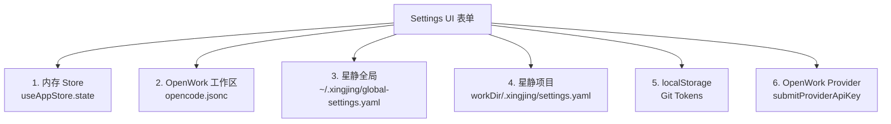
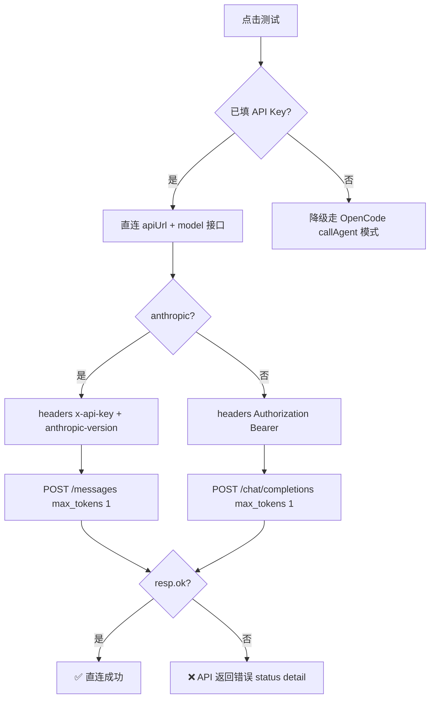
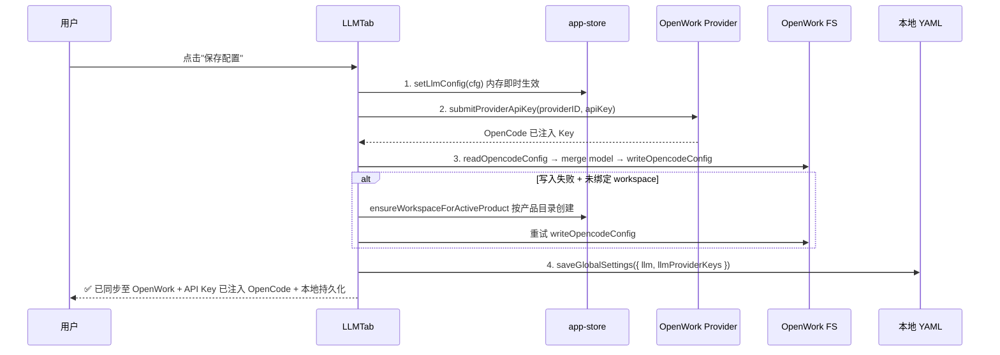
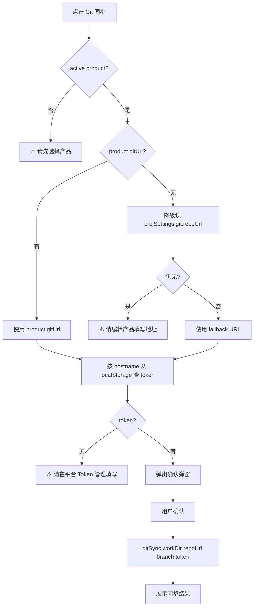

# 80 · 设置（Settings）

> 模块入口：[`pages/settings/index.tsx`](file:///Users/umasuo_m3pro/Desktop/startup/xingjing/harnesswork/apps/app/src/app/xingjing/pages/settings/index.tsx) · 路由 `/settings`（独立版 + 团队版共用）
>
> 上游：[`10-product-shell.md`](./10-product-shell.md)（productStore / openworkCtx / themeMode）
> 下游：[`05b-openwork-skill-agent-mcp.md`](./05b-openwork-skill-agent-mcp.md)（MCP/Skill 注册）、[`05d-openwork-model-provider.md`](./05d-openwork-model-provider.md)（Provider API Key）、[`05f-openwork-settings-persistence.md`](./05f-openwork-settings-persistence.md)（持久化策略）、[`30-autopilot.md`](./30-autopilot.md)（allowedTools 授权）

> **⚠️ v0.12.0 重要变更 — 旧实现已完全移除**：
> 
> 本文档描述的 `SettingsPage`（`/settings`）、`file-store.ts`、`types/settings.ts`、`utils/defaults.ts` 等 `apps/app/src/app/xingjing/` 下所有源文件**已完全删除**。
> 
> **新集成方案（React 19）**：
> - 星静设置集成进 OpenWork 原生 `/settings/*` 路由（[`shell/settings-route.tsx`](file:///Users/umasuo_m3pro/Desktop/startup/xingjing/harnesswork/apps/app/src/react-app/shell/settings-route.tsx)）
> - 新增 `XingjingSettingsPanel` 作为 `/settings/xingjing` tab（扩展 `domains/settings/`）
> - 全局设置写入 workspace 的 `opencode.jsonc` 以及 OpenWork 中的 LocalProvider
> - 不再有 `~/.xingjing/global-settings.yaml`；统一使用 OpenWork 设置持久化机制
> 
> **以下内容为 SolidJS v0.11.x 时代设置模块历史设计档案**，可作产品功能设计参考。

---

## §1 模块定位与用户价值

Settings 是星静的**统一配置中枢**，承担三类配置的持久化管理：

1. **全局偏好**（跨产品）：主题 / 大模型配置 / API Keys / 工具授权清单
2. **产品级配置**（绑定 workDir）：Git 仓库 / 定时任务 / 流程编排 / 产品元信息
3. **OpenWork 原生能力代理**：Plugins / Automations / Identities 三 Tab 直接内嵌 OpenWork 视图

### 1.1 核心定位

> **所有能让 AI / OpenWork / 第三方集成生效的配置，都必须经过 Settings 落盘。**

- LLM 配置：星静 UI 填表 → 三路同步（内存 store / OpenWork 工作区 `opencode.jsonc` / 本地 `~/.xingjing/global-settings.yaml`）
- 工具授权：allowedTools 控制 Autopilot 是否自动放行工具调用（否则每次弹权限询问）
- Skill 安装：Hub → Workspace 一键安装，影响 Agent 可用能力
- 产品管理：创建、编辑、删除星静产品（workDir + OpenWork workspace 联动）

### 1.2 模块职责

1. 13 个 Tab 的统一导航与内容分发（顶部 Tab 栏 + 路由 `?tab=xxx`）
2. 配置表单的**输入校验、测试、保存、降级**四阶流水线
3. 对 OpenWork 能力的代理封装（internal view + OpenWork context 注入）
4. 全局/项目设置文件的读写 + 版本兼容

### 1.3 不做的事

- **不承担** Agent/Skill 的"编辑"（在 [`40-agent-workshop.md`](./40-agent-workshop.md)，Settings 仅做安装/启停）
- **不绑定**团队版专属 Tab（Workflow/流程编排当前为 solo + team 共用）
- **不实现**权限模型（独立版无权限隔离，任何登录用户可改任意配置）
- **不做**配置版本迁移（当前无 `version` 字段，后续演进再加）

---

## §2 页面布局

### 2.1 顶部 Tab + 右侧内容区

```
┌──────────────────────────────────────────────────────────────────────┐
│ 系统设置                                                               │
│ 管理平台主题、大模型接入、代码仓库、定时任务与流程编排配置              │
├──────────────────────────────────────────────────────────────────────┤
│ 🎨主题 🤖LLM 🔧MCP ⚡Skill 🧩插件 ⏰自动化 📡通道 📁文件 🔗Git      │
│ ⏱Cron 🛡流程 📦产品 👤个人                                           │
│ ──────────────────────── ↑ 选中 tab 蓝色下划线 + 主色字               │
├──────────────────────────────────────────────────────────────────────┤
│                                                                      │
│                      当前 Tab 内容区                                   │
│                  （各 Tab 内部自行布局，通常 max-width: 640px）        │
│                                                                      │
└──────────────────────────────────────────────────────────────────────┘
```

> **规划偏差说明**：规划 L219-L223 描述为「左侧分组导航 + 右侧表单」，实际代码实现为**顶部横向 Tab 栏**（index.tsx L3202-L3220）。本文档以代码真实布局为准。

### 2.2 13 个 Tab 总览（[TABS 常量 L3175-L3189](file:///Users/umasuo_m3pro/Desktop/startup/xingjing/harnesswork/apps/app/src/app/xingjing/pages/settings/index.tsx#L3175-L3189)）

| key | 显示名 | 图标 | 组件 | 职责 |
|-----|-------|------|------|------|
| `theme` | 主题外观 | Palette | ThemeTab | 明/暗主题切换 + 色板预览 |
| `llm` | 大模型配置 | Bot | LLMTab | 模型选择 / API Key / 测试连接 / 三路保存 |
| `tools` | MCP 工具 | Wrench | McpToolsTab | 内置工具开关 + MCP 服务器 CRUD |
| `skills` | Skills | Zap | SkillsTab | Workspace / Hub 双分区 + 一键安装 |
| `plugins` | 插件 | Puzzle | PluginsTab | 内嵌 OpenWork PluginsView |
| `automations` | 自动化 | Clock | AutomationsTab | 内嵌 OpenWork AutomationsView |
| `identities` | 消息通道 | Radio | IdentitiesTab | 内嵌 OpenWork IdentitiesView |
| `files` | 文件浏览 | FolderSearch | FileBrowserTab | workDir 文件树浏览器 |
| `git` | Git 仓库 | Github | GitTab | Git 同步 + Token 管理 |
| `cron` | 定时任务 | Clock | CronTab | 6 预设 + 自定义 Cron + Agent 绑定 |
| `workflow` | 流程编排 | ShieldCheck | WorkflowTab | WorkflowEditor 组件 |
| `products` | 产品清单 | Package | ProductListTab | 产品 CRUD + 详情展开 |
| `profile` | 个人信息 | User | ProfileTab | 头像 / 个人信息 / 改密 / 注销 |

### 2.3 路由同步

```tsx
const [params] = useSearchParams();
const [activeTab, setActiveTab] = createSignal(params.tab ?? 'theme');
```

URL `?tab=llm` 可直接打开 LLM 配置 Tab，支持深链接从其他页面跳入（如 Autopilot 的「去配置」按钮）。

### 2.4 Tab 内容区渲染

使用 SolidJS `<Show>` 按需渲染，**非 Tabs/TabPanel 组件**（避免整块懒加载切换卡顿）：

```tsx
<Show when={activeTab() === 'llm'}><LLMTab /></Show>
<Show when={activeTab() === 'tools'}><McpToolsTab /></Show>
// ... 13 个 Show
```

优点：
- Tab 切换销毁旧组件，避免 WorkflowEditor / IdentitiesView 等重组件常驻
- 组件内部 `onMount` 每次切入重新执行（用于刷新 MCP/Skills 列表）

---

## §3 数据模型

### 3.1 全局设置 `GlobalSettings`（[`file-store.ts#L473-L484`](file:///Users/umasuo_m3pro/Desktop/startup/xingjing/harnesswork/apps/app/src/app/xingjing/services/file-store.ts#L473-L484)）

```ts
interface GlobalSettings {
  llm?: {
    modelName: string;
    modelID?: string;       // OpenCode model ID (e.g. 'deepseek-chat')
    providerID?: string;    // OpenCode provider ID (e.g. 'deepseek')
    apiUrl: string;
    apiKey: string;
  };
  llmProviderKeys?: Record<string, string>;  // per-provider API Keys
  allowedTools?: string[];                    // 自动授权工具清单
}
```

**存储路径**：`~/.xingjing/global-settings.yaml`（常量 [`GLOBAL_SETTINGS_FILE`](file:///Users/umasuo_m3pro/Desktop/startup/xingjing/harnesswork/apps/app/src/app/xingjing/services/file-store.ts#L467)）

### 3.2 项目设置 `ProjectSettings`（[`file-store.ts#L505-L536`](file:///Users/umasuo_m3pro/Desktop/startup/xingjing/harnesswork/apps/app/src/app/xingjing/services/file-store.ts#L505-L536)）

```ts
interface ProjectSettings {
  llm?: { ... };              // 项目级 LLM 覆盖（可选）
  llmProviderKeys?: Record<string, string>;
  git?: {
    repoUrl: string;
    defaultBranch: string;
    accessToken?: string;
  };
  gates?: Array<{ id; name; requireHuman; description? }>;
  gitRepos?: Array<{ id; productName; repoUrl; defaultBranch; tokenConfigured }>;
  scheduledTasks?: Array<{ id; name; cron; agentName; description; enabled; lastRun }>;
}
```

**存储路径**：`{workDir}/.xingjing/settings.yaml`

### 3.3 类型定义 `types/settings.ts`（79 行）

| 类型 | 用途 |
|------|------|
| `LLMConfig` | 大模型运行时配置 |
| `ModelOption` | 模型下拉选项（含 apiUrlEditable 开关） |
| `GateNode` | 流程节点门控（8 个默认节点） |
| `WorkflowStage` | 流程阶段（id/agent/skills/gate/dependsOn） |
| `WorkflowConfig` | 完整流程编排（mode/maxRetries/stages） |
| `BuiltinToolDef` | 内置工具元数据（固定 category='builtin'） |

### 3.4 默认值 `utils/defaults.ts`（158 行）

| 常量 | 内容 |
|------|------|
| `defaultLLMConfig` | DeepSeek-V3，内置一个 DEMO API Key |
| `modelOptions` | **8 个模型**：GPT-4o / GPT-4o mini / Claude Sonnet 4.5 / Claude Haiku 3.5 / DeepSeek-V3 / Qwen-Max / OpenRouter / 自定义 |
| `builtinTools` | **4 个内置工具**：bash / read / write / edit |
| `DEFAULT_ALLOWED_TOOLS` | `['bash','read','write','edit','webfetch','control-chrome','github','gitlab']` 含三个预配置 MCP |
| `defaultGateNodes` | **8 个门控节点**：需求评审 / 架构设计 / 代码生成 / Code Review / 测试执行 / 部署审批 / 发布上线 / 效能报告 |

---

## §4 持久化矩阵

### 4.1 三路持久化全景



### 4.2 配置路径明细

| 配置项 | 存储位置 | 读取方 | 写入方 | 范围 |
|--------|---------|-------|-------|------|
| 主题 `themeMode` | localStorage | 全局 | ThemeTab | 全局 |
| LLM config | `~/.xingjing/global-settings.yaml` | 启动加载 | LLMTab | 全局（跨产品） |
| providerKeys | `~/.xingjing/global-settings.yaml` | LLMTab | LLMTab | 全局（按 providerID 索引） |
| allowedTools | `~/.xingjing/global-settings.yaml` + 内存 store | Autopilot | McpToolsTab | 全局 |
| OpenCode model | `workspace/opencode.jsonc` `{ model: "provider/modelID" }` | OpenWork | LLMTab | 工作区 |
| Provider API Key | OpenWork Provider Store（`submitProviderApiKey`） | OpenWork 推理链 | LLMTab | OpenWork 运行时 |
| MCP servers | OpenWork Skill/MCP 注册表 | OpenWork | McpToolsTab（`listMcp/addMcp/removeMcp`） | 工作区 |
| Skills | `.opencode/skills/*/SKILL.md` | OpenWork | SkillsTab（`installHubSkill`） | 工作区 |
| Git tokens | localStorage（按 host 索引） | GitTab | GitTab（`setGitToken`） | 本机 |
| Scheduled tasks | scheduler 服务 | CronTab | CronTab（`createScheduledTask`） | 产品级 |
| Workflow | `workDir/.xingjing/workflow.yaml`（由 WorkflowEditor 管理） | WorkflowEditor | WorkflowEditor | 产品级 |
| Products | product-store（独立） | ProductListTab | ProductListTab | 本机 |
| User profile | auth-service API | ProfileTab | ProfileTab | 账户 |

### 4.3 启动时加载序列

1. App 启动 → `app-store` 初始化 → 读 `localStorage.themeMode` 与 `~/.xingjing/global-settings.yaml`
2. `state.llmConfig` 回填 → 若存在 `providerKeys[currentProviderID]` 则覆盖 `apiKey`
3. `state.allowedTools` 回填 → 空则用 `DEFAULT_ALLOWED_TOOLS`
4. Settings 任一 Tab 挂载 → 再次拉取对应运行时数据（OpenWork Skills/MCP/Config）

---

## §5 ThemeTab（主题外观）

### 5.1 交互

```mermaid
graph LR
  U[用户] --> Btn[点击"明亮/暗黑"按钮]
  Btn --> Action[actions.setThemeMode mode]
  Action --> Persist[写 localStorage]
  Action --> Broadcast[触发 themeColors 响应式重算]
  Broadcast --> All[所有页面主题色变化]
```

### 5.2 色板预览

根据 `themeMode` 展示 5 色卡：主色（固定 `#1264e5`）+ 背景 / 卡片 / 文字 / 边框（跟随主题）。

### 5.3 特点

- 无保存按钮（切换即生效）
- 无重置按钮（来回切换即可）
- 主题色值由 [`utils/colors.ts`](file:///Users/umasuo_m3pro/Desktop/startup/xingjing/harnesswork/apps/app/src/app/xingjing/utils/colors.ts) 提供 `themeColors` / `chartColors` 响应式对象

---

## §6 LLMTab（大模型配置）

### 6.1 表单字段

| 字段 | 类型 | 来源 |
|------|------|------|
| 模型选择 | `<select>` | `modelOptions` 8 项 |
| API 地址 | `<input>` | 按 `modelOpt.apiUrlEditable` 控制是否只读 |
| API Key | `<input type=password>` | per-provider 缓存 `providerKeys[providerID]` |

### 6.2 模型切换 `handleModelChange` 逻辑

```ts
// 保存当前 provider 的 key 到缓存
if (cur.providerID && cur.apiKey) {
  providerKeys[cur.providerID] = cur.apiKey;
}
// 恢复目标 provider 已保存的 key
const restoredKey = providerKeys()[opt.providerID] ?? '';
setConfig({ modelName, modelID, providerID, apiUrl, apiKey: restoredKey });
```

**避免切换模型时 Key 串号**，每个 provider 独立缓存。

### 6.3 测试连接（index.tsx L380-L450）



**超时 15s**（AbortController），区分 timeout / 网络错误 / API 返回错误三类反馈。

### 6.4 保存连接 `handleSave`（index.tsx L480-L557）

**四阶保存流水线**：



### 6.5 `opencode.jsonc` 写入策略

1. 读现有配置保留 `$schema / default_agent / mcp / plugin` 合法字段
2. 只更新 `model` 字段为 `"providerID/modelID"` 字符串（OpenCode schema 要求）
3. 删除非法字段 `providers`（旧代码残留）
4. 保留 2 空格缩进（`JSON.stringify(config, null, 2)`）

### 6.6 `owSyncStatus` 四态

| 状态 | 含义 | UI 提示 |
|------|------|--------|
| `null` | 未检查 | 无提示 |
| `synced` | 已同步到 OpenWork | ✅ 绿色 |
| `disconnected` | OpenWork 未连接 | ⚠️ 橙色 |
| `no-workspace` | 无匹配工作区 | ⚠️ 橙色 + 自动创建重试 |
| `error` | 写入失败 | ❌ 红色 |

---

## §7 McpToolsTab（MCP 工具）

### 7.1 三分区布局

```
┌─ 内置工具 ─────────────────────────────────────┐
│ bash   [bash]   执行终端命令               [●━] │ ← ToggleSwitch
│ read   [read]   读取项目文件               [●━] │
│ write  [write]  创建或覆盖文件             [●━] │
│ edit   [edit]   对已有文件局部修改         [●━] │
└────────────────────────────────────────────────┘
┌─ MCP 服务器 ──────────────────────[+ 添加 MCP]─┐
│ control-chrome [chrome] Chrome 控制         [●━] │
│ github         [remote] GitHub MCP          [●━] │
│ gitlab         [remote] GitLab MCP          [●━] │
│ ...                                   [🗑]      │
└────────────────────────────────────────────────┘
[保存工具配置]  ✅ 已保存 N 个工具授权
```

### 7.2 数据源融合

- **内置工具**：来自 `builtinTools` 常量（defaults.ts）+ `webfetch`（DEFAULT_ALLOWED_TOOLS 中硬编码）
- **MCP 服务器**：通过 `actions.listMcp()` 从 OpenWork 注册表实时拉取

### 7.3 添加 MCP 服务器 `handleAddMcp`

```ts
const config = { type: newMcpType(), enabled: true };  // 'remote' | 'local'
if (type === 'remote' && url) config.url = url;
await actions.addMcp({ name, config });
```

添加后立即 `loadMcpServers()` 刷新列表。

### 7.4 保存授权 `handleSave`

**仅更新内存 store**：`actions.setAllowedTools(enabledTools())`。真正持久化由 app-store 在 store 变化时自动写入 `global-settings.yaml`（通过 `store → file-store` 同步链路）。

### 7.5 与 Autopilot 的联动

`allowedTools` 被 [`30-autopilot.md`](./30-autopilot.md) 的权限弹窗拦截读取：
- 命中清单 → 自动授权通过，无提示
- 未命中 → 弹出权限询问对话框，要求用户确认

---

## §8 SkillsTab（Skills）

### 8.1 双分区：Workspace + Hub

```
┌─ Workspace Skills ──────────[🔄 刷新]────────┐
│ brainstorming     [Workspace]  ✅ 已安装     │
│ writing-plans     [Workspace]  ✅ 已安装     │
│ ...                                          │
└────────────────────────────────────────────────┘
┌─ Hub Skills（社区）────────────────────────────┐
│ git-worktrees        [Hub]  [📥 安装]         │
│ systematic-debugging [Hub]  [📥 安装]         │
│ ...                                          │
└────────────────────────────────────────────────┘
```

### 8.2 加载 `loadSkills`

```ts
const [ws, hub] = await Promise.all([
  actions.listOpenworkSkills().catch(() => []),   // 当前工作区已安装
  actions.listHubSkills().catch(() => []),         // Hub 远端可用
]);
setInstalledSet(new Set(ws.map(s => s.name)));     // 建立 O(1) 查询集
```

Hub 条目通过 `installedSet.has(name)` 判断是否隐藏"安装"按钮。

### 8.3 一键安装 `handleInstall`

```ts
const ok = await actions.installHubSkill(name);
if (ok) {
  setStatusMsg(`✅ 已安装 Skill: ${name}`);
  await loadSkills();  // 刷新列表，Hub 侧该条目变为"已安装"
}
```

**OpenWork 未连接**时整个 Tab 提示「OpenWork 未连接，无法加载 Skills」且按钮禁用。

---

## §9 三大 OpenWork 内嵌 Tab

### 9.1 PluginsTab（插件）

直接包装 [`app/pages/plugins.tsx`](file:///Users/umasuo_m3pro/Desktop/startup/xingjing/harnesswork/apps/app/src/app/pages/plugins.tsx) 的 `PluginsView`：

```tsx
<PluginsView
  busy={false}
  selectedWorkspaceRoot={productStore.activeProduct()?.workDir ?? ''}
  canEditPlugins={true}
  canUseGlobalScope={true}
  suggestedPlugins={SUGGESTED_PLUGINS}  // 来自 constants.json
/>
```

### 9.2 AutomationsTab（自动化）

包装 `AutomationsView`，注入 `createSessionAndOpen` 回调以调用 `actions.callAgent` 创建 Autopilot 会话：

```tsx
<AutomationsView
  selectedWorkspaceRoot={workDir}
  createSessionAndOpen={async (prompt) => {
    await actions.callAgent({ userPrompt: prompt ?? '' });
    return undefined;
  }}
  reloadWorkspaceEngine={openworkCtx?.reloadWorkspaceEngine}
  canReloadWorkspace={openworkCtx?.canReloadWorkspace}
  showHeader={false}
/>
```

### 9.3 IdentitiesTab（消息通道）

包装 `IdentitiesView`，透传 OpenWork 上下文：

```tsx
<IdentitiesView
  openworkServerStatus={openworkCtx?.serverStatus?.() === 'connected' ? 'connected' : 'disconnected'}
  openworkServerUrl={openworkCtx?.openworkServerUrl ?? ''}
  openworkServerClient={null}  // 降级：IdentitiesView 会显示"未连接"
  runtimeWorkspaceId={openworkCtx?.openworkRuntimeWorkspaceId ?? resolvedWorkspaceId()}
  developerMode={openworkCtx?.developerMode ?? false}
  showHeader={false}
/>
```

> **三个 Tab 共同特征**：设 `showHeader={false}` 去除 OpenWork 自带标题条，融入 Settings 页面风格。配置持久化逻辑**完全由 OpenWork 原生视图接管**，星静不二次包装。

---

## §10 FileBrowserTab（文件浏览）

### 10.1 交互

- 展示当前产品 `workDir` 根目录的文件树
- 点击目录进入子目录，点击文件显示只读预览（由 [`browseDir`](file:///Users/umasuo_m3pro/Desktop/startup/xingjing/harnesswork/apps/app/src/app/xingjing/services/xingjing-bridge.ts) 提供）
- 返回上级用 `ArrowLeft` 图标按钮
- 空目录提示「空目录」

### 10.2 职责边界

**只读浏览**，不支持创建/编辑/删除。编辑能力在各业务模块（50 产品模式 / 60 知识库）内完成。

---

## §11 GitTab（Git 仓库）

### 11.1 核心流程



### 11.2 Token 管理

Git Token 存 **localStorage**，按 hostname 索引：

```ts
getAllGitTokens() → Record<string, string>
setGitToken(host, token)
clearGitToken(host)
syncGitTokensToMcpConfig()  // 同步到 MCP 配置（供 github/gitlab MCP 使用）
```

这就是为什么 DEFAULT_ALLOWED_TOOLS 里带 `github` / `gitlab` —— 预配置 MCP 自动读 localStorage token。

### 11.3 分支策略

- 产品对象上的 `gitUrl` 是主要源
- 项目设置 `git.repoUrl` + `git.defaultBranch` 是降级源
- branch 默认 `main`，可在项目设置中覆盖

---

## §12 CronTab（定时任务）

### 12.1 6 个预设 Cron（`CRON_PRESETS` L1206-L1213）

```ts
[
  { label: '每天 2:00',   value: '0 2 * * *' },
  { label: '每天 9:00',   value: '0 9 * * *' },
  { label: '每天 18:00',  value: '0 18 * * *' },
  { label: '工作日 9:00', value: '0 9 * * 1-5' },
  { label: '每周一 9:00', value: '0 9 * * 1' },
  { label: '每 6 小时',   value: '0 */6 * * *' },
]
```

### 12.2 新建任务表单

| 字段 | 说明 |
|------|------|
| name | 任务显示名 |
| cron | 6 预设下拉 + 自定义 cron 表达式 |
| agentId / agentName | 从 `getAvailableAgentsForScheduler()` 拉取星静 Agent 列表 |
| prompt | 任务触发时发送给 Agent 的 prompt |
| description | 人类可读描述 |

### 12.3 持久化

通过 [`scheduler-client.ts`](file:///Users/umasuo_m3pro/Desktop/startup/xingjing/harnesswork/apps/app/src/app/xingjing/services/scheduler-client.ts) 提供的 CRUD：
- `listScheduledTasks(workDir)`
- `createScheduledTask(workDir, task)`
- `deleteScheduledTask(workDir, id)`
- `updateScheduledTask(workDir, task)`（开关启停）

任务文件最终落地在 `.xingjing/scheduled-tasks.json`，由 sidecar 调度进程定期轮询加载。

### 12.4 状态列

| 字段 | 含义 |
|------|------|
| `enabled` | 布尔开关，关闭后调度器跳过但保留记录 |
| `lastRunAt` | 上次执行时间戳（由调度器回写） |
| `nextRunAt` | 由 cron 表达式推算，仅用于前端展示 |
| `runCount` | 累计执行次数 |

---

## §13 WorkflowTab（流程编排）

### 13.1 定位

内嵌 [`components/workflow-editor.tsx`](file:///Users/umasuo_m3pro/Desktop/startup/xingjing/harnesswork/apps/app/src/app/xingjing/components/workflow-editor.tsx)，提供可视化编辑 **Agent 编排流程**：把多个 Agent 按节点+连线方式串成一条自动化链路。

### 13.2 数据模型

Workflow 定义落地在 `.xingjing/workflows/{id}.yaml`：

```yaml
id: workflow-001
name: 需求→PRD→SDD 自动流
nodes:
  - { id: n1, agent: pm-agent, prompt: '产出 PRD' }
  - { id: n2, agent: arch-agent, prompt: '基于 PRD 产出 SDD', input: n1.output }
edges:
  - { from: n1, to: n2 }
```

### 13.3 与 Autopilot 的关系

- WorkflowTab 只负责**定义**编排
- 真正的**执行**由 Autopilot Orchestrator（见 [`30-autopilot.md`](./30-autopilot.md) §5）消费此 YAML，按 DAG 顺序调度 Agent

---

## §14 ProductListTab（产品清单）

### 14.1 产品 CRUD

- **列表**：调 [`productStore.products()`](file:///Users/umasuo_m3pro/Desktop/startup/xingjing/harnesswork/apps/app/src/app/xingjing/services/product-store.ts) 渲染全量产品
- **新建**：`createProduct({ name, workDir, description })`，要求 workDir 路径存在且尚未被其他产品占用
- **编辑**：详情展开面板可改 name / description / workDir
- **删除**：二次确认 `confirm()`，仅移除元数据，不删除 workDir 下文件

### 14.2 持久化

落地文件：`~/.xingjing-global/products.json`（跨产品全局存储，见 [`10-product-shell.md`](./10-product-shell.md) §7）。

### 14.3 详情展开面板字段

| 字段 | 说明 |
|------|------|
| id | 产品唯一 ID |
| name | 显示名 |
| workDir | 绝对路径（产品工作目录） |
| description | 产品简介 |
| createdAt | 创建时间 |
| lastAccessAt | 最后访问时间（由 activeProduct 切换写入） |

### 14.4 与 Shell 的联动

- 新建产品后自动调 `productStore.setActiveProduct(id)`，触发全局 workDir 切换
- 删除当前 activeProduct 时，自动切到产品列表第一个（若有）

---

## §15 ProfileTab（个人信息）

### 15.1 独立版 vs 团队版差异

| 字段 | 独立版 | 团队版 |
|------|-------|-------|
| 头像 | ✅ 本地上传 | ✅ 同步到 xingjing-server |
| 昵称 | ✅ 本地存储 | ✅ SaaS 账号 |
| 邮箱 | ⚠️ 可选 | ✅ 账号唯一标识 |
| 改密 | ❌ 无 | ✅ POST /auth/change-password |
| 注销 | ❌ 无 | ✅ 清理本地 token |

### 15.2 独立版持久化

头像与昵称存 `~/.xingjing-global/profile.json`，与 `products.json` 同目录。

---

## §16 交互流程

### 16.1 从 Autopilot 跳「去配置 LLM」

```
Autopilot 检测到无可用模型
  ↓
按钮 onClick: navigate('/settings?tab=llm')
  ↓
SettingsPage mount
  activeTab = params.tab = 'llm'
  ↓
<Show when={activeTab === 'llm'}> → LLMTab 渲染
  ↓
用户配置并保存
  ↓
三路保存完成 → setSettings 本地 + upsertProvider OpenWork + OpenCode env
  ↓
返回 Autopilot → 重新检测模型可用 → 继续任务
```

### 16.2 McpToolsTab 启停内置工具

```
用户点击 bash 开关
  ↓
updateMcpServer({ id: 'bash', enabled: false })
  ↓
写 mcp-servers.json
  ↓
通知 OpenWork ToolsProvider 重新加载
  ↓
下次 Agent 调用 bash 时被拦截
```

### 16.3 SkillsTab 一键安装 Hub Skill

```
用户点击「安装」
  ↓
installSkillFromHub(skillId)
  ↓
下载到 .opencode/skills/{id}/SKILL.md
  ↓
skillStore.refresh() → Workspace 列表新增条目
  ↓
Agent 可立即调用该 Skill
```

---

## §17 OpenWork 集成清单

| Tab | OpenWork 能力依赖 |
|-----|------------------|
| ThemeTab | ❌ 纯本地 Tailwind 主题切换 |
| LLMTab | ✅ Provider API（见 [`05d-openwork-model-provider.md`](./05d-openwork-model-provider.md)）+ OpenCode env 写入 |
| McpToolsTab | ✅ MCP Registry + Tools Provider |
| SkillsTab | ✅ Skill API（`knowledge-*` 前缀之外的通用 Skill，见 [`05b-openwork-skill-agent-mcp.md`](./05b-openwork-skill-agent-mcp.md)） |
| PluginsTab | ✅ 内嵌 OpenWork PluginsView（整页复用） |
| AutomationsTab | ✅ 内嵌 OpenWork AutomationsView |
| IdentitiesTab | ✅ 内嵌 OpenWork IdentitiesView |
| FileBrowserTab | ✅ WorkspaceFileOps（见 [`05c-openwork-workspace-fileops.md`](./05c-openwork-workspace-fileops.md)） |
| GitTab | ✅ Git Provider + token 存储 |
| CronTab | ✅ sidecar 调度器（见 [`05g-openwork-process-runtime.md`](./05g-openwork-process-runtime.md)） |
| WorkflowTab | ❌ 纯前端可视化，执行由 Autopilot 消费 |
| ProductListTab | ❌ 纯本地 products.json |
| ProfileTab | ⚠️ 团队版依赖 xingjing-server，独立版纯本地 |

---

## §18 降级矩阵

| 故障 | 影响 Tab | 降级策略 |
|------|---------|---------|
| OpenWork ProviderAPI 不可用 | LLMTab | 保留本地 settings.json 写入，标注「同步失败」 |
| MCP Registry 加载失败 | McpToolsTab | 使用默认内置工具列表（bash/read/write/edit） |
| Skill Hub 网络异常 | SkillsTab | 仅展示 Workspace 已安装，隐藏 Hub 列表 |
| Git Token 验证失败 | GitTab | 锁定同步按钮，允许继续配置但不执行 pull/push |
| sidecar 调度器崩溃 | CronTab | 任务不会触发但 UI 正常展示，顶部提示「调度器未运行」 |
| products.json 损坏 | ProductListTab | fallback 到空数组，触发「引导新建产品」引导页 |

---

## §19 不变式

- ✅ Tab 切换不丢失未保存表单（各 Tab 内部 createSignal 持有草稿）
- ✅ URL `?tab=xxx` 深链接始终有效
- ✅ 任一 Tab 故障不影响其他 Tab（`<Show>` 互相隔离）
- ✅ LLMTab 三路保存任一失败，其余两路照常执行（容错见 §6）
- ✅ 设置修改均为幂等写入，不会产生重复条目
- ✅ 敏感字段（API Key / Git Token）不记入日志

---

## §20 代码资产清单

### 页面入口
- [`pages/settings/index.tsx`](file:///Users/umasuo_m3pro/Desktop/startup/xingjing/harnesswork/apps/app/src/app/xingjing/pages/settings/index.tsx) · 3200+ 行主入口，含全部 Tab 组件

### 支撑服务
- [`services/file-store.ts`](file:///Users/umasuo_m3pro/Desktop/startup/xingjing/harnesswork/apps/app/src/app/xingjing/services/file-store.ts) · GlobalSettings/McpServer/Skill 存取
- [`services/product-store.ts`](file:///Users/umasuo_m3pro/Desktop/startup/xingjing/harnesswork/apps/app/src/app/xingjing/services/product-store.ts) · 产品 CRUD + activeProduct
- [`services/scheduler-client.ts`](file:///Users/umasuo_m3pro/Desktop/startup/xingjing/harnesswork/apps/app/src/app/xingjing/services/scheduler-client.ts) · Cron 任务 CRUD
- [`services/git-sync.ts`](file:///Users/umasuo_m3pro/Desktop/startup/xingjing/harnesswork/apps/app/src/app/xingjing/services/git-sync.ts) · Git 操作封装

### 共享组件
- [`components/workflow-editor.tsx`](file:///Users/umasuo_m3pro/Desktop/startup/xingjing/harnesswork/apps/app/src/app/xingjing/components/workflow-editor.tsx) · Workflow 可视化编辑器

### 配置文件
- `~/.xingjing-global/products.json` · 跨产品配置
- `~/.xingjing-global/profile.json` · 个人信息（独立版）
- `{workDir}/.xingjing/scheduled-tasks.json` · 产品级定时任务
- `{workDir}/.xingjing/workflows/{id}.yaml` · 产品级 Workflow 定义
- OpenWork 统一存储：MCP 配置、Skill、Provider、Git Token（见 [`05f-openwork-settings-persistence.md`](./05f-openwork-settings-persistence.md)）

scheduler sidecar 进程订阅 cron 表达式，到时触发 `callAgent` 创建 Autopilot 会话。详见 [`05g-openwork-process-runtime.md`](./05g-openwork-process-runtime.md)。
