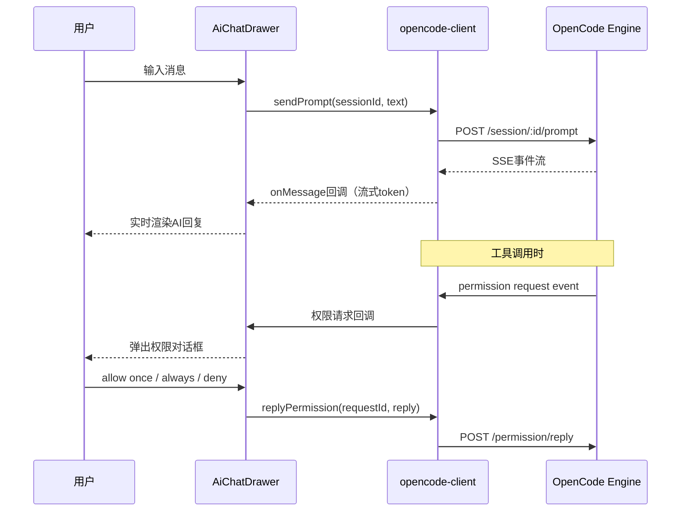

# AI 对话系统

## 特性概述

| 属性 | 值 |
|------|-----|
| 特性编号 | F008 |
| 状态 | implemented |
| 关联 PRD | [PRD-003 FR-03](../../product/prd/PRD-003-xingjing-solo.md) |
| 关联 SDD | [SDD-002](../../product/architecture/SDD-002-xingjing-extension.md) |
| 创建日期 | 2026-04-15 |

## 特性描述

星静独立版的核心 AI 交互能力。通过侧边抽屉式对话界面，用户可以与 OpenCode 引擎进行实时对话，获得流式 AI 回复、查看工具调用过程，并对敏感操作进行权限审批。整个对话系统基于 OpenCode SDK 构建，通过 SSE 事件流实现实时更新。

## 核心组件

| 组件 | 路径 | 职责 | 大小 |
|------|------|------|------|
| AiChatDrawer | `components/ai/ai-chat-drawer.tsx` | 侧边抽屉式对话 UI，消息渲染，输入处理 | 1204 行 |
| opencode-client | `services/opencode-client.ts` | OpenCode SDK 封装，Session/Event/Permission 管理 | ~1050 行 |
| chat-session-store | `services/chat-session-store.ts` | 聊天会话本地持久化（localStorage + Tauri 备份） | ~140 行 |

## 关键设计决策

| 编号 | 决策 | 结论 | 理由 |
|------|------|------|------|
| D1 | 对话 UI 形态 | 侧边抽屉（默认 400px，可拖拽调宽） | 不遮挡主工作区，支持并行查看代码和对话 |
| D2 | 消息流方式 | SSE 事件订阅（`client.event.subscribe()`） | 实时流式输出，延迟 < 200ms |
| D3 | 会话存储 | localStorage 主存储 + Tauri 备份 | 浏览器兼容，桌面端增强持久性 |
| D4 | Session 管理 | 通过 OpenCode SDK 创建/切换 | 复用 PRD-001 的 Session 基础设施 |

## 架构流程



## opencode-client 接口概述

| 接口分类 | 方法 | 说明 |
|---------|------|------|
| 初始化 | `initXingjingClient(baseUrl)` | 建立与 OpenCode 的连接 |
| Session | `createSession()` | 创建新对话会话 |
| Session | `listSessions()` | 获取所有会话列表 |
| Session | `getSession(id)` | 获取会话详情 |
| Prompt | `sendPrompt(sessionId, text)` | 发送用户消息 |
| Prompt | `abortSession(sessionId)` | 中止当前执行 |
| Event | `subscribeEvents(callback)` | SSE 事件订阅（消息/工具调用/权限请求） |
| Permission | `replyPermission(requestId, reply)` | 回应权限请求 |
| Workspace | `listWorkspaces()` | 列出可用工作区 |
| Workspace | `readDir(path)` | 读取目录结构 |
| Workspace | `readFile(path)` | 读取文件内容 |
| Config | `getConfig()` | 获取 OpenCode 配置 |
| Config | `getProviders()` | 获取 AI Provider 列表 |

## 聊天会话存储模型

```typescript
interface SessionRecord {
  id: string;
  title: string;             // 首条消息摘要
  messages: ChatMessage[];   // 消息列表
  agentId?: string;          // 关联的 Agent
  createdAt: number;         // 创建时间戳
  updatedAt: number;         // 最后更新时间戳
}

interface ChatMessage {
  role: 'user' | 'assistant' | 'system';
  content: string;
  toolCalls?: ToolCallInfo[];  // 工具调用信息
  timestamp: number;
}
```

存储策略：
- 主存储：`localStorage` key `xingjing-chat-sessions`
- 备份：Tauri `store` 插件（桌面端）
- 自动去重和超限裁剪

## 行为规格

| 编号 | 场景 | 预期 |
|------|------|------|
| BH-01 | 点击 AI 悬浮按钮 | 侧边抽屉滑出，显示对话界面 |
| BH-02 | 输入消息并发送 | 通过 OpenCode SDK 发送，实时流式渲染 AI 回复 |
| BH-03 | AI 执行工具调用 | 展示工具名称、参数和执行结果 |
| BH-04 | AI 请求敏感权限 | 弹出权限对话框（allow once / always / deny） |
| BH-05 | 切换 Session | 加载对应 Session 的消息历史 |
| BH-06 | 新建 Session | 创建空白对话，清空消息区 |
| BH-07 | 拖拽抽屉边缘 | 调整抽屉宽度，位置持久化到 localStorage |
| BH-08 | OpenCode 不可用 | 显示连接状态提示，禁用发送按钮 |

## 验收标准

- [x] AI 对话抽屉可正常打开和关闭
- [x] 消息流式渲染，无明显延迟
- [x] 工具调用过程可视化展示
- [x] 权限审批对话框正常弹出和响应
- [x] Session 创建/切换/历史加载正常
- [x] 抽屉宽度可拖拽调整
- [x] 会话数据持久化到 localStorage
