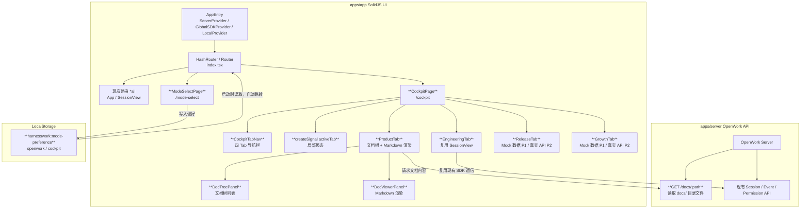
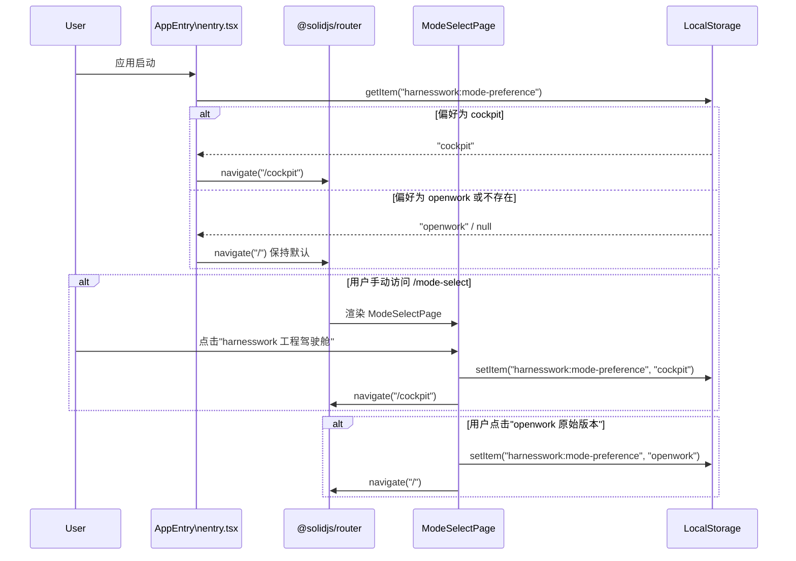
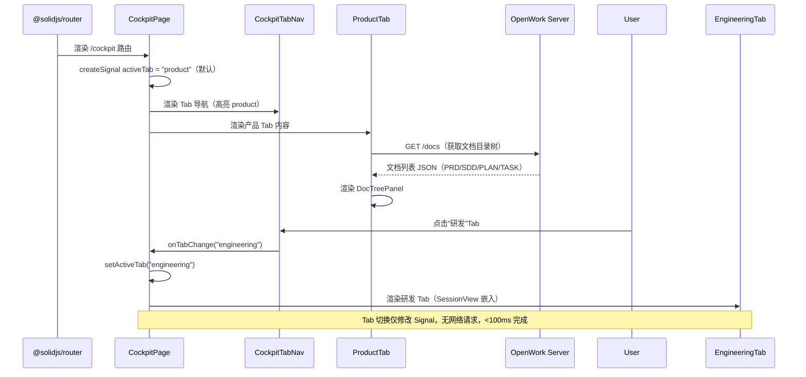
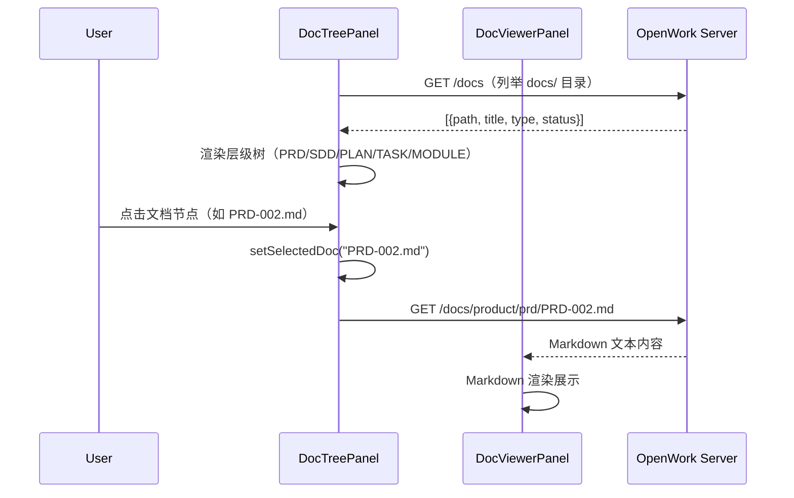

---
meta:
  id: SDD-002
  title: 双模式工作区——入口选择页 & 全链路工程驾驶舱
  status: approved
  author: architect-agent
  reviewers: [tech-lead, architect]
  source_prd: [PRD-002]
  revision: "1.0"
  change_history: []
  created: "2026-04-08"
  updated: "2026-04-08"
sections:
  background: "harnesswork 缺乏模式选择入口，用户无法在 openwork 原始 AI 编码工作流与 harnesswork 全链路工程驾驶舱之间做明确切换"
  goals: "新增 /mode-select 路由页和 /cockpit 工程驾驶舱路由页，提供产品/研发/发布&运维/运营四 Tab 统一视图，复用现有 SolidJS + opencode SDK 体系"
  architecture: "新增两个页面组件（ModeSelectPage、CockpitPage），通过 createSignal 管理 Tab 局部状态，在现有 AppEntry 路由树中注册新路由，驾驶舱研发 Tab 复用 SessionView"
  interfaces: "路由：/mode-select、/cockpit；LocalStorage key：harnesswork:mode-preference；OpenWork server 新增 GET /docs/:path 文档读取端点"
  nfr: "模式选择页首屏 <500ms，Tab 切换 <100ms，文档树加载 <1s，驾驶舱内存 <200MB，代码编辑区 60fps 滚动"
  test_strategy: "单元测试 ModeSelectPage / CockpitPage / Tab 状态 >70%；集成测试文档树加载与 Tab 切换链路；契约测试 /docs/:path 端点"
---

# SDD-002 双模式工作区——入口选择页 & 全链路工程驾驶舱

## 元信息

- 编号：SDD-002-dual-mode-workspace
- 状态：draft
- 作者：architect-agent
- 评审人：tech-lead, architect
- 来源 PRD：[PRD-002-dual-mode-workspace]
- 修订版本：1.0
- 变更历史：[]
- 创建日期：2026-04-08
- 更新日期：2026-04-08

---

## 1. 背景与问题域

harnesswork 基于 openwork fork 构建，在继承 openwork 原始 AI 编码体验的同时，正在演进为覆盖完整产品研发生命周期的工程驾驶舱（Engineering Cockpit）。

**当前问题**：

1. **缺失模式选择入口**：应用启动后直接进入 openwork 原始 Session 界面，用户无法感知 harnesswork 扩展能力的存在，也无法在"openwork 原始工作流"与"harnesswork 工程驾驶舱"之间进行有意识的切换。
2. **角色视图割裂**：产品经理（PRD/SDD 管理）、DevOps（发布运维）、运营人员（数据分析）无法在同一工具内完成对应工作，存在多工具跳转成本。
3. **现有路由为空通配**：`index.tsx` 当前仅有 `<Route path="*all">` 通配，路由能力未被结构化利用，扩展新页面缺乏规范落点。

**设计驱动**：在不破坏现有 openwork 体验路径的前提下，通过新增独立路由页面完成能力分层，让不同角色用户在统一入口下各取所需。

---

## 2. 设计目标与约束

### 2.1 目标

1. **（FR-01）** 新增 `/mode-select` 模式选择页，作为 harnesswork 专属入口，呈现"openwork 原始版本"与"harnesswork 工程驾驶舱"两条路径选项。
2. **（FR-02~FR-05）** 新增 `/cockpit` 工程驾驶舱页，内置四 Tab（产品 / 研发 / 发布&运维 / 运营）统一视图，P1 完成产品 Tab 与研发 Tab。
3. **（FR-08）** 用 LocalStorage 记住用户模式偏好，下次启动自动跳转，在驾驶舱顶部提供"返回模式选择"入口。
4. 架构上完全复用现有 SolidJS + @solidjs/router + opencode SDK 体系，不引入新的状态管理库。

### 2.2 约束

| 类型 | 约束内容 |
|------|---------|
| 前端框架 | SolidJS（非 React），使用 `createSignal` / `createMemo` 等原语 |
| 路由库 | `@solidjs/router`：桌面端 `HashRouter`，Web 端 `Router`（已在 `index.tsx` 配置） |
| 样式 | Tailwind CSS（沿用现有体系） |
| 包管理 | pnpm monorepo，新组件置于 `apps/app/src/app/pages/` |
| 状态 | Tab 局部状态用 `createSignal`，模式偏好用 LocalStorage，不新增全局 store |
| 文件读取 | 文档树必须通过 OpenWork server 路由读取（不直接调用 Tauri FS，保持本地/远程行为一致） |
| 桌面壳层 | Tauri（Rust）—— 已有，不新增原生 Command |
| P2 功能 | FR-06（发布&运维）、FR-07（运营）在 P1 阶段展示静态 Mock 数据，不接入真实 API |

### 2.3 不在范围内

- 替代或修改 openwork 原始 Session 体验（`/` 路由保持不变）
- 实现真实的 CI/CD 流水线控制面（FR-06 P2 阶段另立 SDD）
- 实现真实的运营数据采集与分析后端（FR-07 P2 阶段另立 SDD）
- 新增任何 Tauri 原生 Command（沿用 FS 通过 OpenWork server 路由的原则）
- 移动端 / 响应式适配（FR-09，P3 阶段）

---

## 3. 架构设计

### 3.1 架构概览

新增模块（加粗）在现有架构之上叠加，不修改现有核心链路：



### 3.2 核心模块说明

#### 新增页面组件

| 模块 | 文件路径 | 职责 | 依赖 |
|------|---------|------|------|
| ModeSelectPage | `apps/app/src/app/pages/mode-select.tsx` | 模式选择页：展示两个模式选项，写入 LocalStorage 偏好，跳转对应路由 | `@solidjs/router` useNavigate，LocalStorage |
| CockpitPage | `apps/app/src/app/pages/cockpit.tsx` | 驾驶舱容器：上下分栏，管理 Tab 局部状态，按 activeTab 渲染对应内容区 | `createSignal`，四个 Tab 子组件 |
| CockpitTabNav | `apps/app/src/app/components/cockpit/tab-nav.tsx` | Tab 导航栏：渲染四 Tab，高亮当前选中，支持键盘导航，回调通知父组件切换 | SolidJS props |
| ProductTab | `apps/app/src/app/components/cockpit/product-tab.tsx` | 产品 Tab：左侧 DocTreePanel + 右侧 DocViewerPanel，读取 docs/ 目录结构 | OpenWork server `/docs/:path` |
| DocTreePanel | `apps/app/src/app/components/cockpit/doc-tree-panel.tsx` | 文档树列表：层级展示 PRD/SDD/PLAN/TASK/MODULE，状态标签（draft/approved/released） | `createSignal` selectedDoc |
| DocViewerPanel | `apps/app/src/app/components/cockpit/doc-viewer-panel.tsx` | Markdown 渲染区：展示点击文档节点的完整内容 | marked / 现有 Markdown 渲染工具 |
| EngineeringTab | `apps/app/src/app/components/cockpit/engineering-tab.tsx` | 研发 Tab：三栏布局容器（代码树 / 编辑区 / AI 对话），嵌入现有 SessionView | 现有 `pages/session.tsx` SessionView |
| ReleaseTab | `apps/app/src/app/components/cockpit/release-tab.tsx` | 发布&运维 Tab：P1 静态 Mock（流水线/部署历史/环境健康/告警），P2 接入真实 CI/CD API | Mock JSON，P2 另立 SDD |
| GrowthTab | `apps/app/src/app/components/cockpit/growth-tab.tsx` | 运营 Tab：P1 静态 Mock（DAU/留存/反馈），P2 接入真实数据平台 API | Mock JSON，P2 另立 SDD |

#### 路由注册变更

在 `apps/app/src/index.tsx` 中，在现有 `<Route path="*all">` 之前新增两条具名路由：

```tsx
// 变更前（现有）
<RouterComponent root={AppEntry}>
  <Route path="*all" component={() => null} />
</RouterComponent>

// 变更后（新增两条路由）
<RouterComponent root={AppEntry}>
  <Route path="/mode-select" component={ModeSelectPage} />
  <Route path="/cockpit"     component={CockpitPage} />
  <Route path="*all"         component={() => null} />
</RouterComponent>
```

> **注意**：`/` 根路由不变，`*all` 通配继续由现有 `App` 组件（Session 视图）处理，保持原始 openwork 体验不受影响。

#### 模式偏好读取时机

在 `AppEntry`（`apps/app/src/app/entry.tsx`）挂载时，读取 `harnesswork:mode-preference`，若值为 `cockpit` 且当前路由为 `/`，则自动 `navigate('/cockpit')`；若值为 `openwork` 或不存在，则保持默认路由行为。

### 3.3 核心流程

#### 流程一：模式选择与偏好记忆



#### 流程二：工程驾驶舱加载与 Tab 切换



#### 流程三：产品 Tab 文档加载与渲染



### 3.4 关键设计决策

#### 决策 1：`/mode-select` 作为新路由，不覆盖现有 `/` 路由

- **背景**：`/` 根路由当前由 openwork 原始 App（Session 视图）处理，是已有用户的主要工作路径。
- **备选方案**：
  - A：将模式选择作为 `/` 根路由，原始模式重定向到 `/openwork`——会破坏书签、Tauri 启动 URL 等已有入口。
  - B：在原始 App 内部插入模式弹层（Modal）——侵入现有代码，升级 openwork 上游时容易冲突。
  - **C（选定）**：新增 `/mode-select` 独立路由，`AppEntry` 挂载时根据 LocalStorage 决定是否自动跳转。
- **结论**：`/` 路由不变，保持上游 openwork 差异最小化；`/mode-select` 是纯增量路由。
- **影响**：`AppEntry` 需新增一次 LocalStorage 读取逻辑，约 10 行代码。

#### 决策 2：Tab 状态用 SolidJS `createSignal` 管理，不引入全局 store

- **背景**：CockpitPage 的 Tab 切换是纯局部 UI 状态，不跨页面共享，无持久化需求。
- **备选方案**：
  - A：使用 `createStore` 全局状态——引入不必要的全局依赖，增加复杂度。
  - B：URL 参数（`?tab=product`）——Tab 切换触发路由变化，使浏览器历史栈膨胀，体验不符合预期。
  - **C（选定）**：`const [activeTab, setActiveTab] = createSignal<TabId>("product")`，在 CockpitPage 内部持有。
- **结论**：局部 Signal 是 SolidJS 惯用模式，零依赖、零副作用。
- **影响**：Tab 状态不跨组件持久化；刷新页面恢复默认 Tab（产品 Tab），属可接受行为。

#### 决策 3：LocalStorage key 设计为 `harnesswork:mode-preference`

- **背景**：需要与现有 `platform.storage(name)` API 兼容（`index.tsx` 中已封装 LocalStorage 带前缀的存取工具）。
- **备选方案**：
  - A：`openwork:mode`——与上游 openwork 命名空间混淆，升级时可能冲突。
  - B：`mode`——无前缀，易与第三方脚本冲突。
  - **C（选定）**：`harnesswork:mode-preference`，值为 `openwork | cockpit`。
- **结论**：命名空间隔离，语义清晰，与现有 `platform.storage("harnesswork")` 封装天然对齐。
- **影响**：统一通过 `platform.storage("harnesswork").getItem("mode-preference")` 读写，不直接调用 `localStorage`。

#### 决策 4：产品 Tab 文档树通过 OpenWork server `GET /docs/:path` 读取

- **背景**：SDD-001 决策 1 明确"FS 写操作必须通过 OpenWork server 路由"，读操作同理，以保持本地/远程行为一致。
- **备选方案**：
  - A：直接调用 Tauri `fs` plugin 读取本地文件——仅在 Desktop Host 模式有效，破坏 Web parity。
  - B：在前端内置文档列表硬编码——无法动态反映实际文档变更。
  - **C（选定）**：在 OpenWork server 新增 `GET /docs` 和 `GET /docs/:path` 端点，读取工作区 `docs/` 目录，返回目录结构 JSON 和文件内容。
- **结论**：符合"服务端路由 FS 操作"原则，Desktop 和 Web 模式行为一致。
- **影响**：需在 `apps/server` 新增两个端点（细节见第 4 章接口概述）。

#### 决策 5：研发 Tab 复用现有 SessionView，不重复实现

- **背景**：`apps/app/src/app/pages/session.tsx`（133KB）已包含完整的代码树、编辑区、AI 对话三栏布局，以及流式输出、权限审批等核心能力。
- **备选方案**：
  - A：在 CockpitPage 内重写三栏布局——巨大重复成本，且分叉维护风险高。
  - **B（选定）**：EngineeringTab 包裹现有 SessionView，通过 Props 传入所需的 workspace context。
- **结论**：最小化代码重复，SessionView 的功能迭代自动惠及研发 Tab。
- **影响**：EngineeringTab 需适配 SessionView 的容器尺寸约束（从全屏改为 Tab 内容区高度）。

#### 决策 6：发布&运维和运营 Tab 在 P1 阶段使用静态 Mock 数据

- **背景**：FR-06（发布&运维）和 FR-07（运营）优先级为 P2，P1 阶段不阻塞驾驶舱框架上线。
- **结论**：ReleaseTab 和 GrowthTab 在 P1 以静态 Mock JSON 渲染，展示完整 UI 框架；P2 阶段通过 Feature Flag 切换到真实 API，另立 SDD 描述后端集成方案。
- **影响**：Tab 组件内部用 `IS_MOCK` 常量控制数据来源，方便后续替换，不影响组件 Props 签名。

---

## 4. 接口概述

> 粗粒度描述，详细请求/响应结构由后续 SPEC 文档定义。

### 4.1 新增前端路由

| 路由路径 | 页面组件 | 描述 |
|---------|---------|------|
| `/mode-select` | `ModeSelectPage` | 模式选择页，harnesswork 专属入口 |
| `/cockpit` | `CockpitPage` | 工程驾驶舱容器页，四 Tab 统一视图 |

### 4.2 新增 OpenWork Server 端点

| 接口 | 方法 | 路径 | 描述 |
|------|------|------|------|
| 文档目录 | GET | `/docs` | 列举当前工作区 `docs/` 目录树，返回 `{path, title, type, status}[]` |
| 文档内容 | GET | `/docs/:path` | 读取指定路径的 Markdown 文件内容，返回原始文本 |

### 4.3 LocalStorage 键名约定

| Key | 命名空间前缀 | 值域 | 说明 |
|-----|------------|------|------|
| `mode-preference` | `harnesswork:` | `openwork \| cockpit` | 用户模式偏好，通过 `platform.storage("harnesswork")` 读写 |

### 4.4 核心组件 Props 概述

| 组件 | 关键 Props | 说明 |
|------|-----------|------|
| `CockpitTabNav` | `activeTab: TabId`, `onTabChange: (tab: TabId) => void` | 无状态导航栏，状态由父组件持有 |
| `DocTreePanel` | `onSelect: (path: string) => void` | 文档选中回调，内部管理展开/折叠状态 |
| `DocViewerPanel` | `path: string` | 接收文档路径，自行请求内容并渲染 |
| `EngineeringTab` | `workspaceId?: string` | 透传给 SessionView 的工作区 ID |

### 4.5 Tab ID 类型定义

```typescript
// apps/app/src/app/pages/cockpit.tsx
type TabId = "product" | "engineering" | "release" | "growth";
```

---

## 5. 非功能性需求（NFR）

| 指标 | 目标值 | 说明 | 来源 |
|------|--------|------|------|
| 模式选择页首屏渲染 | < 500ms | 冷启动后模式选择页可交互 | PRD-002 NFR |
| Tab 切换响应时间 | < 100ms | Tab 点击到内容区切换完成（不含数据加载） | PRD-002 NFR |
| 文档树首次加载 | < 1s | 产品 Tab 文档树首次渲染完成 | PRD-002 NFR |
| 驾驶舱内存占用 | < 200MB | 四 Tab 全部激活后 UI 总内存（含 SessionView） | PRD-002 NFR / SDD-001 对齐 |
| 代码编辑区滚动帧率 | 60fps | 大文件（>1000 行）滚动不卡顿 | PRD-002 NFR |
| `/docs/:path` 响应时间 | < 200ms | 读取本地文件通过 OpenWork server 返回 | 类比 SDD-001 SSE 延迟基准 |
| 路由跳转时间 | < 50ms | `/mode-select` → `/cockpit` 路由切换 | @solidjs/router 惯例基准 |

---

## 6. 测试策略

### 6.1 单元测试

- **目标覆盖率**：新增组件（ModeSelectPage、CockpitPage、CockpitTabNav、DocTreePanel、DocViewerPanel）> 70%
- **测试框架**：vitest（沿用 SDD-001 基线）
- **核心测试点**：
  - `ModeSelectPage`：点击两个模式选项后，LocalStorage 写入正确 key/value，`navigate` 调用正确路由
  - `CockpitPage`：Tab 切换 Signal 更新，activeTab 驱动正确子组件渲染
  - `CockpitTabNav`：键盘导航（Tab/Arrow 键），当前 Tab 高亮状态
  - LocalStorage 读写工具：`harnesswork:mode-preference` 的 get/set/默认值行为

### 6.2 集成测试

- **文档树加载链路**：模拟 OpenWork server `GET /docs` 响应，验证 DocTreePanel 正确渲染层级结构
- **Tab 切换链路**：在 CockpitPage 中模拟 Tab 切换，验证各 Tab 组件按需挂载/卸载，无内存泄漏
- **模式偏好恢复链路**：写入 LocalStorage → 重新渲染 AppEntry → 验证自动跳转目标路由正确

### 6.3 契约测试

- **来源**：由后续 MODULE-cockpit-docs 文档驱动生成 Pact 契约
- **覆盖端点**：`GET /docs`、`GET /docs/:path`
- **目标**：确保 OpenWork server 新增端点返回结构与前端 DocTreePanel / DocViewerPanel 消费类型对齐

### 6.4 端到端测试

- 沿用 SDD-001 的 `ci-tests.yml` CI 管道
- 新增 e2e 场景：
  1. 启动应用 → 访问 `/mode-select` → 点击"工程驾驶舱" → 验证 `/cockpit` 页面加载
  2. 刷新应用 → 验证 LocalStorage 模式偏好自动跳转生效

---

## 7. 待决事项与风险

| 编号 | 问题/风险 | 责任人 | 截止 |
|------|----------|--------|------|
| Q1 | AppEntry 中模式偏好读取是否需要异步（platform.storage 接口可能为异步） | tech-lead | M1 开发前确认 |
| Q2 | EngineeringTab 嵌入 SessionView 时高度约束方案：CSS `height: 100%` vs 明确像素计算 | tech-lead | M2 研发 Tab 开发前 |
| Q3 | OpenWork server 新增 `/docs` 端点需在 `apps/server` 中确认文件路由安全策略（防止路径穿越） | tech-lead | M2 接口开发前 |
| Q4 | 产品 Tab Markdown 渲染库选型：是否复用现有渲染工具还是引入 `marked` / `remark` | tech-lead | M2 产品 Tab 开发前 |
| R1 | SessionView 组件体积较大（133KB 源文件），在 Tab 内嵌入时初始化时间可能超 100ms 阈值 | tech-lead | 需做懒加载（`lazy()`）评估 |
| R2 | P2 阶段发布&运维 Tab 需接入 CI/CD API，目前无规划；若 P2 滞后将影响驾驶舱完整性承诺 | product-owner | M3 前制定 P2 SDD 计划 |
| R3 | `harnesswork:mode-preference` LocalStorage 在 Tauri WebView 数据清理场景下可能丢失 | tech-lead | 评估是否需要 Tauri store plugin 作为备用 |

---

## 8. 修订历史

| 版本 | 日期 | 变更摘要 |
|------|------|----------|
| 1.0 | 2026-04-08 | 初始版本 — 基于 PRD-002 生成，覆盖模式选择页与工程驾驶舱 P1 架构设计 |
