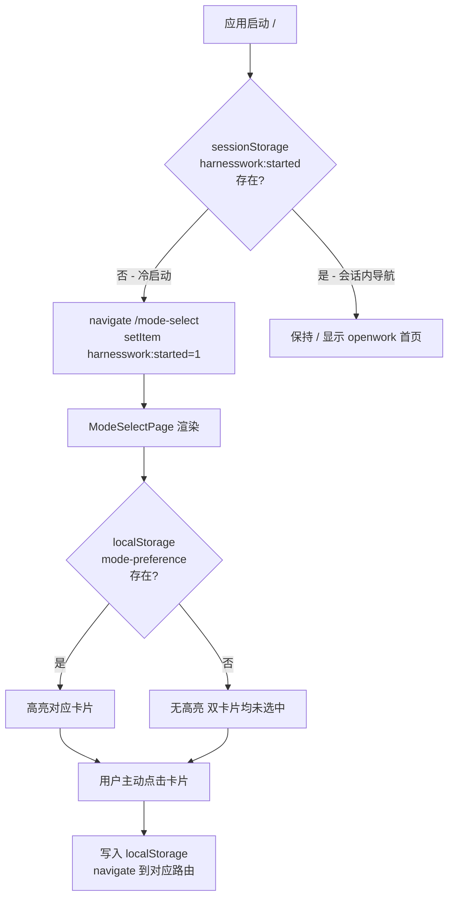
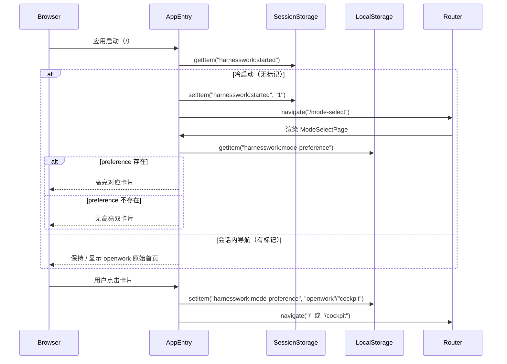

---
meta:
  id: SDD-003-startup-default-route
  title: 启动默认路由至模式选择页
  status: draft
  author: architect-agent
  reviewers: [tech-lead]
  source_prd: [PRD-002-dual-mode-workspace]
  revision: "1.0"
  created: "2026-04-08"
  updated: "2026-04-08"
---

# SDD-003 启动默认路由至模式选择页

## 元信息
- 编号：SDD-003-startup-default-route
- 状态：draft
- 作者：architect-agent
- 评审人：tech-lead
- 来源 PRD：[PRD-002-dual-mode-workspace](../prd/PRD-002-dual-mode-workspace.md)（FR-08 行为调整）
- 修订版本：1.0
- 创建日期：2026-04-08
- 更新日期：2026-04-08

---

## 1. 背景与问题域

PRD-002 在 PRD v1.0 中的 FR-08 描述为"下次启动自动进入上次模式"。实际实现（PRD-002 交付阶段）在 `entry.tsx` 中通过 `onMount` 检测 localStorage preference，如果为 `cockpit` 则自动跳转 `/cockpit`。

该行为存在两个问题：

1. **用户主动控制权丧失**：每次启动被自动跳转，用户不知道有模式切换入口，增加认知负担。
2. **冷启动默认路由不一致**：首次启动（无 preference）与后续启动（有 preference）体验不统一——首次无任何跳转，落在 openwork 原始首页；有 preference 后却跳过了选择页。

FR-08 v1.1 变更为：**冷启动始终显示 `/mode-select`，LocalStorage 仅用于高亮上次所选，不自动跳过选择页**。

---

## 2. 设计目标与约束

### 2.1 目标

| 目标 | 说明 |
|------|------|
| G1 | 应用冷启动后默认进入 `/mode-select`，首次无高亮，选择过后高亮上次所选 |
| G2 | 直接访问 `/` 路由（如用户在会话内回导航）仍正常显示 openwork 原始首页，不触发重定向 |
| G3 | localStorage 被清除后恢复为无预选状态（等同首次启动） |

### 2.2 约束

- **纯前端变更**：无需修改 Server 端，无新增 API。
- **不破坏 `/` 路由**：openwork 原有的首页路由 `/` 必须保持可用，不能被覆盖或拦截。
- **SolidJS + HashRouter**：路由跳转使用 `useNavigate()`，条件判断在 `onMount` 中执行。
- **平台兼容**：`sessionStorage` 在 Tauri 桌面壳和 Web 部署中均可用。

### 2.3 不在范围内

- 响应式适配（FR-09）
- 任何新增服务端接口
- 模式记忆的跨设备同步

---

## 3. 架构设计

### 3.1 架构概览



### 3.2 核心模块变更

#### 3.2.1 `apps/app/src/app/entry.tsx`

**变更前**：
```typescript
onMount(() => {
  if (!platform.storage) return;
  const pref = platform.storage("harnesswork").getItem("mode-preference");
  if (pref === "cockpit" && location.pathname === "/") {
    navigate("/cockpit");        // 旧：自动跳转 cockpit
  }
});
```

**变更后**：
```typescript
onMount(() => {
  // 冷启动检测：sessionStorage 无 "harnesswork:started" 标记
  if (location.pathname === "/" && !sessionStorage.getItem("harnesswork:started")) {
    sessionStorage.setItem("harnesswork:started", "1");
    navigate("/mode-select");    // 新：始终重定向到选择页
  }
});
```

**设计决策 D1（冷启动检测机制）**：

使用 `sessionStorage` 而非 `localStorage` 标记启动状态，原因：
- `sessionStorage` 在页面刷新（全量重启）时自动清除 → 刷新等同于冷启动，符合预期
- `sessionStorage` 在同一会话内用户导航回 `/` 时仍然存在 → 不触发二次重定向（满足 BH-03）
- 相比为路由添加 `meta.redirect` 配置，`onMount` 方案无需改动路由定义，兼容性更好

备选方案评估：
- **A. 让 `/` 直接渲染 ModeSelectPage**：会破坏 openwork 原有首页路由，不符合 BH-03
- **B. 路由级 navigate redirect**：需要修改 Router 配置，对 SolidJS HashRouter 兼容性存在风险
- **C. localStorage 标记**：清除 localStorage 后不会触发重定向，不符合 BH-05（localStorage 清除应恢复为无预选状态，但这需要搭配 sessionStorage 才能让重启重回选择页）

#### 3.2.2 `apps/app/src/app/pages/mode-select.tsx`

新增 `createSignal` 记录上次所选偏好，并在渲染时对对应卡片应用高亮样式。

**变更点**：
1. 读取 `platform.storage("harnesswork").getItem("mode-preference")` 初始化 `preference` signal
2. openwork 卡片：当 `preference() === "openwork"` 时应用 `highlighted` 样式类
3. cockpit 卡片：当 `preference() === "cockpit"` 时应用 `highlighted` 样式类
4. 高亮样式（`highlighted`）：使用 `ring-2 ring-white/60` 叠加于原有 border，区分但不覆盖原有交互态

**设计决策 D2（高亮实现方案）**：

| 方案 | 优点 | 缺点 | 选择 |
|------|------|------|------|
| `ring-2 ring-{color}/60` 叠加 | 不破坏原有 hover/focus 样式 | 需要额外 class | ✅ 选择 |
| 替换 border 颜色 | 简单 | 与 hover 态冲突 | ❌ |
| 添加勾选图标 | 视觉明确 | 布局影响大 | ❌ |

### 3.3 核心流程



---

## 4. 接口概述

本特性为纯前端路由变更，无新增 API 接口。

组件间新增 Props 变更：
- `ModeSelectPage`：无新增 Props（从 platform.storage 读取，内部状态）

---

## 5. 非功能性需求（NFR）

| 指标 | 目标值 | 说明 |
|------|--------|------|
| 冷启动重定向延迟 | < 16ms（1帧内） | onMount + sessionStorage 读写均为同步操作，无异步等待 |
| 高亮渲染 | 无额外 RTT | localStorage 读取为同步，首帧即可正确高亮，无闪烁 |

---

## 6. 测试策略

| 测试场景 | 验证方式 |
|---------|---------|
| BH-01：首次冷启动，无 preference | 清除所有 storage → 刷新 → 确认落在 `/mode-select`，无高亮 |
| BH-02：有 preference 的冷启动 | 设置 `harnesswork:mode-preference=cockpit` → 刷新 → 确认落在 `/mode-select`，cockpit 卡片高亮 |
| BH-03：会话内导航到 `/` | 冷启动后，navigating 到 `/mode-select` 选择 openwork → 确认落在 `/`，且再次 navigate(`/`) 不重定向 |
| BH-04：从驾驶舱点击返回 | 进入 `/cockpit` → 点击"返回模式选择" → 确认跳回 `/mode-select`（已有功能，回归验证） |
| BH-05：清除 localStorage 后重启 | 清除 localStorage → 刷新 → 确认无高亮 |

---

## 7. 关键决策记录

| 编号 | 决策 | 备选 | 选择理由 |
|------|------|------|---------|
| D1 | 使用 sessionStorage 标记冷启动 | localStorage 标记 / 路由 redirect | sessionStorage 随会话自动清除，刷新等同于冷启动，满足 BH-01/03/05 |
| D2 | `ring-2 ring-{color}/60` 高亮卡片 | 替换 border / 添加勾选图标 | 不破坏原有 hover 交互态，代价最小 |
