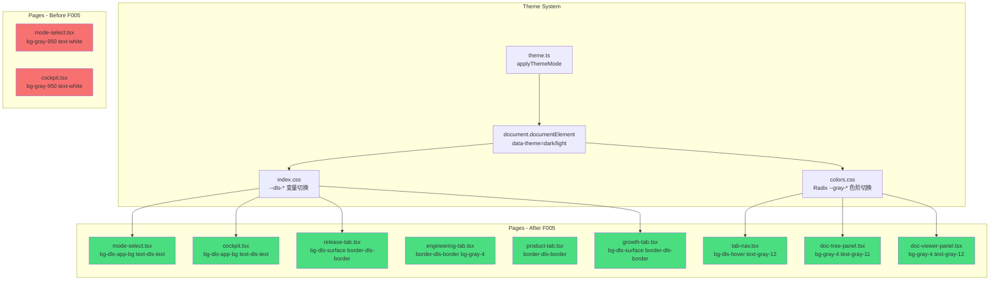
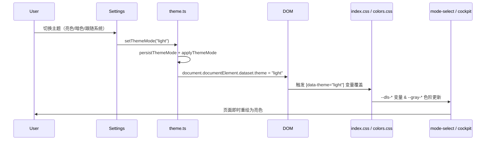

# SDD-005 模式选择页与工程驾驶舱页面主题自适应

## 元信息
- 编号：SDD-005
- 状态：draft
- 作者：architect-agent
- 评审人：tech-lead
- 来源 PRD：[PRD-002](../../../product/prd/PRD-002-dual-mode-workspace.md)
- 修订版本：1.0
- 变更历史：[]
- 创建日期：2026-04-08
- 更新日期：2026-04-08

## 1. 背景与问题域

harnesswork 的模式选择页（`/mode-select`）和工程驾驶舱（`/cockpit`）所有子组件在实现时使用了硬编码深色样式（`bg-gray-950`、`bg-gray-900`、`text-white`、`border-gray-800` 等 Tailwind 静态色阶）。这导致：

1. **亮色主题下完全不可读**：用户在设置中切换为「亮色」或「跟随系统（OS 亮色模式）」后，页面背景变为白色但文字依然是白色，边框消失。
2. **与应用既有主题系统脱节**：应用通过 `document.documentElement.dataset.theme` 控制 DLS CSS 变量切换（`index.css` 中 `[data-theme="dark"]` 块），其余页面（SessionView、SettingsShell 等）均使用 `bg-dls-surface`、`text-gray-12` 等语义 Token，与主题系统集成良好。两套新页面游离于主题体系之外。

## 2. 设计目标与约束

### 2.1 目标
- 将 9 个 UI 文件中的硬编码深色样式全部替换为 DLS 语义 Token 或 Radix 主题 Token
- 替换后，所有受影响页面在亮色、暗色、跟随系统三种主题下均正常显示
- 主题切换即时生效（无需刷新，依赖现有 CSS 变量机制）

### 2.2 约束
- **零运行时依赖**：不引入任何新的运行时主题库或 CSS-in-JS，完全依赖现有 DLS 变量 + Radix 色阶
- **零架构变更**：不新增 SolidJS Context、Store、Signal，不修改主题系统本身（`theme.ts`、`index.css`）
- **仅修改样式类名**：不变更组件逻辑、数据流、路由、测试
- **Tailwind `dark:` 不可用**：应用主题由 `data-theme` 属性驱动，Tailwind `darkMode: 'class'` 要求 `.dark` class，两者不匹配

### 2.3 不在范围内
- 主题系统本身的改造（`theme.ts`、`index.css`、`app.tsx`）
- 其他未被双模式工作区功能覆盖的页面（SessionView、SettingsShell 等已是主题自适应）
- 新增视觉回归测试 CI（当前 MVP 阶段，人工验收）

## 3. 架构设计

### 3.1 架构概览

### 3.2 核心模块说明

| 文件 | 替换重点 | Token 策略 |
|------|---------|-----------|
| `pages/mode-select.tsx` | 页面背景、卡片背景、边框、文字 | `bg-[var(--dls-app-bg)]`、`bg-dls-surface`、`border-dls-border`、Radix `gray-*` |
| `pages/cockpit.tsx` | 页面背景、header 边框、返回按钮 | `bg-[var(--dls-app-bg)]`、`border-dls-border`、`text-gray-10` |
| `components/cockpit/tab-nav.tsx` | 激活/非激活 Tab 颜色 | `border-blue-9`、`text-blue-11`、`bg-dls-hover`、`text-gray-10/12` |
| `components/cockpit/engineering-tab.tsx` | 骨架屏边框与填充 | `border-dls-border`、`bg-gray-4` |
| `components/cockpit/product-tab.tsx` | 侧边栏边框 | `border-dls-border` |
| `components/cockpit/doc-tree-panel.tsx` | STATUS_CLASS 状态标签、hover、骨架屏 | Radix `bg-green-3/blue-3/gray-4`、`text-gray-11/10/8` |
| `components/cockpit/doc-viewer-panel.tsx` | 骨架屏、文章颜色、prose | `bg-gray-4`、`text-gray-12`，移除 `prose-invert` |
| `components/cockpit/release-tab.tsx` | 卡片、行列、状态色 | `bg-dls-surface`、`border-dls-border`、`text-green-11/yellow-11/red-11` |
| `components/cockpit/growth-tab.tsx` | 卡片、行列、情感色、渠道色 | 同上，`text-blue-11` |

### 3.3 Token 映射规范

| 硬编码（旧） | 语义 Token（新） | 说明 |
|------------|----------------|------|
| `bg-gray-950` / `bg-gray-900` | `bg-[var(--dls-app-bg)]` / `bg-dls-surface` | 页面背景 / 卡片背景 |
| `bg-gray-800` | `bg-dls-hover` / `bg-gray-4` | hover 背景 / 内嵌卡片 |
| `border-gray-800` / `border-gray-700` | `border-dls-border` | 所有边框 |
| `text-white` | `text-gray-12` | 主要文字 |
| `text-gray-300` | `text-gray-11` | 次要文字 |
| `text-gray-400` | `text-gray-10` | 辅助文字 |
| `text-gray-500` / `text-gray-600` | `text-gray-9` / `text-gray-8` | 最弱文字 |
| `hover:bg-gray-800` | `hover:bg-dls-hover` | hover 状态 |
| `text-green-400` / `text-yellow-400` / `text-red-400` | `text-green-11` / `text-yellow-11` / `text-red-11` | 状态语义色 |
| `text-blue-300` / `text-blue-400` | `text-blue-11` | 品牌/强调色 |
| `bg-green-900 text-green-300` | `bg-green-3 text-green-11` | approved 状态标签 |
| `bg-blue-900 text-blue-300` | `bg-blue-3 text-blue-11` | released 状态标签 |
| `bg-gray-700 text-gray-300` | `bg-gray-4 text-gray-11` | draft 状态标签 |
| `bg-yellow-900/30 border-yellow-800 text-yellow-400` | `bg-yellow-3/50 border-yellow-7 text-yellow-11` | Mock 提示横幅 |
| `prose prose-invert` | `prose`（移除 `prose-invert`） | Markdown 文章排版 |

### 3.4 核心流程

## 4. 接口概述

本特性为纯前端样式替换，无 REST API 新增或变更。

| 接口 | 说明 |
|------|------|
| — | 不涉及后端接口 |

## 5. 非功能性需求（NFR）

| 指标 | 目标值 | 说明 |
|------|--------|------|
| 主题切换渲染延迟 | < 16ms（1 帧） | CSS 变量替换由浏览器原生处理，无 JS 阻塞 |
| 对比度（WCAG AA） | ≥ 4.5:1（正文） | 亮色/暗色双主题下均需满足 |
| 包体积变化 | 0 | 仅替换类名，无新增依赖 |
| 现有测试通过率 | 100% | 样式类名变更不影响 data-testid 选择器，测试应全绿 |

## 6. 测试策略
- 单元测试：现有组件测试基于 `data-testid` 选择器，本次变更不影响，应全绿
- 人工验收：在亮色/暗色/系统三种主题下逐项核查 BH-01 ~ BH-08 行为规格
- 视觉回归（可选，P2）：截图对比工具（Storybook Chromatic 或 Percy）

## 7. 待决事项与风险

| 编号 | 问题 | 责任人 | 截止 |
|------|------|--------|------|
| R1 | Tailwind safelist 若未包含动态 Token（如 `bg-blue-3`），生产构建可能被 tree-shake 移除 | dev | 编码前确认 tailwind.config.ts safelist |
| R2 | `prose` 无 `prose-invert` 在暗色主题下 h1/h2 等 typography 样式颜色是否由 CSS 变量正确驱动 | dev | 编码后人工验收 |
