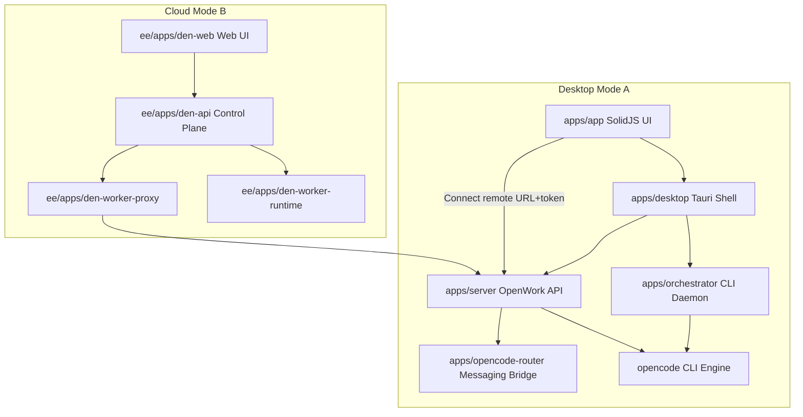
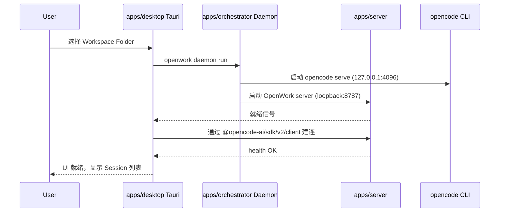
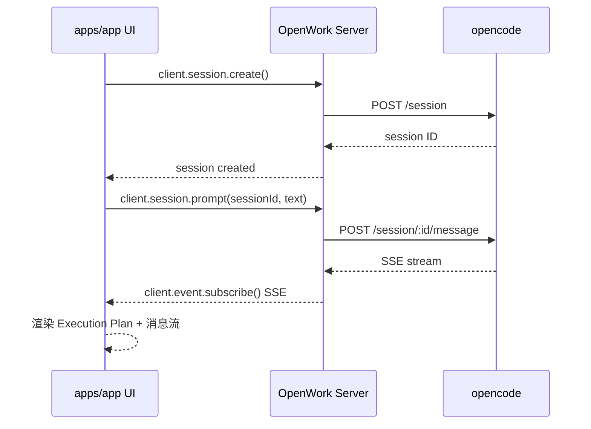
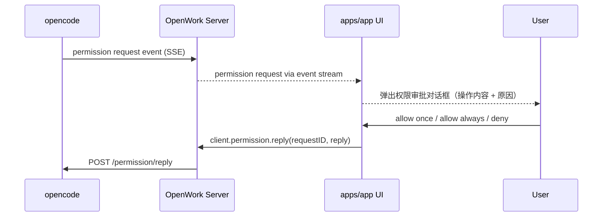
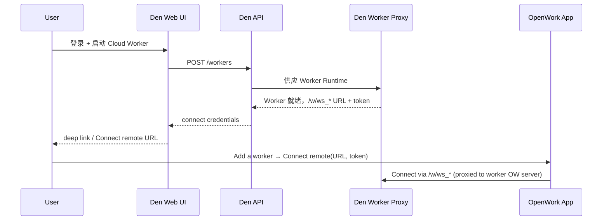

---
meta:
  id: SDD-001
  title: harnesswork 核心系统架构
  status: approved
  author: tech-lead
  reviewers: [architect]
  source_prd: [PRD-001]
  revision: "1.0"
  created: "2026-04-05"
  updated: "2026-04-05"
sections:
  background: "基于 OpenWork fork 的 AI 编码辅助桌面客户端，提供体验层包装 opencode 引擎"
  goals: "支持 Desktop Host 模式和 Web/Cloud Client 模式，通过 opencode SDK 解耦 UI 与引擎"
  architecture: "pnpm monorepo：apps/app SolidJS UI + apps/desktop Tauri + apps/server OpenWork API + apps/orchestrator 守护进程 + apps/opencode-router 消息桥接；ee/ EE 云端组件"
  interfaces: "OpenWork Server REST+SSE API：/session /event /permission/reply /workspace/:id/engine/reload /w/:id/*"
  nfr: "首次渲染 <2s，SSE 延迟 <200ms，并发 Session >=10，平台支持 macOS/Linux"
  test_strategy: "单元测试 vitest >60%，集成测试 socket/session 链路，多平台 CI e2e"
---

# SDD-001 harnesswork 核心系统架构

## 元信息
- 编号：SDD-001-core-architecture
- 状态：approved
- 作者：tech-lead
- 评审人：architect
- 来源 PRD：[PRD-001-core-product]
- 修订版本：1.0
- 创建日期：2026-04-05
- 更新日期：2026-04-05

## 1. 背景与问题域

harnesswork 基于 [OpenWork](https://github.com/different-ai/openwork) fork，是一个面向工程团队的 AI 编码辅助桌面客户端。OpenWork 在 opencode CLI（AI 编码引擎）之上，提供体验层（Experience Layer）：引导式上手、安全权限管理、实时进度可视化、工件管理和高品质 UI。

**核心设计原则**：
1. **Predictable > Clever**：优先可预测性，明确配置优于启发式自动检测
2. **最小化 Tauri 使用**：尽量把功能推到 openwork-server，通过 FS 操作和代理 opencode 服务，而非 Tauri 原生调用
3. **服务端路由 FS 写操作**：所有工作区文件变更通过 OpenWork server 路由，确保本地/远程模式行为一致
4. **opencode 优先**：永远优先使用 opencode API，不构建与 opencode API 不对应的"魔法"能力

## 2. 设计目标与约束

### 2.1 目标
- 支持 Desktop Host 模式（本地启动 opencode 运行时）和 Web/Cloud Client 模式（连接远程 OpenCode Server）
- UI 与 opencode 引擎解耦，通过 `@opencode-ai/sdk/v2/client` 标准 SDK 通信
- 支持 Skills/Plugins/MCP/Agents/Automations 等 opencode 扩展原语的可视化管理
- 同一套 UI 代码在桌面端（Tauri）、Web 端、移动端（浏览器）均可运行

### 2.2 约束
- 前端：SolidJS（响应式，非 React 生态）
- 桌面壳层：Tauri（Rust）
- 包管理：pnpm workspace monorepo + turbo 构建
- 运行时 Node.js 版本：与 pnpm@10.27.0 兼容；Bun 1.3.9+ 用于特定 server
- Tauri 文件操作只作为 fallback，不作为主要 feature surface
- 浏览器端不可直接读写任意本地文件，必须通过 OpenWork server 路由

### 2.3 不在范围内
- 替代 opencode CLI/TUI 的功能
- 构建不基于 opencode API 的独立 AI 推理能力
- opencode 引擎本身的修改（作为外部依赖使用）

## 3. 架构设计

### 3.1 架构概览

**两种运行模式说明**：
- **Mode A（Desktop Host）**：OpenWork 在本地桌面运行，Tauri 管理本地 opencode 进程生命周期，UI 通过 OpenWork server 访问 opencode
- **Mode B（Web/Cloud）**：用户登录 Den 控制面板，启动云端 Worker，通过 `Add a worker → Connect remote` 连接

### 3.2 核心模块说明

| 模块 | 路径 | 职责 | 技术栈 |
|------|------|------|--------|
| UI App | `apps/app/` | 产品体验层：Session 管理、SSE 流展示、权限审批、Skills/Plugin 管理、Settings | SolidJS、TypeScript |
| Desktop Shell | `apps/desktop/` | Tauri 壳层：托管 UI webview，管理本地服务进程生命周期，暴露 native commands | Tauri（Rust）+ TypeScript |
| OpenWork Server | `apps/server/` | API/控制层：代理 opencode API，管理工作区，处理 FS 写操作，routing opencode-router | Node.js（Bun runtime）|
| Orchestrator | `apps/orchestrator/` | CLI 守护进程：管理 openwork-server + opencode + opencode-router 的启动/停止/生命周期 | Node.js |
| OpenCode Router | `apps/opencode-router/` | 消息桥：Slack/Telegram → opencode session 的路由转发 | Node.js |
| Share Service | `apps/share/` | 分享链接发布服务：OpenWork bundle 导入的 share-link publisher | Node.js |
| Den Web | `ee/apps/den-web/` | 云控制面板 Web UI：登录、Cloud Worker 管理、Org 用户管理 | — |
| Den API | `ee/apps/den-api/` | 云控制平面 API：auth/session + Worker CRUD + 供应编排 | — |
| Den Worker Proxy | `ee/apps/den-worker-proxy/` | 代理层：保存 Daytona API key，刷新签名 worker 预览 URL，转发 worker 流量 | — |
| Den Worker Runtime | `ee/apps/den-worker-runtime/` | Worker 运行时打包：Docker/快照制品 + `openwork serve` 启动入口 | — |

**共享包（`packages/`）**：
- `packages/app/` — UI 共享组件/工具库
- `packages/docs/` — 文档共享资源
- `packages/ui/` — 基础 UI 组件库

### 3.3 核心流程

#### 流程一：Desktop Host 模式启动

#### 流程二：Session 创建与实时流

#### 流程三：权限审批

#### 流程四：Cloud Worker 连接

### 3.4 关键设计决策

#### 决策 1：FS 写操作必须通过 OpenWork Server 路由
- **理由**：服务端是唯一能在本地和远程工作区保持行为一致的地方；Tauri FS 写只在 desktop host 模式有效，破坏 web parity
- **影响**：任何 UI 功能修改工作区文件/配置，必须先调用 OpenWork server 端点；Tauri FS 只作 fallback

#### 决策 2：桌面端 OpenWork Server 使用动态端口（48000-51000 范围）
- **理由**：避免固定 8787 端口冲突；每个 workspace 持久化一个偏好端口
- **影响**：UI 在连接时通过 Orchestrator/Desktop 查询当前端口，不硬编码

#### 决策 3：opencode-router 使用 `(channel, identityId, peerId) → directory` 路由键
- **理由**：保持路由边界可预测；一个 router 实例管理一个 root，拒绝 root 外的目录
- **影响**：桌面端 router 单次运行时有效范围是当前激活的 workspace root

#### 决策 4：Reload-Required 统一流程
- **理由**：各 feature 不单独维护 reload banner，统一通过 `markReloadRequired()` 触发共享重启 popup
- **影响**：技能/插件/MCP/配置变更后调用统一 reload API，UI 层不感知变更来源

## 4. 接口概述

以下为 OpenWork Server 暴露的主要 API 路径（代理 opencode SDK）：

| 接口分组 | 方法 | 路径 | 描述 |
|---------|------|------|------|
| Health | GET | `/health` | 服务健康检查 |
| Session | POST | `/session` | 创建 Session |
| Session | GET | `/session` | 列出 Sessions |
| Session | GET | `/session/:id` | 获取 Session |
| Session | POST | `/session/:id/prompt` | 发送 Prompt |
| Session | POST | `/session/:id/abort` | 中止 Session |
| Events | GET | `/event` | SSE 事件订阅（实时流） |
| Permission | POST | `/permission/reply` | 回应权限请求 |
| Workspace | GET | `/workspace` | 列出 Workspaces |
| Workspace | POST | `/workspace/:id/engine/reload` | 重启 OpenCode 引擎（配置刷新） |
| Config | GET | `/config` | 获取 OpenCode 配置 |
| Config | GET | `/config/providers` | 获取 AI Provider 列表 |
| OpenCode Router | ALL | `/opencode-router/*` | 代理到本地 opencode-router HTTP API |
| Worker | ALL | `/w/:id/*` | 代理到 workspace-scoped OpenWork server |

## 5. 非功能性需求（NFR）

| 指标 | 目标值 | 说明 |
|------|--------|------|
| 首次渲染时间 | < 2s | 桌面端冷启动到 UI 可交互 |
| SSE 流端到端延迟 | < 200ms | opencode → UI 渲染 |
| 并发 Session 数 | ≥ 10 | 单 OpenWork server 实例 |
| OpenWork server 启动时间 | < 3s | 进程就绪到第一个请求成功 |
| 离线可用性 | Host 模式 100% | 不依赖网络 |
| 内存占用 | UI < 200MB | SolidJS + Tauri webview |
| 平台支持 | macOS arm64 / x64、Linux x64；Windows 付费 | Tauri 多平台构建 |
| 安全 — 权限审批 | default deny | 所有工具调用需用户显式授权 |
| 安全 — Dev 模式隔离 | `OPENWORK_DEV_MODE=1` | 开发模式使用独立 OpenCode 状态，不影响个人全局配置 |

## 6. 测试策略

- **单元测试**：核心 store/util 模块（`apps/app/src/app/lib/`）> 60% 覆盖，由 vitest 驱动
- **集成测试**：`src/test/` 目录，包含 socket/session 完整链路（参见 `apps/orchestrator` 的 harness socket 测试改进）
- **端到端测试**：通过 CI `ci-tests.yml` 在真实 Tauri 环境中运行
- **契约测试**：由后续 MODULE 文档驱动生成 Pact 契约，确保 OpenWork server API 与 SDK 类型对齐

## 7. 待决事项与风险

| 编号 | 问题/风险 | 责任人 | 说明 |
|------|----------|--------|------|
| Q1 | Host 模式引擎打包策略 | tech-lead | 随 OpenWork 应用捆绑 vs 用户独立安装 opencode CLI |
| Q2 | 移动端远程传输方式 | tech-lead | 仅支持 LAN vs 可选 Tunnel（如 ngrok/Cloudflare） |
| Q3 | Scheduling API 归属 | architect | Native in OpenCode server vs OpenWork-managed scheduler |
| R1 | opencode SDK 版本升级兼容性 | tech-lead | opencode API 变化可能导致 SDK 类型不一致；需锁定 `constants.json` 中的 `opencodeVersion` |
| R2 | Tauri webview 版本碎片化 | tech-lead | macOS WebKit / Linux WebKitGTK 版本差异影响 UI 渲染；WebKitGTK 4.1 为 Linux 必需 |

## 8. 修订历史

| 版本 | 日期 | 变更摘要 |
|------|------|----------|
| 1.0 | 2026-04-05 | 初始版本 — 基于 openwork ARCHITECTURE.md 和源码结构逆向生成 |
