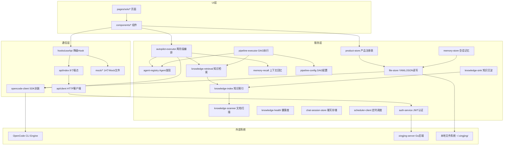
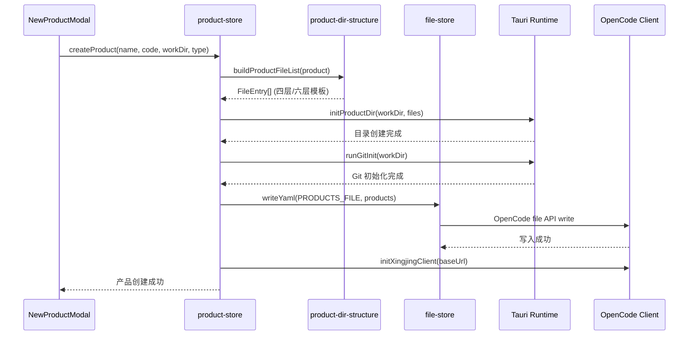
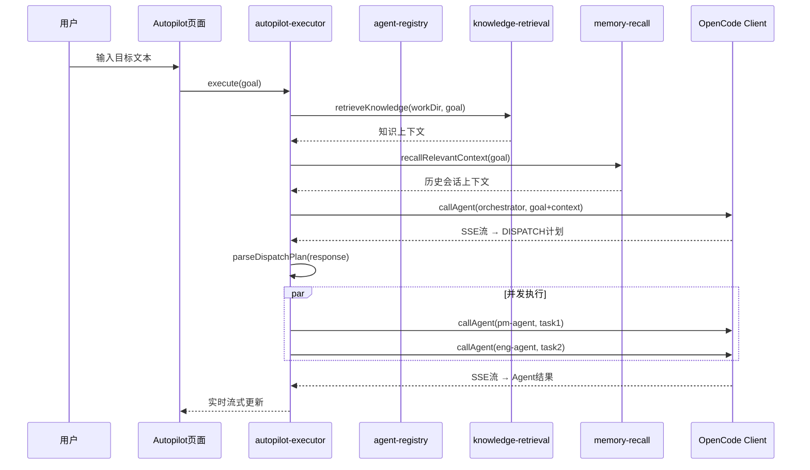

---
meta:
  id: SDD-002
  title: 星静扩展架构设计
  status: approved
  author: tech-lead
  reviewers: [architect]
  source_prd: [PRD-003]
  revision: "1.0"
  created: "2026-04-15"
  updated: "2026-04-15"
sections:
  background: "星静（Xingjing）是 harnesswork 的内嵌扩展模块，提供 AI 驱动的全流程产品开发能力"
  goals: "在 OpenWork 体验层之上构建完整的产品管理、AI 编排、知识融合体系"
  architecture: "分层架构：Pages → Components → Services → API/Store → OpenCode SDK；12+ 个 service 文件，14 个 mock 数据文件"
  interfaces: "xingjing-server REST API（认证）+ OpenCode SDK（Session/Event/Permission）+ 本地文件系统（products.yaml/memory/）"
  nfr: "离线可用、<500ms 知识检索、多层降级（API→Mock→localStorage）"
  test_strategy: "useApi Hook 自动降级覆盖，Mock 数据层全量覆盖业务场景"
---

# SDD-002 星静扩展架构设计

## 元信息
- 编号：SDD-002-xingjing-extension
- 状态：approved
- 作者：tech-lead
- 评审人：architect
- 来源 PRD：[PRD-003-xingjing-solo](../prd/PRD-003-xingjing-solo.md)
- 修订版本：1.0
- 创建日期：2026-04-15
- 更新日期：2026-04-15

## 1. 背景与问题域

星静（Xingjing）是 harnesswork 的内嵌扩展模块，位于 `apps/app/src/app/xingjing/` 目录下。它在 OpenWork 体验层（SDD-001）之上构建了完整的产品管理、AI 多 Agent 编排、三源知识融合、流水线调度等能力，面向创业者和小型团队提供全流程产品开发协作平台。

**核心设计原则**：
1. **本地优先**：所有数据通过 OpenCode file API 或 localStorage 本地持久化，不依赖远程服务
2. **多层降级**：OpenCode API → xingjing-server API → Mock 数据 → localStorage 兜底
3. **信号驱动**：使用 SolidJS `createSignal`/`createEffect` 实现细粒度响应式更新
4. **模块化服务**：每个业务领域一个独立 service 文件，通过函数导出解耦

## 2. 架构设计

### 2.1 架构概览



### 2.2 核心模块说明

| 模块 | 路径 | 职责 | 大小 |
|------|------|------|------|
| product-store | `services/product-store.ts` | 产品 CRUD、模式切换、注册表持久化 | ~557 行 |
| product-dir-structure | `services/product-dir-structure.ts` | Solo 四层 / Team 六层目录模板生成 | ~1200 行 |
| autopilot-executor | `services/autopilot-executor.ts` | 两阶段 AI 编排（Orchestrator + Agent 并发） | ~450 行 |
| agent-registry | `services/agent-registry.ts` | 文件驱动 Agent 发现 + 内置常量兜底 | ~200 行 |
| knowledge-index | `services/knowledge-index.ts` | 三源知识索引构建、TF-IDF 检索 | ~380 行 |
| knowledge-retrieval | `services/knowledge-retrieval.ts` | 统一检索入口、缓存管理、排序融合 | ~170 行 |
| knowledge-scanner | `services/knowledge-scanner.ts` | dir-graph.yaml 驱动的文档扫描 | ~400 行 |
| knowledge-health | `services/knowledge-health.ts` | 过期检测、一致性校验 | ~280 行 |
| knowledge-sink | `services/knowledge-sink.ts` | Agent 产出分流沉淀 | ~290 行 |
| knowledge-behavior | `services/knowledge-behavior.ts` | 行为知识分析 | ~140 行 |
| memory-store | `services/memory-store.ts` | 统一会话记忆（Chat+Autopilot+Pipeline） | ~280 行 |
| memory-recall | `services/memory-recall.ts` | 历史会话检索与上下文注入 | ~130 行 |
| chat-session-store | `services/chat-session-store.ts` | 聊天会话 localStorage 存储 | ~140 行 |
| pipeline-config | `services/pipeline-config.ts` | DAG 流程配置解析（手写 YAML 解析器） | ~230 行 |
| pipeline-executor | `services/pipeline-executor.ts` | DAG 执行器（并行/串行/门控） | ~230 行 |
| scheduler-client | `services/scheduler-client.ts` | 定时任务客户端（Cron 表达式） | ~200 行 |
| auth-service | `services/auth-service.ts` | JWT 认证、Token 管理 | ~210 行 |
| file-store | `services/file-store.ts` | YAML/JSON 文件读写 | ~950 行 |
| opencode-client | `services/opencode-client.ts` | OpenCode SDK 封装（Session/Event/Permission） | ~1050 行 |
| api/client | `api/client.ts` | 统一 HTTP 客户端（Bearer token 注入） | ~70 行 |
| api/index | `api/index.ts` | 8 个 API 端点模块定义 | ~175 行 |
| useApi | `hooks/useApi.ts` | API/Mock 自动降级 Hook | ~110 行 |

### 2.3 数据流设计

#### 产品管理数据流



#### Autopilot 执行数据流



### 2.4 存储模型

| 存储位置 | 用途 | 格式 | 读写通道 |
|---------|------|------|---------|
| `~/.xingjing/products.yaml` | 产品注册表 | YAML | OpenCode file API |
| `~/.xingjing/preferences.yaml` | 用户偏好（活跃产品、视图模式） | YAML | OpenCode file API |
| `~/.xingjing/memory/index.json` | 会话记忆索引（轻量） | JSON | OpenCode file API |
| `~/.xingjing/memory/sessions/{id}.json` | 会话详情（消息历史） | JSON | OpenCode file API |
| `~/.xingjing/solo/knowledge/` | 私有知识文件 | Markdown/YAML | OpenCode file API |
| `localStorage: xingjing_auth_token` | JWT 认证令牌 | 字符串 | 浏览器 API |
| `localStorage: harnesswork:*` | UI 状态（模式偏好、工作目录等） | 字符串 | 浏览器 API |
| `localStorage: xingjing-chat-sessions` | 聊天会话备份 | JSON | 浏览器 API |
| `.opencode/agents/*.md` | Agent 定义文件 | Markdown+YAML frontmatter | 文件系统 |
| `orchestrator.yaml` | 流水线 DAG 配置 | YAML | 文件系统 |

### 2.5 降级策略

```
优先级从高到低：

1. OpenCode file API（主通道）
   ↓ 失败
2. Tauri invoke（桌面端 fallback）
   ↓ 失败
3. localStorage（浏览器兜底）
   ↓ 失败
4. 内存存储（仅当前会话有效）

API 请求降级：
1. xingjing-server API（主通道）
   ↓ 失败
2. Mock 数据（useApi Hook 自动切换，UI 展示 isUsingFallback 标记）

知识检索降级：
1. 内存缓存（TTL 5分钟）
   ↓ 未命中
2. 磁盘缓存（TTL 10分钟）
   ↓ 未命中
3. 全量索引构建
   ↓ 失败
4. 空上下文（静默跳过，不阻塞 Agent 主流程）
```

## 3. 关键设计决策

### 决策 1：两阶段 Autopilot 编排
- **理由**：Orchestrator 负责意图解析和任务分解，各 Agent 独立 SSE session 避免单点串行瓶颈
- **影响**：每个 Agent 调用都是独立的 OpenCode session，支持真正的并发执行

### 决策 2：三源知识融合
- **理由**：行为知识（Skills）、私有知识（笔记）、工作空间文档（PRD/SDD）三源覆盖不同知识层次
- **影响**：检索时需要跨源统一排序，使用 TF-IDF + 多维度融合排序

### 决策 3：索引+详情分离的记忆存储
- **理由**：轻量索引文件（`index.json`）支持快速查询，按需加载详情避免内存膨胀
- **影响**：支持 200+ 历史会话，索引文件保持 < 100KB

### 决策 4：手写 YAML 解析器
- **理由**：避免引入 js-yaml 等外部依赖，保持构建体积最小化
- **影响**：仅支持 pipeline-config 使用的 YAML 子集，不支持全量 YAML 规格

### 决策 5：useApi Hook 双轨策略
- **理由**：开发阶段后端 API 可能不稳定，Mock 降级保证前端开发不阻塞
- **影响**：所有页面数据获取统一通过 useApi，自动管理 loading/error 状态

## 4. 接口概述

### 4.1 xingjing-server REST API（认证）

| 方法 | 路径 | 描述 |
|------|------|------|
| POST | `/api/v1/auth/login` | 用户登录（email + password → JWT） |
| POST | `/api/v1/auth/register` | 用户注册 |
| GET | `/api/v1/auth/me` | 获取当前用户信息 |
| PUT | `/api/v1/auth/profile` | 更新个人资料 |
| PUT | `/api/v1/auth/password` | 修改密码 |
| DELETE | `/api/v1/auth/account` | 删除账户 |

### 4.2 前端 API 模块（api/index.ts）

| 模块 | 端点前缀 | 操作 |
|------|---------|------|
| productsApi | `/api/products` | list / create / update / remove |
| prdsApi | `/api/prds` | list / create / update / remove |
| tasksApi | `/api/tasks` | list / create / update / remove |
| backlogApi | `/api/backlog` | list / create / update |
| sprintsApi | `/api/sprints` | list / create / update |
| knowledgeApi | `/api/knowledge` | list / create / update |
| metricsApi | `/api/metrics` | get / list |
| aiSessionsApi | `/api/ai-sessions` | list / create / get / poll |

## 5. 非功能性需求

| 指标 | 目标值 | 说明 |
|------|--------|------|
| 离线可用性 | 100% | Solo 模式全功能离线运行 |
| 知识检索延迟 | < 500ms | 含缓存命中 |
| 会话记忆容量 | 200 个 | 超限自动裁剪最旧记录 |
| Mock 降级延迟 | < 50ms | 无网络请求，直接返回内存数据 |
| 索引文件大小 | < 100KB | memory/index.json |
| 构建产物增量 | < 200KB | xingjing 模块 JS bundle |

## 6. 修订历史

| 版本 | 日期 | 变更摘要 |
|------|------|----------|
| 1.0 | 2026-04-15 | 初始版本 — 基于 xingjing 模块源码逆向生成 |
